# Labonity 用現場試験アプリ 設計書 v1.0

**出荷実績写真保存・OCR取込用黒板撮影・事前OCR・Sync Agent・Google Maps 連携・Liberty Account 認証・TP採取結果入力へのOCR結果反映方式**

| 項目 | 内容 |
|---|---|
| 文書区分 | 基本設計 |
| 対象 | 現場試験アプリ / Labonity TP採取結果入力 / Sync Agent / 写真管理クラウド / Liberty Account 連携 / AI OCR・LLM 取込 |
| 版 | v1.0 |
| 作成日 | 2026-06-10 |
| 目的 | 現場アプリで出荷実績に紐づく写真を保存し、OCR取込用黒板撮影モードで登録された写真をクラウド側で事前 OCR する。Sync Agent は OCR 結果と写真参照情報をローカル環境へ同期し、Labonity の TP採取結果入力画面では出荷実績を指定したときにローカルDB上の OCR 結果を確認・修正してフレッシュ試験値入力欄へ流し込めるようにする。 |
| 前提 | 現場アプリではフレッシュ試験値の入力、電子黒板合成、黒板レイアウト編集、TP採取結果の正式登録は行わない。Labonity デスクトップアプリはクラウド認証を行わず、クラウド API も Sync Agent のローカル API も呼び出さない。Labonity デスクトップアプリは、Sync Agent が同期したローカルDBおよびローカル写真キャッシュを参照する。 |

---

## 0. 設計概要

### 0.1 システム責務

本システムは、出荷実績を中心に、現場写真、OCR取込用黒板写真、事前 OCR 結果、TP採取結果入力画面を連携させる。

| 領域 | 管理主体 | 内容 |
|---|---|---|
| 現場・出荷予定・出荷実績の参照データ | Labonity ローカルDB / Sync Agent / クラウド | 現場アプリ表示用にクラウドへ同期する。 |
| 写真本体 | クラウド Blob Storage | 現場アプリからアップロードする。Base64 でDB保存しない。 |
| 写真メタデータ | クラウド DB | 写真、サムネイル、対象出荷、代表写真、OCR取込用黒板写真、削除状態を管理する。 |
| OCR実行 | クラウド OCR / LLM Worker | OCR取込用黒板写真の commit 後に自動実行する。Labonity デスクトップから実行依頼しない。 |
| OCR結果・品質情報 | クラウド DB | 抽出値、項目別信頼度、画像品質、警告、検証結果、モデル情報、プロンプト情報、処理時間、失敗理由を保存する。 |
| 写真参照メタデータ | ローカル連携キャッシュ | Sync Agent がクラウドから取得し、Labonity 側で出荷実績から写真有無を確認するために使用する。 |
| OCR結果参照データ | ローカル連携キャッシュ | Sync Agent がクラウドから取得し、Labonity 側で `syukka_id` から OCR 結果を確認・反映するために使用する。 |
| ローカル写真キャッシュ | Sync Agent / ローカルファイル領域 | OCR結果確認画面で読取元画像を表示するため、OCR取込用黒板写真とサムネイルをローカル保存する。 |
| TP採取結果データ | Labonity TP採取結果入力 | TP採取結果、フレッシュ試験値、縦割り、データ区分、保存状態を扱う。 |
| 認証・認可 | Liberty Account | 現場試験 Web アプリ、Sync Agent、クラウド API の利用者・組織・権限を判定する。 |

### 0.2 基本ルール

本設計での基本ルールは次の通りである。

```text
写真はクラウド上では Shipment.shipment_id に紐づける。
Labonity 側では syukka_id をキーにローカル参照テーブルを検索する。
OCR取込用黒板撮影モードで保存された写真だけを自動 OCR 対象にする。
OCR結果は syukka_id に紐づく事前 OCR 結果としてクラウドDBとローカル参照DBに保存する。
OCR結果には抽出値だけでなく、項目別信頼度、画像品質、警告、検証結果、モデル情報を保存する。
Labonity デスクトップアプリはクラウド認証を行わず、クラウドAPIを直接呼び出さない。
Labonity デスクトップアプリは Sync Agent に OCR 実行依頼を行わない。
Labonity 側では、ローカルDBの OCR 結果を確認・修正して、現在行の renban + datakubun の入力欄へ流し込む。
TP採取結果の正式保存は Labonity の通常保存処理で行う。
```

### 0.3 Labonity 仕様との対応

| 仕様領域 | 設計への反映 |
|---|---|
| 出荷予定 | `YoteiDataMain` は `yotei_id` を主キーとし、予定日は `syukka_yoteibi`、予定 No は `yotei_no`、工場は `kozyo_id` を持つ。クラウド側では `tenant_id + plant_id + source_local_id` を同期キーにする。 |
| 出荷実績 | `SyukkaDataMain` は `syukka_id` を主キーとし、`yotei_id`、`seq_no`、`syukka_nengappi`、`syukka_zikoku`、`syaban`、`syukkaryo`、`seizoryo`、`kozyo_id` を持つ。写真と事前 OCR 結果はこの出荷実績を対象に登録する。 |
| 現場 | `Genba` は現場名・住所、`Genba_Syukka` は出荷用現場名・緯度・経度を持つ。地図連携では住所と緯度経度を組み合わせて使用する。 |
| TP採取結果 | `TestPieceSaisyu_FreshSiken` は `testpiecesaisyu_main_id + renban + datakubun` でフレッシュ試験行が決まる。OCR結果の反映先は Labonity 画面が保持する現在行の `renban` と現在表示中の `datakubun` で特定する。 |
| TP と出荷の関係 | `TestPieceSaisyu_SyukkaData` は `testpiecesaisyu_main_id + renban + syukka_id` の関係を持つ。縦割り時も `renban` ごとに対象の出荷実績が決まる。 |

---

## 1. 基本方針

### 1.1 現場アプリの役割

現場アプリの役割は、**その日の出荷予定・出荷実績を確認し、対象出荷に写真を追加すること**である。

現場アプリで行うことは次の範囲に限定する。

- Liberty Account によるログイン
- 利用組織の選択
- 出荷予定一覧の確認
- 出荷実績一覧の確認
- 出荷実績詳細の確認
- 現場住所から Google Maps を開く
- 出荷実績に紐づく通常写真の追加
- OCR取込用黒板撮影モードによる黒板写真の追加
- OCR取込用黒板写真の撮り直し・差し替え
- 端末カメラによる撮影
- 端末内写真の選択
- 写真のプレビュー確認
- 画質警告の確認
- 写真の保存・同期
- 写真一覧・写真詳細の確認
- 代表写真の確認・変更
- OCR取込用黒板写真の撮影状態・OCR処理状態の確認

現場アプリで行わないことは次の通りである。

- フレッシュ試験値の入力
- TP採取結果入力の代替
- TP採取データの正式作成
- 供試体セット・ピースの作成
- 電子黒板合成写真の作成
- 黒板レイアウトの編集
- OCR結果の手修正
- OCR結果の Labonity DB への保存
- 出荷予定・出荷実績・現場マスターの編集
- 写真台帳・帳票出力
- Labonity ローカルDBへの直接書き込み

### 1.2 写真の扱い

写真は、**出荷実績に紐づく写真**として扱う。

現場では、黒板が写った写真だけでなく、現場状況、測定状況、補足写真などを追加する可能性がある。そのため、通常写真の主操作名は **[写真を追加]** とする。

一方、OCR 取込に使う写真は、通常写真の分類選択ではなく、専用の **[OCR取込用黒板を撮影]** 操作から登録する。

```text
[写真を追加]
  現場状況、測定状況、補足写真などを保存する通常写真。

[OCR取込用黒板を撮影]
  Labonity のフレッシュ試験値取込に使う黒板写真。
  保存後、クラウド側で自動 OCR する。
```

通常写真については写真分類を行わない。

- 画面上で「黒板」「その他」などの任意分類を選ばせない。
- DB の必須項目として一般的な `photo_category` を持たせない。
- 写真種別による絞込は行わない。

OCR取込用黒板写真については、分類ではなく **業務用途フラグ**として扱う。

| 項目 | 内容 |
|---|---|
| 通常写真 | `capture_purpose = general`。OCR対象にしない。 |
| OCR取込用黒板写真 | `capture_purpose = fresh_test_ocr_blackboard`。保存後に自動 OCR 対象にする。 |

### 1.3 OCR取込用黒板写真の扱い

OCR取込を使いたい場合、現場担当者は対象の出荷実績に対して **1 枚の OCR取込用黒板写真**を撮影する。

| 項目 | 方針 |
|---|---|
| 撮影単位 | 出荷実績 1 件につき、OCR取込用黒板写真 1 枚を基本とする。 |
| 自動OCR | OCR取込用黒板写真の commit 後、クラウド側で自動 OCR する。 |
| 通常写真 | 通常写真は自動 OCR しない。 |
| 差し替え | 撮り直し時は新しい写真を現在の OCR取込用黒板写真とし、古い OCR 結果は `superseded` にする。 |
| 忘れ防止 | 出荷予定一覧・出荷実績一覧・詳細に「OCR未撮影 / OCR予約済 / OCR読取中 / OCR済 / 要確認 / 失敗」を表示する。通常写真は「OCR対象外」として区別する。 |
| 費用抑制 | OCR取込用黒板撮影モードで撮影された写真だけを OCR 実行対象にする。 |
| 品質確保 | 撮影直後にプレビュー、ぼけ・暗さ・傾き警告を表示する。 |

OCR取込用黒板写真が未撮影でも、Labonity の通常入力業務は継続できる。この場合、TP採取結果入力画面では OCR 取込を行わず、手入力する。

### 1.4 代表写真の扱い

代表写真は、一覧・詳細画面で最初に表示するための補助情報である。OCR 対象を固定するための項目ではない。

- 1 枚目の通常写真を自動で代表にする。
- すでに代表写真がある場合、追加写真は代表にしない。
- ユーザーは写真詳細または複数写真確認画面から代表写真を変更できる。
- 同一出荷実績に対して代表写真は 1 件のみとする。
- 代表写真が削除された場合、残り写真のうち表示順が最も小さい写真を代表にする。
- OCR取込用黒板写真を代表写真にしてもよいが、代表写真であることと OCR 取込用であることは別の属性として扱う。

### 1.5 Labonity 側の役割

Labonity 側では、TP採取結果入力画面から対象 TP を作成または表示し、対象の出荷実績を指定する。

指定した出荷実績に同期済みの OCR 結果がある場合、Labonity 側はローカルDBから OCR 結果を読み取り、OCR結果確認画面を表示する。ユーザーは OCR 値、項目別信頼度、警告、現在値との差分、読取元写真を確認し、必要に応じて修正したうえで TP採取結果入力画面の入力欄へ反映する。

Labonity 側では次を行わない。

- クラウド認証
- クラウド API 呼び出し
- Sync Agent への OCR 実行依頼
- OCR エンジンの実行
- 写真選択による OCR 実行
- OCR API による Labonity DB への直接保存

Labonity 側が行うことは次の通りである。

- `syukka_id` に対応するローカル OCR 結果を検索する。
- OCR結果確認画面を表示する。
- OCR値、信頼度、警告、現在値との差分を表示する。
- ユーザーが確定した値を、現在行の `renban + datakubun` の入力欄へ反映する。
- 反映後、保存前であることを明示する。
- ユーザーの通常保存操作で Labonity DB に保存する。
- OCR 反映監査をローカルに記録する。

### 1.6 Labonity 連携境界

Labonity 側の業務データとクラウド側の写真・OCRデータは、次の境界で連携する。

| 項目 | 内容 |
|---|---|
| Labonity 側の保存責務 | TP採取結果、フレッシュ試験値、供試体セット、ピース、出荷紐づけの正式保存を扱う。 |
| クラウド側の保存責務 | 現場アプリ表示用の参照データ、写真本体、写真メタデータ、OCRジョブ、OCR結果、OCR品質情報、抽出JSONを扱う。 |
| Sync Agent の責務 | ローカルDBからクラウドへの基幹参照データ同期、クラウドからローカルへの写真参照・OCR結果・ローカル写真キャッシュ同期を行う。 |
| Labonity 側の参照 | `FieldOcrResultReference` / `FieldOcrResultFieldReference` / `FieldPhotoReference` / ローカル写真キャッシュを参照する。 |
| 画面反映 | ユーザー確認済みの OCR 値は Labonity 画面の入力欄へ反映する。 |
| 保存タイミング | ユーザーが TP採取結果入力画面の保存操作を行った時点で Labonity DB に保存される。 |
| 反映先行 | `renban` と `datakubun` は Labonity 画面の現在コンテキストとして扱う。OCR結果側では固定しない。 |

### 1.7 Sync Agent の役割

Sync Agent は、各社ローカルDBからクラウドへ現場アプリに必要な参照データを同期し、クラウドからローカルへ写真参照情報・OCR結果・OCR取込用黒板写真を同期するサービスである。

- 現場関連データは、ローカルDBからクラウドへ同期する。
- 出荷予定関連データは、ローカルDBからクラウドへ同期する。
- 出荷実績関連データは、ローカルDBからクラウドへ同期する。
- 現場アプリから基幹データへ書き戻しは行わない。
- 写真本体はクラウド Blob Storage に保存する。
- 写真メタデータは、Labonity 側が参照できるよう、ローカル参照用テーブルへ同期する。
- OCR結果は、Labonity 側が参照できるよう、ローカル OCR 参照用テーブルへ同期する。
- OCR取込用黒板写真およびサムネイルは、Labonity 側の確認画面で表示できるよう、ローカルファイルキャッシュへ保存する。
- Sync Agent は OCR 実行依頼を Labonity から受け付けない。OCR はクラウド側で事前実行された結果を同期する。

---

## 2. 全体構成

### 2.1 全体業務フロー

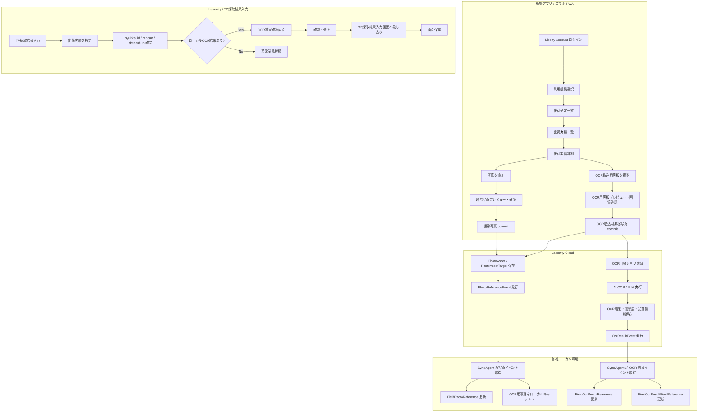

### 2.2 Sync Agent を含む構成

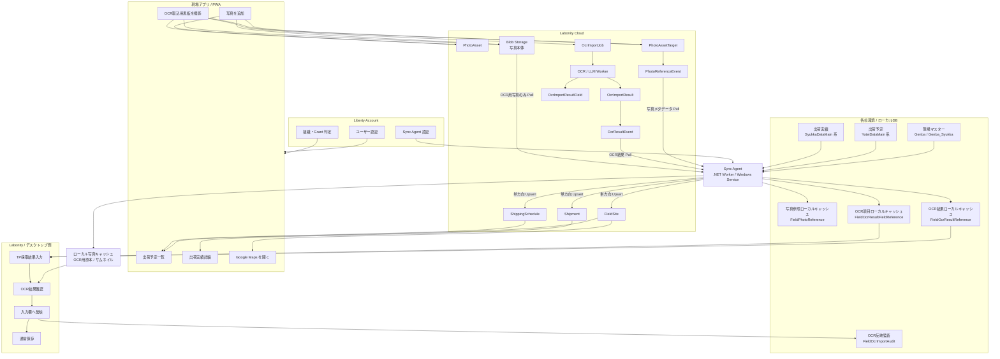

### 2.3 TP採取結果入力との連携

TP採取結果入力画面との連携は、出荷実績と画面コンテキストで行う。

| 領域 | クラウド | ローカル / Labonity |
|---|---|---|
| 出荷実績 | `Shipment.shipment_id` と `source_local_id = syukka_id` を保持する。 | `SyukkaDataMain.syukka_id` を持つ。 |
| 写真 | `PhotoAsset` / `PhotoAssetTarget` で管理する。OCR取込用黒板写真は `capture_purpose` で識別する。 | `FieldPhotoReference` で写真有無・ローカルキャッシュ状態を参照する。 |
| OCR結果 | `OcrImportJob` / `OcrImportResult` / `OcrImportResultField` で管理する。 | `FieldOcrResultReference` / `FieldOcrResultFieldReference` で `syukka_id` から参照する。 |
| フレッシュ試験行 | 永続キーとしては扱わない。 | `testpiecesaisyu_main_id + renban + datakubun` で保存する。 |
| OCR 反映先 | OCR 結果は `syukka_id` に紐づく。`renban` と `datakubun` は持たせない。 | 現在行の `renban` と現在表示中の `datakubun` に反映する。 |
| DB 保存 | OCR結果はクラウドDBとローカル参照DBに保存するが、Labonity の TP DB へは直接保存しない。 | TP採取結果入力画面の保存操作で保存する。 |

---

## 3. 認証・認可・マルチテナント設計

### 3.1 基本方針

現場試験 Web アプリ、クラウド API、Sync Agent は Liberty Account の仕組みを使用して認証・認可を行う。

Labonity デスクトップアプリは Liberty Account によるクラウド認証を行わない。Labonity デスクトップアプリは、Sync Agent がローカルへ同期済みのデータを参照する。

| 項目 | 方針 |
|---|---|
| 認証基盤 | Liberty Account。 |
| 現場試験 Web アプリ | OAuth2 Authorization Code + PKCE を使用する。 |
| Sync Agent | Liberty Account のサービス主体または機密クライアントで非対話認証する。 |
| Labonity デスクトップ | クラウド認証しない。クラウドAPIを呼び出さない。Sync Agent への OCR 実行依頼もしない。 |
| テナント ID | Liberty Account の `orgId` を本システムの `tenant_id` として扱う。 |
| 利用可否 | `serviceCode = LABONITY_FIELD_TEST` の Grant とサービスメンバー状態で判定する。 |
| API 境界 | `/api/core/v1/orgs/{orgId}/...`、`/api/sync/v1/orgs/{orgId}/...` のように orgId を URL に含める。 |
| データ分離 | URL の orgId、トークンの所属 org、DB の `tenant_id` が一致する場合だけアクセスを許可する。 |

### 3.2 現場試験 Web アプリのログイン

ログインフローは次の通りである。

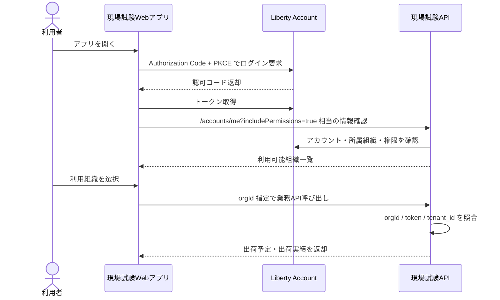

ログイン後、アプリは次を行う。

1. 呼び出し元アカウントの `accountId`、メール、表示名を取得する。
2. `includePermissions=true` により、所属組織ごとの権限を取得する。
3. `LABONITY_FIELD_TEST` の Grant が利用可能な組織だけを候補にする。
4. 複数組織に所属する場合は、利用組織選択画面を表示する。
5. 選択した `orgId` をアプリの現在テナントとして保持する。

### 3.3 組織選択

複数組織に所属するユーザーは、ログイン後に利用組織を選択する。

```text
+----------------------------------+
| 利用組織を選択                   |
|----------------------------------|
| ログインユーザー: yamada@example |
|                                  |
| [ ABC生コン株式会社 ]            |
|   現場試験アプリ 利用可          |
|                                  |
| [ XYZ工業株式会社 ]              |
|   現場試験アプリ 利用可          |
|                                  |
+----------------------------------+
```

選択後は、全 API 呼び出しに orgId を含める。

```http
GET /api/core/v1/orgs/{orgId}/shipping-schedules?date=2026-06-10
```

### 3.4 サービス Grant 判定

現場試験アプリのサービスコードは次とする。

```text
LABONITY_FIELD_TEST
```

Grant 判定では次を確認する。

| 判定項目 | 内容 |
|---|---|
| 組織所属 | ユーザーが対象 orgId に所属している。 |
| 組織メンバー状態 | `ACTIVE` のメンバーである。 |
| サービス Grant | `LABONITY_FIELD_TEST` が対象 orgId で利用可能である。 |
| サービスメンバー | 対象ユーザーがサービス利用可能メンバーである。 |
| 有効期間 | Grant の有効期間内である。 |
| ロール権限 | 操作に必要な権限コードを持つ。 |

### 3.5 権限コード

現場試験アプリでは、次の権限コードを使用する。

| 権限コード | 用途 |
|---|---|
| `FieldTest:Schedule:Read` | 出荷予定一覧、出荷予定詳細の参照。 |
| `FieldTest:Shipment:Read` | 出荷実績一覧、出荷実績詳細の参照。 |
| `FieldTest:Photo:Read` | 写真一覧、サムネイル、写真状態の取得。 |
| `FieldTest:Photo:Write` | 通常写真アップロード、写真 commit、代表写真設定。 |
| `FieldTest:Photo:Delete` | 写真の論理削除。 |
| `FieldTest:OcrBlackboard:Capture` | OCR取込用黒板写真の撮影・保存・差し替え。 |
| `FieldTest:OcrBlackboard:Read` | 現場アプリ上で OCR 処理状態・結果概要を参照する。 |
| `FieldTest:Sync:Import` | Sync Agent による基幹参照データ import。 |
| `FieldTest:Sync:Read` | Sync Agent による写真・OCR結果イベント取得。 |
| `FieldTest:Sync:Ack` | Sync Agent によるイベント ACK。 |
| `FieldTest:Sync:PhotoCache` | Sync Agent による OCR取込用写真のローカルキャッシュ取得。 |
| `FieldTest:Admin:Manage` | 管理設定、手動再同期、同期状況、OCR失敗状況の確認。 |

### 3.6 ロール例

| ロール | 代表権限 |
|---|---|
| 現場担当者 | `Schedule:Read`, `Shipment:Read`, `Photo:Read`, `Photo:Write`, `OcrBlackboard:Capture`, `OcrBlackboard:Read` |
| 品質管理担当 | `Schedule:Read`, `Shipment:Read`, `Photo:Read`, `OcrBlackboard:Read` |
| 事務所担当 | `Schedule:Read`, `Shipment:Read`, `Photo:Read`, `OcrBlackboard:Read` |
| 管理者 | 上記に加え `Photo:Delete`, `Admin:Manage` |
| Sync Agent | `Sync:Import`, `Sync:Read`, `Sync:Ack`, `Sync:PhotoCache` |

### 3.7 Sync Agent 認証

Sync Agent は対話ログインを行わない。テナント・工場・エージェント単位に発行された credential を使用してクラウド API へ接続する。

| 項目 | 内容 |
|---|---|
| 認証方式 | Client Credentials または Liberty Account のサービス主体認証。 |
| スコープ | `orgId + plantId + agentId` で固定する。 |
| 利用可能 API | `/api/sync/v1/...` のみ。 |
| 現場アプリ API | Sync Agent credential では使用不可。 |
| OCR 実行 | Sync Agent は OCR 実行依頼を送らない。クラウド側で完了した OCR 結果を取得する。 |
| 監査 | import、event pull、ack、photo cache download、ocr result sync をすべて AuditLog に記録する。 |

### 3.8 テナント分離

全テーブルに `tenant_id` を保持し、すべての検索・更新条件に含める。

| 対象 | 分離方法 |
|---|---|
| DB | `tenant_id` 必須。主な UNIQUE / INDEX に `tenant_id` と `plant_id` を含める。 |
| Blob | `orgId/plantId/...` をパスに含める。 |
| IndexedDB | ログイン orgId ごとにストアまたはキー空間を分離する。 |
| API | URL の orgId とトークン所属 org の一致を検証する。 |
| Sync Agent | credential に許可 orgId / plantId を紐づける。 |
| ローカルDB | `tenant_id + plant_id` を保持し、Labonity 側の検索条件に含める。 |
| ローカル写真キャッシュ | `orgId/plantId/syukkaId/photoAssetId` を含むパスで分離する。 |
| ログ | すべての監査ログに `tenant_id`、`account_id` または `agent_id` を保持する。 |

---

## 4. データ同期設計

### 4.1 同期方向

| 領域 | 同期方向 | 用途 |
|---|---|---|
| 現場関連データ | ローカルDB → クラウド | 現場名、住所、地図、出荷詳細表示に使用する。 |
| 出荷予定関連データ | ローカルDB → クラウド | 現場アプリの出荷予定一覧に使用する。 |
| 出荷実績関連データ | ローカルDB → クラウド | 出荷実績一覧・詳細、写真紐づけ、OCR結果の出荷キーに使用する。 |
| 写真本体 | 現場アプリ → Blob Storage | 現場で発生する写真本体を保存する。 |
| 写真メタデータ | クラウド → ローカル参照テーブル | Labonity 側で写真有無、読取元写真、写真状態を判定する。 |
| OCR結果 | クラウド → ローカル OCR 参照テーブル | Labonity 側で `syukka_id` から OCR 結果を取得する。 |
| OCR取込用写真キャッシュ | クラウド Blob Storage → ローカルファイル | Labonity 側で OCR結果確認時に読取元画像を表示する。 |

### 4.2 Sync Agent の配置

| 項目 | 内容 |
|---|---|
| 実行形態 | .NET Worker Service / Windows Service。 |
| 配置場所 | 各社のローカルDBへ接続できる社内ネットワーク上。 |
| 通信方向 | Sync Agent からクラウドAPIへのアウトバウンド HTTPS。 |
| 認証 | Liberty Account の Sync Agent credential。テナント / 工場 / エージェント単位で発行する。 |
| 認可スコープ | `tenant_id + plant_id` を基本にする。予定Noや出荷Noの混線を防ぐ。 |
| 冪等性 | `source_system` / `source_table` / `source_local_id` / `source_hash` / `idempotency_key` で担保する。 |
| ローカルDB接続 | ローカルDBの読み取りを基本とする。写真参照・OCR結果の反映先は連携用ローカルキャッシュとする。 |
| 写真キャッシュ | OCR取込用黒板写真とサムネイルをローカルファイルに保存する。通常写真の原本は原則キャッシュしない。 |

### 4.3 現場関連データ

| クラウドテーブル | 元データ例 | 主な用途 |
|---|---|---|
| `FieldSite` | `Genba`, `Genba_Syukka` | 現場名、住所、地図、出荷表示。 |
| `FieldSiteContact` | `Genba_Renrakusaki` 等 | 連絡先表示が必要な場合。 |
| `FieldSiteConcreteSpec` | `Genba_Haigo` 等 | 配合・現場別表示補助が必要な場合。 |

`FieldSite` の最低限必要な項目は次の通り。

| 項目 | 説明 |
|---|---|
| `field_site_id` | クラウド側ID。 |
| `tenant_id` | Liberty Account の orgId。 |
| `plant_id` | 工場ID。 |
| `source_local_id` | ローカル `Genba.id` 等。 |
| `site_name1` / `site_name2` | 現場名。 |
| `shipping_site_name1` / `shipping_site_name2` | `Genba_Syukka` の出荷用現場名。 |
| `site_short_name` | 略称。 |
| `address1` / `address2` | Google Maps 起動に使う住所。 |
| `latitude` / `longitude` | `Genba_Syukka.ido` / `Genba_Syukka.keido` を正規化して保持する。 |
| `map_query_text` | 住所と現場名から生成した検索文字列。 |
| `updated_source_at` | ローカル側最終更新日時。 |
| `source_hash` | 差分判定用ハッシュ。 |

### 4.4 出荷予定関連データ

| クラウドテーブル | 元データ例 | 主な用途 |
|---|---|---|
| `ShippingSchedule` | `YoteiDataMain` | 出荷予定一覧。 |
| `ShippingScheduleNote` | `YoteiData_Biko` | 必要に応じて備考表示。 |
| `ShippingScheduleTpFlag` | `YoteiData_TpSaisyu`, `YoteiData_Okinawa` 等 | TP 対象参考表示。 |

`ShippingSchedule` の最低限必要な項目は次の通り。

| 項目 | 説明 |
|---|---|
| `shipping_schedule_id` | クラウド側ID。 |
| `tenant_id` | テナント ID。 |
| `plant_id` | `YoteiDataMain.kozyo_id` 相当。 |
| `source_local_id` | ローカル `yotei_id`。 |
| `shipping_date` | `syukka_yoteibi`。 |
| `schedule_no` | `yotei_no`。予定No単独では一意にしない。 |
| `field_site_id` | 現場ID。 |
| `field_site_source_local_id` | ローカル `genba_id`。 |
| `mix_id` / `mix_name` | 配合。 |
| `scheduled_time` | 予定時刻。 |
| `planned_vehicle_count` | 出荷予定台数。 |
| `planned_quantity` | 出荷予定数量。 |
| `source_hash` | 差分判定用ハッシュ。 |

推奨自然キーは次の通り。

```text
tenant_id + plant_id + source_system + source_table + source_local_id
```

予定Noを表示・検索に使う場合も、内部処理では `plant_id` を必ず併用する。

### 4.5 出荷実績関連データ

| クラウドテーブル | 元データ例 | 主な用途 |
|---|---|---|
| `Shipment` | `SyukkaDataMain` | 出荷実績一覧・詳細、写真紐づけ、OCR結果の出荷キー。 |
| `ShipmentTpTarget` | `SyukkaData_TpSaisyu` | TP 対象情報の参考表示。 |
| `ShipmentSlip` | `SyukkaData_Denpyo` | 伝票系情報が必要な場合。 |

`Shipment` の最低限必要な項目は次の通り。

| 項目 | 説明 |
|---|---|
| `shipment_id` | クラウド側ID。写真紐づけの `PhotoAssetTarget.target_id`。 |
| `tenant_id` | テナント ID。 |
| `plant_id` | `SyukkaDataMain.kozyo_id` 相当。 |
| `source_local_id` | ローカル `SyukkaDataMain.syukka_id`。 |
| `shipping_schedule_id` | クラウド出荷予定ID。 |
| `shipping_schedule_source_local_id` | ローカル `YoteiDataMain.yotei_id`。 |
| `seq_no` | 出荷実績の Seq No。 |
| `shipping_date` | 出荷日。 |
| `shipping_time` | 出荷時刻。 |
| `vehicle_no` | 車番。 |
| `quantity` | 出荷数量。 |
| `manufactured_quantity` | 製造量。 |
| `field_site_id` | 現場ID。 |
| `mix_id` / `mix_name` | 配合。 |
| `tp_target_flag` | TP 採取対象参考フラグ。 |
| `source_hash` | 差分判定用ハッシュ。 |

### 4.6 差分同期方式

| 項目 | 内容 |
|---|---|
| 差分検出 | `rowversion`、最終更新日時、または対象項目の `source_hash` を使用する。 |
| Upsert | `tenant_id + plant_id + source_system + source_table + source_local_id` を自然キーにする。 |
| 削除 | 物理削除ではなく `deleted_at` / `is_deleted` を同期する。 |
| 再送 | 同一 `idempotency_key` は重複登録しない。 |
| チェックポイント | テーブルごと・テナントごと・工場ごとに `SyncCheckpoint` を保持する。 |
| フル同期 | 夜間または手動で再同期できるようにする。 |

### 4.7 同期周期

| データ | 推奨周期 |
|---|---|
| 当日・翌日の出荷予定 / 出荷実績 | 1〜5分。 |
| 現場マスター | 5〜30分、または変更検知時。 |
| 過去データ補正 | 夜間バッチまたは手動再同期。 |
| 写真メタデータイベント | 1〜5分。 |
| OCR結果イベント | 1〜5分。OCR結果確認前に Sync Agent が最新状態へ追従できることを目標にする。 |
| OCR取込用写真キャッシュ | OCR結果イベント取得後、優先的に取得する。 |

---

## 5. 出荷実績未同期時の扱い

### 5.1 基本方針

現場アプリでは、写真は同期済みの出荷実績を選択して登録する。

対象の出荷実績がクラウドにまだ同期されておらず、出荷実績一覧または出荷実績詳細に表示されていない場合、予定・車番・時刻などを使って写真だけを先にクラウド保存する機能は実装しない。

この場合は、ユーザーに同期待ちであることを表示し、出荷実績の再取得を促す。Sync Agent が次回同期で出荷実績をクラウドへ反映した後、ユーザーが対象出荷を選択して通常写真または OCR取込用黒板写真を追加する。

### 5.2 画面表示

出荷予定詳細画面で対象の出荷実績がまだ表示されていない場合、写真追加ボタンと OCR取込用黒板撮影ボタンは表示しない、または非活性にする。

表示例:

```text
出荷実績がまだ同期されていません。
しばらく待ってから更新してください。

[出荷実績を更新]
```

| 状態 | 処理 |
|---|---|
| 出荷予定は表示されているが出荷実績がない | 写真追加と OCR取込用黒板撮影は開始しない。出荷実績の更新を促す。 |
| 出荷実績一覧に対象出荷が表示された | 通常の出荷実績詳細から写真追加と OCR取込用黒板撮影を許可する。 |
| 更新しても長時間表示されない | Sync Agent の稼働状況、ローカルDB接続、出荷実績同期ログを確認する。 |
| 通信断 | 出荷実績の再取得は行えない。通信復旧後に再取得する。 |

### 5.3 データ保存ルール

出荷実績が表示されていない状態では、クラウド DB に写真メタデータを作成しない。Blob Storage への写真アップロードセッションも発行しない。

写真アップロードセッション発行と写真 commit は、必ず同期済みの `Shipment.shipment_id` を指定して行う。

### 5.4 実装対象外

初回リリースでは、次の機能は実装しない。

- 予定のみを対象に写真をクラウドへ保存する機能。
- 車番・時刻・予定情報から出荷実績へ写真を自動紐づけする機能。
- 出荷実績同期後に写真の対象を自動変更する機能。
- 未紐づけ写真を管理者が手動で出荷実績へ紐づけ直す管理機能。

---

## 6. 写真保存設計

### 6.1 基本方針

写真本体は Blob Storage に保存し、DB には写真メタデータと対象データとの関連のみ保存する。Base64 で DB に写真本体を保存しない。

写真は出荷実績単位で扱う。クラウドでは `Shipment.shipment_id` を関連の主キーとして使用し、Labonity 側の参照用に `SyukkaDataMain.syukka_id` 相当の source local ID も保持する。

OCR取込用黒板写真は、通常写真と同じ写真保存基盤を使用する。ただし、`capture_purpose = fresh_test_ocr_blackboard` として保存し、commit 後に自動 OCR 対象にする。

### 6.2 PhotoAsset

| 項目 | 型 | 説明 |
|---|---|---|
| `photo_asset_id` | uuid | 写真 ID。 |
| `tenant_id` | uuid | テナント ID。 |
| `plant_id` | uuid / string | 工場 ID。 |
| `blob_path` | nvarchar | 原本写真の Blob パス。 |
| `thumbnail_path` | nvarchar | サムネイル Blob パス。 |
| `taken_at` | datetimeoffset | 撮影日時。端末写真の場合は取得可能な日時を使用する。 |
| `source_type` | nvarchar | `camera` / `library`。撮影か端末写真選択かを表す。 |
| `capture_purpose` | nvarchar | `general` / `fresh_test_ocr_blackboard`。通常写真か OCR取込用黒板写真かを表す。 |
| `mime_type` | nvarchar | `image/jpeg` など。 |
| `size_bytes` | bigint | ファイルサイズ。 |
| `width` / `height` | int | 画像サイズ。 |
| `orientation` | int null | EXIF orientation。 |
| `file_hash` | nvarchar | 重複検知・冪等保存用のハッシュ。 |
| `quality_warnings_json` | json | ぼけ、暗さ、傾き、黒板検出不能などの警告。任意。 |
| `upload_status` | nvarchar | `uploading` / `uploaded` / `committed` / `failed`。 |
| `created_by` | uuid | 登録者。 |
| `created_at` | datetimeoffset | 登録日時。 |
| `updated_at` | datetimeoffset | 更新日時。 |
| `deleted_at` | datetimeoffset null | 論理削除日時。 |

### 6.3 PhotoAssetTarget

| 項目 | 型 | 説明 |
|---|---|---|
| `photo_asset_target_id` | uuid | 関連 ID。 |
| `tenant_id` | uuid | テナント ID。 |
| `plant_id` | uuid / string | 工場 ID。 |
| `photo_asset_id` | uuid | 写真 ID。 |
| `target_type` | nvarchar | 原則 `shipment`。 |
| `target_id` | uuid | クラウド `Shipment.shipment_id`。 |
| `target_source_local_id` | uniqueidentifier / string | ローカル `SyukkaDataMain.syukka_id`。 |
| `display_order` | int | 同一出荷内の表示順。 |
| `is_primary` | bit | 代表写真フラグ。一覧・初期表示用。 |
| `ocr_usage` | nvarchar null | OCR用途。通常写真は null。OCR取込用黒板写真は `fresh_test_blackboard`。 |
| `is_ocr_primary` | bit | 同一出荷実績における現在有効な OCR取込用黒板写真であることを表す。 |
| `ocr_requested_at` | datetimeoffset null | 自動 OCR ジョブ登録日時。 |
| `created_at` | datetimeoffset | 作成日時。 |
| `deleted_at` | datetimeoffset null | 論理削除日時。 |

### 6.4 制約とインデックス

同一写真を同一対象に重複登録しない。

```sql
CREATE UNIQUE INDEX UX_PhotoAssetTarget_TargetAsset
ON PhotoAssetTarget (
    tenant_id,
    plant_id,
    photo_asset_id,
    target_type,
    target_id
)
WHERE deleted_at IS NULL;
```

対象ごとの写真一覧を効率よく取得する。

```sql
CREATE INDEX IX_PhotoAssetTarget_Target
ON PhotoAssetTarget (
    tenant_id,
    plant_id,
    target_type,
    target_id,
    is_primary DESC,
    display_order ASC,
    photo_asset_id ASC
)
WHERE deleted_at IS NULL;
```

同一対象の代表写真は 1 件のみとする。

```sql
CREATE UNIQUE INDEX UX_PhotoAssetTarget_Primary
ON PhotoAssetTarget (
    tenant_id,
    plant_id,
    target_type,
    target_id
)
WHERE is_primary = 1
  AND deleted_at IS NULL;
```

同一出荷実績における現在有効な OCR取込用黒板写真は、OCR用途ごとに 1 件のみとする。

```sql
CREATE UNIQUE INDEX UX_PhotoAssetTarget_OcrPrimary
ON PhotoAssetTarget (
    tenant_id,
    plant_id,
    target_type,
    target_id,
    ocr_usage
)
WHERE is_ocr_primary = 1
  AND ocr_usage IS NOT NULL
  AND deleted_at IS NULL;
```

### 6.5 写真分類の扱い

通常写真の分類は設計対象外とする。

| 項目 | 扱い |
|---|---|
| `photo_category` | 使用しない。 |
| 黒板 / その他の分類 UI | 表示しない。 |
| 写真種別による絞込 | 行わない。 |
| 固定写真列 | `photo1_blob_path` / `photo2_blob_path` のような固定列は作らない。 |
| OCR取込用黒板撮影 | 任意分類ではなく、OCR処理を起動する専用撮影モードとして扱う。 |

### 6.6 画像形式と前処理

| 項目 | 内容 |
|---|---|
| 受入形式 | JPEG / PNG / HEIC 等。サーバー側またはクライアント側で JPEG 正規化できる構成にする。 |
| EXIF orientation | サムネイル生成時と OCR 前処理時に補正する。 |
| OCR 用画像 | 長辺縮小、傾き補正、コントラスト補正、黒板領域推定、文字視認性確認を行う。 |
| 原本保持 | OCR 前処理後画像とは別に、原本を保持する。 |
| サイズ制限 | upload-session で `maxSizeBytes` と `acceptedContentTypes` を返す。 |
| 品質警告 | ぼけ、暗さ、反射、傾き、黒板欠け、文字小さすぎなどを記録する。 |

### 6.7 写真 commit 後の自動 OCR 起動

`capture_purpose = fresh_test_ocr_blackboard` の写真が commit された場合、クラウド側で自動 OCR ジョブを登録する。

```text
写真 commit
  -> PhotoAsset / PhotoAssetTarget 保存
  -> PhotoReferenceEvent 発行
  -> OcrImportJob 作成
  -> OCR / LLM Worker 実行
  -> OcrImportResult / OcrImportResultField 保存
  -> OcrResultEvent 発行
```

通常写真の場合、OCR ジョブは作成しない。

### 6.8 OCR取込用黒板写真の差し替え

OCR取込用黒板写真を撮り直した場合、新しい写真を `is_ocr_primary = 1` とし、同一出荷実績・同一 `ocr_usage` の古い写真は `is_ocr_primary = 0` にする。

古い OCR 結果は削除せず、`is_current = 0`、`status = superseded` として保持する。監査・トラブル調査のため、いつ、誰が、どの写真で差し替えたかを残す。

---

## 7. 写真メタデータのローカル参照設計

### 7.1 採用方式

写真本体はクラウド Blob Storage に保存し、ローカル側には写真の存在確認・一覧表示に必要なメタデータを保存する。

OCR結果確認画面で使用する OCR取込用黒板写真については、Sync Agent がローカルファイルキャッシュへ保存する。Labonity デスクトップアプリはクラウド API から閲覧 URL を取得しない。

基幹テーブルには写真列を設けず、独立した参照用テーブルを使用する。

### 7.2 ローカル参照用テーブル

テーブル名: `FieldPhotoReference`

| 項目 | 型 | 説明 |
|---|---|---|
| `photo_reference_id` | uniqueidentifier | ローカル参照行ID。 |
| `tenant_id` | uniqueidentifier | テナントID。 |
| `plant_id` | uniqueidentifier / varchar | 工場ID。 |
| `photo_asset_id` | uniqueidentifier / varchar | クラウド PhotoAsset ID。 |
| `photo_asset_target_id` | uniqueidentifier / varchar | クラウド PhotoAssetTarget ID。 |
| `target_type` | nvarchar | 原則 `shipment`。 |
| `target_local_id` | uniqueidentifier / varchar | ローカル `SyukkaDataMain.syukka_id`。 |
| `target_cloud_id` | uniqueidentifier / varchar | クラウド `Shipment.shipment_id`。 |
| `taken_at` | datetimeoffset | 撮影日時。 |
| `source_type` | nvarchar | `camera` / `library`。 |
| `capture_purpose` | nvarchar | `general` / `fresh_test_ocr_blackboard`。 |
| `thumbnail_blob_path` | nvarchar | サムネイル Blob パス。直接アクセスには使わない。 |
| `original_blob_path` | nvarchar | 原本 Blob パス。直接アクセスには使わない。 |
| `local_thumbnail_path` | nvarchar(500) null | ローカルサムネイルパス。 |
| `local_original_path` | nvarchar(500) null | OCR取込用黒板写真のローカル原本パス。 |
| `cache_status` | nvarchar(20) | `not_cached` / `downloading` / `ready` / `failed` / `deleted`。 |
| `cache_updated_at` | datetimeoffset null | ローカルキャッシュ更新日時。 |
| `cache_error` | nvarchar(1000) null | ローカルキャッシュ失敗理由。 |
| `is_primary` | bit | 代表写真。 |
| `display_order` | int | 表示順。 |
| `ocr_usage` | nvarchar null | OCR用途。通常写真は null。 |
| `is_ocr_primary` | bit | 現在有効な OCR取込用黒板写真。 |
| `file_hash` | nvarchar | 重複確認用。 |
| `quality_warnings_json` | nvarchar(max) | 画質警告。 |
| `deleted_at` | datetimeoffset null | 取消・削除扱い。 |
| `event_sequence` | bigint | 最終反映イベントシーケンス。 |
| `synced_at` | datetimeoffset | ローカル反映日時。 |

### 7.3 写真有無判定

```sql
SELECT TOP (1) 1
FROM FieldPhotoReference
WHERE tenant_id = @tenant_id
  AND plant_id = @plant_id
  AND target_type = 'shipment'
  AND target_local_id = @syukka_id
  AND deleted_at IS NULL;
```

### 7.4 写真一覧取得

```sql
SELECT *
FROM FieldPhotoReference
WHERE tenant_id = @tenant_id
  AND plant_id = @plant_id
  AND target_type = 'shipment'
  AND target_local_id = @syukka_id
  AND deleted_at IS NULL
ORDER BY
  is_primary DESC,
  display_order ASC,
  taken_at ASC,
  photo_asset_id ASC;
```

### 7.5 OCR取込用黒板写真取得

Labonity の OCR結果確認画面で読取元画像を表示する場合、現在有効な OCR取込用黒板写真を取得する。

```sql
SELECT TOP (1) *
FROM FieldPhotoReference
WHERE tenant_id = @tenant_id
  AND plant_id = @plant_id
  AND target_type = 'shipment'
  AND target_local_id = @syukka_id
  AND capture_purpose = 'fresh_test_ocr_blackboard'
  AND ocr_usage = 'fresh_test_blackboard'
  AND is_ocr_primary = 1
  AND cache_status = 'ready'
  AND deleted_at IS NULL
ORDER BY
  taken_at DESC,
  photo_asset_id DESC;
```

### 7.6 ローカル写真キャッシュ

Sync Agent は OCR結果イベントを取得した後、OCR取込用黒板写真の原本とサムネイルをローカルへ保存する。

推奨パス例:

```text
C:\ProgramData\Liberty\LabonityFieldPhotoCache\
  {orgId}\
    {plantId}\
      {syukkaId}\
        {photoAssetId}\
          original.jpg
          thumbnail.jpg
```

| 項目 | 方針 |
|---|---|
| 対象 | OCR取込用黒板写真を優先してキャッシュする。 |
| 通常写真 | 原則としてサムネイルのみ、または必要に応じてキャッシュする。 |
| 保存先 | ProgramData 等、一般ユーザーが直接編集しにくい場所。 |
| ファイル名 | `photoAssetId` を含め、推測しにくく衝突しない名前にする。 |
| 削除 | クラウド側で写真が削除・差し替えされた場合、論理削除状態にし、保持期間後にローカルキャッシュも削除する。 |

---

## 8. 写真・OCRイベント設計

### 8.1 PhotoReferenceEvent 基本方針

クラウド側で写真の作成、削除、代表写真変更、表示順変更、OCR取込用黒板写真の差し替えが発生した場合、`PhotoReferenceEvent` を発行する。Sync Agent はイベントを取得し、`FieldPhotoReference` とローカル写真キャッシュへ反映する。

### 8.2 PhotoReferenceEvent 項目

| 項目 | 説明 |
|---|---|
| `event_id` | イベントID。 |
| `tenant_id` | テナントID。 |
| `plant_id` | 工場ID。 |
| `event_sequence` | 単調増加シーケンス。 |
| `event_type` | `created` / `updated` / `deleted` / `primary_changed` / `display_order_changed` / `ocr_primary_changed`。 |
| `photo_asset_id` | 写真ID。 |
| `photo_asset_target_id` | 対象関連ID。 |
| `target_type` | `shipment`。 |
| `target_cloud_id` | `Shipment.shipment_id`。 |
| `target_local_id` | `SyukkaDataMain.syukka_id`。 |
| `capture_purpose` | `general` / `fresh_test_ocr_blackboard`。 |
| `ocr_usage` | `fresh_test_blackboard` または null。 |
| `is_ocr_primary` | 現在有効な OCR取込用黒板写真か。 |
| `is_primary` | 代表写真。 |
| `display_order` | 表示順。 |
| `deleted_at` | 削除日時。 |
| `payload_version` | ペイロードバージョン。 |
| `created_at` | イベント発行日時。 |

### 8.3 OcrResultEvent 基本方針

クラウド側で OCR ジョブが完了、失敗、差し替えにより無効化された場合、`OcrResultEvent` を発行する。Sync Agent はイベントを取得し、ローカル OCR 参照テーブルへ反映する。

### 8.4 OcrResultEvent 項目

| 項目 | 説明 |
|---|---|
| `event_id` | イベントID。 |
| `tenant_id` | テナントID。 |
| `plant_id` | 工場ID。 |
| `event_sequence` | 単調増加シーケンス。 |
| `event_type` | `ocr_completed` / `ocr_failed` / `ocr_superseded` / `ocr_deleted`。 |
| `ocr_import_job_id` | OCR ジョブID。 |
| `ocr_import_result_id` | OCR 結果ID。 |
| `shipment_id` | クラウド出荷実績ID。 |
| `shipment_source_local_id` | `SyukkaDataMain.syukka_id`。 |
| `photo_asset_id` | OCR取込用黒板写真ID。 |
| `photo_asset_target_id` | 対象関連ID。 |
| `ocr_usage` | `fresh_test_blackboard`。 |
| `schema_version` | `labonity.blackboardFreshTest.v1`。 |
| `status` | `completed` / `needs_review` / `failed` / `superseded`。 |
| `is_current` | 現在有効な OCR 結果か。 |
| `overall_confidence` | 全体信頼度。 |
| `quality_score` | 画像品質スコア。 |
| `low_confidence_count` | 低信頼度項目数。 |
| `needs_review_count` | 要確認項目数。 |
| `processed_at` | OCR処理完了日時。 |
| `payload_version` | ペイロードバージョン。 |
| `created_at` | イベント発行日時。 |

### 8.5 ACK

Sync Agent はイベントをローカルに反映した後、ACK を送信する。

```http
POST /api/sync/v1/orgs/{orgId}/photo-reference-events/{eventId}/ack
POST /api/sync/v1/orgs/{orgId}/ocr-result-events/{eventId}/ack
```

ACK には `agentId`、`plantId`、`appliedAt`、`status`、`errorCode`、`errorMessage` を含める。

### 8.6 再送・順序制御

| 項目 | 内容 |
|---|---|
| 再送 | ACK がないイベント、または `retryable` として失敗したイベントは再取得対象にする。 |
| 順序制御 | `event_sequence` より古いイベントではローカルの新しい状態を上書きしない。 |
| 冪等性 | `event_id` と `event_sequence` により同一イベントの重複反映を防ぐ。 |
| バッチサイズ | 初期値 100 件。設定で変更可能にする。 |
| 手動再同期 | 指定期間または指定 `syukka_id` で写真参照・OCR結果を再構築できるようにする。 |

---

## 9. Google Maps 現場住所連携

### 9.1 基本方針

出荷実績詳細画面には、現場住所から Google Maps を開く導線を配置する。

アプリ内に地図を埋め込まず、Google Maps の外部起動を使用する。これにより、地図表示コンポーネントや API キー管理をシンプルにしつつ、現場担当者が地図確認・ナビ開始を行える。

### 9.2 同期する現場位置情報

`FieldSite` には、Google Maps 起動に必要な項目を保持する。

| 項目 | 説明 |
|---|---|
| `site_name1` / `site_name2` | 現場名。 |
| `shipping_site_name1` / `shipping_site_name2` | 出荷用現場名。 |
| `site_short_name` | 一覧表示用。 |
| `address1` / `address2` | `Genba.zyusyo1` / `Genba.zyusyo2`。 |
| `latitude` / `longitude` | `Genba_Syukka.ido` / `Genba_Syukka.keido` を正規化した値。 |
| `map_query_text` | 住所と現場名から生成した検索文字列。 |
| `map_source` | `latlng` / `address` / `manual` など。 |

### 9.3 表示ルール

| 状態 | UI |
|---|---|
| 緯度経度あり | [地図を開く] [ナビ開始] を表示。緯度経度を優先して起動する。 |
| 緯度経度なし・住所あり | 住所文字列で Google Maps を開く。 |
| 住所なし | ボタンを非活性にし、「住所未設定」と表示する。 |
| オフライン | 外部起動を試行し、失敗時は住所コピーを可能にする。 |

### 9.4 Google Maps URL 生成

#### 地図を開く

緯度経度がある場合:

```text
https://www.google.com/maps/search/?api=1&query={latitude},{longitude}
```

住所だけの場合:

```text
https://www.google.com/maps/search/?api=1&query={urlEncodedAddress}
```

#### ナビ開始

緯度経度がある場合:

```text
https://www.google.com/maps/dir/?api=1&destination={latitude},{longitude}&travelmode=driving&dir_action=navigate
```

住所だけの場合:

```text
https://www.google.com/maps/dir/?api=1&destination={urlEncodedAddress}&travelmode=driving&dir_action=navigate
```

### 9.5 注意事項

- 住所や緯度経度は現場アプリで編集しない。
- 住所が間違っている場合は、Labonity 側の現場マスターを修正し、Sync Agent により再同期する。
- `ido` / `keido` は文字列として保持されているため、空文字、0、不正値を正規化時に除外する。
- 地図で開いた位置が現場入口とずれる場合に備え、将来的に現場入口メモや手動ピン座標を保持できる余地を残す。
- アプリ内での経路計算、到着予定時刻計算、地図履歴保存は行わない。

---

## 10. TP採取結果入力からの OCR 結果取込フロー

### 10.1 画面起点

Labonity の **TP採取結果入力** 画面における出荷実績指定を起点とする。

ユーザーが対象の出荷実績を指定したタイミングで、対象の `syukka_id`、反映先 `renban`、反映先 `datakubun` が特定される。

- 通常取りの場合: 指定された行の `syukka_id` が特定される。
- 縦割りの場合: 指定された行の `syukka_id` と反映先 `TestPieceSaisyu_FreshSiken.renban` が同時に確定する。
- データ No.2 表示中の場合: `datakubun = 1` の入力欄に反映する。

### 10.2 OCR結果の有無確認

出荷実績が指定された後、Labonity 側はローカルDBの `FieldOcrResultReference` を参照し、対象 `syukka_id` の OCR 結果を確認する。

- OCR結果がある場合: `[OCR結果を確認して反映]` を表示する。
- OCR結果が処理中の場合: `OCR読取中` と表示し、手入力を継続できるようにする。
- OCR結果がない場合: OCR取込導線は表示せず、通常の出荷実績指定のみとして完了する。
- OCR結果が失敗の場合: `OCR失敗` と表示し、手入力を継続できるようにする。

Labonity 側はクラウドへ最新確認を行わない。同期状態は Sync Agent によるローカルDB反映を正とする。

### 10.3 OCR結果取得 SQL

```sql
SELECT TOP (1) *
FROM FieldOcrResultReference
WHERE tenant_id = @tenant_id
  AND plant_id = @plant_id
  AND syukka_id = @syukka_id
  AND ocr_usage = 'fresh_test_blackboard'
  AND is_current = 1
  AND status IN ('completed', 'needs_review')
ORDER BY
  processed_at DESC,
  ocr_import_result_id DESC;
```

項目別結果は次で取得する。

```sql
SELECT *
FROM FieldOcrResultFieldReference
WHERE ocr_result_reference_id = @ocr_result_reference_id
ORDER BY display_order ASC, canonical_key ASC;
```

### 10.4 自動起動ルール

OCR結果確認画面の起動は次のルールとする。

| 状態 | UI |
|---|---|
| OCR結果なし | 何も表示しない、または「OCR結果なし」と表示する。 |
| OCR結果あり・反映先欄が空 | [OCR結果を確認して反映] を強調表示する。自動で確認画面を開いてもよい。 |
| OCR結果あり・反映先欄に値あり | 自動表示せず、[OCR結果から再取込] を表示する。 |
| OCR処理中 | `OCR読取中` と表示する。手入力は継続可能。 |
| OCR失敗 | `OCR失敗` と表示する。手入力は継続可能。 |
| 縦割り | 現在行の `renban` に対応する `syukka_id` の OCR結果だけを取得する。 |
| datakubun=1 | データ2画面の入力欄へ反映する。 |

### 10.5 OCR結果確認 UI 表示項目

| 表示項目 | 内容 |
|---|---|
| 読取元写真 | ローカルキャッシュ済みの OCR取込用黒板写真。 |
| 撮影日時 | `taken_at`。 |
| OCR処理日時 | `processed_at`。 |
| OCR状態 | `completed` / `needs_review` / `failed` / `superseded`。 |
| 全体信頼度 | `overall_confidence`。 |
| 画像品質 | `quality_score` と `image_quality_json`。 |
| 項目別信頼度 | 各項目の `confidence`。 |
| 現在値 | TP採取結果入力画面の現在値。 |
| OCR値 | OCR抽出値。 |
| 反映値 | ユーザーが確定する値。 |
| 警告 | 低信頼度、車番不一致、桁数超過、型変換警告など。 |
| モデル情報 | 必要に応じてモデル名、スキーマバージョン、プロンプトバージョンを詳細表示する。 |

### 10.6 縦割り対応

縦割りでは、`renban` ごとに出荷実績が対応する。

```text
renban 0 -> 1台目の syukka_id -> 1台目の OCR結果 -> FreshSiken renban 0
renban 1 -> 2台目の syukka_id -> 2台目の OCR結果 -> FreshSiken renban 1
renban 2 -> 3台目の syukka_id -> 3台目の OCR結果 -> FreshSiken renban 2
```

OCR結果の反映先は次で決まる。

```text
反映先 = TP採取結果入力画面の現在行 renban + 現在表示中 datakubun
```

OCR結果は `syukka_id` に紐づく値として保存されているため、OCR結果側では `renban` と `datakubun` を固定しない。`renban` と `datakubun` は Labonity 画面側の現在コンテキストを正とする。

---

## 11. AI OCR / LLM 事前取込設計

### 11.1 事前 OCR フロー

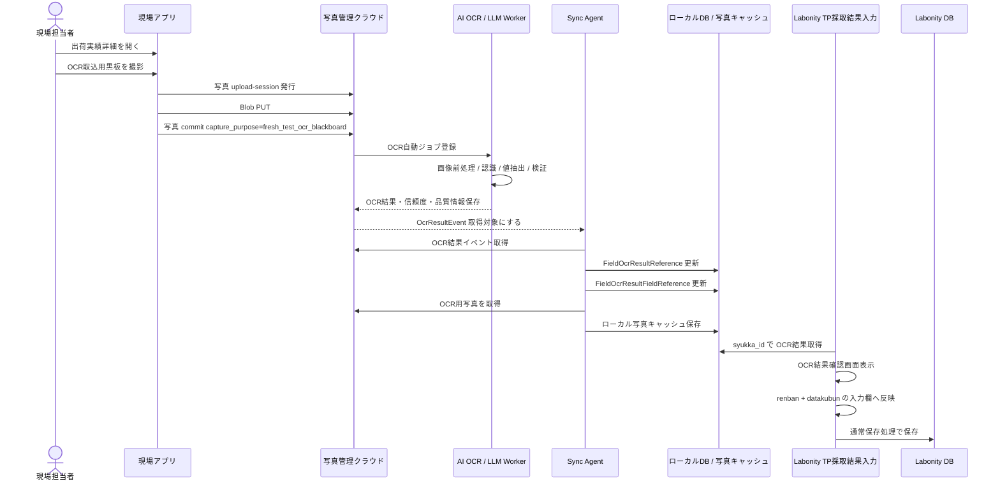

### 11.2 OCR ジョブの考え方

OCR ジョブは、OCR取込用黒板写真の commit をトリガーとしてクラウド側で自動作成する。

| 項目 | 内容 |
|---|---|
| トリガー | `capture_purpose = fresh_test_ocr_blackboard` の写真 commit。 |
| 出荷実績 | `shipment_id` と `shipment_source_local_id = syukka_id`。 |
| 写真 | 原則 1 枚。`photo_asset_id` で指定する。 |
| スキーマ | `labonity.blackboardFreshTest.v1`。 |
| 画面コンテキスト | OCR実行時には持たせない。`renban` と `datakubun` は Labonity 反映時に決まる。 |
| 保存 | OCR結果、信頼度、品質情報、警告、モデル情報をクラウドDBへ保存する。 |
| 同期 | Sync Agent がローカル OCR 参照テーブルへ同期する。 |
| TP DB反映 | OCR API は Labonity DB へ直接保存しない。 |

### 11.3 OCR レスポンス / 保存形式

OCR Worker は、抽出値だけでなく、品質情報と信頼度情報を含めた JSON を生成し、クラウドDBに保存する。

```json
{
  "schemaVersion": "labonity.blackboardFreshTest.v1",
  "source": {
    "shipmentId": "SHIPMENT-CLOUD-ID",
    "shipmentSourceLocalId": "SYUKKA-LOCAL-ID",
    "photoAssetId": "PHOTO-001",
    "ocrUsage": "fresh_test_blackboard",
    "model": "vision-llm",
    "modelVersion": "2026-06",
    "promptVersion": "blackboard-fresh-test-2026-06-10",
    "processedAt": "2026-06-10T10:30:00+09:00",
    "processingDurationMs": 2340
  },
  "quality": {
    "overallConfidence": 0.89,
    "qualityScore": 0.82,
    "imageSharpnessScore": 0.78,
    "brightnessScore": 0.86,
    "skewAngleDegrees": 2.3,
    "blackboardDetected": true,
    "blackboardCoverageRatio": 0.64,
    "needsReview": true,
    "warnings": [
      "黒板右下が一部ぼけています。低信頼度の項目は確認してください。"
    ]
  },
  "validation": {
    "vehicleNoMatch": true,
    "numericRangeValid": true,
    "dbTypeValid": true,
    "lowConfidenceCount": 2,
    "needsReviewCount": 2
  },
  "fields": [
    {
      "key": "slump",
      "labelText": "スランプ",
      "rawText": "18.0",
      "value": 18.0,
      "normalizedValue": "18.0",
      "valueType": "number",
      "unit": "cm",
      "confidence": 0.88,
      "needsReview": true,
      "reviewReasons": ["low_confidence"],
      "warnings": ["18.0 と 13.0 の判別がやや不確実"],
      "candidates": [18.0, 13.0]
    },
    {
      "key": "air",
      "labelText": "空気量",
      "rawText": "4.5",
      "value": 4.5,
      "normalizedValue": "4.5",
      "valueType": "number",
      "unit": "%",
      "confidence": 0.91,
      "needsReview": false,
      "reviewReasons": [],
      "warnings": [],
      "candidates": []
    }
  ]
}
```

### 11.4 OCR 対象項目

| canonical key | 日本語名 | 型 | 単位 | 反映先候補 | 読取・反映ルール |
|---|---|---|---|---|---|
| `vehicle_no` | 車番 | string | なし | `TestPieceSaisyu_FreshSiken.syaban` | TP 側は nchar(6)。出荷実績 `syaban` と突合し、不一致の場合は要確認。 |
| `outside_temperature` | 外気温 | string / number | ℃ | `TestPieceSaisyu_FreshSiken.gaikion` | nchar(6) へ整形する。 |
| `test_time` | 試験時間 | string | 時刻 | `TestPieceSaisyu_FreshSiken.sikenzikan` | HH:mm 等へ整形する。 |
| `slump` | スランプ | number | cm | `TestPieceSaisyu_FreshSiken.slump` | スランプ値。 |
| `flow1` | フロー1 | number | mm | `TestPieceSaisyu_FreshSiken.flow1` | 高流動の場合に抽出。 |
| `flow2` | フロー2 | number | mm | `TestPieceSaisyu_FreshSiken.flow2` | 高流動の場合に抽出。 |
| `air` | 空気量 | number | % | `TestPieceSaisyu_FreshSiken.air` | 空気量。 |
| `concrete_temperature` | コンクリート温度 | number | ℃ | `TestPieceSaisyu_FreshSiken.concrete_ondo` | 生コン温度。 |
| `unit_volume_mass` | 単位容積質量 | number | kg/m3 等 | `TestPieceSaisyu_FreshSiken.taniyosekisituryo` | 表記揺れを吸収する。 |
| `chloride1` | 塩化物量1 | number | kg/m3 | `TestPieceSaisyu_FreshSiken.enkabuturyo1` | 代表値 1 つを抽出。 |
| `chloride2` | 塩化物量2 | number | kg/m3 | `TestPieceSaisyu_FreshSiken.enkabuturyo2` | 2回目がある場合。 |
| `chloride3` | 塩化物量3 | number | kg/m3 | `TestPieceSaisyu_FreshSiken.enkabuturyo3` | 3回目がある場合。 |
| `unit_water` | 単位水量 | number | kg/m3 | `TestPieceSaisyu_FreshSiken.tanisuiryo` | 単位水量を抽出。 |
| `material_separation_check` | 材料分離目視確認 | integer/string | なし | `TestPieceSaisyu_FreshSiken.zairyobunrimokusikakunin` | 0:空白、1:有、2:無 などへマッピングする。 |
| `remarks` | 備考 | string | なし | `TestPieceSaisyu_FreshSiken.biko` | 10 文字超は切り詰め警告。 |

### 11.5 値整形ルール

| 項目 | 整形 |
|---|---|
| 数値 | 全角数字、小数点、カンマ、単位文字を正規化する。 |
| money 型項目 | decimal へ変換できる値だけ反映候補にする。桁あふれ、異常値は要確認にする。 |
| 温度 | `℃`、`度` を除去し数値化する。外気温は文字列欄への反映も考慮する。 |
| 車番 | 出荷実績の `syaban` と突合し、OCR 値が不一致の場合は要確認にする。 |
| nchar(6) 系 | 6 文字を超える場合は警告し、切り詰め候補を表示する。全角半角を正規化する。 |
| 備考 | DB 桁数を超える場合は警告し、反映値を切り詰め候補として表示する。 |
| 材料分離目視確認 | OCR文字列を `0/1/2` へマッピングし、不明な場合は空欄候補か要確認にする。 |
| datakubun | 画面表示中のデータ区分へ反映する。OCR が勝手に切り替えない。 |

### 11.6 信頼度・精度・品質情報の保存方針

OCR の「精度」は、認識時点では真の正解がないため、単一の数値だけで判断しない。以下を組み合わせて保存する。

| 種類 | 保存内容 | 用途 |
|---|---|---|
| 項目別信頼度 | `confidence`。各項目ごとの OCR / LLM の確からしさ。 | 低信頼度項目の要確認表示。 |
| 全体信頼度 | `overall_confidence`。項目別信頼度やモデル評価から算出。 | 結果全体の目安。 |
| 画像品質 | `quality_score`、ぼけ、明るさ、傾き、黒板検出状態。 | 再撮影判断。 |
| ルール検証 | 車番一致、数値範囲、DB型、桁数、単位変換。 | OCR値の業務妥当性確認。 |
| 低信頼度数 | `low_confidence_count`。 | 確認画面での警告。 |
| 要確認数 | `needs_review_count`。 | 取込前の確認必須判定。 |
| 候補値 | `candidates_json`。複数候補がある場合。 | ユーザー選択。 |
| ユーザー修正履歴 | 反映監査に `before_values_json`、`ocr_values_json`、`applied_values_json` を保存。 | 実運用上の精度評価・改善。 |
| モデル情報 | `ocr_engine`、`ocr_model`、`model_version`、`prompt_version`、`schema_version`。 | モデル更新時の追跡。 |

閾値の初期値は次を推奨する。

| 条件 | 扱い |
|---|---|
| `confidence >= 0.90` | OK。ただし確認画面には表示する。 |
| `0.80 <= confidence < 0.90` | 注意。ユーザー確認を推奨する。 |
| `confidence < 0.80` | 要確認。自動反映候補にはするが、確認状態を強調する。 |
| 既存値との差分あり | 信頼度に関係なく要確認。 |
| 車番不一致 | 要確認。 |
| DB型変換不可 | 反映候補にしない。手入力を促す。 |
| 画像品質警告あり | 結果全体を要確認にする。 |

### 11.7 OcrImportJob

テーブル名: `OcrImportJob`

| 項目 | 型 | 説明 |
|---|---|---|
| `ocr_import_job_id` | uuid | OCR取込ジョブID。 |
| `tenant_id` | uuid | テナントID。 |
| `plant_id` | uuid / string | 工場ID。 |
| `shipment_id` | uuid | クラウド出荷実績ID。 |
| `shipment_source_local_id` | uniqueidentifier / string | `SyukkaDataMain.syukka_id`。 |
| `photo_asset_id` | uuid | OCR取込用黒板写真ID。 |
| `photo_asset_target_id` | uuid | 対象関連ID。 |
| `ocr_usage` | nvarchar | `fresh_test_blackboard`。 |
| `trigger_type` | nvarchar | `photo_committed`。 |
| `schema_version` | nvarchar | `labonity.blackboardFreshTest.v1`。 |
| `ocr_engine` | nvarchar | OCR / LLM エンジン識別子。 |
| `ocr_model` | nvarchar | モデル識別子。 |
| `model_version` | nvarchar | モデルバージョン。 |
| `prompt_version` | nvarchar | プロンプトバージョン。 |
| `prompt_hash` | nvarchar | プロンプト・設定追跡用ハッシュ。 |
| `status` | nvarchar | `queued` / `processing` / `completed` / `needs_review` / `failed` / `superseded`。 |
| `retry_count` | int | 再試行回数。 |
| `error_code` | nvarchar null | 失敗コード。 |
| `error_message` | nvarchar null | 失敗内容。 |
| `queued_at` | datetimeoffset | キュー登録日時。 |
| `started_at` | datetimeoffset null | 処理開始日時。 |
| `finished_at` | datetimeoffset null | 処理終了日時。 |
| `processing_duration_ms` | int null | 処理時間。 |
| `created_at` | datetimeoffset | 作成日時。 |
| `updated_at` | datetimeoffset | 更新日時。 |

### 11.8 OcrImportResult

テーブル名: `OcrImportResult`

| 項目 | 型 | 説明 |
|---|---|---|
| `ocr_import_result_id` | uuid | OCR結果ID。 |
| `ocr_import_job_id` | uuid | OCRジョブID。 |
| `tenant_id` | uuid | テナントID。 |
| `plant_id` | uuid / string | 工場ID。 |
| `shipment_id` | uuid | クラウド出荷実績ID。 |
| `shipment_source_local_id` | uniqueidentifier / string | `SyukkaDataMain.syukka_id`。 |
| `photo_asset_id` | uuid | OCR取込用黒板写真ID。 |
| `ocr_usage` | nvarchar | `fresh_test_blackboard`。 |
| `schema_version` | nvarchar | スキーマバージョン。 |
| `status` | nvarchar | `completed` / `needs_review` / `failed` / `superseded`。 |
| `is_current` | bit | 現在有効な OCR結果。 |
| `overall_confidence` | decimal(5,4) null | 全体信頼度。 |
| `min_field_confidence` | decimal(5,4) null | 項目別信頼度の最小値。 |
| `quality_score` | decimal(5,4) null | 画像品質スコア。 |
| `validation_score` | decimal(5,4) null | ルール検証スコア。 |
| `field_count` | int | 抽出項目数。 |
| `low_confidence_count` | int | 低信頼度項目数。 |
| `needs_review_count` | int | 要確認項目数。 |
| `image_quality_json` | json | ぼけ、明るさ、傾き、黒板検出など。 |
| `validation_results_json` | json | 車番一致、範囲、型変換、桁数など。 |
| `extracted_values_json` | json | 正規化済み抽出値。 |
| `confidence_json` | json | 項目別信頼度。 |
| `warnings_json` | json | 警告一覧。 |
| `raw_ocr_json` | json | OCR / LLM の生結果。保持期間を管理する。 |
| `processed_at` | datetimeoffset | OCR処理完了日時。 |
| `created_at` | datetimeoffset | 作成日時。 |

現在有効な OCR結果は、同一出荷実績・同一用途で 1 件のみとする。

```sql
CREATE UNIQUE INDEX UX_OcrImportResult_Current
ON OcrImportResult (
    tenant_id,
    plant_id,
    shipment_source_local_id,
    ocr_usage
)
WHERE is_current = 1
  AND status IN ('completed', 'needs_review') ;
```

### 11.9 OcrImportResultField

テーブル名: `OcrImportResultField`

| 項目 | 型 | 説明 |
|---|---|---|
| `ocr_import_result_field_id` | uuid | OCR結果項目ID。 |
| `ocr_import_result_id` | uuid | OCR結果ID。 |
| `tenant_id` | uuid | テナントID。 |
| `plant_id` | uuid / string | 工場ID。 |
| `canonical_key` | nvarchar | `slump`, `air` などの標準キー。 |
| `display_order` | int | 表示順。 |
| `label_text` | nvarchar | OCRしたラベル文字列。 |
| `raw_text` | nvarchar | OCRした生文字列。 |
| `normalized_value` | nvarchar | 正規化後文字列。 |
| `numeric_value` | decimal(18,5) null | 数値の場合の正規化値。 |
| `value_type` | nvarchar | `number` / `string` / `time` / `integer`。 |
| `unit` | nvarchar null | 単位。 |
| `confidence` | decimal(5,4) null | 項目別信頼度。 |
| `needs_review` | bit | 要確認フラグ。 |
| `review_reason_codes` | nvarchar(max) | `low_confidence`, `vehicle_mismatch`, `type_error` など。 |
| `warnings_json` | json | 項目別警告。 |
| `candidates_json` | json | 候補値。 |
| `bounding_polygon_json` | json null | 画像上の位置。取得できる場合のみ。 |
| `created_at` | datetimeoffset | 作成日時。 |

### 11.10 ローカル OCR 結果参照テーブル

テーブル名: `FieldOcrResultReference`

| 項目 | 型 | 説明 |
|---|---|---|
| `ocr_result_reference_id` | uniqueidentifier | ローカル OCR 結果参照ID。 |
| `tenant_id` | uniqueidentifier | テナントID。 |
| `plant_id` | uniqueidentifier / varchar | 工場ID。 |
| `ocr_import_job_id` | uniqueidentifier / varchar | クラウド OCR ジョブID。 |
| `ocr_import_result_id` | uniqueidentifier / varchar | クラウド OCR 結果ID。 |
| `syukka_id` | uniqueidentifier / varchar | `SyukkaDataMain.syukka_id`。 |
| `shipment_id` | uniqueidentifier / varchar | クラウド `Shipment.shipment_id`。 |
| `photo_asset_id` | uniqueidentifier / varchar | 読取元写真ID。 |
| `photo_asset_target_id` | uniqueidentifier / varchar | 読取元写真関連ID。 |
| `ocr_usage` | nvarchar | `fresh_test_blackboard`。 |
| `schema_version` | nvarchar | スキーマバージョン。 |
| `status` | nvarchar | `completed` / `needs_review` / `failed` / `superseded`。 |
| `is_current` | bit | 現在有効な結果。 |
| `overall_confidence` | decimal(5,4) null | 全体信頼度。 |
| `min_field_confidence` | decimal(5,4) null | 項目別信頼度最小値。 |
| `quality_score` | decimal(5,4) null | 画像品質スコア。 |
| `validation_score` | decimal(5,4) null | 検証スコア。 |
| `field_count` | int | 項目数。 |
| `low_confidence_count` | int | 低信頼度項目数。 |
| `needs_review_count` | int | 要確認項目数。 |
| `image_quality_json` | nvarchar(max) | 画像品質。 |
| `validation_results_json` | nvarchar(max) | 検証結果。 |
| `extracted_values_json` | nvarchar(max) | 抽出値。 |
| `confidence_json` | nvarchar(max) | 信頼度。 |
| `warnings_json` | nvarchar(max) | 警告。 |
| `local_photo_path` | nvarchar(500) null | 読取元写真のローカルパス。 |
| `local_thumbnail_path` | nvarchar(500) null | サムネイルのローカルパス。 |
| `processed_at` | datetimeoffset null | OCR処理完了日時。 |
| `event_sequence` | bigint | 最終反映イベントシーケンス。 |
| `synced_at` | datetimeoffset | ローカル同期日時。 |

テーブル名: `FieldOcrResultFieldReference`

| 項目 | 型 | 説明 |
|---|---|---|
| `ocr_result_field_reference_id` | uniqueidentifier | ローカル OCR 項目参照ID。 |
| `ocr_result_reference_id` | uniqueidentifier | `FieldOcrResultReference` のID。 |
| `tenant_id` | uniqueidentifier | テナントID。 |
| `plant_id` | uniqueidentifier / varchar | 工場ID。 |
| `syukka_id` | uniqueidentifier / varchar | 出荷ID。 |
| `canonical_key` | nvarchar | 標準キー。 |
| `display_order` | int | 表示順。 |
| `label_text` | nvarchar | ラベル文字列。 |
| `raw_text` | nvarchar | 生文字列。 |
| `normalized_value` | nvarchar | 正規化値。 |
| `numeric_value` | decimal(18,5) null | 数値。 |
| `value_type` | nvarchar | 型。 |
| `unit` | nvarchar null | 単位。 |
| `confidence` | decimal(5,4) null | 項目別信頼度。 |
| `needs_review` | bit | 要確認。 |
| `review_reason_codes` | nvarchar(max) | 要確認理由。 |
| `warnings_json` | nvarchar(max) | 警告。 |
| `candidates_json` | nvarchar(max) | 候補。 |
| `synced_at` | datetimeoffset | ローカル同期日時。 |

### 11.11 OCR 反映監査

Labonity 側で OCR 反映結果を追跡するため、独立した監査テーブル `FieldOcrImportAudit` を使用する。

| 項目 | 説明 |
|---|---|
| `ocr_import_audit_id` | 監査ID。 |
| `tenant_id` | テナントID。 |
| `plant_id` | 工場ID。 |
| `ocr_import_result_id` | クラウド OCR 結果ID。 |
| `ocr_result_reference_id` | ローカル OCR 結果参照ID。 |
| `syukka_id` | 出荷ID。 |
| `testpiecesaisyu_main_id` | 保存済み TP の場合に記録する。未保存中は null 可。 |
| `renban` | 反映先 renban。 |
| `datakubun` | 反映先 datakubun。 |
| `photo_asset_id` | 取込元写真。 |
| `ocr_values_json` | OCR値。 |
| `ocr_confidence_json` | 信頼度。 |
| `ocr_warnings_json` | 警告。 |
| `before_values_json` | 反映前画面値。 |
| `applied_values_json` | 反映値。ユーザー修正後の値を含む。 |
| `corrected_fields_json` | OCR値から修正された項目。 |
| `saved_values_json` | 保存後値。必要に応じて記録する。 |
| `status` | `applied_to_screen` / `saved` / `save_failed` / `discarded`。 |
| `created_by` | 操作者。 |
| `created_at` | 記録日時。 |

---

## 12. API 設計

### 12.1 共通 API ルール

| 項目 | 内容 |
|---|---|
| URL | `/api/core/v1/orgs/{orgId}/...` または `/api/sync/v1/orgs/{orgId}/...`。 |
| 認証 | Liberty Account アクセストークンを Bearer で送信する。Labonity デスクトップアプリはクラウド API を呼ばない。 |
| 認可 | orgId、Grant、権限コード、plantId を検証する。 |
| Idempotency | POST 系は `Idempotency-Key` または `clientRequestId` を使用する。 |
| エラー | `traceId`, `code`, `message`, `details` を返す。 |

### 12.2 Sync Agent API

#### ローカルDB → クラウド

```http
POST /api/sync/v1/orgs/{orgId}/field-sites/import
POST /api/sync/v1/orgs/{orgId}/shipping-schedules/import
POST /api/sync/v1/orgs/{orgId}/shipments/import
POST /api/sync/v1/orgs/{orgId}/shipment-tp-targets/import
```

共通リクエスト例:

```json
{
  "plantId": "KOZYO-001",
  "sourceSystem": "ExDat",
  "sourceTable": "SyukkaDataMain",
  "items": [
    {
      "sourceLocalId": "SYUKKA-LOCAL-GUID",
      "sourceHash": "sha256:...",
      "deleted": false,
      "values": {
        "shippingDate": "2026-06-10",
        "shippingTime": "10:30",
        "vehicleNo": "12",
        "quantity": 4.0,
        "fieldSiteSourceLocalId": "GENBA-LOCAL-GUID"
      }
    }
  ]
}
```

#### 写真メタデータイベント取得

```http
GET /api/sync/v1/orgs/{orgId}/photo-reference-events?plantId={plantId}&sinceSequence={sequence}
POST /api/sync/v1/orgs/{orgId}/photo-reference-events/{eventId}/ack
```

#### OCR結果イベント取得

```http
GET /api/sync/v1/orgs/{orgId}/ocr-result-events?plantId={plantId}&sinceSequence={sequence}
GET /api/sync/v1/orgs/{orgId}/ocr-results/{ocrImportResultId}
GET /api/sync/v1/orgs/{orgId}/ocr-results/{ocrImportResultId}/fields
POST /api/sync/v1/orgs/{orgId}/ocr-result-events/{eventId}/ack
```

#### OCR取込用写真キャッシュ取得

```http
POST /api/sync/v1/orgs/{orgId}/photos/{photoAssetId}/download-url
```

Sync Agent credential で使用できるのは、同期・OCR結果取得・OCR取込用写真キャッシュ取得に必要な API のみに限定する。

### 12.3 現場アプリ API

#### 出荷予定一覧

```http
GET /api/core/v1/orgs/{orgId}/shipping-schedules?date=2026-06-10&plantId={plantId}
```

#### 出荷実績一覧

```http
GET /api/core/v1/orgs/{orgId}/shipments?shippingScheduleId={shippingScheduleId}
```

#### 出荷実績詳細

```http
GET /api/core/v1/orgs/{orgId}/shipments/{shipmentId}
```

#### 写真アップロードセッション発行

```http
POST /api/core/v1/orgs/{orgId}/photos/upload-sessions
```

リクエスト例:

```json
{
  "plantId": "KOZYO-001",
  "shipmentId": "SHIPMENT-CLOUD-ID",
  "fileCount": 1,
  "capturePurpose": "fresh_test_ocr_blackboard",
  "clientRequestId": "device-001:20260610:001"
}
```

レスポンス例:

```json
{
  "uploadSessionId": "UPLOAD-001",
  "items": [
    {
      "photoAssetId": "PHOTO-001",
      "uploadUrl": "https://...",
      "blobPath": "orgs/ORG-001/plants/KOZYO-001/photos/PHOTO-001/original.jpg",
      "requiredHeaders": {
        "x-ms-blob-type": "BlockBlob"
      }
    }
  ],
  "maxSizeBytes": 10485760,
  "acceptedContentTypes": ["image/jpeg", "image/png", "image/heic"],
  "expiresAt": "2026-06-10T10:45:00+09:00"
}
```

#### 写真 commit

```http
POST /api/core/v1/orgs/{orgId}/photos/{photoAssetId}/commit
```

通常写真のリクエスト例:

```json
{
  "target": {
    "targetType": "shipment",
    "targetId": "SHIPMENT-CLOUD-ID",
    "targetSourceLocalId": "SYUKKA-LOCAL-GUID",
    "displayOrder": 1,
    "isPrimary": true
  },
  "capturePurpose": "general",
  "takenAt": "2026-06-10T10:31:00+09:00",
  "sourceType": "camera",
  "qualityWarnings": []
}
```

OCR取込用黒板写真のリクエスト例:

```json
{
  "target": {
    "targetType": "shipment",
    "targetId": "SHIPMENT-CLOUD-ID",
    "targetSourceLocalId": "SYUKKA-LOCAL-GUID",
    "displayOrder": 1,
    "isPrimary": false,
    "ocrUsage": "fresh_test_blackboard",
    "isOcrPrimary": true
  },
  "capturePurpose": "fresh_test_ocr_blackboard",
  "takenAt": "2026-06-10T10:31:00+09:00",
  "sourceType": "camera",
  "qualityWarnings": []
}
```

OCR取込用黒板写真の場合、commit 成功後に自動 OCR ジョブが作成される。

レスポンス例:

```json
{
  "photoAssetId": "PHOTO-001",
  "photoAssetTargetId": "TARGET-001",
  "capturePurpose": "fresh_test_ocr_blackboard",
  "ocrJob": {
    "ocrImportJobId": "OCR-JOB-001",
    "status": "queued"
  }
}
```

#### 出荷実績に紐づく写真取得

```http
GET /api/core/v1/orgs/{orgId}/shipments/{shipmentId}/photos
GET /api/core/v1/orgs/{orgId}/shipments/by-source/{syukkaId}/photos?plantId={plantId}
```

#### 出荷実績に紐づく OCR 状態取得

現場アプリで OCR 状態を表示するための API として使用する。Labonity デスクトップアプリは使用しない。

```http
GET /api/core/v1/orgs/{orgId}/shipments/{shipmentId}/ocr-status
GET /api/core/v1/orgs/{orgId}/shipments/by-source/{syukkaId}/ocr-status?plantId={plantId}
```

レスポンス例:

```json
{
  "shipmentId": "SHIPMENT-CLOUD-ID",
  "shipmentSourceLocalId": "SYUKKA-LOCAL-GUID",
  "ocrUsage": "fresh_test_blackboard",
  "status": "needs_review",
  "ocrImportJobId": "OCR-JOB-001",
  "ocrImportResultId": "OCR-RESULT-001",
  "overallConfidence": 0.89,
  "qualityScore": 0.82,
  "needsReviewCount": 2,
  "processedAt": "2026-06-10T10:35:00+09:00"
}
```

### 12.4 Labonity デスクトップ API

Labonity デスクトップアプリ向けのクラウド API は用意しない。

Labonity デスクトップアプリは、次のローカルデータだけを参照する。

- `FieldPhotoReference`
- `FieldOcrResultReference`
- `FieldOcrResultFieldReference`
- `FieldOcrImportAudit`
- ローカル写真キャッシュ
- 既存 Labonity DB テーブル

---

## 13. 画面仕様 / 現場アプリ

### 13.1 ログイン画面

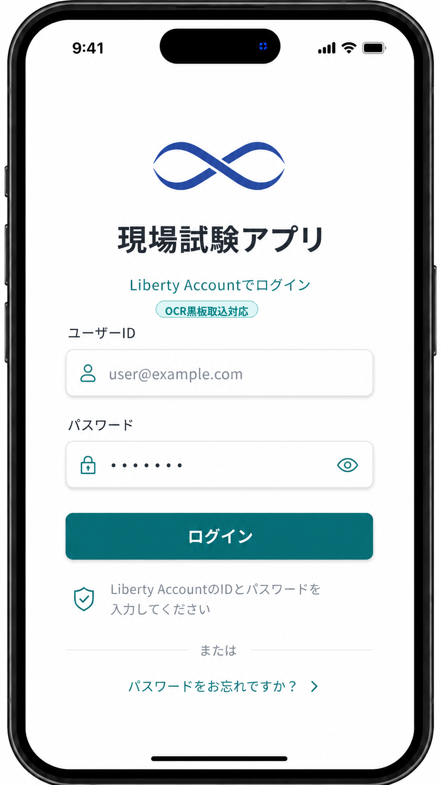

### 13.2 出荷予定一覧画面

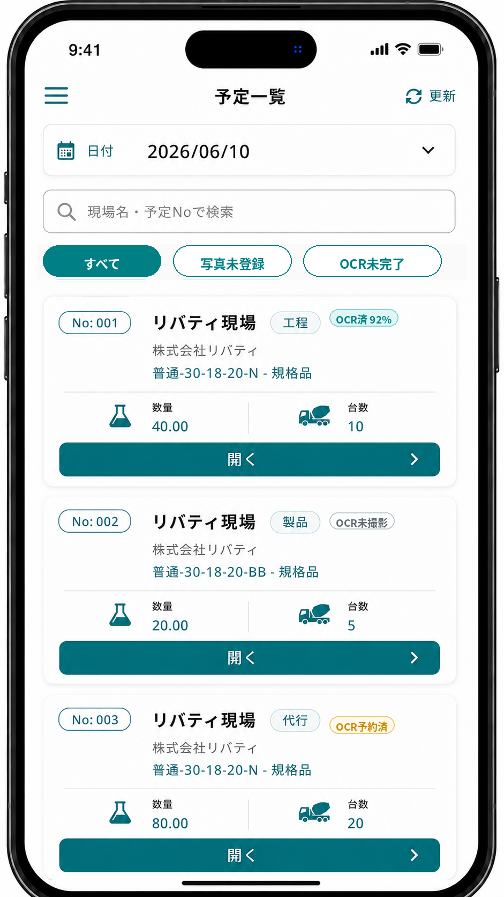

- ヘッダーに「出荷予定一覧」タイトルと更新ボタンを配置する。
- 日付ピッカーと検索バー（現場名・予定Noで検索）を上部に表示する。
- 「すべて」「写真未登録」「OCR用黒板未撮影」の絞込タブを配置する。
- 各予定カードには、予定No、現場名、配合、出荷台数、写真枚数、OCR用黒板撮影状態を表示する。
- 予定カードには、配下の出荷実績に OCR取込用黒板写真があるか、OCR予約済みか、読取済みかを補助バッジで表示する。
- OCR状態の補助バッジは、`OCR未撮影 / OCR予約済 / OCR読取中 / OCR済 / 要確認 / 失敗` を区別できる表示にする。
- カード下部に「開く」ボタンを配置し、出荷予定詳細へ遷移する。

### 13.3 出荷予定詳細 / 出荷実績一覧画面

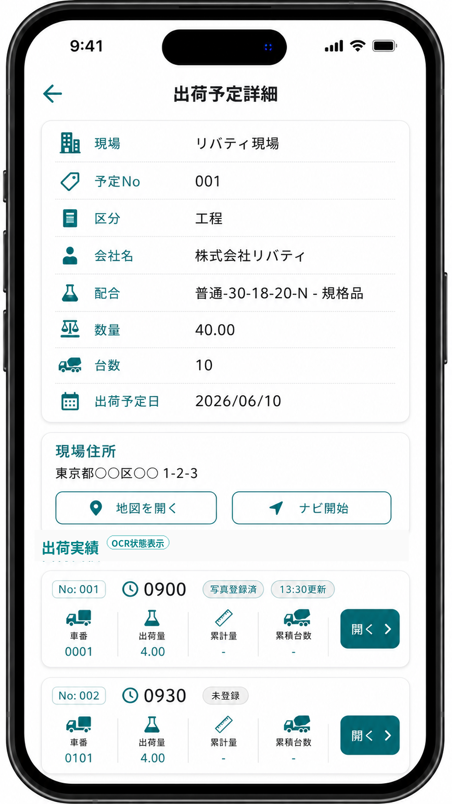

- 上部に予定詳細（現場名、予定No、配合、出荷予定日）をカード形式で表示する。
- 現場住所セクションに住所テキスト、「地図を開く」「ナビ開始」ボタンを配置する。
- 「出荷実績」セクションに各実績行を表示する。
- 実績行には、出荷時刻、車番、数量、写真枚数、OCR用黒板状態を表示する。
- 実績行には、OCR取込用黒板写真の有無、OCR予約済み、OCR済み、要確認などの状態を補助バッジで表示する。
- OCR用黒板状態は `未撮影 / 予約済 / 読取中 / 読取済 / 要確認 / 失敗 / 対象外` を表示する。
- OCR済みの場合は、必要に応じて全体信頼度または要確認件数を併記する。
- 各行の「開く」ボタンから出荷実績詳細へ遷移する。

### 13.4 出荷実績詳細画面

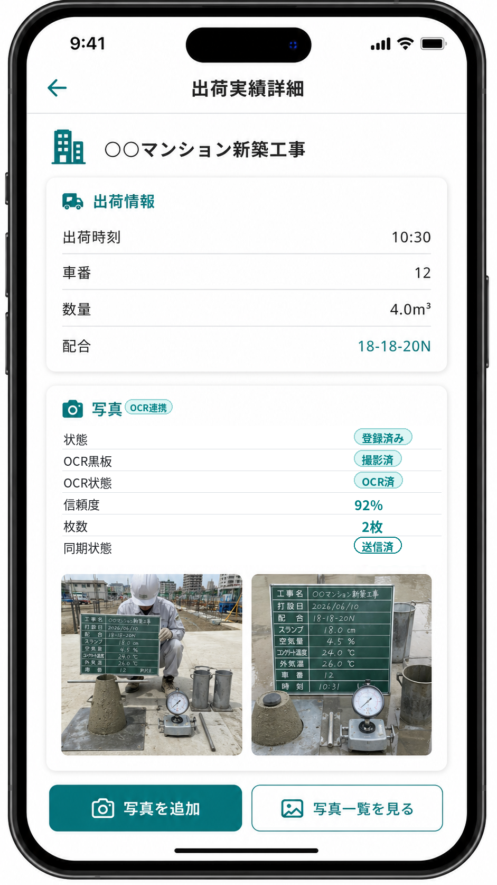

- 現場名をヘッダー下に大きく表示する。
- 「出荷情報」カードに出荷時刻、車番、数量、配合を表示する。
- 「写真」カードに状態、枚数、代表写真の撮影時刻、同期状態を表示する。
- 「OCR取込用黒板」カードに、撮影状態、OCR状態、OCR予約状態、読取日時、全体信頼度、要確認件数、同期状態を表示する。
- OCR取込用黒板写真が保存済みの場合は「OCR黒板」バッジを表示し、通常写真と区別する。
- 写真サムネイルを横並びで表示する。
- 画面下部に「写真を追加」と「OCR取込用黒板を撮影」を配置する。

表示例:

```text
OCR取込用黒板
状態: OCR済（要確認 2件）
OCR予約: 予約済
同期状態: 同期済
全体信頼度: 89%
読取日時: 10:35

[OCR取込用黒板を撮り直す]
```

### 13.5 写真追加メニュー

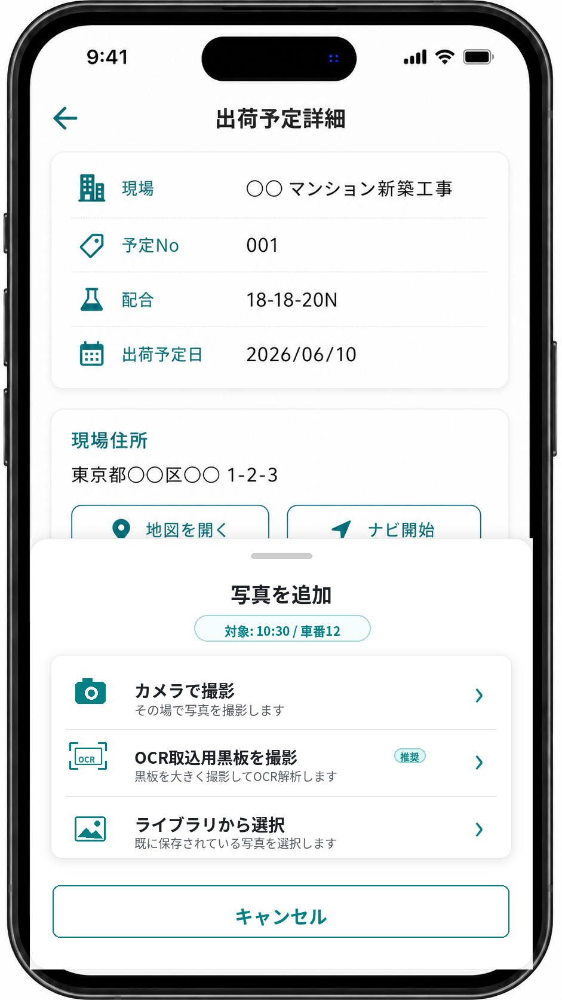

- ボトムシート形式で「写真を追加」メニューを表示する。
- 対象出荷（出荷時刻 / 車番）を上部に表示する。
- 「カメラで撮影」：その場で通常写真を撮影する。
- 「ライブラリから選択」：既に保存されている写真を通常写真として選択する。
- 「OCR取込用黒板を撮影」：Labonity のフレッシュ試験値取込に使う黒板写真を専用モードで撮影する。
- OCR取込用黒板写真は通常写真の分類ではなく、保存後に OCR ジョブ予約へ進む専用操作として扱う。
- 「キャンセル」ボタンでメニューを閉じる。

### 13.6 OCR黒板写真確認画面


OCR取込用黒板写真は専用画面で確認し、通常写真の確認画面とは保存後の扱いを明確に分ける。


確認時の表示:

- 黒板全体を写す。
- 反射を避ける。
- 斜めから撮りすぎない。
- 文字が読める距離で撮る。
- ぼけ、暗さ、傾き、黒板欠けのチェック結果を表示する。
- 保存後に OCR予約済みとなり、クラウド側で自動 OCR されることを表示する。
- 既に OCR取込用黒板写真がある場合は、保存すると差し替えになることを表示する。

### 13.7 写真一覧画面

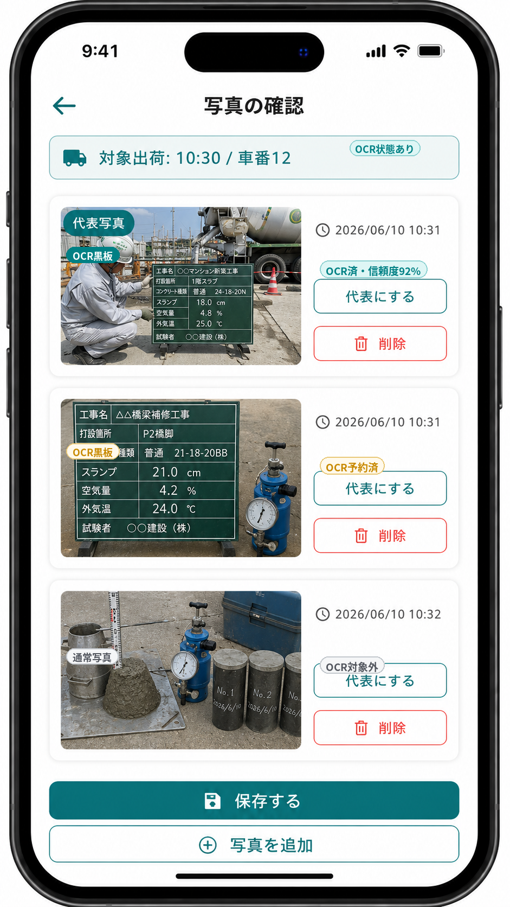

- 対象出荷（出荷時刻 / 車番）を上部に表示する。
- 通常写真カードを縦並びで表示し、各カードにサムネイル、撮影日時、「代表にする」「削除」ボタンを配置する。
- 代表写真には「代表写真」バッジを表示する。
- OCR取込用黒板写真は、通常写真とは別セクションに表示する。
- OCR取込用黒板写真には「OCR黒板」バッジを表示する。
- 写真カードには OCR状態を `OCR済 / 予約済 / 対象外 / 要確認 / 失敗` として表示する。
- OCR済みまたは要確認の場合は、全体信頼度を表示する。
- 通常写真には `OCR対象外` を表示し、自動 OCR 対象ではないことを明確にする。
- 画面下部に「写真を追加」と「OCR取込用黒板を撮影」を配置する。

### 13.8 保存完了画面

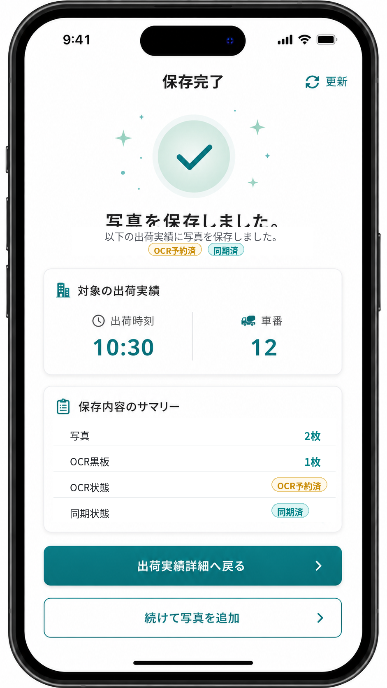

通常写真の場合:

- 保存成功を示すチェックマークアイコンとメッセージを表示する。
- 対象の出荷実績（出荷時刻、車番）を表示する。
- 保存内容のサマリー（写真枚数、代表写真、同期状態）を表示する。
- 「出荷実績詳細へ戻る」と「続けて写真を追加」を配置する。

OCR取込用黒板写真の場合:

- 保存成功を表示する。
- 「OCR予約済」と表示し、クラウド側で OCR 読取が行われることを示す。
- 写真メタデータとアップロードが完了した場合は「同期済」を表示する。
- OCR結果は Labonity 側で同期後に確認できることを表示する。
- 「出荷実績詳細へ戻る」と「撮り直す」を配置する。

---

## 14. 画面仕様 / Labonity 側

### 14.1 TP採取結果入力画面

```text
TP採取結果入力 (一部)

対象TP: TP-20260610-001
現場: ○○現場
配合: 18-18-20N

【出荷情報】
[連番] [出荷時刻] [車番] [数量] [OCR状態]     [アクション]
  0    10:30     12    4.0m3  読取済       [OCR結果を確認]
  1    10:45     15    4.0m3  未撮影       [出荷指定]
  2    11:00     18    4.0m3  読取中       [出荷指定]
```

`[OCR取込]` や `[OCR実行]` は表示しない。出荷指定後のローカル OCR 結果有無に応じて `[OCR結果を確認して反映]` を表示する。

### 14.2 OCR結果確認画面

```text
+--------------------------------------------------------------------------------+
| OCR結果確認                                                                     |
|--------------------------------------------------------------------------------|
| 出荷実績: 10:30 / 車番12                                                       |
| 現場    : ○○マンション新築工事                                                 |
| 反映先  : renban 0 / datakubun 0                                               |
| 読取元  : OCR取込用黒板写真                                                    |
| 読取日時: 2026/06/10 10:35                                                     |
| 全体信頼度: 89%    画像品質: 82%    要確認: 2件                                |
|--------------------------------------------------------------------------------|
| 左: 読取元写真                                                                  |
| 右: 抽出結果                                                                    |
|                                                                                |
| 項目              現在値    OCR値      信頼度   反映値   状態                 |
| スランプ                    18.0       88%      18.0     要確認               |
| 空気量                      4.5        91%      4.5      OK                   |
| コンクリート温度            21.5       77%      21.5     要確認               |
| 外気温                      未読取     -        空欄     要入力               |
| 塩化物量                    0.03       90%      0.03     OK                   |
|                                                                                |
| [入力欄に反映] [保留] [手入力を続ける]                                         |
+--------------------------------------------------------------------------------+
```

### 14.3 反映ルール

| 状態 | 処理 |
|---|---|
| 反映先欄が空 | OCR値を反映値の初期値にする。 |
| 反映先欄に値あり・OCR値と同じ | OK 表示。 |
| 反映先欄に値あり・OCR値と異なる | 差分確認を必須にする。自動上書きしない。 |
| OCR値が低信頼度 | 要確認として表示する。 |
| OCR値が型変換不可 | 反映候補にしない。手入力を促す。 |
| OCR値がDB桁数超過 | 切り詰め候補と警告を表示する。 |
| datakubun=1 | データ2画面の入力欄へ反映する。 |
| 縦割り | 現在行の `renban` と `syukka_id` の組み合わせを守る。 |

### 14.4 画面反映表示

反映後は、保存前であることを明示する。

```text
OCR結果の値を入力欄へ反映しました。
保存すると Labonity DB へ反映されます。
```

### 14.5 OCR結果がない場合

対象 `syukka_id` の OCR 結果がローカルDBに存在しない場合、OCR結果確認画面は表示しない。

```text
この出荷実績には OCR結果がありません。
現場アプリで OCR取込用黒板写真が撮影されていない、または同期前の可能性があります。
手入力で業務を継続できます。
```

Labonity 側から OCR 実行を開始するボタンは表示しない。

---

## 15. セキュリティ・監査

### 15.1 Blob アクセス

- 写真本体への直接公開 URL は発行しない。
- アップロード時は短時間 SAS または同等の一時アップロード URL を使用する。
- Sync Agent が OCR取込用写真を取得する場合も短時間閲覧 URL を使用する。
- Labonity デスクトップアプリは閲覧 URL を取得しない。
- URL の有効期限は短く設定する。
- 写真削除は DB の論理削除と Blob 削除ポリシーを分離する。
- OCR や監査に使った写真は、保持期間内は参照可能にする。画面上の削除は論理削除扱いにする。

### 15.2 Labonity デスクトップのセキュリティ境界

Labonity デスクトップアプリは、クラウド認証情報、アクセストークン、Sync Agent credential を保持しない。

| 項目 | 方針 |
|---|---|
| クラウドAPI呼び出し | 行わない。 |
| Sync Agent ローカルAPI呼び出し | 行わない。 |
| OCR実行依頼 | 行わない。 |
| 写真表示 | Sync Agent が保存したローカル写真キャッシュを参照する。 |
| OCR結果 | Sync Agent が同期したローカルDBを参照する。 |
| 保存 | 既存 Labonity DB 保存処理を使用する。 |

### 15.3 監査ログ

以下の操作を AuditLog またはローカル監査テーブルに記録する。

| 操作 | 主な記録項目 |
|---|---|
| ログイン成功 / 失敗 | accountId, orgId, result, reason, ip, userAgent。 |
| 組織選択 | accountId, orgId。 |
| 認可拒否 | accountId, orgId, permission, resource, reason。 |
| 通常写真アップロード | accountId, orgId, plantId, shipmentId, photoAssetId。 |
| OCR取込用黒板写真アップロード | accountId, orgId, plantId, shipmentId, photoAssetId, ocrUsage。 |
| OCR自動ジョブ登録 | orgId, plantId, shipmentId, photoAssetId, jobId。 |
| OCR 実行結果 | orgId, plantId, jobId, resultId, status, confidence, qualityScore, needsReviewCount, model, schemaVersion。 |
| OCR 失敗 | orgId, plantId, jobId, errorCode, errorMessage。 |
| OCR結果同期 | agentId, orgId, plantId, resultId, sequence, result。 |
| 写真キャッシュ同期 | agentId, orgId, plantId, photoAssetId, result。 |
| OCR 画面反映 | localUser, syukka_id, renban, datakubun, resultId, appliedFields, correctedFields。 |
| Sync import | agentId, orgId, plantId, sourceTable, count, result。 |
| イベント ACK | agentId, orgId, eventId, sequence, result。 |

### 15.4 OCR データ保持

| データ | 推奨保持 |
|---|---|
| 原本写真 | 業務要件に応じて保持。削除は論理削除を先行。 |
| サムネイル | 原本と同じ保持期間。 |
| OCR取込用写真ローカルキャッシュ | OCR結果確認に必要な期間保持。保持期間後または削除イベント後に削除する。 |
| OCR raw JSON | 監査が必要な期間のみ。長期保持しすぎない。 |
| OCR 抽出値 | 監査要件に応じて保持。 |
| OCR 信頼度・品質情報 | モデル改善、障害調査、ユーザー修正分析に必要な期間保持する。 |
| ユーザー修正履歴 | 業務監査と精度改善に必要な範囲で保持する。 |

### 15.5 OCR 精度改善のための記録

OCR結果の正しさは、ユーザーが確認・修正した結果から評価する。

| 記録 | 用途 |
|---|---|
| OCR値 | モデルが出した値。 |
| 反映値 | ユーザーが確定した値。 |
| 修正項目 | OCR値から変更された項目。 |
| 項目別信頼度 | 低信頼度と修正発生率の関係分析。 |
| 画像品質 | 画質と修正発生率の関係分析。 |
| モデル・プロンプトバージョン | モデル更新前後の比較。 |

---

## 16. オフライン・エラー処理

### 16.1 現場アプリ

| 状態 | 処理 |
|---|---|
| 通信断で写真アップロード不可 | IndexedDB 等に未送信写真とメタデータを保持し、通信復旧後に再送する。 |
| upload-session 発行失敗 | エラー表示し、再試行可能にする。 |
| Blob PUT 成功 / commit 失敗 | 未 commit 状態として保持し、再 commit する。 |
| 写真重複 | `file_hash` と `clientRequestId` で重複登録を抑制する。 |
| 出荷実績が端末にない | 出荷実績一覧を更新し、対象出荷が表示されるまで写真追加を開始しない。 |
| OCR取込用黒板写真の画質警告 | 再撮影を推奨する。ユーザーが保存を続行する場合は警告付きで保存する。 |
| OCR読取中 | 状態を表示し、通常の画面操作は継続可能にする。 |
| OCR失敗 | 失敗状態を表示し、撮り直しを促す。 |
| トークン期限切れ | 再認証を促す。未送信写真は保持する。 |

### 16.2 クラウド OCR

| 状態 | 処理 |
|---|---|
| OCR Worker 障害 | ジョブを retryable failed とし、バックオフ付きで再試行する。 |
| 画像取得不可 | `failed` とし、エラーコードを保存する。 |
| 黒板検出不可 | `needs_review` または `failed` とし、再撮影推奨の警告を保存する。 |
| 低画質 | OCRは実行するが、`quality_score` と警告を保存する。 |
| モデル応答不正 | raw response とエラーを保存し、再試行または failed にする。 |
| 同一出荷で撮り直し | 旧結果を `superseded` にし、新結果を `is_current = 1` にする。 |

### 16.3 Sync Agent

| 状態 | 処理 |
|---|---|
| クラウド API 失敗 | リトライし、失敗回数・最終エラーを SyncLog に記録する。 |
| ローカルDB接続失敗 | サービスを停止せず、次周期で再試行する。 |
| 同期途中停止 | checkpoint から再開する。 |
| 重複送信 | idempotency_key により重複登録しない。 |
| 写真メタデータ ACK 失敗 | ACK が完了するまで再取得対象にする。 |
| OCR結果 ACK 失敗 | ACK が完了するまで再取得対象にする。 |
| 写真キャッシュ失敗 | `cache_status = failed` とし、次周期で再試行する。 |
| out-of-order イベント | `event_sequence` により順序制御し、古いイベントで新しい状態を上書きしない。 |
| 認可エラー | credential の orgId / plantId / 権限を確認し、同期を停止して管理ログに出す。 |

### 16.4 Labonity OCR 取込

| 状態 | 処理 |
|---|---|
| OCR結果なし | OCR結果確認画面を表示しない。通常業務を継続する。 |
| OCR結果処理中 | `OCR読取中` と表示する。手入力は継続できる。 |
| OCR結果同期前 | ローカルDBに結果がないため、通常業務を継続する。 |
| ローカル写真キャッシュなし | 画像なしで OCR結果を表示するか、読取元写真未取得と表示する。OCR値の確認・反映は可能にする。 |
| OCR失敗 | エラー内容を表示し、手入力継続を選択できる。 |
| 低信頼度 | 要確認として表示する。 |
| 現在値と差分あり | 自動上書きせず、差分確認画面を表示する。 |
| 複数候補あり | 候補選択または手入力にする。 |
| 保存前に画面を閉じる | DBへは反映されない。必要に応じて破棄確認を出す。 |
| 保存失敗 | 通常保存エラーを表示し、OCR反映監査は `save_failed` にする。 |

---

## 17. 受入条件

| No | 受入条件 |
|---|---|
| A-01 | 現場試験 Web アプリは Liberty Account でログインできる。 |
| A-02 | ログイン後、利用可能な組織だけを選択できる。 |
| A-03 | `LABONITY_FIELD_TEST` の Grant がない組織では利用できない。 |
| A-04 | 全 API で URL の orgId、トークン所属 org、DB の tenant_id が一致することを検証する。 |
| A-05 | Sync Agent は専用 credential で同期 API を利用できる。 |
| A-06 | Sync Agent の credential では現場アプリ API を利用できない。 |
| A-07 | Labonity デスクトップアプリはクラウド認証を行わない。 |
| A-08 | Labonity デスクトップアプリはクラウドAPIを直接呼び出さない。 |
| A-09 | Labonity デスクトップアプリは Sync Agent に OCR 実行依頼を行わない。 |
| A-10 | 現場アプリで、出荷予定一覧を表示できる。 |
| A-11 | 現場アプリで、出荷予定に紐づく出荷実績一覧を表示できる。 |
| A-12 | 現場アプリで、出荷実績詳細に現場住所を表示できる。 |
| A-13 | 出荷実績詳細から Google Maps を開ける。 |
| A-14 | 緯度経度または住所がない場合、地図ボタンは非活性または住所未設定として表示される。 |
| A-15 | 現場アプリで、出荷実績に対して通常写真を保存できる。 |
| A-16 | 現場アプリで、出荷実績に対して OCR取込用黒板写真を撮影・保存できる。 |
| A-17 | OCR取込用黒板撮影モードで保存した写真だけが自動 OCR 対象になる。 |
| A-18 | 通常写真は自動 OCR 対象にならない。 |
| A-19 | 1 つの出荷実績に対し、現在有効な OCR取込用黒板写真は 1 件に制御される。 |
| A-20 | OCR取込用黒板写真を撮り直した場合、旧OCR結果は `superseded` になり、新OCR結果が現在有効になる。 |
| A-21 | PhotoAssetTarget に `target_type = shipment` / `target_id = shipment_id` が保存される。 |
| A-22 | `SyukkaDataMain.syukka_id` は `target_source_local_id` として保持され、クラウドの `shipment_id` と混同されない。 |
| A-23 | 1 つの出荷実績に複数枚の通常写真を紐づけられる。 |
| A-24 | 代表写真は自動設定され、同一出荷に代表写真が複数できない。 |
| A-25 | Sync Agent により、現場関連データをローカルDBからクラウドへ単方向同期できる。 |
| A-26 | Sync Agent により、出荷予定関連データをローカルDBからクラウドへ単方向同期できる。 |
| A-27 | Sync Agent により、出荷実績関連データをローカルDBからクラウドへ単方向同期できる。 |
| A-28 | 現場アプリから、現場・出荷予定・出荷実績の参照データを編集できない。 |
| A-29 | 写真 commit 後、PhotoAsset / PhotoAssetTarget の参照メタデータがローカル参照用テーブルへ同期される。 |
| A-30 | OCR取込用黒板写真 commit 後、クラウド側で自動 OCR ジョブが作成される。 |
| A-31 | OCR結果はクラウドDBに保存される。 |
| A-32 | OCR結果には、抽出値、項目別信頼度、全体信頼度、画像品質、検証結果、警告、モデル情報、プロンプト情報が保存される。 |
| A-33 | OCR項目別結果は、canonical key、raw text、normalized value、confidence、needsReview、warnings を保持する。 |
| A-34 | OCR結果イベントが発行され、Sync Agent がローカル OCR 参照テーブルへ同期できる。 |
| A-35 | Sync Agent は OCR取込用黒板写真とサムネイルをローカル写真キャッシュへ保存できる。 |
| A-36 | ローカル側は FieldPhotoReference により、出荷実績に写真があるかを判定できる。 |
| A-37 | ローカル側は FieldOcrResultReference により、出荷実績に OCR結果があるかを判定できる。 |
| A-38 | Labonity 側で出荷実績を指定した際、その出荷に紐づく OCR結果があれば確認画面を表示できる。 |
| A-39 | Labonity 側の OCR結果確認画面に、OCR値、信頼度、警告、現在値、反映値、読取元写真を表示できる。 |
| A-40 | 低信頼度項目、現在値との差分、候補複数項目、型変換不可項目は確認必須になる。 |
| A-41 | ユーザー確定後、値は TP採取結果入力画面のフレッシュ試験入力欄へ流し込まれる。 |
| A-42 | データベースへの直接保存は行わず、TP採取結果入力画面の通常保存処理で反映される。 |
| A-43 | 新規未保存 TP でも、出荷指定後に同期済み OCR結果を確認・反映できる。 |
| A-44 | 縦割り TP で renban 0/1/2 の各行に対し、対応する syukka_id の OCR結果だけを候補表示できる。 |
| A-45 | OCR反映先は Labonity 画面の現在 renban と datakubun の両方で特定される。 |
| A-46 | datakubun=1 の画面でOCR結果を反映した場合、datakubun=1 の入力欄へ反映される。 |
| A-47 | 予定No が同じでも工場が異なる場合、予定・出荷・写真・OCR結果が混線しない。 |
| A-48 | 対象出荷が現場アプリに表示されない場合、写真追加と OCR取込用黒板撮影は開始できず、出荷実績の更新案内を表示できる。 |
| A-49 | 写真削除・代表写真変更・表示順変更・OCR取込用黒板写真差し替えが FieldPhotoReference に反映される。 |
| A-50 | OCRで反映した値について、OCR値・信頼度・現在値・最終反映値・修正項目を監査できる。 |
| A-51 | 出荷予定一覧・出荷実績一覧で、OCR未撮影、OCR予約済、OCR読取中、OCR済、要確認、失敗の状態を補助バッジで確認できる。 |
| A-52 | 出荷実績詳細と写真一覧で、OCR取込用黒板写真には「OCR黒板」バッジ、OCR状態、信頼度、同期状態を表示できる。 |
| A-53 | 保存完了画面で、OCR取込用黒板写真の保存時に「OCR予約済」と「同期済」を確認できる。 |

---

## 18. 実装メモ

### 18.1 必須実装

- Liberty Account ログインを現場試験 Web アプリに組み込む。
- ログイン後に `/accounts/me?includePermissions=true` 相当の情報を取得し、組織と権限を解決する。
- `LABONITY_FIELD_TEST` の Grant 判定を API 側で行う。
- API は orgId を URL に含め、トークン所属 org と DB tenant_id を照合する。
- Sync Agent を .NET Worker Service / Windows Service として実装する。
- Sync Agent credential を orgId + plantId + agentId 単位で管理する。
- 現場関連、出荷予定関連、出荷実績関連の import API を実装する。
- Sync Agent はローカルDBからクラウドへ基幹参照データを単方向 Upsert する。
- 写真本体は Blob Storage に保存する。
- PhotoAsset / PhotoAssetTarget を保存する。
- `capture_purpose = general` の通常写真を保存できるようにする。
- `capture_purpose = fresh_test_ocr_blackboard` の OCR取込用黒板写真を保存できるようにする。
- OCR取込用黒板写真 commit 後に自動 OCR ジョブを登録する。
- OCR / LLM Worker は抽出値、項目別信頼度、全体信頼度、画像品質、検証結果、警告、モデル情報を保存する。
- OcrImportJob / OcrImportResult / OcrImportResultField を保存する。
- OcrResultEvent を発行する。
- Sync Agent は PhotoReferenceEvent を pull し、FieldPhotoReference へ反映する。
- Sync Agent は OcrResultEvent を pull し、FieldOcrResultReference / FieldOcrResultFieldReference へ反映する。
- Sync Agent は OCR取込用黒板写真とサムネイルをローカル写真キャッシュへ保存する。
- 対象出荷が表示されない場合、写真追加と OCR取込用黒板撮影を開始せず、出荷実績の更新案内を表示する。
- 出荷実績詳細画面に [写真を追加] を配置する。
- 出荷実績詳細画面に [OCR取込用黒板を撮影] を配置する。
- 出荷実績詳細画面に [地図を開く] [ナビ開始] を配置する。
- Google Maps 起動 URL は緯度経度を優先し、なければ住所文字列で生成する。
- Labonity 側の TP採取結果入力で、出荷指定時にローカル OCR 結果有無を確認する。
- OCR結果がある場合、OCR結果確認画面を表示する。
- OCR結果を `renban + datakubun` の画面入力欄へ反映する。
- OCR反映監査として、OCR値・信頼度・現在値・反映値・修正項目を記録する。
- Labonity デスクトップアプリはクラウド API と Sync Agent ローカル API を呼び出さない。

### 18.2 対象外

- 現場アプリでのフレッシュ試験値入力。
- 現場アプリでの電子黒板合成。
- 現場アプリでの黒板レイアウト編集。
- 現場アプリでの通常写真分類入力。
- 出荷実績が表示されていない状態での写真先行登録。
- 予定・車番・時刻から出荷実績へ写真を自動紐づけする機能。
- Labonity デスクトップアプリでの Liberty Account 認証。
- Labonity デスクトップアプリからのクラウド API 呼び出し。
- Labonity デスクトップアプリから Sync Agent への OCR 実行依頼。
- Labonity デスクトップアプリでの写真選択 OCR 実行。
- 現場アプリからの出荷予定・出荷実績・現場マスター編集。
- 写真本体のローカルDB保存。
- クラウドからローカルDBへの直接接続。
- アプリ内地図埋め込み。
- 距離・所要時間計算。
- OCR API による Labonity DB への直接保存。

### 18.3 最終ルール

```text
写真は出荷実績に紐づける。
クラウドでは shipment_id を写真関連の主キーとして扱う。
Labonity 側では syukka_id を写真・OCR結果の検索キーとして扱う。
OCR取込用黒板撮影モードで保存された写真だけをクラウド側で自動OCRする。
OCR結果は抽出値、信頼度、品質情報、検証結果、警告、モデル情報とともにDBへ保存する。
Sync Agent は OCR結果とOCR取込用写真をローカルへ同期する。
Labonity デスクトップアプリはローカルDBとローカル写真キャッシュだけを参照する。
Labonity デスクトップアプリはクラウド認証、クラウドAPI呼び出し、Sync Agent へのOCR依頼を行わない。
OCR結果は TP採取結果入力画面上の現在 renban + datakubun の入力欄へ反映する。
DB 保存は TP採取結果入力画面の通常保存で行う。
```
