# Labonity 用現場試験アプリ 設計書 v1.0

**出荷実績写真保存・Sync Agent・Google Maps 連携・Liberty Account 認証・TP採取結果入力からの写真選択 OCR 取込方式・ローカル写真キャッシュ方式**

| 項目 | 内容 |
|---|---|
| 文書区分 | 基本設計 |
| 対象 | 現場試験アプリ / Labonity TP採取結果入力 / Sync Agent / 写真管理クラウド / Liberty Account 連携 |
| 版 | v1.0 |
| 作成日 | 2026-06-10 |
| 目的 | 現場アプリで出荷実績に紐づく写真を保存し、Labonity の TP採取結果入力画面で出荷実績を指定したとき、その出荷に紐づく写真を選択して AI OCR / LLM によりフレッシュ試験値を入力欄へ流し込めるようにする。 |
| 前提 | 現場アプリではフレッシュ試験値の入力、電子黒板合成、黒板レイアウト編集、TP採取結果の正式登録は行わない。現場アプリは、出荷予定・出荷実績・現場関連データを参照し、写真を追加・保存・同期するためのアプリとする。 |

---

## 0. 設計概要

### 0.1 システム責務

本システムは、出荷実績を中心に写真、OCR、TP採取結果入力画面を連携させる。

| 領域 | 管理主体 | 内容 |
|---|---|---|
| 現場・出荷予定・出荷実績の参照データ | Labonity ローカルDB / Sync Agent / クラウド | 現場アプリ表示用にクラウドへ同期する。 |
| 写真本体の正本 | クラウド Blob Storage | 現場アプリからアップロードする。クラウド上の正本は削除・監査・再同期の基準とする。 |
| 写真メタデータ | クラウド DB | 写真、サムネイル、対象出荷、代表写真、削除状態を管理する。 |
| 写真参照メタデータ | ローカル連携キャッシュ | Labonity 側で出荷実績から写真有無、写真一覧、ローカルキャッシュ状態を確認する。 |
| 写真ローカルファイルキャッシュ | Sync Agent / ローカルファイルシステム | Sync Agent が認証済み通信でクラウドから写真ファイルを取得し、Labonity デスクトップアプリが認証なしで参照できるローカルパスへ保存する。写真本体はローカルDBには保存しない。 |
| TP採取結果データ | Labonity TP採取結果入力 | TP採取結果、フレッシュ試験値、縦割り、データ区分、保存状態を扱う。 |
| OCR ジョブ | クラウド DB / Sync Agent Local Bridge | 出荷・写真・OCR結果・信頼度・警告・画面反映状態を扱う。Labonity デスクトップアプリからクラウドへ直接認証・通信させず、Sync Agent が代理実行する。 |
| 認証・認可 | Liberty Account | 現場試験 Web アプリ、Sync Agent、クラウド API の利用者・組織・権限を判定する。Labonity デスクトップアプリ自体は Liberty Account 認証を行わない。 |

### 0.2 基本ルール

本設計での基本ルールは次の通りである。

```text
写真の正本はクラウド Blob Storage に保存する。
写真はクラウド上では Shipment.shipment_id に紐づける。
Labonity 側では FieldPhotoReference.target_local_id = SyukkaDataMain.syukka_id で写真を検索する。
写真検索、写真有無判定、写真一覧取得では tenant_id + plant_id + target_type + target_local_id を必ず併用する。
Labonity デスクトップアプリは Liberty Account 認証を行わず、クラウド API を直接呼び出さない。
Sync Agent だけが Liberty Account の Sync Agent credential で認証し、写真メタデータと写真ファイルをローカルへ同期する。
Labonity デスクトップアプリは FieldPhotoReference とローカル写真ファイルキャッシュを参照して写真を表示する。
OCR実行は Labonity デスクトップアプリから Sync Agent Local Bridge へ依頼し、Sync Agent がクラウド OCR API を代理実行する。
OCR結果は TP採取結果入力画面上の renban + datakubun の入力欄へ流し込む。
TP採取結果の正式保存は Labonity の通常保存処理で行う。
```

ローカルファイルキャッシュは、表示・OCR取込を円滑にするための派生コピーである。正本はクラウド Blob Storage とし、ローカルキャッシュは再同期により再作成できる。

### 0.3 Labonity 仕様との対応

| 仕様領域 | 設計への反映 |
|---|---|
| 出荷予定 | `YoteiDataMain` は `yotei_id` を主キーとし、予定日は `syukka_yoteibi`、予定 No は `yotei_no`、工場は `kozyo_id` を持つ。クラウド側では `tenant_id + plant_id + source_local_id` を同期キーにする。 |
| 出荷実績 | `SyukkaDataMain` は `syukka_id` を主キーとし、`yotei_id`、`seq_no`、`syukka_nengappi`、`syukka_zikoku`、`syaban`、`syukkaryo`、`seizoryo`、`kozyo_id` を持つ。写真はこの出荷実績を対象に登録する。 |
| 現場 | `Genba` は現場名・住所、`Genba_Syukka` は出荷用現場名・緯度・経度を持つ。地図連携では住所と緯度経度を組み合わせて使用する。 |
| TP採取結果 | `TestPieceSaisyu_FreshSiken` は `testpiecesaisyu_main_id + renban + datakubun` でフレッシュ試験行が決まる。画面反映先は Labonity 画面が保持する現在行の `renban` と現在表示中の `datakubun` で特定する。 |
| TP と出荷の関係 | `TestPieceSaisyu_SyukkaData` は `testpiecesaisyu_main_id + renban + syukka_id` の関係を持つ。縦割り時も `renban` ごとに対象の出荷実績が決まる。 |


### 0.4 ID・型統一方針

`plant_id`、`source_local_id`、`target_source_local_id` などで `uuid / string` のような二重表記を使用しない。API では GUID 文字列として送受信し、DB では UUID 系の型に統一する。

| 項目 | API 表現 | クラウド DB | ローカル SQL Server / 連携キャッシュ | 備考 |
|---|---|---|---|---|
| `tenant_id` | Liberty Account `orgId` の GUID 文字列 | `uuid` | `uniqueidentifier` | orgId が GUID でない認証基盤に変更する場合は、別途 `tenant_external_id nvarchar(64)` を追加する。 |
| `plant_id` | `kozyo_id` の GUID 文字列 | `uuid` | `uniqueidentifier` | 工場混線防止のため、検索・UNIQUE・INDEX の基本条件に含める。 |
| `source_local_id` | 元テーブル主キーの GUID 文字列 | `uuid` | `uniqueidentifier` | `YoteiDataMain.yotei_id`、`SyukkaDataMain.syukka_id`、`Genba.id` 等。 |
| `target_source_local_id` | `SyukkaDataMain.syukka_id` の GUID 文字列 | `uuid` | `uniqueidentifier` | 写真と出荷実績のローカル対応を示す。 |
| `target_cloud_id` | クラウド ID の GUID 文字列 | `uuid` | `uniqueidentifier` | `Shipment.shipment_id` 等。 |
| `photo_asset_id` | クラウド写真 ID の GUID 文字列 | `uuid` | `uniqueidentifier` | ローカルファイル名にも使用する。 |
| `schedule_no` / `seq_no` / `vehicle_no` | 数値または文字列 | 各項目型 | 各項目型 | 表示・照合補助に使う。主キー扱いしない。 |

API リクエスト・レスポンスでは文字列として扱うが、バリデーションでは RFC 4122 形式の GUID として検証する。DB への保存時は `uuid` / `uniqueidentifier` へ変換し、文字列比較でのゆらぎを持ち込まない。

---

## 1. 基本方針

### 1.1 現場アプリの役割

現場アプリの役割は、**その日の出荷予定・出荷実績を確認し、対象出荷に写真を追加すること**である。

現場アプリで行うことは次の範囲に限定する。

- Liberty Account によるログイン
- 利用組織の選択
- 出荷予定一覧の確認
- 出荷実績一覧の確認
- 出荷実績詳細の確認
- 現場住所から Google Maps を開く
- 出荷実績に紐づく写真の追加
- 出荷実績がまだクラウド未同期の場合の仮写真登録
- 端末カメラによる撮影
- 端末内写真の選択
- 写真のプレビュー確認
- 写真の保存・同期
- 写真一覧・写真詳細の確認
- 代表写真の確認・変更

現場アプリで行わないことは次の通りである。

- フレッシュ試験値の入力
- TP採取結果入力の代替
- TP採取データの正式作成
- 供試体セット・ピースの作成
- 電子黒板合成写真の作成
- 黒板レイアウトの編集
- 出荷予定・出荷実績・現場マスターの編集
- 写真台帳・帳票出力
- Labonity ローカルDBへの直接書き込み

### 1.2 写真の扱い

写真は、**出荷実績に紐づく写真**として扱う。

現場では、黒板が写った写真だけでなく、現場状況、測定状況、補足写真などを追加する可能性がある。そのため、現場アプリの主操作名は **[写真を追加]** とする。

写真の分類は行わない。

- 画面上で「黒板」「その他」などを選ばせない。
- API で `photoCategory` を受け取らない。
- DB の必須項目として `photo_category` を持たせない。
- Labonity 側では、対象出荷に紐づく写真をすべて候補表示する。
- OCR 対象写真は、Labonity 側のユーザーがサムネイルを見て選択する。

### 1.3 代表写真の扱い

代表写真は、一覧・詳細画面で最初に表示するための補助情報である。OCR 対象を固定するための項目ではない。

- 1 枚目の写真を自動で代表にする。
- すでに代表写真がある場合、追加写真は代表にしない。
- ユーザーは写真詳細または複数写真確認画面から代表写真を変更できる。
- 同一出荷実績に対して代表写真は 1 件のみとする。
- 代表写真が削除された場合、残り写真のうち表示順が最も小さい写真を代表にする。
- DB 制約またはトランザクション制御により、同一対象に代表写真が複数できないようにする。

### 1.4 Labonity 側の役割

Labonity 側では、TP採取結果入力画面から対象 TP を作成または表示し、対象の出荷実績を指定する。

指定した出荷実績に現場アプリの写真がある場合、写真選択画面を起動する。ユーザーは写真一覧から黒板が写った写真を 1 枚または複数枚選択し、AI OCR / LLM による項目・値抽出を行う。

OCR 結果は、Labonity の取込項目に対応するキー・バリュー形式の JSON として取得し、確認画面を経由して TP採取結果入力画面の入力欄へ流し込む。DB への直接保存は行わず、TP採取結果入力画面の通常保存処理で反映する。

### 1.5 Labonity 連携境界

Labonity 側の業務データとクラウド側の写真・OCRデータは、次の境界で連携する。

| 項目 | 内容 |
|---|---|
| Labonity 側の保存責務 | TP採取結果、フレッシュ試験値、供試体セット、ピース、出荷紐づけの正式保存を扱う。 |
| クラウド側の保存責務 | 現場アプリ表示用の参照データ、写真本体の正本、写真メタデータ、OCR実行ログ、抽出JSONを扱う。 |
| Sync Agent 側の責務 | ローカルDBからクラウドへの参照データ同期、写真メタデータ Pull、写真ファイルのローカルキャッシュ保存、OCRの代理実行を扱う。 |
| Labonity デスクトップ側の写真参照 | `FieldPhotoReference` とローカル写真ファイルキャッシュを参照する。クラウド API から閲覧 URL を取得しない。 |
| 画面反映 | OCR 確定値は Labonity 画面の入力欄へ反映する。 |
| 保存タイミング | ユーザーが TP採取結果入力画面の保存操作を行った時点で Labonity DB に保存される。 |
| 反映先行 | `renban` と `datakubun` は Labonity 画面の現在コンテキストとして扱う。 |
| クラウド認証 | 現場アプリと Sync Agent のみが Liberty Account 認証を行う。Labonity デスクトップアプリは Liberty Account 認証を行わない。 |

### 1.6 Sync Agent の役割

Sync Agent は、各社ローカルDBからクラウドへ、現場アプリに必要な参照データを同期するサービスである。加えて、Labonity デスクトップアプリがクラウド認証なしで写真確認・OCR取込を行えるよう、写真ローカルキャッシュと OCR 代理実行を担当する。

- 現場関連データは、ローカルDBからクラウドへ同期する。
- 出荷予定関連データは、ローカルDBからクラウドへ同期する。
- 出荷実績関連データは、ローカルDBからクラウドへ同期する。
- 現場アプリから基幹データへ書き戻しは行わない。
- 写真本体の正本はクラウド Blob Storage に保存する。
- 写真メタデータは、Labonity / デスクトップ側が参照できるよう、ローカル参照用テーブルへ同期する。
- 写真ファイルは、Sync Agent がクラウドから取得し、ローカルファイルキャッシュへ保存する。
- ローカルDBには写真本体を保存しない。ローカルDBには写真メタデータ、ローカルファイルパス、キャッシュ状態のみを保存する。
- 未解決の仮写真がある場合、出荷実績同期後に `pending_shipment` から `shipment` へ解決する。
- Labonity デスクトップアプリから OCR 依頼を受け、Sync Agent credential でクラウド OCR API を代理実行する。
- Labonity デスクトップアプリからクラウド API を直接呼び出させない。

---

## 2. 全体構成

### 2.1 全体業務フロー

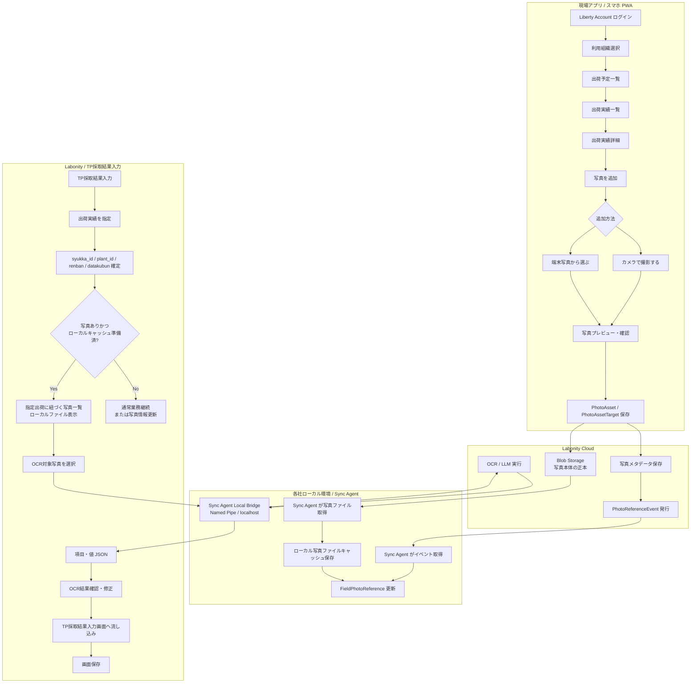

Labonity デスクトップアプリは、写真表示・OCR実行のためにクラウドへ直接認証しない。写真表示はローカルファイルキャッシュを参照し、OCR実行は Sync Agent Local Bridge に依頼する。

### 2.2 Sync Agent を含む構成

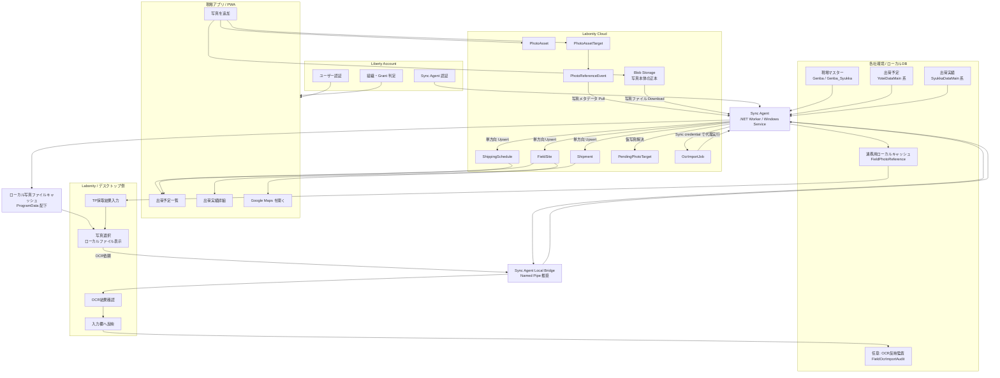

Sync Agent credential は `/api/sync/v1/...` のみを使用する。写真ファイル取得、OCR代理実行、OCR反映記録も Sync Agent 用 API として提供し、Labonity デスクトップアプリから `/api/core/v1/...` を直接呼ばない。

### 2.3 TP採取結果入力との連携

TP採取結果入力画面との連携は、出荷実績と画面コンテキストで行う。

| 領域 | クラウド | Labonity / ローカル |
|---|---|---|
| 出荷実績 | `Shipment.shipment_id` と `source_local_id = syukka_id` を保持する。 | `SyukkaDataMain.syukka_id` を持つ。 |
| 写真メタデータ | `PhotoAsset` / `PhotoAssetTarget` / `PhotoReferenceEvent` で管理する。 | `FieldPhotoReference` で写真有無・一覧・ローカルキャッシュ状態を参照する。 |
| 写真ファイル | Blob Storage を正本とする。 | Sync Agent がローカルファイルキャッシュへ保存し、Labonity デスクトップがローカルパスから表示する。 |
| フレッシュ試験行 | 永続キーとしては扱わない。 | `testpiecesaisyu_main_id + renban + datakubun` で保存する。 |
| OCR 反映先 | `client_context_json` に画面コンテキストを保持する。 | 現在行の `renban` と現在表示中の `datakubun` に反映する。 |
| OCR 実行 | Sync Agent credential で OCR API を代理実行する。 | デスクトップは Sync Agent Local Bridge に依頼し、クラウド認証を行わない。 |
| DB 保存 | OCR API は直接保存しない。 | TP採取結果入力画面の保存操作で保存する。 |

---

## 3. 認証・認可・マルチテナント設計

### 3.1 基本方針

現場試験 Web アプリ、クラウド API、Sync Agent は Liberty Account の仕組みを使用して認証・認可を行う。

Labonity デスクトップアプリは Liberty Account 認証を行わない。デスクトップ側の写真参照・OCR取込は、ローカルDB、ローカル写真ファイルキャッシュ、Sync Agent Local Bridge を使用する。

| 項目 | 方針 |
|---|---|
| 認証基盤 | Liberty Account。 |
| 現場試験 Web アプリ | OAuth2 Authorization Code + PKCE を使用する。 |
| Sync Agent | Liberty Account のサービス主体または機密クライアントで非対話認証する。 |
| Labonity デスクトップアプリ | Liberty Account 認証を行わない。クラウド API を直接呼び出さない。 |
| テナント ID | Liberty Account の `orgId` を本システムの `tenant_id` として扱う。 |
| 利用可否 | `serviceCode = LABONITY_FIELD_TEST` の Grant とサービスメンバー状態で判定する。 |
| API 境界 | `/api/core/v1/orgs/{orgId}/...`、`/api/sync/v1/orgs/{orgId}/...` のように orgId を URL に含める。 |
| データ分離 | URL の orgId、トークンの所属 org、DB の `tenant_id` が一致する場合だけアクセスを許可する。 |
| ローカル利用境界 | Labonity デスクトップアプリは、同一 PC / 同一 LAN 内のローカルDBと Sync Agent Local Bridge のみを使用する。 |

### 3.2 現場試験 Web アプリのログイン

ログインフローは次の通りである。

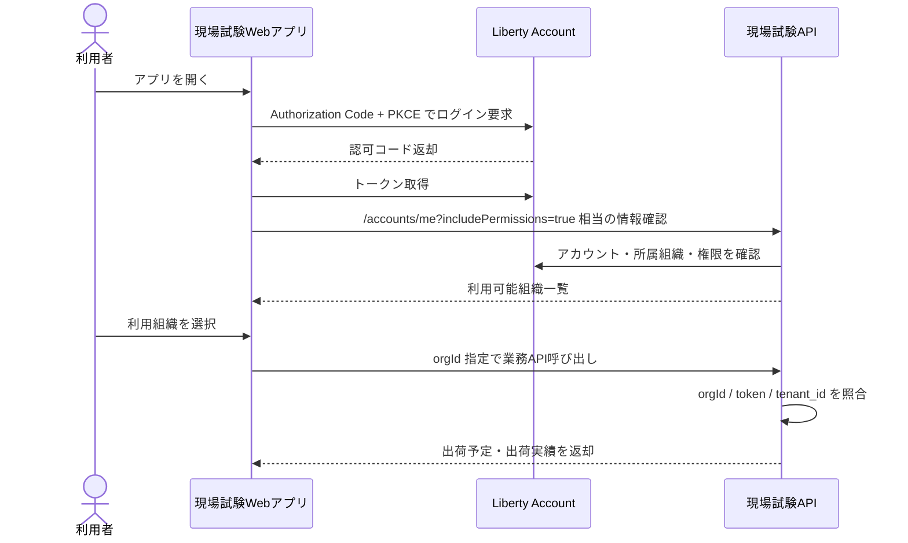

ログイン後、アプリは次を行う。

1. 呼び出し元アカウントの `accountId`、メール、表示名を取得する。
2. `includePermissions=true` により、所属組織ごとの権限を取得する。
3. `LABONITY_FIELD_TEST` の Grant が利用可能な組織だけを候補にする。
4. 複数組織に所属する場合は、利用組織選択画面を表示する。
5. 選択した `orgId` をアプリの現在テナントとして保持する。

### 3.3 組織選択

複数組織に所属するユーザーは、ログイン後に利用組織を選択する。

```text
+----------------------------------+
| 利用組織を選択                   |
|----------------------------------|
| ログインユーザー: yamada@example |
|                                  |
| [ ABC生コン株式会社 ]            |
|   現場試験アプリ 利用可          |
|                                  |
| [ XYZ工業株式会社 ]              |
|   現場試験アプリ 利用可          |
|                                  |
+----------------------------------+
```

選択後は、全 API 呼び出しに orgId を含める。

```http
GET /api/core/v1/orgs/{orgId}/shipping-schedules?date=2026-06-10
```

### 3.4 サービス Grant 判定

現場試験アプリのサービスコードは次とする。

```text
LABONITY_FIELD_TEST
```

Grant 判定では次を確認する。

| 判定項目 | 内容 |
|---|---|
| 組織所属 | ユーザーが対象 orgId に所属している。 |
| 組織メンバー状態 | `ACTIVE` のメンバーである。 |
| サービス Grant | `LABONITY_FIELD_TEST` が対象 orgId で利用可能である。 |
| サービスメンバー | 対象ユーザーがサービス利用可能メンバーである。 |
| 有効期間 | Grant の有効期間内である。 |
| ロール権限 | 操作に必要な権限コードを持つ。 |

### 3.5 権限コード

現場試験アプリでは、次の権限コードを使用する。

| 権限コード | 用途 |
|---|---|
| `FieldTest:Schedule:Read` | 出荷予定一覧、出荷予定詳細の参照。 |
| `FieldTest:Shipment:Read` | 出荷実績一覧、出荷実績詳細の参照。 |
| `FieldTest:Photo:Read` | 写真一覧、サムネイル、閲覧URLの取得。 |
| `FieldTest:Photo:Write` | 写真アップロード、写真 commit、代表写真設定。 |
| `FieldTest:Photo:Delete` | 写真の論理削除。 |
| `FieldTest:Ocr:Execute` | OCR ジョブ作成、OCR 実行。 |
| `FieldTest:Ocr:Apply` | OCR 結果の確認済み反映記録。 |
| `FieldTest:Sync:Import` | Sync Agent による基幹参照データ import。 |
| `FieldTest:Sync:Read` | Sync Agent によるイベント取得。 |
| `FieldTest:Sync:Ack` | Sync Agent によるイベント ACK。 |
| `FieldTest:Sync:PhotoCacheRead` | Sync Agent による写真ファイル取得。 |
| `FieldTest:Sync:OcrExecute` | Sync Agent による OCR 代理実行。 |
| `FieldTest:Sync:OcrApply` | Sync Agent による OCR 反映記録。 |
| `FieldTest:Admin:Manage` | 管理設定、手動再同期、未解決仮写真の確認。 |

### 3.6 ロール例

| ロール | 代表権限 |
|---|---|
| 現場担当者 | `Schedule:Read`, `Shipment:Read`, `Photo:Read`, `Photo:Write` |
| 品質管理担当 | `Schedule:Read`, `Shipment:Read`, `Photo:Read`, `Ocr:Execute`, `Ocr:Apply` |
| 事務所担当 | `Schedule:Read`, `Shipment:Read`, `Photo:Read`, `Photo:Write`, `Ocr:Execute`, `Ocr:Apply` |
| 管理者 | 上記に加え `Photo:Delete`, `Admin:Manage` |
| Sync Agent | `Sync:Import`, `Sync:Read`, `Sync:Ack`, `Sync:PhotoCacheRead`, `Sync:OcrExecute`, `Sync:OcrApply` |

### 3.7 Sync Agent 認証

Sync Agent は対話ログインを行わない。テナント・工場・エージェント単位に発行された credential を使用してクラウド API へ接続する。

| 項目 | 内容 |
|---|---|
| 認証方式 | Client Credentials または Liberty Account のサービス主体認証。 |
| スコープ | `orgId + plantId + agentId` で固定する。 |
| 利用可能 API | `/api/sync/v1/...` のみ。 |
| 現場アプリ API | Sync Agent credential では使用不可。 |
| 写真ファイル取得 | Sync Agent credential で `/api/sync/v1/.../photos/.../content` を呼び出す。短時間閲覧URLを Labonity デスクトップアプリへ渡さない。 |
| OCR 代理実行 | Sync Agent credential で `/api/sync/v1/.../ocr/...` を呼び出す。OCR ジョブには `agentId` とローカル操作者情報を記録する。 |
| 監査 | import、event pull、ack、photo download、pending resolve、OCR代理実行をすべて AuditLog に記録する。 |

Sync Agent credential は、対象 `orgId + plantId` 以外の写真・OCR・出荷データにアクセスできない。

### 3.8 Labonity デスクトップアプリ認証なし方針

Labonity デスクトップアプリに Liberty Account ログイン画面、アクセストークン保存、クラウド API 認証処理を実装しない。

| 項目 | 方針 |
|---|---|
| 写真一覧 | ローカルDBの `FieldPhotoReference` を参照する。 |
| 写真表示 | `local_thumbnail_path`、`local_preview_path`、`local_original_path` のローカルファイルを表示する。 |
| 写真情報更新 | Sync Agent Local Bridge に更新依頼する。デスクトップからクラウドへ直接アクセスしない。 |
| OCR実行 | Sync Agent Local Bridge に依頼し、Sync Agent がクラウド OCR API を代理実行する。 |
| 操作者記録 | Liberty Account の `accountId` ではなく、Labonity 既存ログインユーザー、Windows ユーザー、端末名、画面セッションIDを `local_operator_context_json` として記録する。 |
| ローカル接続方式 | Windows Named Pipe を推奨する。localhost HTTP を使う場合は 127.0.0.1 bind、ランダムポート、Windows ACL またはローカル共有シークレットで保護する。 |
| 権限境界 | クラウド上の認可は Sync Agent credential で行い、ローカル端末内の利用可否は Labonity 既存権限または Windows ACL で制御する。 |

### 3.9 テナント分離

全テーブルに `tenant_id` を保持し、すべての検索・更新条件に含める。

| 対象 | 分離方法 |
|---|---|
| DB | `tenant_id` 必須。主な UNIQUE / INDEX に `tenant_id` と `plant_id` を含める。 |
| Blob | `orgId/plantId/...` をパスに含める。 |
| IndexedDB | ログイン orgId ごとにストアまたはキー空間を分離する。 |
| API | URL の orgId とトークン所属 org の一致を検証する。 |
| Sync Agent | credential に許可 orgId / plantId を紐づける。 |
| ローカル写真キャッシュ | `tenant_id + plant_id + syukka_id + photo_asset_id` をフォルダ・ファイルパスに含め、別工場・別テナントのファイルを混在させない。 |
| ログ | すべての監査ログに `tenant_id`、`plant_id`、`account_id` または `agent_id`、必要に応じてローカル操作者情報を保持する。 |

---

## 4. データ同期設計

### 4.1 同期方向

| 領域 | 同期方向 | 用途 |
|---|---|---|
| 現場関連データ | ローカルDB → クラウド | 現場名、住所、地図、出荷詳細表示に使用する。 |
| 出荷予定関連データ | ローカルDB → クラウド | 現場アプリの出荷予定一覧に使用する。 |
| 出荷実績関連データ | ローカルDB → クラウド | 出荷実績一覧・詳細、写真紐づけ、Labonity OCR 起点に使用する。 |
| 写真本体の正本 | 現場アプリ → Blob Storage | 現場で発生する写真本体を保存する。 |
| 写真メタデータ | クラウド → ローカル参照テーブル | デスクトップ / Labonity 側で写真有無、写真一覧、キャッシュ状態を判定する。 |
| 写真ファイルキャッシュ | Blob Storage → Sync Agent → ローカルファイルシステム | Labonity デスクトップアプリが認証なしで写真表示・OCR対象選択を行うために使用する。 |
| OCR代理実行 | Labonity デスクトップ → Sync Agent Local Bridge → クラウド | デスクトップアプリをクラウド認証させず、Sync Agent credential で OCR を実行する。 |
| 仮写真解決 | Sync Agent → クラウド | 出荷実績未同期時の仮写真を正式な出荷実績へ解決する。 |

### 4.2 Sync Agent の配置

| 項目 | 内容 |
|---|---|
| 実行形態 | .NET Worker Service / Windows Service。 |
| 配置場所 | 各社のローカルDBへ接続できる社内ネットワーク上。Labonity デスクトップアプリと同一端末または同一 LAN で参照できる場所に配置する。 |
| 通信方向 | Sync Agent からクラウドAPIへのアウトバウンド HTTPS。 |
| 認証 | Liberty Account の Sync Agent credential。テナント / 工場 / エージェント単位で発行する。 |
| 認可スコープ | `tenant_id + plant_id` を基本にする。予定Noや出荷Noの混線を防ぐ。 |
| 冪等性 | `source_system` / `source_table` / `source_local_id` / `source_hash` / `idempotency_key` で担保する。 |
| ローカルDB接続 | ローカルDBの読み取りを基本とする。写真参照イベントの反映先は連携用ローカルキャッシュとする。 |
| ローカルファイル保存 | `%ProgramData%\Liberty\Labonity\FieldPhotoCache\{tenant_id}\{plant_id}\...` 配下を標準とする。設定で変更可能にする。 |
| ローカル Bridge | Windows Named Pipe を推奨する。Labonity デスクトップアプリから写真更新・OCR実行を依頼するために使用する。 |
| ローカルDBへの写真保存 | 行わない。ローカルDBにはローカルファイルパスとキャッシュ状態だけを保持する。 |

### 4.3 現場関連データ

| クラウドテーブル | 元データ例 | 主な用途 |
|---|---|---|
| `FieldSite` | `Genba`, `Genba_Syukka` | 現場名、住所、地図、出荷表示。 |
| `FieldSiteContact` | `Genba_Renrakusaki` 等 | 連絡先表示が必要な場合。 |
| `FieldSiteConcreteSpec` | `Genba_Haigo` 等 | 配合・現場別表示補助が必要な場合。 |

`FieldSite` の最低限必要な項目は次の通り。

| 項目 | 説明 |
|---|---|
| `field_site_id` | クラウド側ID。 |
| `tenant_id` | Liberty Account の orgId。 |
| `plant_id` | 工場ID。 |
| `source_local_id` | ローカル `Genba.id` 等。 |
| `site_name1` / `site_name2` | 現場名。 |
| `shipping_site_name1` / `shipping_site_name2` | `Genba_Syukka` の出荷用現場名。 |
| `site_short_name` | 略称。 |
| `address1` / `address2` | Google Maps 起動に使う住所。 |
| `latitude` / `longitude` | `Genba_Syukka.ido` / `Genba_Syukka.keido` を正規化して保持する。 |
| `map_query_text` | 住所と現場名から生成した検索文字列。 |
| `updated_source_at` | ローカル側最終更新日時。 |
| `source_hash` | 差分判定用ハッシュ。 |

### 4.4 出荷予定関連データ

| クラウドテーブル | 元データ例 | 主な用途 |
|---|---|---|
| `ShippingSchedule` | `YoteiDataMain` | 出荷予定一覧。 |
| `ShippingScheduleNote` | `YoteiData_Biko` | 必要に応じて備考表示。 |
| `ShippingScheduleTpFlag` | `YoteiData_TpSaisyu`, `YoteiData_Okinawa` 等 | TP 対象参考表示。 |

`ShippingSchedule` の最低限必要な項目は次の通り。

| 項目 | 説明 |
|---|---|
| `shipping_schedule_id` | クラウド側ID。 |
| `tenant_id` | テナント ID。 |
| `plant_id` | `YoteiDataMain.kozyo_id` 相当。 |
| `source_local_id` | ローカル `yotei_id`。 |
| `shipping_date` | `syukka_yoteibi`。 |
| `schedule_no` | `yotei_no`。予定No単独では一意にしない。 |
| `field_site_id` | 現場ID。 |
| `field_site_source_local_id` | ローカル `genba_id`。 |
| `mix_id` / `mix_name` | 配合。 |
| `scheduled_time` | 予定時刻。 |
| `planned_vehicle_count` | 出荷予定台数。 |
| `planned_quantity` | 出荷予定数量。 |
| `source_hash` | 差分判定用ハッシュ。 |

推奨自然キーは次の通り。

```text
tenant_id + plant_id + source_system + source_table + source_local_id
```

予定Noを表示・検索に使う場合も、内部処理では `plant_id` を必ず併用する。

### 4.5 出荷実績関連データ

| クラウドテーブル | 元データ例 | 主な用途 |
|---|---|---|
| `Shipment` | `SyukkaDataMain` | 出荷実績一覧・詳細、写真紐づけ。 |
| `ShipmentTpTarget` | `SyukkaData_TpSaisyu` | TP 対象情報の参考表示。 |
| `ShipmentSlip` | `SyukkaData_Denpyo` | 伝票系情報が必要な場合。 |

`Shipment` の最低限必要な項目は次の通り。

| 項目 | 説明 |
|---|---|
| `shipment_id` | クラウド側ID。写真紐づけの `PhotoAssetTarget.target_id`。 |
| `tenant_id` | テナント ID。 |
| `plant_id` | `SyukkaDataMain.kozyo_id` 相当。 |
| `source_local_id` | ローカル `SyukkaDataMain.syukka_id`。 |
| `shipping_schedule_id` | クラウド出荷予定ID。 |
| `shipping_schedule_source_local_id` | ローカル `YoteiDataMain.yotei_id`。 |
| `seq_no` | 出荷実績の Seq No。 |
| `shipping_date` | 出荷日。 |
| `shipping_time` | 出荷時刻。 |
| `vehicle_no` | 車番。 |
| `quantity` | 出荷数量。 |
| `manufactured_quantity` | 製造量。 |
| `field_site_id` | 現場ID。 |
| `mix_id` / `mix_name` | 配合。 |
| `tp_target_flag` | TP 採取対象参考フラグ。 |
| `source_hash` | 差分判定用ハッシュ。 |

### 4.6 差分同期方式

| 項目 | 内容 |
|---|---|
| 差分検出 | `rowversion`、最終更新日時、または対象項目の `source_hash` を使用する。 |
| Upsert | `tenant_id + plant_id + source_system + source_table + source_local_id` を自然キーにする。 |
| 削除 | 物理削除ではなく `deleted_at` / `is_deleted` を同期する。 |
| 再送 | 同一 `idempotency_key` は重複登録しない。 |
| チェックポイント | テーブルごと・テナントごと・工場ごとに `SyncCheckpoint` を保持する。 |
| フル同期 | 夜間または手動で再同期できるようにする。 |

### 4.7 同期周期

| データ | 推奨周期 |
|---|---|
| 当日・翌日の出荷予定 / 出荷実績 | 1〜5分。 |
| 現場マスター | 5〜30分、または変更検知時。 |
| 過去データ補正 | 夜間バッチまたは手動再同期。 |
| 写真メタデータイベント | 1〜5分、またはデスクトップ側確認前に手動取得。 |
| 写真ファイルキャッシュ | PhotoReferenceEvent 取得直後にサムネイル・プレビュー・OCR用画像を優先取得する。原本は設定により即時取得または写真選択時のオンデマンド取得とする。 |
| 仮写真解決 | 出荷実績同期後すぐ。 |
| キャッシュ再検証 | 夜間または起動時に `FieldPhotoReference.local_cache_status != ready`、`content_version` 不一致、削除イベント未反映のものを再処理する。 |

写真選択画面を開く直前に [写真情報を更新] が押された場合、Labonity デスクトップアプリは Sync Agent Local Bridge へ更新依頼する。Sync Agent は対象 `tenant_id + plant_id + syukka_id` のイベント取得、メタデータ反映、必要ファイルダウンロードを優先実行する。

---

## 5. 出荷実績未同期時の仮写真設計

### 5.1 基本方針

現場では、写真を撮りたい時点で出荷実績がまだクラウドに同期されていないことがある。その場合でも、予定・日付・工場・車番・時刻などの情報を使って仮写真として保存できる。

仮写真は、出荷実績同期後に Sync Agent が正式な `Shipment` へ解決する。誤紐づけを防ぐため、自動解決は候補が明確に 1 件へ絞れる場合だけ行う。

### 5.2 PendingPhotoTarget

| 項目 | 型 | 説明 |
|---|---|---|
| `pending_photo_target_id` | uuid | 仮紐づけ ID。 |
| `tenant_id` | uuid | テナント ID。 |
| `plant_id` | uuid | 工場 ID。 |
| `shipping_schedule_id` | uuid null | クラウド予定 ID。 |
| `schedule_source_local_id` | uniqueidentifier | ローカル `YoteiDataMain.yotei_id`。 |
| `schedule_no` | int null | 表示・補助照合用の予定No。内部キーにはしない。 |
| `shipping_date` | date | 出荷日。 |
| `vehicle_no` | nvarchar(12) null | 入力または画面表示時の車番。 |
| `vehicle_no_normalized` | nvarchar(12) null | 空白、全角半角、ハイフン等を正規化した車番。 |
| `shipping_time_hint` | time null | 撮影時点または画面上の出荷時刻候補。 |
| `photo_asset_id` | uuid | 写真 ID。 |
| `resolve_status` | nvarchar | `pending` / `resolved` / `ambiguous` / `failed` / `expired`。 |
| `resolved_shipment_id` | uuid null | 解決後の `Shipment.shipment_id`。 |
| `resolved_syukka_id` | uniqueidentifier null | 解決後の `SyukkaDataMain.syukka_id`。 |
| `candidate_count` | int null | 最終解決時の候補数。 |
| `matching_score` | int null | 自動解決に使用したスコア。 |
| `resolve_reason` | nvarchar(200) null | 解決または未解決理由。 |
| `last_attempted_at` | datetimeoffset null | 最終解決試行日時。 |
| `created_by` | uuid | 登録者。 |
| `created_at` | datetimeoffset | 作成日時。 |
| `resolved_at` | datetimeoffset null | 解決日時。 |

### 5.3 解決候補抽出

候補抽出は、以下の条件を基本とする。

```text
必須条件:
  tenant_id = pending.tenant_id
  plant_id = pending.plant_id
  shipping_date = pending.shipping_date
  deleted_at IS NULL

優先条件:
  schedule_source_local_id がある場合は Shipment.shipping_schedule_source_local_id と一致
  vehicle_no_normalized がある場合は Shipment.vehicle_no 正規化値と一致
  shipping_time_hint がある場合は Shipment.shipping_time と近い
```

予定・工場・日付が一致しない候補は採用しない。予定Noは表示補助であり、内部照合では `schedule_source_local_id` を優先する。

### 5.4 スコアリングと自動解決条件

自動解決は、候補が 1 件に明確化できる場合だけ行う。

| 条件 | スコア |
|---|---:|
| `schedule_source_local_id` 一致 | +100 |
| 車番正規化値一致 | +40 |
| `shipping_time_hint` との差が 15 分以内 | +30 |
| `shipping_time_hint` との差が 30 分以内 | +20 |
| `shipping_time_hint` との差が 60 分以内 | +10 |
| 同一予定内で候補が 1 件のみ | +30 |
| 車番が空で同一予定・同一日候補が複数 | -100 |
| 同一車番が同日に複数存在 | -50 |

自動解決条件は次の通りとする。

```text
1. 必須条件をすべて満たす。
2. 最高スコア候補が 1 件である。
3. 最高スコアが 130 以上である。
4. 2位候補との差が 30 点以上である。
5. 車番が空の場合は、同一予定・同一日・時刻近傍の候補が 1 件だけである。
```

上記を満たす場合は `resolved` とし、`PhotoAssetTarget` を `target_type = shipment` で作成する。候補が複数ある場合、スコア差が小さい場合、車番が空で候補が複数ある場合は `ambiguous` とする。

### 5.5 時刻近傍ルール

| 状態 | 許容幅 |
|---|---|
| 車番一致あり | 初期値 ±30 分。設定により ±60 分まで拡張可。 |
| 車番なし | 初期値 ±15 分。候補 1 件のみの場合だけ自動解決可。 |
| 同一予定内で出荷実績が 1 件のみ | ±120 分まで許容可。ただしスコア条件を満たすこと。 |
| 同一車番が同日複数回 | 自動解決しない。`ambiguous` とする。 |

### 5.6 解決タイミング

- 出荷実績 import 後、同一 `tenant_id + plant_id + shipping_date` の `pending` を即時再評価する。
- `PhotoReferenceEvent` の `target_resolved` 発行後、Sync Agent は `FieldPhotoReference` を更新し、写真ファイルキャッシュを取得する。
- 夜間バッチで一定期間内の `pending` / `ambiguous` を再評価する。
- 一定期間を過ぎても解決できない場合は `expired` とし、管理ログに出す。

### 5.7 Labonity 側候補表示

Labonity 側の写真候補表示は、正式に `Shipment` へ解決され、かつローカル写真ファイルキャッシュが利用可能な写真を対象とする。仮写真のままの写真、`ambiguous` の写真、キャッシュ未取得の写真は、誤紐づけ防止のため TP採取結果入力画面の OCR 候補には出さない。

ただし、キャッシュ未取得の場合は「写真情報あり / 取得中」状態として表示し、[写真情報を更新] で Sync Agent に優先取得を依頼できる。

## 6. 写真保存設計

### 6.1 基本方針

写真本体は Blob Storage に保存し、DB には写真メタデータと対象データとの関連のみ保存する。Base64 で DB に写真本体を保存しない。

写真は出荷実績単位で扱う。クラウドでは `Shipment.shipment_id` を関連の主キーとして使用し、Labonity 側の参照用に `SyukkaDataMain.syukka_id` 相当の source local ID も保持する。

### 6.2 PhotoAsset

| 項目 | 型 | 説明 |
|---|---|---|
| `photo_asset_id` | uuid | 写真 ID。 |
| `tenant_id` | uuid | テナント ID。 |
| `plant_id` | uuid | 工場 ID。 |
| `blob_path` | nvarchar | 原本写真の Blob パス。 |
| `thumbnail_path` | nvarchar | サムネイル Blob パス。 |
| `taken_at` | datetimeoffset | 撮影日時。端末写真の場合は取得可能な日時を使用する。 |
| `source_type` | nvarchar | `camera` / `library`。撮影か端末写真選択かを表す。 |
| `mime_type` | nvarchar | `image/jpeg` など。 |
| `size_bytes` | bigint | ファイルサイズ。 |
| `width` / `height` | int | 画像サイズ。 |
| `orientation` | int null | EXIF orientation。 |
| `file_hash` | nvarchar | 重複検知・冪等保存用のハッシュ。 |
| `quality_warnings_json` | json | ぼけ、暗さ、傾きなどの警告。任意。 |
| `upload_status` | nvarchar | `uploading` / `uploaded` / `committed` / `failed`。 |
| `created_by` | uuid | 登録者。 |
| `created_at` | datetimeoffset | 登録日時。 |
| `updated_at` | datetimeoffset | 更新日時。 |
| `deleted_at` | datetimeoffset null | 論理削除日時。 |

### 6.3 PhotoAssetTarget

| 項目 | 型 | 説明 |
|---|---|---|
| `photo_asset_target_id` | uuid | 関連 ID。 |
| `tenant_id` | uuid | テナント ID。 |
| `plant_id` | uuid | 工場 ID。 |
| `photo_asset_id` | uuid | 写真 ID。 |
| `target_type` | nvarchar | 原則 `shipment`。 |
| `target_id` | uuid | クラウド `Shipment.shipment_id`。 |
| `target_source_local_id` | uniqueidentifier | ローカル `SyukkaDataMain.syukka_id`。 |
| `display_order` | int | 同一出荷内の表示順。 |
| `is_primary` | bit | 代表写真フラグ。一覧・初期表示用。 |
| `created_at` | datetimeoffset | 作成日時。 |
| `deleted_at` | datetimeoffset null | 論理削除日時。 |

### 6.4 制約とインデックス

写真関連の制約・インデックスには `plant_id` を含める。`syukka_id` が全体一意であっても、工場別同期・ログ調査・誤検索防止のため、検索条件と制約の基本形を `tenant_id + plant_id` にそろえる。

```sql
CREATE UNIQUE INDEX UX_PhotoAssetTarget_TargetAsset
ON PhotoAssetTarget (
    tenant_id,
    plant_id,
    photo_asset_id,
    target_type,
    target_id
)
WHERE deleted_at IS NULL;
```

```sql
CREATE INDEX IX_PhotoAssetTarget_Target
ON PhotoAssetTarget (
    tenant_id,
    plant_id,
    target_type,
    target_id,
    is_primary DESC,
    display_order ASC,
    photo_asset_id ASC
)
WHERE deleted_at IS NULL;
```

```sql
CREATE INDEX IX_PhotoAssetTarget_TargetSourceLocal
ON PhotoAssetTarget (
    tenant_id,
    plant_id,
    target_type,
    target_source_local_id,
    is_primary DESC,
    display_order ASC,
    photo_asset_id ASC
)
WHERE deleted_at IS NULL;
```

同一対象の代表写真は 1 件のみとする。

```sql
CREATE UNIQUE INDEX UX_PhotoAssetTarget_Primary
ON PhotoAssetTarget (
    tenant_id,
    plant_id,
    target_type,
    target_id
)
WHERE is_primary = 1
  AND deleted_at IS NULL;
```

### 6.5 写真分類の扱い

写真分類は設計対象外とする。

| 項目 | 扱い |
|---|---|
| `photo_category` | 使用しない。 |
| 黒板 / その他の分類 UI | 表示しない。 |
| 写真種別による絞込 | 行わない。 |
| 固定写真列 | `photo1_blob_path` / `photo2_blob_path` のような固定列は作らない。 |

### 6.6 画像形式と前処理

| 項目 | 内容 |
|---|---|
| 受入形式 | JPEG / PNG / HEIC 等。サーバー側またはクライアント側で JPEG 正規化できる構成にする。 |
| EXIF orientation | サムネイル生成時に補正する。 |
| OCR 用画像 | 必要に応じて長辺縮小、傾き補正、コントラスト補正を行う。 |
| 原本保持 | OCR 前処理後画像とは別に、原本を保持する。 |
| サイズ制限 | upload-session で `maxSizeBytes` と `acceptedContentTypes` を返す。 |

---

## 7. 写真メタデータ・ローカル写真ファイルキャッシュ設計

### 7.1 採用方式

写真本体の正本はクラウド Blob Storage に保存する。Labonity デスクトップアプリでの表示・OCR対象選択は、Sync Agent が取得したローカル写真ファイルキャッシュを使用する。

この方式により、Labonity デスクトップアプリに Liberty Account 認証、アクセストークン保存、クラウド API 呼び出しを実装しない。

```text
現場アプリ → クラウド Blob Storage に写真アップロード
クラウド → PhotoReferenceEvent 発行
Sync Agent → 写真メタデータ取得
Sync Agent → 写真ファイルをローカルキャッシュへ保存
Labonity デスクトップ → FieldPhotoReference とローカルファイルを参照
```

ローカルDBには写真本体を保存しない。ローカルDBには写真メタデータ、ローカルファイルパス、キャッシュ状態のみを保存する。

### 7.2 ローカル参照用テーブル

テーブル名: `FieldPhotoReference`

| 項目 | 型 | 説明 |
|---|---|---|
| `photo_reference_id` | uniqueidentifier | ローカル参照行ID。 |
| `tenant_id` | uniqueidentifier | テナントID。 |
| `plant_id` | uniqueidentifier | 工場ID。 |
| `photo_asset_id` | uniqueidentifier | クラウド PhotoAsset ID。 |
| `photo_asset_target_id` | uniqueidentifier | クラウド PhotoAssetTarget ID。 |
| `target_type` | nvarchar | 原則 `shipment`。 |
| `target_local_id` | uniqueidentifier | ローカル `SyukkaDataMain.syukka_id`。 |
| `target_cloud_id` | uniqueidentifier | クラウド `Shipment.shipment_id`。 |
| `taken_at` | datetimeoffset | 撮影日時。 |
| `source_type` | nvarchar | `camera` / `library`。 |
| `thumbnail_blob_path` | nvarchar | サムネイル Blob パス。直接表示には使わない。 |
| `original_blob_path` | nvarchar | 原本 Blob パス。直接アクセスには使わない。 |
| `local_thumbnail_path` | nvarchar(500) null | ローカルサムネイルファイルパス。 |
| `local_preview_path` | nvarchar(500) null | ローカル表示用ファイルパス。 |
| `local_original_path` | nvarchar(500) null | ローカル原本ファイルパス。原本キャッシュを行う設定の場合に使用する。 |
| `local_ocr_image_path` | nvarchar(500) null | OCR用に正規化したローカル画像パス。必要に応じて生成する。 |
| `local_cache_status` | nvarchar | `pending` / `downloading` / `ready` / `partial` / `failed` / `deleted`。 |
| `local_cache_error` | nvarchar(1000) null | 取得失敗時のエラー内容。 |
| `local_cached_at` | datetimeoffset null | ローカルキャッシュ完了日時。 |
| `local_file_hash` | nvarchar null | ローカルファイル検証用ハッシュ。 |
| `local_cache_version` | int | ローカルキャッシュ版数。写真更新・再生成時に増やす。 |
| `content_version` | bigint | クラウド側ファイル版数。イベントから取得する。 |
| `is_primary` | bit | 代表写真。 |
| `display_order` | int | 表示順。 |
| `file_hash` | nvarchar | 重複確認用。 |
| `quality_warnings_json` | nvarchar(max) | 画質警告。 |
| `deleted_at` | datetimeoffset null | 取消・削除扱い。 |
| `event_sequence` | bigint | 最終反映イベントシーケンス。 |
| `synced_at` | datetimeoffset | ローカル反映日時。 |

### 7.3 ローカルファイル配置

標準配置は次の通りとする。

```text
%ProgramData%\Liberty\Labonity\FieldPhotoCache\
  {tenant_id}\
    {plant_id}\
      {yyyyMMdd}\
        {syukka_id}\
          {photo_asset_id}\
            thumbnail.jpg
            preview.jpg
            original.jpg
            ocr.jpg
            metadata.json
```

| ファイル | 用途 |
|---|---|
| `thumbnail.jpg` | 写真一覧のサムネイル表示。必須。 |
| `preview.jpg` | 写真選択画面・プレビュー表示。必須。 |
| `original.jpg` | 原本確認、再生成、将来の高精度OCR用。設定により必須または任意。 |
| `ocr.jpg` | OCRに適した向き補正・長辺縮小・JPEG正規化済み画像。必要に応じて生成。 |
| `metadata.json` | 取得元、ハッシュ、生成日時、画像サイズ、イベントシーケンス。任意。 |

ローカルファイルは、Windows ACL で Sync Agent サービスアカウント、Administrators、Labonity 利用ユーザーまたは Labonity 実行ユーザーに限定する。

### 7.4 写真有無判定

```sql
SELECT TOP (1) 1
FROM FieldPhotoReference
WHERE tenant_id = @tenant_id
  AND plant_id = @plant_id
  AND target_type = 'shipment'
  AND target_local_id = @syukka_id
  AND deleted_at IS NULL;
```

`plant_id` を必ず条件に含める。予定Noや車番ではなく、出荷実績の `syukka_id` を基準にする。

### 7.5 写真一覧取得

```sql
SELECT *
FROM FieldPhotoReference
WHERE tenant_id = @tenant_id
  AND plant_id = @plant_id
  AND target_type = 'shipment'
  AND target_local_id = @syukka_id
  AND deleted_at IS NULL
ORDER BY
  is_primary DESC,
  display_order ASC,
  taken_at ASC,
  photo_asset_id ASC;
```

表示対象は `local_cache_status IN ('ready', 'partial')` を基本とする。`partial` の場合はサムネイルのみ表示し、プレビューまたは OCR 実行時に Sync Agent へ優先取得を依頼する。

### 7.6 縦割り時の写真検索

TP採取結果入力画面で `renban` ごとに出荷実績が選択されている場合、画面上の対象 `syukka_id` と `plant_id` から写真を検索する。

既に保存済みの TP で `TestPieceSaisyu_SyukkaData` から出荷をたどる場合の考え方は次の通り。

```sql
SELECT r.*
FROM TestPieceSaisyu_SyukkaData ts
JOIN SyukkaDataMain s
  ON s.syukka_id = ts.syukka_id
JOIN FieldPhotoReference r
  ON r.tenant_id = @tenant_id
 AND r.plant_id = s.kozyo_id
 AND r.target_type = 'shipment'
 AND r.target_local_id = ts.syukka_id
 AND r.deleted_at IS NULL
WHERE ts.testpiecesaisyu_main_id = @testpiecesaisyu_main_id
  AND ts.renban = @renban
ORDER BY
  r.is_primary DESC,
  r.display_order ASC,
  r.taken_at ASC,
  r.photo_asset_id ASC;
```

新規入力中は、画面で選択中の `syukka_id` と `plant_id` を使って検索する。

### 7.7 キャッシュ状態

| 状態 | 意味 | Labonity 側表示 |
|---|---|---|
| `pending` | メタデータのみ同期済み。ファイル未取得。 | 「写真情報あり / 取得待ち」。 |
| `downloading` | Sync Agent が取得中。 | 「取得中」。 |
| `ready` | サムネイル・プレビュー・OCR用画像が利用可能。 | 写真表示・OCR選択可。 |
| `partial` | サムネイルのみ等、一部ファイルのみ利用可能。 | サムネイル表示可。OCR時は更新依頼。 |
| `failed` | 取得失敗。 | 「取得失敗」。再取得ボタン表示。 |
| `deleted` | 削除イベント反映済み。 | 表示しない。 |

### 7.8 Sync Agent による写真ファイル取得

Sync Agent は `PhotoReferenceEvent` を取得し、`FieldPhotoReference` を更新した後、以下の順でファイルを取得する。

1. `thumbnail` を取得する。
2. `preview` を取得する。
3. OCR用正規化画像 `ocr` を生成または取得する。
4. 設定で原本キャッシュを有効にしている場合、`original` を取得する。
5. ハッシュ・サイズ・画像形式を検証する。
6. `local_cache_status` を `ready` または `partial` に更新する。
7. 取得失敗時は `failed` とし、次周期または手動更新で再試行する。

### 7.9 画像表示 URL 発行の扱い

Labonity デスクトップアプリ向けには、クラウドの短時間閲覧 URL を発行しない。

現場 Web アプリや管理画面など、Liberty Account で認証済みの Web UI が写真を表示する場合のみ、従来の短時間閲覧 URL または同等の安全な配信方式を使用できる。

```http
POST /api/core/v1/orgs/{orgId}/photos/{photoAssetId}/download-url
```

この API は Labonity デスクトップアプリからは呼び出さない。

## 8. PhotoReferenceEvent 設計

### 8.1 基本方針

クラウド側で写真の作成、削除、代表写真変更、表示順変更、対象解決、写真ファイル更新が発生した場合、`PhotoReferenceEvent` を発行する。Sync Agent はイベントを取得し、`FieldPhotoReference` とローカル写真ファイルキャッシュへ反映する。

イベントは少なくとも 1 回配信される前提とし、Sync Agent 側で冪等反映、順序制御、ACK、再取得を行う。

### 8.2 イベント項目

| 項目 | 説明 |
|---|---|
| `event_id` | イベントID。 |
| `tenant_id` | テナントID。 |
| `plant_id` | 工場ID。 |
| `event_sequence` | `tenant_id + plant_id` 内で単調増加するシーケンス。 |
| `event_type` | `created` / `updated` / `deleted` / `primary_changed` / `display_order_changed` / `target_resolved` / `file_regenerated`。 |
| `photo_asset_id` | 写真ID。 |
| `photo_asset_target_id` | 対象関連ID。 |
| `target_type` | `shipment`。 |
| `target_cloud_id` | `Shipment.shipment_id`。 |
| `target_local_id` | `SyukkaDataMain.syukka_id`。 |
| `is_primary` | 代表写真。 |
| `display_order` | 表示順。 |
| `thumbnail_blob_path` | サムネイル Blob パス。 |
| `original_blob_path` | 原本 Blob パス。 |
| `content_version` | 写真ファイル版数。ファイル再生成時に増やす。 |
| `file_hash` | 原本ファイルハッシュ。 |
| `thumbnail_hash` | サムネイルファイルハッシュ。 |
| `preview_hash` | プレビュー画像ハッシュ。 |
| `deleted_at` | 削除日時。 |
| `payload_version` | ペイロードバージョン。 |
| `created_at` | イベント発行日時。 |

### 8.3 ローカル反映ルール

Sync Agent は、イベントごとに次の順で処理する。

1. `tenant_id + plant_id + event_id` の重複処理済み確認を行う。
2. `FieldPhotoReference` の現行 `event_sequence` より小さいイベントは破棄し、ACK は `ignored_old_event` として返す。
3. `created` / `updated` / `target_resolved` では `FieldPhotoReference` を upsert する。
4. `deleted` では `deleted_at` を反映し、ローカルファイルを削除または削除予定にする。
5. `primary_changed` / `display_order_changed` では代表・表示順を更新する。
6. `file_regenerated` では `content_version` を比較し、ローカルファイルを再取得する。
7. ローカルDB反映後、必要に応じて写真ファイルキャッシュを取得する。
8. 反映結果を ACK する。

### 8.4 ACK テーブル

ローカル側には ACK 状態を保持するテーブルを設ける。

テーブル名: `FieldPhotoReferenceEventAck`

| 項目 | 型 | 説明 |
|---|---|---|
| `event_id` | uniqueidentifier | イベントID。 |
| `tenant_id` | uniqueidentifier | テナントID。 |
| `plant_id` | uniqueidentifier | 工場ID。 |
| `agent_id` | uniqueidentifier | Sync Agent ID。 |
| `event_sequence` | bigint | イベントシーケンス。 |
| `status` | nvarchar | `applied` / `ignored_old_event` / `download_pending` / `failed` / `retryable_failed`。 |
| `applied_at` | datetimeoffset null | ローカルDB反映日時。 |
| `downloaded_at` | datetimeoffset null | 写真ファイル取得完了日時。 |
| `error_code` | nvarchar null | エラーコード。 |
| `error_message` | nvarchar null | エラー内容。 |
| `retry_count` | int | リトライ回数。 |
| `created_at` | datetimeoffset | 作成日時。 |
| `updated_at` | datetimeoffset | 更新日時。 |

### 8.5 ACK API

Sync Agent はイベントをローカルに反映した後、ACK を送信する。

```http
POST /api/sync/v1/orgs/{orgId}/photo-reference-events/{eventId}/ack
```

ACK には `agentId`、`plantId`、`appliedAt`、`status`、`localCacheStatus`、`errorCode`、`errorMessage` を含める。

### 8.6 再送・リトライ・順序制御

| 項目 | 仕様 |
|---|---|
| 取得単位 | `tenant_id + plant_id + agent_id`。 |
| 取得条件 | `sinceSequence` 以降、または ACK 未完了 / retryable のイベント。 |
| バッチサイズ | 初期値 100 件。設定で変更可能。 |
| 順序制御 | `event_sequence` 昇順で処理する。古いイベントで新しい状態を上書きしない。 |
| 再送条件 | ACK なし、`retryable_failed`、写真ファイル未取得で `download_pending` のもの。 |
| リトライ | 指数バックオフ。例: 1分、5分、15分、60分。 |
| 最大リトライ | 設定値。超過時は `failed` とし、管理ログへ出す。 |
| 手動再同期 | `plant_id + target_local_id` または日付範囲で `FieldPhotoReference` とローカルファイルを再構築できるようにする。 |

### 8.7 ファイル取得失敗時の扱い

メタデータ反映に成功し、写真ファイル取得に失敗した場合は、`FieldPhotoReference` を残し `local_cache_status = failed` とする。Labonity 側では「写真情報あり / 取得失敗」と表示し、[写真情報を更新] で Sync Agent に再取得を依頼する。

## 9. Google Maps 現場住所連携

### 9.1 基本方針

出荷実績詳細画面には、現場住所から Google Maps を開く導線を配置する。

アプリ内に地図を埋め込まず、Google Maps の外部起動を使用する。これにより、地図表示コンポーネントや API キー管理をシンプルにしつつ、現場担当者が地図確認・ナビ開始を行える。

### 9.2 同期する現場位置情報

`FieldSite` には、Google Maps 起動に必要な項目を保持する。

| 項目 | 説明 |
|---|---|
| `site_name1` / `site_name2` | 現場名。 |
| `shipping_site_name1` / `shipping_site_name2` | 出荷用現場名。 |
| `site_short_name` | 一覧表示用。 |
| `address1` / `address2` | `Genba.zyusyo1` / `Genba.zyusyo2`。 |
| `latitude` / `longitude` | `Genba_Syukka.ido` / `Genba_Syukka.keido` を正規化した値。 |
| `map_query_text` | 住所と現場名から生成した検索文字列。 |
| `map_source` | `latlng` / `address` / `manual` など。 |

### 9.3 表示ルール

| 状態 | UI |
|---|---|
| 緯度経度あり | [地図を開く] [ナビ開始] を表示。緯度経度を優先して起動する。 |
| 緯度経度なし・住所あり | 住所文字列で Google Maps を開く。 |
| 住所なし | ボタンを非活性にし、「住所未設定」と表示する。 |
| オフライン | 外部起動を試行し、失敗時は住所コピーを可能にする。 |

### 9.4 Google Maps URL 生成

#### 地図を開く

緯度経度がある場合:

```text
https://www.google.com/maps/search/?api=1&query={latitude},{longitude}
```

住所だけの場合:

```text
https://www.google.com/maps/search/?api=1&query={urlEncodedAddress}
```

#### ナビ開始

緯度経度がある場合:

```text
https://www.google.com/maps/dir/?api=1&destination={latitude},{longitude}&travelmode=driving&dir_action=navigate
```

住所だけの場合:

```text
https://www.google.com/maps/dir/?api=1&destination={urlEncodedAddress}&travelmode=driving&dir_action=navigate
```

### 9.5 注意事項

- 住所や緯度経度は現場アプリで編集しない。
- 住所が間違っている場合は、Labonity 側の現場マスターを修正し、Sync Agent により再同期する。
- `ido` / `keido` は文字列として保持されているため、空文字、0、不正値を正規化時に除外する。
- 地図で開いた位置が現場入口とずれる場合に備え、将来的に現場入口メモや手動ピン座標を保持できる余地を残す。
- アプリ内での経路計算、到着予定時刻計算、地図履歴保存は行わない。

---

## 10. TP採取結果入力からの写真選択フロー

### 10.1 画面起点

Labonity の **TP採取結果入力** 画面における出荷実績指定を起点とする。

ユーザーが対象の出荷実績を指定したタイミングで、対象の `syukka_id`、反映先 `renban`、反映先 `datakubun` が特定される。

- 通常取りの場合: 指定された行の `syukka_id` が特定される。
- 縦割りの場合: 指定された行の `syukka_id` と反映先 `TestPieceSaisyu_FreshSiken.renban` が同時に確定する。
- データ No.2 表示中の場合: `datakubun = 1` の入力欄に反映する。

### 10.2 写真の有無確認

出荷実績が指定された後、Labonity 側は `FieldPhotoReference` の存在有無とローカルキャッシュ状態を確認する。

- 写真があり、`local_cache_status = ready` の場合: 写真あり表示、または写真選択画面を起動する。
- 写真があり、`local_cache_status = partial` の場合: サムネイルを表示し、プレビューまたは OCR 実行前に Sync Agent へ優先取得を依頼する。
- 写真があり、`local_cache_status = pending / downloading` の場合: 「写真取得中」と表示し、通常業務は継続可能にする。
- 写真があり、`local_cache_status = failed` の場合: 「写真取得失敗」と表示し、[写真情報を更新] を表示する。
- 写真がない場合: 写真選択画面は起動せず、通常の出荷実績指定のみとして完了する。
- ローカル同期遅延が疑われる場合: [写真情報を更新] で Sync Agent Local Bridge に対象出荷のイベント取得・写真ファイル取得を依頼する。

Labonity デスクトップアプリは、この処理でクラウド API を直接呼び出さない。

### 10.3 自動起動ルール

写真選択画面の起動は次のルールとする。

| 状態 | UI |
|---|---|
| 写真なし | 何も表示しない、または「写真なし」と表示する。 |
| 写真あり・キャッシュ ready・反映先欄が空 | 写真選択画面を自動表示する、または [写真から取込] を強調表示する。 |
| 写真あり・キャッシュ ready・反映先欄に値あり | 自動表示せず、[写真から再取込] を表示する。 |
| 写真あり・キャッシュ pending / downloading | [写真取得中] を表示する。自動起動しない。 |
| 写真あり・キャッシュ failed | [写真情報を更新] を表示する。自動起動しない。 |
| 縦割り | 現在行の `renban` に対応する `syukka_id + plant_id` の写真だけを候補表示する。 |
| datakubun=1 | データ2画面の入力欄へ反映する。 |

### 10.4 写真一覧 UI 表示項目

| 表示項目 | 内容 |
|---|---|
| サムネイル | 写真を選びやすくする。 |
| 撮影日時 | `taken_at`。 |
| 登録元 | `camera` / `library`。 |
| 代表表示 | `is_primary = true` の写真に代表バッジを表示する。 |
| 紐づく出荷実績 | `syukka_id`, 車番, 出荷時刻。 |
| 画質警告 | ぼけ、暗さ、傾きなど。 |
| キャッシュ状態 | `ready` / `partial` / `failed` など。通常は `ready` の写真を候補表示する。 |

### 10.5 OCR対象写真選択

- 選択は 1 枚を基本とする。
- 黒板全体写真と拡大写真が分かれている場合は、複数枚選択を許可する。
- 複数枚の場合、AI OCR / LLM は全写真をまとめて解析し、1 つの統合 JSON を返す。
- 写真分類には依存せず、サムネイルを見て OCR 対象写真を選択する。

### 10.6 縦割り対応

縦割りでは、`renban` ごとに出荷実績が対応する。

```text
renban 0 -> 1台目の syukka_id -> 1台目の写真候補 -> FreshSiken renban 0
renban 1 -> 2台目の syukka_id -> 2台目の写真候補 -> FreshSiken renban 1
renban 2 -> 3台目の syukka_id -> 3台目の写真候補 -> FreshSiken renban 2
```

OCR結果の反映先は次で決まる。

```text
反映先 = TP採取結果入力画面の現在行 renban + 現在表示中 datakubun
```

---

## 11. AI OCR / LLM 取込設計

### 11.1 取込フロー

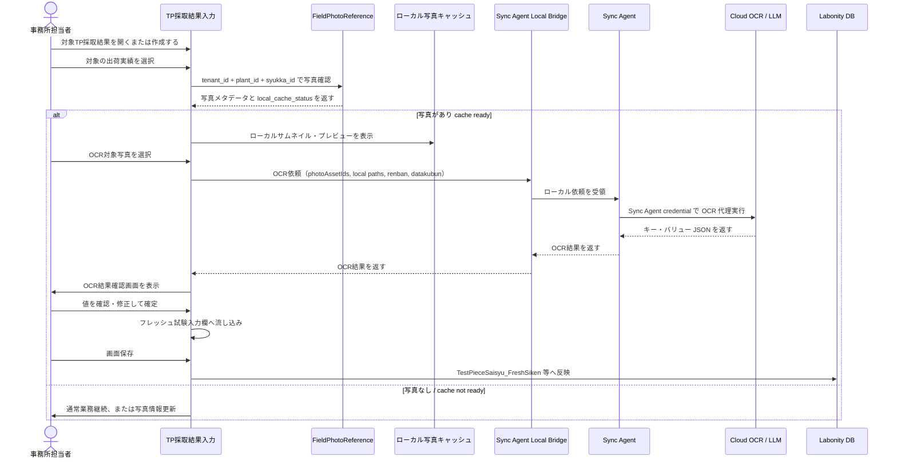

Labonity デスクトップアプリは Cloud OCR API を直接呼び出さない。OCR依頼は Sync Agent Local Bridge に送信し、クラウド側の認証・認可・監査は Sync Agent credential により行う。

### 11.2 OCR ジョブ

OCR ジョブは、出荷実績、写真、OCRスキーマ、画面コンテキストを入力として作成する。

Labonity デスクトップアプリから直接クラウド API へ作成しない。デスクトップアプリは Sync Agent Local Bridge に依頼し、Sync Agent が `/api/sync/v1/...` の OCR API を呼び出す。

| 項目 | 内容 |
|---|---|
| 出荷実績 | `shipmentId` または `shipmentSourceLocalId`。 |
| 写真 | `photoAssetIds`。1枚または複数枚。クラウド上に正本があるため、基本は ID 指定で OCR する。 |
| ローカルファイル | `localPreviewPath` / `localOcrImagePath`。確認表示・デバッグ・必要時の再送信用。 |
| スキーマ | `labonity.blackboardFreshTest.v1`。 |
| 画面コンテキスト | `renban`, `datakubun`, `screen`, `clientContextId`。 |
| ローカル操作者 | Labonity 既存ユーザー、Windows ユーザー、端末名を `localOperatorContext` として保持する。 |
| 反映 | 確認済みの値を TP採取結果入力画面の入力欄へ返す。 |
| 保存 | OCR API では Labonity DB へ直接保存しない。 |

### 11.3 OCR レスポンス形式

```json
{
  "schemaVersion": "labonity.blackboardFreshTest.v1",
  "source": {
    "shipmentId": "SHIPMENT-CLOUD-ID",
    "shipmentSourceLocalId": "SYUKKA-LOCAL-ID",
    "targetRenban": 0,
    "targetDatakubun": 0,
    "photoAssetIds": ["PHOTO-001", "PHOTO-002"],
    "model": "vision-llm",
    "processedAt": "2026-06-10T10:30:00+09:00"
  },
  "fields": [
    {
      "key": "slump",
      "labelText": "スランプ",
      "rawText": "18.0",
      "value": 18.0,
      "valueType": "number",
      "unit": "cm",
      "confidence": 0.88,
      "needsReview": true,
      "warnings": ["18.0 と 13.0 の判別がやや不確実"]
    },
    {
      "key": "air",
      "labelText": "空気量",
      "rawText": "4.5",
      "value": 4.5,
      "valueType": "number",
      "unit": "%",
      "confidence": 0.91,
      "needsReview": false,
      "warnings": []
    }
  ],
  "warnings": [
    "黒板右下が一部ぼけています。低信頼度の項目は確認してください。"
  ]
}
```

### 11.4 OCR 対象項目

| canonical key | 日本語名 | 型 | 単位 | 反映先候補 | 読取ルール |
|---|---|---|---|---|---|
| `vehicle_no` | 車番 | string | なし | `TestPieceSaisyu_FreshSiken.syaban` | TP 側は nchar(6) のため桁数を整形する。 |
| `outside_temperature` | 外気温 | string / number | ℃ | `TestPieceSaisyu_FreshSiken.gaikion` | nchar(6) へ整形する。 |
| `test_time` | 試験時間 | string | 時刻 | `TestPieceSaisyu_FreshSiken.sikenzikan` | HH:mm 等へ整形する。 |
| `slump` | スランプ | number | cm | `TestPieceSaisyu_FreshSiken.slump` | スランプ値。 |
| `flow1` | フロー1 | number | mm | `TestPieceSaisyu_FreshSiken.flow1` | 高流動の場合に抽出。 |
| `flow2` | フロー2 | number | mm | `TestPieceSaisyu_FreshSiken.flow2` | 高流動の場合に抽出。 |
| `air` | 空気量 | number | % | `TestPieceSaisyu_FreshSiken.air` | 空気量。 |
| `concrete_temperature` | コンクリート温度 | number | ℃ | `TestPieceSaisyu_FreshSiken.concrete_ondo` | 生コン温度。 |
| `unit_volume_mass` | 単位容積質量 | number | kg/m3 等 | `TestPieceSaisyu_FreshSiken.taniyosekisituryo` | 表記揺れを吸収する。 |
| `chloride1` | 塩化物量1 | number | kg/m3 | `TestPieceSaisyu_FreshSiken.enkabuturyo1` | 代表値 1 つを抽出。 |
| `chloride2` | 塩化物量2 | number | kg/m3 | `TestPieceSaisyu_FreshSiken.enkabuturyo2` | 2回目がある場合。 |
| `chloride3` | 塩化物量3 | number | kg/m3 | `TestPieceSaisyu_FreshSiken.enkabuturyo3` | 3回目がある場合。 |
| `unit_water` | 単位水量 | number | kg/m3 | `TestPieceSaisyu_FreshSiken.tanisuiryo` | 単位水量を抽出。 |
| `material_separation_check` | 材料分離目視確認 | integer/string | なし | `TestPieceSaisyu_FreshSiken.zairyobunrimokusikakunin` | 0:空白、1:有、2:無 などへマッピングする。 |
| `remarks` | 備考 | string | なし | `TestPieceSaisyu_FreshSiken.biko` | 10 文字超は切り詰め警告。 |

### 11.5 値整形・型変換ルール

OCR値は、画面へ流し込む前に canonical key ごとの型変換を行う。DB への保存は既存の TP採取結果入力画面の保存処理で行うため、最終的な DB バリデーションは既存処理に従う。

| 項目 | 整形 |
|---|---|
| 共通 | 前後空白除去、全角数字・全角記号の半角化、単位文字の分離、明らかな OCR ノイズ除去を行う。 |
| 空欄 | OCR未読取は `null` として扱う。既存値を自動で空欄にしない。 |
| `0` | OCR が明確に `0` と読んだ場合は数値 0 として扱い、空欄と区別する。 |
| 数値 | カンマ、`cm`、`mm`、`%`、`℃`、`kg/m3` 等の単位を除去し、`decimal` として保持する。 |
| `money` 型項目 | `decimal(19,4)` 相当で一度保持し、画面表示桁・保存桁は既存画面の設定に従う。桁あふれ時は反映不可として警告する。 |
| 丸め | OCR取込処理では原則丸めない。既存画面が持つ表示丸め・保存丸めがある場合は、その処理に委ねる。OCR確認画面には OCR原値と反映予定値を両方表示する。 |
| 車番 | 空白、全角半角、ハイフンを正規化し、出荷実績の `syaban` と突合する。不一致の場合は要確認にする。`nchar(6)` 反映時は画面既存仕様に合わせて桁整形する。 |
| 外気温 | `℃`、`度` を除去する。`gaikion` は `nchar(6)` のため、画面の入力形式に合わせた文字列へ整形する。 |
| 試験時間 | `HH:mm` を基本に整形する。時刻として解釈できない場合は要確認にする。 |
| 備考 | `biko` は 10 文字上限のため、超過時は切り詰め候補を表示し、警告を出す。 |
| 材料分離目視確認 | `有`, `あり`, `○` は 1、`無`, `なし`, `×` は 2、未読取は 0 または未変更とし、画面設定に従う。 |
| datakubun | 画面表示中のデータ区分へ反映する。OCR結果が `datakubun` を変更しない。 |

### 11.5.1 canonical key 別の変換詳細

| canonical key | 反映先 | 型変換 | 空欄時 | 差分時 |
|---|---|---|---|---|
| `vehicle_no` | `syaban` | 文字列正規化、最大 6 桁相当へ整形 | 既存値維持 | 出荷実績車番と違う場合は要確認 |
| `outside_temperature` | `gaikion` | 温度記号除去、文字列化 | 既存値維持 | 現在値と違う場合は要確認 |
| `test_time` | `sikenzikan` | `HH:mm` 形式へ整形 | 既存値維持 | 現在値と違う場合は要確認 |
| `slump` | `slump` | decimal | 未反映 | 現在値と違う場合は要確認 |
| `flow1` | `flow1` | decimal | 未反映 | 現在値と違う場合は要確認 |
| `flow2` | `flow2` | decimal | 未反映 | 現在値と違う場合は要確認 |
| `air` | `air` | decimal | 未反映 | 現在値と違う場合は要確認 |
| `concrete_temperature` | `concrete_ondo` | decimal | 未反映 | 現在値と違う場合は要確認 |
| `unit_volume_mass` | `taniyosekisituryo` | decimal | 未反映 | 現在値と違う場合は要確認 |
| `chloride1` | `enkabuturyo1` | decimal | 未反映 | 現在値と違う場合は要確認 |
| `chloride2` | `enkabuturyo2` | decimal | 未反映 | 現在値と違う場合は要確認 |
| `chloride3` | `enkabuturyo3` | decimal | 未反映 | 現在値と違う場合は要確認 |
| `unit_water` | `tanisuiryo` | decimal | 未反映 | 現在値と違う場合は要確認 |
| `material_separation_check` | `zairyobunrimokusikakunin` | 0 / 1 / 2 | 未変更または 0 | 現在値と違う場合は要確認 |
| `remarks` | `biko` | 10文字以内 | 既存値維持 | 超過・差分時は要確認 |

### 11.6 信頼度と確認

| 状態 | 処理 |
|---|---|
| 信頼度が高い | OK 表示。ただしユーザー確認画面を通す。 |
| 信頼度が低い | `confidence < 0.85` を目安に要確認。項目ごとの閾値は設定で変更可能にする。 |
| 候補が複数ある | 候補選択または手入力。 |
| 反映先欄に値あり・OCR値と同じ | OK 表示。 |
| 反映先欄に値あり・OCR値と異なる | 差分確認を必須にする。自動上書きしない。 |
| 出荷実績値とOCR値が不一致 | 車番、時刻などは要確認にする。 |

### 11.7 OcrImportJob

| 項目 | 型 | 説明 |
|---|---|---|
| `ocr_import_job_id` | uuid | OCR取込ジョブID。 |
| `tenant_id` | uuid | テナントID。 |
| `plant_id` | uuid | 工場ID。 |
| `shipment_id` | uuid null | クラウド出荷実績ID。 |
| `shipment_source_local_id` | uniqueidentifier | `SyukkaDataMain.syukka_id`。 |
| `target_renban` | tinyint null | 画面反映先 renban。監査・表示用。 |
| `target_datakubun` | tinyint null | 画面反映先 datakubun。監査・表示用。 |
| `client_context_json` | json | `screen`, `renban`, `datakubun`, `clientContextId` 等。 |
| `photo_asset_ids_json` | json | OCR対象写真ID配列。 |
| `ocr_engine` | nvarchar | OCR / LLM エンジン識別子。 |
| `ocr_model` | nvarchar | モデル識別子。 |
| `schema_version` | nvarchar | `labonity.blackboardFreshTest.v1`。 |
| `prompt_version` | nvarchar | プロンプトバージョン。 |
| `status` | nvarchar | `queued` / `processing` / `needs_review` / `reviewed` / `applied_to_screen` / `discarded` / `failed`。 |
| `raw_ocr_json` | json | OCR生結果。 |
| `extracted_values_json` | json | キー・バリュー抽出結果。 |
| `confidence_json` | json | 項目別信頼度。 |
| `warnings_json` | json | 警告・不確実性。 |
| `requested_by_agent_id` | uuid null | OCRを代理実行した Sync Agent ID。 |
| `local_operator_context_json` | json | Labonity 既存ユーザー、Windows ユーザー、端末名、画面セッションID 等。 |
| `reviewed_by` | uuid null | Liberty Account 利用時の確認者。デスクトップ認証なし方式では null 可。 |
| `reviewed_at` | datetimeoffset | 確認日時。 |
| `applied_by` | uuid null | Liberty Account 利用時の画面反映者。デスクトップ認証なし方式では null 可。 |
| `applied_at` | datetimeoffset | 画面反映日時。 |
| `created_at` | datetimeoffset | 作成日時。 |

### 11.8 OCR 反映監査

Labonity 側で OCR 反映結果を追跡する場合は、独立した監査テーブル `FieldOcrImportAudit` を使用する。

| 項目 | 説明 |
|---|---|
| `ocr_import_audit_id` | 監査ID。 |
| `tenant_id` | テナントID。 |
| `plant_id` | 工場ID。 |
| `ocr_import_job_id` | クラウド OCR ジョブID。 |
| `syukka_id` | 出荷ID。 |
| `testpiecesaisyu_main_id` | 保存済み TP の場合に記録する。未保存中は null 可。 |
| `renban` | 反映先 renban。 |
| `datakubun` | 反映先 datakubun。 |
| `photo_asset_ids_json` | 取込元写真。 |
| `ocr_values_json` | OCR値。 |
| `before_values_json` | 反映前画面値。 |
| `applied_values_json` | 反映値。 |
| `saved_values_json` | 保存後値。必要に応じて記録する。 |
| `status` | `applied_to_screen` / `saved` / `save_failed` / `discarded`。 |
| `created_by` | 操作者。 |
| `created_at` | 記録日時。 |


### 11.9 Labonity 画面反映 I/F

Labonity 側には、OCR結果を画面へ流し込むための明示的な I/F を用意する。

```csharp
ApplyOcrFreshValues(
    Guid syukkaId,
    Guid plantId,
    int renban,
    int datakubun,
    IReadOnlyDictionary<string, OcrFieldValue> values,
    Guid? ocrImportJobId,
    OcrApplyOptions options
)
```

| 引数 | 内容 |
|---|---|
| `syukkaId` | 対象出荷実績。写真候補と反映先の照合に使う。 |
| `plantId` | 工場ID。混線防止のため必須。 |
| `renban` | 反映先 FreshSiken 行。 |
| `datakubun` | 反映先データ区分。 |
| `values` | canonical key と反映予定値。 |
| `ocrImportJobId` | クラウド OCR ジョブID。監査用。 |
| `options` | 既存値上書き可否、低信頼度項目の扱い、差分確認済みフラグ。 |

この I/F は DB 保存を行わない。画面上の DTO または入力コントロールだけを更新し、画面を「未保存」状態にする。既存値がある項目は、確認画面で差分確認済みの場合だけ上書きする。

### 11.10 Sync Agent Local Bridge I/F

Labonity デスクトップアプリは、OCR実行や写真情報更新を Sync Agent Local Bridge へ依頼する。

推奨は Windows Named Pipe とする。

| 操作 | 内容 |
|---|---|
| `RefreshPhotos(tenantId, plantId, syukkaId)` | 対象出荷のイベント取得・ローカルキャッシュ取得を優先実行する。 |
| `GetAgentStatus()` | Sync Agent の起動状態、最終同期時刻、クラウド接続状態を返す。 |
| `RunBlackboardOcr(request)` | 写真ID、ローカルパス、renban、datakubun、ローカル操作者情報を受け取り、OCRを代理実行する。 |
| `RecordOcrApply(request)` | 画面反映済みの値を Sync Agent 経由でクラウドへ記録する。 |

Local Bridge は Liberty Account の認証を要求しない。ただし、名前付きパイプ ACL またはローカル接続制限により、同一端末の Labonity プロセスからのみ呼び出せるようにする。

---

## 12. API 設計

### 12.1 共通 API ルール

| 項目 | 内容 |
|---|---|
| URL | `/api/core/v1/orgs/{orgId}/...` または `/api/sync/v1/orgs/{orgId}/...`。 |
| 認証 | Liberty Account アクセストークンを Bearer で送信する。 |
| 認可 | orgId、Grant、権限コード、plantId を検証する。 |
| Idempotency | POST 系は `Idempotency-Key` または `clientRequestId` を使用する。 |
| エラー | `traceId`, `code`, `message`, `details` を返す。 |

### 12.2 Sync Agent API

#### ローカルDB → クラウド

```http
POST /api/sync/v1/orgs/{orgId}/field-sites/import
POST /api/sync/v1/orgs/{orgId}/shipping-schedules/import
POST /api/sync/v1/orgs/{orgId}/shipments/import
POST /api/sync/v1/orgs/{orgId}/shipment-tp-targets/import
```

共通リクエスト例:

```json
{
  "plantId": "KOZYO-GUID",
  "sourceSystem": "ExDat",
  "sourceTable": "SyukkaDataMain",
  "items": [
    {
      "sourceLocalId": "SYUKKA-LOCAL-GUID",
      "sourceHash": "sha256:...",
      "deleted": false,
      "values": {
        "shippingDate": "2026-06-10",
        "shippingTime": "10:30",
        "vehicleNo": "12",
        "quantity": 4.0,
        "fieldSiteSourceLocalId": "GENBA-LOCAL-GUID"
      }
    }
  ]
}
```

#### 写真メタデータイベント取得

```http
GET /api/sync/v1/orgs/{orgId}/photo-reference-events?plantId={plantId}&sinceSequence={sequence}&limit=100
POST /api/sync/v1/orgs/{orgId}/photo-reference-events/{eventId}/ack
```

#### 写真ファイル取得

Labonity デスクトップアプリではなく、Sync Agent が呼び出す。

```http
GET /api/sync/v1/orgs/{orgId}/photos/{photoAssetId}/content?plantId={plantId}&variant=thumbnail
GET /api/sync/v1/orgs/{orgId}/photos/{photoAssetId}/content?plantId={plantId}&variant=preview
GET /api/sync/v1/orgs/{orgId}/photos/{photoAssetId}/content?plantId={plantId}&variant=original
```

レスポンスは画像バイナリを返す。Sync Agent はレスポンスヘッダーの `Content-Hash`、`Content-Version`、`Content-Type`、`Content-Length` を検証し、ローカルファイルへ保存する。

#### 仮写真解決

```http
POST /api/sync/v1/orgs/{orgId}/pending-photo-targets/resolve
```

#### OCR 代理実行

Labonity デスクトップアプリはこの API を直接呼ばない。Sync Agent が Local Bridge 経由の依頼を受けて呼び出す。

```http
POST /api/sync/v1/orgs/{orgId}/ocr/blackboard-import-jobs
GET /api/sync/v1/orgs/{orgId}/ocr/blackboard-import-jobs/{jobId}
POST /api/sync/v1/orgs/{orgId}/ocr/blackboard-import-jobs/{jobId}/apply
```

OCR ジョブ作成リクエスト例:

```json
{
  "plantId": "KOZYO-GUID",
  "shipmentSourceLocalId": "SYUKKA-LOCAL-GUID",
  "photoAssetIds": ["PHOTO-001", "PHOTO-002"],
  "schemaVersion": "labonity.blackboardFreshTest.v1",
  "clientContext": {
    "screen": "TestPieceSaisyuFreshSiken",
    "renban": 0,
    "datakubun": 0,
    "clientContextId": "TP-SCREEN-SESSION-001"
  },
  "localOperatorContext": {
    "labonityUserId": "LOCAL-USER-001",
    "windowsUser": "DOMAIN\\user",
    "machineName": "QC-PC-001"
  }
}
```

### 12.3 現場アプリ API

#### 出荷予定一覧

```http
GET /api/core/v1/orgs/{orgId}/shipping-schedules?date=2026-06-10&plantId={plantId}
```

#### 出荷実績一覧

```http
GET /api/core/v1/orgs/{orgId}/shipments?shippingScheduleId={shippingScheduleId}
```

#### 出荷実績詳細

```http
GET /api/core/v1/orgs/{orgId}/shipments/{shipmentId}
```

#### 写真アップロードセッション発行

```http
POST /api/core/v1/orgs/{orgId}/photos/upload-sessions
```

リクエスト例:

```json
{
  "plantId": "KOZYO-001",
  "shipmentId": "SHIPMENT-CLOUD-ID",
  "fileCount": 2,
  "clientRequestId": "device-001:20260610:001"
}
```

レスポンス例:

```json
{
  "uploadSessionId": "UPLOAD-001",
  "items": [
    {
      "photoAssetId": "PHOTO-001",
      "uploadUrl": "https://...",
      "blobPath": "orgs/ORG-001/plants/KOZYO-001/photos/PHOTO-001/original.jpg",
      "requiredHeaders": {
        "x-ms-blob-type": "BlockBlob"
      }
    }
  ],
  "maxSizeBytes": 10485760,
  "acceptedContentTypes": ["image/jpeg", "image/png", "image/heic"],
  "expiresAt": "2026-06-10T10:45:00+09:00"
}
```

#### 写真 commit

```http
POST /api/core/v1/orgs/{orgId}/photos/{photoAssetId}/commit
```

リクエスト例:

```json
{
  "target": {
    "targetType": "shipment",
    "targetId": "SHIPMENT-CLOUD-ID",
    "targetSourceLocalId": "SYUKKA-LOCAL-GUID",
    "displayOrder": 1,
    "isPrimary": true
  },
  "takenAt": "2026-06-10T10:31:00+09:00",
  "sourceType": "camera",
  "qualityWarnings": []
}
```

#### 出荷実績に紐づく写真取得

```http
GET /api/core/v1/orgs/{orgId}/shipments/{shipmentId}/photos
GET /api/core/v1/orgs/{orgId}/shipments/by-source/{syukkaId}/photos?plantId={plantId}
```

### 12.4 Labonity OCR API

Labonity デスクトップアプリからクラウドへ直接呼び出す OCR API は使用しない。

デスクトップアプリは Sync Agent Local Bridge へ依頼し、Sync Agent が `12.2 Sync Agent API` の OCR 代理実行 API を呼び出す。

将来、Labonity デスクトップアプリに Liberty Account 認証を実装する場合は、以下の `/api/core/v1/...` を追加検討できるが、本設計の初期リリースでは対象外とする。

```http
POST /api/core/v1/orgs/{orgId}/ocr/blackboard-import-jobs
GET /api/core/v1/orgs/{orgId}/ocr/blackboard-import-jobs/{jobId}
POST /api/core/v1/orgs/{orgId}/ocr/blackboard-import-jobs/{jobId}/apply
```

本設計で実装する Labonity 側の呼び出し先は、次のローカル I/F である。

```text
Sync Agent Local Bridge
  RefreshPhotos(tenantId, plantId, syukkaId)
  RunBlackboardOcr(request)
  RecordOcrApply(request)
```

ローカル I/F のリクエスト例:

```json
{
  "tenantId": "ORG-GUID",
  "plantId": "KOZYO-GUID",
  "syukkaId": "SYUKKA-LOCAL-GUID",
  "photoAssetIds": ["PHOTO-001"],
  "localPhotoPaths": [
    "C:\\ProgramData\\Liberty\\Labonity\\FieldPhotoCache\\...\\ocr.jpg"
  ],
  "schemaVersion": "labonity.blackboardFreshTest.v1",
  "clientContext": {
    "screen": "TestPieceSaisyuFreshSiken",
    "renban": 0,
    "datakubun": 0,
    "clientContextId": "TP-SCREEN-SESSION-001"
  }
}
```

---

## 13. 画面仕様 / 現場アプリ

### 13.1 ログイン画面

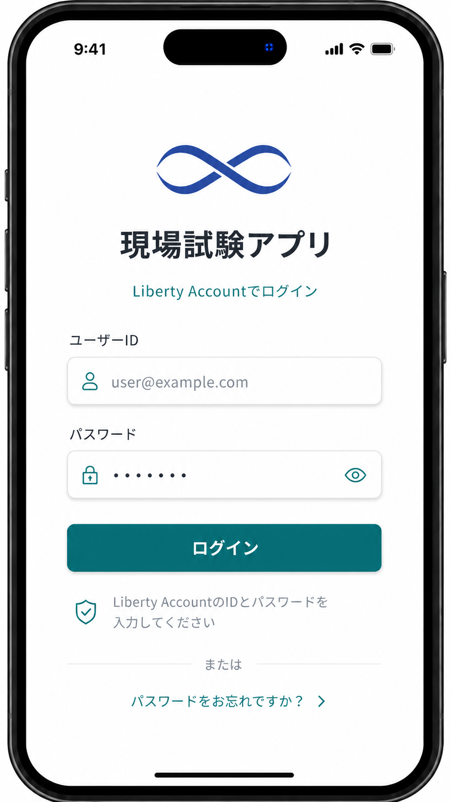

### 13.2 出荷予定一覧画面

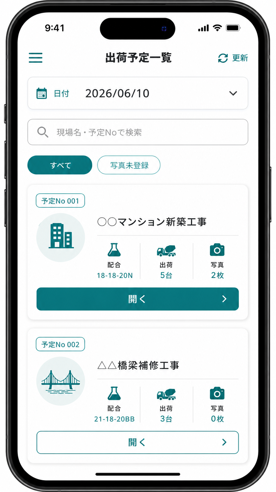

- ヘッダーに「出荷予定一覧」タイトルと更新ボタンを配置する。
- 日付ピッカーと検索バー（現場名・予定Noで検索）を上部に表示する。
- 「すべて」「写真未登録」の絞込タブを配置する。
- 各予定カードには、予定No、現場名、配合、出荷台数、写真枚数を表示する。
- カード下部に「開く」ボタンを配置し、出荷予定詳細へ遷移する。

### 13.3 出荷予定詳細 / 出荷実績一覧画面

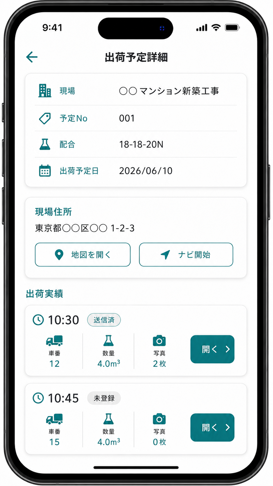

- 上部に予定詳細（現場名、予定No、配合、出荷予定日）をカード形式で表示する。
- 現場住所セクションに住所テキスト、「地図を開く」「ナビ開始」ボタンを配置する。
- 「出荷実績」セクションに各実績行を表示する。
- 実績行には、出荷時刻、同期状態バッジ（送信済 / 未登録）、車番、数量、写真枚数を表示する。
- 各行の「開く」ボタンから出荷実績詳細へ遷移する。

### 13.4 出荷実績詳細画面

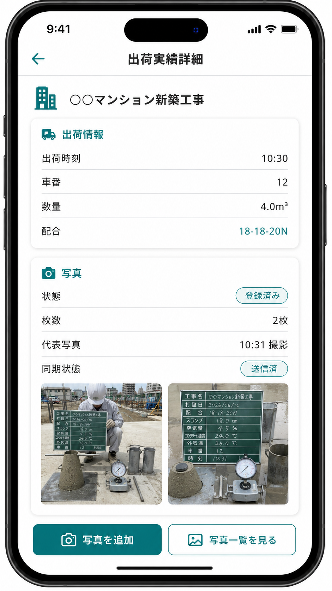

- 現場名をヘッダー下に大きく表示する。
- 「出荷情報」カードに出荷時刻、車番、数量、配合を表示する。
- 「写真」カードに状態（登録済み）、枚数、代表写真の撮影時刻、同期状態（送信済）を表示する。
- 写真サムネイルを横並びで表示する。
- 画面下部に「写真を追加」（プライマリボタン）と「写真一覧を見る」（セカンダリボタン）を配置する。

### 13.5 写真追加メニュー

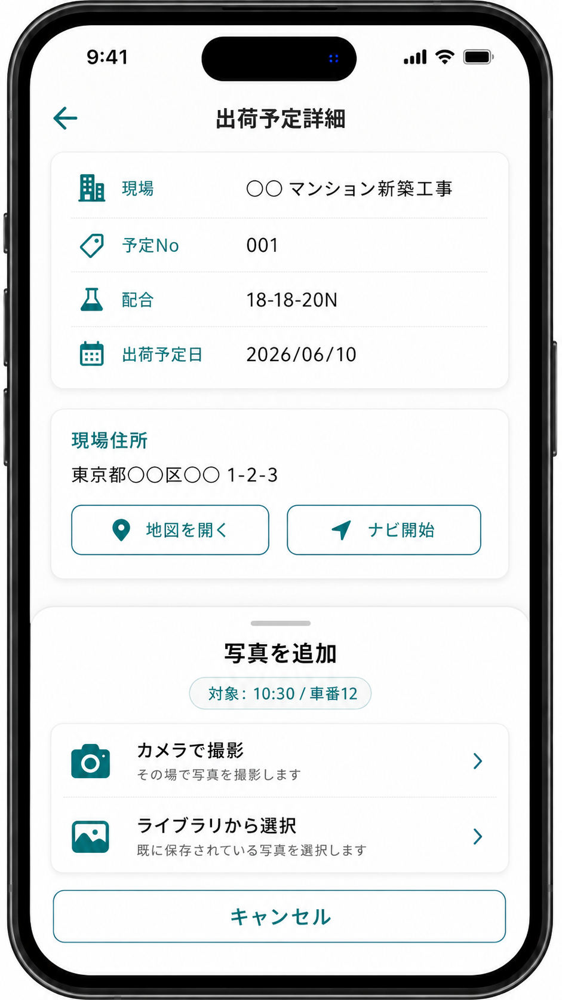

- ボトムシート形式で「写真を追加」メニューを表示する。
- 対象出荷（出荷時刻 / 車番）を上部に表示する。
- 「カメラで撮影」：その場で写真を撮影する。
- 「ライブラリから選択」：既に保存されている写真を選択する。
- 「キャンセル」ボタンでメニューを閉じる。

### 13.6 写真確認画面

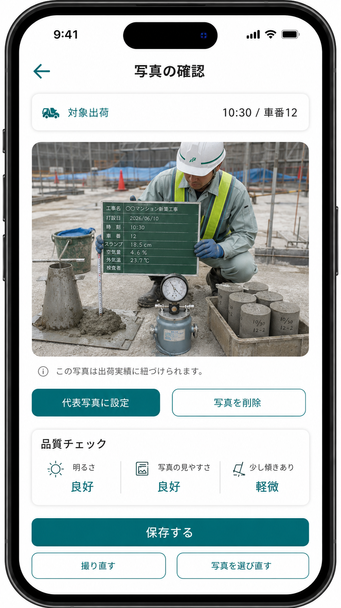

- 対象出荷（出荷時刻 / 車番）を上部に表示する。
- 写真プレビューを中央に大きく表示する。
- 「この写真は出荷実績に紐づけられます。」の説明を表示する。
- 「代表写真に設定」「写真を削除」ボタンを横並びで配置する。
- 品質チェック（明るさ、写真の見やすさ、傾き）の結果を表示する。
- 「保存する」（プライマリボタン）、「撮り直す」「写真を選び直す」（セカンダリボタン）を配置する。

### 13.7 写真一覧画面

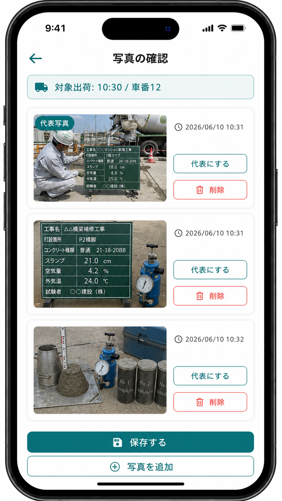

- 対象出荷（出荷時刻 / 車番）を上部に表示する。
- 写真カードを縦並びで表示し、各カードにサムネイル、撮影日時、「代表にする」「削除」ボタンを配置する。
- 代表写真には「代表写真」バッジを表示する。
- 画面下部に「保存する」（プライマリボタン）と「写真を追加」（セカンダリボタン）を配置する。

### 13.8 保存完了画面

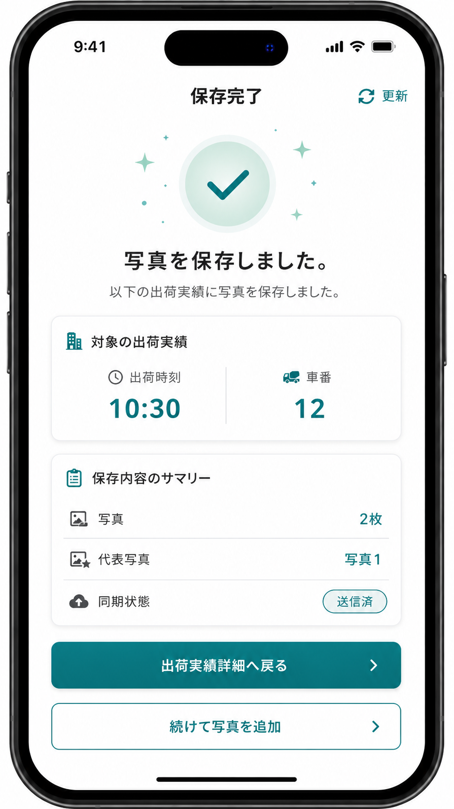

- 保存成功を示すチェックマークアイコンとメッセージを表示する。
- 対象の出荷実績（出荷時刻、車番）を表示する。
- 保存内容のサマリー（写真枚数、代表写真、同期状態）を表示する。
- 「出荷実績詳細へ戻る」（プライマリボタン）と「続けて写真を追加」（セカンダリボタン）を配置する。

---

## 14. 画面仕様 / Labonity 側

### 14.1 TP採取結果入力画面

```text
TP採取結果入力 (一部)

対象TP: TP-20260610-001
現場: ○○現場
配合: 18-18-20N

【出荷情報】
[連番] [出荷時刻] [車番] [数量] [写真状態] [アクション]
  0    10:30     12    4.0m3 写真あり  [出荷指定]
  1    10:45     15    4.0m3 写真なし  [出荷指定]
```

`[OCR取込]` ボタンを常設するのではなく、出荷指定後の写真有無に応じて `[写真から取込]` を表示する。

### 14.2 写真選択画面

```text
+--------------------------------------------------------------------------------+
| 写真選択                                                                        |
|--------------------------------------------------------------------------------|
| 出荷実績: 10:30 / 車番12                                                       |
| 現場    : ○○マンション新築工事                                                 |
| 反映先  : renban 0 / datakubun 0                                               |
|                                                                                |
| +----------------+ +----------------+ +----------------+                       |
| | [サムネイル]   | | [サムネイル]   | | [サムネイル]   |                       |
| | 代表           | |                | |                |                       |
| | 10:31          | | 10:32          | | 10:33          |                       |
| | 画質: OK       | | 画質: 注意     | | 画質: OK       |                       |
| | [選択中]       | | [選択]         | | [選択]         |                       |
| +----------------+ +----------------+ +----------------+                       |
|                                                                                |
| 選択中: 1枚                                                                    |
|                                                                                |
| [OCR実行] [プレビュー] [キャンセル]                                             |
+--------------------------------------------------------------------------------+
```

### 14.3 OCR結果確認画面

```text
左: 写真ビューア
右: 抽出結果

項目              現在値    OCR値      信頼度   反映値   状態
スランプ                    18.0       88%      18.0     要確認
空気量                      4.5        91%      4.5      OK
コンクリート温度            21.5       77%      21.5     要確認
外気温                      未読取     -        空欄     要入力
塩化物量                    0.03       90%      0.03     OK

[入力欄に反映] [保留] [再OCR] [別写真を選ぶ]
```

### 14.4 画面反映表示

反映後は、保存前であることを明示する。

```text
写真OCRの値を入力欄へ反映しました。保存すると Labonity DB へ反映されます。
```

---

## 15. セキュリティ・監査

### 15.1 Blob アクセス・ローカル写真キャッシュ

- 写真本体への直接公開 URL は発行しない。
- アップロード時は短時間 SAS または同等の一時アップロード URL を使用する。
- 現場 Web アプリなど認証済み Web UI の閲覧時は短時間閲覧 URL を発行できる。
- Labonity デスクトップアプリには短時間閲覧 URL を渡さない。
- Sync Agent は Sync Agent credential で写真ファイル取得 API を呼び出し、ローカルファイルキャッシュへ保存する。
- ローカル写真キャッシュの保存先は Windows ACL で保護する。
- ローカルキャッシュには、サムネイル、プレビュー、OCR用画像、必要に応じて原本を保存する。
- ローカルDBには写真本体を保存しない。
- 写真削除は DB の論理削除、Blob 削除ポリシー、ローカルキャッシュ削除を分離する。
- OCR や監査に使った写真は、保持期間内は参照可能にする。画面上の削除は論理削除扱いにする。
- ローカルキャッシュ削除後も、クラウド正本が保持期間内であれば Sync Agent により再取得できる。

### 15.2 監査ログ

以下の操作を AuditLog に記録する。

| 操作 | 主な記録項目 |
|---|---|
| ログイン成功 / 失敗 | accountId, orgId, result, reason, ip, userAgent。 |
| 組織選択 | accountId, orgId。 |
| 認可拒否 | accountId, orgId, permission, resource, reason。 |
| 写真アップロード | accountId, orgId, plantId, shipmentId, photoAssetId。 |
| 写真削除 | accountId, orgId, photoAssetId, reason。 |
| OCR 実行 | accountId, orgId, shipmentId, photoAssetIds, model, schemaVersion。 |
| OCR 反映 | accountId, orgId, jobId, renban, datakubun, appliedFields。 |
| Sync import | agentId, orgId, plantId, sourceTable, count, result。 |
| PhotoReferenceEvent ACK | agentId, orgId, plantId, eventId, sequence, result。 |
| 写真ファイルキャッシュ取得 | agentId, orgId, plantId, photoAssetId, variant, result, fileHash。 |
| OCR 代理実行 | agentId, orgId, plantId, jobId, syukkaId, photoAssetIds, localOperatorContext。 |

### 15.3 OCR データ保持

| データ | 推奨保持 |
|---|---|
| 原本写真 | 業務要件に応じて保持。削除は論理削除を先行。 |
| サムネイル | 原本と同じ保持期間。 |
| OCR raw JSON | 監査が必要な期間のみ。長期保持しすぎない。 |
| OCR 抽出値 | 監査要件に応じて保持。 |
| 画面コンテキスト | 反映先の説明に必要な範囲で保持する。 |

---

## 16. オフライン・エラー処理

### 16.1 現場アプリ

| 状態 | 処理 |
|---|---|
| 通信断で写真アップロード不可 | IndexedDB 等に未送信写真とメタデータを保持し、通信復旧後に再送する。 |
| upload-session 発行失敗 | エラー表示し、再試行可能にする。 |
| Blob PUT 成功 / commit 失敗 | 未 commit 状態として保持し、再 commit する。 |
| 写真重複 | `file_hash` と `clientRequestId` で重複登録を抑制する。 |
| 出荷実績が端末にない | 予定から仮写真を追加できる。ただし Labonity 側候補表示は解決後とする。 |
| 仮写真が解決不能 | 管理ログに表示し、手動確認対象にする。 |
| トークン期限切れ | 再認証を促す。未送信写真は保持する。 |

### 16.2 Sync Agent

| 状態 | 処理 |
|---|---|
| クラウド API 失敗 | リトライし、失敗回数・最終エラーを SyncLog に記録する。 |
| ローカルDB接続失敗 | サービスを停止せず、次周期で再試行する。 |
| 同期途中停止 | checkpoint から再開する。 |
| 重複送信 | idempotency_key により重複登録しない。 |
| 写真メタデータ ACK 失敗 | ACK が完了するまで再取得対象にする。 |
| 写真ファイル取得失敗 | `local_cache_status = failed` とし、次周期または手動更新で再試行する。 |
| 写真ファイルハッシュ不一致 | ローカルファイルを破棄し、再取得する。繰り返す場合は管理ログへ出す。 |
| ローカルディスク容量不足 | キャッシュ取得を停止し、管理ログに出す。削除対象期間の古いキャッシュをクリーンアップする。 |
| out-of-order イベント | `event_sequence` により順序制御し、古いイベントで新しい状態を上書きしない。 |
| Local Bridge 停止 | Labonity 側では写真表示のみ継続し、OCR・写真情報更新は利用不可として表示する。 |
| 認可エラー | credential の orgId / plantId / 権限を確認し、同期を停止して管理ログに出す。 |

### 16.3 Labonity OCR

| 状態 | 処理 |
|---|---|
| 写真なし | 写真選択画面を表示しない。通常業務を継続する。 |
| 写真メタデータあり・ローカルキャッシュ未取得 | [写真情報を更新] で Sync Agent Local Bridge に優先取得を依頼する。 |
| Sync Agent 未起動 | 「Sync Agent が起動していません」と表示し、手入力継続を可能にする。 |
| ローカルキャッシュ取得失敗 | エラー内容を表示し、再取得・手入力継続を選択できる。 |
| OCR失敗 | エラー内容を表示し、別写真選択・再OCR・手入力継続を選択できる。 |
| 低信頼度 | 要確認として表示する。 |
| 現在値と差分あり | 自動上書きせず、差分確認画面を表示する。 |
| 複数候補あり | 候補選択または手入力にする。 |
| 保存前に画面を閉じる | DBへは反映されない。必要に応じて破棄確認を出す。 |
| 保存失敗 | 通常保存エラーを表示し、OCR反映監査は `save_failed` にする。 |

---

## 17. 受入条件

| No | 受入条件 |
|---|---|
| A-01 | 現場試験 Web アプリは Liberty Account でログインできる。 |
| A-02 | ログイン後、利用可能な組織だけを選択できる。 |
| A-03 | `LABONITY_FIELD_TEST` の Grant がない組織では利用できない。 |
| A-04 | 全 API で URL の orgId、トークン所属 org、DB の tenant_id が一致することを検証する。 |
| A-05 | Sync Agent は専用 credential で同期 API を利用できる。 |
| A-06 | Sync Agent の credential では現場アプリ API を利用できない。 |
| A-07 | Labonity デスクトップアプリは Liberty Account 認証なしで写真選択画面を使用できる。 |
| A-08 | Labonity デスクトップアプリはクラウド API を直接呼び出さない。 |
| A-09 | 現場アプリで、出荷予定一覧を表示できる。 |
| A-10 | 現場アプリで、出荷予定に紐づく出荷実績一覧を表示できる。 |
| A-11 | 現場アプリで、出荷実績詳細に現場住所を表示できる。 |
| A-12 | 出荷実績詳細から Google Maps を開ける。 |
| A-13 | 緯度経度または住所がない場合、地図ボタンは非活性または住所未設定として表示される。 |
| A-14 | 現場アプリで、出荷実績に対して写真を保存できる。 |
| A-15 | 現場アプリの写真追加フローに、写真種別選択 UI が存在しない。 |
| A-16 | PhotoAssetTarget に `target_type = shipment` / `target_id = shipment_id` が保存される。 |
| A-17 | `SyukkaDataMain.syukka_id` は `target_source_local_id` として保持され、クラウドの `shipment_id` と混同されない。 |
| A-18 | PhotoAssetTarget に `photo_category` を必須項目として持たない。 |
| A-19 | 1 つの出荷実績に複数枚の写真を紐づけられる。 |
| A-20 | 代表写真は自動設定され、同一出荷に代表写真が複数できない。 |
| A-21 | Sync Agent により、現場関連データをローカルDBからクラウドへ単方向同期できる。 |
| A-22 | Sync Agent により、出荷予定関連データをローカルDBからクラウドへ単方向同期できる。 |
| A-23 | Sync Agent により、出荷実績関連データをローカルDBからクラウドへ単方向同期できる。 |
| A-24 | 現場アプリから、現場・出荷予定・出荷実績の参照データを編集できない。 |
| A-25 | 写真 commit 後、PhotoAsset / PhotoAssetTarget の参照メタデータがローカル参照用テーブルへ同期される。 |
| A-26 | Sync Agent は写真ファイルをローカル写真ファイルキャッシュへ保存できる。 |
| A-27 | ローカル側は `tenant_id + plant_id + target_type + target_local_id` により、出荷実績に写真があるかを判定できる。 |
| A-28 | 写真本体はローカルDBに保存されない。ローカルDBにはメタデータとローカルファイルパスのみが保存される。 |
| A-29 | Labonity 側で出荷実績を指定した際、その出荷に紐づく写真がローカルキャッシュから候補表示される。 |
| A-30 | Labonity 側の写真選択画面に、写真種別列・写真種別フィルタが存在しない。 |
| A-31 | ローカルキャッシュ未取得時、写真情報あり / 取得中 / 取得失敗の状態を表示できる。 |
| A-32 | [写真情報を更新] により、Sync Agent に対象出荷の写真メタデータ・ファイル取得を依頼できる。 |
| A-33 | ユーザーは 1 枚または複数枚の写真を選択して OCR 実行できる。 |
| A-34 | OCR実行は Labonity デスクトップアプリからクラウドへ直接行わず、Sync Agent Local Bridge 経由で行われる。 |
| A-35 | AI OCR / LLM は Labonity 項目に対応したキー・バリュー JSON を返す。 |
| A-36 | 低信頼度項目、現在値との差分、候補複数項目は確認必須になる。 |
| A-37 | ユーザー確定後、値は TP採取結果入力画面のフレッシュ試験入力欄へ流し込まれる。 |
| A-38 | データベースへの直接保存は行わず、TP採取結果入力画面の通常保存処理で反映される。 |
| A-39 | OCR ジョブ作成は出荷、写真、スキーマ、画面コンテキスト、ローカル操作者情報で実行できる。 |
| A-40 | 新規未保存 TP でも、出荷指定後に写真選択 OCR ができる。 |
| A-41 | 縦割り TP で renban 0/1/2 の各行に対し、対応する `plant_id + syukka_id` の写真だけを候補表示できる。 |
| A-42 | OCR反映先は renban と datakubun の両方で特定される。 |
| A-43 | datakubun=1 の画面でOCRした場合、datakubun=1 の入力欄へ反映される。 |
| A-44 | 予定No が同じでも工場が異なる場合、予定・出荷・写真が混線しない。 |
| A-45 | `tenant_id`、`plant_id`、`source_local_id`、`target_source_local_id` は GUID として統一され、`uuid / string` の曖昧な扱いがない。 |
| A-46 | 出荷実績がクラウド未同期の場合、仮写真として登録でき、出荷実績同期後に解決される。 |
| A-47 | 仮写真は候補が明確な 1 件の場合だけ自動解決され、複数候補や低スコアの場合は `ambiguous` になる。 |
| A-48 | 写真削除・代表写真変更・表示順変更が FieldPhotoReference とローカル写真キャッシュに反映される。 |
| A-49 | PhotoReferenceEvent は ACK、再送、順序制御によりローカル参照へ冪等に反映される。 |
| A-50 | Blob PUT 成功後に commit 失敗した場合でも、再 commit により重複なく復旧できる。 |
| A-51 | OCRで反映した値について、OCR値・現在値・最終反映値・ローカル操作者情報を監査できる。 |
| A-52 | Sync Agent 停止時、写真表示は既存ローカルキャッシュで可能な範囲に限定され、OCRと写真情報更新は利用不可として表示される。 |
| A-53 | ローカル写真キャッシュは削除・破損しても、クラウド正本が保持されていれば Sync Agent により再作成できる。 |

## 18. 実装メモ

### 18.1 必須実装

- Liberty Account ログインを現場試験 Web アプリに組み込む。
- ログイン後に `/accounts/me?includePermissions=true` 相当の情報を取得し、組織と権限を解決する。
- `LABONITY_FIELD_TEST` の Grant 判定を API 側で行う。
- API は orgId を URL に含め、トークン所属 org と DB tenant_id を照合する。
- Sync Agent を .NET Worker Service / Windows Service として実装する。
- Sync Agent credential を orgId + plantId + agentId 単位で管理する。
- Labonity デスクトップアプリには Liberty Account 認証を実装しない。
- Labonity デスクトップアプリからクラウド API を直接呼び出さない。
- Sync Agent Local Bridge を実装し、写真情報更新、OCR実行、OCR反映記録を受け付ける。
- 現場関連、出荷予定関連、出荷実績関連の import API を実装する。
- Sync Agent はローカルDBからクラウドへ基幹参照データを単方向 Upsert する。
- 写真本体の正本は Blob Storage に保存する。
- PhotoAsset / PhotoAssetTarget を保存する。
- 写真メタデータは PhotoReferenceEvent としてクラウド側に記録する。
- Sync Agent は PhotoReferenceEvent を pull し、FieldPhotoReference へ反映する。
- Sync Agent は写真ファイルをローカル写真ファイルキャッシュへ保存する。
- FieldPhotoReference にはローカルファイルパスとキャッシュ状態を保存する。
- 出荷実績未同期時の仮写真登録と解決処理を実装する。
- 仮写真の自動解決はスコアリングと候補 1 件条件を満たす場合だけ行う。
- 出荷実績詳細画面に [写真を追加] を配置する。
- 出荷実績詳細画面に [地図を開く] [ナビ開始] を配置する。
- Google Maps 起動 URL は緯度経度を優先し、なければ住所文字列で生成する。
- Labonity 側の TP採取結果入力で、出荷指定時に `tenant_id + plant_id + syukka_id` により写真有無を確認する。
- 写真があり、ローカルキャッシュが利用可能な場合、写真選択画面を表示する。
- OCR 対象写真を複数枚選択できるようにする。
- OCR 実行は Sync Agent Local Bridge 経由で行う。
- OCR レスポンスを `renban + datakubun` の画面入力欄へ反映する。
- `ApplyOcrFreshValues` 相当の画面反映 I/F を用意し、DB保存を行わず画面だけを未保存状態に更新する。
- PhotoReferenceEvent の ACK、再送、順序制御、手動再同期を実装する。
- 写真アップロードの状態遷移と冪等 commit を実装する。
- 受入条件を Given / When / Then 形式のテストシナリオへ落とし込む。

### 18.2 対象外

- 現場アプリでのフレッシュ試験値入力。
- 現場アプリでの電子黒板合成。
- 現場アプリでの黒板レイアウト編集。
- 現場アプリでの写真分類入力。
- 現場アプリからの出荷予定・出荷実績・現場マスター編集。
- 写真本体のローカルDB保存。
- クラウドからローカルDBへの直接接続。
- Labonity デスクトップアプリからクラウド API への直接接続。
- Labonity デスクトップアプリでの Liberty Account 認証。
- アプリ内地図埋め込み。
- 距離・所要時間計算。
- OCR API による Labonity DB への直接保存。
- 仮写真の曖昧候補を Labonity TP採取結果入力画面に表示すること。
- Sync Agent 以外の常駐プロセスによる写真ファイル取得。

### 18.3 最終ルール

```text
写真は出荷実績に紐づける。
写真の正本はクラウド Blob Storage に保存する。
クラウドでは shipment_id を写真関連の主キーとして扱う。
Labonity 側では plant_id + syukka_id を写真検索キーとして扱う。
Labonity デスクトップアプリは Liberty Account 認証を行わず、クラウド API を直接呼び出さない。
Sync Agent だけがクラウドへ認証し、写真メタデータ・写真ファイル・OCR代理実行を扱う。
Labonity 側の写真表示はローカル写真ファイルキャッシュを使用する。
OCR結果は TP採取結果入力画面上の renban + datakubun の入力欄へ反映する。
DB 保存は TP採取結果入力画面の通常保存で行う。
```


---

## 19. 写真アップロード状態遷移・冪等性

### 19.1 状態遷移

写真アップロードは、Blob PUT とメタデータ commit が分かれるため、途中失敗から復旧できる状態を明示する。

```text
created
  -> upload_url_issued
  -> blob_uploaded
  -> commit_pending
  -> committed
  -> reference_event_published
  -> local_reference_synced
  -> local_file_cached
```

| 状態 | 意味 | 復旧方針 |
|---|---|---|
| `created` | クライアントで写真追加が開始された。 | 未送信として IndexedDB に保持する。 |
| `upload_url_issued` | アップロードURL発行済み。 | 期限切れ時は再発行する。 |
| `blob_uploaded` | Blob PUT 成功。 | commit 未完了なら再 commit する。 |
| `commit_pending` | commit リクエスト送信待ちまたは送信中。 | `clientRequestId` で冪等再送する。 |
| `committed` | PhotoAsset / PhotoAssetTarget 保存済み。 | PhotoReferenceEvent 発行を確認する。 |
| `reference_event_published` | 写真参照イベント発行済み。 | Sync Agent の pull 対象になる。 |
| `local_reference_synced` | FieldPhotoReference 反映済み。 | 写真ファイル取得へ進む。 |
| `local_file_cached` | ローカル写真キャッシュ保存済み。 | Labonity 側で表示・OCR可能。 |

### 19.2 冪等キー

| 対象 | 冪等キー |
|---|---|
| upload-session 発行 | `tenant_id + plant_id + clientRequestId`。 |
| Blob PUT | `photo_asset_id + content_hash`。 |
| commit | `tenant_id + plant_id + photo_asset_id + clientRequestId`。 |
| PhotoAssetTarget | `tenant_id + plant_id + photo_asset_id + target_type + target_id`。 |
| PhotoReferenceEvent | `event_id` と `event_sequence`。 |
| ローカルキャッシュ | `tenant_id + plant_id + photo_asset_id + content_version + variant`。 |

同一写真を同一出荷へ重複登録しない。同一写真を別出荷へ紐づける運用を許可する場合は、`PhotoAsset` は共有し、`PhotoAssetTarget` を別行として作成する。ただし初期リリースでは同一写真の複数出荷紐づけは行わない。

### 19.3 Blob PUT 成功 / commit 失敗

Blob PUT 成功後に commit が失敗した場合、現場アプリは `photoAssetId`、`clientRequestId`、`blobPath`、`fileHash`、対象出荷情報を IndexedDB に保持する。通信復旧後、同じ `photoAssetId` と `clientRequestId` で commit を再実行する。

クラウド側は同一 `photoAssetId` の commit を冪等に扱い、既に commit 済みの場合は現在状態を返す。

---

## 20. リリース確認用テストシナリオ

受入条件を次の代表シナリオで確認する。

### 20.1 通常取り

| 区分 | 内容 |
|---|---|
| Given | 予定1件、出荷1件、写真2枚、ローカルキャッシュ ready。 |
| When | TP採取結果入力で対象出荷を指定し、写真1枚を選択して OCR 実行する。 |
| Then | OCR結果が確認画面に表示され、確定後に `renban=0 + datakubun=0` の入力欄へ反映され、通常保存で DB へ保存される。 |

### 20.2 縦割り

| 区分 | 内容 |
|---|---|
| Given | 予定1件、出荷3件、`renban 0/1/2`、各出荷に写真1枚。 |
| When | `renban=1` の出荷を指定して写真から取込を行う。 |
| Then | `renban=1` に対応する `syukka_id` の写真だけが表示され、OCR結果も `renban=1` の欄にだけ反映される。 |

### 20.3 datakubun

| 区分 | 内容 |
|---|---|
| Given | データNo.1 とデータNo.2 を切替可能な TP 入力画面。 |
| When | データNo.2 表示中に OCR 取込を行う。 |
| Then | `datakubun=1` の入力欄にだけ反映され、`datakubun=0` の値は変更されない。 |

### 20.4 工場混線防止

| 区分 | 内容 |
|---|---|
| Given | 同一予定No、別工場、別出荷、別写真のデータ。 |
| When | 工場Aの出荷を指定して写真一覧を開く。 |
| Then | `tenant_id + plant_id + syukka_id` が一致する写真だけが表示され、工場Bの写真は表示されない。 |

### 20.5 ローカルキャッシュ遅延

| 区分 | 内容 |
|---|---|
| Given | クラウドには写真があり、FieldPhotoReference は同期済みだが `local_cache_status = pending`。 |
| When | TP採取結果入力で対象出荷を指定する。 |
| Then | 写真取得中として表示され、[写真情報を更新] により Sync Agent が写真ファイルを取得し、ready 後に写真選択できる。 |

### 20.6 Sync Agent 停止

| 区分 | 内容 |
|---|---|
| Given | Sync Agent が停止している。既存ローカルキャッシュは一部存在する。 |
| When | 写真選択画面を開く。 |
| Then | 既存キャッシュ済み写真は表示できる。新規取得と OCR 実行は利用不可として表示され、手入力継続できる。 |

### 20.7 仮写真自動解決

| 区分 | 内容 |
|---|---|
| Given | 出荷実績未同期で撮影した仮写真があり、後から同一予定・同一車番・時刻近傍の出荷実績が 1 件同期される。 |
| When | Sync Agent が仮写真解決を実行する。 |
| Then | `resolved` となり、PhotoAssetTarget が作成され、PhotoReferenceEvent とローカルキャッシュに反映される。 |

### 20.8 仮写真曖昧候補

| 区分 | 内容 |
|---|---|
| Given | 同一予定・同一車番・時刻近傍の出荷実績候補が複数ある。 |
| When | Sync Agent が仮写真解決を実行する。 |
| Then | `ambiguous` となり、Labonity TP採取結果入力の OCR 候補には表示されない。 |

### 20.9 OCR差分確認

| 区分 | 内容 |
|---|---|
| Given | 既存画面値にスランプ 18.0 があり、OCR値が 18.5。 |
| When | OCR結果確認画面を表示する。 |
| Then | 差分確認必須となり、ユーザーが確認した場合だけ画面値を上書きできる。 |

### 20.10 アップロード途中失敗

| 区分 | 内容 |
|---|---|
| Given | Blob PUT は成功し、commit 前に通信断が発生する。 |
| When | 通信復旧後に現場アプリが再送する。 |
| Then | 同じ `photoAssetId + clientRequestId` で commit され、重複写真が作成されない。 |

---
