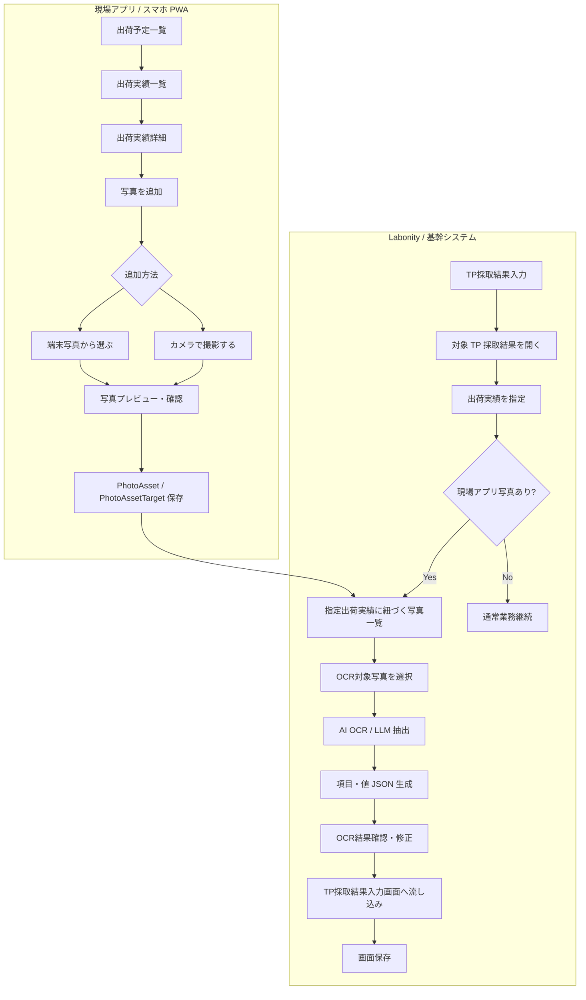
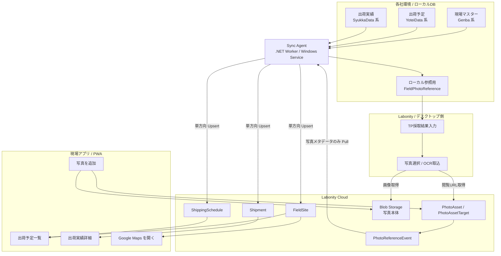
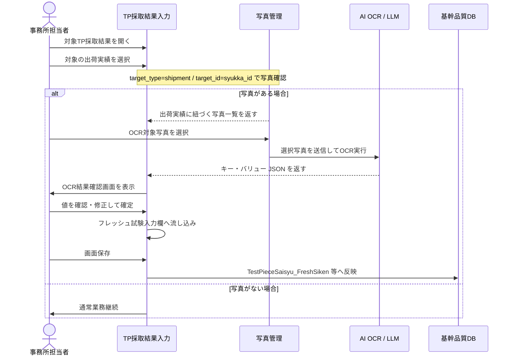

# Labonity 用現場試験アプリ 設計書 v1.0

**出荷実績写真保存・Sync Agent・Google Maps 連携・TP採取結果入力からの写真選択OCR取込方式**

| 項目 | 内容 |
|---|---|
| 文書区分 | 基本設計 |
| 対象 | 現場試験アプリ / Labonity TP採取結果入力 / Sync Agent |
| 版 | v1.0 |
| 作成日 | 2026-06-10 |
| 目的 | 現場アプリで出荷実績に紐づく写真を保存し、Labonity 側で対象出荷の写真を選択して AI OCR / LLM によりフレッシュ試験値を取り込めるようにする。 |
| 前提 | 現場アプリではフレッシュ試験値の入力、電子黒板合成、黒板レイアウト編集、TP採取結果の正式登録は行わない。現場アプリは、出荷予定・出荷実績・現場関連データを参照し、写真を追加・保存・同期するためのアプリとする。 |

---

## 1. 基本方針

### 1.1 現場アプリの役割

現場アプリの役割は、**その日の出荷予定・出荷実績を確認し、対象出荷に写真を追加すること**である。

現場アプリで行うことは次の範囲に限定する。

- 出荷予定一覧の確認
- 出荷実績一覧の確認
- 出荷実績詳細の確認
- 現場住所から Google Maps を開く
- 出荷実績に紐づく写真の追加
- 端末カメラによる撮影
- 端末内写真の選択
- 写真のプレビュー確認
- 写真の保存・同期
- 写真一覧・写真詳細の確認

現場アプリで行わないことは次の通りである。

- フレッシュ試験値の入力
- TP採取結果入力の代替
- TP採取データの正式作成
- 供試体セット・ピースの作成
- 電子黒板合成写真の作成
- 黒板レイアウトの編集
- 出荷予定・出荷実績・現場マスターの編集
- 写真台帳・帳票出力

### 1.2 写真の扱い

写真は、**出荷実績に紐づく写真**として扱う。

現場では、黒板が写った写真だけでなく、現場状況、測定状況、補足写真などを追加する可能性がある。そのため、現場アプリの主操作名は **[写真を追加]** とする。

写真の分類は行わない。

- 画面上で「黒板」「その他」などを選ばせない。
- API で `photoCategory` を受け取らない。
- DB の必須項目として `photo_category` を持たせない。
- Labonity 側では、対象出荷に紐づく写真をすべて候補表示する。
- OCR 対象写真は、Labonity 側のユーザーがサムネイルを見て選択する。

### 1.3 代表写真の扱い

代表写真は、一覧・詳細画面で最初に表示するための補助情報である。OCR 対象を固定するための項目ではない。

- 1 枚目の写真を自動で代表にする。
- すでに代表写真がある場合、追加写真は代表にしない。
- ユーザーは写真詳細または複数写真確認画面から代表写真を変更できる。
- 同一出荷実績に対して代表写真は 1 件のみとする。
- 代表写真が削除された場合、残り写真のうち表示順が最も小さい写真を代表にする。

### 1.4 Labonity 側の役割

Labonity 側では、TP採取結果入力画面から対象 TP を開き、対象の出荷実績を指定する。

指定した出荷実績に現場アプリの写真がある場合、写真選択画面を起動する。ユーザーは写真一覧から黒板が写った写真を 1 枚または複数枚選択し、AI OCR / LLM による項目・値抽出を行う。

OCR 結果は、Labonity の取込項目に対応するキー・バリュー形式の JSON として取得し、確認画面を経由して TP採取結果入力画面の入力欄へ流し込む。DB への直接保存は行わず、TP採取結果入力画面の通常保存処理で反映する。

### 1.5 Sync Agent の役割

現場アプリが出荷予定・出荷実績・現場住所を表示するには、各社ローカルDBの基幹データをクラウド側へ同期する必要がある。

Sync Agent は、各社ローカルDBからクラウドへ、現場アプリに必要な参照データを同期するサービスである。

- 現場関連データは、ローカルDBからクラウドへ同期する。
- 出荷予定関連データは、ローカルDBからクラウドへ同期する。
- 出荷実績関連データは、ローカルDBからクラウドへ同期する。
- 現場アプリから基幹データへ書き戻しは行わない。
- 写真本体はクラウド Blob Storage に保存する。
- 写真メタデータは、Labonity / デスクトップ側が参照できるよう、ローカル参照用テーブルへ同期する。

---

## 2. 全体構成

### 2.1 全体業務フロー



### 2.2 Sync Agent を含む構成



---

## 3. データ同期設計

### 3.1 同期方向

| 領域 | 同期方向 | 用途 |
|---|---|---|
| 現場関連データ | ローカルDB → クラウド | 現場名、住所、地図、出荷詳細表示に使用する。 |
| 出荷予定関連データ | ローカルDB → クラウド | 現場アプリの出荷予定一覧に使用する。 |
| 出荷実績関連データ | ローカルDB → クラウド | 出荷実績一覧・詳細、写真紐づけ、Labonity OCR 起点に使用する。 |
| 写真本体 | 現場アプリ → Blob Storage | 現場で発生する写真本体を保存する。 |
| 写真メタデータ | クラウド → ローカル参照テーブル | デスクトップ / Labonity 側で写真有無を判定する。 |

### 3.2 Sync Agent の配置

| 項目 | 方針 |
|---|---|
| 実行形態 | .NET Worker Service / Windows Service。 |
| 配置場所 | 各社のローカルDBへ接続できる社内ネットワーク上。 |
| 通信方向 | Sync Agent からクラウドAPIへのアウトバウンド HTTPS。 |
| 認証 | Sync Agent 専用 client credential。テナント / 工場単位で発行する。 |
| 冪等性 | `source_system` / `source_table` / `source_local_id` / `source_hash` / `idempotency_key` で担保する。 |
| 非採用 | クラウドからローカルDBへの直接接続、インバウンドポート開放、写真本体のローカルDB保存。 |

### 3.3 現場関連データ

| クラウドテーブル | 元データ例 | 主な用途 |
|---|---|---|
| `FieldSite` | `Genba`, `Genba_Syukka` | 現場名、住所、地図、出荷表示。 |
| `FieldSiteContact` | `Genba_Renrakusaki` 等 | 連絡先表示が必要な場合。 |
| `FieldSiteConcreteSpec` | `Genba_Haigo` 等 | 配合・現場別表示補助が必要な場合。 |

最低限必要な項目は次の通り。

| 項目 | 説明 |
|---|---|
| `field_site_id` | クラウド側ID。 |
| `source_local_id` | ローカル `Genba.id` 等。 |
| `site_name1` / `site_name2` | 現場名。 |
| `site_short_name` | 略称。 |
| `address1` / `address2` | Google Maps 起動に使う住所。 |
| `latitude` / `longitude` | ローカルに保持されている場合のみ同期する。 |
| `phone_number` | 任意。 |
| `updated_source_at` | ローカル側最終更新日時。 |
| `source_hash` | 差分判定用ハッシュ。 |

### 3.4 出荷予定関連データ

| クラウドテーブル | 元データ例 | 主な用途 |
|---|---|---|
| `ShippingSchedule` | `YoteiDataMain` | 出荷予定一覧。 |
| `ShippingScheduleNote` | `YoteiData_Biko` | 必要に応じて備考表示。 |

最低限必要な項目は次の通り。

| 項目 | 説明 |
|---|---|
| `shipping_schedule_id` | クラウド側ID。 |
| `source_local_id` | ローカル `yotei_id`。 |
| `shipping_date` | 出荷予定日。 |
| `schedule_no` | 予定No。 |
| `field_site_id` | 現場ID。 |
| `mix_id` / `mix_name` | 配合。 |
| `scheduled_time` | 予定時刻。 |
| `planned_quantity` | 予定数量。 |
| `source_hash` | 差分判定用ハッシュ。 |

### 3.5 出荷実績関連データ

| クラウドテーブル | 元データ例 | 主な用途 |
|---|---|---|
| `Shipment` | `SyukkaDataMain` | 出荷実績一覧・詳細、写真紐づけ。 |
| `ShipmentTpTarget` | `SyukkaData_TpSaisyu` | TP 対象情報の参考表示。 |

最低限必要な項目は次の通り。

| 項目 | 説明 |
|---|---|
| `shipment_id` | クラウド側ID。写真紐づけの `target_id`。 |
| `source_local_id` | ローカル `syukka_id`。 |
| `shipping_schedule_id` | 出荷予定ID。 |
| `shipping_date` | 出荷日。 |
| `shipping_time` | 出荷時刻。 |
| `vehicle_no` | 車番。 |
| `quantity` | 出荷数量。 |
| `field_site_id` | 現場ID。 |
| `mix_id` / `mix_name` | 配合。 |
| `tp_target_flag` | TP 採取対象参考フラグ。 |
| `source_hash` | 差分判定用ハッシュ。 |

### 3.6 差分同期方式

| 項目 | 方針 |
|---|---|
| 差分検出 | `rowversion`、最終更新日時、または対象項目の `source_hash` を使用する。 |
| Upsert | `tenant_id + source_system + source_table + source_local_id` を自然キーにする。 |
| 削除 | 物理削除ではなく `deleted_at` / `is_deleted` を同期する。 |
| 再送 | 同一 `idempotency_key` は重複登録しない。 |
| チェックポイント | テーブルごと・テナントごとに `SyncCheckpoint` を保持する。 |
| フル同期 | 夜間または手動で再同期できるようにする。 |

### 3.7 同期周期

| データ | 推奨周期 |
|---|---|
| 当日・翌日の出荷予定 / 出荷実績 | 1〜5分。 |
| 現場マスター | 5〜30分、または変更検知時。 |
| 過去データ補正 | 夜間バッチまたは手動再同期。 |
| 写真メタデータイベント | 1〜5分、またはデスクトップ側確認前に手動取得。 |

---

## 4. 写真保存設計

### 4.1 基本方針

写真本体は Blob Storage に保存し、DB には写真メタデータと対象データとの関連のみ保存する。Base64 で DB に写真本体を保存しない。

写真は出荷実績単位で扱う。Labonity 側から確実に検索できるように、現場アプリで写真を保存する際は、必ず `target_type = shipment` / `target_id = syukka_id` の PhotoAssetTarget を作成する。

### 4.2 PhotoAsset

| 項目 | 型 | 説明 |
|---|---|---|
| `photo_asset_id` | uuid | 写真 ID。 |
| `tenant_id` | uuid | テナント ID。 |
| `blob_path` | nvarchar | 原本写真の Blob パス。 |
| `thumbnail_path` | nvarchar | サムネイル Blob パス。 |
| `taken_at` | datetimeoffset | 撮影日時。端末写真の場合は取得可能な日時を使用する。 |
| `source_type` | nvarchar | `camera` / `library`。撮影か端末写真選択かを表す。 |
| `file_hash` | nvarchar | 重複検知・冪等保存用のハッシュ。 |
| `quality_warnings_json` | json | ぼけ、暗さ、傾きなどの警告。任意。 |
| `created_by` | nvarchar | 登録者。 |
| `created_at` | datetimeoffset | 登録日時。 |

### 4.3 PhotoAssetTarget

| 項目 | 型 | 説明 |
|---|---|---|
| `photo_asset_target_id` | uuid | 関連 ID。 |
| `photo_asset_id` | uuid | 写真 ID。 |
| `target_type` | nvarchar | 原則 `shipment`。 |
| `target_id` | uuid | 出荷実績 ID。`SyukkaDataMain.syukka_id` 相当。 |
| `display_order` | int | 同一出荷内の表示順。 |
| `is_primary` | bit | 代表写真フラグ。一覧・初期表示用。 |
| `created_at` | datetimeoffset | 作成日時。 |

### 4.4 写真分類の扱い

写真分類は設計対象外とする。

| 項目 | 扱い |
|---|---|
| `photo_category` | 使用しない。 |
| 黒板 / その他の分類 UI | 表示しない。 |
| 写真種別による絞込 | 行わない。 |
| 固定写真列 | `photo1_blob_path` / `photo2_blob_path` のような固定列は作らない。 |

### 4.5 推奨インデックス

```sql
CREATE INDEX IX_PhotoAssetTarget_Target
ON PhotoAssetTarget (
    target_type,
    target_id,
    is_primary DESC,
    display_order ASC,
    photo_asset_id ASC
);
```

---

## 5. 写真メタデータのローカル参照設計

### 5.1 採用方式

写真本体はクラウド Blob Storage に保存し、ローカルDBには写真の存在確認・一覧表示に必要なメタデータだけを保存する。

画像を表示するときは、クラウドAPIから短時間の閲覧URLを取得する。基幹テーブルには写真列を追加せず、独立した参照用テーブルを使用する。

### 5.2 ローカル参照用テーブル

テーブル名: `FieldPhotoReference`

| 項目 | 型 | 説明 |
|---|---|---|
| `photo_reference_id` | uniqueidentifier | ローカル参照行ID。 |
| `tenant_id` | uniqueidentifier | テナントID。 |
| `photo_asset_id` | uniqueidentifier / varchar | クラウド PhotoAsset ID。 |
| `photo_asset_target_id` | uniqueidentifier / varchar | クラウド PhotoAssetTarget ID。 |
| `target_type` | nvarchar | 原則 `shipment`。 |
| `target_local_id` | uniqueidentifier / varchar | ローカル `syukka_id`。 |
| `target_cloud_id` | uniqueidentifier / varchar | クラウド `shipment_id`。 |
| `taken_at` | datetimeoffset | 撮影日時。 |
| `source_type` | nvarchar | `camera` / `library`。 |
| `thumbnail_blob_path` | nvarchar | サムネイル Blob パス。 |
| `original_blob_path` | nvarchar | 原本 Blob パス。直接アクセスには使わず、API経由でURL発行する。 |
| `is_primary` | bit | 代表写真。 |
| `display_order` | int | 表示順。 |
| `file_hash` | nvarchar | 重複確認用。 |
| `quality_warnings_json` | nvarchar(max) | 画質警告。 |
| `deleted_at` | datetimeoffset null | 取消・削除扱い。 |
| `synced_at` | datetimeoffset | ローカル反映日時。 |

### 5.3 写真有無判定

```sql
SELECT TOP (1) 1
FROM FieldPhotoReference
WHERE target_type = 'shipment'
  AND target_local_id = @syukka_id
  AND deleted_at IS NULL;
```

### 5.4 写真一覧取得

```sql
SELECT *
FROM FieldPhotoReference
WHERE target_type = 'shipment'
  AND target_local_id = @syukka_id
  AND deleted_at IS NULL
ORDER BY
  is_primary DESC,
  display_order ASC,
  taken_at ASC,
  photo_asset_id ASC;
```

### 5.5 画像表示 URL 発行

```http
POST /api/core/v1/photos/{photoAssetId}/download-url
```

レスポンス例:

```json
{
  "photoAssetId": "PHOTO-001",
  "downloadUrl": "https://...",
  "expiresAt": "2026-06-10T10:45:00+09:00"
}
```

---

## 6. Google Maps 現場住所連携

### 6.1 基本方針

出荷実績詳細画面には、現場住所から Google Maps を開く導線を配置する。

アプリ内に地図を埋め込まず、Google Maps の外部起動を使用する。これにより、地図表示コンポーネントや API キー管理を最小化しつつ、現場担当者が地図確認・ナビ開始を行える。

### 6.2 同期する現場位置情報

`FieldSite` には、Google Maps 起動に必要な項目を保持する。

| 項目 | 説明 |
|---|---|
| `site_name1` / `site_name2` | 現場名。 |
| `site_short_name` | 一覧表示用。 |
| `address1` / `address2` | 住所。 |
| `latitude` / `longitude` | 緯度経度。ローカルDBに存在する場合のみ同期。 |
| `map_query_text` | 住所と現場名から生成した検索文字列。任意。 |
| `map_source` | `latlng` / `address` / `manual` など。 |

### 6.3 表示ルール

| 状態 | UI |
|---|---|
| 緯度経度あり | [地図を開く] [ナビ開始] を表示。緯度経度を優先して起動する。 |
| 緯度経度なし・住所あり | 住所文字列で Google Maps を開く。 |
| 住所なし | ボタンを非活性にし、「住所未設定」と表示する。 |
| オフライン | 外部起動を試行し、失敗時は住所コピーを可能にする。 |

### 6.4 Google Maps URL 生成

#### 地図を開く

緯度経度がある場合:

```text
https://www.google.com/maps/search/?api=1&query={latitude},{longitude}
```

住所だけの場合:

```text
https://www.google.com/maps/search/?api=1&query={urlEncodedAddress}
```

#### ナビ開始

緯度経度がある場合:

```text
https://www.google.com/maps/dir/?api=1&destination={latitude},{longitude}&travelmode=driving&dir_action=navigate
```

住所だけの場合:

```text
https://www.google.com/maps/dir/?api=1&destination={urlEncodedAddress}&travelmode=driving&dir_action=navigate
```

### 6.5 注意事項

- 住所や緯度経度は現場アプリで編集しない。
- 住所が間違っている場合は、基幹側の現場マスターを修正し、Sync Agent により再同期する。
- 地図で開いた位置が現場入口とずれる場合に備え、将来的に現場入口メモや手動ピン座標を保持できる余地を残す。
- アプリ内での経路計算、到着予定時刻計算、地図履歴保存は行わない。

---

## 7. TP採取結果入力からの写真選択フロー

### 7.1 画面起点

基幹システムの **TP採取結果入力** 画面における出荷実績指定を起点とする。

ユーザーが対象の出荷実績を指定したタイミングで、対象の `syukka_id` および縦割り時の反映先 `renban` が特定される。

- 通常取りの場合: 指定された行の `syukka_id` が特定される。
- 縦割りの場合: 指定された行の `syukka_id` と反映先 `TestPieceSaisyu_FreshSiken.renban` が同時に確定する。

### 7.2 写真の有無確認

出荷実績が指定された後、Labonity 側は `PhotoAsset` / `PhotoAssetTarget` またはローカル `FieldPhotoReference` の存在有無を確認する。

- 写真がある場合: 写真選択画面を起動する。
- 写真がない場合: 写真選択画面は起動せず、通常の出荷実績指定のみとして完了する。

### 7.3 写真検索 SQL

```sql
SELECT
    p.*,
    t.*
FROM PhotoAsset p
JOIN PhotoAssetTarget t
  ON p.photo_asset_id = t.photo_asset_id
WHERE t.target_type = 'shipment'
  AND t.target_id = @syukka_id
ORDER BY
    t.is_primary DESC,
    t.display_order ASC,
    p.taken_at ASC,
    p.photo_asset_id ASC;
```

ローカル参照テーブルを使用する場合:

```sql
SELECT *
FROM FieldPhotoReference
WHERE target_type = 'shipment'
  AND target_local_id = @syukka_id
  AND deleted_at IS NULL
ORDER BY
  is_primary DESC,
  display_order ASC,
  taken_at ASC,
  photo_asset_id ASC;
```

### 7.4 写真一覧 UI 表示項目

| 表示項目 | 内容 |
|---|---|
| サムネイル | 写真を選びやすくする。 |
| 撮影日時 | `taken_at`。 |
| 登録元 | `camera` / `library`。 |
| 代表表示 | `is_primary = true` の写真に代表バッジを表示する。 |
| 紐づく出荷実績 | `syukka_id`, 車番, 出荷時刻。 |
| 画質警告 | ぼけ、暗さ、傾きなど。 |

### 7.5 OCR対象写真選択

- 選択は 1 枚を基本とする。
- 黒板全体写真と拡大写真が分かれている場合は、複数枚選択を許可する。
- 複数枚の場合、AI OCR / LLM は全写真をまとめて解析し、1 つの統合 JSON を返す。
- 写真分類には依存せず、サムネイルを見て OCR 対象写真を選択する。

---

## 8. AI OCR / LLM 取込設計

### 8.1 取込フロー



### 8.2 OCR レスポンス形式

OCR の source には、対象出荷 ID と OCR 対象写真 ID 配列を保持する。

```json
{
  "schemaVersion": "labonity.blackboardFreshTest.v1",
  "source": {
    "tpSamplingId": "TP-LOCAL-ID",
    "shipmentId": "SYUKKA-ID",
    "targetRenban": 0,
    "photoAssetIds": ["PHOTO-001", "PHOTO-002"],
    "model": "vision-llm",
    "processedAt": "2026-06-10T10:30:00+09:00"
  },
  "fields": [
    {
      "key": "slump",
      "labelText": "スランプ",
      "rawText": "18.0",
      "value": 18.0,
      "valueType": "number",
      "unit": "cm",
      "confidence": 0.88,
      "needsReview": true,
      "warnings": ["18.0 と 13.0 の判別がやや不確実"]
    },
    {
      "key": "air",
      "labelText": "空気量",
      "rawText": "4.5",
      "value": 4.5,
      "valueType": "number",
      "unit": "%",
      "confidence": 0.91,
      "needsReview": false,
      "warnings": []
    }
  ],
  "warnings": [
    "黒板右下が一部ぼけています。低信頼度の項目は確認してください。"
  ]
}
```

### 8.3 OCR 対象項目

| canonical key | 日本語名 | 型 | 単位 | 反映先候補 | 読取ルール |
|---|---|---|---|---|---|
| `slump` | スランプ | number | cm | `TestPieceSaisyu_FreshSiken.slump` | スランプ値。 |
| `flow1` | フロー1 | number | mm | `TestPieceSaisyu_FreshSiken.flow1` | 高流動の場合に抽出。 |
| `flow2` | フロー2 | number | mm | `TestPieceSaisyu_FreshSiken.flow2` | 高流動の場合に抽出。 |
| `air` | 空気量 | number | % | `TestPieceSaisyu_FreshSiken.air` | 空気量。 |
| `concrete_temperature` | コンクリート温度 | number | ℃ | `TestPieceSaisyu_FreshSiken.concrete_ondo` | 生コン温度。 |
| `outside_temperature` | 外気温 | number | ℃ | `TestPieceSaisyu_FreshSiken.gaikion` | 外気温。 |
| `chloride1` | 塩化物量1 | number | kg/m³ | `TestPieceSaisyu_FreshSiken.enkabuturyo1` | 代表値 1 つを抽出。 |
| `remarks` | 備考 | string | なし | `TestPieceSaisyu_FreshSiken.biko` | 10 文字超は切り詰め警告。 |

### 8.4 システム制御項目

| 項目名 | DBカラム名 | 区分 | 理由 |
|---|---|---|---|
| TP採取結果入力ID | `testpiecesaisyu_main_id` | システム制御 | 画面コンテキストから取得する。 |
| 連番 | `renban` | システム制御 | 出荷実績選択行から確定する。 |
| データ区分 | `datakubun` | システム制御 | 固定値または画面側制御値とする。 |

### 8.5 OcrImportJob

| 項目 | 型 | 説明 |
|---|---|---|
| `ocr_import_job_id` | uuid | OCR取込ジョブID。 |
| `tenant_id` | uuid | テナントID。 |
| `tp_sampling_id` | uuid / local id | 対象 TP 採取結果。 |
| `shipment_id` | uuid | 指定した出荷実績。 |
| `target_renban` | tinyint | 反映先 renban。 |
| `photo_asset_ids_json` | json | OCR対象写真ID配列。 |
| `ocr_engine` | nvarchar | OCR / LLM エンジン識別子。 |
| `ocr_model` | nvarchar | モデル識別子。 |
| `schema_version` | nvarchar | `labonity.blackboardFreshTest.v1`。 |
| `prompt_version` | nvarchar | プロンプトバージョン。 |
| `status` | nvarchar | `queued` / `processing` / `needs_review` / `applied` / `failed` / `rejected`。 |
| `raw_ocr_json` | json | OCR生結果。 |
| `extracted_values_json` | json | キー・バリュー抽出結果。 |
| `confidence_json` | json | 項目別信頼度。 |
| `warnings_json` | json | 警告・不確実性。 |
| `reviewed_by` | nvarchar | 確認者。 |
| `reviewed_at` | datetime | 確認日時。 |
| `applied_by` | nvarchar | 反映者。 |
| `applied_at` | datetime | 反映日時。 |
| `created_at` | datetime | 作成日時。 |

---

## 9. API 設計

### 9.1 Sync Agent API

#### ローカルDB → クラウド

```http
POST /api/sync/v1/orgs/{orgId}/field-sites/import
POST /api/sync/v1/orgs/{orgId}/shipping-schedules/import
POST /api/sync/v1/orgs/{orgId}/shipments/import
POST /api/sync/v1/orgs/{orgId}/shipment-tp-targets/import
```

共通リクエスト例:

```json
{
  "sourceSystem": "ExDat",
  "sourceTable": "SyukkaDataMain",
  "items": [
    {
      "sourceLocalId": "SYUKKA-LOCAL-GUID",
      "sourceHash": "sha256:...",
      "deleted": false,
      "values": {
        "shippingDate": "2026-06-10",
        "shippingTime": "10:30",
        "vehicleNo": "12",
        "quantity": 4.0,
        "fieldSiteSourceLocalId": "GENBA-LOCAL-GUID"
      }
    }
  ]
}
```

#### 写真メタデータ参照イベント取得

```http
GET /api/sync/v1/orgs/{orgId}/photo-reference-events?since={checkpoint}
POST /api/sync/v1/orgs/{orgId}/photo-reference-events/{eventId}/ack
```

### 9.2 現場アプリ API

#### 出荷予定一覧

```http
GET /api/core/v1/shipping-schedules?date=2026-06-10
```

#### 出荷実績一覧

```http
GET /api/core/v1/shipments?shippingScheduleId={shippingScheduleId}
```

#### 出荷実績詳細

```http
GET /api/core/v1/shipments/{shipmentId}
```

#### 写真アップロードセッション発行

```http
POST /api/core/v1/photos/upload-sessions
```

リクエスト例:

```json
{
  "shipmentId": "SYUKKA-001",
  "fileCount": 2,
  "clientRequestId": "device-001:20260610:001"
}
```

#### 写真 commit

```http
POST /api/core/v1/photos/{photoAssetId}/commit
```

リクエスト例:

```json
{
  "target": {
    "targetType": "shipment",
    "targetId": "SYUKKA-001",
    "displayOrder": 1,
    "isPrimary": true
  },
  "takenAt": "2026-06-10T10:31:00+09:00",
  "sourceType": "camera",
  "qualityWarnings": []
}
```

#### 出荷実績に紐づく写真取得

```http
GET /api/core/v1/shipments/{shipmentId}/photos
```

レスポンス例:

```json
{
  "shipmentId": "SYUKKA-001",
  "photos": [
    {
      "photoAssetId": "PHOTO-001",
      "thumbnailUrl": "...",
      "imageUrl": "...",
      "takenAt": "2026-06-10T10:31:00+09:00",
      "isPrimary": true,
      "displayOrder": 1,
      "sourceType": "camera",
      "qualityWarnings": []
    }
  ]
}
```

### 9.3 Labonity OCR API

#### OCRジョブ作成

```http
POST /api/core/v1/ocr/blackboard-import-jobs
```

リクエスト例:

```json
{
  "tpSamplingId": "TP-001",
  "shipmentId": "SYUKKA-001",
  "targetRenban": 0,
  "photoAssetIds": ["PHOTO-001", "PHOTO-002"],
  "schemaVersion": "labonity.blackboardFreshTest.v1"
}
```

#### OCR結果取得

```http
GET /api/core/v1/ocr/blackboard-import-jobs/{jobId}
```

#### OCR結果反映

```http
POST /api/core/v1/ocr/blackboard-import-jobs/{jobId}/apply
```

OCR結果反映 API は、`OcrImportJob` のステータス更新と監査ログ記録を行う。確定値は、呼び出し元の TP採取結果入力画面の入力欄へ流し込む。

---

## 10. 画面仕様 / 現場アプリ

### 10.1 出荷予定一覧画面

```text
+----------------------------------+
| 出荷予定一覧              更新   |
|----------------------------------|
| 日付: [2026/06/10 ▼]             |
| 検索: [現場名・予定No           ] |
|                                  |
| 絞込: [すべて▼] [写真未登録]     |
|                                  |
| +------------------------------+ |
| | 予定No 001                   | |
| | 08:30  ○○マンション新築工事  | |
| | 配合 18-18-20N               | |
| | 出荷 5台 / 写真 2枚          | |
| |                      [開く]  | |
| +------------------------------+ |
|                                  |
| +------------------------------+ |
| | 予定No 002                   | |
| | 10:00  △△橋梁補修工事       | |
| | 配合 21-18-20BB              | |
| | 出荷 3台 / 写真 0枚          | |
| |                      [開く]  | |
| +------------------------------+ |
|                                  |
+----------------------------------+
```

### 10.2 出荷実績一覧画面

```text
+----------------------------------+
| < 出荷予定詳細                   |
|----------------------------------|
| 現場: ○○マンション新築工事       |
| 予定No: 001                      |
| 配合: 18-18-20N                  |
| 出荷予定日: 2026/06/10           |
|                                  |
| 出荷実績                         |
| +------------------------------+ |
| | 10:30  車番 12               | |
| | 数量 4.0m3                   | |
| | 写真: 2枚  送信済            | |
| |                      [開く]  | |
| +------------------------------+ |
|                                  |
| +------------------------------+ |
| | 10:45  車番 15               | |
| | 数量 4.0m3                   | |
| | 写真: 0枚  未登録            | |
| |                      [開く]  | |
| +------------------------------+ |
|                                  |
+----------------------------------+
```

### 10.3 出荷実績詳細画面

```text
+----------------------------------+
| < 出荷実績詳細                   |
|----------------------------------|
| 現場                             |
| ○○マンション新築工事             |
|                                  |
| 出荷情報                         |
| +------------------------------+ |
| | 出荷時刻  10:30              | |
| | 車番      12                 | |
| | 数量      4.0m3              | |
| | 配合      18-18-20N          | |
| +------------------------------+ |
|                                  |
| 現場住所                         |
| +------------------------------+ |
| | 東京都○○区○○ 1-2-3          | |
| | [地図を開く] [ナビ開始]       | |
| +------------------------------+ |
|                                  |
| 写真                             |
| +------------------------------+ |
| | 状態      登録済み            | |
| | 枚数      2枚                 | |
| | 代表写真  10:31 撮影          | |
| | 同期状態  送信済              | |
| +------------------------------+ |
|                                  |
| +------------------------------+ |
| | [サムネイル] [サムネイル]     | |
| | 10:31        10:32            | |
| +------------------------------+ |
|                                  |
| [ 写真を追加 ]                   |
| [ 写真一覧を見る ]               |
|                                  |
+----------------------------------+
```

### 10.4 写真追加メニュー

```text
+----------------------------------+
| 写真を追加                       |
|----------------------------------|
| 対象: 10:30 / 車番12             |
|                                  |
| [ カメラで撮影する ]             |
|  現場で必要な写真を撮影します    |
|                                  |
| [ 端末の写真から選ぶ ]           |
|  すでに撮影済みの写真を使います  |
|                                  |
| [ キャンセル ]                   |
+----------------------------------+
```

### 10.5 写真確認画面

```text
+----------------------------------+
| < 写真の確認                     |
|----------------------------------|
| 対象出荷                         |
| 10:30 / 車番12                   |
|                                  |
| +------------------------------+ |
| |                              | |
| |        写真プレビュー         | |
| |                              | |
| +------------------------------+ |
|                                  |
| この写真を出荷実績に紐づけて保存します |
|                                  |
| 代表写真                         |
| 自動: この写真を代表にします      |
|                                  |
| 画質チェック                     |
| [OK] 明るさ                      |
| [OK] 写真の見やすさ              |
| [!] 少し傾きあり                 |
|                                  |
| [ 保存する ]                     |
| [ 撮り直す ]                     |
| [ 写真を選び直す ]               |
|                                  |
+----------------------------------+
```

### 10.6 複数写真確認画面

```text
+----------------------------------+
| < 写真の確認                     |
|----------------------------------|
| 対象出荷: 10:30 / 車番12         |
|                                  |
| +------------------------------+ |
| | [写真1] 代表                  | |
| | 2026/06/10 10:31              | |
| | [代表にする] [削除]           | |
| +------------------------------+ |
|                                  |
| +------------------------------+ |
| | [写真2]                       | |
| | 2026/06/10 10:32              | |
| | [代表にする] [削除]           | |
| +------------------------------+ |
|                                  |
| [ 保存する ]                     |
| [ 写真を追加 ]                   |
|                                  |
+----------------------------------+
```

### 10.7 保存完了画面

```text
+----------------------------------+
| 保存完了                         |
|----------------------------------|
|                                  |
| 写真を保存しました。             |
|                                  |
| 対象                             |
| 10:30 / 車番12                   |
|                                  |
| +------------------------------+ |
| | 写真      2枚                 | |
| | 代表写真  写真1               | |
| | 同期状態  送信済              | |
| +------------------------------+ |
|                                  |
| [ 出荷実績詳細へ戻る ]           |
| [ 続けて写真を追加 ]             |
|                                  |
+----------------------------------+
```

---

## 11. 画面仕様 / Labonity 側

### 11.1 TP採取結果入力画面

```text
TP採取結果入力 (一部)

対象TP: TP-20260610-001
現場: ○○現場
配合: 18-18-20N

【出荷情報】
[連番] [出荷時刻] [車番] [数量] [写真状態] [アクション]
  0    10:30     12    4.0m3 写真あり  [出荷指定]
  1    10:45     15    4.0m3 写真なし  [出荷指定]
```

[OCR取込] ボタンは配置しない。[出荷指定] が行われた際に、現場アプリ写真の有無を自動確認する。

### 11.2 写真選択画面

```text
+--------------------------------------------------------------------------------+
| 写真選択                                                                        |
|--------------------------------------------------------------------------------|
| 出荷実績: 10:30 / 車番12                                                       |
| 現場    : ○○マンション新築工事                                                 |
|                                                                                |
| 並び順: [代表写真・撮影日時順▼]                                                 |
|                                                                                |
| +----------------+ +----------------+ +----------------+                       |
| | [サムネイル]   | | [サムネイル]   | | [サムネイル]   |                       |
| | 代表           | |                | |                |                       |
| | 10:31          | | 10:32          | | 10:33          |                       |
| | 画質: OK       | | 画質: 注意     | | 画質: OK       |                       |
| | [選択中]       | | [選択]         | | [選択]         |                       |
| +----------------+ +----------------+ +----------------+                       |
|                                                                                |
| 選択中: 1枚                                                                    |
|                                                                                |
| [OCR実行] [プレビュー] [キャンセル]                                             |
+--------------------------------------------------------------------------------+
```

### 11.3 OCR結果確認画面

```text
左: 写真ビューア
右: 抽出結果

項目              OCR値      信頼度   反映値   状態
スランプ          18.0       88%      18.0     要確認
空気量            4.5        91%      4.5      OK
コンクリート温度  21.5       77%      21.5     要確認
外気温            未読取     -        空欄     要入力
塩化物量          0.03       90%      0.03     OK

[入力欄に反映] [保留] [再OCR] [別写真を選ぶ]
```

---

## 12. 認証・権限・セキュリティ

### 12.1 テナント分離

- Liberty Account の組織 ID を `tenant_id` として扱う。
- 全 API で URL の orgId、認証トークンの所属 org、DB の tenant_id の一致を確認する。
- Sync Agent は専用 credential を使用し、他テナントのデータにアクセスできない。

### 12.2 権限

| 操作 | 現場担当者 | 品質管理担当 | 事務所担当 / 管理者 | Sync Agent |
|---|---:|---:|---:|---:|
| 出荷予定一覧表示 | 可 | 可 | 可 | 不可 |
| 出荷実績詳細表示 | 可 | 可 | 可 | 不可 |
| 写真追加 | 可 | 可 | 可 | 不可 |
| 写真削除 | 条件付き可 | 可 | 可 | 不可 |
| TP採取結果入力 | 不可 | 可 | 可 | 不可 |
| OCR実行 | 不可 | 可 | 可 | 不可 |
| 基幹データ同期 | 不可 | 不可 | 不可 | 可 |
| 写真メタデータ同期 | 不可 | 不可 | 不可 | 可 |

### 12.3 Blob アクセス

- 写真本体への直接公開 URL は発行しない。
- アップロード時は短時間 SAS を使用する。
- 閲覧時は短時間閲覧 URL を発行する。
- URL の有効期限は短く設定する。
- 写真削除は DB の論理削除と Blob 削除ポリシーを分離する。

---

## 13. オフライン・エラー処理

### 13.1 現場アプリ

| 状態 | 処理 |
|---|---|
| 通信断で写真アップロード不可 | IndexedDB 等に未送信写真とメタデータを保持し、通信復旧後に再送する。 |
| upload-session 発行失敗 | エラー表示し、再試行可能にする。 |
| Blob PUT 成功 / commit 失敗 | 未 commit 状態として保持し、再 commit する。 |
| 写真重複 | `file_hash` と `clientRequestId` で重複登録を抑制する。 |
| 出荷データが端末にない | 同期を促す。必要に応じて日付を変更して再検索する。 |

### 13.2 Sync Agent

| 状態 | 処理 |
|---|---|
| クラウド API 失敗 | リトライし、失敗回数・最終エラーを SyncLog に記録する。 |
| ローカルDB接続失敗 | サービスを停止せず、次周期で再試行する。 |
| 同期途中停止 | checkpoint から再開する。 |
| 重複送信 | idempotency_key により重複登録しない。 |
| 写真メタデータ ACK 失敗 | ACK が完了するまで再取得対象にする。 |

### 13.3 Labonity OCR

| 状態 | 処理 |
|---|---|
| 写真なし | 写真選択画面を表示しない。通常業務を継続する。 |
| OCR失敗 | エラー内容を表示し、別写真選択・再OCR・手入力継続を選択できる。 |
| 低信頼度 | 要確認として表示する。 |
| 既存値と差分あり | 自動上書きせず、差分確認画面を表示する。 |
| 複数候補あり | 候補選択または手入力にする。 |

---

## 14. 受入条件

| No | 受入条件 |
|---|---|
| A-01 | 現場アプリで、出荷予定一覧を表示できる。 |
| A-02 | 現場アプリで、出荷予定に紐づく出荷実績一覧を表示できる。 |
| A-03 | 現場アプリで、出荷実績詳細に現場住所を表示できる。 |
| A-04 | 出荷実績詳細から Google Maps を開ける。 |
| A-05 | 緯度経度または住所がない場合、地図ボタンは非活性または住所未設定として表示される。 |
| A-06 | 現場アプリで、出荷実績に対して写真を保存できる。 |
| A-07 | 現場アプリの写真追加フローに、写真種別選択 UI が存在しない。 |
| A-08 | PhotoAssetTarget に `target_type = shipment` / `target_id = syukka_id` が保存される。 |
| A-09 | PhotoAssetTarget に `photo_category` を必須項目として持たない。 |
| A-10 | 1 つの出荷実績に複数枚の写真を紐づけられる。 |
| A-11 | 代表写真は自動設定され、ユーザーが代表写真を選び忘れる状態にならない。 |
| A-12 | Sync Agent により、現場関連データをローカルDBからクラウドへ単方向同期できる。 |
| A-13 | Sync Agent により、出荷予定関連データをローカルDBからクラウドへ単方向同期できる。 |
| A-14 | Sync Agent により、出荷実績関連データをローカルDBからクラウドへ単方向同期できる。 |
| A-15 | 現場アプリから、現場・出荷予定・出荷実績の基幹データを編集できない。 |
| A-16 | 写真 commit 後、PhotoAsset / PhotoAssetTarget の参照メタデータがローカル参照用テーブルへ同期される。 |
| A-17 | ローカル側は FieldPhotoReference により、出荷実績に写真があるかを判定できる。 |
| A-18 | 写真本体はローカルDBに保存せず、表示時にクラウドAPIから短時間閲覧URLを取得できる。 |
| A-19 | Labonity 側で出荷実績を指定した際、その出荷に紐づく写真が候補表示される。 |
| A-20 | Labonity 側の写真選択画面に、写真種別列・写真種別フィルタが存在しない。 |
| A-21 | ユーザーは 1 枚または複数枚の写真を選択して OCR 実行できる。 |
| A-22 | AI OCR / LLM は Labonity 項目に対応したキー・バリュー JSON を返す。 |
| A-23 | 低信頼度項目、既存値との差分、候補複数項目は確認必須になる。 |
| A-24 | ユーザー確定後、値は TP採取結果入力画面のフレッシュ試験入力欄へ流し込まれる。 |
| A-25 | データベースへの直接保存は行わず、TP採取結果入力画面の通常保存処理で反映される。 |
| A-26 | 取込元写真、OCRモデル、抽出JSON、修正内容、反映者を監査ログに残す。 |

---

## 15. 実装メモ

### 15.1 必須実装

- Sync Agent を .NET Worker Service / Windows Service として実装する。
- 現場関連、出荷予定関連、出荷実績関連の import API を実装する。
- Sync Agent はローカルDBからクラウドへ基幹参照データを単方向 Upsert する。
- 写真本体は Blob Storage に保存する。
- PhotoAsset / PhotoAssetTarget を保存する。
- 写真メタデータは PhotoReferenceEvent としてクラウド側に記録する。
- Sync Agent は PhotoReferenceEvent を pull し、FieldPhotoReference へ反映する。
- 出荷実績詳細画面に [写真を追加] を配置する。
- 出荷実績詳細画面に [地図を開く] [ナビ開始] を配置する。
- Google Maps 起動 URL は緯度経度を優先し、なければ住所文字列で生成する。
- Labonity 側の TP採取結果入力で、出荷指定時に写真有無を確認する。
- 写真がある場合、写真選択画面を表示する。
- OCR 対象写真を複数枚選択できるようにする。

### 15.2 非対象

- 現場アプリでのフレッシュ試験値入力。
- 現場アプリでの電子黒板合成。
- 現場アプリでの黒板レイアウト編集。
- 現場アプリでの写真分類入力。
- 現場アプリからの出荷予定・出荷実績・現場マスター編集。
- 写真本体のローカルDB保存。
- クラウドからローカルDBへの直接接続。
- アプリ内地図埋め込み。
- 距離・所要時間計算。

### 15.3 将来拡張

写真分類が必要になった場合は、現場ユーザーに分類を必須入力させるのではなく、次の方式を検討する。

- AI による自動分類補助。
- Labonity 側での後分類。
- 複数タグ方式。
- テナントごとの分類利用設定。
- サムネイルキャッシュのローカル同期。
- 現場入口専用の手動ピン座標。
