# Labonity 用現場試験アプリ 設計書

**出荷実績別現場試験記録・フレッシュ試験一次記録・TP 取込連携・写真複数枚保存・黒板・同期 Agent**  
**v1.0**

| 項目 | 内容 |
|---|---|
| 文書区分 | 基本設計書 |
| 対象アプリ | Labonity 用現場試験アプリ |
| 版 | v1.0 |
| 作成日 | 2026-06-08 |
| 概要 | 出荷実績に紐づく `FieldTestSession` / `FieldFreshTestStaging` に現場一次記録を保存し、デスクトップ TP アプリ側で後から正式 TP へ取り込む方式を採用した基本設計書。現場記録とUML図面を一本化。 |
| 前提 | React + TypeScript PWA / ASP.NET Core Web API / Azure SQL / Blob Storage / Sync Agent / Ex7000 KokubanLayout / デスクトップ TP アプリ取込機能 |

---

## 1. 本書の位置づけ

本書は、Labonity現場試験アプリにおける基本設計を定義する。
本システムでは、TP（テストピース）チェック漏れや事務所側でのTPデータ未作成によって現場での試験・写真撮影作業が停止するリスクを排除するため、現場アプリの責務を **「出荷実績に紐づく現場一次記録（フレッシュ試験結果・黒板・写真）の保存」** とする。
正式な TP 採取データの作成、および現場一次記録の取り込み・帳票連携は、デスクトップ TP アプリ側の責務とする。

---

## 目次

- [1. 本書の位置づけ](#1-本書の位置づけ)
- [2. 設計方針](#2-設計方針)
  - [2.1 責務分担](#21-責務分担)
  - [2.2 現場・基幹連携業務フロー](#22-現場基幹連携業務フロー)
  - [2.3 ユースケース図](#23-ユースケース図)
- [3. 用語整理](#3-用語整理)
- [4. デスクトップ側で作成される TP データと本システムの扱い](#4-デスクトップ側で作成される-tp-データと本システムの扱い)
- [5. 現場アプリで登録・確認する範囲](#5-現場アプリで登録確認する範囲)
- [6. 画面フローと UI イメージ](#6-画面フローと-ui-イメージ)
  - [6.1 画面遷移図](#61-画面遷移図)
- [7. FieldTestSession 設計](#7-fieldtestsession-設計)
  - [7.1 状態遷移](#71-状態遷移)
- [8. FieldFreshTestStaging 設計](#8-fieldfreshteststaging-設計)
  - [8.1 更新ルール](#81-更新ルール)
- [9. デスクトップ TP アプリ取込設計](#9-デスクトップ-tp-アプリ取込設計)
  - [9.1 取込時の値反映ルール](#91-取込時の値反映ルール)
  - [9.2 デスクトップ取込シーケンス](#92-デスクトップ取込シーケンス)
  - [9.3 値競合・差分確認の例外処理方針](#93-値競合差分確認の例外処理方針)
- [10. フレッシュ試験入力設計](#10-フレッシュ試験入力設計)
  - [10.1 フレッシュ試験登録シーケンス](#101-フレッシュ試験登録シーケンス)
- [11. 縦割り設計](#11-縦割り設計)
- [12. 電子黒板機能設計](#12-電子黒板機能設計)
- [13. 写真・Blob 保存設計](#13-写真blob-保存設計)
  - [13.1 PhotoAssetTarget 設計](#131-photoassettarget-設計)
- [14. 同期 Agent 設計](#14-同期-agent-設計)
  - [14.1 アプリとデータの配置構成 (システム構成図)](#141-アプリとデータの配置構成-システム構成図)
  - [14.2 物理配置と利用環境](#142-物理配置と利用環境)
- [15. API 設計](#15-api-設計)
  - [15.1 FieldTestSession 作成リクエスト例](#151-fieldtestsession-作成リクエスト例)
- [16. データモデル](#16-データモデル)
  - [16.1 主要データモデル クラス図](#161-主要データモデル-クラス図)
  - [16.2 データ関連フロー](#162-データ関連フロー)
- [17. 認証・権限・テナント分離](#17-認証権限テナント分離)
- [18. テスト設計・受入条件](#18-テスト設計受入条件)
- [19. 実装ロードマップ](#19-実装ロードマップ)
- [20. 未決事項・確認事項](#20-未決事項確認事項)
- [付録 A. 主要ローカル DB 対応](#付録-a-主要ローカル-db-対応)
- [付録 B. 用語集](#付録-b-用語集)

---

## 2. 設計方針

- 現場試験アプリは、出荷予定・出荷実績を選び、`FieldTestSession` を作成または再開して現場試験記録を保存するウェブアプリケーションとする。
- フレッシュ試験の現場実測値は、 `FieldFreshTestStaging` に保存する。これは TP 正本ではなく、デスクトップ TP アプリが取り込むための一次記録である。
- TP 採取対象の業務判定、TP 採取データの正式作成、供試体セット・ピース初期構成、帳票連携は、原則としてデスクトップアプリ / 出荷管理 / Ex3010 / TP アプリ側の責務（基幹システム側）とする。
- Web 側は、出荷実績別の現場一次記録（フレッシュ試験値、黒板スナップショット、写真）を保存する。TPデータはクラウド上には一切同期されないため、現場アプリ（Web）側で供試体情報の確認・修正やTPデータの直接照合は行わない。
- `FreshTestResults` / `FreshTestGroup` は正本テーブルとして作成しない。`FieldFreshTestStaging` も正本ではなく、`import_status` によって正式 TP への取込状態を管理する。
- 黒板は Ex7000 由来 `KokubanLayout` 系を読み取り専用で利用し、撮影時点の `layout_snapshot_json` / `settings_snapshot_json` / `resolved_values_json` を保存する。
- 写真本体は Blob Storage に保存し、DB は `PhotoAsset` / `PhotoAssetTarget` / `PhotoBlackboardOverlay` / `AuditLog` などのメタデータに限定する。Base64 で DB保存しない。
- 1 つの `FieldFreshTestStaging` に対して複数の `PhotoAssetTarget` を紐づけられる。写真枚数の上限は DB 設計では固定せず、テナント設定または運用設定で制御する。
- デスクトップ TP アプリ取込時は `changedFields` / `clearedFields` を尊重し、未入力空白でローカル入力済み値を上書きしない。競合時は自動上書きせず確認対象にする。

### 業務フロー

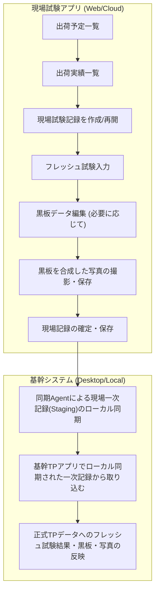

### 2.1 責務分担

| 領域 | 責務 | 主なデータ |
|---|---|---|
| 現場試験アプリ | 出荷実績別の現場一次記録を保存する。フレッシュ試験値、黒板、写真、メモ、確定・取込状態を管理する。TP 正本を直接作らない。 | `FieldTestSession` / `FieldFreshTestStaging` / `PhotoAsset` / `BlackboardInstance` |
| デスクトップ TP アプリ | 現場一次記録を確認し、既存 TP へ取込、または TP データを正式作成して取込する。競合解決と帳票連携を担当する。 | `TestPieceSaisyu_Main` / `FreshSiken` / `Set` / `Piece` / `SyukkaData` |
| Sync Agent | ローカル→クラウド同期、クラウド→ローカル取込候補の取得、ACK、冪等性、競合状態を管理する。 | `ExternalIdMapping` / `source_hash` / `OutboxEvent` / `SyncLog` |

### 2.2 現場・基幹連携業務フロー

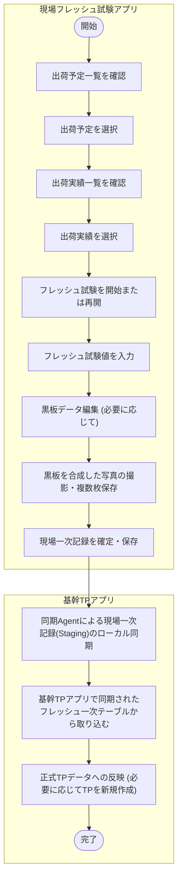

### 2.3 ユースケース図

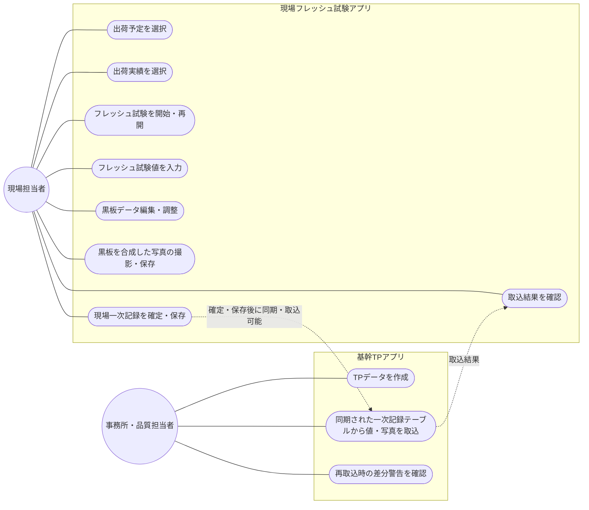

---

## 3. 用語整理

| 用語 | 定義 | 代表テーブル/項目 |
|---|---|---|
| 出荷予定 | いつ、どの現場へ、どの配合を、どれだけ出荷する予定かを表す上位データ。試験予定ではない。 | `YoteiDataMain` / `yotei_id` / `syukka_yoteibi` / `yotei_no` |
| 出荷実績 | 実際の 1 台ごとの出荷データ。車番、出荷時刻、数量、配合、予定 ID を持つ。 | `SyukkaDataMain` / `syukka_id` / `syaban` |
| TP 採取対象 | 出荷実績段階で実際に TP 採取対象として扱う情報。チェック漏れや未設定があり得るため、Web はこの有無だけに依存しない。 | `SyukkaData_TpSaisyu` |
| TP 採取データ | 正式な TP 採取結果データ。デスクトップ TP アプリ / Ex3010 側で作成・管理する正本。 | `TestPieceSaisyu_Main` / `TestPieceSampling` |
| 現場試験記録 | Web アプリで作成する出荷実績別の現場一次記録。TP 未作成でも作成できる。 | `FieldTestSession` |
| フレッシュ試験一次記録 | 現場で実測したフレッシュ試験値。正式 TP へ取り込む前のステージング。 | `FieldFreshTestStaging` |
| 取込 | `FieldFreshTestStaging` の値を、デスクトップ TP アプリが `TestPieceSaisyu_FreshSiken` 等へ反映する処理。 | `import_status` / `imported_tp_sampling_id` |
| 縦割り | 同一出荷予定内の複数出荷実績を 1 つの現場試験記録にまとめ、`renban` 別にフレッシュ試験値を保持する運用。 | `FieldTestSession` + `FieldFreshTestStaging.renban` |
| changedFields | ユーザーが変更した項目。取込・同期対象を限定する。 | `changed_fields_json` |
| clearedFields | ユーザーが明示的に削除した項目。未入力空白とは区別する。 | `cleared_fields_json` |
| PhotoAssetTarget | 写真と対象データの関連。1 つのフレッシュ試験記録に複数件作成できる。 | `target_type` / `target_id` / `photo_category` |

---

## 4. 現場アプリで登録・確認する範囲

| 分類 | 現場アプリで行うこと | 保存先/扱い |
|---|---|---|
| 現場試験記録作成 | 出荷実績を選択し、`FieldTestSession` を作成または既存セッションを再開する。 | `FieldTestSession` |
| フレッシュ試験値入力 | スランプ、フロー、空気量、コンクリート温度、外気温、塩化物量、単位水量、単位容積質量などを入力する。 | `FieldFreshTestStaging` |
| 黒板 | `KokubanLayout` を読み取り、`FieldFreshTestStaging` の値を差し込んでプレビュー・撮影用スナップショットを保存する。 | `BlackboardInstance` / `resolved_values_json` |
| 写真 | 黒板写真、測定状況、測定器、供試体などを複数枚撮影・保存する。 | `PhotoAsset` / `PhotoAssetTarget` |

### 現場アプリで原則やらないこと（基幹システム側の責務）

| 現場アプリで原則やらないこと | 理由 | 範囲 |
|---|---|---|
| TP 採取データの正式作成 | 供試体構成、材齢、本数、採番、試験区分などのロジックが複雑であり、デスクトップ側の責務とするため。 | 基幹システム |
| `TestPieceSaisyu_FreshSiken` への直接反映を主経路にすること | 同期・競合・写真紐づけが複雑化するため、取込方式に統一するため。 | 基幹システム |
| 試験区分、配合、現場、出荷実績紐づけの変更 | TP 採取データの根幹情報であり、後続試験・帳票・出荷管理との整合性が崩れるため。 | 基幹システム |
| TPデータ・供試体情報の確認・軽微修正 | TPデータおよび供試体構成は基幹品質DBのみに存在し、クラウドへは同期されないため。 | 基幹システム |
| 圧縮強度試験結果の入力 | 後日の試験室 / 品質管理 / デスクトップ側業務であるため。 | 基幹システム |
| 写真台帳・帳票出力 | デスクトップアプリ側の責務であるため。 | 基幹システム |

---

## 5. 画面フローと UI イメージ

現場試験アプリでは、出荷実績一覧の後に「現場試験記録」を作成または再開する。TP データの有無は現場側では意識せず、常に出荷実績情報に紐づく現場フレッシュ試験記録として入力・撮影を行う。

| ステップ | 画面/ブロック | 主な操作 | 範囲 |
|---:|---|---|---|
| 1 | 出荷予定一覧 | 日付・現場・予定 No で出荷予定を選択。 | 現場試験アプリ |
| 2 | 出荷実績一覧 | 対象出荷実績を選択。縦割りでは複数出荷実績を選択。 | 現場試験アプリ |
| 3 | 現場試験記録 作成/再開 | `FieldTestSession` を作成。既存未送信・未取込記録があれば再開。 | 現場試験アプリ |
| 4 | 送信・取込状況表示 | 下書き、送信済み、取込完了、競合等のステータスを表示する。 | 現場試験アプリ |
| 5 | フレッシュ試験入力 | `renban` 別に実測値を入力。`changedFields` / `clearedFields` 適用。 | 現場試験アプリ |
| 6 | 黒板データ編集 | `KokubanLayout` を読み取り、現場値を差し込んでプレビュー・調整・編集する。 | 現場試験アプリ |
| 7 | 黒板合成写真撮影・保存 | 黒板を合成した写真や測定状況写真などを複数枚撮影・保存。`PhotoAssetTarget` N 件。 | 現場試験アプリ |
| 8 | 現場記録の確定・保存 | `FieldTestSession` を `submitted` (確定・保存済み) にする。通信断時は端末内 (IndexedDB) に一時保存。 | 現場試験アプリ |
| 9 | デスクトップ取込 | 同期された一次記録テーブルから、正式 TP へ反映（既存TPへ取込、または新規TP作成して取込）。 | 基幹システム |

### 送信・取込状況ステータス

| 状態 | 意味 | 範囲 |
|---|---|---|
| `draft` | 一時保存中（端末内またはクラウド上で編集中） | 現場試験アプリ |
| `submitted` | 確定・保存済み（現場入力完了、デスクトップ取込待ち） | 現場試験アプリ |
| `imported` | 基幹側で取込完了（正式 TP へ取込済み） | 基幹システム |
| `conflict` | 取込時に同一項目の競合あり | 基幹システム |
| `rejected` | 取込対象外として処理済み | 基幹システム |
| `voided` | 取消済み | 現場・基幹共通 |

### 5.1 画面遷移図

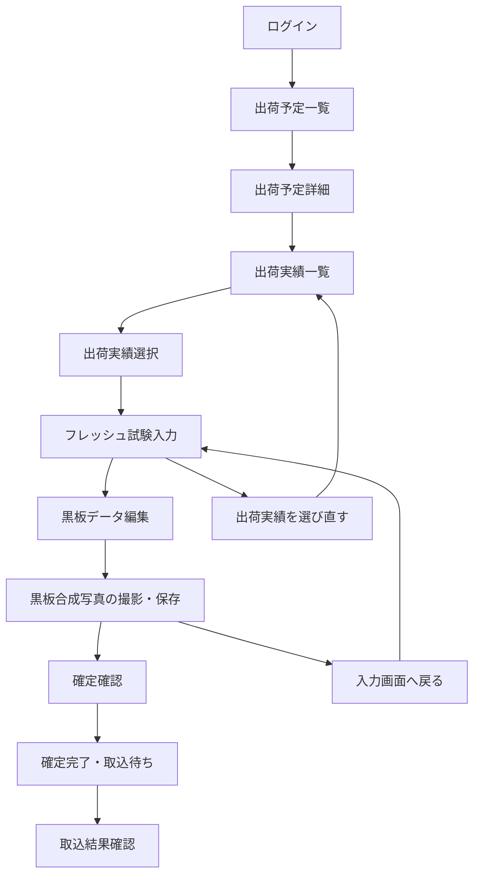

---

## 6. FieldTestSession 設計

`FieldTestSession` は、Web アプリが作成する現場一次記録の親データである。通常は 1 出荷実績に 1 セッション、縦割りでは同一 `yotei_id` 配下の複数出荷実績を 1 セッションに束ねる。

| 項目 | 型/例 | 説明 |
|---|---|---|
| `field_test_session_id` | uuid | 現場試験記録 ID。Web 側の主キー。 |
| `tenant_id` | uuid | テナント分離。 |
| `yotei_id` | uuid | 出荷予定 ID。 |
| `primary_shipment_id` | uuid | 通常取りの対象出荷実績、または縦割りの代表出荷実績。 |
| `is_tatewari` | bit | 縦割りかどうか。 |
| `field_group_no` | int / nullable | 縦割りや再測定グループの表示用番号。 |
| `genba_id` / `haigo_id` / `plant_id` | uuid | 出荷実績から同期された参照値。Web で根幹変更しない。 |
| `test_datetime` | datetimeoffset | 現場で試験した日時。 |
| `status` | draft / submitted / imported / conflict / rejected / voided / superseded | 現場記録の状態。 |
| `linked_tp_sampling_id` | uuid / nullable | 取込先 TP 採取データ ID (基幹側ローカルの参照用キー。クラウド上でテーブル間リレーションは持たない) |
| `imported_at` / `imported_by` | datetime / user | 正式 TP へ取込済みの場合の記録。 |
| `source_hash` | varchar | 冪等 Upsert・二重登録防止用。 |
| `created_by` / `created_at` / `updated_at` | user / datetime | 監査用。 |

### 6.1 状態遷移

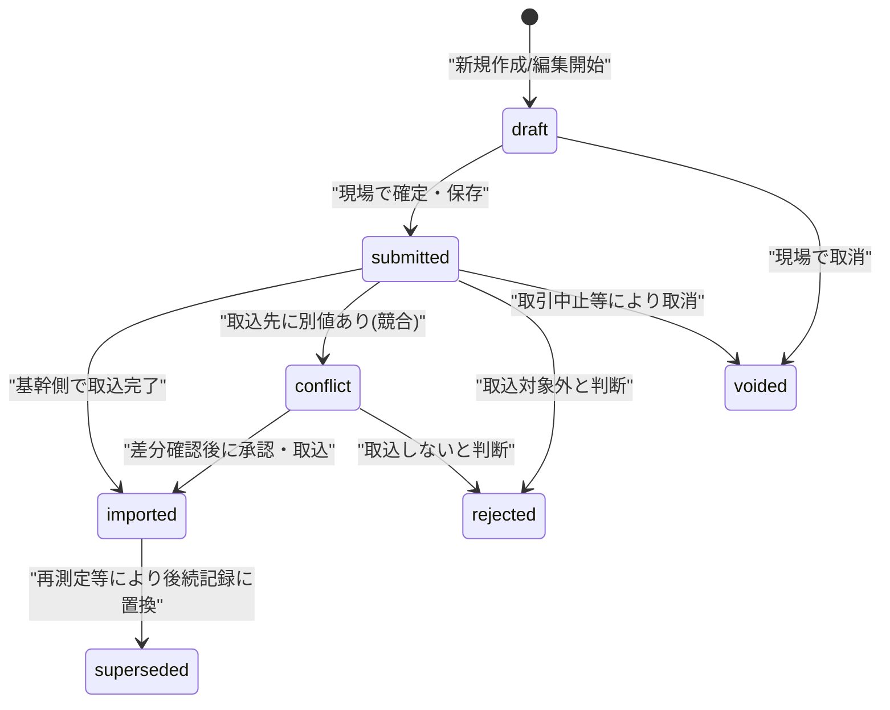

| 状態 | 意味 |
|---|---|
| `draft` | 端末内またはクラウド上で編集中。 |
| `submitted` | 現場入力完了、デスクトップ取込待ち。 |
| `imported` | 正式 TP へ取込済み。 |
| `conflict` | 取込時に同一項目の競合あり。 |
| `rejected` | 取込対象外と判断。 |
| `voided` | 誤登録などにより取消。 |
| `superseded` | 再測定などで後続記録に置き換え。 |

---

## 7. FieldFreshTestStaging 設計

`FieldFreshTestStaging` は、`FieldTestSession` 配下のフレッシュ試験一次記録である。通常取りでは `renban=0` を 1 件、縦割りでは `renban=0..2` を出荷別に作成する。

| 項目 | 型/例 | 説明 |
|---|---|---|
| `field_fresh_test_id` | uuid | フレッシュ試験一次記録 ID。 |
| `field_test_session_id` | uuid | 親の `FieldTestSession`。 |
| `shipment_id` | uuid | 対象出荷実績。縦割りでは `renban` ごとに別出荷実績。 |
| `renban` | tinyint | 通常 0。縦割りでは 0,1,2。 |
| `syaban` | nvarchar | 車番。出荷実績から初期値、必要に応じて現場入力値。 |
| `test_time` | time / nullable | 試験時間。 |
| `slump` / `flow1` / `flow2` | decimal / nullable | スランプ、フロー。 |
| `air` | decimal / nullable | 空気量。 |
| `concrete_temperature` | decimal / nullable | コンクリート温度。 |
| `outside_temperature` | decimal / nullable | 外気温。 |
| `chloride` | decimal / nullable | 塩化物量。 |
| `unit_water` / `unit_volume_mass` | decimal / nullable | 単位水量、単位容積質量。 |
| `remarks` | nvarchar | 現場メモ。 |
| `changed_fields_json` | json | ユーザーが変更した項目のみ。 |
| `cleared_fields_json` | json | ユーザーが明示削除した項目のみ。 |
| `import_status` | not_imported / imported / conflict / rejected | 取込状態。 |
| `imported_tp_sampling_id` | uuid / nullable | 取込先 TP 採取データ。 |
| `imported_local_main_id` | uniqueidentifier / nullable | ローカル `TestPieceSaisyu_Main.id` 等。 |

> **重要: 正本ではない**  
> `FieldFreshTestStaging` は、取込前の現場一次記録であり、TP 採取結果の正本ではない。正式な品質管理・帳票・後続試験の正本は、デスクトップ TP アプリで取込後に作成または更新される `TestPieceSaisyu_*` / `TestPieceSampling` 系とする。

### 7.1 更新ルール

| ルール | 内容 |
|---|---|
| `changedFields` | ユーザーが変更した項目だけを取込候補にする。 |
| `clearedFields` | ユーザーが明示削除した項目。正式 TP 側も削除候補とするが、取込時に確認可能にする。 |
| 未入力空白 | ローカルまたは既存 TP に値がある場合、空白で上書きしない。 |
| 0 | 有効な数値として扱う。未入力とは区別する。 |
| 再測定 | 既存記録を直接上書きせず、必要に応じて `superseded` または `voided` で履歴を残す。 |
| 二重送信 | `source_hash` / `idempotency_key` で冪等に処理する。 |

---

## 8. デスクトップ TP アプリ取込設計

デスクトップ TP アプリには、クラウドに送信された `FieldTestSession` / `FieldFreshTestStaging` を確認し、正式な TP 採取データへ反映する「現場記録取込」機能を追加する。

### 現場フレッシュ試験記録 取込画面例

```text
未取込:
- 2026/06/05 10:30 ○○現場 1号車 スランプ 18.0 空気量 4.5 写真 3枚
- 2026/06/05 11:00 ○○現場 2号車 スランプ 18.5 空気量 4.4 写真 2枚

操作:
[既存 TP へ取込] [TP データを作成して取込] [差分確認] [対象外にする]
```

| ケース | 取込動作 | 注意点 |
|---|---|---|
| 既存 TP あり | `shipment_id` / `yotei_id` / `syukka_id` から既存 `TestPieceSaisyu_Main` / `FreshSiken` を特定し、`changedFields` だけ反映する。 | 既存値と異なる場合は競合確認。 |
| TP なし | デスクトップ側の既存ロジックで TP データを作成してから、`FieldFreshTestStaging` を `FreshSiken` へ反映する。 | Web 側では TP 作成ロジックを持たない。 |
| 複数 TP 候補あり | 利用者が試験区分、採取日、出荷実績リンク、状態を見て取込先を選択する。 | 自動判定しすぎない。 |
| 値競合あり | 同一項目がデスクトップ側で既に入力済みかつ Web 値と異なる場合、`conflict` にする。 | 後勝ち自動上書き禁止。 |
| 取込対象外 | `rejected` として理由を残す。 | 監査・問い合わせ対応のため削除しない。 |
| 写真あり | `FieldFreshTestStaging` の写真を TP 側ターゲットにも紐づける、または参照リンクを追加する。 | 写真本体は Blob のまま。 |

### 8.1 取込時の値反映ルール

| 条件 | 処理 |
|---|---|
| `changedFields` に含まれる + 既存 TP 側が空 | 自動反映可能。 |
| `changedFields` に含まれる + 既存 TP 側が同値 | 取込済みにする。 |
| `changedFields` に含まれる + 既存 TP 側が別値 | 競合として差分確認。 |
| `changedFields` に含まれない | 正式 TP 側を更新しない。 |
| `clearedFields` に含まれる | 削除候補。既存値削除は確認または権限チェックを挟む。 |
| Web 値が空白で `changedFields` なし | 未入力扱い。既存値を上書きしない。 |

### 8.2 デスクトップ取込シーケンス

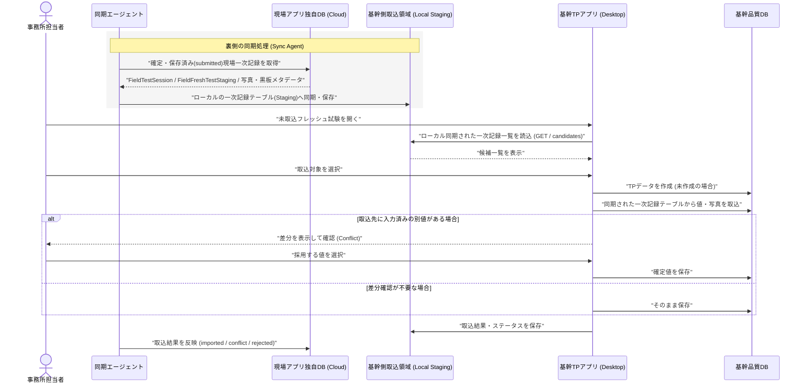

### 8.3 値競合・差分確認の例外処理方針

「差分確認」は、通常の流れでは目立たせない例外処理です。基幹 TP アプリ側で TP データを新規に作成して取り込む通常運用ではほとんど発生しませんが、以下の場合に競合解決フロー（`conflict` 状態）が作動します。

- **値の乖離**：基幹側で既にスランプ・空気量・温度などが手入力されており、現場アプリの測定値と異なる場合。
- **重複・再送**：同一フレッシュ試験が誤って複数回送信・取込された場合。
- **削除値の扱い**：現場アプリ側で「明示的に削除された（`clearedFields`）」項目を、基幹側の既存値からも削除するかどうかの確認。

---

## 9. フレッシュ試験入力設計

通常取りは `FieldFreshTestStaging.renban=0` の 1 行を入力する。縦割りは `renban=0..2` の各行に、出荷実績ごとのフレッシュ試験値を入力する。

```http
PATCH /api/v1/orgs/{orgId}/field-test-sessions/{sessionId}/fresh-tests/{renban}
```

```json
{
  "values": {
    "slump": 18.0,
    "air": 4.5,
    "concreteTemperature": 21.5
  },
  "changedFields": ["slump", "air", "concreteTemperature"],
  "clearedFields": []
}
```

| 入力項目 | 扱い |
|---|---|
| スランプ / フロー 1 / フロー 2 | 任意入力。フロー平均は必要に応じて表示補助として計算。 |
| 空気量 | 0 は有効値。空欄と区別。 |
| コンクリート温度 / 外気温 | 黒板差込対象。小数桁はテナント設定に従う。 |
| 塩化物量 / 単位水量 / 単位容積質量 | 対象運用の場合のみ表示。 |
| 備考 | 現場事情、再測定理由、取込時の補足。 |

### 9.1 フレッシュ試験登録シーケンス

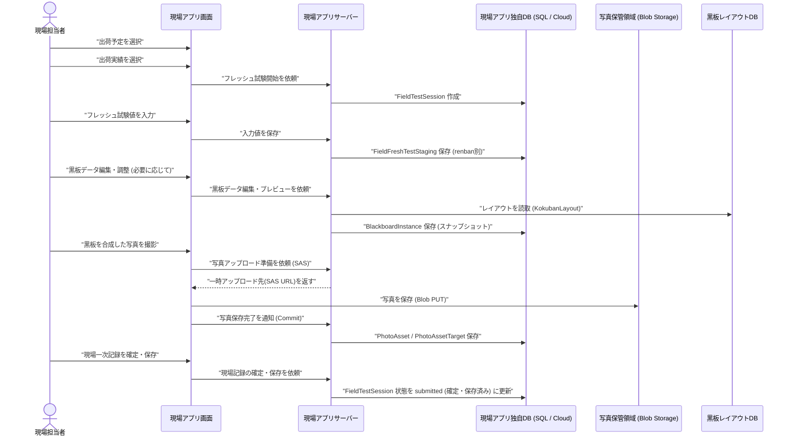

---

## 10. 縦割り設計

縦割りは、同一出荷予定内の複数出荷実績を 1 つの `FieldTestSession` にまとめ、フレッシュ試験値を `renban` 別に保持する。正式 TP へ取り込む際、既存の `TestPieceSampling + ShipmentLink + FreshTest` 行の構造へ変換する。

```text
縦割り構造:
FieldTestSession
 is_tatewari = true
 yotei_id = 同一予定 No
 ├─ SessionShipmentLink renban=0, shipment_id=出荷実績 1
 ├─ SessionShipmentLink renban=1, shipment_id=出荷実績 2
 ├─ SessionShipmentLink renban=2, shipment_id=出荷実績 3
 ├─ FieldFreshTestStaging renban=0, 出荷実績 1 の試験値
 ├─ FieldFreshTestStaging renban=1, 出荷実績 2 の試験値
 ├─ FieldFreshTestStaging renban=2, 出荷実績 3 の試験値
 ├─ BlackboardInstance
 └─ PhotoAssetTarget
```

| 観点 | 扱い |
|---|---|
| 親データ | 1 `FieldTestSession`。 |
| 出荷実績リンク | `SessionShipmentLink` N 件。`renban=0..2`。 |
| Fresh 行 | `FieldFreshTestStaging` N 件。`ShipmentLink.renban` と対応。 |
| 黒板 | 縦割りレイアウトを優先。スランプ_1〜3 などを `renban` 別に解決。 |
| 写真 | `FieldTestSession` 全体、または個別 `FieldFreshTestStaging` へ複数枚紐づけ。`covered_renbans` で複数行対象も表現可能。 |
| 取込 | デスクトップ側で 1 つの `TestPieceSampling` と複数 `FreshSiken` 行へ反映。 |

---

## 11. 電子黒板機能設計

- Ex7000 由来の `KokubanLayout` / `KokubanLayout_Data` / `KokubanLayoutSettings` を読み取り専用で利用する。
- Web 側には黒板レイアウト作成・編集機能を作らない。
- TP 未作成時は、`FieldFreshTestStaging` の値を黒板差込値として使用する。
- TP 取込後も、撮影時点の `BlackboardInstance` は履歴として保持し、レイアウトや値のスナップショットを変更しない。
- 通常 / 縦割りの差込値は `renban` により解決する。

| 差込項目 | 解決方法 |
|---|---|
| スランプ_1 / 空気量_1 / 温度_1 | `FieldFreshTestStaging.renban=0` の値。取込後は対応する `FreshSiken` 値とも照合可能。 |
| スランプ_2 / 空気量_2 / 温度_2 | `FieldFreshTestStaging.renban=1` の値。 |
| スランプ_3 / 空気量_3 / 温度_3 | `FieldFreshTestStaging.renban=2` の値。 |
| 車番_1〜3 | `SessionShipmentLink.renban` に対応する `Shipment.syaban`、または `FieldFreshTestStaging.syaban`。 |
| 供試体 No / 材齢 / 試験予定日 | 現場アプリは TP データを保持しないため、原則として空欄または「未連携」と表示する（基幹システム側での帳票出力・取込時に解決される）。 |

---

## 12. 写真・Blob 保存設計

写真本体は Blob Storage へ保存し、DB には `PhotoAsset` / `PhotoAssetTarget` / `PhotoBlackboardOverlay` / `AuditLog` などのメタデータを保存する。1 つのフレッシュ試験一次記録に対して複数枚の写真を保存できる。

| 処理 | 内容 |
|---|---|
| upload-session 発行 | `PhotoUploadSession` を作成し、`original` / `composed` / `thumbnail` / `rendered_blackboard` 用の短時間 SAS を返す。 |
| Blob PUT | ブラウザから Blob Storage へ直接アップロード。DB に Base64 保存しない。 |
| commit | Blob 存在確認後に `PhotoAsset` / `PhotoAssetTarget` / `Overlay` を確定。冪等にする。 |
| 通信断 | IndexedDB に未確定の写真を一時保持し、通信復旧時に自動/手動で確定・commit できる。 |
| 複数枚保存 | `FieldFreshTestStaging` 1 件に対して `PhotoAssetTarget` N 件を許可。 |
| 取込後リンク | 正式 TP へ取込後、`linked_tp_sampling_id` によって参照を保持し、基幹システム側で写真を紐づけ可能にする。クラウドDB側にはTP正本テーブルは存在しない。 |

### 12.1 PhotoAssetTarget 設計

| 項目 | 説明 |
|---|---|
| `photo_asset_target_id` | 関連 ID。 |
| `photo_asset_id` | 写真メタデータ ID。 |
| `target_type` | `field_test_session` / `field_fresh_test` / `shipment`（基幹システム側ローカルではTP等への紐付け情報も管理可能）。 |
| `target_id` | 対象 ID。`FieldFreshTestStaging` に紐づける場合は `field_fresh_test_id`。 |
| `renban` | 対象 Fresh 行。縦割り時の検索補助。 |
| `covered_renbans` | 1 枚の写真が複数 `renban` を含む場合の配列。 |
| `photo_category` | `blackboard` / `slump` / `flow` / `air` / `temperature` / `chloride` / `specimen` / `machine` / `other`。 |
| `display_order` | 同一対象内の表示順。 |
| `is_primary` | 代表写真フラグ。複数枚のうち一覧表示に使う。 |
| `created_at` | 作成日時。 |

> **設計禁止事項**  
> `FieldFreshTestStaging` に `photo1_blob_path` / `photo2_blob_path` のような固定列を持たせない。写真は `PhotoAssetTarget` で N 件関連として表現する。

### 例: 1 つのフレッシュ試験に複数枚の写真

```text
FieldFreshTestStaging(field_fresh_test_id = F-001)
 ├─ PhotoAssetTarget(category=blackboard,   target_type=field_fresh_test, target_id=F-001)
 ├─ PhotoAssetTarget(category=slump,        target_type=field_fresh_test, target_id=F-001)
 ├─ PhotoAssetTarget(category=air,          target_type=field_fresh_test, target_id=F-001)
 └─ PhotoAssetTarget(category=temperature,  target_type=field_fresh_test, target_id=F-001)
```

---

## 13. 同期 Agent 設計

| 方向 | 方式 | 対象 |
|---|---|---|
| ローカル → クラウド | `ExternalIdMapping` + `source_hash` による冪等 Upsert | 出荷予定、出荷実績、黒板レイアウト |
| クラウド → ローカル | `OutboxEvent` / Pull API + ACK。ACK まで完了扱いにしない | `FieldTestSession`、`FieldFreshTestStaging`、`PhotoAsset` メタデータ、`BlackboardInstance`、取込依頼/候補 |
| ローカル → クラウド | 取込結果 ACK / `import_status` 更新 | `imported` / `conflict` / `rejected` / `error` |

| 同期単位 | 扱い |
|---|---|
| `FieldTestSession` | 現場一次記録の親。`submitted` (確定・保存済み) 以降をデスクトップ取込対象にする。 |
| `FieldFreshTestStaging` | `renban` 単位。通常 0、縦割り 0〜2。`changedFields` / `clearedFields` を保持。 |
| `PhotoAsset` / `PhotoAssetTarget` | 写真メタデータ単位。Blob 本体は SAS / commit で管理。 |
| `BlackboardInstance` | 撮影時点の黒板スナップショット。 |
| 取込結果 | デスクトップ側で正式 TP へ反映後、`import_status` と `linked_tp_sampling_id` を更新。 |
| 競合 | 同一項目に別値がある場合は `conflict` としてクラウドへ返す。自動上書きしない。 |

### 13.1 アプリとデータの配置構成 (システム構成図)

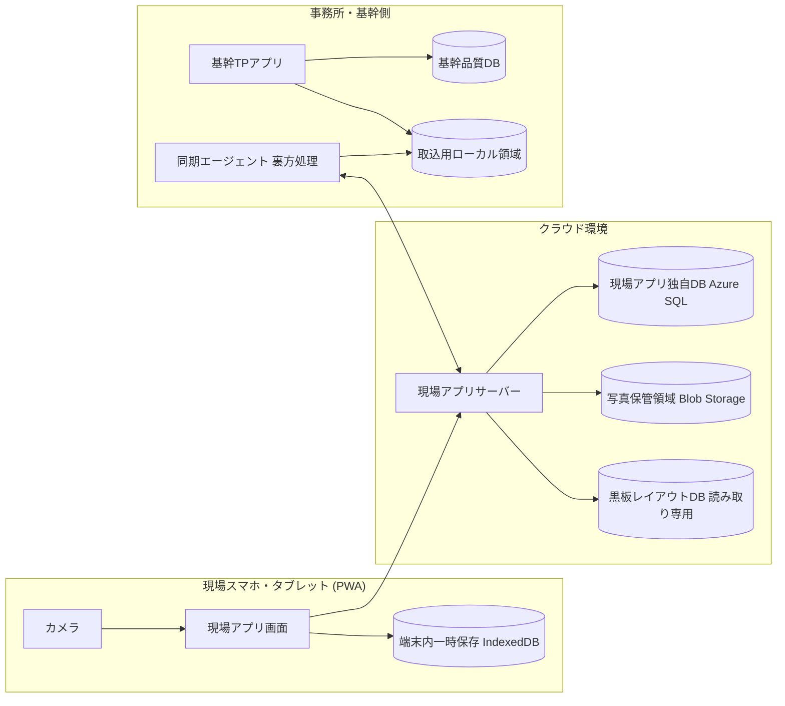

### 13.2 物理配置と利用環境

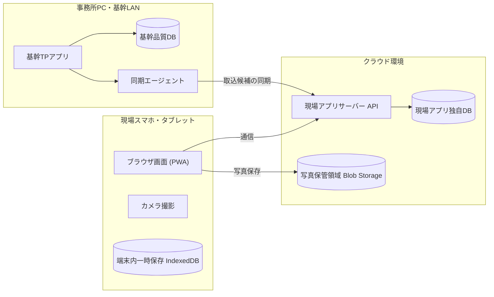

---

## 14. API 設計

| 分類 | API | 目的 |
|---|---|---|
| 出荷予定 | `GET /api/v1/orgs/{orgId}/shipping-schedules?date=...` | 出荷予定一覧。 |
| 出荷実績 | `GET /api/v1/orgs/{orgId}/shipments?date=...&yoteiId=...` | 出荷実績一覧。 |
| 現場記録 | `POST /api/v1/orgs/{orgId}/field-test-sessions` | 出荷実績または複数出荷実績から `FieldTestSession` を作成。 |
| 現場記録 | `GET /api/v1/orgs/{orgId}/field-test-sessions?shipmentId=...` | 出荷実績に紐づく現場記録一覧。未確定・未取込の再開に使用。 |
| 現場記録 | `GET /api/v1/orgs/{orgId}/field-test-sessions/{sessionId}` | 現場記録詳細。Fresh、写真、黒板、TP 連携状態を返す。 |
| Fresh | `PATCH /api/v1/orgs/{orgId}/field-test-sessions/{sessionId}/fresh-tests/{renban}` | `renban` 別フレッシュ試験一次記録を更新。 |
| 現場記録 | `POST /api/v1/orgs/{orgId}/field-test-sessions/{sessionId}/submit` | 現場入力完了。デスクトップ取込待ちへ。 |
| TP 候補 | `GET /api/v1/orgs/{orgId}/shipments/{shipmentId}/test-piece-samplings` | 既存 TP 候補を参考表示。0 件でも業務停止しない。 |
| 黒板 | `POST /api/v1/orgs/{orgId}/blackboards/preview` | `FieldFreshTestStaging` の値で黒板プレビュー。 |
| 写真 | `POST /api/v1/orgs/{orgId}/photos/upload-session` | アップロード SAS 発行。 |
| 写真 | `POST /api/v1/orgs/{orgId}/photos/{photoId}/commit` | `PhotoAsset` 確定。`PhotoAssetTarget` を複数指定可能。 |
| 取込 | `GET /api/sync/v1/orgs/{orgId}/field-test-sessions/import-candidates` | デスクトップ TP アプリが未取込の現場記録を取得。 |
| 取込 | `POST /api/sync/v1/orgs/{orgId}/field-test-sessions/{sessionId}/import-result` | 取込結果、競合、取込先 TP ID を返す。 |

### 14.1 FieldTestSession 作成リクエスト例

```http
POST /api/v1/orgs/{orgId}/field-test-sessions
```

```json
{
  "yoteiId": "...",
  "shipmentIds": ["shipment-001"],
  "isTatewari": false,
  "testDatetime": "2026-06-05T10:30:00+09:00",
  "clientRequestId": "device-uuid:20260605:001"
}
```

---

## 15. データモデル

| クラウドテーブル | 主な項目 | 対応/備考 |
|---|---|---|
| `ShippingSchedule` | `yotei_id`, `syukka_yoteibi`, `yotei_no`, `genba_id`, `haigo_id` | `YoteiDataMain` 相当。 |
| `Shipment` | `syukka_id`, `yotei_id`, `syukka_zikoku`, `syaban`, `syukkaryo` | `SyukkaDataMain` 相当。現場記録の起点。 |
| `FieldTestSession` | `field_test_session_id`, `shipment_id`, `yotei_id`, `status`, `linked_tp_sampling_id` | Web 側の現場一次記録親。新規。 `linked_tp_sampling_id` はクラウド上ではリレーションを持たない。 |
| `FieldTestSessionShipmentLink` | `field_test_session_id`, `renban`, `shipment_id` | 縦割り用。通常取りでも検索補助として 1 件作成可。 |
| `FieldFreshTestStaging` | `field_fresh_test_id`, `field_test_session_id`, `renban`, `slump`, `air`, `changed_fields_json` | フレッシュ試験一次記録。正本ではない。新規。 |
| `BlackboardInstance` | `target_type`, `target_id`, `layout_snapshot_json`, `resolved_values_json` | 撮影時点の黒板スナップショット。 |
| `PhotoAsset` | `blob_path`, `thumbnail_path`, `hash`, `taken_at`, `device_info` | 写真メタデータ。 |
| `PhotoAssetTarget` | `photo_asset_id`, `target_type`, `target_id`, `photo_category`, `display_order` | 写真と対象の関連。1 Fresh に N 件。 |
| `AuditLog` | `action`, `target_type`, `before_json`, `after_json`, `reason`, `actor_id`, `created_at` | 重要操作の監査。 |

### 15.1 主要データモデル クラス図

本図は、現場アプリ側が扱う独自データを中心に表したクラス図です。
- UMLから「取込管理」クラスを廃止し、取込ステータスや連携先IDは `FieldTestSession` および `FieldFreshTestStaging` に統合しています。
- 各クラス名には、対応するデータベースの物理テーブル名を括弧書きで明記しています。

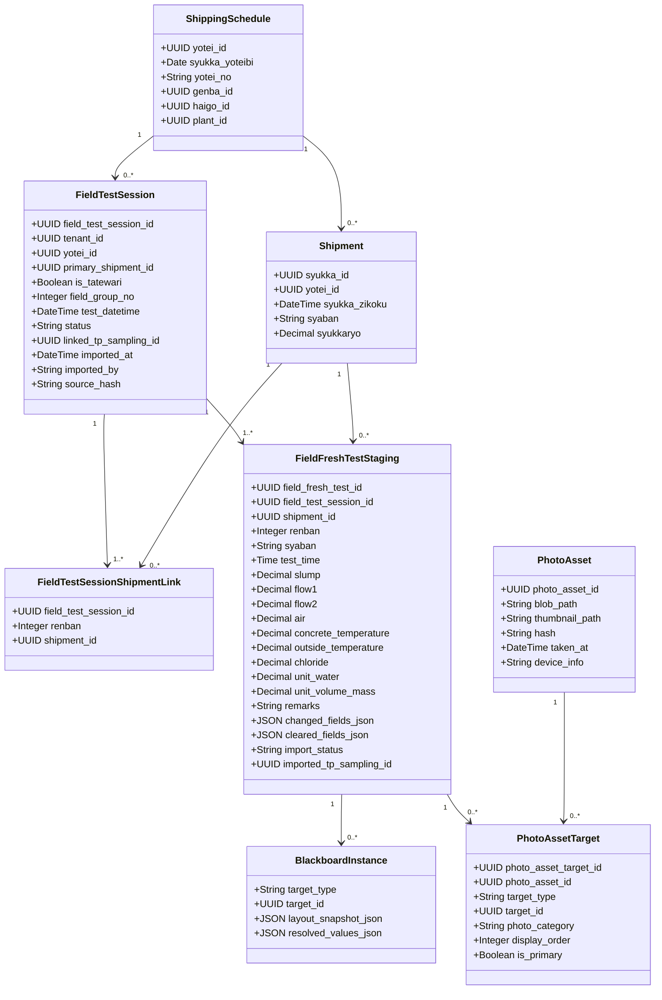

### 15.2 データ関連フロー

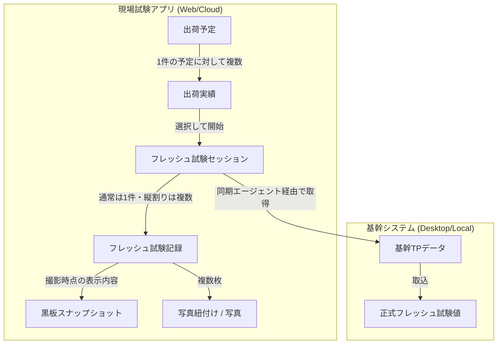

---

## 16. 認証・権限・テナント分離

- LibertyAccount の `orgId` を `tenant_id` として扱い、全 API で URL `orgId`・トークン所属 `org`・DB `tenant_id` の一致を確認する。
- `FieldOperator` は現場記録作成、フレッシュ値入力、写真撮影、黒板保存、現場記録送信を行える。
- `FieldOperator` は TP 正本作成、出荷紐づけ変更、試験区分 / 配合 / 現場変更、供試体構成変更を行えない。
- `QualityManager` は現場記録の確認、必要に応じた取込差分の確認、競合解決を行える（供試体情報の確認・修正は基幹システム側で行う）。
- `TenantAdmin` / 事務所側はデスクトップ TP アプリでの TP 作成、取込、対象外処理、出荷紐づけ見直しを行う。
- `SyncAgent` は同期 API 専用とし、画面ログインや他テナント参照は不可にする。

| 操作 | FieldOperator | QualityManager | TenantAdmin / 事務所側 |
|---|---|---|---|
| 現場記録作成 | 可 | 可 | 可 |
| フレッシュ値入力 | 可 | 可 | 可 |
| 写真撮影・追加 | 可 | 可 | 可 |
| 現場記録の確定・保存 | 可 | 可 | 可 |
| 正式 TP への取込 | 不可 | 権限付き可 | 可 |
| TP データ作成して取込 | 不可 | 原則不可 | 可 |
| 競合解決 | 不可 | 可 | 可 |
| 試験区分 / 配合 / 現場変更 | 不可 | 不可 | デスクトップ側修正を基本 |

---

## 17. テスト設計・受入条件

| テスト | 受入条件 |
|---|---|
| Fresh 更新 | `renban` 別 `changedFields` / `clearedFields` で更新でき、未入力空白で上書きしない。 |
| 縦割り | 同一 `yotei_id` の複数出荷実績を 1 つの `FieldTestSession` として開き、`FieldFreshTestStaging` を `renban` 別に入力できる。 |
| 写真複数枚 | 1 つの `FieldFreshTestStaging` に対して複数の `PhotoAssetTarget` を作成し、カテゴリ・表示順・代表写真を管理できる。 |
| 通信断 | IndexedDB に未確定の現場一次記録・写真が残り、通信復旧時に自動/手動で確定・commit できる。 |
| デスクトップ取込 | ローカル同期された一次記録テーブルから、既存のローカルTPデータへ値・写真の取込、または新規作成したTPデータへ取込が行えること。 |
| 競合 | 基幹側ローカルTPデータに既に別値がある場合、自動上書きせず競合状態として確認できること。 |
| 黒板 | 現場試験記録の値を元に黒板を表示し、撮影時点のスナップショットを保存できること。 |
| スコープ | Webアプリから基幹品質DB側の正式TPデータの作成・更新、供試体構成の編集、圧縮強度結果入力等が物理的に行えないこと（DB非配置のため）。 |
| 監査 | 取込、競合解決、対象外、void、写真削除など重要操作が `AuditLog` に残る。 |

---

## 18. 実装ロードマップ

| フェーズ | 内容 | ゲート |
|---|---|---|
| Phase 0 | 用語・画面名・API 契約を合わせて確定。`FieldTestSession` / `FieldFreshTestStaging` / 写真複数枚設計レビュー。 | 現場一次記録方式レビュー完了。 |
| Phase 1 | 出荷予定一覧、出荷一覧、`FieldTestSession` 作成/再開。 | 現場記録を開始できる。 |
| Phase 2 | 通常 Fresh 入力、`changedFields` / `clearedFields`、黒板プレビュー、写真複数枚保存。 | 通常取り E2E 合格。写真再送合格。 |
| Phase 3 | 縦割り `FieldTestSession`、`renban` 別 `FieldFreshTestStaging`、縦割り黒板。 | 縦割り E2E 合格。 |
| Phase 4 | デスクトップ TP アプリ取込画面、既存 TP 取込、TP 作成後取込、競合確認。 | 取込 E2E / conflict テスト合格。 |
| Phase 5 | Outbox / ACK、取込結果同期、監査ログ、運用ダッシュボード、未取込一覧。 | 同期一部失敗・再送・取込漏れ検知テスト合格。 |

---

## 19. 未決事項・確認事項

| No | 確認事項 | 理由 |
|---|---|---|
| O-01 | デスクトップ TP アプリの取込画面を既存 Ex3010 に組み込むか、別画面 / 別ツールにするか。 | 取込運用と既存画面改修範囲を確定するため。 |
| O-02 | TP データが既に存在する場合、将来的に Web から即時反映を許可するか。 | 初期リリースでは `FieldFreshTestStaging` に統一するが、将来の効率化余地がある。 |
| O-03 | 1 つのフレッシュ試験に許可する写真枚数の運用上限。 | DB では固定上限なし。容量・通信・UI の観点でテナント設定が必要。 |
| O-04 | 写真カテゴリの必須/任意設定。 | 黒板写真必須、測定器写真任意などの会社別運用差を吸収するため。 |
| O-05 | 供試体情報確認・軽微修正を TP 取込前にどこまで許可するか。 | 現場アプリ側では供試体情報確認・修正は行わない方針で確定。 |
| O-06 | 取込後の写真ターゲットを追加リンク方式にするか、`FieldTestSession` リンクのみで参照するか。 | 写真検索・帳票連携・重複表示の仕様を確定するため。 |
| O-07 | 未取込の現場記録に対する通知 / リマインド方法。 | 取込忘れを防ぐため。 |

---

## 付録 A. 主要ローカル DB 対応

| ローカル DB / 既存アプリ | クラウド / 新設 | 本システムでの扱い |
|---|---|---|
| `YoteiDataMain` | `ShippingSchedule` | 出荷予定。試験予定ではない。 |
| `SyukkaDataMain` | `Shipment` | 1 台ごとの出荷実績。`FieldTestSession` 作成の起点。 |
| `YoteiData_TpSaisyu` | `SourceLink` / 参考候補 | 出荷予定段階の TP 採取予定フラグ。Web 入力可否の前提にしない。 |
| `SyukkaData_TpSaisyu` | TP target / `SourceLink` | 出荷実績段階の TP 採取対象。未作成でも `FieldTestSession` は作成可能。 |
| `TestPieceSaisyu_Main` | `TestPieceSampling` | 正式 TP の親。デスクトップ側作成・取込先。 |
| `TestPieceSaisyu_FreshSiken` | `TestPieceSamplingFreshTest` | 正式 TP の Fresh 行。`FieldFreshTestStaging` から取込。 |
| `TestPieceSaisyu_Set` | `TestSet` | 供試体セット。TP 存在/取込後の確認・軽微修正対象。 |
| `TestPieceSaisyu_Piece` | `TestPiece` | 供試体ピース。TP 存在/取込後の確認・軽微修正対象。 |
| なし | `FieldTestSession` | Web で作る現場一次記録の親。新設。 |
| なし | `FieldFreshTestStaging` | Web で作るフレッシュ試験一次記録。新設。正本ではない。 |

---

## 付録 B. 用語集

| 用語 | 意味 |
|---|---|
| `FieldTestSession` | 出荷実績に紐づく現場一次記録の親。TP 未作成でも作成できる。 |
| `FieldFreshTestStaging` | 現場で測定したフレッシュ試験値の取込前ステージング。正式 TP の正本ではない。 |
| `TestPieceSampling` | 基幹システム（ローカル品質DB）側にのみ存在する正式な TP 採取データ。 |
| 取込 | `FieldFreshTestStaging` をデスクトップ TP アプリが正式 TP へ反映する処理。 |
| `import_status` | `not_imported` / `imported` / `conflict` / `rejected` などの取込状態。 |
| `PhotoAssetTarget` | 写真と対象データの関連。1 つのフレッシュ記録に複数枚の写真を紐づける。 |
| `photo_category` | `blackboard` / `slump` / `air` / `temperature` など写真種別。 |
| `superseded` | 再測定等により後続記録に置き換えられた状態。削除せず履歴を残す。 |
