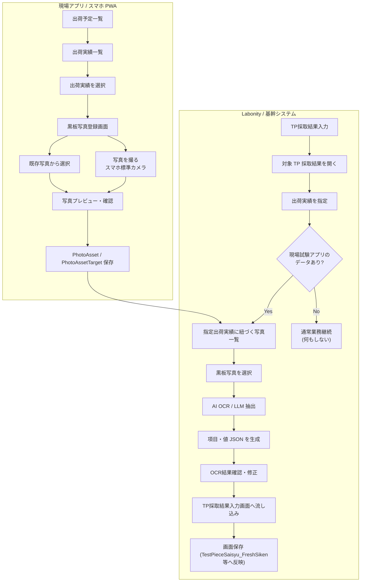
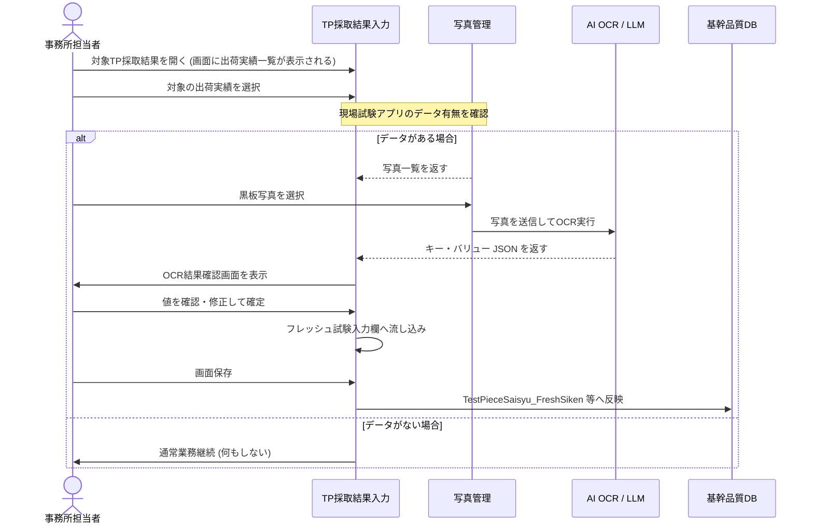

# Labonity 用現場試験アプリ 設計書 v2.1

**物理黒板写真保存・TP採取結果入力からの出荷実績指定・AI OCR / LLM によるキー・バリュー抽出方式**

| 項目 | 内容 |
|---|---|
| 文書区分 | 基本設計 / v2.0 追補 |
| 対象 | 現場試験アプリ / Labonity TP採取結果入力 |
| 版 | v2.1 |
| 作成日 | 2026-06-10 |
| 主な変更 | 基幹システムの TP採取結果入力から、対象 TP に紐づく出荷実績を指定し、その出荷実績に紐づく黒板写真を選択して AI OCR / LLM による項目・値抽出を行う方式へ変更。 |
| 前提 | 電子黒板合成なし。現場アプリでは物理黒板写真を撮影・保存する。フレッシュ試験データの現場入力はしない。Labonity 側で写真から OCR 取込する。 |

---

## 1. v2.1 の決定事項

v2.1 では、現場アプリの役割を **「出荷実績に紐づく黒板写真の撮影・保存」** に限定する。フレッシュ試験値の登録、電子黒板生成、黒板合成写真の作成は行わない。

Labonity 側では、**TP採取結果入力画面から対象 TP を開き、そこから出荷実績を指定する。対応する現場試験アプリのデータ（PhotoAsset 等）がある場合に限り、その出荷実績に紐づく写真を選択して AI OCR を実行する**。

AI OCR の結果は、単なる文字列ではなく、Labonity の取込項目に対応する **キー・バリュー形式の JSON** として取得する。必要に応じて JSON から XML へ変換できるようにする。

---

## 2. 全体業務フロー



---

## 3. TP採取結果入力からの写真選択フロー

### 3.1 画面起点と出荷実績の特定

基幹システムの **TP採取結果入力** 画面における通常の出荷実績指定（または出荷実績の選択操作）を起点とする。
ユーザーが対象の出荷実績（`TestPieceSaisyu_SyukkaData`）を指定したタイミングで、対象の出荷実績（`syukka_id`）および縦割り時の反映先連番（`renban`）が特定される。

- **通常取りの場合**: 指定された行の `syukka_id` が特定される。
- **縦割りの場合**: 指定された行の `syukka_id` と反映先 `TestPieceSaisyu_FreshSiken.renban` が同時に確定する。

### 3.2 現場試験アプリデータ有無の確認と写真選択画面への遷移

出荷実績（`syukka_id`）が指定された後、システムは対応する現場試験アプリのデータ（`PhotoAsset` および `PhotoAssetTarget`）の存在有無を自動的に確認し、フローを制御する。

- **対応するデータがある場合**: 
  自動的に写真選択画面を起動し、指定された `syukka_id` に紐づく黒板写真等の候補を一覧表示し、ユーザーが写真を選択して OCR を実行できるようにする。
- **対応するデータがない場合**:
  写真選択画面などの OCR 連携処理は起動せず、通常の出荷実績指定のみとして完了する（何もしない）。

データが存在する場合の写真検索の基本SQLは次の通り。

```sql
SELECT p.*, t.*
FROM PhotoAsset p
JOIN PhotoAssetTarget t
  ON p.photo_asset_id = t.photo_asset_id
WHERE t.target_type = 'shipment'
  AND t.target_id = @syukka_id
  AND t.photo_category IN ('blackboard', 'other')
ORDER BY
  t.is_primary DESC,
  t.display_order ASC,
  p.taken_at ASC;
```

現場アプリ側で `field_test_session` や `field_fresh_test` にも写真を紐づける場合でも、Labonity 側からの検索性を重視し、黒板写真については **必ず `target_type = shipment` の PhotoAssetTarget も作成する**。

### 3.3 写真選択 UI

写真一覧では以下を表示する。

| 表示項目 | 内容 |
|---|---|
| サムネイル | 黒板写真を選びやすくする |
| 撮影日時 | `PhotoAsset.taken_at` |
| 登録元 | 撮影 / 既存写真取込 |
| 写真種別 | `blackboard` / `other` |
| 紐づく出荷実績 | `syukka_id`, 車番, 出荷時刻 |
| OCR候補表示 | 黒板写真として優先表示する |
| 画質警告 | ぼけ、暗さ、傾き、黒板が小さい等 |

選択は 1 枚を基本とし、黒板全体写真と拡大写真が分かれている場合は複数枚選択を許可する。複数枚の場合、AI OCR / LLM は全写真をまとめて解析し、1 つの統合 JSON を返す。

---

## 4. AI OCR / LLM 取込フロー



---

## 5. OCR レスポンス形式

### 5.1 全体構造

AI OCR / LLM は以下のキー・バリュー JSON を返す。

### 5.2 JSON スキーマ定義

```json
{
  "$schema": "https://json-schema.org/draft/2020-12/schema",
  "title": "BlackboardFreshTest",
  "type": "object",
  "required": ["schemaVersion", "source", "fields"],
  "properties": {
    "schemaVersion": { "type": "string", "const": "labonity.blackboardFreshTest.v1" },
    "source": {
      "type": "object",
      "required": ["tpSamplingId", "shipmentId"],
      "properties": {
        "tpSamplingId": { "type": "string" },
        "shipmentId": { "type": "string" },
        "targetRenban": { "type": "integer" },
        "photoAssetIds": { "type": "array", "items": { "type": "string" } },
        "model": { "type": "string" },
        "processedAt": { "type": "string", "format": "date-time" }
      }
    },
    "fields": {
      "type": "array",
      "items": {
        "type": "object",
        "required": ["key", "value", "confidence"],
        "properties": {
          "key": { "type": "string" },
          "labelText": { "type": ["string", "null"] },
          "rawText": { "type": ["string", "null"] },
          "value": {},
          "valueType": { "type": "string", "enum": ["string", "number", "null"] },
          "unit": { "type": ["string", "null"] },
          "confidence": { "type": "number", "minimum": 0, "maximum": 1 },
          "bbox": { "type": ["object", "null"] },
          "candidates": { "type": ["array", "null"] },
          "needsReview": { "type": "boolean" },
          "warnings": { "type": "array", "items": { "type": "string" } }
        }
      }
    },
    "warnings": { "type": "array", "items": { "type": "string" } }
  }
}
```

### 5.3 JSON 出力例

```json
{
  "schemaVersion": "labonity.blackboardFreshTest.v1",
  "source": {
    "tpSamplingId": "TP-LOCAL-ID",
    "shipmentId": "SYUKKA-ID",
    "targetRenban": 0,
    "photoAssetIds": ["PHOTO-001"],
    "model": "gpt-5.5",
    "processedAt": "2026-06-10T10:30:00+09:00"
  },
  "fields": [
    {
      "key": "syaban",
      "labelText": "車番",
      "rawText": "12",
      "value": "12",
      "valueType": "string",
      "unit": null,
      "confidence": 0.93,
      "bbox": null,
      "candidates": ["12"],
      "needsReview": false,
      "warnings": []
    },
    {
      "key": "slump",
      "labelText": "スランプ",
      "rawText": "18.0",
      "value": 18.0,
      "valueType": "number",
      "unit": "cm",
      "confidence": 0.88,
      "bbox": null,
      "candidates": [18.0, 13.0],
      "needsReview": true,
      "warnings": ["18.0 と 13.0 の判別がやや不確実"]
    },
    {
      "key": "air",
      "labelText": "空気量",
      "rawText": "4.5",
      "value": 4.5,
      "valueType": "number",
      "unit": "%",
      "confidence": 0.91,
      "bbox": null,
      "candidates": [4.5],
      "needsReview": false,
      "warnings": []
    }
  ],
  "warnings": [
    "黒板右下が一部ぼけています。低信頼度の項目は確認してください。"
  ]
}
```

### 5.4 XML 派生例

```xml
<BlackboardFreshTest schemaVersion="labonity.blackboardFreshTest.v1">
  <Source tpSamplingId="TP-LOCAL-ID" shipmentId="SYUKKA-ID" targetRenban="0" />
  <Field key="syaban" label="車番" value="12" confidence="0.93" />
  <Field key="slump" label="スランプ" value="18.0" unit="cm" confidence="0.88" needsReview="true" />
  <Field key="air" label="空気量" value="4.5" unit="%" confidence="0.91" />
</BlackboardFreshTest>
```

---

## 6. Labonity 取込キー定義

現場試験黒板写真の実際のレイアウト（実測値としてスランプ、空気量、コンクリート温度、外気温、塩化物量の代表値１つ、備考等が記載される実態）に基づき、写真から直接読み取れる（導出可能な）以下の項目に絞り込んでOCR対象とします。

### 抽出・連携方針
1. **全項目を nullable (オプショナル) とする**:
   黒板の種類によって書かれている項目・書かれていない項目が異なるため、LLMスキーマ上は全項目を定義しつつ、記載がない項目はLLMが `null` を返せるように設計します。
2. **システム側でのフォールバック**:
   OCR結果が `null` だった場合は、画面側の手入力、または出荷実績データ等の他のコンテキストやデフォルト値（材料分離の「無」など）から補完します。

### 取込キー定義一覧（全項目オプショナル設計）

| canonical key | 日本語名 | 型 | 単位 | 反映先候補 | 抽出および連携ルール |
|---|---|---|---|---|---|
| `syaban` | 車番 | string | なし | `TestPieceSaisyu_FreshSiken.syaban` | 黒板に車番が書かれている場合のみ抽出。ない場合は `null`。最大6文字。 |
| `test_time` | 試験時間 | string | なし | `TestPieceSaisyu_FreshSiken.sikenzikan` | 試験時間が書かれている場合のみ、"HH:mm" 形式に正規化して抽出。ない場合は `null`。最大6文字。 |
| `outside_temperature` | 外気温 | number | ℃ | `TestPieceSaisyu_FreshSiken.gaikion` | 外気温（例: `12.0`, `31`）。「A.T」や「外気温」などの表記から抽出。 |
| `slump` | スランプ | number | cm | `TestPieceSaisyu_FreshSiken.slump` | スランプ値（cm）。 |
| `flow1` | フロー1 | number | mm | `TestPieceSaisyu_FreshSiken.flow1` | フロー値。高流動コンクリート等の場合に抽出。 |
| `flow2` | フロー2 | number | mm | `TestPieceSaisyu_FreshSiken.flow2` | 同上。 |
| `air` | 空気量 | number | % | `TestPieceSaisyu_FreshSiken.air` | 空気量（%）。 |
| `concrete_temperature` | コンクリート温度 | number | ℃ | `TestPieceSaisyu_FreshSiken.concrete_ondo` | 生コン温度（℃）。 |
| `unit_volume_mass` | 単位容積質量 | number | kg/m³ | `TestPieceSaisyu_FreshSiken.taniyosekisituryo` | 単位容積質量（kg/m³）。 |
| `chloride1` | 塩化物量1 | number | kg/m³ | `TestPieceSaisyu_FreshSiken.enkabuturyo1` | 塩化物量1つ目（結果の代表値など）。 |
| `chloride2` | 塩化物量2 | number | kg/m³ | `TestPieceSaisyu_FreshSiken.enkabuturyo2` | 塩化物量2つ目（複数測定時のみ抽出）。 |
| `chloride3` | 塩化物量3 | number | kg/m³ | `TestPieceSaisyu_FreshSiken.enkabuturyo3` | 塩化物量3つ目（複数測定時のみ抽出）。 |
| `unit_water` | 単位水量 | number | kg/m³ | `TestPieceSaisyu_FreshSiken.tanisuiryo` | 単位水量（kg/m³）。 |
| `remarks` | 備考 | string | なし | `TestPieceSaisyu_FreshSiken.biko` | 備考欄の記述。**※DB型が nvarchar(10) のため、10文字超は切り詰め警告処理。** |
| `visual_segregation` | 材料分離目視確認 | string | なし | `TestPieceSaisyu_FreshSiken.zairyobunrimokusikakunin` | "有", "無", "空白" のいずれかで抽出し、DBへは 1, 2, 0 としてマッピング。 |
| `air_meter_no` | エアメータ登録番号 | string | なし | `TestPieceSaisyu_FreshSiken.airmetertorokubango` | エアメータ機器番号等（例: `"No.3"`）。システム側でID（uniqueidentifier）に変換して紐付け。 |
| `kantab_test_no` | カンタブ試験ID | string | なし | `TestPieceSaisyu_FreshSiken.kantabsiken_id` | カンタブ試験No等。システム側でID（uniqueidentifier）に変換して紐付け。 |
| `solta_test_no` | ソルター試験ID | string | なし | `TestPieceSaisyu_FreshSiken.soltasiken_id` | ソルター試験No等。システム側でIDへ変換。 |
| `solmate_test_no` | ソルメイト試験ID | string | なし | `TestPieceSaisyu_FreshSiken.solmatesiken_id` | ソルメイト試験No等。システム側でIDへ変換。 |
| `solcon_test_no` | ソルコン試験ID | string | なし | `TestPieceSaisyu_FreshSiken.solconsiken_id` | ソルコン試験No等。システム側でIDへ変換。 |
| `early_water_test1_no` | 単位水量早期判定試験ID1 | string | なし | `TestPieceSaisyu_FreshSiken.tanisuiryosokihanteisiken1_id` | 早期判定試験No1等。システム側でIDへ変換。 |
| `early_water_test2_no` | 単位水量早期判定試験ID2 | string | なし | `TestPieceSaisyu_FreshSiken.tanisuiryosokihanteisiken2_id` | 早期判定試験No2等。システム側でIDへ変換。 |

### システム制御項目（OCR対象外）

| 項目名 | DBカラム名 | 区分 | 理由 |
|---|---|---|---|
| TP採取結果入力ID | `testpiecesaisyu_main_id` | システム制御 | 画面の操作対象TPレコードID（コンテキスト）から取得するため不要。 |
| 連番 | `renban` | システム制御 | 画面上の行選択コンテキストから取得するため不要。 |
| データ区分 | `datakubun` | システム制御 | メインデータ等の区分値（固定値）のため不要。 |

### OCR対象項目（黒板写真から導出可能な項目）

| canonical key | 日本語名 | 型 | 単位 | 反映先候補 | 黒板からの読取ルール・留意点 |
|---|---|---|---|---|---|
| `slump` | スランプ | number | cm | `TestPieceSaisyu_FreshSiken.slump` | スランプ値（例: `14.0`, `20.5`）。 |
| `flow1` | フロー1 | number | mm | `TestPieceSaisyu_FreshSiken.flow1` | 高流動コンクリート等の場合、フロー値（例: `450`）として抽出。 |
| `flow2` | フロー2 | number | mm | `TestPieceSaisyu_FreshSiken.flow2` | 同上。 |
| `air` | 空気量 | number | % | `TestPieceSaisyu_FreshSiken.air` | 空気量（例: `3.7`, `3.9`）。 |
| `concrete_temperature` | コンクリート温度 | number | ℃ | `TestPieceSaisyu_FreshSiken.concrete_ondo` | 生コン温度（例: `11`, `30`）。 |
| `outside_temperature` | 外気温 | number | ℃ | `TestPieceSaisyu_FreshSiken.gaikion` | 外気温（例: `12.0`, `31`）。「A.T」や「外気温」のラベルから読み取る。 |
| `chloride1` | 塩化物量1 | number | kg/m³ | `TestPieceSaisyu_FreshSiken.enkabuturyo1` | 塩化物量。黒板上の単一の結果数値をここにマッピング（例: `0.03`, `0.09`）。 |
| `remarks` | 備考 | string | なし | `TestPieceSaisyu_FreshSiken.biko` | 備考欄の記述を抽出。**※DB型は nvarchar(10) のため、10文字超は切り詰め警告処理。** |

### OCR対象外項目（黒板写真からは導出せず、システムで管理・入力する項目）

| 項目名 | DBカラム名 | 区分 | 理由 |
|---|---|---|---|
| TP採取結果入力ID | `testpiecesaisyu_main_id` | システム制御 | 画面コンテキストから取得するため不要。 |
| 連番 | `renban` | システム制御 | 画面の行選択コンテキストから取得するため不要。 |
| データ区分 | `datakubun` | システム制御 | メインデータ等の区分値（固定値）のため不要。 |
| 車番 | `syaban` | OCR対象外 | 標準的な黒板には車番の記載欄がなく、通常書かれないため除外。 |
| 試験時間 | `sikenzikan` | OCR対象外 | 黒板には「試験日（日付）」のみで「試験時間」の記載欄がなく、通常書かれないため除外。 |
| 単位容積質量 | `taniyosekisituryo` | OCR対象外 | 標準的な黒板には記載欄がなく、通常書かれないため除外。 |
| 塩化物量2, 3 | `enkabuturyo2`, `3` | OCR対象外 | 黒板には結果の代表値（1つ）のみ記載されるため除外。 |
| 単位水量 | `tanisuiryo` | OCR対象外 | 標準的な黒板には記載欄がなく、通常書かれないため除外。 |
| 材料分離目視確認 | `zairyobunrimokusikakunin` | OCR対象外 | 黒板に項目がなく、目視結果は別途入力とするため除外。 |
| 各種試験ID・機器番号 | `kantabsiken_id` 等 | OCR対象外 | マスタID（uniqueidentifier型）であり、黒板からは直接導出できないため除外。 |

---


## 7. OcrImportJob 設計

AI OCR 取込の証跡として `OcrImportJob` を追加する。

| 項目 | 型 | 説明 |
|---|---|---|
| `ocr_import_job_id` | uuid | OCR取込ジョブID |
| `tenant_id` | uuid | テナントID |
| `tp_sampling_id` | uuid / local id | 対象 TP 採取結果 |
| `shipment_id` | uuid | 指定した出荷実績 |
| `target_renban` | tinyint | 反映先 renban |
| `photo_asset_ids_json` | json | OCR対象写真ID配列 |
| `ocr_engine` | nvarchar | `openai`, `azure_vision`, `azure_document_intelligence` など |
| `ocr_model` | nvarchar | `gpt-5.5` など |
| `schema_version` | nvarchar | `labonity.blackboardFreshTest.v1` |
| `prompt_version` | nvarchar | プロンプトバージョン |
| `status` | nvarchar | `queued` / `processing` / `needs_review` / `applied` / `failed` / `rejected` |
| `raw_ocr_json` | json | OCR生結果 |
| `extracted_values_json` | json | キー・バリュー抽出結果 |
| `confidence_json` | json | 項目別信頼度 |
| `warnings_json` | json | 警告・不確実性 |
| `reviewed_by` | nvarchar | 確認者 |
| `reviewed_at` | datetime | 確認日時 |
| `applied_by` | nvarchar | 反映者 |
| `applied_at` | datetime | 反映日時 |
| `created_at` | datetime | 作成日時 |

必要に応じて、項目別の検索性を上げるため `OcrImportField` を追加する。

| 項目 | 型 | 説明 |
|---|---|---|
| `ocr_import_field_id` | uuid | 項目別ID |
| `ocr_import_job_id` | uuid | 親ジョブ |
| `canonical_key` | nvarchar | `slump`, `air` 等 |
| `label_text` | nvarchar | 黒板上の項目名 |
| `raw_text` | nvarchar | 読取文字 |
| `normalized_value` | nvarchar | 正規化後の値 |
| `unit` | nvarchar | 単位 |
| `confidence` | decimal | 信頼度 |
| `bbox_json` | json | 座標情報 |
| `candidates_json` | json | 候補値 |
| `validation_status` | nvarchar | `ok` / `warning` / `error` |

---

## 8. AI OCR / LLM モデル選定

### 8.1 結論

初期リリースの推奨構成は次の通り。

```text
画像入力: 黒板写真 1〜複数枚
  ↓
必要に応じて前処理: トリミング、傾き補正、明るさ補正
  ↓
主抽出: GPT-5.5 vision + Structured Outputs JSON Schema
  ↓
検証: Labonity 項目定義、値範囲、小数桁、単位、既存値差分
  ↓
人手確認・確定
  ↓
TP採取結果入力画面の入力欄へ流し込み (DBへの直接書き込みは行わない)
  ↓
画面全体の保存 (TestPieceSaisyu_FreshSiken 等へ反映)
```

### 8.2 Azure OCR 単体では難しい理由

Azure AI Vision OCR や Azure Document Intelligence は、印刷文字・手書き文字の OCR、行・単語・レイアウト、キー・バリュー抽出に対応している。ただし、今回の対象は **チョークで書いた汚い手書き黒板写真** であり、通常の帳票やフォームよりも以下の不確実性が高い。

- ラベル名が毎回同じ位置にない。
- 値だけが大きく書かれ、項目名が省略されることがある。
- `18.0` と `13.0`、`4.5` と `4.8` のような読み違いが起きやすい。
- 黒板の反射、ブレ、斜め撮影、粉のかすれがある。
- 同じ写真内に出荷情報、現場情報、試験値、備考が混在する。

そのため、OCR エンジンだけで `slump: 18.0` のような確定 JSON を作るのではなく、**画像理解できる LLM に Labonity のスキーマを与えて、項目と値を対応付けさせる** 方式を主方式にする。

### 8.3 採用候補

| 優先度 | 候補 | 役割 | 採用判断 |
|---:|---|---|---|
| 1 | OpenAI GPT-5.5 vision + Structured Outputs | 黒板写真から Labonity 項目別 JSON を生成 | 初期リリースの主方式 |
| 2 | Azure AI Vision OCR / Azure Document Intelligence | 前処理OCR、行・単語・座標抽出、比較用 | 補助または PoC 比較 |
| 3 | GPT-5.4 mini vision | コスト低減用の比較候補 | 精度検証後に通常写真へ適用 |
| 4 | Gemini 3.1 Pro / Flash | 比較検証用 | ベンダー比較候補 |
| 5 | Claude vision | 比較検証用 | ベンダー比較候補 |

### 8.4 運用方針

- `confidence >= 0.90` かつ値範囲検証 OK の項目は、確認画面で初期チェック済みにする。
- `0.60 <= confidence < 0.90` の項目は、黄色表示で人手確認必須にする。
- `confidence < 0.60`、または候補が複数ある項目は、値を自動反映しない。
- 既存 TP 側に値があり、OCR 値と異なる場合は差分確認にする。
- 確定前に必ず確認画面を通す。完全自動保存は初期リリースでは行わない。

---

## 9. API 設計

### 9.1 TPに紐づく出荷実績取得

```http
GET /api/core/v1/tp-samplings/{tpSamplingId}/shipments
```

レスポンス例:

```json
{
  "tpSamplingId": "TP-001",
  "shipments": [
    {
      "shipmentId": "SYUKKA-001",
      "renban": 0,
      "syaban": "12",
      "syukkaZikoku": "10:30",
      "isPrimary": true
    }
  ]
}
```

### 9.2 出荷実績に紐づく写真取得

```http
GET /api/core/v1/shipments/{shipmentId}/photos?photoCategory=blackboard
```

レスポンス例:

```json
{
  "shipmentId": "SYUKKA-001",
  "photos": [
    {
      "photoAssetId": "PHOTO-001",
      "thumbnailUrl": "...",
      "takenAt": "2026-06-10T10:31:00+09:00",
      "photoCategory": "blackboard",
      "isPrimary": true,
      "displayOrder": 1,
      "sourceType": "camera",
      "qualityWarnings": []
    }
  ]
}
```

### 9.3 OCRジョブ作成

```http
POST /api/core/v1/ocr/blackboard-import-jobs
```

```json
{
  "tpSamplingId": "TP-001",
  "shipmentId": "SYUKKA-001",
  "targetRenban": 0,
  "photoAssetIds": ["PHOTO-001"],
  "schemaVersion": "labonity.blackboardFreshTest.v1"
}
```

### 9.4 OCR結果取得

```http
GET /api/core/v1/ocr/blackboard-import-jobs/{jobId}
```

### 9.5 OCR結果反映

```http
POST /api/core/v1/ocr/blackboard-import-jobs/{jobId}/apply
```

※本APIの実行により `TestPieceSaisyu_FreshSiken` テーブルへの直接書き込みは行わず、`OcrImportJob` のステータス更新と監査ログ記録のみを行います。確定された値は、呼び出し元の画面（UI）の入力欄に流し込まれます。

```json
{
  "acceptedFields": [
    { "key": "slump", "value": 18.0 },
    { "key": "air", "value": 4.5 },
    { "key": "concrete_temperature", "value": 21.5 }
  ],
  "rejectedFields": [
    { "key": "unit_water", "reason": "黒板に記載なし" }
  ],
  "userCorrections": [
    {
      "key": "slump",
      "before": 13.0,
      "after": 18.0,
      "reason": "画像確認により修正"
    }
  ]
}
```

---

## 10. 画面仕様

### 10.1 TP採取結果入力画面（部分）

```text
TP採取結果入力 (一部)

対象TP: TP-20260610-001
現場: ○○現場
配合: 18-18-20N

【出荷情報】
[連番] [出荷時刻] [車番] [数量]   [アクション]
  0    10:30     12    4.0m3  [出荷指定]
  1    10:45     15    4.0m3  [出荷指定]
```
※ [OCR取込] ボタンは配置せず、[出荷指定]（または行選択・ダブルクリック等の指定操作）が行われた際に、自動的に現場試験アプリのデータ有無を確認します。データが存在する場合は写真選択画面が自動起動します。

### 10.2 写真選択画面

※対応する現場試験アプリのデータがある場合のみ本画面へ遷移する。

```text
出荷実績: 10:30 / 車番12
黒板写真候補

[サムネイル] 2026/06/10 10:31 黒板写真 代表
[サムネイル] 2026/06/10 10:32 黒板拡大
[サムネイル] 2026/06/10 10:33 その他

[OCR実行]
```

### 10.3 OCR結果確認画面

```text
左: 写真ビューア
右: 抽出結果

項目              OCR値      信頼度   反映値   状態
車番              12         93%      12       OK
スランプ          18.0       88%      18.0     要確認
空気量            4.5        91%      4.5      OK
コンクリート温度  21.5       77%      21.5     要確認
外気温            未読取     -        空欄     要入力

[入力欄に反映] [保留] [再OCR] [別写真を選ぶ]
```

---

## 11. 受入条件

| No | 受入条件 |
|---|---|
| A-01 | TP採取結果入力にて出荷実績を指定した際に、自動的に現場試験アプリデータの有無を確認してフローを開始できる。 |
| A-02 | 出荷実績の指定操作から、対象の出荷実績（syukka_id/renban）を特定し、現場試験アプリのデータがあれば自動で写真選択画面を起動できる（データがない場合は何もせず完了する）。 |
| A-03 | 選択した出荷実績に紐づく現場試験アプリのデータ（PhotoAsset 等）がある場合のみ、登録写真が候補表示される（データがない場合は何も表示・処理しない）。 |
| A-04 | 表示された黒板写真を 1 枚または複数枚選択して OCR 実行できる。 |
| A-05 | AI OCR / LLM は Labonity 項目に対応したキー・バリュー JSON を返す。 |
| A-06 | JSON は Schema Version により検証できる。 |
| A-07 | OCR 結果には、値、単位、信頼度、候補、警告を含める。 |
| A-08 | 低信頼度項目、既存値との差分、候補複数項目は確認必須になる。 |
| A-09 | ユーザー確定後、値はTP採取結果入力画面のフレッシュ試験入力欄へ流し込まれる（データベースへの直接保存は行わず、画面保存時にデータベースへ反映される）。 |
| A-10 | 取込元写真、OCRモデル、抽出JSON、修正内容、反映者を監査ログに残す。 |
| A-11 | 縦割り時は選択した出荷実績の renban にだけ値を反映する。 |
| A-12 | XML が必要な場合、検証済み JSON から XML を生成できる。 |

---

## 12. 実装メモ

- 現場アプリ側では、写真登録時に `target_type = shipment` の紐づけを必須にする。
- 写真一覧の OCR 候補は `photo_category = blackboard` を優先する。
- 既存写真取込の場合も、選択中の出荷実績に対して PhotoAssetTarget を作成する。
- AI OCR は非同期ジョブとし、タイムアウトや再実行に対応する。
- AI OCR 結果はそのまま正本反映せず、必ず確認画面を通す。
- OCR結果確定時は、データベース（TestPieceSaisyu_FreshSiken 等）へ直接書き込むのではなく、呼び出し元であるTP採取結果入力画面の対応する各入力欄（スランプ、空気量など）に値を流し込む。実際のデータベース保存は、当該画面の「保存」ボタン押下などの通常保存処理に委ねる。
- モデルやプロンプトを変更しても過去の取込結果を再現できるよう、`ocr_model`、`schema_version`、`prompt_version` を保存する。
