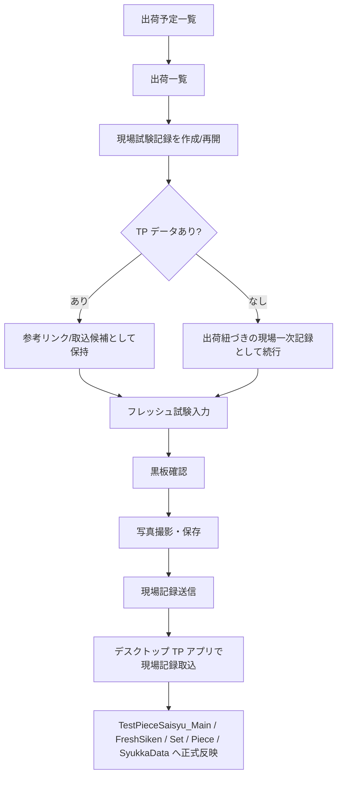
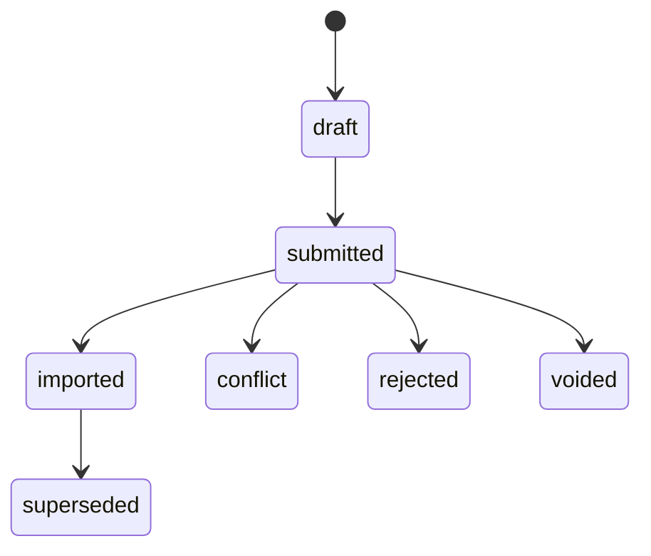

# Labonity 用現場試験アプリ 設計書

**出荷別現場試験記録・フレッシュ試験一次記録・TP 取込連携・写真複数枚保存・黒板・同期 Agent**  
**v2.3 - 現場一次記録取込方式 反映版**

| 項目 | 内容 |
|---|---|
| 文書区分 | 基本設計 / 最新版修正 / 実装前提整理 |
| 対象アプリ | Labonity 用現場試験アプリ |
| 版 | v2.3（現場一次記録取込方式 反映版） |
| 作成日 | 2026-06-05 |
| 今回の主修正 | TP 採取データが未作成でも現場作業を止めないため、Web は TP 正本へ直接書き込まず、出荷に紐づく `FieldTestSession` / `FieldFreshTestStaging` に現場一次記録を保存する方式へ変更。デスクトップ TP アプリ側で後から正式 TP へ取り込む設計を追加。1 つのフレッシュ試験記録に複数枚の写真を紐づける設計を明記。 |
| 前提 | React + TypeScript PWA / ASP.NET Core Web API / Azure SQL / Blob Storage / Sync Agent / Ex7000 KokubanLayout / デスクトップ TP アプリ取込機能 |

## v2.3 反映版の位置づけ

v2.2 では「同期済み TP 採取データを現場で選択し、確認・追記する」方針だった。v2.3 では、TP チェック漏れや TP 未作成により現場作業が停止するリスクを避けるため、Web の主責務を **「出荷に紐づく現場一次記録の保存」** に変更する。正式な TP 採取データの作成・取り込み・帳票連携は、デスクトップ TP アプリ側の責務とする。

---

## 目次

- [0. v2.3 改訂サマリー](#0-v23-改訂サマリー)
- [1. 最終設計方針](#1-最終設計方針)
- [2. 用語整理](#2-用語整理)
- [3. デスクトップ側で作成される TP データと v2.3 での扱い](#3-デスクトップ側で作成される-tp-データと-v23-での扱い)
- [4. 現場アプリで登録・確認する範囲](#4-現場アプリで登録確認する範囲)
- [5. 画面フローと UI イメージ](#5-画面フローと-ui-イメージ)
- [6. FieldTestSession 設計](#6-fieldtestsession-設計)
- [7. FieldFreshTestStaging 設計](#7-fieldfreshteststaging-設計)
- [8. デスクトップ TP アプリ取込設計](#8-デスクトップ-tp-アプリ取込設計)
- [9. フレッシュ試験入力設計](#9-フレッシュ試験入力設計)
- [10. 縦割り設計](#10-縦割り設計)
- [11. 電子黒板機能設計](#11-電子黒板機能設計)
- [12. 写真・Blob 保存設計](#12-写真blob-保存設計)
- [13. 同期 Agent 設計](#13-同期-agent-設計)
- [14. API 設計](#14-api-設計)
- [15. データモデル](#15-データモデル)
- [16. 認証・権限・テナント分離](#16-認証権限テナント分離)
- [17. テスト設計・受入条件](#17-テスト設計受入条件)
- [18. 実装ロードマップ](#18-実装ロードマップ)
- [19. 未決事項・確認事項](#19-未決事項確認事項)
- [付録 A. 主要ローカル DB 対応](#付録-a-主要ローカル-db-対応)
- [付録 B. 用語集](#付録-b-用語集)
- [付録 C. v2.2 からの置換方針](#付録-c-v22-からの置換方針)

---

## 0. v2.3 改訂サマリー

本版では、TP 採取データが未作成でも現場作業を止めないため、現場アプリの保存単位を「TP 採取データ」から「出荷に紐づく現場一次記録」へ変更する。Web アプリは TP 正本を直接作成・更新するのではなく、出荷別のフレッシュ試験一次記録、黒板、写真を保存し、デスクトップ TP アプリが後から正式 TP へ取り込む。

| No | 修正点 | v2.3 反映版の扱い |
|---:|---|---|
| 1 | TP 未作成時の業務停止回避 | 出荷に紐づく `FieldTestSession` / `FieldFreshTestStaging` を作成し、TP データが 0 件でもフレッシュ試験・黒板・写真を保存可能にする。 |
| 2 | Web から TP 正本への直接書込を抑制 | 初期リリースでは Web → `TestPieceSamplingFreshTest` 直接更新を主経路にしない。正式 TP 化はデスクトップ TP アプリ取込で行う。 |
| 3 | `FreshTestResults` の扱い | `FreshTestResults` / `FreshTestGroup` は引き続き正本にしない。`FieldFreshTestStaging` は正本ではなく、取込前の現場一次記録・ステージングとして定義する。 |
| 4 | 写真複数枚保存 | 1 つのフレッシュ試験記録に対して `PhotoAssetTarget` を N 件作成できる。黒板写真、スランプ写真、空気量、温度計、塩化物量、その他の複数枚を保存できる。 |
| 5 | 取込画面追加 | デスクトップ TP アプリに「現場記録取込」画面を追加し、既存 TP へ取込、TP 作成後取込、競合確認、対象外処理を行う。 |
| 6 | 縦割り対応 | 複数出荷を 1 つの `FieldTestSession` に束ね、`FieldFreshTestStaging.renban = 0..2` で出荷別フレッシュ値を保持する。 |
| 7 | 黒板差込値 | TP 未作成時は `FieldFreshTestStaging` の値を黒板へ差し込む。TP 取込後は正式 TP とのリンクを保持し、撮影時点のスナップショットは変えない。 |

> **今回の重要な決定**  
> 「TP データ作成依頼」を主方式にしない。工場・事務所側が即時対応できない場合でも現場の試験・撮影が進むよう、Web は出荷別の現場一次記録を保存する。TP 作成依頼は補助機能として残してもよいが、現場作業を止めないことを優先する。

---

## 1. 最終設計方針

- 現場試験アプリは、出荷予定・出荷を選び、TP データの有無に依存せず、`FieldTestSession` を作成または再開して現場試験記録を保存する PWA とする。
- フレッシュ試験の現場実測値は、初期リリースでは `FieldFreshTestStaging` に保存する。これは TP 正本ではなく、デスクトップ TP アプリが取り込むための一次記録である。
- TP 採取対象の業務判定、TP 採取データの正式作成、供試体セット・ピース初期構成、帳票連携は、原則としてデスクトップアプリ / 出荷管理 / Ex3010 / TP アプリ側の責務とする。
- Web 側は、TP データ未作成時でもフレッシュ試験値、黒板スナップショット、写真を保存する。供試体情報の確認・軽微修正は、TP データが存在または取込済みの場合に行う。
- `FreshTestResults` / `FreshTestGroup` は正本テーブルとして作成しない。`FieldFreshTestStaging` も正本ではなく、`import_status` によって正式 TP への取込状態を管理する。
- 黒板は Ex7000 由来 `KokubanLayout` 系を読み取り専用で利用し、撮影時点の `layout_snapshot_json` / `settings_snapshot_json` / `resolved_values_json` を保存する。
- 写真本体は Blob Storage に保存し、DB は `PhotoAsset` / `PhotoAssetTarget` / `PhotoBlackboardOverlay` / `AuditLog` などのメタデータに限定する。Base64 で DB 保存しない。
- 1 つの `FieldFreshTestStaging` に対して複数の `PhotoAssetTarget` を紐づけられる。写真枚数の上限は DB 設計では固定せず、テナント設定または運用設定で制御する。
- デスクトップ TP アプリ取込時は `changedFields` / `clearedFields` を尊重し、未入力空白でローカル入力済み値を上書きしない。競合時は自動上書きせず確認対象にする。

### 最終業務フロー v2.3



### 1.1 責務分担

| 領域 | 責務 | 主なデータ |
|---|---|---|
| 現場試験アプリ | 出荷別の現場一次記録を保存する。フレッシュ試験値、黒板、写真、メモ、送信状態を管理する。TP 正本を直接作らない。 | `FieldTestSession` / `FieldFreshTestStaging` / `PhotoAsset` / `BlackboardInstance` |
| デスクトップ TP アプリ | 現場一次記録を確認し、既存 TP へ取込、または TP データを正式作成して取込する。競合解決と帳票連携を担当する。 | `TestPieceSaisyu_Main` / `FreshSiken` / `Set` / `Piece` / `SyukkaData` |
| 出荷管理 / 出荷指令 | 出荷本体、工程検査、TP 対象フラグ、TP 自動登録 ON/OFF、出荷時点の判定を管理する。 | `SyukkaDataMain` / `SyukkaData_TpSaisyu` |
| Sync Agent | ローカル→クラウド同期、クラウド→ローカル取込候補の取得、ACK、冪等性、競合状態を管理する。 | `ExternalIdMapping` / `source_hash` / `OutboxEvent` / `SyncLog` |

---

## 2. 用語整理

| 用語 | v2.3 反映版の定義 | 代表テーブル/項目 |
|---|---|---|
| 出荷予定 | いつ、どの現場へ、どの配合を、どれだけ出荷する予定かを表す上位データ。試験予定ではない。 | `YoteiDataMain` / `yotei_id` / `syukka_yoteibi` / `yotei_no` |
| 出荷 | 実際の 1 台ごとの出荷データ。車番、出荷時刻、数量、配合、予定 ID を持つ。 | `SyukkaDataMain` / `syukka_id` / `syaban` |
| TP 採取対象 | 出荷段階で実際に TP 採取対象として扱う情報。チェック漏れや未設定があり得るため、Web はこの有無だけに依存しない。 | `SyukkaData_TpSaisyu` |
| TP 採取データ | 正式な TP 採取結果データ。デスクトップ TP アプリ / Ex3010 側で作成・管理する正本。 | `TestPieceSaisyu_Main` / `TestPieceSampling` |
| 現場試験記録 | Web アプリで作成する出荷別の現場一次記録。TP 未作成でも作成できる。 | `FieldTestSession` |
| フレッシュ試験一次記録 | 現場で実測したフレッシュ試験値。正式 TP へ取り込む前のステージング。 | `FieldFreshTestStaging` |
| 取込 | `FieldFreshTestStaging` の値を、デスクトップ TP アプリが `TestPieceSaisyu_FreshSiken` 等へ反映する処理。 | `import_status` / `imported_tp_sampling_id` |
| 縦割り | 同一出荷予定内の複数出荷を 1 つの現場試験記録にまとめ、`renban` 別にフレッシュ試験値を保持する運用。 | `FieldTestSession` + `FieldFreshTestStaging.renban` |
| changedFields | ユーザーが変更した項目。取込・同期対象を限定する。 | `changed_fields_json` |
| clearedFields | ユーザーが明示的に削除した項目。未入力空白とは区別する。 | `cleared_fields_json` |
| PhotoAssetTarget | 写真と対象データの関連。1 つのフレッシュ試験記録に複数件作成できる。 | `target_type` / `target_id` / `photo_category` |

---

## 3. デスクトップ側で作成される TP データと v2.3 での扱い

出荷管理から作成される TP データは、設定によって段階が変わる。TP 採取データ自動登録が ON であれば、Ex3010 `directSave` 相当で TP 採取結果下書きが作成される。一方、実運用では TP チェック漏れや自動登録 OFF により、現場時点で TP データが存在しない場合がある。

| タイミング/設定 | 作成される主なデータ | v2.3 での扱い |
|---|---|---|
| 出荷保存時 | `SyukkaDataMain` / `SyukkaData_TpSaisyu` | 出荷本体は Web の現場試験記録作成の起点。TP 対象フラグがなくても現場記録は作成可能。 |
| TP 採取データ自動登録 ON | `TestPieceSaisyu_Main` | 存在すれば取込候補・参考リンクとして表示。Web から親情報は変更しない。 |
| TP 採取データ自動登録 ON | `TestPieceSaisyu_FreshSiken` | 正式なフレッシュ試験行。v2.3 初期リリースでは Web 直接書込の主経路にせず、`FieldFreshTestStaging` から取込する。 |
| TP 採取データ自動登録 ON | `TestPieceSaisyu_Set` / `Piece` | 供試体セット・ピース初期構成。Web でゼロから作らない。TP 取込後または TP 存在時に確認・軽微修正対象にする。 |
| TP 採取データ自動登録 ON | `TestPieceSaisyu_SyukkaData` | 出荷リンク。取込時に `shipment_id` から既存 TP を特定するために使用。 |

> **設計判断**  
> 初期リリースでは「TP 採取データ自動登録 ON」を強く推奨する。ただし、現場アプリの主機能はこれを前提にしない。TP データが未作成でも現場一次記録を保存し、後からデスクトップ TP アプリで正式 TP へ取り込めるようにする。

---

## 4. 現場アプリで登録・確認する範囲

| 分類 | 現場アプリで行うこと | 保存先/扱い |
|---|---|---|
| 現場試験記録作成 | 出荷を選択し、`FieldTestSession` を作成または既存セッションを再開する。 | `FieldTestSession` |
| フレッシュ試験値入力 | スランプ、フロー、空気量、コンクリート温度、外気温、塩化物量、単位水量、単位容積質量などを入力する。 | `FieldFreshTestStaging` |
| 黒板 | `KokubanLayout` を読み取り、`FieldFreshTestStaging` の値を差し込んでプレビュー・撮影用スナップショットを保存する。 | `BlackboardInstance` / `resolved_values_json` |
| 写真 | 黒板写真、測定状況、測定器、供試体などを複数枚撮影・保存する。 | `PhotoAsset` / `PhotoAssetTarget` |
| TP リンク状態確認 | 出荷に既存 TP がある場合は、TP 番号・状態・取込候補を表示する。TP がなくても入力は継続する。 | `linked_tp_sampling_id` / `import_status` |
| 供試体情報確認・軽微修正 | TP データが存在または取込済みの場合に限り、供試体番号、試験予定日、養生方法などを確認・軽微修正する。 | `TestSet` / `TestPiece` / `AuditLog` |

### 現場アプリで原則やらないこと

| 現場アプリで原則やらないこと | 理由 |
|---|---|
| TP 採取データの正式作成 | 供試体構成、材齢、本数、採番、試験区分などのロジックが複雑であり、デスクトップ側の責務とする。 |
| `TestPieceSaisyu_FreshSiken` への直接反映を主経路にすること | TP 未作成時との分岐が増え、同期・競合・写真紐づけが複雑化するため、初期リリースでは取込方式に統一する。 |
| 試験区分、配合、現場、出荷紐づけの変更 | TP 採取データの根幹情報であり、後続試験・帳票・出荷管理との整合性が崩れる。 |
| 圧縮強度試験結果の入力 | 後日の試験室 / 品質管理 / デスクトップ側業務。 |
| 写真台帳・帳票出力 | デスクトップアプリ側の責務。 |

---

## 5. 画面フローと UI イメージ

v2.3 では、出荷一覧の後に「TP 採取データ選択」を必須画面として置くのではなく、「現場試験記録」を作成または再開する。TP データの有無は状態表示・取込候補として扱い、現場の入力・撮影を止めない。

| ステップ | 画面/ブロック | 主な操作 | 備考 |
|---:|---|---|---|
| 1 | 出荷予定一覧 | 日付・現場・予定 No で出荷予定を選択。 | 予定 = 出荷予定。試験予定日とは別。 |
| 2 | 出荷一覧 | 対象出荷を選択。縦割りでは複数出荷を選択。 | `SyukkaDataMain` / `Shipment`。 |
| 3 | 現場試験記録 作成/再開 | `FieldTestSession` を作成。既存未送信・未取込記録があれば再開。 | TP が 0 件でも続行。 |
| 4 | TP 連携状態表示 | TP あり/なし、未取込、取込済み、競合ありを表示。 | 状態表示であり、業務を止めない。 |
| 5 | フレッシュ試験入力 | `renban` 別に実測値を入力。 | `changedFields` / `clearedFields` 適用。 |
| 6 | 黒板確認 | `KokubanLayout` を読み取り、現場値を差し込みプレビュー。 | Web から黒板マスタは編集しない。 |
| 7 | 写真撮影・保存 | 1 つのフレッシュ記録に複数枚の写真を保存。 | `PhotoAssetTarget` N 件。 |
| 8 | 現場記録送信 | `FieldTestSession` を `submitted` にする。 | 通信断時は IndexedDB に保持。 |
| 9 | デスクトップ取込 | 未取込一覧から正式 TP へ反映。 | 既存 TP へ取込 / TP 作成して取込 / 競合確認。 |

### TP データがない場合の画面メッセージ例

```text
この出荷には、まだ TP 採取データがありません。
現場フレッシュ試験記録として保存します。
保存した内容は、あとでデスクトップ TP アプリに取り込めます。

[フレッシュ試験を記録する] [TP データを再確認する] [キャンセル]
```

### TP 連携状態

| 状態 | 意味 |
|---|---|
| `unlinked` | TP 未連携 / TP データ未作成 |
| `tp_exists` | 既存 TP あり / 未取込 |
| `submitted` | 現場記録送信済み / 取込待ち |
| `imported` | 正式 TP へ取込済み |
| `conflict` | 取込時に競合あり |
| `rejected` | 取込対象外として処理済み |
| `voided` | 取消済み |

---

## 6. FieldTestSession 設計

`FieldTestSession` は、Web アプリが作成する現場一次記録の親データである。通常は 1 出荷に 1 セッション、縦割りでは同一 `yotei_id` 配下の複数出荷を 1 セッションに束ねる。

| 項目 | 型/例 | 説明 |
|---|---|---|
| `field_test_session_id` | uuid | 現場試験記録 ID。Web 側の主キー。 |
| `tenant_id` | uuid | テナント分離。 |
| `yotei_id` | uuid | 出荷予定 ID。 |
| `primary_shipment_id` | uuid | 通常取りの対象出荷、または縦割りの代表出荷。 |
| `is_tatewari` | bit | 縦割りかどうか。 |
| `field_group_no` | int / nullable | 縦割りや再測定グループの表示用番号。 |
| `genba_id` / `haigo_id` / `plant_id` | uuid | 出荷から同期された参照値。Web で根幹変更しない。 |
| `test_datetime` | datetimeoffset | 現場で試験した日時。 |
| `status` | draft / submitted / imported / conflict / rejected / voided / superseded | 現場記録の状態。 |
| `linked_tp_sampling_id` | uuid / nullable | 既存または取込後の正式 TP 採取データ ID。 |
| `imported_at` / `imported_by` | datetime / user | 正式 TP へ取込済みの場合の記録。 |
| `source_hash` | varchar | 冪等 Upsert・二重登録防止用。 |
| `created_by` / `created_at` / `updated_at` | user / datetime | 監査用。 |

### 6.1 状態遷移



| 状態 | 意味 |
|---|---|
| `draft` | 端末内またはクラウド上で編集中。 |
| `submitted` | 現場入力完了、デスクトップ取込待ち。 |
| `imported` | 正式 TP へ取込済み。 |
| `conflict` | 取込時に同一項目の競合あり。 |
| `rejected` | 取込対象外と判断。 |
| `voided` | 誤登録などにより取消。 |
| `superseded` | 再測定などで後続記録に置き換え。 |

---

## 7. FieldFreshTestStaging 設計

`FieldFreshTestStaging` は、`FieldTestSession` 配下のフレッシュ試験一次記録である。通常取りでは `renban=0` を 1 件、縦割りでは `renban=0..2` を出荷別に作成する。

| 項目 | 型/例 | 説明 |
|---|---|---|
| `field_fresh_test_id` | uuid | フレッシュ試験一次記録 ID。 |
| `field_test_session_id` | uuid | 親の `FieldTestSession`。 |
| `shipment_id` | uuid | 対象出荷。縦割りでは `renban` ごとに別出荷。 |
| `renban` | tinyint | 通常 0。縦割りでは 0,1,2。 |
| `syaban` | nvarchar | 車番。出荷から初期値、必要に応じて現場入力値。 |
| `test_time` | time / nullable | 試験時間。 |
| `slump` / `flow1` / `flow2` | decimal / nullable | スランプ、フロー。 |
| `air` | decimal / nullable | 空気量。 |
| `concrete_temperature` | decimal / nullable | コンクリート温度。 |
| `outside_temperature` | decimal / nullable | 外気温。 |
| `chloride` | decimal / nullable | 塩化物量。 |
| `unit_water` / `unit_volume_mass` | decimal / nullable | 単位水量、単位容積質量。 |
| `remarks` | nvarchar | 現場メモ。 |
| `changed_fields_json` | json | ユーザーが変更した項目のみ。 |
| `cleared_fields_json` | json | ユーザーが明示削除した項目のみ。 |
| `import_status` | not_imported / imported / conflict / rejected | 取込状態。 |
| `imported_tp_sampling_id` | uuid / nullable | 取込先 TP 採取データ。 |
| `imported_local_main_id` | uniqueidentifier / nullable | ローカル `TestPieceSaisyu_Main.id` 等。 |

> **重要: 正本ではない**  
> `FieldFreshTestStaging` は、取込前の現場一次記録であり、TP 採取結果の正本ではない。正式な品質管理・帳票・後続試験の正本は、デスクトップ TP アプリで取込後に作成または更新される `TestPieceSaisyu_*` / `TestPieceSampling` 系とする。

### 7.1 更新ルール

| ルール | 内容 |
|---|---|
| `changedFields` | ユーザーが変更した項目だけを取込候補にする。 |
| `clearedFields` | ユーザーが明示削除した項目。正式 TP 側も削除候補とするが、取込時に確認可能にする。 |
| 未入力空白 | ローカルまたは既存 TP に値がある場合、空白で上書きしない。 |
| 0 | 有効な数値として扱う。未入力とは区別する。 |
| 再測定 | 既存記録を直接上書きせず、必要に応じて `superseded` または `voided` で履歴を残す。 |
| 二重送信 | `source_hash` / `idempotency_key` で冪等に処理する。 |

---

## 8. デスクトップ TP アプリ取込設計

デスクトップ TP アプリには、クラウドに送信された `FieldTestSession` / `FieldFreshTestStaging` を確認し、正式な TP 採取データへ反映する「現場記録取込」機能を追加する。

### 現場フレッシュ試験記録 取込画面例

```text
未取込:
- 2026/06/05 10:30 ○○現場 1号車 スランプ 18.0 空気量 4.5 写真 3枚
- 2026/06/05 11:00 ○○現場 2号車 スランプ 18.5 空気量 4.4 写真 2枚

操作:
[既存 TP へ取込] [TP データを作成して取込] [差分確認] [対象外にする]
```

| ケース | 取込動作 | 注意点 |
|---|---|---|
| 既存 TP あり | `shipment_id` / `yotei_id` / `syukka_id` から既存 `TestPieceSaisyu_Main` / `FreshSiken` を特定し、`changedFields` だけ反映する。 | 既存値と異なる場合は競合確認。 |
| TP なし | デスクトップ側の既存ロジックで TP データを作成してから、`FieldFreshTestStaging` を `FreshSiken` へ反映する。 | Web 側では TP 作成ロジックを持たない。 |
| 複数 TP 候補あり | 利用者が試験区分、採取日、出荷リンク、状態を見て取込先を選択する。 | 自動判定しすぎない。 |
| 値競合あり | 同一項目がデスクトップ側で既に入力済みかつ Web 値と異なる場合、`conflict` にする。 | 後勝ち自動上書き禁止。 |
| 取込対象外 | `rejected` として理由を残す。 | 監査・問い合わせ対応のため削除しない。 |
| 写真あり | `FieldFreshTestStaging` の写真を TP 側ターゲットにも紐づける、または参照リンクを追加する。 | 写真本体は Blob のまま。 |

### 8.1 取込時の値反映ルール

| 条件 | 処理 |
|---|---|
| `changedFields` に含まれる + 既存 TP 側が空 | 自動反映可能。 |
| `changedFields` に含まれる + 既存 TP 側が同値 | 取込済みにする。 |
| `changedFields` に含まれる + 既存 TP 側が別値 | 競合として差分確認。 |
| `changedFields` に含まれない | 正式 TP 側を更新しない。 |
| `clearedFields` に含まれる | 削除候補。既存値削除は確認または権限チェックを挟む。 |
| Web 値が空白で `changedFields` なし | 未入力扱い。既存値を上書きしない。 |

---

## 9. フレッシュ試験入力設計

通常取りは `FieldFreshTestStaging.renban=0` の 1 行を入力する。縦割りは `renban=0..2` の各行に、出荷ごとのフレッシュ試験値を入力する。

```http
PATCH /api/v1/orgs/{orgId}/field-test-sessions/{sessionId}/fresh-tests/{renban}
```

```json
{
  "values": {
    "slump": 18.0,
    "air": 4.5,
    "concreteTemperature": 21.5
  },
  "changedFields": ["slump", "air", "concreteTemperature"],
  "clearedFields": []
}
```

| 入力項目 | 扱い |
|---|---|
| スランプ / フロー 1 / フロー 2 | 任意入力。フロー平均は必要に応じて表示補助として計算。 |
| 空気量 | 0 は有効値。空欄と区別。 |
| コンクリート温度 / 外気温 | 黒板差込対象。小数桁はテナント設定に従う。 |
| 塩化物量 / 単位水量 / 単位容積質量 | 対象運用の場合のみ表示。 |
| 備考 | 現場事情、再測定理由、取込時の補足。 |

---

## 10. 縦割り設計

v2.3 の縦割りは、同一出荷予定内の複数出荷を 1 つの `FieldTestSession` にまとめ、フレッシュ試験値を `renban` 別に保持する。正式 TP へ取り込む際、既存の `TestPieceSampling + ShipmentLink + FreshTest` 行の構造へ変換する。

```text
縦割り v2.3:
FieldTestSession
 is_tatewari = true
 yotei_id = 同一予定 No
 ├─ SessionShipmentLink renban=0, shipment_id=出荷 1
 ├─ SessionShipmentLink renban=1, shipment_id=出荷 2
 ├─ SessionShipmentLink renban=2, shipment_id=出荷 3
 ├─ FieldFreshTestStaging renban=0, 出荷 1 の試験値
 ├─ FieldFreshTestStaging renban=1, 出荷 2 の試験値
 ├─ FieldFreshTestStaging renban=2, 出荷 3 の試験値
 ├─ BlackboardInstance
 └─ PhotoAssetTarget
```

| 観点 | v2.3 の扱い |
|---|---|
| 親データ | 1 `FieldTestSession`。 |
| 出荷リンク | `SessionShipmentLink` N 件。`renban=0..2`。 |
| Fresh 行 | `FieldFreshTestStaging` N 件。`ShipmentLink.renban` と対応。 |
| 黒板 | 縦割りレイアウトを優先。スランプ_1〜3 などを `renban` 別に解決。 |
| 写真 | `FieldTestSession` 全体、または個別 `FieldFreshTestStaging` へ複数枚紐づけ。`covered_renbans` で複数行対象も表現可能。 |
| 取込 | デスクトップ側で 1 つの `TestPieceSampling` と複数 `FreshSiken` 行へ反映。 |

---

## 11. 電子黒板機能設計

- Ex7000 由来の `KokubanLayout` / `KokubanLayout_Data` / `KokubanLayoutSettings` を読み取り専用で利用する。
- Web 側には黒板レイアウト作成・編集機能を作らない。
- TP 未作成時は、`FieldFreshTestStaging` の値を黒板差込値として使用する。
- TP 取込後も、撮影時点の `BlackboardInstance` は履歴として保持し、レイアウトや値のスナップショットを変更しない。
- 通常 / 縦割りの差込値は `renban` により解決する。

| 差込項目 | v2.3 解決方法 |
|---|---|
| スランプ_1 / 空気量_1 / 温度_1 | `FieldFreshTestStaging.renban=0` の値。取込後は対応する `FreshSiken` 値とも照合可能。 |
| スランプ_2 / 空気量_2 / 温度_2 | `FieldFreshTestStaging.renban=1` の値。 |
| スランプ_3 / 空気量_3 / 温度_3 | `FieldFreshTestStaging.renban=2` の値。 |
| 車番_1〜3 | `SessionShipmentLink.renban` に対応する `Shipment.syaban`、または `FieldFreshTestStaging.syaban`。 |
| 供試体 No / 材齢 / 試験予定日 | TP データが存在または取込済みの場合は `TestSet` / `TestPiece` から解決。TP 未作成時は空欄または「未連携」と表示。 |

---

## 12. 写真・Blob 保存設計

写真本体は Blob Storage へ保存し、DB には `PhotoAsset` / `PhotoAssetTarget` / `PhotoBlackboardOverlay` / `AuditLog` などのメタデータを保存する。1 つのフレッシュ試験一次記録に対して複数枚の写真を保存できる。

| 処理 | 内容 |
|---|---|
| upload-session 発行 | `PhotoUploadSession` を作成し、`original` / `composed` / `thumbnail` / `rendered_blackboard` 用の短時間 SAS を返す。 |
| Blob PUT | ブラウザから Blob Storage へ直接アップロード。DB に Base64 保存しない。 |
| commit | Blob 存在確認後に `PhotoAsset` / `PhotoAssetTarget` / `Overlay` を確定。冪等にする。 |
| 通信断 | IndexedDB に未送信写真を保持し、再送可能にする。 |
| 複数枚保存 | `FieldFreshTestStaging` 1 件に対して `PhotoAssetTarget` N 件を許可。 |
| 取込後リンク | 正式 TP へ取込後、`PhotoAssetTarget` に `test-piece-sampling` / `test-piece-sampling-fresh-test` への追加リンクを作る、または `linked_tp_sampling_id` で参照可能にする。 |

### 12.1 PhotoAssetTarget 設計

| 項目 | 説明 |
|---|---|
| `photo_asset_target_id` | 関連 ID。 |
| `photo_asset_id` | 写真メタデータ ID。 |
| `target_type` | `field_test_session` / `field_fresh_test` / `shipment` / `test_piece_sampling` / `test_piece_sampling_fresh_test` / `test_set` / `test_piece`。 |
| `target_id` | 対象 ID。`FieldFreshTestStaging` に紐づける場合は `field_fresh_test_id`。 |
| `renban` | 対象 Fresh 行。縦割り時の検索補助。 |
| `covered_renbans` | 1 枚の写真が複数 `renban` を含む場合の配列。 |
| `photo_category` | `blackboard` / `slump` / `flow` / `air` / `temperature` / `chloride` / `specimen` / `machine` / `other`。 |
| `display_order` | 同一対象内の表示順。 |
| `is_primary` | 代表写真フラグ。複数枚のうち一覧表示に使う。 |
| `created_at` | 作成日時。 |

> **設計禁止事項**  
> `FieldFreshTestStaging` に `photo1_blob_path` / `photo2_blob_path` のような固定列を持たせない。写真は `PhotoAssetTarget` で N 件関連として表現する。

### 例: 1 つのフレッシュ試験に複数枚の写真

```text
FieldFreshTestStaging(field_fresh_test_id = F-001)
 ├─ PhotoAssetTarget(category=blackboard,   target_type=field_fresh_test, target_id=F-001)
 ├─ PhotoAssetTarget(category=slump,        target_type=field_fresh_test, target_id=F-001)
 ├─ PhotoAssetTarget(category=air,          target_type=field_fresh_test, target_id=F-001)
 └─ PhotoAssetTarget(category=temperature,  target_type=field_fresh_test, target_id=F-001)
```

---

## 13. 同期 Agent 設計

| 方向 | 方式 | 対象 |
|---|---|---|
| ローカル → クラウド | `ExternalIdMapping` + `source_hash` による冪等 Upsert | 出荷予定、出荷、TP 採取データ、黒板レイアウト |
| クラウド → ローカル | `OutboxEvent` / Pull API + ACK。ACK まで完了扱いにしない | `FieldTestSession`、`FieldFreshTestStaging`、`PhotoAsset` メタデータ、`BlackboardInstance`、取込依頼/候補 |
| ローカル → クラウド | 取込結果 ACK / `import_status` 更新 | `imported` / `conflict` / `rejected` / `error` |

| 同期単位 | 扱い |
|---|---|
| `FieldTestSession` | 現場一次記録の親。`submitted` 以降をデスクトップ取込対象にする。 |
| `FieldFreshTestStaging` | `renban` 単位。通常 0、縦割り 0〜2。`changedFields` / `clearedFields` を保持。 |
| `PhotoAsset` / `PhotoAssetTarget` | 写真メタデータ単位。Blob 本体は SAS / commit で管理。 |
| `BlackboardInstance` | 撮影時点の黒板スナップショット。 |
| 取込結果 | デスクトップ側で正式 TP へ反映後、`import_status` と `linked_tp_sampling_id` を更新。 |
| 競合 | 同一項目に別値がある場合は `conflict` としてクラウドへ返す。自動上書きしない。 |

---

## 14. API 設計

| 分類 | API | 目的 |
|---|---|---|
| 出荷予定 | `GET /api/v1/orgs/{orgId}/shipping-schedules?date=...` | 出荷予定一覧。 |
| 出荷 | `GET /api/v1/orgs/{orgId}/shipments?date=...&yoteiId=...` | 出荷一覧。 |
| 現場記録 | `POST /api/v1/orgs/{orgId}/field-test-sessions` | 出荷または複数出荷から `FieldTestSession` を作成。 |
| 現場記録 | `GET /api/v1/orgs/{orgId}/field-test-sessions?shipmentId=...` | 出荷に紐づく現場記録一覧。未送信・未取込の再開に使用。 |
| 現場記録 | `GET /api/v1/orgs/{orgId}/field-test-sessions/{sessionId}` | 現場記録詳細。Fresh、写真、黒板、TP 連携状態を返す。 |
| Fresh | `PATCH /api/v1/orgs/{orgId}/field-test-sessions/{sessionId}/fresh-tests/{renban}` | `renban` 別フレッシュ試験一次記録を更新。 |
| 現場記録 | `POST /api/v1/orgs/{orgId}/field-test-sessions/{sessionId}/submit` | 現場入力完了。デスクトップ取込待ちへ。 |
| TP 候補 | `GET /api/v1/orgs/{orgId}/shipments/{shipmentId}/test-piece-samplings` | 既存 TP 候補を参考表示。0 件でも業務停止しない。 |
| 黒板 | `POST /api/v1/orgs/{orgId}/blackboards/preview` | `FieldFreshTestStaging` の値で黒板プレビュー。 |
| 写真 | `POST /api/v1/orgs/{orgId}/photos/upload-session` | アップロード SAS 発行。 |
| 写真 | `POST /api/v1/orgs/{orgId}/photos/{photoId}/commit` | `PhotoAsset` 確定。`PhotoAssetTarget` を複数指定可能。 |
| 取込 | `GET /api/sync/v1/orgs/{orgId}/field-test-sessions/import-candidates` | デスクトップ TP アプリが未取込の現場記録を取得。 |
| 取込 | `POST /api/sync/v1/orgs/{orgId}/field-test-sessions/{sessionId}/import-result` | 取込結果、競合、取込先 TP ID を返す。 |

### 14.1 FieldTestSession 作成リクエスト例

```http
POST /api/v1/orgs/{orgId}/field-test-sessions
```

```json
{
  "yoteiId": "...",
  "shipmentIds": ["shipment-001"],
  "isTatewari": false,
  "testDatetime": "2026-06-05T10:30:00+09:00",
  "clientRequestId": "device-uuid:20260605:001"
}
```

---

## 15. データモデル

| クラウドテーブル | 主な項目 | 対応/備考 |
|---|---|---|
| `ShippingSchedule` | `yotei_id`, `syukka_yoteibi`, `yotei_no`, `genba_id`, `haigo_id` | `YoteiDataMain` 相当。 |
| `Shipment` | `syukka_id`, `yotei_id`, `syukka_zikoku`, `syaban`, `syukkaryo` | `SyukkaDataMain` 相当。現場記録の起点。 |
| `FieldTestSession` | `field_test_session_id`, `shipment_id`, `yotei_id`, `status`, `linked_tp_sampling_id` | Web 側の現場一次記録親。v2.3 新規。 |
| `FieldTestSessionShipmentLink` | `field_test_session_id`, `renban`, `shipment_id` | 縦割り用。通常取りでも検索補助として 1 件作成可。 |
| `FieldFreshTestStaging` | `field_fresh_test_id`, `field_test_session_id`, `renban`, `slump`, `air`, `changed_fields_json` | フレッシュ試験一次記録。正本ではない。v2.3 新規。 |
| `TestPieceSampling` | `sampling_id`, `source_local_id`, `yotei_id`, `is_tatewari`, `status` | `TestPieceSaisyu_Main` 相当。正式 TP 正本。 |
| `TestPieceSamplingFreshTest` | `sampling_id`, `renban`, `data_kubun`, `slump`, `air`, `concrete_temperature` | `TestPieceSaisyu_FreshSiken` 相当。取込後の正式反映先。 |
| `TestSet` / `TestPiece` | `age`, `test_scheduled_date`, `specimen_no`, `confirmation_status` | TP 存在/取込後の供試体確認・軽微修正対象。 |
| `BlackboardInstance` | `target_type`, `target_id`, `layout_snapshot_json`, `resolved_values_json` | 撮影時点の黒板スナップショット。 |
| `PhotoAsset` | `blob_path`, `thumbnail_path`, `hash`, `taken_at`, `device_info` | 写真メタデータ。 |
| `PhotoAssetTarget` | `photo_asset_id`, `target_type`, `target_id`, `photo_category`, `display_order` | 写真と対象の関連。1 Fresh に N 件。 |
| `AuditLog` | `action`, `target_type`, `before_json`, `after_json`, `reason`, `actor_id`, `created_at` | 重要操作の監査。 |

---

## 16. 認証・権限・テナント分離

- LibertyAccount の `orgId` を `tenant_id` として扱い、全 API で URL `orgId`・トークン所属 `org`・DB `tenant_id` の一致を確認する。
- `FieldOperator` は現場記録作成、フレッシュ値入力、写真撮影、黒板保存、現場記録送信を行える。
- `FieldOperator` は TP 正本作成、出荷紐づけ変更、試験区分 / 配合 / 現場変更、供試体構成変更を行えない。
- `QualityManager` は現場記録の確認、必要に応じた取込差分の確認、供試体軽微修正、競合解決を行える。
- `TenantAdmin` / 事務所側はデスクトップ TP アプリでの TP 作成、取込、対象外処理、出荷紐づけ見直しを行う。
- `SyncAgent` は同期 API 専用とし、画面ログインや他テナント参照は不可にする。

| 操作 | FieldOperator | QualityManager | TenantAdmin / 事務所側 |
|---|---|---|---|
| 現場記録作成 | 可 | 可 | 可 |
| フレッシュ値入力 | 可 | 可 | 可 |
| 写真撮影・追加 | 可 | 可 | 可 |
| 現場記録送信 | 可 | 可 | 可 |
| 正式 TP への取込 | 不可 | 権限付き可 | 可 |
| TP データ作成して取込 | 不可 | 原則不可 | 可 |
| 競合解決 | 不可 | 可 | 可 |
| 試験区分 / 配合 / 現場変更 | 不可 | 不可 | デスクトップ側修正を基本 |

---

## 17. テスト設計・受入条件

| テスト | 受入条件 |
|---|---|
| TP データ 0 件 | 出荷に TP データがない場合でも、`FieldTestSession` を作成し、フレッシュ値・黒板・写真を保存できる。 |
| TP データ 1 件 / 複数件 | 既存 TP 候補を表示できるが、入力は `FieldTestSession` として継続できる。 |
| Fresh 更新 | `renban` 別 `changedFields` / `clearedFields` で更新でき、未入力空白で上書きしない。 |
| 縦割り | 同一 `yotei_id` の複数出荷を 1 つの `FieldTestSession` として開き、`FieldFreshTestStaging` を `renban` 別に入力できる。 |
| 写真複数枚 | 1 つの `FieldFreshTestStaging` に対して複数の `PhotoAssetTarget` を作成し、カテゴリ・表示順・代表写真を管理できる。 |
| 通信断 | IndexedDB に未送信の現場記録・写真が残り、再送・commit できる。 |
| デスクトップ取込 | 未取込一覧に表示され、既存 TP へ取込、TP 作成して取込、対象外処理ができる。 |
| 競合 | 既存 TP 側に別値がある場合、自動上書きせず `conflict` として差分確認できる。 |
| 黒板 | TP 未作成時も `FieldFreshTestStaging` 値で黒板を表示し、撮影時点のスナップショットを保存できる。 |
| スコープ | Web から圧縮強度結果入力・写真台帳作成・黒板レイアウト編集・正式 TP 作成ができない。 |
| 監査 | 取込、競合解決、対象外、void、写真削除など重要操作が `AuditLog` に残る。 |

---

## 18. 実装ロードマップ

| フェーズ | 内容 | ゲート |
|---|---|---|
| Phase 0 | 用語・画面名・API 契約を v2.3 に合わせて確定。`FieldTestSession` / `FieldFreshTestStaging` / 写真複数枚設計レビュー。 | 現場一次記録方式レビュー完了。 |
| Phase 1 | 出荷予定一覧、出荷一覧、`FieldTestSession` 作成/再開、TP 候補表示。 | TP0 件でも現場記録を開始できる。 |
| Phase 2 | 通常 Fresh 入力、`changedFields` / `clearedFields`、黒板プレビュー、写真複数枚保存。 | 通常取り E2E 合格。写真再送合格。 |
| Phase 3 | 縦割り `FieldTestSession`、`renban` 別 `FieldFreshTestStaging`、縦割り黒板。 | 縦割り E2E 合格。 |
| Phase 4 | デスクトップ TP アプリ取込画面、既存 TP 取込、TP 作成後取込、競合確認。 | 取込 E2E / conflict テスト合格。 |
| Phase 5 | Outbox / ACK、取込結果同期、監査ログ、運用ダッシュボード、未取込一覧。 | 同期一部失敗・再送・取込漏れ検知テスト合格。 |

---

## 19. 未決事項・確認事項

| No | 確認事項 | 理由 |
|---|---|---|
| O-01 | デスクトップ TP アプリの取込画面を既存 Ex3010 に組み込むか、別画面 / 別ツールにするか。 | 取込運用と既存画面改修範囲を確定するため。 |
| O-02 | TP データが既に存在する場合、将来的に Web から即時反映を許可するか。 | 初期リリースでは `FieldFreshTestStaging` に統一するが、将来の効率化余地がある。 |
| O-03 | 1 つのフレッシュ試験に許可する写真枚数の運用上限。 | DB では固定上限なし。容量・通信・UI の観点でテナント設定が必要。 |
| O-04 | 写真カテゴリの必須/任意設定。 | 黒板写真必須、測定器写真任意などの会社別運用差を吸収するため。 |
| O-05 | 供試体情報確認・軽微修正を TP 取込前にどこまで許可するか。 | TP 未作成時は Set / Piece がないため、現場側で仮供試体情報を持つか判断が必要。初期リリースでは持たない方針。 |
| O-06 | 取込後の写真ターゲットを追加リンク方式にするか、`FieldTestSession` リンクのみで参照するか。 | 写真検索・帳票連携・重複表示の仕様を確定するため。 |
| O-07 | 未取込の現場記録に対する通知 / リマインド方法。 | 取込忘れを防ぐため。 |

---

## 付録 A. 主要ローカル DB 対応

| ローカル DB / 既存アプリ | クラウド / 新設 | v2.3 反映版の扱い |
|---|---|---|
| `YoteiDataMain` | `ShippingSchedule` | 出荷予定。試験予定ではない。 |
| `SyukkaDataMain` | `Shipment` | 1 台ごとの出荷。`FieldTestSession` 作成の起点。 |
| `YoteiData_TpSaisyu` | `SourceLink` / 参考候補 | 出荷予定段階の TP 採取予定フラグ。Web 入力可否の前提にしない。 |
| `SyukkaData_TpSaisyu` | TP target / `SourceLink` | 出荷段階の TP 採取対象。未作成でも `FieldTestSession` は作成可能。 |
| `TestPieceSaisyu_Main` | `TestPieceSampling` | 正式 TP の親。デスクトップ側作成・取込先。 |
| `TestPieceSaisyu_FreshSiken` | `TestPieceSamplingFreshTest` | 正式 TP の Fresh 行。`FieldFreshTestStaging` から取込。 |
| `TestPieceSaisyu_Set` | `TestSet` | 供試体セット。TP 存在/取込後の確認・軽微修正対象。 |
| `TestPieceSaisyu_Piece` | `TestPiece` | 供試体ピース。TP 存在/取込後の確認・軽微修正対象。 |
| なし | `FieldTestSession` | Web で作る現場一次記録の親。新設。 |
| なし | `FieldFreshTestStaging` | Web で作るフレッシュ試験一次記録。新設。正本ではない。 |

---

## 付録 B. 用語集

| 用語 | 意味 |
|---|---|
| `FieldTestSession` | 出荷に紐づく現場一次記録の親。TP 未作成でも作成できる。 |
| `FieldFreshTestStaging` | 現場で測定したフレッシュ試験値の取込前ステージング。正式 TP の正本ではない。 |
| `TestPieceSampling` | 正式な TP 採取データのクラウド正本。`TestPieceSaisyu_Main` 相当。 |
| 取込 | `FieldFreshTestStaging` をデスクトップ TP アプリが正式 TP へ反映する処理。 |
| `import_status` | `not_imported` / `imported` / `conflict` / `rejected` などの取込状態。 |
| `PhotoAssetTarget` | 写真と対象データの関連。1 つのフレッシュ記録に複数枚の写真を紐づける。 |
| `photo_category` | `blackboard` / `slump` / `air` / `temperature` など写真種別。 |
| `superseded` | 再測定等により後続記録に置き換えられた状態。削除せず履歴を残す。 |

---

## 付録 C. v2.2 からの置換方針

| v2.2 表現/設計 | v2.3 での置換/補足 |
|---|---|
| TP 採取データ選択 | 現場試験記録 作成/再開 + TP 連携状態表示に変更。TP 候補選択は参考・取込先候補として残す。 |
| TP データ 0 件: 未作成 / 同期待ち / 対象外表示 | TP0 件でも `FieldTestSession` として入力継続。未作成表示は警告ではなく状態表示。 |
| TP 採取データ確認・現場追記 | 現場試験記録。正式 TP へ直接追記する画面ではなく、出荷別一次記録を作る画面。 |
| フレッシュ試験値を `TestPieceSamplingFreshTest` に保存 | 初期リリースでは `FieldFreshTestStaging` へ保存し、デスクトップ TP アプリ取込で `TestPieceSamplingFreshTest` へ反映。 |
| 供試体情報確認・軽微修正 | TP 存在 / 取込済みの場合に実施。TP 未作成時は供試体構成を Web でゼロから作らない。 |
| 写真は `TestPieceSampling` に紐づけ | TP 未作成時は `FieldTestSession` または `FieldFreshTestStaging` に紐づける。取込後に正式 TP 側へ追加リンク可能。 |
| TP 作成依頼 | 主方式にしない。補助機能としては可。現場作業は `FieldTestSession` で継続。 |

