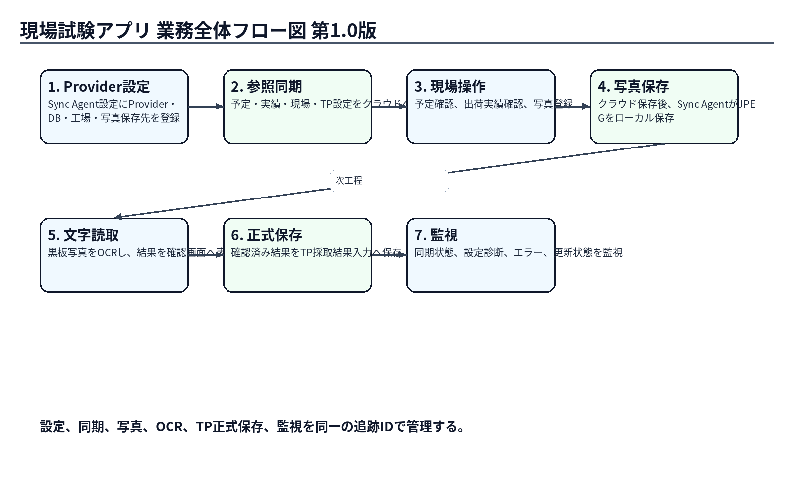

# Labonity用現場試験アプリ 要件定義書

> 業務目的・利用者・対象範囲・受入条件の合意用

| **項目** | **内容**                                                                  |
|----------|---------------------------------------------------------------------------|
| 版       | v2.2                                                                      |
| 状態     | 完成版                                                                    |
| 対象     | 現場試験Webアプリ、現場試験アプリ用クラウド環境、Sync Agent、既存Labonity |
| 目的     | 業務・システムの方針を共有し、実装前の判断事項を明確にする。              |

## 目次

- 1. 目的と背景

- 2. 期待効果とKPI候補

- 3. 利用者と関係者

- 4. 全体の仕組み

- 5. 対象範囲・対象外

- 6. 業務フロー

- 7. 機能要件

- 8. 業務ルール

- 9. 非機能要件

- 10. 受入方針

- 11. 段階導入

- 12. 判断事項

- 13. 参照資料

- 15. ローカルDB・設定XML要件

## 1. 目的と背景

<table>
<colgroup>
<col style="width: 100%" />
</colgroup>
<thead>
<tr class="header">
<th>
<strong>実現すること</strong>

<strong>現場で撮影した写真とOCR取込用黒板写真を出荷実績にひもづけ、既存Labonityで原本を確認しながら入力できるようにします。</strong>
</th>
</tr>
</thead>
<tbody>
</tbody>
</table>

| **観点** | **内容**                                                                     |
|----------|------------------------------------------------------------------------------|
| 現状課題 | 写真の保存場所や出荷との対応が分かれやすく、確認・転記・追跡に時間がかかる。 |
| 目標     | 写真証跡を出荷単位に集約し、黒板値の入力を確認付きで支援する。               |
| 前提     | 正式なTP採取結果は既存Labonityで管理し、現場アプリから直接更新しない。       |
| 安全方針 | OCRは候補値を作るだけとし、人の確認なしに確定・保存しない。                  |

## 2. 期待効果とKPI候補

| **期待効果**             | **KPI候補**                           | **確定方法**              |
|--------------------------|---------------------------------------|---------------------------|
| 写真探索・照合作業の削減 | 対象出荷の写真確認に要する時間        | パイロット前後で実測      |
| 転記負荷の削減           | フレッシュ試験値の入力時間、OCR修正率 | 実写真によるPoCと運用計測 |
| 誤紐づけ・誤転記の抑制   | 誤出荷選択、差戻し、修正件数          | 監査ログと業務レビュー    |
| 証跡の追跡性向上         | 写真登録率、同期完了率、原本確認率    | システムログ・利用状況    |

<table>
<colgroup>
<col style="width: 100%" />
</colgroup>
<thead>
<tr class="header">
<th>
<strong>KPIの扱い</strong>

<strong>数値目標はパイロット範囲と現状値を確認したうえで、業務責任者が承認します。</strong>
</th>
</tr>
</thead>
<tbody>
</tbody>
</table>

## 3. 利用者と関係者

| **区分**                   | **主な役割**                      | **主な関心**                             |
|----------------------------|-----------------------------------|------------------------------------------|
| 現場担当者                 | 予定・出荷確認、写真登録          | 迷わない操作、誤出荷防止、通信断時の継続 |
| 品質管理担当               | OCR候補確認、入力欄反映、通常保存 | 信頼性、原本確認、反映先、監査           |
| 業務・製品責任者           | 目的、KPI、MVP、予算、展開判断    | 効果、範囲、費用、利用定着               |
| 情報システム・セキュリティ | 認証、クラウド、端末、データ審査  | 組織分離、送信先、秘密情報、権限         |
| 運用・インフラ             | Sync Agent、DB、写真共有、監視    | 稼働、容量、復旧、問い合わせ             |
| 開発・QA                   | 実装、既存互換、試験、移行        | 要件トレース、品質、ロールバック         |

## 4. 全体の仕組み

図1 現場試験アプリの全体像

<table>
<colgroup>
<col style="width: 100%" />
</colgroup>
<thead>
<tr class="header">
<th>
<strong>責任分担の要点</strong>

<strong>現場WebとSync Agentがクラウドと通信します。既存Labonityは社内のローカルDB・写真を参照し、従来の保存処理で正式データを登録します。</strong>
</th>
</tr>
</thead>
<tbody>
</tbody>
</table>

## 5. 対象範囲・対象外

| **領域**     | **対象**                                                                            | **対象外**                                                |
|--------------|-------------------------------------------------------------------------------------|-----------------------------------------------------------|
| 現場Web      | ログイン、組織選択、予定・出荷参照、地図起動、通常写真・OCR黒板写真の登録、状態確認 | TP試験値の正式入力、基幹マスター・予定・出荷の編集        |
| クラウド     | 写真保管、メタデータ、OCR、信頼度・画質・警告、同期イベント、監査                   | 既存Labonityの正式保存、通常写真へのOCR                   |
| Sync Agent   | 参照データ同期、写真・OCR結果の取得、JPEG保存、状態・監視                           | 個人ユーザーの代理ログイン、既存Labonity向けのローカルAPI |
| 既存Labonity | 原本と候補値の確認、入力欄反映、通常保存                                            | クラウド認証、クラウドAPI呼出し、OCR実行依頼              |

## 6. 業務フロー

図2 写真登録から正式保存まで

- OCR結果が未到着・失敗の場合も、手入力で既存業務を継続できる。

- 出荷実績がクラウドに未同期の場合は、端末の標準カメラで撮影し、同期後にライブラリから登録する。

## 7. 機能要件

### 認証・利用者

| **ID**  | **要件**                                                                    |
|---------|-----------------------------------------------------------------------------|
| REQ-A01 | 利用者はLiberty Accountでログインし、利用可能な組織・工場だけを選択できる。 |
| REQ-A02 | Sync Agentは人間のアカウントと分離した専用主体として認証する。              |
| REQ-A03 | 組織・工場をまたぐデータ混在を防止する。                                    |

### 予定・出荷参照

| **ID**  | **要件**                                                               |
|---------|------------------------------------------------------------------------|
| REQ-R01 | 対象日の出荷予定と出荷実績を一覧・詳細で確認できる。                   |
| REQ-R02 | 現場住所または座標から外部地図・ナビを起動できる。                     |
| REQ-R03 | クラウドに出荷実績がない状態では、アプリ内で未紐づけ写真を作成しない。 |

### 写真

| **ID**  | **要件**                                                           |
|---------|--------------------------------------------------------------------|
| REQ-P01 | 通常写真をカメラ撮影または端末ライブラリから登録できる。           |
| REQ-P02 | OCR取込用黒板写真をカメラ撮影または端末ライブラリから登録できる。  |
| REQ-P03 | 複数写真、代表写真、表示順、削除状態を出荷実績単位で管理する。     |
| REQ-P04 | OCR黒板写真の差し替え履歴を保持し、現在有効な写真を1枚に制御する。 |

### OCR・入力支援

| **ID**  | **要件**                                                               |
|---------|------------------------------------------------------------------------|
| REQ-O01 | OCR黒板写真の登録後、クラウド側でOCR処理を開始する。                   |
| REQ-O02 | 抽出値だけでなく、項目別信頼度、画質、警告、検証結果を保持する。       |
| REQ-O03 | 既存Labonityで原本写真・OCR候補・現在値を同じ画面で確認できる。        |
| REQ-O04 | TP、行番号、データ区分、出荷実績の一致を確認してから入力欄へ反映する。 |
| REQ-O05 | 高信頼度でも自動確定せず、担当者の確認操作後に入力欄へ反映する。       |
| REQ-O06 | OCR候補、修正内容、反映・保存結果を監査できる。                        |

### 同期・運用

| **ID**  | **要件**                                                                                           |
|---------|----------------------------------------------------------------------------------------------------|
| REQ-S01 | 現場・予定・出荷の参照データを既存環境からクラウドへ同期する。                                     |
| REQ-S02 | 写真参照、OCR結果、写真ファイルをクラウドから社内環境へ同期する。                                  |
| REQ-S03 | 写真を出荷別フォルダへJPEGとして自動保存する。                                                     |
| REQ-S04 | 既存Labonityはクラウドへ直接接続せず、ローカルDBと写真ファイルだけを参照する。                     |
| REQ-S05 | 同期処理は重複に強く、停止後に続きから再開できる。                                                 |
| REQ-S06 | 最終同期、未処理件数、失敗、容量、認証状態を確認できる。                                           |
| REQ-S07 | ローカル連携テーブルは、新しい物理DBではなく、既存出荷管理DB内の FieldTest スキーマに配置する。    |
| REQ-S08 | Sync Agentは既存の p_出荷管理データベース名を使用し、DB設定XMLに新しいDB項目を追加せず接続できる。 |

## 8. 業務ルール

| **ID** | **ルール**                                                                                            |
|--------|-------------------------------------------------------------------------------------------------------|
| BR-01  | 写真とOCR結果は出荷実績にひもづける。クラウドではクラウドID、既存Labonityでは出荷IDを使用する。       |
| BR-02  | 現場・予定・出荷・TP正式データは既存Labonityを正本とし、現場Webから更新しない。                       |
| BR-03  | 写真原本・写真メタデータ・OCR結果はクラウドを正本とし、社内保存は参照・業務利用用の派生データとする。 |
| BR-04  | 通常写真はOCR対象外。OCR取込用黒板写真だけを自動OCR対象とする。                                       |
| BR-05  | 同一出荷実績で現在有効なOCR黒板写真とOCR結果は、用途ごとに各1件とする。                               |
| BR-06  | 入力欄への反映前に、TP・行番号・データ区分・出荷実績の一致を確認する。                                |
| BR-07  | 削除・差し替えは履歴を残し、保持期間に基づいて後から物理削除する。                                    |
| BR-08  | OCRの生値、担当者の確定値、保存結果を区別して監査する。                                               |

## 9. 非機能要件

| **分類**     | **要件**                                                                                 |
|--------------|------------------------------------------------------------------------------------------|
| セキュリティ | 組織・工場・利用主体を検証し、写真URLは短時間の一時URLとする。秘密情報をログに出さない。 |
| 可用性       | OCRや同期が停止しても、既存Labonityの手入力業務を継続できる。                            |
| 性能         | 予定・出荷とOCR結果は通常数分以内で追従することを初期目標とし、パイロットで確定する。    |
| 信頼性       | 再送・重複・順序逆転に耐え、停止後に続きから再開できる。                                 |
| 運用性       | 最終同期、未処理、失敗、容量、認証状態を確認し、再同期・再出力できる。                   |
| 互換性       | 対象となるLabonity版、SQL Server、端末・ブラウザを明確にし、導入前診断を行う。           |
| 監査性       | 写真登録、OCR処理、同期、確認・反映、保存、認証管理の履歴を追跡できる。                  |
| コスト       | 写真容量、OCR件数、転送、保持期間を計測し、費用上限と通知条件を設定できる。              |

## 10. 受入方針

| **シナリオ**          | **主な確認**                              | **完了条件**                                         |
|-----------------------|-------------------------------------------|------------------------------------------------------|
| E2E-01 写真登録       | 通常写真・OCR黒板、出荷ひもづけ、差し替え | クラウドと社内参照で対象出荷・状態が一致する。       |
| E2E-02 OCR入力支援    | 読取、同期、原本確認、修正、反映、保存    | 正しい行へ反映され、既存の通常保存で正式登録できる。 |
| E2E-03 権限           | 人間・Agent、組織・工場、API範囲          | 許可外の組織・工場・APIへアクセスできない。          |
| E2E-04 障害復旧       | 通信、DB、共有フォルダ、認証、再送        | 重複なく再開し、状態と原因を確認できる。             |
| E2E-05 削除・差し替え | 現在有効データ、履歴、ローカル写真        | クラウド・社内DB・ファイル・監査が整合する。         |

## 11. 段階導入

| **段階** | **目的**       | **主な内容**                                                           |
|----------|----------------|------------------------------------------------------------------------|
| Phase 0  | 合意・技術検証 | KPI、対象端末、OCR、認証、ネットワーク、既存版互換の確認               |
| Phase 1  | 写真基盤       | 予定・出荷参照、写真登録、クラウド保管、Sync Agent、JPEG保存、最小監視 |
| Phase 2  | OCR入力支援    | OCR処理、結果同期、原本並列確認、安全反映、監査                        |
| Phase 3  | 運用強化・展開 | 管理画面、再同期、分析、複数工場、教育、サポート                       |

## 12. 判断事項

| **ID** | **論点**            | **確認内容**                                                        | **責任者候補** |
|--------|---------------------|---------------------------------------------------------------------|----------------|
| D-01   | 業務目的・KPI       | 写真探索時間、転記時間、誤紐づけ、OCR修正率の現状値と目標を決める。 | 業務責任者     |
| D-02   | MVP・パイロット範囲 | 対象工場、利用者、期間、写真件数、対象業務を決める。                | 製品責任者     |
| D-03   | OCRサービス         | 送信先、契約、学習利用、保存、費用上限を決める。                    | 情シス・法務   |
| D-04   | 保持・削除          | 写真、OCR生データ、監査、ローカルJPEGの保持期間を決める。           | 業務・法務     |
| D-05   | 運用責任            | 監視、容量、認証情報、障害一次対応、問い合わせ窓口を決める。        | 運用責任者     |
| D-06   | 対象端末            | 対応OS・ブラウザ・PWA・カメラ権限・MDM条件を決める。                | 現場・情シス   |
| D-07   | Agent認証           | 専用認証、権限範囲、失効・再発行の正式仕様を確認する。              | 認証基盤担当   |
| D-08   | 受入基準            | 同期遅延、アップロード成功率、OCR修正率、性能の合格値を決める。     | 業務・QA       |

## 参照資料

| **資料**                                        | **主な利用箇所**                                |
|-------------------------------------------------|-------------------------------------------------|
| Labonity用現場試験アプリ 統合設計仕様書 第2.2版 | 全体方針、機能、認証・同期、写真・OCR、受入条件 |
| 予定データ仕様                                  | 出荷予定の主キー、日付、工場、現場など          |
| 出荷データ仕様                                  | 出荷実績の主キー、時刻、車番、数量、工場など    |
| 現場マスター仕様                                | 現場名、住所、緯度・経度など                    |
| TP採取結果仕様                                  | フレッシュ試験、出荷との関連、正式保存先など    |

## 14. 要件トレーサビリティ

本書の要件IDは、08_要件・受入条件・追跡管理表_第2.2版.xlsx の Requirement_Catalog で管理します。詳細な確認項目は A-01〜A-123 と対応づけ、担当、優先度、状態、証跡を記録します。

| **要件領域**         | **主な詳細仕様分冊** | **主な受入領域**                                     |
|----------------------|----------------------|------------------------------------------------------|
| 認証・組織・権限     | 第1・第5分冊         | A-01〜A-09、A-81〜A-94、A-107〜A-108                 |
| 予定・出荷・写真登録 | 第1・第2・第3分冊    | A-10〜A-30、A-47〜A-53、A-97〜A-98、A-115〜A-117     |
| 写真ローカル保存     | 第2・第5分冊         | A-54〜A-80、A-109                                    |
| OCR・Labonity反映    | 第3分冊              | A-31〜A-46、A-99〜A-102、A-110〜A-111、A-118〜A-120  |
| 運用・監視・DDL      | 第4・第5分冊         | A-95〜A-96、A-103〜A-106、A-112〜A-114、A-121〜A-123 |

## 15. ローカルDB・設定XML要件

| ID      | 要件                                                                                           |
|---------|------------------------------------------------------------------------------------------------|
| REQ-D01 | 既存の出荷管理DB名は LibertyDatabaseSetting.xml の p_出荷管理データベース名から取得する。      |
| REQ-D02 | ローカル連携12テーブルは同一DB内の FieldTest スキーマに作成し、既存 dbo テーブルは変更しない。 |
| REQ-D03 | DB設定XMLに新しいDB名項目を追加せず、スキーマ名は Sync Agent 設定で明示する。                  |
| REQ-D04 | 起動時にDB、スキーマ、必要テーブル、サービスアカウント権限を検証し、不備時は同期を開始しない。 |
