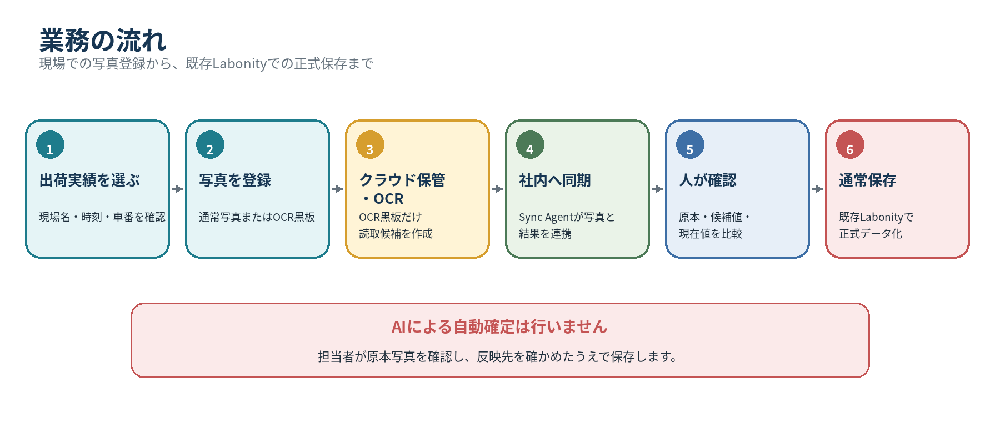
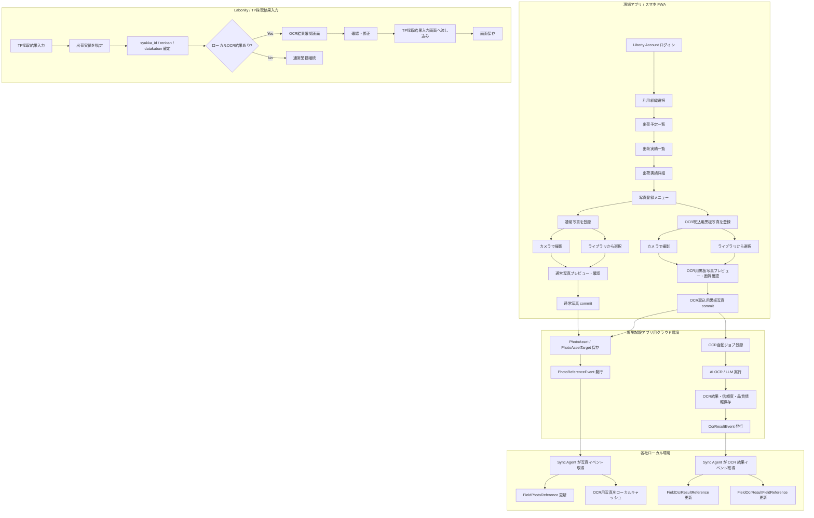
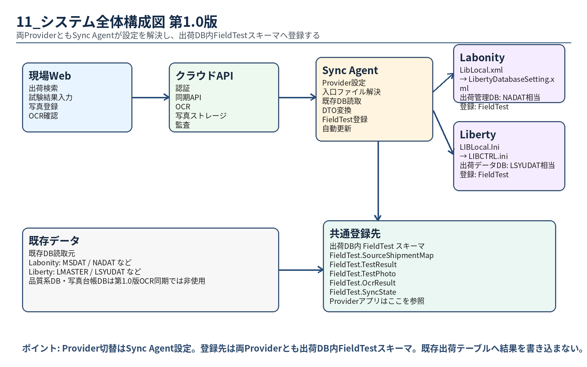
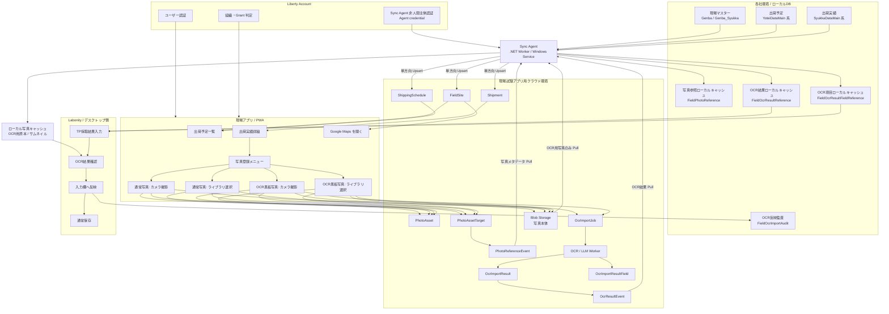
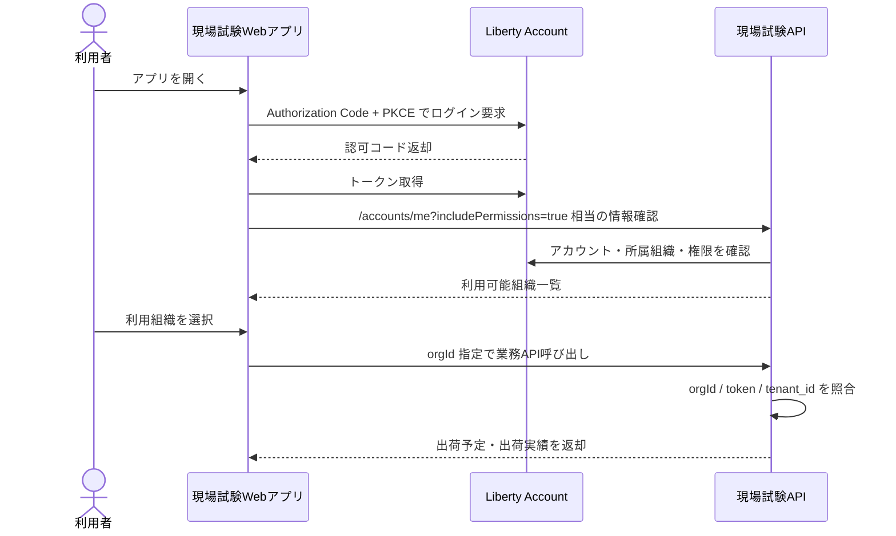
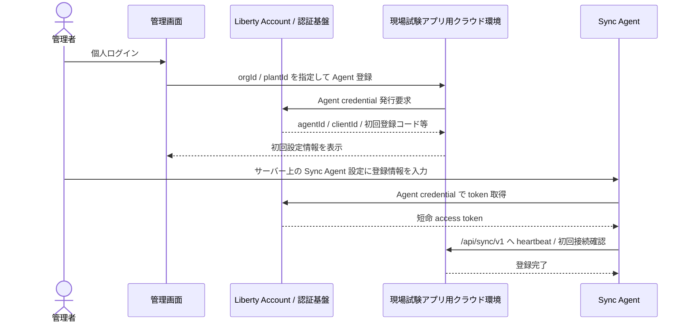

# 現場試験アプリ 詳細仕様書 第1分冊

**基本方針・全体構成・認証・同期・出荷実績未同期時の扱い**

| **項目** | **内容**                                                                                                      |
|----------|---------------------------------------------------------------------------------------------------------------|
| 版       | v2.2                                                                                                          |
| 状態     | 完成版                                                                                                        |
| 作成日   | 2026-06-22                                                                                                    |
| 収録章   | 0〜5章                                                                                                        |
| 収録内容 | 0\. 設計概要1. 基本方針2. 全体構成3. 認証・認可・マルチテナント設計4. データ同期設計5. 出荷実績未同期時の扱い |
| 読者     | 開発、QA、セキュリティ、運用、DB担当                                                                          |

> 本分冊は、提供された設計仕様の該当範囲を、省略せず収録しています。表、コード、JSON、SQL、受入条件、Mermaid定義を含みます。

# Labonity 用現場試験アプリ 統合設計仕様書 第2.2版（完成版）

**出荷実績写真保存・ローカル写真自動保存・写真保存フォルダ指定・出荷別JPEGエクスポート・OCR取込用黒板写真登録・事前OCR・Sync Agent サーバー配置・LibLocal.xml 起点DB接続・Sync Agent 非人間主体認証・Agent credential・Google Maps 連携・Liberty Account 認証・TP採取結果入力へのOCR結果反映方式・NaDat ローカル連携テーブル・OCR反映先安全検証・OCR結果信憑性表示・読取元写真常時並列確認・Sync Agent 監視強化・用途別写真登録・カメラ/ライブラリ選択**

| **項目** | **内容**                                                                                                                                                                                                                                                                                                                                                                                                                                                                                                                                                                                                                                                                                                                                                                                                                                                                                                                                                                                                                                                                                                                                |
|----------|-----------------------------------------------------------------------------------------------------------------------------------------------------------------------------------------------------------------------------------------------------------------------------------------------------------------------------------------------------------------------------------------------------------------------------------------------------------------------------------------------------------------------------------------------------------------------------------------------------------------------------------------------------------------------------------------------------------------------------------------------------------------------------------------------------------------------------------------------------------------------------------------------------------------------------------------------------------------------------------------------------------------------------------------------------------------------------------------------------------------------------------------|
| 文書区分 | 基本設計                                                                                                                                                                                                                                                                                                                                                                                                                                                                                                                                                                                                                                                                                                                                                                                                                                                                                                                                                                                                                                                                                                                                |
| 対象     | 現場試験アプリ / Labonity TP採取結果入力 / Sync Agent / 写真管理クラウド / Liberty Account 連携 / AI OCR・LLM 取込                                                                                                                                                                                                                                                                                                                                                                                                                                                                                                                                                                                                                                                                                                                                                                                                                                                                                                                                                                                                                      |
| 版       | v2.0                                                                                                                                                                                                                                                                                                                                                                                                                                                                                                                                                                                                                                                                                                                                                                                                                                                                                                                                                                                                                                                                                                                                    |
| 作成日   | 2026-06-15                                                                                                                                                                                                                                                                                                                                                                                                                                                                                                                                                                                                                                                                                                                                                                                                                                                                                                                                                                                                                                                                                                                              |
| 目的     | 現場アプリで出荷実績に紐づく写真を保存し、OCR取込用黒板写真として登録された写真をクラウド側で事前 OCR する。Sync Agent は OCR 結果・写真参照情報に加え、写真本体を設定で指定したローカルまたは共有フォルダへ出荷別に JPEG として自動保存する。Sync Agent は Labonity クライアントサーバー構成では原則 Labonity サーバーにインストールし、Labonity の Settings\LibLocal.xml を起点にサーバーフォルダと DB 接続情報を自動解決する。認証は、現場試験 Web アプリの個人認証と Sync Agent の非人間主体認証を分離し、Sync Agent は個人アカウントや refresh token ではなく、orgId + plantId + agentId に紐づく Agent credential で同期 API のみを利用する。ローカル連携テーブルは出荷管理 DB である NaDat に配置する。Labonity の TP採取結果入力画面では、クラウド API、Sync Agent ローカル API、HTTP、Named Pipe 等を使わず、NaDat 上の OCR 結果、NaDat 上の写真参照、ローカルファイル上の写真を参照して確認・修正し、読取元写真と AI OCR 結果を常時並列表示して人間が確認したうえで、フレッシュ試験値入力欄へ流し込めるようにする。                                                                                                           |
| 前提     | 現場アプリではフレッシュ試験値の入力、電子黒板合成、黒板レイアウト編集、TP採取結果の正式登録は行わない。Labonity デスクトップアプリはクラウド認証を行わず、クラウド API も Sync Agent のローカル API も呼び出さない。HTTP、localhost API、Named Pipe、gRPC、TCP ソケット等の IPC も使用しない。Labonity デスクトップアプリは、Sync Agent が同期・自動保存したローカルDBおよびローカル写真ファイルだけを参照する。Sync Agent は本番運用では Labonity サーバーに配置し、DB接続情報は Sync Agent 独自に二重入力せず、設定で指定された Settings\LibLocal.xml から Labonity と同じ設定を解決する。既存のDB設定XMLには新しいDB項目を追加しない。写真保存先は DB 接続設定とは別に、Sync Agent の設定で指定できるようにする。ローカル連携テーブルは既存の出荷管理DB内の FieldTest スキーマに配置し、TP 採取結果本体は既存どおり ExDat を正とする。Sync Agent は個人ユーザーのアクセストークン、refresh token、パスワード、MFA セッションを保持しない。Sync Agent は組織そのものではなく、組織・工場に紐づいて登録された非人間主体の agentId と Agent credential で認証する。AI OCR 結果は、人間確認を経ずに Labonity の入力欄へ自動反映しない。 |

## 目次

- 0.  設計概要
- 1.  基本方針
- 2.  全体構成
- 3.  認証・認可・マルチテナント設計
- 4.  データ同期設計
- 5.  出荷実績未同期時の扱い
- 6.  写真保存設計
- 7.  写真メタデータのローカル参照設計
- 8.  写真・OCRイベント設計
- 9.  Google Maps 現場住所連携
- 10. TP採取結果入力からの OCR 結果取込フロー
- 11. AI OCR / LLM 事前取込設計
- 12. API 設計
- 13. 画面仕様 / 現場アプリ
- 14. 画面仕様 / Labonity 側
- 15. セキュリティ・監査
- 16. オフライン・エラー処理
- 17. 受入条件
- 18. 実装メモ
- 19. ローカル写真自動保存・出荷別JPEGエクスポート詳細設計
- 20. Sync Agent サーバー配置・LibLocal.xml 起点DB接続・写真保存パス指定詳細設計
- 21. Sync Agent 非人間主体認証・Agent credential 詳細設計
- 22. 出荷管理DB FieldTestスキーマ追加テーブル DDL 方針

## 0. 設計概要

### 0.1 システム責務

本システムは、出荷実績を中心に、現場写真、OCR取込用黒板写真、事前 OCR 結果、TP採取結果入力画面を連携させる。

| **領域**                                      | **管理主体**                                | **内容**                                                                                                                                                                    |
|-----------------------------------------------|---------------------------------------------|-----------------------------------------------------------------------------------------------------------------------------------------------------------------------------|
| 現場・出荷予定・出荷実績の参照データ          | Labonity ローカルDB / Sync Agent / クラウド | 現場アプリ表示用にクラウドへ同期する。                                                                                                                                      |
| 写真本体                                      | クラウド Blob Storage                       | 現場アプリからアップロードする。Base64 でDB保存しない。                                                                                                                     |
| 写真メタデータ                                | クラウド DB                                 | 写真、サムネイル、対象出荷、代表写真、OCR取込用黒板写真、削除状態を管理する。                                                                                               |
| OCR実行                                       | クラウド OCR / LLM Worker                   | OCR取込用黒板写真の commit 後に自動実行する。Labonity デスクトップから実行依頼しない。                                                                                      |
| OCR結果・品質情報                             | クラウド DB                                 | 抽出値、項目別信頼度、画像品質、警告、検証結果、モデル情報、プロンプト情報、処理時間、失敗理由を保存する。                                                                  |
| 写真参照メタデータ                            | ローカル連携キャッシュ                      | Sync Agent がクラウドから取得し、Labonity 側で出荷実績から写真有無を確認するために使用する。                                                                                |
| OCR結果参照データ                             | ローカル連携キャッシュ                      | Sync Agent がクラウドから取得し、Labonity 側で syukka_id から OCR 結果を確認・反映するために使用する。                                                                      |
| ローカル写真キャッシュ                        | Sync Agent / ローカルファイル領域           | OCR結果確認画面で読取元画像を表示するため、OCR取込用黒板写真とサムネイルをローカル保存する。                                                                                |
| ローカル写真自動保存 / 出荷別JPEGエクスポート | Sync Agent / ローカル指定フォルダ           | 現場アプリで撮影・commit 済みの写真を、通常写真も含めてローカルの指定フォルダへ出荷別に JPEG 保存する。Labonity はこのファイルを通常のローカルファイルとして参照する。      |
| TP採取結果データ                              | Labonity TP採取結果入力                     | TP採取結果、フレッシュ試験値、縦割り、データ区分、保存状態を扱う。                                                                                                          |
| 認証・認可                                    | Liberty Account                             | 現場試験 Web アプリは個人認証で利用者・組織・権限を判定する。Sync Agent は個人ではなく Agent credential により orgId + plantId + agentId の非人間主体として認証・認可する。 |

### 0.2 基本ルール

本設計での基本ルールは次の通りである。

```text
写真はクラウド上では Shipment.shipment_id に紐づける。
Labonity 側では syukka_id をキーにローカル参照テーブルを検索する。
`capture_purpose = fresh_test_ocr_blackboard` として保存された写真だけを自動 OCR 対象にする。
OCR結果は syukka_id に紐づく事前 OCR 結果としてクラウドDBとローカル参照DBに保存する。
OCR結果には抽出値だけでなく、項目別信頼度、画像品質、警告、検証結果、モデル情報を保存する。
Labonity デスクトップアプリはクラウド認証を行わず、クラウドAPIを直接呼び出さない。
Labonity デスクトップアプリは Sync Agent に OCR 実行依頼を行わない。
Labonity デスクトップアプリは Sync Agent のローカル HTTP API、Named Pipe、gRPC、TCP ソケット等を呼び出さない。
Sync Agent は写真をローカル指定フォルダへ出荷別に JPEG 保存し、ローカルDBにそのパスと状態を保存する。
Sync Agent は本番運用では Labonity サーバーにインストールし、クライアント PC ごとのインストールは行わない。
Sync Agent は Labonity の Settings\LibLocal.xml を起点に DB 接続情報を解決し、DB 接続情報を二重管理しない。
Sync Agent は個人アカウントではなく、orgId + plantId + agentId に紐づく Agent credential で認証する。
Sync Agent は個人の refresh token、パスワード、MFA セッションを保持しない。
Sync Agent credential では同期 API のみを利用し、現場アプリ API や Labonity デスクトップ向け API は利用しない。
写真出力先は Sync Agent 設定で指定し、複数クライアント運用時は Labonity が参照可能な UNC 共有パスを保存する。
Labonity 側では syukka_id をキーにローカル写真ファイルパスを検索し、ファイルシステムから画像を開く。
Labonity 側では、ローカルDBの OCR 結果を確認・修正して、現在行の renban + datakubun の入力欄へ流し込む。
TP採取結果の正式保存は Labonity の通常保存処理で行う。
```

### 0.3 Labonity 仕様との対応

| **仕様領域**    | **設計への反映**                                                                                                                                                                                      |
|-----------------|-------------------------------------------------------------------------------------------------------------------------------------------------------------------------------------------------------|
| 出荷予定        | YoteiDataMain は yotei_id を主キーとし、予定日は syukka_yoteibi、予定 No は yotei_no、工場は kozyo_id を持つ。クラウド側では tenant_id + plant_id + source_local_id を同期キーにする。                |
| 出荷実績        | SyukkaDataMain は syukka_id を主キーとし、yotei_id、seq_no、syukka_nengappi、syukka_zikoku、syaban、syukkaryo、seizoryo、kozyo_id を持つ。写真と事前 OCR 結果はこの出荷実績を対象に登録する。         |
| 現場            | Genba は現場名・住所、Genba_Syukka は出荷用現場名・緯度・経度を持つ。地図連携では住所と緯度経度を組み合わせて使用する。                                                                               |
| TP採取結果      | TestPieceSaisyu_FreshSiken は testpiecesaisyu_main_id + renban + datakubun でフレッシュ試験行が決まる。OCR結果の反映先は Labonity 画面が保持する現在行の renban と現在表示中の datakubun で特定する。 |
| TP と出荷の関係 | TestPieceSaisyu_SyukkaData は testpiecesaisyu_main_id + renban + syukka_id の関係を持つ。縦割り時も renban ごとに対象の出荷実績が決まる。                                                             |

### 0.4 ID・DB 配置ルール

本設計では、ID 型とローカル連携テーブルの配置を次の通り固定する。以後の表や SQL 例では、本節を正とする。

#### 0.4.1 ID 型

| **論理 ID**             | **API 表現** | **SQL Server 型** | **正本**                                             | **備考**                                         |
|-------------------------|--------------|-------------------|------------------------------------------------------|--------------------------------------------------|
| tenant_id               | string       | nvarchar(64)      | Liberty Account orgId                                | ORG-001 や UUID 文字列をそのまま保存できる。     |
| plant_id                | string       | uniqueidentifier  | Labonity kozyo_id                                    | API では canonical GUID 文字列として送受信する。 |
| yotei_id                | string       | uniqueidentifier  | \[NaDat\].\[dbo\].\[YoteiDataMain\].\[yotei_id\]     | 出荷予定の source local ID。                     |
| syukka_id               | string       | uniqueidentifier  | \[NaDat\].\[dbo\].\[SyukkaDataMain\].\[syukka_id\]   | 写真・OCR の Labonity 側検索キー。               |
| genba_id                | string       | uniqueidentifier  | MsDat.dbo.Genba.id / MsDat.dbo.Genba_Syukka.genba_id | 現場の source local ID。                         |
| testpiecesaisyu_main_id | string       | uniqueidentifier  | ExDat.dbo.TestPieceSaisyu_Main.id                    | TP 採取結果の主 ID。                             |
| photo_asset_id          | string       | uniqueidentifier  | クラウド PhotoAsset.photo_asset_id                   | ローカルにも uniqueidentifier として保存する。   |
| ocr_import_result_id    | string       | uniqueidentifier  | クラウド OcrImportResult.ocr_import_result_id        | ローカルにも uniqueidentifier として保存する。   |

#### 0.4.2 ローカル DB 配置

| **DB**                         | **既存・追加** | **主な用途**                                                         |
|--------------------------------|----------------|----------------------------------------------------------------------|
| NaDat                          | 既存           | 出荷予定、出荷実績、出荷関連データの正本。                           |
| 出荷管理DB / dbo（既存）       | 既存           | 出荷予定・出荷実績など既存テーブルを配置する。既存構造は変更しない。 |
| MsDat                          | 既存           | 現場マスター、現場出荷、現場住所・緯度経度の正本。                   |
| ExDat                          | 既存           | TP 採取結果入力、フレッシュ試験、TP と出荷の関係の正本。             |
| LibertySettings                | 既存           | DB 接続設定、アプリ設定。                                            |
| 出荷管理DB / FieldTest（追加） | 追加スキーマ   | 写真参照、OCR参照、監査、同期管理などの連携12テーブルを配置する。    |

ローカル連携テーブルを NaDat に置く理由は、写真・OCR の分類正本が syukka_id であり、SyukkaDataMain と同じ DB に置くことで、出荷実績単位の参照、再同期、保守、バックアップが分かりやすくなるためである。

#### 0.4.3 Cross DB 参照ルール

Labonity TP採取結果入力画面は、次の順序で参照する。

```text
1. ExDat の画面コンテキストで testpiecesaisyu_main_id + renban + datakubun を確定する。
2. 出荷指定済みの syukka_id を画面コンテキストまたは [ExDat].[dbo].[TestPieceSaisyu_SyukkaData] から取得する。
3. [NaDat].[FieldTest].[FieldOcrResultReference] / FieldOcrResultFieldReference を syukka_id で検索する。
4. [NaDat].[FieldTest].[FieldPhotoReference] / FieldPhotoLocalFile を syukka_id で検索する。
5. ユーザー確認後、値は ExDat の FreshSiken 画面入力欄へ反映する。
6. DB 保存は既存 Labonity の通常保存で行う。
```

同一 SQL Server 上で cross database query が利用できる場合は、\[出荷管理DB\].\[FieldTest\] と \[ExDat\].\[dbo\] を完全修飾して参照してよい。権限・構成上 cross database query を避ける場合は、アプリ側で ExDat 参照と NaDat 参照を 2 段階に分ける。

## 1. 基本方針

### 1.1 現場アプリの役割

現場アプリの役割は、**その日の出荷予定・出荷実績を確認し、対象出荷に写真を登録すること**である。

現場アプリで行うことは次の範囲に限定する。

- Liberty Account によるログイン
- 利用組織の選択
- 出荷予定一覧の確認
- 出荷実績一覧の確認
- 出荷実績詳細の確認
- 現場住所から Google Maps を開く
- 出荷実績に紐づく通常写真の追加
- 出荷実績に紐づく OCR取込用黒板写真の追加
- 通常写真のカメラ撮影
- 通常写真の端末ライブラリ選択
- OCR取込用黒板写真のカメラ撮影
- OCR取込用黒板写真の端末ライブラリ選択
- OCR取込用黒板写真の再登録・差し替え
- 写真のプレビュー確認
- 画質警告の確認
- 写真の保存・同期
- 写真一覧・写真詳細の確認
- 代表写真の確認・変更
- OCR取込用黒板写真の登録状態・OCR処理状態の確認

現場アプリで行わないことは次の通りである。

- フレッシュ試験値の入力
- TP採取結果入力の代替
- TP採取データの正式作成
- 供試体セット・ピースの作成
- 電子黒板合成写真の作成
- 黒板レイアウトの編集
- OCR結果の手修正
- OCR結果の Labonity DB への保存
- 出荷予定・出荷実績・現場マスターの編集
- 写真台帳・帳票出力
- Labonity ローカルDBへの直接書き込み

### 1.2 写真の扱い

写真は、**出荷実績に紐づく写真**として扱う。

写真登録は、次の 2 軸で決める。

| **軸**   | **値**            | **意味**                                                           |
|----------|-------------------|--------------------------------------------------------------------|
| 写真用途 | 通常写真          | 現場状況、測定状況、補足写真など。OCR対象外。                      |
| 写真用途 | OCR取込用黒板写真 | Labonity のフレッシュ試験値取込に使う黒板写真。保存後に OCR 対象。 |
| 取込方法 | カメラ撮影        | その場で端末カメラを起動して撮影する。                             |
| 取込方法 | ライブラリ選択    | スマホ標準カメラ等で撮影済みの写真を端末内から選択する。           |

画面上は、出荷実績詳細から **\[写真を登録\]** を開き、用途と取込方法を明示的に選択する。

```text
[写真を登録]
  通常写真
    - カメラで撮影
    - ライブラリから選択

  OCR取込用黒板写真
    - カメラで撮影
    - ライブラリから選択
```

カメラ撮影かライブラリ選択かは source_type の違いである。OCR対象になるかどうかは、撮影方法ではなく capture_purpose で決まる。

| **登録操作**                          | **source_type** | **capture_purpose**       | **OCR 対象** |
|---------------------------------------|-----------------|---------------------------|--------------|
| 通常写真をカメラで撮影                | camera          | general                   | 対象外       |
| 通常写真をライブラリから選択          | library         | general                   | 対象外       |
| OCR取込用黒板写真をカメラで撮影       | camera          | fresh_test_ocr_blackboard | 対象         |
| OCR取込用黒板写真をライブラリから選択 | library         | fresh_test_ocr_blackboard | 対象         |

通常写真については任意分類を行わない。

- 画面上で「黒板」「その他」などの任意分類を選ばせない。
- DB の必須項目として一般的な photo_category を持たせない。
- 写真種別による絞込は行わない。

OCR取込用黒板写真については、任意分類ではなく **業務用途フラグ**として扱う。

| **項目**          | **内容**                                                                   |
|-------------------|----------------------------------------------------------------------------|
| 通常写真          | capture_purpose = general。OCR対象にしない。                               |
| OCR取込用黒板写真 | capture_purpose = fresh_test_ocr_blackboard。保存後に自動 OCR 対象にする。 |

### 1.3 OCR取込用黒板写真の扱い

OCR取込を使いたい場合、現場担当者は対象の出荷実績に対して **1 枚の OCR取込用黒板写真**を登録する。登録方法は、カメラ撮影でも端末ライブラリ選択でもよい。

| **項目** | **方針**                                                                                                                                                      |
|----------|---------------------------------------------------------------------------------------------------------------------------------------------------------------|
| 登録単位 | 出荷実績 1 件につき、OCR取込用黒板写真 1 枚を基本とする。                                                                                                     |
| 登録方法 | カメラ撮影、または端末ライブラリからの選択。                                                                                                                  |
| 自動OCR  | capture_purpose = fresh_test_ocr_blackboard の写真 commit 後、クラウド側で自動 OCR する。                                                                     |
| 通常写真 | 通常写真は自動 OCR しない。                                                                                                                                   |
| 差し替え | 既存の OCR取込用黒板写真がある状態で新しい OCR取込用黒板写真を登録した場合、新しい写真を現在有効な OCR取込用黒板写真とし、古い OCR 結果は superseded にする。 |
| 忘れ防止 | 出荷予定一覧・出荷実績一覧・詳細に「OCR未登録 / OCR予約済 / OCR読取中 / OCR済 / 要確認 / 失敗」を表示する。通常写真は「OCR対象外」として区別する。            |
| 費用抑制 | capture_purpose = fresh_test_ocr_blackboard の写真だけを OCR 実行対象にする。                                                                                 |
| 品質確保 | 登録直後にプレビュー、ぼけ・暗さ・傾き警告を表示する。                                                                                                        |

OCR取込用黒板写真が未登録でも、Labonity の通常入力業務は継続できる。この場合、TP採取結果入力画面では OCR 取込を行わず、手入力する。

### 1.4 代表写真の扱い

代表写真は、一覧・詳細画面で最初に表示するための補助情報である。OCR 対象を固定するための項目ではない。

- 1 枚目の通常写真を自動で代表にする。
- すでに代表写真がある場合、追加写真は代表にしない。
- ユーザーは写真詳細または複数写真確認画面から代表写真を変更できる。
- 同一出荷実績に対して代表写真は 1 件のみとする。
- 代表写真が削除された場合、残り写真のうち表示順が最も小さい写真を代表にする。
- OCR取込用黒板写真を代表写真にしてもよいが、代表写真であることと OCR 取込用であることは別の属性として扱う。

### 1.5 Labonity 側の役割

Labonity 側では、TP採取結果入力画面から対象 TP を作成または表示し、対象の出荷実績を指定する。

指定した出荷実績に同期済みの OCR 結果がある場合、Labonity 側はローカルDBから OCR 結果を読み取り、OCR結果確認画面を表示する。ユーザーは OCR 値、項目別信頼度、警告、現在値との差分、読取元写真を確認し、必要に応じて修正したうえで TP採取結果入力画面の入力欄へ反映する。

Labonity 側では次を行わない。

- クラウド認証
- クラウド API 呼び出し
- Sync Agent への OCR 実行依頼
- OCR エンジンの実行
- 写真選択による OCR 実行
- OCR API による Labonity DB への直接保存

Labonity 側が行うことは次の通りである。

- syukka_id に対応するローカル OCR 結果を検索する。
- OCR結果確認画面を表示する。
- OCR値、信頼度、警告、現在値との差分を表示する。
- ユーザーが確定した値を、現在行の renban + datakubun の入力欄へ反映する。
- 反映後、保存前であることを明示する。
- ユーザーの通常保存操作で Labonity DB に保存する。
- OCR 反映監査をローカルに記録する。

### 1.6 Labonity 連携境界

Labonity 側の業務データとクラウド側の写真・OCRデータは、次の境界で連携する。

| **項目**              | **内容**                                                                                                                    |
|-----------------------|-----------------------------------------------------------------------------------------------------------------------------|
| Labonity 側の保存責務 | TP採取結果、フレッシュ試験値、供試体セット、ピース、出荷紐づけの正式保存を扱う。                                            |
| クラウド側の保存責務  | 現場アプリ表示用の参照データ、写真本体、写真メタデータ、OCRジョブ、OCR結果、OCR品質情報、抽出JSONを扱う。                   |
| Sync Agent の責務     | ローカルDBからクラウドへの基幹参照データ同期、クラウドからローカルへの写真参照・OCR結果・ローカル写真キャッシュ同期を行う。 |
| Labonity 側の参照     | FieldOcrResultReference / FieldOcrResultFieldReference / FieldPhotoReference / ローカル写真キャッシュを参照する。           |
| 画面反映              | ユーザー確認済みの OCR 値は Labonity 画面の入力欄へ反映する。                                                               |
| 保存タイミング        | ユーザーが TP採取結果入力画面の保存操作を行った時点で Labonity DB に保存される。                                            |
| 反映先行              | renban と datakubun は Labonity 画面の現在コンテキストとして扱う。OCR結果側では固定しない。                                 |

### 1.7 Sync Agent の役割

Sync Agent は、各社ローカルDBからクラウドへ現場アプリに必要な参照データを同期し、クラウドからローカルへ写真参照情報・OCR結果・OCR取込用黒板写真を同期するサービスである。

- 現場関連データは、ローカルDBからクラウドへ同期する。
- 出荷予定関連データは、ローカルDBからクラウドへ同期する。
- 出荷実績関連データは、ローカルDBからクラウドへ同期する。
- 現場アプリから基幹データへ書き戻しは行わない。
- 写真本体はクラウド Blob Storage に保存する。
- 写真メタデータは、Labonity 側が参照できるよう、ローカル参照用テーブルへ同期する。
- OCR結果は、Labonity 側が参照できるよう、ローカル OCR 参照用テーブルへ同期する。
- OCR取込用黒板写真およびサムネイルは、Labonity 側の確認画面で表示できるよう、ローカルファイルキャッシュへ保存する。
- 通常写真を含む commit 済み写真は、設定されたローカル写真出力ルートへ出荷別フォルダ構成で JPEG 保存する。
- ローカル写真ファイルの生成状態、出力パス、ハッシュ、ファイルサイズ、エラーをローカルDBへ保存する。
- Sync Agent は Labonity デスクトップアプリ向けの HTTP / Named Pipe / IPC サーバーを持たない。
- Sync Agent は OCR 実行依頼を Labonity から受け付けない。OCR はクラウド側で事前実行された結果を同期する。

## 2. 全体構成

### 2.1 全体業務フロー





### 2.2 Sync Agent を含む構成





### 2.3 TP採取結果入力との連携

TP採取結果入力画面との連携は、出荷実績と画面コンテキストで行う。

| **領域**         | **クラウド**                                                                               | **ローカル / Labonity**                                                            |
|------------------|--------------------------------------------------------------------------------------------|------------------------------------------------------------------------------------|
| 出荷実績         | Shipment.shipment_id と source_local_id = syukka_id を保持する。                           | SyukkaDataMain.syukka_id を持つ。                                                  |
| 写真             | PhotoAsset / PhotoAssetTarget で管理する。OCR取込用黒板写真は capture_purpose で識別する。 | FieldPhotoReference で写真有無・ローカルキャッシュ状態を参照する。                 |
| OCR結果          | OcrImportJob / OcrImportResult / OcrImportResultField で管理する。                         | FieldOcrResultReference / FieldOcrResultFieldReference で syukka_id から参照する。 |
| フレッシュ試験行 | 永続キーとしては扱わない。                                                                 | testpiecesaisyu_main_id + renban + datakubun で保存する。                          |
| OCR 反映先       | OCR 結果は syukka_id に紐づく。renban と datakubun は持たせない。                          | 現在行の renban と現在表示中の datakubun に反映する。                              |
| DB 保存          | OCR結果はクラウドDBとローカル参照DBに保存するが、Labonity の TP DB へは直接保存しない。    | TP採取結果入力画面の保存操作で保存する。                                           |

## 3. 認証・認可・マルチテナント設計

### 3.1 基本方針

現場試験 Web アプリ、クラウド API、Sync Agent は Liberty Account の仕組みを使用して認証・認可を行う。ただし、**人間の利用者**と**サーバー常駐の Sync Agent**は認証主体を分ける。

Labonity デスクトップアプリは Liberty Account によるクラウド認証を行わない。Labonity デスクトップアプリは、Sync Agent がローカルへ同期済みのデータと、Sync Agent がローカル指定フォルダへ自動保存した写真ファイルを参照する。

| **項目**              | **方針**                                                                                                                                                                   |
|-----------------------|----------------------------------------------------------------------------------------------------------------------------------------------------------------------------|
| 認証基盤              | Liberty Account。                                                                                                                                                          |
| 現場試験 Web アプリ   | OAuth2 Authorization Code + PKCE を使用する。個人の accountId を認証主体とする。                                                                                           |
| Sync Agent            | 個人ではなく、orgId + plantId + agentId に紐づく非人間主体として認証する。設計上の credential 名は Agent credential とする。                                               |
| Sync Agent token      | Agent credential で短命 access token を取得する。個人 refresh token は使用しない。                                                                                         |
| Labonity デスクトップ | クラウド認証しない。クラウドAPIを呼び出さない。Sync Agent への OCR 実行依頼もしない。                                                                                      |
| テナント ID           | Liberty Account の orgId を本システムの tenant_id として扱う。                                                                                                             |
| 利用可否              | Web アプリは serviceCode = LABONITY_FIELD_TEST の Grant とサービスメンバー状態で判定する。Sync Agent は org / plant に対して登録済みの active agent であることを判定する。 |
| API 境界              | /api/core/v1/orgs/{orgId}/...、/api/sync/v1/orgs/{orgId}/... のように orgId を URL に含める。                                                                              |
| データ分離            | URL の orgId、トークンの orgId、DB の tenant_id が一致する場合だけアクセスを許可する。                                                                                     |

### 3.1.1 人間認証と Agent 認証の分離

本設計では、認証主体を次のように分ける。

| **種別**              | **認証主体** | **主な用途**                                                                                               | **監査主体**                                          |
|-----------------------|--------------|------------------------------------------------------------------------------------------------------------|-------------------------------------------------------|
| 人間                  | accountId    | 現場試験 Web アプリのログイン、予定・出荷・写真・OCR状態の閲覧、写真撮影、管理操作。                       | actor_type = user, account_id                         |
| Sync Agent            | agentId      | Labonity サーバー常駐サービスによる参照データ同期、写真・OCRイベント取得、ACK、写真ダウンロード URL 取得。 | actor_type = agent, agent_id                          |
| Labonity デスクトップ | なし         | ローカルDBとローカル写真ファイル参照のみ。クラウド認証しない。                                             | Labonity 側の既存ローカルユーザーまたはローカル監査。 |

「組織としての認証」という表現は使用しない。組織はログイン主体ではなく、Agent credential の認可スコープである。Sync Agent の主体はあくまで agentId とし、その agent に orgId、plantId、許可 scope を紐づける。

```text
人間利用者
  -> accountId で認証
  -> orgId / Grant / Role / permission で認可

Sync Agent
  -> agentId で認証
  -> orgId / plantId / scope で認可
```

### 3.2 現場試験 Web アプリのログイン

ログインフローは次の通りである。



ログイン後、アプリは次を行う。

1.  呼び出し元アカウントの accountId、メール、表示名を取得する。
2.  includePermissions=true により、所属組織ごとの権限を取得する。
3.  LABONITY_FIELD_TEST の Grant が利用可能な組織だけを候補にする。
4.  複数組織に所属する場合は、利用組織選択画面を表示する。
5.  選択した orgId をアプリの現在テナントとして保持する。

### 3.3 組織選択

複数組織に所属するユーザーは、ログイン後に利用組織を選択する。

```text
+----------------------------------+
| 利用組織を選択                   |
|----------------------------------|
| ログインユーザー: yamada@example |
|                                  |
| [ ABC生コン株式会社 ]            |
|   現場試験アプリ 利用可          |
|                                  |
| [ XYZ工業株式会社 ]              |
|   現場試験アプリ 利用可          |
|                                  |
+----------------------------------+
```

選択後は、全 API 呼び出しに orgId を含める。

```http
GET /api/core/v1/orgs/{orgId}/shipping-schedules?date=2026-06-10
```

### 3.4 サービス Grant 判定

現場試験アプリのサービスコードは次とする。

```text
LABONITY_FIELD_TEST
```

Grant 判定では次を確認する。

| **判定項目**     | **内容**                                            |
|------------------|-----------------------------------------------------|
| 組織所属         | ユーザーが対象 orgId に所属している。               |
| 組織メンバー状態 | ACTIVE のメンバーである。                           |
| サービス Grant   | LABONITY_FIELD_TEST が対象 orgId で利用可能である。 |
| サービスメンバー | 対象ユーザーがサービス利用可能メンバーである。      |
| 有効期間         | Grant の有効期間内である。                          |
| ロール権限       | 操作に必要な権限コードを持つ。                      |

Sync Agent は人間のサービスメンバーとしては扱わない。Sync Agent は、対象 orgId / plantId に対して登録された Agent registration と credential により利用可否を判定する。

### 3.5 権限コード

現場試験アプリでは、次の権限コードを使用する。

| **権限コード**                  | **用途**                                                                             |
|---------------------------------|--------------------------------------------------------------------------------------|
| FieldTest:Schedule:Read         | 出荷予定一覧、出荷予定詳細の参照。                                                   |
| FieldTest:Shipment:Read         | 出荷実績一覧、出荷実績詳細の参照。                                                   |
| FieldTest:Photo:Read            | 写真一覧、サムネイル、写真状態の取得。                                               |
| FieldTest:Photo:Write           | 通常写真アップロード、写真 commit、代表写真設定。                                    |
| FieldTest:Photo:Delete          | 写真の論理削除。                                                                     |
| FieldTest:OcrBlackboard:Capture | OCR取込用黒板写真の撮影・保存・差し替え。                                            |
| FieldTest:OcrBlackboard:Read    | 現場アプリ上で OCR 処理状態・結果概要を参照する。                                    |
| FieldTest:Sync:Import           | Sync Agent による基幹参照データ import。                                             |
| FieldTest:Sync:Read             | Sync Agent による写真・OCR結果イベント取得。                                         |
| FieldTest:Sync:Ack              | Sync Agent によるイベント ACK。                                                      |
| FieldTest:Sync:PhotoCache       | Sync Agent による OCR取込用写真および通常写真のローカル保存用ダウンロード URL 取得。 |
| FieldTest:Sync:Heartbeat        | Sync Agent の稼働状態、二重稼働検知、診断情報送信。                                  |
| FieldTest:Agent:Manage          | 管理者による Sync Agent 登録、失効、credential 再発行、ローテーション。              |
| FieldTest:Admin:Manage          | 管理設定、手動再同期、同期状況、OCR失敗状況の確認。                                  |

### 3.6 ロール例

| **ロール**   | **代表権限**                                                                                     |
|--------------|--------------------------------------------------------------------------------------------------|
| 現場担当者   | Schedule:Read, Shipment:Read, Photo:Read, Photo:Write, OcrBlackboard:Capture, OcrBlackboard:Read |
| 品質管理担当 | Schedule:Read, Shipment:Read, Photo:Read, OcrBlackboard:Read                                     |
| 事務所担当   | Schedule:Read, Shipment:Read, Photo:Read, OcrBlackboard:Read                                     |
| 管理者       | 上記に加え Photo:Delete, Agent:Manage, Admin:Manage                                              |
| Sync Agent   | Sync:Import, Sync:Read, Sync:Ack, Sync:PhotoCache, Sync:Heartbeat                                |

Sync Agent はロール名としては表示してもよいが、人間ユーザーのロール割当とは分ける。Agent registration に許可 scope を持たせる。

### 3.7 Sync Agent 認証

Sync Agent は対話ログインを行わない。テナント・工場・エージェント単位に発行された Agent credential を使用して、Liberty Account または認証基盤の token endpoint から短命 access token を取得し、クラウド API へ接続する。

| **項目**         | **内容**                                                                                                                                                                             |
|------------------|--------------------------------------------------------------------------------------------------------------------------------------------------------------------------------------|
| 認証主体         | agentId。人間の accountId ではない。                                                                                                                                                 |
| 認証方式         | Client Credentials 相当の非対話認証。認証基盤の実装上は confidential client、service application、POST credential のいずれかでもよいが、本設計では総称して Agent credential と呼ぶ。 |
| スコープ         | orgId + plantId + agentId で固定する。                                                                                                                                               |
| token の有効期限 | 短命 access token とする。期限切れ時は Agent credential で再取得する。                                                                                                               |
| refresh token    | 使用しない。Sync Agent に個人 refresh token を保存しない。                                                                                                                           |
| 利用可能 API     | /api/sync/v1/... のみ。                                                                                                                                                              |
| 現場アプリ API   | Sync Agent credential では使用不可。                                                                                                                                                 |
| 管理 API         | Agent 自身による credential 発行・権限拡張は不可。管理者の個人ログインで実行する。                                                                                                   |
| OCR 実行         | Sync Agent は OCR 実行依頼を送らない。クラウド側で完了した OCR 結果を取得する。                                                                                                      |
| 監査             | import、event pull、ack、photo download-url、photo materialize status、ocr result sync、heartbeat をすべて actor_type = agent で AuditLog に記録する。                               |

### 3.7.1 Agent credential の token claim

Sync Agent 用 access token には、少なくとも次に相当する情報を含める。

```json
{
  "sub": "agent:AGENT-001",
  "actor_type": "agent",
  "orgId": "ORG-001",
  "plantId": "KOZYO-001",
  "agentId": "AGENT-001",
  "scope": [
    "FieldTest.Sync.Import",
    "FieldTest.Sync.Read",
    "FieldTest.Sync.Ack",
    "FieldTest.Sync.PhotoCache",
    "FieldTest.Sync.Heartbeat"
  ],
  "aud": "labonity-field-test-sync-api",
  "exp": 1780000000
}
```

API 側では、各リクエストで次を検証する。

```text
URL の orgId と token の orgId が一致する。
request body または query の plantId と token の plantId が一致する。
agentId が active である。
agent credential が失効・期限切れ・ローテーション無効状態ではない。
要求 API に必要な scope を持つ。
/api/sync/v1 以外を呼び出していない。
```

### 3.7.2 Agent 登録フロー

Agent 登録は、TenantAdmin または FieldTest:Agent:Manage を持つ管理者が個人ログインして行う。



初回登録コードを使用する場合は次を必須とする。

| **項目** | **方針**                                                                            |
|----------|-------------------------------------------------------------------------------------|
| 有効期限 | 短時間。初期値 24 時間以内を推奨する。                                              |
| 使用回数 | 1 回限り。登録完了後は無効化する。                                                  |
| 用途     | 初回 credential 引換または初回登録確認だけに使用する。通常の同期 API には使わない。 |
| 表示     | 管理者に一度だけ表示する。再表示しない。紛失時は再発行する。                        |

### 3.7.3 credential 保護・失効・ローテーション

| **項目**        | **方針**                                                                                                                     |
|-----------------|------------------------------------------------------------------------------------------------------------------------------|
| 保存場所        | Windows DPAPI、Windows Credential Manager、または同等の OS 保護領域を使用する。平文 JSON / XML への secret 保存は避ける。    |
| ログ            | client secret、登録コード、access token、SQL パスワードはログに出さない。出す場合はマスクする。                              |
| 失効            | 管理者が Agent credential を即時失効できる。失効後の access token も可能な限り短時間で無効化する。                           |
| 再発行          | サーバー移行、漏えい疑い、担当者変更時に credential を再発行できる。                                                         |
| ローテーション  | 新旧 credential の一時併用期間を設け、無停止または短時間停止で切り替えられるようにする。                                     |
| machine binding | 初期実装では必須にしないが、将来は machine name、証明書、mTLS 等により agent credential をサーバーへ紐づけられる余地を残す。 |

### 3.7.4 POST 用キー案の扱い

認証基盤側に「POST 用キー発行」の概念を設ける場合でも、本設計では次のように扱う。

```text
避ける:
  固定 API key を各同期 API に直接付与し、長期間そのまま使う。

採用する:
  POST 用キー相当の値を Agent credential または初回登録コードとして発行する。
  Agent credential は token endpoint で短命 access token に交換して使う。
  発行、失効、再発行、ローテーション、監査ができるようにする。
```

これにより、常駐サービスの運用安定性を確保しつつ、漏えい時の影響範囲と対処方法を明確にできる。

### 3.7.5 Agent credential 追加制御

初期実装で client_id + client_secret 方式を採用する場合でも、漏えい時の影響範囲を限定するため次を必須とする。

| **項目**          | **方針**                                                                                                                                        |
|-------------------|-------------------------------------------------------------------------------------------------------------------------------------------------|
| audience          | Sync Agent 用 access token の aud は labonity-field-test-sync-api に固定し、core API、admin API では拒否する。                                  |
| scope             | FieldTest.Sync.Import、FieldTest.Sync.Read、FieldTest.Sync.Ack、FieldTest.Sync.PhotoCache、FieldTest.Sync.Heartbeat の最小 scope のみ付与する。 |
| download-url 制限 | /photos/{photoAssetId}/download-url は token の orgId、plantId、対象 photo の tenant_id、plant_id、イベント対象の整合を検証する。               |
| token 期限        | access token は短命とし、長期保存しない。                                                                                                       |
| secret 保存       | DPAPI / Credential Manager 等の OS 保護領域に保存し、設定ファイル・ログ・診断画面に表示しない。                                                 |
| ローテーション    | 新旧 credential の併用期間を設け、切替後に旧 credential を失効する。                                                                            |
| 漏えい時対応      | credential 失効、active token の短時間失効待ちまたは token revoke、credential 再発行、agent heartbeat 確認、必要に応じて agent 無効化を行う。   |

credential 漏えい時の標準手順は次の通りとする。

```text
1. 管理者が対象 agent を disabled または credential revoked にする。
2. Sync Agent は次回 token 取得または API 呼び出しで credential_error となり同期を停止する。
3. 管理者が新 credential を発行する。
4. Labonity サーバー上で OS 保護領域へ新 credential を保存する。
5. Sync Agent を再起動または credential 再読込する。
6. heartbeat と初回同期を確認する。
7. 旧 credential が使われていないことを AuditLog で確認する。
```

### 3.8 テナント分離

全テーブルに tenant_id を保持し、すべての検索・更新条件に含める。

| **対象**               | **分離方法**                                                                                                                                               |
|------------------------|------------------------------------------------------------------------------------------------------------------------------------------------------------|
| DB                     | tenant_id 必須。主な UNIQUE / INDEX に tenant_id と plant_id を含める。                                                                                    |
| Blob                   | orgId/plantId/... をパスに含める。                                                                                                                         |
| IndexedDB              | ログイン orgId ごとにストアまたはキー空間を分離する。                                                                                                      |
| API                    | URL の orgId とトークン所属 org の一致を検証する。Sync Agent では URL の orgId、token の orgId、request の plantId、token の plantId、agentId を検証する。 |
| Sync Agent             | Agent credential に許可 orgId / plantId / agentId / scope を紐づける。                                                                                     |
| ローカルDB             | tenant_id + plant_id を保持し、Labonity 側の検索条件に含める。                                                                                             |
| ローカル写真キャッシュ | orgId/plantId/syukkaId/photoAssetId を含むパスで分離する。                                                                                                 |
| ログ                   | すべての監査ログに tenant_id、actor_type、account_id または agent_id を保持する。                                                                          |

## 4. データ同期設計

### 4.1 同期方向

| **領域**                     | **同期方向**                                 | **用途**                                                                                          |
|------------------------------|----------------------------------------------|---------------------------------------------------------------------------------------------------|
| 現場関連データ               | ローカルDB → クラウド                        | 現場名、住所、地図、出荷詳細表示に使用する。                                                      |
| 出荷予定関連データ           | ローカルDB → クラウド                        | 現場アプリの出荷予定一覧に使用する。                                                              |
| 出荷実績関連データ           | ローカルDB → クラウド                        | 出荷実績一覧・詳細、写真紐づけ、OCR結果の出荷キーに使用する。                                     |
| 写真本体                     | 現場アプリ → Blob Storage                    | 現場で発生する写真本体を保存する。                                                                |
| 写真メタデータ               | クラウド → ローカル参照テーブル              | Labonity 側で写真有無、読取元写真、写真状態を判定する。                                           |
| OCR結果                      | クラウド → ローカル OCR 参照テーブル         | Labonity 側で syukka_id から OCR 結果を取得する。                                                 |
| OCR取込用写真キャッシュ      | クラウド Blob Storage → ローカルファイル     | Labonity 側で OCR結果確認時に読取元画像を表示する。                                               |
| ローカル写真自動保存         | クラウド Blob Storage → ローカル指定フォルダ | 通常写真と OCR取込用黒板写真を出荷別に JPEG 保存し、Labonity 側でローカルファイルとして参照する。 |
| ローカル写真ファイル管理状態 | Sync Agent → ローカル参照テーブル            | JPEG 生成状態、出力先パス、ハッシュ、サイズ、エラー、削除状態を保存する。                         |

### 4.2 Sync Agent の配置

| **項目**                 | **内容**                                                                                                                                                                                                                                                                         |
|--------------------------|----------------------------------------------------------------------------------------------------------------------------------------------------------------------------------------------------------------------------------------------------------------------------------|
| 実行形態                 | .NET Worker Service / Windows Service。                                                                                                                                                                                                                                          |
| 配置場所                 | 本番運用では Labonity サーバー。SQL Server、Labonity サーバーフォルダ、写真出力先へ常時安定してアクセスできるサーバー側に配置する。クライアント PC ごとの配置は行わない。                                                                                                        |
| 通信方向                 | Sync Agent からクラウドAPIへのアウトバウンド HTTPS。                                                                                                                                                                                                                             |
| 認証                     | Liberty Account / 認証基盤の Agent credential。個人ではなく orgId + plantId + agentId の非人間主体として発行する。短命 access token を取得し、個人 refresh token は使用しない。                                                                                                  |
| 認可スコープ             | tenant_id + plant_id を基本にする。予定Noや出荷Noの混線を防ぐ。                                                                                                                                                                                                                  |
| 冪等性                   | source_system / source_table / source_local_id / source_hash / idempotency_key で担保する。                                                                                                                                                                                      |
| ローカルDB接続           | ローカルDBの読み取りを基本とする。写真参照・OCR結果の反映先は連携用ローカルキャッシュとする。DB 接続情報は Sync Agent 設定に直接入力せず、Labonity の Settings\LibLocal.xml から解決する。                                                                                       |
| DB設定起点               | Sync Agent設定で LabonityLocalSettingFilePath を指定する。LibLocal.xml からサーバーフォルダを読み、LibertyDatabaseSetting.xml の p_出荷管理データベース名から出荷管理DBを解決する。FieldTestスキーマ名は Sync Agent設定 LocalIntegrationSchemaName（既定 FieldTest）を使用する。 |
| 設定不足時               | LibLocal.xml、サーバーフォルダ、LibertyDatabaseSetting.xml、DB 接続、権限確認のいずれかに失敗した場合は同期を開始しない。既定値へのフォールバックは禁止する。                                                                                                                    |
| 写真キャッシュ           | OCR取込用黒板写真とサムネイルをローカルファイルに保存する。通常写真の原本は原則キャッシュしない。                                                                                                                                                                                |
| ローカル写真エクスポート | 通常写真を含む commit 済み写真を、設定された出力先へ出荷別フォルダで JPEG 保存する。OCR取込用黒板写真は最優先、通常写真は次優先で処理する。                                                                                                                                      |
| Labonity 連携方式        | Labonity デスクトップアプリとは API / Named Pipe / IPC 連携しない。ローカルDBとファイルパスだけで連携する。                                                                                                                                                                      |

### 4.3 現場関連データ

| **クラウドテーブル**  | **元データ例**       | **主な用途**                       |
|-----------------------|----------------------|------------------------------------|
| FieldSite             | Genba, Genba_Syukka  | 現場名、住所、地図、出荷表示。     |
| FieldSiteContact      | Genba_Renrakusaki 等 | 連絡先表示が必要な場合。           |
| FieldSiteConcreteSpec | Genba_Haigo 等       | 配合・現場別表示補助が必要な場合。 |

FieldSite の最低限必要な項目は次の通り。

| **項目**                                  | **説明**                                                     |
|-------------------------------------------|--------------------------------------------------------------|
| field_site_id                             | クラウド側ID。                                               |
| tenant_id                                 | Liberty Account の orgId。                                   |
| plant_id                                  | 工場ID。                                                     |
| source_local_id                           | ローカル Genba.id 等。                                       |
| site_name1 / site_name2                   | 現場名。                                                     |
| shipping_site_name1 / shipping_site_name2 | Genba_Syukka の出荷用現場名。                                |
| site_short_name                           | 略称。                                                       |
| address1 / address2                       | Google Maps 起動に使う住所。                                 |
| latitude / longitude                      | Genba_Syukka.ido / Genba_Syukka.keido を正規化して保持する。 |
| map_query_text                            | 住所と現場名から生成した検索文字列。                         |
| updated_source_at                         | ローカル側最終更新日時。                                     |
| source_hash                               | 差分判定用ハッシュ。                                         |

### 4.4 出荷予定関連データ

| **クラウドテーブル**   | **元データ例**                           | **主な用途**           |
|------------------------|------------------------------------------|------------------------|
| ShippingSchedule       | YoteiDataMain                            | 出荷予定一覧。         |
| ShippingScheduleNote   | YoteiData_Biko                           | 必要に応じて備考表示。 |
| ShippingScheduleTpFlag | YoteiData_TpSaisyu, YoteiData_Okinawa 等 | TP 対象参考表示。      |

ShippingSchedule の最低限必要な項目は次の通り。

| **項目**                   | **説明**                               |
|----------------------------|----------------------------------------|
| shipping_schedule_id       | クラウド側ID。                         |
| tenant_id                  | テナント ID。                          |
| plant_id                   | YoteiDataMain.kozyo_id 相当。          |
| source_local_id            | ローカル yotei_id。                    |
| shipping_date              | syukka_yoteibi。                       |
| schedule_no                | yotei_no。予定No単独では一意にしない。 |
| field_site_id              | 現場ID。                               |
| field_site_source_local_id | ローカル genba_id。                    |
| mix_id / mix_name          | 配合。                                 |
| scheduled_time             | 予定時刻。                             |
| planned_vehicle_count      | 出荷予定台数。                         |
| planned_quantity           | 出荷予定数量。                         |
| source_hash                | 差分判定用ハッシュ。                   |

推奨自然キーは次の通り。

```text
tenant_id + plant_id + source_system + source_table + source_local_id
```

予定Noを表示・検索に使う場合も、内部処理では plant_id を必ず併用する。

### 4.5 出荷実績関連データ

| **クラウドテーブル** | **元データ例**      | **主な用途**                                        |
|----------------------|---------------------|-----------------------------------------------------|
| Shipment             | SyukkaDataMain      | 出荷実績一覧・詳細、写真紐づけ、OCR結果の出荷キー。 |
| ShipmentTpTarget     | SyukkaData_TpSaisyu | TP 対象情報の参考表示。                             |
| ShipmentSlip         | SyukkaData_Denpyo   | 伝票系情報が必要な場合。                            |

Shipment の最低限必要な項目は次の通り。

| **項目**                          | **説明**                                                |
|-----------------------------------|---------------------------------------------------------|
| shipment_id                       | クラウド側ID。写真紐づけの PhotoAssetTarget.target_id。 |
| tenant_id                         | テナント ID。                                           |
| plant_id                          | SyukkaDataMain.kozyo_id 相当。                          |
| source_local_id                   | ローカル SyukkaDataMain.syukka_id。                     |
| shipping_schedule_id              | クラウド出荷予定ID。                                    |
| shipping_schedule_source_local_id | ローカル YoteiDataMain.yotei_id。                       |
| seq_no                            | 出荷実績の Seq No。                                     |
| shipping_date                     | 出荷日。                                                |
| shipping_time                     | 出荷時刻。                                              |
| vehicle_no                        | 車番。                                                  |
| quantity                          | 出荷数量。                                              |
| manufactured_quantity             | 製造量。                                                |
| field_site_id                     | 現場ID。                                                |
| mix_id / mix_name                 | 配合。                                                  |
| tp_target_flag                    | TP 採取対象参考フラグ。                                 |
| source_hash                       | 差分判定用ハッシュ。                                    |

### 4.6 差分同期方式

| **項目**         | **内容**                                                                                 |
|------------------|------------------------------------------------------------------------------------------|
| 差分検出         | rowversion、最終更新日時、または対象項目の source_hash を使用する。                      |
| Upsert           | tenant_id + plant_id + source_system + source_table + source_local_id を自然キーにする。 |
| 削除             | 物理削除ではなく deleted_at / is_deleted を同期する。                                    |
| 再送             | 同一 idempotency_key は重複登録しない。                                                  |
| チェックポイント | テーブルごと・テナントごと・工場ごとに SyncCheckpoint を保持する。                       |
| フル同期         | 夜間または手動で再同期できるようにする。                                                 |

### 4.7 同期周期

| **データ**                      | **推奨周期**                                                                |
|---------------------------------|-----------------------------------------------------------------------------|
| 当日・翌日の出荷予定 / 出荷実績 | 1〜5分。                                                                    |
| 現場マスター                    | 5〜30分、または変更検知時。                                                 |
| 過去データ補正                  | 夜間バッチまたは手動再同期。                                                |
| 写真メタデータイベント          | 1〜5分。                                                                    |
| OCR結果イベント                 | 1〜5分。OCR結果確認前に Sync Agent が最新状態へ追従できることを目標にする。 |
| OCR取込用写真キャッシュ         | OCR結果イベント取得後、優先的に取得する。                                   |

### 4.8 ローカル連携テーブル配置と Sync Agent 管理テーブル

本機能で追加するローカル連携テーブルは、既存の出荷管理DB内の FieldTest スキーマに作成する。新しい物理DBは作成せず、DB設定XMLに新しいDB項目を追加しない。

| **テーブル**                 | **DB** | **用途**                                                                  |
|------------------------------|--------|---------------------------------------------------------------------------|
| FieldPhotoReference          | NaDat  | 出荷実績に紐づく写真参照メタデータ。                                      |
| FieldPhotoLocalFile          | NaDat  | Sync Agent が生成したローカル JPEG / サムネイル / manifest のパスと状態。 |
| FieldPhotoMaterializeJob     | NaDat  | 写真ダウンロード、JPEG 正規化、削除、検証のジョブ管理。                   |
| FieldPhotoExportConfig       | NaDat  | 写真出力先、ファイル名、保持、JPEG 品質、パス長などの設定。               |
| FieldOcrResultReference      | NaDat  | 出荷実績単位の OCR 結果ヘッダー参照。                                     |
| FieldOcrResultFieldReference | NaDat  | OCR 項目別結果参照。                                                      |
| FieldOcrImportAudit          | NaDat  | Labonity 画面への OCR 反映監査。                                          |
| FieldOcrValidationRule       | NaDat  | OCR 値の項目別妥当範囲、桁数、反映可否設定。                              |
| FieldSyncCheckpoint          | NaDat  | テーブル別・イベント別の同期チェックポイント。                            |
| FieldSyncLog                 | NaDat  | 同期処理、リトライ、失敗、構成エラーのログ。                              |
| FieldSyncAgentHealth         | NaDat  | heartbeat、最終同期、未処理数、失敗数、最古滞留時刻、容量状態。           |
| FieldSyncAgentLease          | NaDat  | 同一 tenant_id + plant_id の二重稼働防止 lease。                          |

#### 4.8.1 FieldSyncCheckpoint

| **項目**            | **型**              | **説明**                                                                       |
|---------------------|---------------------|--------------------------------------------------------------------------------|
| checkpoint_id       | uniqueidentifier    | チェックポイント ID。                                                          |
| tenant_id           | nvarchar(64)        | Liberty Account orgId。                                                        |
| plant_id            | uniqueidentifier    | Labonity kozyo_id。                                                            |
| sync_kind           | nvarchar(50)        | field_site_import / shipment_import / photo_event_pull / ocr_event_pull など。 |
| source_table        | nvarchar(100) null  | 元テーブル名。                                                                 |
| last_source_version | nvarchar(200) null  | rowversion、更新日時、hash 等。                                                |
| last_event_sequence | bigint null         | 最終反映イベント sequence。                                                    |
| last_success_at     | datetimeoffset null | 最終成功日時。                                                                 |
| last_error_at       | datetimeoffset null | 最終エラー日時。                                                               |
| last_error_code     | nvarchar(100) null  | 最終エラーコード。                                                             |
| last_error_message  | nvarchar(1000) null | 最終エラー内容。                                                               |
| updated_at          | datetimeoffset      | 更新日時。                                                                     |

#### 4.8.2 FieldSyncAgentHealth

| **項目**                          | **型**              | **説明**                                                                         |
|-----------------------------------|---------------------|----------------------------------------------------------------------------------|
| health_id                         | uniqueidentifier    | Health 行 ID。通常は agent ごとに 1 行。                                         |
| tenant_id                         | nvarchar(64)        | orgId。                                                                          |
| plant_id                          | uniqueidentifier    | kozyo_id。                                                                       |
| agent_id                          | nvarchar(100)       | Agent ID。                                                                       |
| agent_status                      | nvarchar(30)        | running / configuration_error / credential_error / degraded_retrying / stopped。 |
| last_heartbeat_at                 | datetimeoffset      | 最終 heartbeat。                                                                 |
| last_token_success_at             | datetimeoffset null | 最終 token 取得成功日時。                                                        |
| last_import_success_at            | datetimeoffset null | 基幹参照データ import 最終成功日時。                                             |
| last_event_pull_success_at        | datetimeoffset null | イベント pull 最終成功日時。                                                     |
| last_photo_materialize_success_at | datetimeoffset null | 写真 JPEG 生成最終成功日時。                                                     |
| pending_photo_event_count         | int                 | 未 ACK 写真イベント数。                                                          |
| pending_ocr_event_count           | int                 | 未 ACK OCR イベント数。                                                          |
| queued_materialize_count          | int                 | 未処理 MaterializeJob 数。                                                       |
| failed_materialize_count          | int                 | 失敗 MaterializeJob 数。                                                         |
| oldest_materialize_queued_at      | datetimeoffset null | 最古未処理ジョブ日時。                                                           |
| photo_local_file_failed_count     | int                 | FieldPhotoLocalFile.failed 件数。                                                |
| disk_free_bytes                   | bigint null         | 出力先ドライブ残容量。                                                           |
| disk_warning                      | bit                 | 残容量警告。                                                                     |
| last_error_code                   | nvarchar(100) null  | 代表エラーコード。                                                               |
| last_error_message                | nvarchar(1000) null | 代表エラー内容。                                                                 |
| updated_at                        | datetimeoffset      | 更新日時。                                                                       |

#### 4.8.3 Health 閾値

初期値は次を推奨する。運用後に設定変更可能にする。

| **監視項目**            | **注意**  | **警告**  | **異常** |
|-------------------------|-----------|-----------|----------|
| heartbeat 未更新        | 5 分      | 15 分     | 60 分    |
| 当日出荷 import 未成功  | 10 分     | 30 分     | 60 分    |
| OCR イベント未取得      | 10 分     | 30 分     | 60 分    |
| OCR黒板写真 JPEG 未生成 | 5 分      | 15 分     | 30 分    |
| 通常写真 JPEG 未生成    | 15 分     | 60 分     | 180 分   |
| MaterializeJob 失敗件数 | 1 件      | 5 件      | 20 件    |
| 出力先残容量            | 20GB 未満 | 10GB 未満 | 5GB 未満 |

Sync Agent はクラウド heartbeat API にも同等の要約を送信する。クラウド側の管理画面では、agentId、plantId、最終 heartbeat、最終同期、未処理件数、未生成写真件数、失敗件数を確認できるようにする。

#### 4.8.4 起動時構成エラーと運用中一時障害の区別

| **種別**           | **例**                                                                                                             | **Sync Agent 状態**                         | **処理**                                                                     |
|--------------------|--------------------------------------------------------------------------------------------------------------------|---------------------------------------------|------------------------------------------------------------------------------|
| 起動時構成エラー   | LibLocal.xml 不在、LibertyDatabaseSetting.xml 不在、DB 名未解決、必要テーブル不在、初回権限不足、credential 未設定 | configuration_error または credential_error | 同期処理を開始しない。Windows Service プロセスは診断表示のため起動してよい。 |
| 運用中一時障害     | SQL Server 再起動、共有フォルダ一時切断、クラウド API 一時失敗、ネットワーク断                                     | degraded_retrying                           | checkpoint を保持し、指数バックオフで再試行する。                            |
| 認可・scope エラー | token の orgId / plantId 不一致、scope 不足、credential 失効                                                       | credential_error                            | DB import、event pull、ACK、download-url 取得を停止する。                    |
| 二重 agent 検知    | 同一 tenant_id + plant_id の active lease 競合                                                                     | stopped_duplicate                           | 片方だけ同期を継続し、もう一方は停止状態にする。                             |

#### 4.8.5 手動フェイルオーバー

初期リリースでは active agent は同一 tenant_id + plant_id に 1 つだけとする。サーバー故障時は、管理者が旧 agent を無効化または lease 解除し、新サーバーで agent credential を再設定して起動する。自動 HA は初期対象外だが、heartbeat と lease により停止検知と手動切替を可能にする。

## 5. 出荷実績未同期時の扱い

### 5.1 基本方針

現場アプリでは、写真は同期済みの出荷実績を選択して登録する。対象の出荷実績がクラウドにまだ同期されておらず、出荷実績一覧または出荷実績詳細に表示されていない場合、予定・車番・時刻などを使って写真だけを先にクラウド保存する機能は実装しない。

ただし、現場担当者が写真証跡を逃さないための運用として、スマホ標準カメラで先に写真を撮影して端末内に保存しておくことを認める。電波が良い場所、または Sync Agent により出荷実績がクラウドへ同期された後、現場アプリで対象出荷を開き、端末ライブラリから通常写真または OCR取込用黒板写真として登録する。

```text
出荷実績未同期
  -> 現場アプリ内で写真登録は開始しない
  -> 必要な写真はスマホ標準カメラで撮影して端末に残す
  -> 出荷実績同期後、対象出荷を選択
  -> 端末ライブラリから通常写真または OCR取込用黒板写真として登録
```

この方針により、クラウド DB に未紐づけ写真を作らず、後追い紐づけ機能の複雑さを避けながら、現場の写真証跡は端末カメラ運用で確保する。

### 5.2 画面表示

出荷予定詳細画面で対象の出荷実績がまだ表示されていない場合、写真登録メニューは表示しない、または非活性にする。

表示例:

```text
出荷実績がまだ同期されていません。
しばらく待ってから更新してください。

写真が必要な場合は、スマホ標準カメラで撮影しておき、
出荷実績が表示された後にライブラリから登録してください。

[出荷実績を更新]
```

| **状態**                                 | **処理**                                                                                                                                 |
|------------------------------------------|------------------------------------------------------------------------------------------------------------------------------------------|
| 出荷予定は表示されているが出荷実績がない | 現場アプリ内では写真登録を開始しない。標準カメラで先に撮影する運用を案内する。                                                           |
| 出荷実績一覧に対象出荷が表示された       | 通常の出荷実績詳細から、通常写真のカメラ撮影、通常写真のライブラリ選択、OCR黒板写真のカメラ撮影、OCR黒板写真のライブラリ選択を許可する。 |
| 更新しても長時間表示されない             | Sync Agent の稼働状況、ローカルDB接続、出荷実績同期ログ、最終同期時刻を確認する。                                                        |
| 通信断                                   | 出荷実績の再取得は行えない。標準カメラで写真を撮影して端末に残し、通信復旧後に再取得する。                                               |

### 5.3 データ保存ルール

出荷実績が表示されていない状態では、クラウド DB に写真メタデータを作成しない。Blob Storage への写真アップロードセッションも発行しない。

写真アップロードセッション発行と写真 commit は、必ず同期済みの Shipment.shipment_id を指定して行う。

端末ライブラリから登録する場合も、commit 時には必ず次を指定する。

| **登録種別**                          | **source_type** | **capture_purpose**       | **OCR 対象** |
|---------------------------------------|-----------------|---------------------------|--------------|
| 通常写真としてライブラリ選択          | library         | general                   | 対象外       |
| OCR取込用黒板写真としてライブラリ選択 | library         | fresh_test_ocr_blackboard | 対象         |
| カメラで通常写真撮影                  | camera          | general                   | 対象外       |
| OCR取込用黒板写真をカメラで撮影       | camera          | fresh_test_ocr_blackboard | 対象         |

端末ライブラリから OCR取込用黒板写真として選択する場合も、専用確認画面で「保存後に OCR 予約されること」「既存 OCR黒板写真があれば差し替えになること」「対象出荷の出荷時刻・車番」を表示する。

### 5.4 実装対象外

初回リリースでは、次の機能は実装しない。

- 予定のみを対象に写真をクラウドへ保存する機能。
- 車番・時刻・予定情報から出荷実績へ写真を自動紐づけする機能。
- 出荷実績同期後に未紐づけクラウド写真の対象を自動変更する機能。
- 未紐づけ写真を管理者が手動で出荷実績へ紐づけ直す管理機能。
- 現場アプリ内の独自未送信キューに、出荷実績未確定の写真メタデータを保持する機能。

ただし、スマホ標準カメラで撮影済みの端末内写真を、同期後にライブラリから登録する機能は実装対象とする。

### 5.5 誤登録防止

後からライブラリ登録する場合、撮影時刻と登録時刻がずれるため、対象出荷を間違える可能性がある。登録画面では次を大きく表示する。

- 現場名。
- 出荷日。
- 出荷時刻。
- 車番。
- 出荷数量。
- Seq No。
- 予定 No。

登録前確認では、「この写真を上記の出荷実績に登録します」と表示し、ユーザーが確定するまで commit しない。
