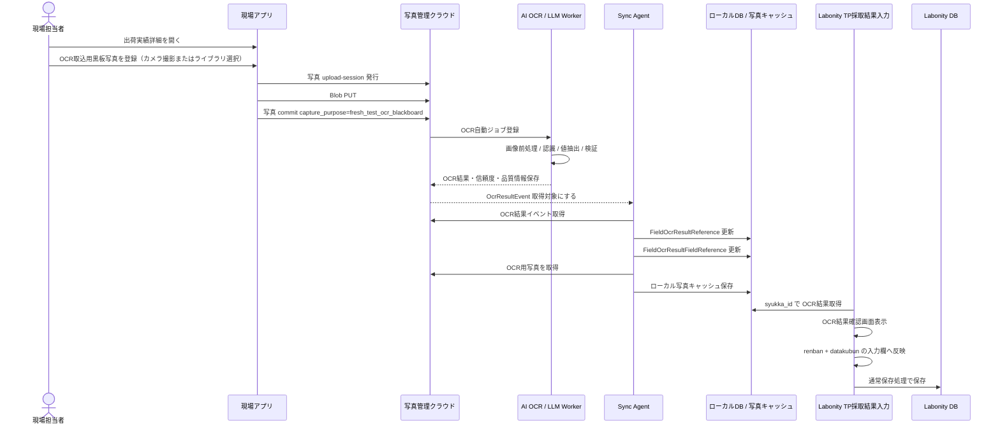

# 現場試験アプリ 詳細仕様書 第3分冊

**OCR取込・AI OCR・API・画面仕様**

| **項目** | **内容**                                                                                                                                 |
|----------|------------------------------------------------------------------------------------------------------------------------------------------|
| 版       | v2.2                                                                                                                                     |
| 状態     | 完成版                                                                                                                                   |
| 作成日   | 2026-06-22                                                                                                                               |
| 収録章   | 10〜14章                                                                                                                                 |
| 収録内容 | 10\. TP採取結果入力からの OCR 結果取込フロー11. AI OCR / LLM 事前取込設計12. API 設計13. 画面仕様 / 現場アプリ14. 画面仕様 / Labonity 側 |
| 読者     | 開発、QA、セキュリティ、運用、DB担当                                                                                                     |

> 本分冊は、提供された設計仕様の該当範囲を、省略せず収録しています。表、コード、JSON、SQL、受入条件、Mermaid定義を含みます。

## 10. TP採取結果入力からの OCR 結果取込フロー

### 10.1 画面起点

Labonity の **TP採取結果入力** 画面における出荷実績指定を起点とする。

ユーザーが対象の出荷実績を指定したタイミングで、対象の syukka_id、反映先 testpiecesaisyu_main_id、反映先 renban、反映先 datakubun が特定される。

- 通常取りの場合: 指定された行の syukka_id が特定される。
- 縦割りの場合: 指定された行の syukka_id と反映先 TestPieceSaisyu_FreshSiken.renban が同時に確定する。
- データ No.2 表示中の場合: datakubun = 1 の入力欄に反映する。
- 新規未保存 TP の場合: 画面メモリ上の出荷指定コンテキストを正とし、保存時に通常の Labonity 保存処理で ExDat の関係を確定する。

### 10.2 OCR 反映先の安全検証

OCR 結果は syukka_id に紐づく値として保存するが、反映時には syukka_id だけで自動反映しない。Labonity 画面の現在コンテキストと出荷指定の一致を必ず検証する。

#### 10.2.1 保存済み TP の検証

保存済み TP、または testpiecesaisyu_main_id が確定しており \[ExDat\].\[dbo\].\[TestPieceSaisyu_SyukkaData\] に出荷関係が保存済みの場合は、次の一致を必須とする。

```sql
SELECT TOP (1) 1
FROM [ExDat].[dbo].[TestPieceSaisyu_SyukkaData]
WHERE testpiecesaisyu_main_id = @testpiecesaisyu_main_id
  AND renban = @renban
  AND syukka_id = @syukka_id;
```

一致しない場合は、OCR結果確認画面を表示してもよいが、\[入力欄に反映\] は無効化する。表示メッセージは次とする。

```text
現在行の出荷実績と OCR 結果の出荷実績が一致しません。
反映先の連番または出荷指定を確認してください。
```

#### 10.2.2 新規未保存 TP の検証

新規未保存 TP では、\[ExDat\].\[dbo\].\[TestPieceSaisyu_SyukkaData\] の行がまだ存在しない場合がある。この場合は、画面メモリ上でユーザーが現在行に指定した syukka_id と OCR 結果の syukka_id が一致することを検証する。

```text
画面現在行.syukka_id == FieldOcrResultReference.syukka_id
画面現在行.renban == 反映先 renban
画面現在表示.datakubun == 反映先 datakubun
```

保存時は既存 Labonity の通常保存処理により、TP 本体、フレッシュ試験、TP と出荷の関係が ExDat に保存される。OCR 反映監査は、保存前は testpiecesaisyu_main_id が null または仮値でもよい。保存後に saved へ更新する場合、確定した testpiecesaisyu_main_id を記録する。

### 10.3 OCR結果の有無確認

出荷実績が指定された後、Labonity 側は \[NaDat\].\[FieldTest\].\[FieldOcrResultReference\] を参照し、対象 syukka_id の OCR 結果を確認する。

- OCR結果がある場合: \[OCR結果を確認して反映\] を表示する。
- OCR結果が処理中の場合: OCR読取中 と表示し、手入力を継続できるようにする。
- OCR結果がない場合: OCR取込導線は表示せず、通常の出荷実績指定のみとして完了する。
- OCR結果が失敗の場合: OCR失敗 と表示し、手入力を継続できるようにする。

Labonity 側はクラウドへ最新確認を行わない。同期状態は Sync Agent による NaDat 反映を正とする。

### 10.4 OCR結果取得 SQL

```sql
SELECT TOP (1) *
FROM [NaDat].[FieldTest].[FieldOcrResultReference]
WHERE tenant_id = @tenant_id
  AND plant_id = @plant_id
  AND syukka_id = @syukka_id
  AND ocr_usage = 'fresh_test_blackboard'
  AND is_current = 1
  AND status IN ('completed', 'needs_review')
ORDER BY
  processed_at DESC,
  ocr_import_result_id DESC;
```

項目別結果は次で取得する。

```sql
SELECT *
FROM [NaDat].[FieldTest].[FieldOcrResultFieldReference]
WHERE ocr_result_reference_id = @ocr_result_reference_id
ORDER BY display_order ASC, canonical_key ASC;
```

### 10.5 自動起動ルール

OCR結果確認画面の起動は次のルールとする。

| **状態**                      | **UI**                                                                                                 |
|-------------------------------|--------------------------------------------------------------------------------------------------------|
| OCR結果なし                   | 何も表示しない、または「OCR結果なし」と表示する。                                                      |
| OCR結果あり・反映先欄が空     | \[OCR結果を確認して反映\] を強調表示し、OCR結果確認画面を開く。値の自動反映は行わない。                |
| OCR結果あり・反映先欄に値あり | \[OCR結果から再取込\] を表示する。確認画面では現在値との差分を強調し、人間確認なしの上書きは行わない。 |
| OCR処理中                     | OCR読取中 と表示する。手入力は継続可能。                                                               |
| OCR失敗                       | OCR失敗 と表示する。手入力は継続可能。                                                                 |
| 検証不一致                    | OCR状態は表示するが、反映ボタンは無効化する。                                                          |
| 縦割り                        | 現在行の renban に対応する syukka_id の OCR結果だけを取得する。                                        |
| datakubun=1                   | データ2画面の入力欄へ反映する。                                                                        |

### 10.6 OCR結果確認 UI 表示項目

| **表示項目** | **内容**                                                                             |
|--------------|--------------------------------------------------------------------------------------|
| 反映先 TP    | testpiecesaisyu_main_id、採取日、現場名、配合。                                      |
| 反映先行     | renban、datakubun。                                                                  |
| 出荷実績     | 出荷日、出荷時刻、車番、出荷数量、Seq No。                                           |
| 読取元写真   | ローカル保存済みの OCR取込用黒板写真。未生成の場合は「読取元写真未取得」と表示する。 |
| 撮影日時     | taken_at。                                                                           |
| OCR処理日時  | processed_at。                                                                       |
| OCR状態      | completed / needs_review / failed / superseded。                                     |
| 全体信頼度   | overall_confidence。                                                                 |
| 画像品質     | quality_score と image_quality_json。                                                |
| 項目別信頼度 | 各項目の confidence。                                                                |
| 現在値       | TP採取結果入力画面の現在値。                                                         |
| OCR値        | OCR抽出値。                                                                          |
| 反映値       | ユーザーが確定する値。                                                               |
| 警告         | 低信頼度、車番不一致、桁数超過、型変換警告、範囲外、反映先不一致など。               |
| モデル情報   | 必要に応じてモデル名、スキーマバージョン、プロンプトバージョンを詳細表示する。       |

### 10.7 反映ルール

| **状態**                        | **処理**                                           |
|---------------------------------|----------------------------------------------------|
| 反映先検証 OK                   | ユーザー確認後、画面入力欄へ反映できる。           |
| 反映先検証 NG                   | 反映不可。手入力は継続できる。                     |
| 反映先欄が空                    | OCR値を反映値の初期値にする。                      |
| 反映先欄に値あり・OCR値と同じ   | OK 表示。                                          |
| 反映先欄に値あり・OCR値と異なる | 差分確認を必須にする。自動上書きしない。           |
| OCR値が低信頼度                 | 要確認として表示する。                             |
| OCR値が型変換不可               | 反映候補にしない。手入力を促す。                   |
| OCR値がDB桁数超過               | 切り詰め候補と警告を表示する。                     |
| OCR値が業務妥当範囲外           | 要確認または反映不可にする。閾値は 11.5.1 に従う。 |
| datakubun=1                     | データ2画面の入力欄へ反映する。                    |
| 縦割り                          | 現在行の renban と syukka_id の組み合わせを守る。  |

### 10.8 縦割り対応

縦割りでは、renban ごとに出荷実績が対応する。

```text
renban 0 -> 1台目の syukka_id -> 1台目の OCR結果 -> FreshSiken renban 0
renban 1 -> 2台目の syukka_id -> 2台目の OCR結果 -> FreshSiken renban 1
renban 2 -> 3台目の syukka_id -> 3台目の OCR結果 -> FreshSiken renban 2
```

OCR結果の反映先は次で決まる。

```text
反映先 = TP採取結果入力画面の現在行 renban + 現在表示中 datakubun
```

OCR結果側では renban と datakubun を固定しない。renban と datakubun は Labonity 画面側の現在コンテキストを正とする。

### 10.9 反映済み重複チェック

同じ OCR 結果を同じ TP 行へ再反映する場合は、誤操作防止のため確認を出す。

```sql
SELECT TOP (1) *
FROM [NaDat].[FieldTest].[FieldOcrImportAudit]
WHERE tenant_id = @tenant_id
  AND plant_id = @plant_id
  AND ocr_import_result_id = @ocr_import_result_id
  AND testpiecesaisyu_main_id = @testpiecesaisyu_main_id
  AND renban = @renban
  AND datakubun = @datakubun
  AND status IN ('applied_to_screen', 'saved')
ORDER BY created_at DESC;
```

再反映を許可する場合でも、前回反映値、今回反映値、既存画面値の差分を表示する。

## 11. AI OCR / LLM 事前取込設計

### 11.1 事前 OCR フロー



### 11.2 OCR ジョブの考え方

OCR ジョブは、OCR取込用黒板写真の commit をトリガーとしてクラウド側で自動作成する。

| **項目**         | **内容**                                                                  |
|------------------|---------------------------------------------------------------------------|
| トリガー         | capture_purpose = fresh_test_ocr_blackboard の写真 commit。               |
| 出荷実績         | shipment_id と shipment_source_local_id = syukka_id。                     |
| 写真             | 原則 1 枚。photo_asset_id で指定する。                                    |
| スキーマ         | labonity.blackboardFreshTest.v1。                                         |
| 画面コンテキスト | OCR実行時には持たせない。renban と datakubun は Labonity 反映時に決まる。 |
| 保存             | OCR結果、信頼度、品質情報、警告、モデル情報をクラウドDBへ保存する。       |
| 同期             | Sync Agent がローカル OCR 参照テーブルへ同期する。                        |
| TP DB反映        | OCR API は Labonity DB へ直接保存しない。                                 |

### 11.3 OCR レスポンス / 保存形式

OCR Worker は、抽出値だけでなく、品質情報と信頼度情報を含めた JSON を生成し、クラウドDBに保存する。

```json
{
  "schemaVersion": "labonity.blackboardFreshTest.v1",
  "source": {
    "shipmentId": "SHIPMENT-CLOUD-ID",
    "shipmentSourceLocalId": "SYUKKA-LOCAL-ID",
    "photoAssetId": "PHOTO-001",
    "ocrUsage": "fresh_test_blackboard",
    "model": "vision-llm",
    "modelVersion": "2026-06",
    "promptVersion": "blackboard-fresh-test-2026-06-10",
    "processedAt": "2026-06-10T10:30:00+09:00",
    "processingDurationMs": 2340
  },
  "quality": {
    "overallConfidence": 0.89,
    "qualityScore": 0.82,
    "imageSharpnessScore": 0.78,
    "brightnessScore": 0.86,
    "skewAngleDegrees": 2.3,
    "blackboardDetected": true,
    "blackboardCoverageRatio": 0.64,
    "needsReview": true,
    "warnings": [
      "黒板右下が一部ぼけています。低信頼度の項目は確認してください。"
    ]
  },
  "validation": {
    "vehicleNoMatch": true,
    "numericRangeValid": true,
    "dbTypeValid": true,
    "lowConfidenceCount": 2,
    "needsReviewCount": 2
  },
  "fields": [
    {
      "key": "slump",
      "labelText": "スランプ",
      "rawText": "18.0",
      "value": 18.0,
      "normalizedValue": "18.0",
      "valueType": "number",
      "unit": "cm",
      "confidence": 0.88,
      "needsReview": true,
      "reviewReasons": ["low_confidence"],
      "warnings": ["18.0 と 13.0 の判別がやや不確実"],
      "candidates": [18.0, 13.0]
    },
    {
      "key": "air",
      "labelText": "空気量",
      "rawText": "4.5",
      "value": 4.5,
      "normalizedValue": "4.5",
      "valueType": "number",
      "unit": "%",
      "confidence": 0.91,
      "needsReview": false,
      "reviewReasons": [],
      "warnings": [],
      "candidates": []
    }
  ]
}
```

### 11.4 OCR 対象項目

| **canonical key**         | **日本語名**     | **型**          | **単位** | **反映先候補**                                      | **読取・反映ルール**                                               |
|---------------------------|------------------|-----------------|----------|-----------------------------------------------------|--------------------------------------------------------------------|
| vehicle_no                | 車番             | string          | なし     | TestPieceSaisyu_FreshSiken.syaban                   | TP 側は nchar(6)。出荷実績 syaban と突合し、不一致の場合は要確認。 |
| outside_temperature       | 外気温           | string / number | ℃        | TestPieceSaisyu_FreshSiken.gaikion                  | nchar(6) へ整形する。                                              |
| test_time                 | 試験時間         | string          | 時刻     | TestPieceSaisyu_FreshSiken.sikenzikan               | HH:mm 等へ整形する。                                               |
| slump                     | スランプ         | number          | cm       | TestPieceSaisyu_FreshSiken.slump                    | スランプ値。                                                       |
| flow1                     | フロー1          | number          | mm       | TestPieceSaisyu_FreshSiken.flow1                    | 高流動の場合に抽出。                                               |
| flow2                     | フロー2          | number          | mm       | TestPieceSaisyu_FreshSiken.flow2                    | 高流動の場合に抽出。                                               |
| air                       | 空気量           | number          | %        | TestPieceSaisyu_FreshSiken.air                      | 空気量。                                                           |
| concrete_temperature      | コンクリート温度 | number          | ℃        | TestPieceSaisyu_FreshSiken.concrete_ondo            | 生コン温度。                                                       |
| unit_volume_mass          | 単位容積質量     | number          | kg/m3 等 | TestPieceSaisyu_FreshSiken.taniyosekisituryo        | 表記揺れを吸収する。                                               |
| chloride1                 | 塩化物量1        | number          | kg/m3    | TestPieceSaisyu_FreshSiken.enkabuturyo1             | 代表値 1 つを抽出。                                                |
| chloride2                 | 塩化物量2        | number          | kg/m3    | TestPieceSaisyu_FreshSiken.enkabuturyo2             | 2回目がある場合。                                                  |
| chloride3                 | 塩化物量3        | number          | kg/m3    | TestPieceSaisyu_FreshSiken.enkabuturyo3             | 3回目がある場合。                                                  |
| unit_water                | 単位水量         | number          | kg/m3    | TestPieceSaisyu_FreshSiken.tanisuiryo               | 単位水量を抽出。                                                   |
| material_separation_check | 材料分離目視確認 | integer/string  | なし     | TestPieceSaisyu_FreshSiken.zairyobunrimokusikakunin | 0:空白、1:有、2:無 などへマッピングする。                          |
| remarks                   | 備考             | string          | なし     | TestPieceSaisyu_FreshSiken.biko                     | 10 文字超は切り詰め警告。                                          |

### 11.5 値整形ルール

| **項目**         | **整形**                                                                   |
|------------------|----------------------------------------------------------------------------|
| 数値             | 全角数字、小数点、カンマ、単位文字を正規化する。                           |
| money 型項目     | decimal へ変換できる値だけ反映候補にする。桁あふれ、異常値は要確認にする。 |
| 温度             | ℃、度 を除去し数値化する。外気温は文字列欄への反映も考慮する。             |
| 車番             | 出荷実績の syaban と突合し、OCR 値が不一致の場合は要確認にする。           |
| nchar(6) 系      | 6 文字を超える場合は警告し、切り詰め候補を表示する。全角半角を正規化する。 |
| 備考             | DB 桁数を超える場合は警告し、反映値を切り詰め候補として表示する。          |
| 材料分離目視確認 | OCR文字列を 0/1/2 へマッピングし、不明な場合は空欄候補か要確認にする。     |
| datakubun        | 画面表示中のデータ区分へ反映する。OCR が勝手に切り替えない。               |

### 11.5.1 業務妥当性・DB格納検証

OCR 値は、信頼度だけでなく、DB 型、桁数、単位、業務上の妥当範囲、既存値との差分を検証する。初期値は次を採用し、必要に応じて工場別・配合別に設定化できるようにする。

| **canonical key**                 | **DB 反映先**                    | **初期妥当範囲・検証**                                           | **範囲外時の扱い**                       |
|-----------------------------------|----------------------------------|------------------------------------------------------------------|------------------------------------------|
| vehicle_no                        | syaban nchar(6)                  | 出荷実績 SyukkaDataMain.syaban と正規化後比較。6文字超は警告。   | 不一致は要確認。反映は可能だが強調表示。 |
| outside_temperature               | gaikion nchar(6)                 | -20.0〜50.0 ℃、または 6文字以内の温度表記。                      | 範囲外は要確認。6文字超は切り詰め候補。  |
| test_time                         | sikenzikan nchar(6)              | HH:mm、H:mm、HHmm を正規化。00:00〜23:59。                       | 不正時刻は反映不可。                     |
| slump                             | slump money                      | 0.0〜30.0 cm。高流動配合では flow と併せて確認。                 | 範囲外は要確認、型変換不可は反映不可。   |
| flow1 / flow2                     | flow1 / flow2 money              | 0〜1000 mm。高流動以外で値がある場合は注意。                     | 範囲外は要確認。                         |
| air                               | air money                        | 0.0〜15.0 %。                                                    | 範囲外は要確認。                         |
| concrete_temperature              | concrete_ondo money              | 0.0〜50.0 ℃。                                                    | 範囲外は要確認。                         |
| unit_volume_mass                  | taniyosekisituryo money          | 1500〜2800 kg/m3 を初期目安。                                    | 範囲外は要確認。                         |
| chloride1 / chloride2 / chloride3 | enkabuturyo1 等                  | 0.000〜1.000 kg/m3 を初期目安。小数桁は DB・画面仕様に合わせる。 | 範囲外は要確認。                         |
| unit_water                        | tanisuiryo money                 | 100〜250 kg/m3 を初期目安。                                      | 範囲外は要確認。                         |
| material_separation_check         | zairyobunrimokusikakunin tinyint | 有、無、なし、異常なし などを 0/1/2 にマッピング。               | 不明は空欄候補または要確認。             |
| remarks                           | biko nvarchar(10)                | 10文字以内。                                                     | 10文字超は切り詰め候補と警告。           |

#### 11.5.1.1 反映可否判定

| **判定** | **条件**                                                     | **処理**                                       |
|----------|--------------------------------------------------------------|------------------------------------------------|
| 反映可   | 型変換成功、DB桁数内、業務範囲内、反映先検証 OK。            | 初期反映値に設定できる。                       |
| 要確認   | 低信頼度、既存値差分、車番不一致、業務範囲外、画像品質警告。 | 反映候補にはするが、ユーザー確認を必須にする。 |
| 反映不可 | 型変換不可、DB格納不可、時刻不正、反映先検証 NG。            | 反映候補にしない。手入力を促す。               |

#### 11.5.1.2 丸め・表示

- money 型へ反映する数値は decimal として扱い、画面の既存丸め設定に合わせる。
- 小数桁を持つ項目は、OCR 原文、正規化値、DB 反映値を分けて表示する。
- 単位文字、全角数字、全角小数点、カンマは正規化する。
- OCR Worker は canonical value を保存するが、最終反映値は Labonity 確認画面でユーザーが確定する。

### 11.6 信頼度・精度・品質情報の保存方針

OCR の「精度」は、認識時点では真の正解がないため、単一の数値だけで判断しない。以下を組み合わせて保存する。

| **種類**         | **保存内容**                                                                 | **用途**                   |
|------------------|------------------------------------------------------------------------------|----------------------------|
| 項目別信頼度     | confidence。各項目ごとの OCR / LLM の確からしさ。                            | 低信頼度項目の要確認表示。 |
| 全体信頼度       | overall_confidence。項目別信頼度やモデル評価から算出。                       | 結果全体の目安。           |
| 画像品質         | quality_score、ぼけ、明るさ、傾き、黒板検出状態。                            | 再登録判断。               |
| ルール検証       | 車番一致、数値範囲、DB型、桁数、単位変換。                                   | OCR値の業務妥当性確認。    |
| 低信頼度数       | low_confidence_count。                                                       | 確認画面での警告。         |
| 要確認数         | needs_review_count。                                                         | 取込前の確認必須判定。     |
| 候補値           | candidates_json。複数候補がある場合。                                        | ユーザー選択。             |
| ユーザー修正履歴 | 反映監査に before_values_json、ocr_values_json、applied_values_json を保存。 | 実運用上の精度評価・改善。 |
| モデル情報       | ocr_engine、ocr_model、model_version、prompt_version、schema_version。       | モデル更新時の追跡。       |

閾値の初期値は次を推奨する。

| **条件**                    | **扱い**                                             |
|-----------------------------|------------------------------------------------------|
| confidence \>= 0.90         | OK。ただし確認画面には表示する。                     |
| 0.80 \<= confidence \< 0.90 | 注意。ユーザー確認を推奨する。                       |
| confidence \< 0.80          | 要確認。自動反映候補にはするが、確認状態を強調する。 |
| 既存値との差分あり          | 信頼度に関係なく要確認。                             |
| 車番不一致                  | 要確認。                                             |
| DB型変換不可                | 反映候補にしない。手入力を促す。                     |
| 画像品質警告あり            | 結果全体を要確認にする。                             |

#### 11.6.1 OCR 結果の信憑性表示・色分けルール

Labonity の OCR結果確認画面では、AI OCR 結果の信憑性を人間が瞬時に判断できるよう、項目行、信頼度セル、反映値セル、状態バッジの色を変える。色だけに依存せず、必ず OK、注意、要確認、反映不可 などの文字ラベルとアイコンも併用する。

| **判定** | **条件例**                                                  | **表示色の目安** | **表示ラベル** | **反映可否**                                 |
|----------|-------------------------------------------------------------|------------------|----------------|----------------------------------------------|
| 高信頼   | confidence \>= 0.90、型・桁数・範囲・車番一致がすべて OK    | 緑系             | OK             | 人間確認後に反映可。                         |
| 注意     | 0.80 \<= confidence \< 0.90、または軽微な丸め・単位補正あり | 黄系 / 橙系      | 注意           | 人間確認後に反映可。                         |
| 要確認   | confidence \< 0.80、画像品質警告、候補複数、既存値差分あり  | 赤系 / 濃い橙系  | 要確認         | 人間確認と必要な修正後に反映可。             |
| 反映不可 | 型変換不可、DB桁数超過、業務範囲外、必須情報不足            | 灰系 + 赤系警告  | 反映不可       | 自動反映候補にしない。手入力または修正必須。 |
| 未読取   | OCR値なし、黒板上で項目検出不可                             | 灰系             | 未読取         | 空欄候補。必要に応じて手入力。               |

色分けは項目単位で行う。全体信頼度が高い場合でも、1 項目でも 要確認 または 反映不可 があれば、画面上部にも要確認件数を表示する。ユーザーが \[入力欄に反映\] を押す前に、要確認項目が残っている場合は確認ダイアログを表示する。

### 11.7 OcrImportJob

テーブル名: OcrImportJob

| **項目**                 | **型**              | **説明**                                                               |
|--------------------------|---------------------|------------------------------------------------------------------------|
| ocr_import_job_id        | uuid                | OCR取込ジョブID。                                                      |
| tenant_id                | nvarchar(64)        | テナントID。                                                           |
| plant_id                 | uniqueidentifier    | 工場ID。                                                               |
| shipment_id              | uuid                | クラウド出荷実績ID。                                                   |
| shipment_source_local_id | uniqueidentifier    | SyukkaDataMain.syukka_id。                                             |
| photo_asset_id           | uuid                | OCR取込用黒板写真ID。                                                  |
| photo_asset_target_id    | uuid                | 対象関連ID。                                                           |
| ocr_usage                | nvarchar            | fresh_test_blackboard。                                                |
| trigger_type             | nvarchar            | photo_committed。                                                      |
| schema_version           | nvarchar            | labonity.blackboardFreshTest.v1。                                      |
| ocr_engine               | nvarchar            | OCR / LLM エンジン識別子。                                             |
| ocr_model                | nvarchar            | モデル識別子。                                                         |
| model_version            | nvarchar            | モデルバージョン。                                                     |
| prompt_version           | nvarchar            | プロンプトバージョン。                                                 |
| prompt_hash              | nvarchar            | プロンプト・設定追跡用ハッシュ。                                       |
| status                   | nvarchar            | queued / processing / completed / needs_review / failed / superseded。 |
| retry_count              | int                 | 再試行回数。                                                           |
| error_code               | nvarchar null       | 失敗コード。                                                           |
| error_message            | nvarchar null       | 失敗内容。                                                             |
| queued_at                | datetimeoffset      | キュー登録日時。                                                       |
| started_at               | datetimeoffset null | 処理開始日時。                                                         |
| finished_at              | datetimeoffset null | 処理終了日時。                                                         |
| processing_duration_ms   | int null            | 処理時間。                                                             |
| created_at               | datetimeoffset      | 作成日時。                                                             |
| updated_at               | datetimeoffset      | 更新日時。                                                             |

### 11.8 OcrImportResult

テーブル名: OcrImportResult

| **項目**                 | **型**            | **説明**                                         |
|--------------------------|-------------------|--------------------------------------------------|
| ocr_import_result_id     | uuid              | OCR結果ID。                                      |
| ocr_import_job_id        | uuid              | OCRジョブID。                                    |
| tenant_id                | nvarchar(64)      | テナントID。                                     |
| plant_id                 | uniqueidentifier  | 工場ID。                                         |
| shipment_id              | uuid              | クラウド出荷実績ID。                             |
| shipment_source_local_id | uniqueidentifier  | SyukkaDataMain.syukka_id。                       |
| photo_asset_id           | uuid              | OCR取込用黒板写真ID。                            |
| ocr_usage                | nvarchar          | fresh_test_blackboard。                          |
| schema_version           | nvarchar          | スキーマバージョン。                             |
| status                   | nvarchar          | completed / needs_review / failed / superseded。 |
| is_current               | bit               | 現在有効な OCR結果。                             |
| overall_confidence       | decimal(5,4) null | 全体信頼度。                                     |
| min_field_confidence     | decimal(5,4) null | 項目別信頼度の最小値。                           |
| quality_score            | decimal(5,4) null | 画像品質スコア。                                 |
| validation_score         | decimal(5,4) null | ルール検証スコア。                               |
| field_count              | int               | 抽出項目数。                                     |
| low_confidence_count     | int               | 低信頼度項目数。                                 |
| needs_review_count       | int               | 要確認項目数。                                   |
| image_quality_json       | json              | ぼけ、明るさ、傾き、黒板検出など。               |
| validation_results_json  | json              | 車番一致、範囲、型変換、桁数など。               |
| extracted_values_json    | json              | 正規化済み抽出値。                               |
| confidence_json          | json              | 項目別信頼度。                                   |
| warnings_json            | json              | 警告一覧。                                       |
| raw_ocr_json             | json              | OCR / LLM の生結果。保持期間を管理する。         |
| processed_at             | datetimeoffset    | OCR処理完了日時。                                |
| created_at               | datetimeoffset    | 作成日時。                                       |

現在有効な OCR結果は、同一出荷実績・同一用途で 1 件のみとする。

```sql
CREATE UNIQUE INDEX UX_OcrImportResult_Current
ON OcrImportResult (
    tenant_id,
    plant_id,
    shipment_source_local_id,
    ocr_usage
)
WHERE is_current = 1
  AND status IN ('completed', 'needs_review') ;
```

### 11.9 OcrImportResultField

テーブル名: OcrImportResultField

| **項目**                   | **型**             | **説明**                                            |
|----------------------------|--------------------|-----------------------------------------------------|
| ocr_import_result_field_id | uuid               | OCR結果項目ID。                                     |
| ocr_import_result_id       | uuid               | OCR結果ID。                                         |
| tenant_id                  | nvarchar(64)       | テナントID。                                        |
| plant_id                   | uniqueidentifier   | 工場ID。                                            |
| canonical_key              | nvarchar           | slump, air などの標準キー。                         |
| display_order              | int                | 表示順。                                            |
| label_text                 | nvarchar           | OCRしたラベル文字列。                               |
| raw_text                   | nvarchar           | OCRした生文字列。                                   |
| normalized_value           | nvarchar           | 正規化後文字列。                                    |
| numeric_value              | decimal(18,5) null | 数値の場合の正規化値。                              |
| value_type                 | nvarchar           | number / string / time / integer。                  |
| unit                       | nvarchar null      | 単位。                                              |
| confidence                 | decimal(5,4) null  | 項目別信頼度。                                      |
| needs_review               | bit                | 要確認フラグ。                                      |
| review_reason_codes        | nvarchar(max)      | low_confidence, vehicle_mismatch, type_error など。 |
| warnings_json              | json               | 項目別警告。                                        |
| candidates_json            | json               | 候補値。                                            |
| bounding_polygon_json      | json null          | 画像上の位置。取得できる場合のみ。                  |
| created_at                 | datetimeoffset     | 作成日時。                                          |

### 11.10 ローカル OCR 結果参照テーブル

テーブル名: \[NaDat\].\[FieldTest\].\[FieldOcrResultReference\]

| **項目**                | **型**              | **説明**                                         |
|-------------------------|---------------------|--------------------------------------------------|
| ocr_result_reference_id | uniqueidentifier    | ローカル OCR 結果参照ID。                        |
| tenant_id               | nvarchar(64)        | テナントID。                                     |
| plant_id                | uniqueidentifier    | 工場ID。                                         |
| ocr_import_job_id       | uniqueidentifier    | クラウド OCR ジョブID。                          |
| ocr_import_result_id    | uniqueidentifier    | クラウド OCR 結果ID。                            |
| syukka_id               | uniqueidentifier    | SyukkaDataMain.syukka_id。                       |
| shipment_id             | uniqueidentifier    | クラウド Shipment.shipment_id。                  |
| photo_asset_id          | uniqueidentifier    | 読取元写真ID。                                   |
| photo_asset_target_id   | uniqueidentifier    | 読取元写真関連ID。                               |
| ocr_usage               | nvarchar            | fresh_test_blackboard。                          |
| schema_version          | nvarchar            | スキーマバージョン。                             |
| status                  | nvarchar            | completed / needs_review / failed / superseded。 |
| is_current              | bit                 | 現在有効な結果。                                 |
| overall_confidence      | decimal(5,4) null   | 全体信頼度。                                     |
| min_field_confidence    | decimal(5,4) null   | 項目別信頼度最小値。                             |
| quality_score           | decimal(5,4) null   | 画像品質スコア。                                 |
| validation_score        | decimal(5,4) null   | 検証スコア。                                     |
| field_count             | int                 | 項目数。                                         |
| low_confidence_count    | int                 | 低信頼度項目数。                                 |
| needs_review_count      | int                 | 要確認項目数。                                   |
| image_quality_json      | nvarchar(max)       | 画像品質。                                       |
| validation_results_json | nvarchar(max)       | 検証結果。                                       |
| extracted_values_json   | nvarchar(max)       | 抽出値。                                         |
| confidence_json         | nvarchar(max)       | 信頼度。                                         |
| warnings_json           | nvarchar(max)       | 警告。                                           |
| local_photo_path        | nvarchar(500) null  | 読取元写真のローカルパス。                       |
| local_thumbnail_path    | nvarchar(500) null  | サムネイルのローカルパス。                       |
| processed_at            | datetimeoffset null | OCR処理完了日時。                                |
| event_sequence          | bigint              | 最終反映イベントシーケンス。                     |
| synced_at               | datetimeoffset      | ローカル同期日時。                               |

テーブル名: \[NaDat\].\[FieldTest\].\[FieldOcrResultFieldReference\]

| **項目**                      | **型**             | **説明**                       |
|-------------------------------|--------------------|--------------------------------|
| ocr_result_field_reference_id | uniqueidentifier   | ローカル OCR 項目参照ID。      |
| ocr_result_reference_id       | uniqueidentifier   | FieldOcrResultReference のID。 |
| tenant_id                     | nvarchar(64)       | テナントID。                   |
| plant_id                      | uniqueidentifier   | 工場ID。                       |
| syukka_id                     | uniqueidentifier   | 出荷ID。                       |
| canonical_key                 | nvarchar           | 標準キー。                     |
| display_order                 | int                | 表示順。                       |
| label_text                    | nvarchar           | ラベル文字列。                 |
| raw_text                      | nvarchar           | 生文字列。                     |
| normalized_value              | nvarchar           | 正規化値。                     |
| numeric_value                 | decimal(18,5) null | 数値。                         |
| value_type                    | nvarchar           | 型。                           |
| unit                          | nvarchar null      | 単位。                         |
| confidence                    | decimal(5,4) null  | 項目別信頼度。                 |
| needs_review                  | bit                | 要確認。                       |
| review_reason_codes           | nvarchar(max)      | 要確認理由。                   |
| warnings_json                 | nvarchar(max)      | 警告。                         |
| candidates_json               | nvarchar(max)      | 候補。                         |
| synced_at                     | datetimeoffset     | ローカル同期日時。             |

### 11.11 OCR 反映監査

Labonity 側で OCR 反映結果を追跡するため、独立した監査テーブル \[NaDat\].\[FieldTest\].\[FieldOcrImportAudit\] を使用する。

| **項目**                | **説明**                                              |
|-------------------------|-------------------------------------------------------|
| ocr_import_audit_id     | 監査ID。                                              |
| tenant_id               | テナントID。                                          |
| plant_id                | 工場ID。                                              |
| ocr_import_result_id    | クラウド OCR 結果ID。                                 |
| ocr_result_reference_id | ローカル OCR 結果参照ID。                             |
| syukka_id               | 出荷ID。                                              |
| testpiecesaisyu_main_id | 保存済み TP の場合に記録する。未保存中は null 可。    |
| renban                  | 反映先 renban。                                       |
| datakubun               | 反映先 datakubun。                                    |
| photo_asset_id          | 取込元写真。                                          |
| ocr_values_json         | OCR値。                                               |
| ocr_confidence_json     | 信頼度。                                              |
| ocr_warnings_json       | 警告。                                                |
| before_values_json      | 反映前画面値。                                        |
| applied_values_json     | 反映値。ユーザー修正後の値を含む。                    |
| corrected_fields_json   | OCR値から修正された項目。                             |
| saved_values_json       | 保存後値。必要に応じて記録する。                      |
| status                  | applied_to_screen / saved / save_failed / discarded。 |
| created_by              | 操作者。                                              |
| created_at              | 記録日時。                                            |

## 12. API 設計

### 12.1 共通 API ルール

| **項目**    | **内容**                                                                                                                                                                                                                |
|-------------|-------------------------------------------------------------------------------------------------------------------------------------------------------------------------------------------------------------------------|
| URL         | /api/core/v1/orgs/{orgId}/... または /api/sync/v1/orgs/{orgId}/...。                                                                                                                                                    |
| 認証        | 現場試験 Web アプリは Liberty Account の個人 access token を Bearer で送信する。Sync Agent は Agent credential で取得した短命 access token を Bearer で送信する。Labonity デスクトップアプリはクラウド API を呼ばない。 |
| 認可        | Web アプリでは orgId、Grant、権限コード、plantId を検証する。Sync Agent では orgId、plantId、agentId、scope、有効な Agent registration を検証する。                                                                     |
| Idempotency | POST 系は Idempotency-Key または clientRequestId を使用する。                                                                                                                                                           |
| エラー      | traceId, code, message, details を返す。                                                                                                                                                                                |

### 12.2 Sync Agent API

#### Sync Agent token 取得

Sync Agent は個人ログインを行わず、Agent credential により短命 access token を取得する。実際の token endpoint の URL やパラメータ名は認証基盤仕様に合わせるが、概念上は Client Credentials 相当とする。

```text
POST {LibertyAccountTokenEndpoint}
Content-Type: application/x-www-form-urlencoded
```

リクエスト例:

```text
grant_type=client_credentials
client_id={agentClientId}
client_secret={agentClientSecret}
scope=FieldTest.Sync.Import FieldTest.Sync.Read FieldTest.Sync.Ack FieldTest.Sync.PhotoCache FieldTest.Sync.Heartbeat
```

レスポンス例:

```json
{
  "access_token": "...",
  "token_type": "Bearer",
  "expires_in": 3600,
  "scope": "FieldTest.Sync.Import FieldTest.Sync.Read FieldTest.Sync.Ack FieldTest.Sync.PhotoCache FieldTest.Sync.Heartbeat"
}
```

| **項目**      | **方針**                                                          |
|---------------|-------------------------------------------------------------------|
| refresh token | 返さない、保存しない。                                            |
| access token  | 短命。期限切れ前または 401 応答時に再取得する。                   |
| client secret | DPAPI / Credential Manager 等で保護する。ログには出さない。       |
| 失効          | 管理者が Agent credential を失効すると、以後 token 取得できない。 |

#### ローカルDB → クラウド

```http
POST /api/sync/v1/orgs/{orgId}/field-sites/import
POST /api/sync/v1/orgs/{orgId}/shipping-schedules/import
POST /api/sync/v1/orgs/{orgId}/shipments/import
POST /api/sync/v1/orgs/{orgId}/shipment-tp-targets/import
```

共通リクエスト例:

```json
{
  "plantId": "KOZYO-001",
  "sourceSystem": "ExDat",
  "sourceTable": "SyukkaDataMain",
  "items": [
    {
      "sourceLocalId": "SYUKKA-LOCAL-GUID",
      "sourceHash": "sha256:...",
      "deleted": false,
      "values": {
        "shippingDate": "2026-06-10",
        "shippingTime": "10:30",
        "vehicleNo": "12",
        "quantity": 4.0,
        "fieldSiteSourceLocalId": "GENBA-LOCAL-GUID"
      }
    }
  ]
}
```

#### 写真メタデータイベント取得

```http
GET /api/sync/v1/orgs/{orgId}/photo-reference-events?plantId={plantId}&sinceSequence={sequence}
POST /api/sync/v1/orgs/{orgId}/photo-reference-events/{eventId}/ack
```

#### OCR結果イベント取得

```http
GET /api/sync/v1/orgs/{orgId}/ocr-result-events?plantId={plantId}&sinceSequence={sequence}
GET /api/sync/v1/orgs/{orgId}/ocr-results/{ocrImportResultId}
GET /api/sync/v1/orgs/{orgId}/ocr-results/{ocrImportResultId}/fields
POST /api/sync/v1/orgs/{orgId}/ocr-result-events/{eventId}/ack
```

#### OCR取込用写真キャッシュ取得

```http
POST /api/sync/v1/orgs/{orgId}/photos/{photoAssetId}/download-url
```

Sync Agent credential で使用できるのは、同期・OCR結果取得・写真ダウンロード URL 取得・ローカル写真保存状態通知・heartbeat に必要な API のみに限定する。現場アプリ API、管理 UI API、他テナント参照 API は使用できない。

### 12.3 現場アプリ API

#### 出荷予定一覧

```http
GET /api/core/v1/orgs/{orgId}/shipping-schedules?date=2026-06-10&plantId={plantId}
```

#### 出荷実績一覧

```http
GET /api/core/v1/orgs/{orgId}/shipments?shippingScheduleId={shippingScheduleId}
```

#### 出荷実績詳細

```http
GET /api/core/v1/orgs/{orgId}/shipments/{shipmentId}
```

#### 写真アップロードセッション発行

```http
POST /api/core/v1/orgs/{orgId}/photos/upload-sessions
```

リクエスト例:

```json
{
  "plantId": "KOZYO-001",
  "shipmentId": "SHIPMENT-CLOUD-ID",
  "fileCount": 1,
  "capturePurpose": "fresh_test_ocr_blackboard",
  "clientRequestId": "device-001:20260610:001"
}
```

レスポンス例:

```json
{
  "uploadSessionId": "UPLOAD-001",
  "items": [
    {
      "photoAssetId": "PHOTO-001",
      "uploadUrl": "https://...",
      "blobPath": "orgs/ORG-001/plants/KOZYO-001/photos/PHOTO-001/original.jpg",
      "requiredHeaders": {
        "x-ms-blob-type": "BlockBlob"
      }
    }
  ],
  "maxSizeBytes": 10485760,
  "acceptedContentTypes": ["image/jpeg", "image/png", "image/heic"],
  "expiresAt": "2026-06-10T10:45:00+09:00"
}
```

#### 写真 commit

```http
POST /api/core/v1/orgs/{orgId}/photos/{photoAssetId}/commit
```

通常写真のリクエスト例:

```json
{
  "target": {
    "targetType": "shipment",
    "targetId": "SHIPMENT-CLOUD-ID",
    "targetSourceLocalId": "SYUKKA-LOCAL-GUID",
    "displayOrder": 1,
    "isPrimary": true
  },
  "capturePurpose": "general",
  "takenAt": "2026-06-10T10:31:00+09:00",
  "sourceType": "camera",
  "qualityWarnings": []
}
```

OCR取込用黒板写真のリクエスト例:

```json
{
  "target": {
    "targetType": "shipment",
    "targetId": "SHIPMENT-CLOUD-ID",
    "targetSourceLocalId": "SYUKKA-LOCAL-GUID",
    "displayOrder": 1,
    "isPrimary": false,
    "ocrUsage": "fresh_test_blackboard",
    "isOcrPrimary": true
  },
  "capturePurpose": "fresh_test_ocr_blackboard",
  "takenAt": "2026-06-10T10:31:00+09:00",
  "sourceType": "camera",
  "qualityWarnings": []
}
```

OCR取込用黒板写真の場合、commit 成功後に自動 OCR ジョブが作成される。

レスポンス例:

```json
{
  "photoAssetId": "PHOTO-001",
  "photoAssetTargetId": "TARGET-001",
  "capturePurpose": "fresh_test_ocr_blackboard",
  "ocrJob": {
    "ocrImportJobId": "OCR-JOB-001",
    "status": "queued"
  }
}
```

#### 出荷実績に紐づく写真取得

```http
GET /api/core/v1/orgs/{orgId}/shipments/{shipmentId}/photos
GET /api/core/v1/orgs/{orgId}/shipments/by-source/{syukkaId}/photos?plantId={plantId}
```

#### 出荷実績に紐づく OCR 状態取得

現場アプリで OCR 状態を表示するための API として使用する。Labonity デスクトップアプリは使用しない。

```http
GET /api/core/v1/orgs/{orgId}/shipments/{shipmentId}/ocr-status
GET /api/core/v1/orgs/{orgId}/shipments/by-source/{syukkaId}/ocr-status?plantId={plantId}
```

レスポンス例:

```json
{
  "shipmentId": "SHIPMENT-CLOUD-ID",
  "shipmentSourceLocalId": "SYUKKA-LOCAL-GUID",
  "ocrUsage": "fresh_test_blackboard",
  "status": "needs_review",
  "ocrImportJobId": "OCR-JOB-001",
  "ocrImportResultId": "OCR-RESULT-001",
  "overallConfidence": 0.89,
  "qualityScore": 0.82,
  "needsReviewCount": 2,
  "processedAt": "2026-06-10T10:35:00+09:00"
}
```

### 12.4 Labonity デスクトップ API

Labonity デスクトップアプリ向けのクラウド API は用意しない。

Labonity デスクトップアプリは、次のローカルデータだけを参照する。

- FieldPhotoReference
- FieldOcrResultReference
- FieldOcrResultFieldReference
- FieldOcrImportAudit
- ローカル写真キャッシュ
- 既存 Labonity DB テーブル

## 13. 画面仕様 / 現場アプリ

### 13.1 ログイン画面


### 13.2 出荷予定一覧画面


- ヘッダーに「出荷予定一覧」タイトルと更新ボタンを配置する。
- 日付ピッカーと検索バー（現場名・予定Noで検索）を上部に表示する。
- 「すべて」「写真未登録」「OCR用黒板未登録」の絞込タブを配置する。
- 各予定カードには、予定No、現場名、配合、出荷台数、写真枚数、OCR用黒板登録状態を表示する。
- 予定カードには、配下の出荷実績に OCR取込用黒板写真があるか、OCR予約済みか、読取済みかを補助バッジで表示する。
- OCR状態の補助バッジは、OCR未登録 / OCR予約済 / OCR読取中 / OCR済 / 要確認 / 失敗 を区別できる表示にする。
- カード下部に「開く」ボタンを配置し、出荷予定詳細へ遷移する。

### 13.3 出荷予定詳細 / 出荷実績一覧画面


- 上部に予定詳細（現場名、予定No、配合、出荷予定日）をカード形式で表示する。
- 現場住所セクションに住所テキスト、「地図を開く」「ナビ開始」ボタンを配置する。
- 「出荷実績」セクションに各実績行を表示する。
- 実績行には、出荷時刻、車番、数量、写真枚数、OCR用黒板状態を表示する。
- 実績行には、OCR取込用黒板写真の有無、OCR予約済み、OCR済み、要確認などの状態を補助バッジで表示する。
- OCR用黒板状態は 未登録 / 予約済 / 読取中 / 読取済 / 要確認 / 失敗 / 対象外 を表示する。
- OCR済みの場合は、必要に応じて全体信頼度または要確認件数を併記する。
- 各行の「開く」ボタンから出荷実績詳細へ遷移する。

### 13.4 出荷実績詳細画面


- 現場名をヘッダー下に大きく表示する。
- 「出荷情報」カードに出荷時刻、車番、数量、配合を表示する。
- 「写真」カードに状態、枚数、代表写真の撮影時刻、同期状態を表示する。
- 「OCR取込用黒板」カードに、登録状態、OCR状態、OCR予約状態、読取日時、全体信頼度、要確認件数、同期状態を表示する。
- OCR取込用黒板写真が保存済みの場合は「OCR黒板」バッジを表示し、通常写真と区別する。
- 写真サムネイルを横並びで表示する。
- 画面下部に「写真を登録」を配置する。押下後、用途（通常写真 / OCR取込用黒板写真）と取込方法（カメラ撮影 / ライブラリ選択）を選択する。

表示例:

```text
OCR取込用黒板
状態: OCR済（要確認 2件）
OCR予約: 予約済
同期状態: 同期済
全体信頼度: 89%
読取日時: 10:35

[OCR取込用黒板写真を差し替える]
```

### 13.5 写真登録メニュー


- ボトムシート形式で「写真を登録」メニューを表示する。
- 対象出荷（出荷日 / 出荷時刻 / 車番 / 数量 / 現場名）を上部に大きく表示する。
- 操作は「写真用途」と「取込方法」の 2 軸を明確に分け、4 つの操作として表示する。

| **写真用途**      | **取込方法**   | **表示ボタン**                  | **source_type** | **capture_purpose**       | **OCR 対象** |
|-------------------|----------------|---------------------------------|-----------------|---------------------------|--------------|
| 通常写真          | カメラ撮影     | 通常写真をカメラで撮影          | camera          | general                   | 対象外       |
| 通常写真          | ライブラリ選択 | 通常写真をライブラリから選択    | library         | general                   | 対象外       |
| OCR取込用黒板写真 | カメラ撮影     | OCR黒板写真をカメラで撮影       | camera          | fresh_test_ocr_blackboard | 対象         |
| OCR取込用黒板写真 | ライブラリ選択 | OCR黒板写真をライブラリから選択 | library         | fresh_test_ocr_blackboard | 対象         |

表示例:

```text
写真を登録
対象: 2026/06/10 10:30 / 車番12 / 4.0m3

通常写真
  [カメラで撮影]
  [ライブラリから選択]

OCR取込用黒板写真
  [カメラで撮影]
  [ライブラリから選択]

[キャンセル]
```

OCR取込用黒板写真は通常写真の任意分類ではなく、保存後に OCR ジョブ予約へ進む専用用途として扱う。カメラ撮影でもライブラリ選択でも、OCR取込用黒板写真として登録した場合だけ capture_purpose = fresh_test_ocr_blackboard とする。

既に OCR取込用黒板写真がある場合、OCR黒板写真のカメラ撮影またはライブラリ選択を実行すると差し替えになることを確認画面で表示する。

### 13.6 OCR黒板写真確認画面


OCR取込用黒板写真は、カメラ撮影または端末ライブラリ選択後に専用画面で確認し、通常写真の確認画面とは保存後の扱いを明確に分ける。

確認時の表示:

- 黒板全体を写す。
- 反射を避ける。
- 斜めから撮りすぎない。
- 文字が読める距離で撮る。
- ぼけ、暗さ、傾き、黒板欠けのチェック結果を表示する。
- 保存後に OCR予約済みとなり、クラウド側で自動 OCR されることを表示する。
- 既に OCR取込用黒板写真がある場合は、保存すると差し替えになることを表示する。

### 13.7 写真一覧画面


- 対象出荷（出荷時刻 / 車番）を上部に表示する。
- 通常写真カードを縦並びで表示し、各カードにサムネイル、撮影日時、「代表にする」「削除」ボタンを配置する。
- 代表写真には「代表写真」バッジを表示する。
- OCR取込用黒板写真は、通常写真とは別セクションに表示する。
- OCR取込用黒板写真には「OCR黒板」バッジを表示する。
- 写真カードには OCR状態を OCR済 / 予約済 / 対象外 / 要確認 / 失敗 として表示する。
- OCR済みまたは要確認の場合は、全体信頼度を表示する。
- 通常写真には OCR対象外 を表示し、自動 OCR 対象ではないことを明確にする。
- 画面下部に「写真を登録」を配置する。押下後、用途（通常写真 / OCR取込用黒板写真）と取込方法（カメラ撮影 / ライブラリ選択）を選択する。

### 13.8 保存完了画面


通常写真の場合:

- 保存成功を示すチェックマークアイコンとメッセージを表示する。
- 対象の出荷実績（出荷時刻、車番）を表示する。
- 保存内容のサマリー（写真枚数、代表写真、同期状態）を表示する。
- 「出荷実績詳細へ戻る」と「続けて写真を登録」を配置する。

OCR取込用黒板写真の場合:

- 保存成功を表示する。
- 「OCR予約済」と表示し、クラウド側で OCR 読取が行われることを示す。
- 写真メタデータとアップロードが完了した場合は「同期済」を表示する。
- OCR結果は Labonity 側で同期後に確認できることを表示する。
- 「出荷実績詳細へ戻る」と「差し替える」を配置する。

## 14. 画面仕様 / Labonity 側

### 14.1 TP採取結果入力画面


```text
TP採取結果入力 (一部)

対象TP: TP-20260610-001
現場: ○○現場
配合: 18-18-20N

【出荷情報】
[連番] [出荷時刻] [車番] [数量] [OCR状態]     [アクション]
  0    10:30     12    4.0m3  読取済       [OCR結果を確認]
  1    10:45     15    4.0m3  未登録       [出荷指定]
  2    11:00     18    4.0m3  読取中       [出荷指定]
```

\[OCR取込\] や \[OCR実行\] は表示しない。出荷指定後のローカル OCR 結果有無に応じて \[OCR結果を確認して反映\] を表示する。

### 14.2 OCR結果確認画面


OCR結果確認画面は、読取元写真と AI OCR 結果を常に同じ画面上に並べて表示する。人間が黒板写真を見ながら OCR値を確認・修正することがこの画面の目的であるため、写真を隠した状態や別画面参照を前提にした反映操作は行わない。

```text
+--------------------------------------------------------------------------------+
| OCR結果確認                                                                     |
|--------------------------------------------------------------------------------|
| 出荷実績: 10:30 / 車番12                                                       |
| 現場    : ○○マンション新築工事                                                 |
| 反映先  : renban 0 / datakubun 0                                               |
| 読取元  : OCR取込用黒板写真                                                    |
| 読取日時: 2026/06/10 10:35                                                     |
| 全体信頼度: 89%    画像品質: 82%    要確認: 2件                                |
|--------------------------------------------------------------------------------|
| 左: 読取元写真                                                                  |
| 右: 抽出結果                                                                    |
|                                                                                |
| 項目              現在値    OCR値      信頼度   反映値   状態                 |
| スランプ                    18.0       88%      18.0     要確認               |
| 空気量                      4.5        91%      4.5      OK                   |
| コンクリート温度            21.5       77%      21.5     要確認               |
| 外気温                      未読取     -        空欄     要入力               |
| 塩化物量                    0.03       90%      0.03     OK                   |
|                                                                                |
| [入力欄に反映] [保留] [手入力を続ける]                                         |
+--------------------------------------------------------------------------------+
```

#### 14.2.1 信頼度・検証結果による色分け

| **状態**           | **表示**                                                             |
|--------------------|----------------------------------------------------------------------|
| OK                 | 行または信頼度セルを緑系で表示し、OK バッジを表示する。              |
| 注意               | 黄系または橙系で表示し、丸め、単位補正、軽微な信頼度低下を明示する。 |
| 要確認             | 赤系または濃い橙系で表示し、ユーザー確認を必須にする。               |
| 反映不可           | 灰系表示に赤系警告を併記し、反映値欄を空欄または編集必須にする。     |
| 現在値との差分あり | 差分セルを強調表示し、上書き確認を必須にする。                       |

色分けは視認性を高めるための補助であり、色覚差や印刷確認を考慮して、文字ラベル、警告アイコン、ツールチップ、要確認件数も併用する。

#### 14.2.2 写真表示操作

| **操作**     | **内容**                                                                                  |
|--------------|-------------------------------------------------------------------------------------------|
| フィット表示 | 写真全体を左側ペイン内に収める。                                                          |
| 拡大 / 縮小  | 黒板の文字確認用に倍率を変更できる。                                                      |
| 回転         | EXIF 補正後でも見づらい場合に一時回転できる。                                             |
| 原寸表示     | 文字の細部確認用に 100% 表示する。                                                        |
| 項目位置表示 | bounding_polygon_json がある場合、選択中の OCR 項目に対応する写真上の位置を枠表示できる。 |

### 14.3 反映ルール

OCR 値は、AI の信頼度が高い場合でも自動で入力欄へ流し込まない。必ず OCR結果確認画面で読取元写真と項目別結果を人間が確認し、必要に応じて反映値を修正したうえで \[入力欄に反映\] を押す。

| **状態**                        | **処理**                                          |
|---------------------------------|---------------------------------------------------|
| 反映先欄が空                    | OCR値を反映値の初期値にする。                     |
| 反映先欄に値あり・OCR値と同じ   | OK 表示。                                         |
| 反映先欄に値あり・OCR値と異なる | 差分確認を必須にする。自動上書きしない。          |
| OCR値が低信頼度                 | 要確認として表示する。                            |
| OCR値が型変換不可               | 反映候補にしない。手入力を促す。                  |
| OCR値がDB桁数超過               | 切り詰め候補と警告を表示する。                    |
| datakubun=1                     | データ2画面の入力欄へ反映する。                   |
| 縦割り                          | 現在行の renban と syukka_id の組み合わせを守る。 |

### 14.4 画面反映表示

反映後は、保存前であることを明示する。

```text
OCR結果の値を入力欄へ反映しました。
保存すると Labonity DB へ反映されます。
```

### 14.5 OCR結果がない場合

対象 syukka_id の OCR 結果がローカルDBに存在しない場合、OCR結果確認画面は表示しない。

```text
この出荷実績には OCR結果がありません。
現場アプリで OCR取込用黒板写真が撮影されていない、または同期前の可能性があります。
手入力で業務を継続できます。
```

Labonity 側から OCR 実行を開始するボタンは表示しない。
