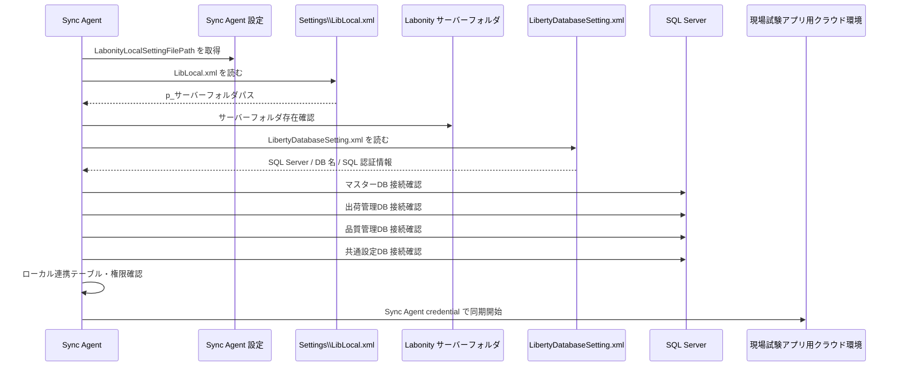
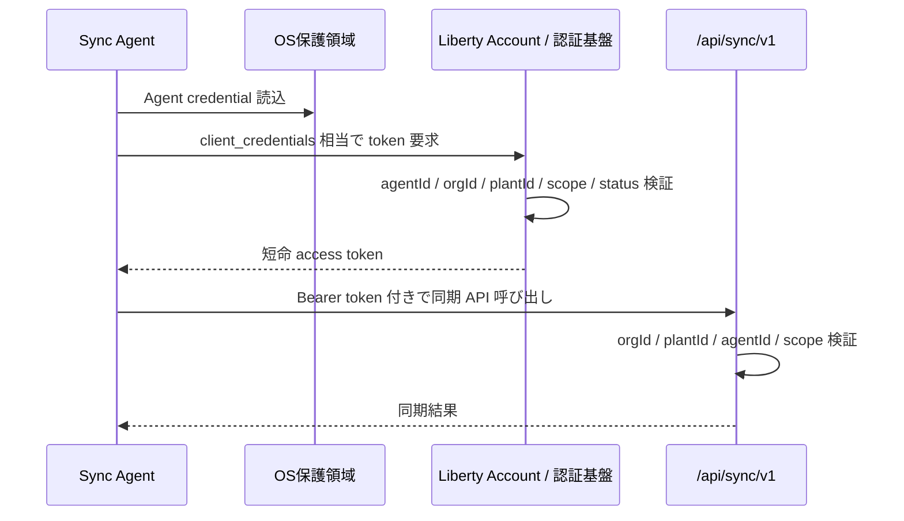
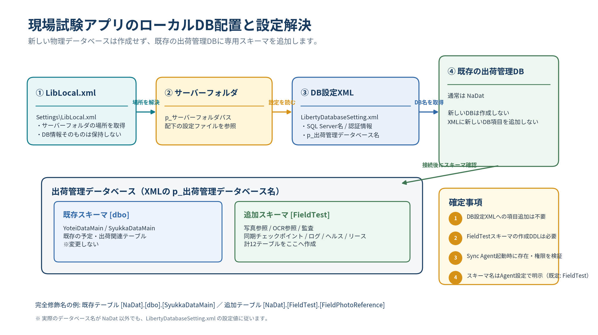

# 現場試験アプリ 詳細仕様書 第5分冊

**写真エクスポート・Sync Agent設定・Agent認証・出荷管理DB・FieldTestスキーマ DDL方針**

| **項目** | **内容**                                                                                                                                                                                                                                             |
|----------|------------------------------------------------------------------------------------------------------------------------------------------------------------------------------------------------------------------------------------------------------|
| 版       | v2.2                                                                                                                                                                                                                                                 |
| 状態     | 完成版                                                                                                                                                                                                                                               |
| 作成日   | 2026-06-22                                                                                                                                                                                                                                           |
| 収録章   | 19〜22章                                                                                                                                                                                                                                             |
| 収録内容 | 19\. ローカル写真自動保存・出荷別JPEGエクスポート詳細設計20. Sync Agent サーバー配置・LibLocal.xml 起点DB接続・写真保存パス指定詳細設計21. Sync Agent 非人間主体認証・Agent credential 詳細設計22. 出荷管理DB FieldTestスキーマ追加テーブル DDL 方針 |
| 読者     | 開発、QA、セキュリティ、運用、DB担当                                                                                                                                                                                                                 |

> 本分冊は、提供された設計仕様の該当範囲を、省略せず収録しています。表、コード、JSON、SQL、受入条件、Mermaid定義を含みます。

## 19. ローカル写真自動保存・出荷別JPEGエクスポート詳細設計

### 19.1 結論

現場アプリで撮影された写真は、クラウド Blob Storage への保存を完了した後、Sync Agent がローカル環境へ自動保存する。Labonity デスクトップアプリは、Sync Agent と通信せず、ローカルDBに保存されたパスを使って JPEG ファイルを直接参照する。

```text
現場アプリ
  -> 写真 upload-session
  -> Blob PUT
  -> 写真 commit
  -> PhotoReferenceEvent
  -> Sync Agent がイベント取得
  -> FieldPhotoReference 更新
  -> FieldPhotoMaterializeJob 登録
  -> Blob から写真取得
  -> JPEG 正規化
  -> 出荷別フォルダへ atomic write
  -> FieldPhotoLocalFile 更新
  -> Labonity はローカルDB + ローカルファイルだけを参照
```

この方式では、Labonity デスクトップアプリにクラウド通信機能やローカルエージェント呼び出し機能を追加しない。既存のデスクトップアプリに近い実装感として、DB検索とファイルパス参照だけで写真を扱える。

### 19.2 採用方式

採用する方式は **Sync Agent によるローカル写真マテリアライズ方式**である。

| **方式**                                            | **採否** | **理由**                                                                                                          |
|-----------------------------------------------------|----------|-------------------------------------------------------------------------------------------------------------------|
| Labonity がクラウド API から写真URLを取得           | 不採用   | Labonity デスクトップアプリにクラウド認証・API 呼び出しを持たせない方針に反する。                                 |
| Labonity が Sync Agent の localhost HTTP API を呼ぶ | 不採用   | HTTP 依存が残り、エージェント停止時の画面待ちやセキュリティ境界が複雑になる。                                     |
| Labonity が Named Pipe で Sync Agent に依頼         | 不採用   | 実装・権限・障害調査が複雑になる。ユーザー要望の「ローカルDB/ファイル操作」に合わない。                           |
| Labonity がクラウド Blob を直接開く                 | 不採用   | SAS URL 管理が Labonity 側に必要になる。                                                                          |
| Sync Agent が事前にローカルDBと指定フォルダへ保存   | 採用     | Labonity はローカルDBとファイルだけを参照できる。画面表示が単純で、オフライン・台帳・バックアップにも使いやすい。 |

### 19.3 保存対象

| **写真種別**            | **ローカル保存** | **優先度** | **備考**                                          |
|-------------------------|------------------|------------|---------------------------------------------------|
| OCR取込用黒板写真       | 必須             | 高         | OCR確認画面で使うため、最優先で保存する。         |
| OCR取込用黒板サムネイル | 必須             | 高         | 一覧や確認画面で使う。                            |
| 通常写真                | 必須             | 中         | 現場状況、測定状況、補足写真を出荷別に保存する。  |
| 通常写真サムネイル      | 推奨             | 中         | 一覧表示を高速化する。                            |
| メタデータ JSON / CSV   | 推奨             | 低         | 人手確認、障害調査、バックアップ復旧に利用する。  |
| OCR結果 JSON            | 任意             | 低         | OCR確認画面はDBを正とする。ファイル出力は調査用。 |

### 19.4 ローカル保存タイミング

| **タイミング**               | **処理**                                                                         |
|------------------------------|----------------------------------------------------------------------------------|
| PhotoReferenceEvent 取得直後 | FieldPhotoReference を更新し、FieldPhotoMaterializeJob を登録する。              |
| OCR取込用黒板写真 commit 後  | 優先度を高くして即時取得対象にする。OCR結果確認時に画像がない状況を減らす。      |
| 通常写真 commit 後           | 1〜5分周期で順次取得する。大量写真時はバックグラウンドで平準化する。             |
| OcrResultEvent 取得後        | OCR結果と同時に OCR黒板写真が未保存であれば最優先で再キューする。                |
| 夜間                         | 当日・前日分の未取得、失敗、ハッシュ不一致を再検証する。                         |
| 手動再同期                   | 指定日付、指定 syukka_id、指定 photo_asset_id で再エクスポートできるようにする。 |

### 19.5 ファイル書き込み手順

ファイル破損や途中読み込みを避けるため、Sync Agent は次の順序で書き込む。

```text
1. 出力先フォルダを作成する。
2. .tmp 拡張子で一時ファイルを書き込む。
3. 書き込み後にサイズと sha256 を確認する。
4. 同一ディレクトリ内で .jpg へ atomic rename する。
5. FieldPhotoLocalFile を ready に更新する。
6. manifest を最後に更新する。
```

Labonity は materialize_status = ready の行だけを表示対象にする。.tmp ファイルは表示しない。

### 19.6 フォルダ分類設計

分類の正本キーは syukka_id である。フォルダ名は人が見ても分かりやすくするが、内部判定ではフォルダ名に依存しない。

推奨階層:

```text
{Root}
  {plantId}
    {shippingDate:yyyyMMdd}
      {siteNameSafe}_{fieldSiteId8}
        Y{scheduleNo}_{yoteiId8}
          S{seqNo}_{shippingTimeHHmm}_{vehicleNoSafe}_{syukkaId8}
            01_通常写真
            02_OCR黒板
            90_サムネイル
            99_メタデータ
```

分類キー:

| **階層**                                   | **目的**                       | **注意**                               |
|--------------------------------------------|--------------------------------|----------------------------------------|
| plantId                                    | 工場混線防止。                 | 予定Noが同一でも工場が違えば分離する。 |
| shippingDate                               | 日付単位の検索・バックアップ。 | 出荷日を使用する。                     |
| siteNameSafe_fieldSiteId8                  | 現場名で探しやすくする。       | 現場名は切り詰め、IDを付ける。         |
| Y{scheduleNo}\_{yoteiId8}                  | 予定単位でまとめる。           | 予定Noだけに依存しない。               |
| S{seqNo}\_{time}\_{vehicleNo}\_{syukkaId8} | 出荷実績単位で写真をまとめる。 | 最終的な識別子は syukka_id。           |

### 19.7 ファイル命名設計

ファイル名は変更に強くするため、表示順や代表写真変更だけではリネームしない。

```text
{takenAt:yyyyMMdd_HHmmss}_{purpose}_{photoAssetId8}.jpg
{takenAt:yyyyMMdd_HHmmss}_{purpose}_{photoAssetId8}_thumb.jpg
```

purpose の例:

| **capture_purpose**       | **purpose 文字列** | **保存先**  |
|---------------------------|--------------------|-------------|
| general                   | general            | 01_通常写真 |
| fresh_test_ocr_blackboard | ocr_blackboard     | 02_OCR黒板  |

同一秒に複数枚撮影しても、photoAssetId8 により衝突を防ぐ。

### 19.8 JPEG 正規化仕様

| **項目**         | **方針**                                                                                                 |
|------------------|----------------------------------------------------------------------------------------------------------|
| 拡張子           | .jpg。                                                                                                   |
| MIME             | image/jpeg。                                                                                             |
| 色空間           | sRGB に正規化する。                                                                                      |
| EXIF orientation | 画像ピクセルへ反映し、表示時に回転不要な状態にする。                                                     |
| JPEG quality     | 初期値 90。設定変更可能。                                                                                |
| 原本サイズ       | 初期設定では原寸維持。容量制約がある場合のみ max_original_long_side で縮小可能。                         |
| サムネイル       | 長辺 640px を初期値とする。                                                                              |
| メタデータ       | 個人情報や不要な端末EXIFは削除または最小化する。撮影日時等の業務上必要な情報は DB / sidecar に保持する。 |

### 19.9 manifest 出力

出荷フォルダの 99_メタデータ に manifest を出力する。

shipment_manifest.json 例:

```json
{
  "schemaVersion": "labonity.fieldPhotoExport.v1",
  "tenantId": "ORG-001",
  "plantId": "KOZYO-001",
  "syukkaId": "SYUKKA-LOCAL-GUID",
  "shipmentId": "SHIPMENT-CLOUD-ID",
  "shippingDate": "2026-06-10",
  "shippingTime": "10:30",
  "vehicleNo": "12",
  "scheduleNo": 120,
  "siteName": "○○マンション新築工事",
  "exportedAt": "2026-06-10T10:36:00+09:00",
  "photos": [
    {
      "photoAssetId": "PHOTO-001",
      "capturePurpose": "general",
      "takenAt": "2026-06-10T10:31:12+09:00",
      "file": "01_通常写真\\20260610_103112_general_PHOTO001A.jpg",
      "thumbnail": "90_サムネイル\\20260610_103112_general_PHOTO001A_thumb.jpg",
      "sha256": "sha256:...",
      "isPrimary": true,
      "deleted": false
    }
  ]
}
```

manifest は補助情報であり、Labonity の通常画面は DB を正とする。DB障害時の調査や写真フォルダ単体での確認に使用する。

### 19.10 Labonity 実装ルール

Labonity デスクトップアプリ側の実装ルールは次の通りである。

```text
1. syukka_id をキーに FieldPhotoReference を検索する。
2. FieldPhotoLocalFile から original_jpeg / thumbnail_jpeg の ready 行を取得する。
3. local_file_path が存在するか確認する。
4. 存在する場合は通常ファイルとして画像を開く。
5. 存在しない場合は、ローカルDBの status を表示する。
6. Sync Agent に対する HTTP / Named Pipe / IPC 呼び出しは行わない。
```

画面表示例:

```text
写真: 3枚
  1. 通常写真 2026/06/10 10:31 保存済
  2. OCR黒板  2026/06/10 10:32 保存済 / OCR済
  3. 通常写真 2026/06/10 10:34 ローカル保存待ち
```

### 19.11 Sync Agent の設定例

appsettings.json 例:

```json
{
  "Labonity": {
    "InstallMode": "Server",
    "LocalSettingFilePath": "C:\\Labonity\\Settings\\LibLocal.xml",
    "DatabaseSettingFileName": "LibertyDatabaseSetting.xml",
    "FailIfSettingMissing": true,
    "FailIfDatabaseConnectionFailed": true,
    "ReloadOnSettingChanged": false
  },
  "FieldPhotoExport": {
    "Enabled": true,
    "WriterRootPath": "D:\\LabonityFieldPhotos",
    "LabonityVisibleRootPath": "\\\\labonity-server\\LabonityFieldPhotos",
    "RequireUncVisiblePathForMultiClient": true,
    "FolderTemplate": "{plantId}\\{shippingDate:yyyyMMdd}\\{siteNameSafe}_{fieldSiteId8}\\Y{scheduleNo}_{yoteiId8}\\S{seqNo}_{shippingTimeHHmm}_{vehicleNoSafe}_{syukkaId8}",
    "FileNameTemplate": "{takenAt:yyyyMMdd_HHmmss}_{purpose}_{photoAssetId8}.jpg",
    "IncludeGeneralOriginal": true,
    "IncludeOcrOriginal": true,
    "IncludeThumbnail": true,
    "IncludeMetadataJson": true,
    "JpegQuality": 90,
    "ThumbnailLongSide": 640,
    "MaxOriginalLongSide": null,
    "MaxFullPathLength": 240,
    "MaxParallelDownloads": 2,
    "Retry": {
      "MaxAttempts": 10,
      "InitialDelaySeconds": 30,
      "MaxDelayMinutes": 30
    },
    "DeletePolicy": "keep_with_deleted_marker",
    "RetentionDays": 3650
  }
}
```

WriterRootPath は Sync Agent が実際に書き込むパスである。LabonityVisibleRootPath は Labonity クライアントが画像を開くために FieldPhotoLocalFile.local_file_path へ保存するパスである。複数クライアント構成では LabonityVisibleRootPath を UNC 共有パスにする。単一サーバー・単一端末構成では両者を同一パスにしてもよい。

### 19.12 セキュリティ

| **項目**     | **方針**                                                                                     |
|--------------|----------------------------------------------------------------------------------------------|
| 認証情報     | Labonity デスクトップアプリはクラウドトークン、Sync Agent credential、SAS URL を保持しない。 |
| 出力先権限   | Sync Agent サービスアカウントは書込可、Labonity ユーザーは読取可を基本にする。               |
| URL          | ローカルDBには Blob の直接閲覧URLや SAS URL を保存しない。                                   |
| 改ざん検知   | sha256_hash と verified_at を保持し、定期検証できるようにする。                              |
| 共有フォルダ | SMB 共有等を使う場合も、Labonity はファイル共有上の JPEG を読むだけにする。                  |
| 削除         | 業務監査のため論理削除とし、保持期間後の物理削除を Sync Agent が行う。                       |

### 19.13 非機能目標

| **項目**                  | **初期目標**                                                     |
|---------------------------|------------------------------------------------------------------|
| OCR黒板写真のローカル保存 | commit 後 1 分以内を目標。通信状況により遅延可。                 |
| 通常写真のローカル保存    | commit 後 5 分以内を目標。大量写真時は順次処理。                 |
| JPEG 変換失敗再試行       | 最大 10 回、指数バックオフ。                                     |
| 出力先フォルダ容量監視    | 残容量 10GB 未満または 10% 未満で警告。                          |
| ファイル検証              | 当日分は 5〜30分周期、過去分は夜間にサンプリングまたは差分検証。 |
| 手動再エクスポート        | 指定日、指定 syukka_id、指定 photo_asset_id に対応。             |

### 19.14 実装順序

| **フェーズ** | **内容**                                                                       | **完了条件**                                   |
|--------------|--------------------------------------------------------------------------------|------------------------------------------------|
| P1           | FieldPhotoLocalFile / FieldPhotoMaterializeJob / FieldPhotoExportConfig 追加。 | テーブル作成、基本 CRUD、設定読込ができる。    |
| P2           | Sync Agent で PhotoReferenceEvent から MaterializeJob を作成。                 | 写真メタデータ同期後、ジョブが登録される。     |
| P3           | Blob ダウンロード、JPEG 正規化、atomic write。                                 | 指定フォルダへ JPEG とサムネイルが生成される。 |
| P4           | Labonity 側でローカルDBのパスから写真表示。                                    | HTTP / Named Pipe なしで画像表示できる。       |
| P5           | 削除、差し替え、代表変更、表示順変更、manifest 更新。                          | 状態変更がローカルDBと manifest に反映される。 |
| P6           | 再試行、容量不足、権限不足、パス長超過、改ざん検知。                           | エラー復旧と運用ログが確認できる。             |

### 19.15 ローカル写真自動保存のルール

```text
写真本体はクラウドでは Blob Storage に保存し、DB に Base64 保存しない。
Sync Agent は commit 済み写真をローカル指定フォルダへ出荷別 JPEG として自動保存する。
通常写真もローカル写真自動保存の対象にする。
OCR取込用黒板写真は最優先でローカル保存する。
Labonity デスクトップアプリはローカルDBから写真ファイルパスを取得する。
Labonity デスクトップアプリはローカルファイルシステムから JPEG を直接開く。
Labonity デスクトップアプリはクラウド API、Sync Agent ローカル API、HTTP、Named Pipe、gRPC、TCP ソケット等を使用しない。
ファイルの生成状態、パス、ハッシュ、エラーは FieldPhotoLocalFile に保存する。
出荷別フォルダは syukka_id を正本キーとして生成し、フォルダ名だけで業務判定しない。
削除・差し替え・代表変更・表示順変更は DB と manifest に反映し、ファイル名変更は最小限にする。
```

## 20. Sync Agent サーバー配置・LibLocal.xml 起点DB接続・写真保存パス指定詳細設計

### 20.1 結論

Labonity はクライアントサーバーシステムであるため、Sync Agent は本番運用では **Labonity サーバーにインストールする**ことを標準ルールとする。クライアント PC ごとに Sync Agent をインストールすると、同期の二重実行、写真ファイルの分散、DB 接続設定のばらつき、サービス停止検知の難しさが発生するため、初期リリースではサーバー配置を前提にする。

また、Sync Agent は DB 接続情報を独自に二重管理しない。管理者は Sync Agent 設定で Labonity の Settings\LibLocal.xml のパスを指定する。Sync Agent はこのファイルから Labonity サーバーフォルダを読み取り、サーバーフォルダ配下の LibertyDatabaseSetting.xml から SQL Server 接続情報と DB 名を取得する。

写真保存先は DB 接続設定とは分離し、Sync Agent 設定で指定できるようにする。複数の Labonity クライアントから写真を参照する場合は、Labonity 側に保存する写真パスを UNC 共有パスにする。

```text
Sync Agent 設定
  -> LabonityLocalSettingFilePath = C:\Labonity\Settings\LibLocal.xml
  -> LibLocal.xml を読む
  -> p_サーバーフォルダパス を取得
  -> {p_サーバーフォルダパス}\LibertyDatabaseSetting.xml を読む
  -> SQL Server / DB 名を解決
  -> 必要 DB へ接続
  -> 写真は WriterRootPath へ出力
  -> Labonity 参照用パスは LabonityVisibleRootPath として DB に保存
```

### 20.2 Sync Agent の配置ルール

| **項目**                               | **方針**                                                                                                                  |
|----------------------------------------|---------------------------------------------------------------------------------------------------------------------------|
| 本番配置                               | Labonity サーバーにインストールする。                                                                                     |
| クライアント PC 配置                   | 原則禁止。Labonity クライアント PC ごとに Sync Agent を入れない。                                                         |
| サーバーの意味                         | SQL Server、Labonity サーバーフォルダ、写真出力先フォルダへ安定してアクセスできるサーバー。                               |
| DBサーバーとファイルサーバーが別の場合 | 両方へ安定アクセスできるサーバー側端末に配置する。DBサーバーそのものに限定しない。                                        |
| 単一PC構成                             | Labonity サーバーとクライアントが同一 PC の小規模構成では同一 PC へ配置してよい。ただし運用分類はサーバー配置として扱う。 |
| インストール単位                       | tenant_id + plant_id を基本単位とする。複数工場を 1 台のサーバーで扱う場合は、工場ごとの設定と checkpoint を分離する。    |
| 二重稼働                               | 同一 tenant_id + plant_id に対して有効な Sync Agent は 1 つとする。二重起動検知を実装する。                               |
| 起動方式                               | Windows Service として自動起動する。障害時の自動再起動を設定する。                                                        |
| 権限                                   | 専用サービスアカウントを推奨する。ローカル管理者で常用しない。                                                            |

### 20.3 サーバー配置を標準にする理由

| **観点**           | **サーバー配置の利点**                                                            |
|--------------------|-----------------------------------------------------------------------------------|
| 常時稼働           | クライアント PC の電源 OFF、ログオフ、スリープに影響されにくい。                  |
| DB 接続安定性      | SQL Server と同じネットワーク内で安定した接続を確保しやすい。                     |
| 写真ファイル一元化 | 写真 JPEG が端末ごとに分散せず、共有フォルダまたはサーバーディスクへ集約できる。  |
| 二重同期防止       | クライアントごとのエージェントが同じデータを同期する事故を避けられる。            |
| 設定管理           | LibLocal.xml とサーバーフォルダを 1 箇所で参照できる。                            |
| 監視               | Sync Agent の稼働状況、エラー、未処理ジョブ、容量不足をサーバー側で監視しやすい。 |
| セキュリティ       | SQL 接続情報やクラウド credential をクライアント PC に配布しなくて済む。          |

### 20.4 Labonity 設定ファイルの解決方式

Sync Agent 設定では、Labonity の Settings\LibLocal.xml を指定する。

例:

```xml
<?xml version="1.0"?>
<BasicServerFolder xmlns:xsi="http://www.w3.org/2001/XMLSchema-instance" xmlns:xsd="http://www.w3.org/2001/XMLSchema">
  <p_サーバーフォルダパス>\\100.83.34.90\LabonityDat</p_サーバーフォルダパス>
</BasicServerFolder>
```

この p_サーバーフォルダパス が Labonity のサーバーフォルダである。Sync Agent はこのフォルダ配下から LibertyDatabaseSetting.xml を読む。

```text
C:\Labonity\Settings\LibLocal.xml
  -> p_サーバーフォルダパス = \\100.83.34.90\LabonityDat
  -> \\100.83.34.90\LabonityDat\LibertyDatabaseSetting.xml
```

### 20.5 LibertyDatabaseSetting.xml から取得する DB 設定

LibertyDatabaseSetting.xml から取得する項目は次の通りである。

| **項目**                 | **用途**                                                                                 |
|--------------------------|------------------------------------------------------------------------------------------|
| p_SQLプロバイダー名      | Labonity 側の DB プロバイダー識別。Sync Agent では SQL Server 接続の参考情報として扱う。 |
| p_SQLサーバー名          | SQL Server 名。                                                                          |
| p_SQLユーザーID          | SQL Server ログインユーザー。                                                            |
| p_SQLパスワード          | SQL Server パスワード。ログ出力禁止。                                                    |
| p_マスターデータベース名 | 現場マスター等の参照元。通常 MSDAT。                                                     |
| p_出荷管理データベース名 | 予定・出荷実績の参照元。通常 NADAT。                                                     |
| p_品質管理データベース名 | TP採取結果の参照元。通常 EXDAT。写真・OCRのローカル連携テーブルは配置しない。            |
| p_販売管理データベース名 | 必要な場合のみ使用。                                                                     |
| p_動荷重データベース名   | 必要な場合のみ使用。                                                                     |
| p_共通設定データベース名 | 工場、共通設定、管理情報の参照元。通常 LIBERTYSETTINGS。                                 |

Sync Agent は、DB 接続文字列を生成した後、少なくとも次を検証する。

| **DB**     | **検証対象例**                                                                                              |
|------------|-------------------------------------------------------------------------------------------------------------|
| マスターDB | Genba, Genba_Syukka 等の参照可否。                                                                          |
| 出荷管理DB | YoteiDataMain, SyukkaDataMain 等の参照可否。                                                                |
| 品質管理DB | TestPieceSaisyu\_\*, FieldPhotoReference, FieldPhotoLocalFile, FieldOcrResultReference 等の参照・更新可否。 |
| 共通設定DB | 工場・設定情報の参照可否。                                                                                  |

### 20.6 DB 接続解決シーケンス



### 20.7 フォールバック禁止

Labonity 既存実装では、設定ファイルが見つからない場合に既定値を使う箇所がある。しかし Sync Agent では、誤った DB へ同期するリスクを避けるため、既定値へのフォールバックを禁止する。

| **状態**                                | **Sync Agent の処理**                  |
|-----------------------------------------|----------------------------------------|
| LabonityLocalSettingFilePath 未設定     | 起動エラー。同期しない。               |
| LibLocal.xml が存在しない               | 起動エラー。同期しない。               |
| p_サーバーフォルダパス が空             | 起動エラー。同期しない。               |
| サーバーフォルダへアクセスできない      | 起動エラーまたは同期停止。             |
| LibertyDatabaseSetting.xml が存在しない | 起動エラー。同期しない。               |
| SQLサーバー名またはDB名が空             | 起動エラー。同期しない。               |
| DB接続失敗                              | 同期停止。管理ログに記録する。         |
| 必要テーブルなし                        | マイグレーション対象または起動エラー。 |
| 権限不足                                | 同期停止。管理者確認対象。             |

### 20.8 写真保存フォルダのパス指定

写真保存先は Sync Agent 設定で指定する。固定パスにはしない。

| **設定項目**                        | **内容**                                                                           |
|-------------------------------------|------------------------------------------------------------------------------------|
| WriterRootPath                      | Sync Agent が実際に JPEG を書き込むルートパス。ローカルディスクまたは UNC パス。   |
| LabonityVisibleRootPath             | Labonity クライアントが画像を開くためのルートパス。複数端末運用では UNC 共有パス。 |
| FolderTemplate                      | 出荷別フォルダの命名規則。                                                         |
| FileNameTemplate                    | JPEG ファイル名の命名規則。                                                        |
| RequireUncVisiblePathForMultiClient | 複数クライアント運用時に UNC 共有パスを必須にするか。                              |

推奨設定:

```json
{
  "FieldPhotoExport": {
    "WriterRootPath": "D:\\LabonityFieldPhotos",
    "LabonityVisibleRootPath": "\\\\labonity-server\\LabonityFieldPhotos",
    "RequireUncVisiblePathForMultiClient": true
  }
}
```

この場合、Sync Agent は D:\LabonityFieldPhotos に書き込み、DB には Labonity クライアントが読める \\labonity-server\LabonityFieldPhotos\\.. を保存する。

単一 PC 構成では次のように同一パスでもよい。

```json
{
  "FieldPhotoExport": {
    "WriterRootPath": "D:\\LabonityFieldPhotos",
    "LabonityVisibleRootPath": "D:\\LabonityFieldPhotos",
    "RequireUncVisiblePathForMultiClient": false
  }
}
```

### 20.9 FieldPhotoLocalFile のパス項目

FieldPhotoLocalFile には、Sync Agent 用の書込パスと Labonity 用の参照パスを分けて保存できるようにする。

| **項目**          | **説明**                                                                  |
|-------------------|---------------------------------------------------------------------------|
| writer_file_path  | Sync Agent が実際に書き込んだファイルパス。サーバーローカルパスでもよい。 |
| local_file_path   | Labonity が参照するファイルパス。複数クライアント運用では UNC パス。      |
| writer_root_path  | 出力時点の WriterRootPath。                                               |
| visible_root_path | 出力時点の LabonityVisibleRootPath。                                      |
| relative_path     | ルートからの相対パス。ルート変更時の再マッピングに使う。                  |
| path_kind         | local_disk / unc。                                                        |
| path_status       | ready / missing / inaccessible / moved。                                  |

Labonity は local_file_path を使用する。writer_file_path は Sync Agent の再検証、再エクスポート、削除処理に使用する。

### 20.10 Sync Agent 起動時ヘルスチェック

Sync Agent 起動時に、同期開始前のヘルスチェックを行う。

| **No** | **チェック**                                                 | **失敗時**                       |
|--------|--------------------------------------------------------------|----------------------------------|
| 1      | LabonityLocalSettingFilePath が設定されている。              | 起動エラー。                     |
| 2      | LibLocal.xml が存在し、XML として読める。                    | 起動エラー。                     |
| 3      | p_サーバーフォルダパス が取得できる。                        | 起動エラー。                     |
| 4      | サーバーフォルダへアクセスできる。                           | 起動エラー。                     |
| 5      | LibertyDatabaseSetting.xml が存在し、XML として読める。      | 起動エラー。                     |
| 6      | SQL Server 接続情報と DB 名が揃っている。                    | 起動エラー。                     |
| 7      | 各 DB へ接続できる。                                         | 同期停止。                       |
| 8      | 必要テーブルが存在する、またはマイグレーション可能。         | 同期停止。                       |
| 9      | 写真 WriterRootPath へ書き込める。                           | 写真エクスポート停止。           |
| 10     | LabonityVisibleRootPath が複数クライアント向けに妥当である。 | 警告または写真エクスポート停止。 |
| 11     | 空き容量がしきい値以上である。                               | 警告または写真エクスポート停止。 |
| 12     | 同一 tenant_id + plant_id の他 Sync Agent が active でない。 | 同期停止。                       |
| 13     | クラウド Sync Agent credential が有効である。                | クラウド同期停止。               |

### 20.11 二重起動防止

サーバー配置を標準にしても、誤って別サーバーまたはクライアント PC に Sync Agent がインストールされる可能性がある。そのため、二重起動防止を実装する。

| **方式**           | **内容**                                                                                          |
|--------------------|---------------------------------------------------------------------------------------------------|
| ローカル DB リース | FieldSyncAgentLease に tenant_id + plant_id + agent_id + machine_name + heartbeat_at を保存する。 |
| クラウド heartbeat | クラウド側にも agent heartbeat を送り、同一スコープの複数 active を検知する。                     |
| 起動時判定         | 他 agent の heartbeat が有効期限内なら起動を拒否する。                                            |
| 手動解除           | 管理者が停止済み agent の lease を解除できる。                                                    |
| 強制起動           | 障害時のみ管理者権限で強制起動できる。強制起動は監査ログに残す。                                  |

### 20.12 サービスアカウントと権限

Sync Agent は専用サービスアカウントで実行することを推奨する。

| **対象**                     | **必要権限**                                                                                  |
|------------------------------|-----------------------------------------------------------------------------------------------|
| Settings\LibLocal.xml        | 読み取り。                                                                                    |
| Labonity サーバーフォルダ    | 読み取り。                                                                                    |
| LibertyDatabaseSetting.xml   | 読み取り。                                                                                    |
| SQL Server                   | 参照データ読み取り、連携テーブルの作成・更新・参照。可能なら同期専用 SQL ユーザーを用意する。 |
| 写真 WriterRootPath          | 作成、書き込み、リネーム、削除または論理削除マーカー作成。                                    |
| 写真 LabonityVisibleRootPath | Labonity クライアント利用者が読み取り可能。Sync Agent も到達確認できることが望ましい。        |
| ログフォルダ                 | 書き込み。                                                                                    |

SQL パスワードやクラウド credential は Labonity クライアント PC に配布しない。

### 20.13 セキュリティルール

```text
LibertyDatabaseSetting.xml の内容をログへ出力しない。
接続文字列をログへ出す場合、Password は必ずマスクする。
Sync Agent 管理画面でも SQL パスワードは表示しない。
LibLocal.xml のパスとサーバーフォルダパスは表示してよいが、共有権限に注意する。
Sync Agent credential はサーバー上で保護し、Labonity デスクトップアプリには渡さない。
写真出力先は改ざん防止のため、Sync Agent は書込、Labonity 利用者は読取を基本にする。
```

### 20.14 管理画面・診断表示

Sync Agent 管理画面または診断ログでは、次を確認できるようにする。

| **表示項目**     | **内容**                                                      |
|------------------|---------------------------------------------------------------|
| Agent 状態       | running / stopped / degraded / error。                        |
| インストール先   | machine name、service account、install mode。                 |
| LibLocal.xml     | 指定パス、存在確認、最終読込日時。                            |
| サーバーフォルダ | 解決された p_サーバーフォルダパス、到達可否。                 |
| DB 設定          | SQL Server 名、DB 名。パスワードは表示しない。                |
| DB 接続          | マスターDB、出荷管理DB、品質管理DB、共通設定DBの接続結果。    |
| 写真出力         | WriterRootPath、LabonityVisibleRootPath、書込可否、空き容量。 |
| 同期状況         | 最終同期時刻、checkpoint、未処理イベント数、失敗数。          |
| 写真ジョブ       | 未処理、処理中、失敗、再試行待ち、最終エラー。                |
| 二重起動         | lease 状態、heartbeat、他 agent 検知状況。                    |
| クラウド接続     | credential 有効性、最終 API 成功時刻。                        |

### 20.15 運用手順

初期設定の標準手順は次の通りである。

```text
1. Labonity サーバーを確認する。
2. Sync Agent を Labonity サーバーへインストールする。
3. Sync Agent 専用サービスアカウントを設定する。
4. Sync Agent 設定で LabonityLocalSettingFilePath を指定する。
5. Sync Agent が LibLocal.xml からサーバーフォルダを読めることを確認する。
6. LibertyDatabaseSetting.xml から DB 接続情報を解決できることを確認する。
7. 写真保存先 WriterRootPath を指定する。
8. 複数クライアント運用の場合、LabonityVisibleRootPath に UNC 共有パスを指定する。
9. クラウド同期用 credential を設定する。
10. 起動時ヘルスチェックを実行する。
11. 当日・翌日分の予定・出荷実績同期を確認する。
12. テスト写真を撮影し、出荷別 JPEG が生成され、Labonity から開けることを確認する。
```

### 20.16 障害時の扱い

| **障害**                         | **処理**                                                                             |
|----------------------------------|--------------------------------------------------------------------------------------|
| サーバー再起動                   | Windows Service 自動起動。checkpoint から再開する。                                  |
| LibLocal.xml 参照不可            | 同期停止。管理者に設定確認を促す。                                                   |
| サーバーフォルダ参照不可         | 同期停止。共有権限またはネットワーク確認。                                           |
| DB接続不可                       | 同期停止。一定間隔で再試行し、管理ログに出す。                                       |
| 写真出力先書込不可               | 写真エクスポート停止。メタデータ同期と OCR結果同期は継続可能にするか設定で選択する。 |
| LabonityVisibleRootPath 到達不可 | 警告。複数クライアント運用では写真表示不可になるため管理者確認対象。                 |
| 容量不足                         | 写真エクスポート停止または古いキャッシュ整理。クラウド Blob を正本として保持する。   |
| 二重 agent 検知                  | 後から起動した agent を停止する。                                                    |
| DB 設定変更                      | Sync Agent 再起動または手動再読込後、全ヘルスチェックを再実行する。                  |

### 20.17 Sync Agent 配置・DB 接続解決のルール

```text
Sync Agent は本番運用では Labonity サーバーにインストールする。
Labonity クライアント PC ごとの Sync Agent インストールは行わない。
Sync Agent は Labonity の Settings\LibLocal.xml を起点に DB 接続情報を解決する。
Sync Agent は LibLocal.xml から p_サーバーフォルダパスを読み、サーバーフォルダ配下の LibertyDatabaseSetting.xml を読む。
Sync Agent は設定ファイル不足や DB 接続失敗時に既定値へフォールバックしない。
写真保存先は Sync Agent 設定で指定する。
複数 Labonity クライアントで写真を見る場合、Labonity が参照する local_file_path は UNC 共有パスを標準にする。
Sync Agent は writer_file_path と Labonity 用 local_file_path を分離して管理できる。
同一 tenant_id + plant_id に対して有効な Sync Agent は 1 つに制御する。
本設計の Blob Storage、OCR事前実行、ローカルDB参照、HTTP / Named Pipe 非使用、出荷別 JPEG 自動保存の方針は維持する。
```

## 21. Sync Agent 非人間主体認証・Agent credential 詳細設計

### 21.1 結論

現場試験 Web アプリは Liberty Account の個人認証を使用する。一方、Labonity サーバーに常駐する Sync Agent は、個人アカウントではなく **Agent credential** によって認証する。

```text
React Web アプリ
  -> 個人ログイン
  -> accountId / orgId / Grant / Role / permission
  -> /api/core/v1/... を利用

Sync Agent
  -> 非対話認証
  -> orgId / plantId / agentId / scope
  -> /api/sync/v1/... のみ利用

Labonity デスクトップ
  -> クラウド認証なし
  -> ローカルDB + ローカル写真ファイルのみ参照
```

この分離により、常駐サービスが個人 refresh token に依存して停止するリスク、退職・異動・パスワード変更・MFA によって同期が止まるリスク、誰の操作か分からない監査リスクを避ける。

### 21.2 認証主体の定義

| **認証主体** | **例**           | **用途**                                                                | **禁止事項**                                           |
|--------------|------------------|-------------------------------------------------------------------------|--------------------------------------------------------|
| accountId    | account:USER-001 | Web アプリ利用者。予定・出荷・写真の閲覧、写真登録、管理操作。          | サーバー常駐 Sync Agent の認証には使用しない。         |
| agentId      | agent:AGENT-001  | Labonity サーバー上の Sync Agent。DB同期、イベント取得、写真取得、ACK。 | 現場アプリ画面 API や管理 API を任意に呼び出させない。 |
| orgId        | ORG-001          | テナント・組織スコープ。                                                | 組織そのものをログイン主体にしない。                   |
| plantId      | KOZYO-001        | 工場スコープ。予定No・出荷No混線を防ぐ。                                | agent に許可されていない plantId の同期をさせない。    |

### 21.3 Agent credential の構成

認証基盤の実装に合わせ、Agent credential は次のいずれかの形で実装できる。

| **方式**                         | **内容**                                                                                  | **初期リリース適性**                       |
|----------------------------------|-------------------------------------------------------------------------------------------|--------------------------------------------|
| client_id + client_secret        | Client Credentials 相当。実装しやすい。secret 保護とローテーションが必要。                | 高い。標準候補。                           |
| 初回登録コード + credential 引換 | 管理者が短時間・一回限りの登録コードを発行し、Sync Agent が正式 credential に引き換える。 | 高い。初期設定を簡単にできる。             |
| クライアント証明書 / mTLS        | agent と証明書を紐づける。セキュリティは高いが証明書管理が必要。                          | 将来拡張。                                 |
| 固定 API key 直接送信            | 各同期 API に API key を直接付ける。                                                      | 標準採用しない。例外的な暫定運用も避ける。 |

本設計では、実装方式にかかわらず次を満たすものを Agent credential と呼ぶ。

```text
agentId に紐づく。
orgId + plantId に紐づく。
許可 scope を持つ。
発行、失効、再発行、ローテーションできる。
監査できる。
同期 API へ直接恒久利用するのではなく、短命 access token を取得するために使う。
```

### 21.4 Agent registration

クラウド側には Agent registration を持たせる。

テーブル名例: SyncAgentRegistration

| **項目**                | **説明**                                                      |
|-------------------------|---------------------------------------------------------------|
| agent_id                | Agent ID。                                                    |
| tenant_id               | orgId。                                                       |
| plant_id                | 工場 ID。                                                     |
| agent_name              | 管理画面表示名。例: ABC本社 Labonity Server Sync Agent。      |
| install_machine_name    | インストール先サーバー名。初期登録時または heartbeat で記録。 |
| install_mode            | labonity_server / single_pc / migration 等。                  |
| allowed_scopes          | FieldTest.Sync.Import 等。                                    |
| status                  | active / disabled / revoked / pending_setup。                 |
| registered_by           | 登録した管理者 accountId。                                    |
| registered_at           | 登録日時。                                                    |
| last_heartbeat_at       | 最終 heartbeat。                                              |
| last_token_issued_at    | 最終 token 発行日時。                                         |
| credential_version      | credential ローテーション管理用。                             |
| created_at / updated_at | 作成・更新日時。                                              |

### 21.5 Agent credential 管理

テーブル名例: SyncAgentCredential

| **項目**                   | **説明**                                          |
|----------------------------|---------------------------------------------------|
| credential_id              | credential ID。                                   |
| agent_id                   | 紐づく Agent。                                    |
| credential_type            | client_secret / registration_code / certificate。 |
| secret_hash                | secret のハッシュ。平文 secret は保存しない。     |
| status                     | active / pending / expired / revoked。            |
| valid_from / valid_to      | 有効期間。                                        |
| last_used_at               | 最終使用日時。                                    |
| rotated_from_credential_id | ローテーション元。                                |
| created_by                 | 発行した管理者 accountId。                        |
| created_at                 | 発行日時。                                        |
| revoked_by / revoked_at    | 失効操作。                                        |

初回登録コードを credential と同じテーブルで扱う場合、credential_type = registration_code とし、valid_to を短く、使用回数を 1 回に制限する。

### 21.6 Sync Agent token 取得と API 呼び出し



access token の期限が切れた場合、Sync Agent は Agent credential で再取得する。refresh token は使用しない。

### 21.7 API 認可ルール

| **API**                                                      | **Web 個人 token** | **Sync Agent token** |
|--------------------------------------------------------------|--------------------|----------------------|
| /api/core/v1/orgs/{orgId}/shipping-schedules                 | 許可               | 禁止                 |
| /api/core/v1/orgs/{orgId}/shipments                          | 許可               | 禁止                 |
| /api/core/v1/orgs/{orgId}/photos/upload-sessions             | 許可               | 禁止                 |
| /api/core/v1/orgs/{orgId}/photos/{photoAssetId}/commit       | 許可               | 禁止                 |
| /api/sync/v1/orgs/{orgId}/field-sites/import                 | 禁止               | 許可                 |
| /api/sync/v1/orgs/{orgId}/shipping-schedules/import          | 禁止               | 許可                 |
| /api/sync/v1/orgs/{orgId}/shipments/import                   | 禁止               | 許可                 |
| /api/sync/v1/orgs/{orgId}/photo-reference-events             | 禁止               | 許可                 |
| /api/sync/v1/orgs/{orgId}/ocr-result-events                  | 禁止               | 許可                 |
| /api/sync/v1/orgs/{orgId}/photos/{photoAssetId}/download-url | 禁止               | 許可                 |
| /api/admin/v1/.../agents                                     | 管理者のみ許可     | 禁止                 |

原則として、Web 個人 token と Sync Agent token で利用できる API を分離する。例外を作る場合は、個別の認可理由と監査要件を明記する。

### 21.8 管理画面に必要な Agent 操作

| **操作**              | **権限**               | **監査**                                         |
|-----------------------|------------------------|--------------------------------------------------|
| Agent 登録            | FieldTest:Agent:Manage | accountId, orgId, plantId, agentId。             |
| 初回登録コード発行    | FieldTest:Agent:Manage | secret 本体は記録しない。                        |
| credential 再発行     | FieldTest:Agent:Manage | 再発行理由、旧 credential ID、新 credential ID。 |
| credential 失効       | FieldTest:Agent:Manage | 失効理由、失効日時。                             |
| Agent 無効化          | FieldTest:Agent:Manage | 以後 token 発行不可。                            |
| Agent heartbeat 確認  | FieldTest:Admin:Manage | 参照操作として記録。                             |
| 二重 agent lease 解除 | FieldTest:Admin:Manage | 強制操作として記録。                             |

### 21.9 Sync Agent 設定例

```json
{
  "Labonity": {
    "DatabaseConfigMode": "LibLocal",
    "LabonityLocalSettingFilePath": "C:\\Labonity\\Settings\\LibLocal.xml"
  },
  "FieldPhotoExport": {
    "WriterRootPath": "D:\\LabonityFieldPhotos",
    "LabonityVisibleRootPath": "\\\\labonity-server\\LabonityFieldPhotos",
    "RequireUncVisiblePathForMultiClient": true
  },
  "CloudSync": {
    "OrgId": "ORG-001",
    "PlantId": "KOZYO-001",
    "AgentId": "AGENT-001",
    "TokenEndpoint": "{LibertyAccountTokenEndpoint}",
    "SyncApiBaseUrl": "https://.../api/sync/v1",
    "CredentialStore": "WindowsCredentialManager",
    "TokenRefreshBeforeExpirySeconds": 300
  }
}
```

設定ファイルには client secret を平文保存しない。client secret または同等 credential は OS 保護領域へ保存し、設定ファイルには参照キーだけを持たせる。

### 21.10 エラー時の扱い

| **状態**                | **処理**                                                                                       |
|-------------------------|------------------------------------------------------------------------------------------------|
| Agent credential 未設定 | クラウド同期を開始しない。管理画面に未設定として表示する。                                     |
| token 取得失敗          | DB import、event pull、ACK、写真 download-url 取得を行わない。再試行し、最終エラーを記録する。 |
| credential 失効         | 同期停止。管理者に credential 再発行を促す。                                                   |
| scope 不足              | 該当 API を呼ばない。設定ミスとして記録する。                                                  |
| orgId / plantId 不一致  | API 側で拒否する。重大な設定不整合として監査ログに残す。                                       |
| access token 期限切れ   | Agent credential で再取得する。refresh token は使用しない。                                    |
| secret 漏えい疑い       | credential 失効、再発行、Agent heartbeat 確認、必要に応じて同期停止。                          |

### 21.11 監査ログの actor 分離

人間の操作例:

```json
{
  "actorType": "user",
  "accountId": "USER-001",
  "orgId": "ORG-001",
  "plantId": "KOZYO-001",
  "operation": "photo_commit",
  "photoAssetId": "PHOTO-001"
}
```

Sync Agent の操作例:

```json
{
  "actorType": "agent",
  "agentId": "AGENT-001",
  "orgId": "ORG-001",
  "plantId": "KOZYO-001",
  "operation": "shipment_import",
  "sourceTable": "SyukkaDataMain",
  "count": 120
}
```

### 21.12 Agent credential 認証のルール

```text
現場試験 Web アプリは個人認証で利用する。
Sync Agent は個人認証ではなく、agentId を認証主体とする。
Sync Agent は orgId + plantId + agentId に紐づく Agent credential で短命 access token を取得する。
Sync Agent は個人の refresh token、個人パスワード、MFA セッションを保持しない。
Sync Agent credential で利用できる API は /api/sync/v1/... のみに限定する。
POST 用キー相当の仕組みを使う場合も、Agent credential または初回登録コードとして発行・失効・ローテーション・監査できる形にする。
Agent 登録、credential 発行・失効・再発行は管理者の個人ログインで行う。
人間操作は accountId、Sync Agent 操作は agentId で監査する。
本設計の写真 Blob 保存、OCR事前実行、ローカルDB参照、HTTP / Named Pipe 非使用、出荷別 JPEG 自動保存、Sync Agent サーバー配置、LibLocal.xml 起点 DB 接続、写真フォルダ指定の方針は維持する。
```

## 22. 出荷管理DB FieldTestスキーマ追加テーブル DDL 方針

### 22.1 配置

本機能で追加するローカル連携テーブルは、p_出荷管理データベース名で解決した既存出荷管理DB内の FieldTest スキーマに作成する。既存の dbo 出荷管理テーブル、MsDat 現場マスター、ExDat TP採取結果入力テーブルは変更しない。新しい物理DBは作成しない。

### 22.2 マイグレーション方針

| **項目**       | **方針**                                                                                                |
|----------------|---------------------------------------------------------------------------------------------------------|
| 実行 DB        | p_出荷管理データベース名で解決した既存出荷管理DB（通常 NaDat）。                                        |
| 実行タイミング | Sync Agent インストール時、または Labonity 更新モジュール適用時。                                       |
| 権限           | 初回作成時は DDL 権限が必要。運用時の Sync Agent は対象テーブルの SELECT / INSERT / UPDATE 権限を持つ。 |
| 冪等性         | OBJECT_ID と sys.indexes を確認し、既存テーブル・既存インデックスがあれば再作成しない。                 |
| 既存 DB 変更   | 既存 Labonity テーブルには列追加しない。                                                                |
| バックアップ   | 既存出荷管理DBの通常バックアップに含める。                                                              |

### 22.3 参考 SQL

DDL参考スクリプトは別ファイル 09_現場試験アプリ_ローカル連携テーブル定義_第2.2版.sql として出力する。設計上のテーブル定義は本文の各テーブルレイアウトを正とし、実装時は実環境のSQL Serverバージョン、照合順序、既存命名規則に合わせて調整する。

対象テーブルは次の通りである。

- \[FieldTest\].\[FieldPhotoReference\]
- \[FieldTest\].\[FieldPhotoLocalFile\]
- \[FieldTest\].\[FieldPhotoMaterializeJob\]
- \[FieldTest\].\[FieldPhotoExportConfig\]
- \[FieldTest\].\[FieldOcrResultReference\]
- \[FieldTest\].\[FieldOcrResultFieldReference\]
- \[FieldTest\].\[FieldOcrImportAudit\]
- \[FieldTest\].\[FieldOcrValidationRule\]
- \[FieldTest\].\[FieldSyncCheckpoint\]
- \[FieldTest\].\[FieldSyncLog\]
- \[FieldTest\].\[FieldSyncAgentHealth\]
- \[FieldTest\].\[FieldSyncAgentLease\]

### 22.4 既存DB設定XMLとの関係

本設計では新しい物理データベースを作成しないため、LibertyDatabaseSetting.xml に新しいDB名項目を追加しません。既存の p_出荷管理データベース名で出荷管理DBを解決し、その中の FieldTest スキーマを使用します。

| 設定           | 取得元                                                | 扱い                                                       |
|----------------|-------------------------------------------------------|------------------------------------------------------------|
| 出荷管理DB名   | LibertyDatabaseSetting.xml / p_出荷管理データベース名 | 実環境の値を使用。通常 NaDat。                             |
| 連携スキーマ名 | Sync Agent / LocalIntegrationSchemaName               | 既定 FieldTest。DB設定XMLには追加しない。                  |
| 連携テーブル   | \[出荷管理DB\].\[FieldTest\]                          | インストール時に12テーブルを作成する。                     |
| 起動時検証     | Sync Agentヘルスチェック                              | DB、スキーマ、テーブル、権限が不足する場合は同期開始禁止。 |



図 22-1 ローカルDB配置と設定解決
