# Labonity 用現場試験アプリ 統合設計仕様書 第2.2版（完成版）

> **代表用語・DB配置の確定事項**  
> - クラウド側の全体名称は「現場試験アプリ用クラウド環境」とし、正式な製品名のように見える表現は使用しない。  
> - 新しい物理データベースは作成しない。既存の出荷管理DB（`LibertyDatabaseSetting.xml` の `p_出荷管理データベース名`、通常 `NaDat`）に `FieldTest` スキーマを追加する。  
> - 既存の `LibertyDatabaseSetting.xml` に新しいデータベース項目は追加しない。スキーマ名は Sync Agent 設定 `LocalIntegrationSchemaName`（既定値 `FieldTest`）で明示し、起動時に存在・テーブル・権限を検証する。


**出荷実績写真保存・ローカル写真自動保存・写真保存フォルダ指定・出荷別JPEGエクスポート・OCR取込用黒板写真登録・事前OCR・Sync Agent サーバー配置・LibLocal.xml 起点DB接続・Sync Agent 非人間主体認証・Agent credential・Google Maps 連携・Liberty Account 認証・TP採取結果入力へのOCR結果反映方式・出荷管理DB FieldTestスキーマ連携テーブル・OCR反映先安全検証・OCR結果信憑性表示・読取元写真常時並列確認・Sync Agent 監視強化・用途別写真登録・カメラ/ライブラリ選択**

| 項目 | 内容 |
|---|---|
| 文書区分 | 統合設計仕様書 |
| 対象 | 現場試験アプリ / Labonity TP採取結果入力 / Sync Agent / 現場試験アプリ用クラウド環境 / Liberty Account 連携 / AI OCR・LLM 取込 |
| 版 | v2.2 |
| 作成日 | 2026-06-23 |
| 目的 | 現場アプリで出荷実績に紐づく写真を保存し、OCR取込用黒板写真として登録された写真をクラウド側で事前 OCR する。Sync Agent は OCR 結果・写真参照情報に加え、写真本体を設定で指定したローカルまたは共有フォルダへ出荷別に JPEG として自動保存する。Sync Agent は Labonity クライアントサーバー構成では原則 Labonity サーバーにインストールし、Labonity の `Settings\LibLocal.xml` を起点にサーバーフォルダと DB 接続情報を自動解決する。認証は、現場試験 Web アプリの個人認証と Sync Agent の非人間主体認証を分離し、Sync Agent は個人アカウントや refresh token ではなく、`orgId + plantId + agentId` に紐づく Agent credential で同期 API のみを利用する。ローカル連携テーブルは、既存の出荷管理DB（通常 `NaDat`）内の `FieldTest` スキーマに配置する。Labonity の TP採取結果入力画面では、クラウド API、Sync Agent ローカル API、HTTP、Named Pipe 等を使わず、`NaDat` 上の OCR 結果、`NaDat` 上の写真参照、ローカルファイル上の写真を参照して確認・修正し、読取元写真と AI OCR 結果を常時並列表示して人間が確認したうえで、フレッシュ試験値入力欄へ流し込めるようにする。 |
| 前提 | 現場アプリではフレッシュ試験値の入力、電子黒板合成、黒板レイアウト編集、TP採取結果の正式登録は行わない。Labonity デスクトップアプリはクラウド認証を行わず、クラウド API も Sync Agent のローカル API も呼び出さない。HTTP、localhost API、Named Pipe、gRPC、TCP ソケット等の IPC も使用しない。Labonity デスクトップアプリは、Sync Agent が同期・自動保存したローカルDBおよびローカル写真ファイルだけを参照する。Sync Agent は本番運用では Labonity サーバーに配置し、DB接続情報は Sync Agent 独自に二重入力せず、設定で指定された `Settings\LibLocal.xml` から Labonity と同じ設定を解決する。写真保存先は DB 接続設定とは別に、Sync Agent の設定で指定できるようにする。ローカル連携テーブルは、既存の出荷管理DB内の `FieldTest` スキーマに配置し、TP 採取結果本体は既存どおり `ExDat` を正とする。既存の DB 設定 XML には新しい DB 項目を追加しない。Sync Agent は個人ユーザーのアクセストークン、refresh token、パスワード、MFA セッションを保持しない。Sync Agent は組織そのものではなく、組織・工場に紐づいて登録された非人間主体の `agentId` と Agent credential で認証する。AI OCR 結果は、人間確認を経ずに Labonity の入力欄へ自動反映しない。 |

---

## 目次

- 0. 設計概要
- 1. 基本方針
- 2. 全体構成
- 3. 認証・認可・マルチテナント設計
- 4. データ同期設計
- 5. 出荷実績未同期時の扱い
- 6. 写真保存設計
- 7. 写真メタデータのローカル参照設計
- 8. 写真・OCRイベント設計
- 9. Google Maps 現場住所連携
- 10. TP採取結果入力からの OCR 結果取込フロー
- 11. AI OCR / LLM 事前取込設計
- 12. API 設計
- 13. 画面仕様 / 現場アプリ
- 14. 画面仕様 / Labonity 側
- 15. セキュリティ・監査
- 16. オフライン・エラー処理
- 17. 受入条件
- 18. 実装メモ
- 19. ローカル写真自動保存・出荷別JPEGエクスポート詳細設計
- 20. Sync Agent サーバー配置・LibLocal.xml 起点DB接続・写真保存パス指定詳細設計
- 21. Sync Agent 非人間主体認証・Agent credential 詳細設計
- 22. 出荷管理DB FieldTestスキーマ追加テーブル DDL 方針

---

## 0. 設計概要

### 0.1 システム責務

本システムは、出荷実績を中心に、現場写真、OCR取込用黒板写真、事前 OCR 結果、TP採取結果入力画面を連携させる。

| 領域 | 管理主体 | 内容 |
|---|---|---|
| 現場・出荷予定・出荷実績の参照データ | Labonity ローカルDB / Sync Agent / クラウド | 現場アプリ表示用にクラウドへ同期する。 |
| 写真本体 | クラウド Blob Storage | 現場アプリからアップロードする。Base64 でDB保存しない。 |
| 写真メタデータ | クラウド DB | 写真、サムネイル、対象出荷、代表写真、OCR取込用黒板写真、削除状態を管理する。 |
| OCR実行 | クラウド OCR / LLM Worker | OCR取込用黒板写真の commit 後に自動実行する。Labonity デスクトップから実行依頼しない。 |
| OCR結果・品質情報 | クラウド DB | 抽出値、項目別信頼度、画像品質、警告、検証結果、モデル情報、プロンプト情報、処理時間、失敗理由を保存する。 |
| 写真参照メタデータ | ローカル連携キャッシュ | Sync Agent がクラウドから取得し、Labonity 側で出荷実績から写真有無を確認するために使用する。 |
| OCR結果参照データ | ローカル連携キャッシュ | Sync Agent がクラウドから取得し、Labonity 側で `syukka_id` から OCR 結果を確認・反映するために使用する。 |
| ローカル写真キャッシュ | Sync Agent / ローカルファイル領域 | OCR結果確認画面で読取元画像を表示するため、OCR取込用黒板写真とサムネイルをローカル保存する。 |
| ローカル写真自動保存 / 出荷別JPEGエクスポート | Sync Agent / ローカル指定フォルダ | 現場アプリで撮影・commit 済みの写真を、通常写真も含めてローカルの指定フォルダへ出荷別に JPEG 保存する。Labonity はこのファイルを通常のローカルファイルとして参照する。 |
| TP採取結果データ | Labonity TP採取結果入力 | TP採取結果、フレッシュ試験値、縦割り、データ区分、保存状態を扱う。 |
| 認証・認可 | Liberty Account | 現場試験 Web アプリは個人認証で利用者・組織・権限を判定する。Sync Agent は個人ではなく Agent credential により `orgId + plantId + agentId` の非人間主体として認証・認可する。 |

### 0.2 基本ルール

本設計での基本ルールは次の通りである。

```text
写真はクラウド上では Shipment.shipment_id に紐づける。
Labonity 側では syukka_id をキーにローカル参照テーブルを検索する。
`capture_purpose = fresh_test_ocr_blackboard` として保存された写真だけを自動 OCR 対象にする。
OCR結果は syukka_id に紐づく事前 OCR 結果としてクラウドDBとローカル参照DBに保存する。
OCR結果には抽出値だけでなく、項目別信頼度、画像品質、警告、検証結果、モデル情報を保存する。
Labonity デスクトップアプリはクラウド認証を行わず、クラウドAPIを直接呼び出さない。
Labonity デスクトップアプリは Sync Agent に OCR 実行依頼を行わない。
Labonity デスクトップアプリは Sync Agent のローカル HTTP API、Named Pipe、gRPC、TCP ソケット等を呼び出さない。
Sync Agent は写真をローカル指定フォルダへ出荷別に JPEG 保存し、ローカルDBにそのパスと状態を保存する。
Sync Agent は本番運用では Labonity サーバーにインストールし、クライアント PC ごとのインストールは行わない。
Sync Agent は Labonity の Settings\LibLocal.xml を起点に DB 接続情報を解決し、DB 接続情報を二重管理しない。
Sync Agent は個人アカウントではなく、orgId + plantId + agentId に紐づく Agent credential で認証する。
Sync Agent は個人の refresh token、パスワード、MFA セッションを保持しない。
Sync Agent credential では同期 API のみを利用し、現場アプリ API や Labonity デスクトップ向け API は利用しない。
写真出力先は Sync Agent 設定で指定し、複数クライアント運用時は Labonity が参照可能な UNC 共有パスを保存する。
Labonity 側では syukka_id をキーにローカル写真ファイルパスを検索し、ファイルシステムから画像を開く。
Labonity 側では、ローカルDBの OCR 結果を確認・修正して、現在行の renban + datakubun の入力欄へ流し込む。
TP採取結果の正式保存は Labonity の通常保存処理で行う。
```

### 0.3 Labonity 仕様との対応

| 仕様領域 | 設計への反映 |
|---|---|
| 出荷予定 | `YoteiDataMain` は `yotei_id` を主キーとし、予定日は `syukka_yoteibi`、予定 No は `yotei_no`、工場は `kozyo_id` を持つ。クラウド側では `tenant_id + plant_id + source_local_id` を同期キーにする。 |
| 出荷実績 | `SyukkaDataMain` は `syukka_id` を主キーとし、`yotei_id`、`seq_no`、`syukka_nengappi`、`syukka_zikoku`、`syaban`、`syukkaryo`、`seizoryo`、`kozyo_id` を持つ。写真と事前 OCR 結果はこの出荷実績を対象に登録する。 |
| 現場 | `Genba` は現場名・住所、`Genba_Syukka` は出荷用現場名・緯度・経度を持つ。地図連携では住所と緯度経度を組み合わせて使用する。 |
| TP採取結果 | `TestPieceSaisyu_FreshSiken` は `testpiecesaisyu_main_id + renban + datakubun` でフレッシュ試験行が決まる。OCR結果の反映先は Labonity 画面が保持する現在行の `renban` と現在表示中の `datakubun` で特定する。 |
| TP と出荷の関係 | `TestPieceSaisyu_SyukkaData` は `testpiecesaisyu_main_id + renban + syukka_id` の関係を持つ。縦割り時も `renban` ごとに対象の出荷実績が決まる。 |


### 0.4 ID・DB 配置ルール

本設計では、ID 型とローカル連携テーブルの配置を次の通り固定する。以後の表や SQL 例では、本節を正とする。

#### 0.4.1 ID 型

| 論理 ID | API 表現 | SQL Server 型 | 正本 | 備考 |
|---|---|---|---|---|
| `tenant_id` | string | `nvarchar(64)` | Liberty Account `orgId` | `ORG-001` や UUID 文字列をそのまま保存できる。 |
| `plant_id` | string | `uniqueidentifier` | Labonity `kozyo_id` | API では canonical GUID 文字列として送受信する。 |
| `yotei_id` | string | `uniqueidentifier` | `[NaDat].[dbo].[YoteiDataMain].[yotei_id]` | 出荷予定の source local ID。 |
| `syukka_id` | string | `uniqueidentifier` | `[NaDat].[dbo].[SyukkaDataMain].[syukka_id]` | 写真・OCR の Labonity 側検索キー。 |
| `genba_id` | string | `uniqueidentifier` | `MsDat.dbo.Genba.id` / `MsDat.dbo.Genba_Syukka.genba_id` | 現場の source local ID。 |
| `testpiecesaisyu_main_id` | string | `uniqueidentifier` | `ExDat.dbo.TestPieceSaisyu_Main.id` | TP 採取結果の主 ID。 |
| `photo_asset_id` | string | `uniqueidentifier` | クラウド `PhotoAsset.photo_asset_id` | ローカルにも uniqueidentifier として保存する。 |
| `ocr_import_result_id` | string | `uniqueidentifier` | クラウド `OcrImportResult.ocr_import_result_id` | ローカルにも uniqueidentifier として保存する。 |

#### 0.4.2 ローカル DB 配置

| DB | 既存・追加 | 主な用途 |
|---|---|---|
| `NaDat` | 既存 | 出荷予定、出荷実績、出荷関連データの正本。 |
| `[NaDat].[dbo]` | 既存スキーマ | 出荷予定・出荷実績など既存テーブルを配置する。既存構造は変更しない。 |
| `NaDat.FieldTest` | 追加スキーマ | 現場アプリ連携用の写真参照、OCR参照、MaterializeJob、監査、Sync Agent 管理テーブルを配置する。 |
| `MsDat` | 既存 | 現場マスター、現場出荷、現場住所・緯度経度の正本。 |
| `ExDat` | 既存 | TP 採取結果入力、フレッシュ試験、TP と出荷の関係の正本。 |
| `LibertySettings` | 既存 | DB 接続設定、アプリ設定。 |

ローカル連携テーブルを `NaDat` に置く理由は、写真・OCR の分類正本が `syukka_id` であり、`SyukkaDataMain` と同じ DB に置くことで、出荷実績単位の参照、再同期、保守、バックアップが分かりやすくなるためである。

#### 0.4.3 Cross DB 参照ルール

Labonity TP採取結果入力画面は、次の順序で参照する。

```text
1. ExDat の画面コンテキストで testpiecesaisyu_main_id + renban + datakubun を確定する。
2. 出荷指定済みの syukka_id を画面コンテキストまたは ExDat.dbo.TestPieceSaisyu_SyukkaData から取得する。
3. [NaDat].[FieldTest].[FieldOcrResultReference] / FieldOcrResultFieldReference を syukka_id で検索する。
4. [NaDat].[FieldTest].[FieldPhotoReference] / FieldPhotoLocalFile を syukka_id で検索する。
5. ユーザー確認後、値は ExDat の FreshSiken 画面入力欄へ反映する。
6. DB 保存は既存 Labonity の通常保存で行う。
```

同一 SQL Server 上で cross database query が利用できる場合は、`[NaDat].[FieldTest]` と `[ExDat].[dbo]` を完全修飾して参照してよい。権限・構成上 cross database query を避ける場合は、アプリ側で `ExDat` 参照と `NaDat` 参照を 2 段階に分ける。

---

## 1. 基本方針

### 1.1 現場アプリの役割

現場アプリの役割は、**その日の出荷予定・出荷実績を確認し、対象出荷に写真を登録すること**である。

現場アプリで行うことは次の範囲に限定する。

- Liberty Account によるログイン
- 利用組織の選択
- 出荷予定一覧の確認
- 出荷実績一覧の確認
- 出荷実績詳細の確認
- 現場住所から Google Maps を開く
- 出荷実績に紐づく通常写真の追加
- 出荷実績に紐づく OCR取込用黒板写真の追加
- 通常写真のカメラ撮影
- 通常写真の端末ライブラリ選択
- OCR取込用黒板写真のカメラ撮影
- OCR取込用黒板写真の端末ライブラリ選択
- OCR取込用黒板写真の再登録・差し替え
- 写真のプレビュー確認
- 画質警告の確認
- 写真の保存・同期
- 写真一覧・写真詳細の確認
- 代表写真の確認・変更
- OCR取込用黒板写真の登録状態・OCR処理状態の確認

現場アプリで行わないことは次の通りである。

- フレッシュ試験値の入力
- TP採取結果入力の代替
- TP採取データの正式作成
- 供試体セット・ピースの作成
- 電子黒板合成写真の作成
- 黒板レイアウトの編集
- OCR結果の手修正
- OCR結果の Labonity DB への保存
- 出荷予定・出荷実績・現場マスターの編集
- 写真台帳・帳票出力
- Labonity ローカルDBへの直接書き込み

### 1.2 写真の扱い

写真は、**出荷実績に紐づく写真**として扱う。

写真登録は、次の 2 軸で決める。

| 軸 | 値 | 意味 |
|---|---|---|
| 写真用途 | 通常写真 | 現場状況、測定状況、補足写真など。OCR対象外。 |
| 写真用途 | OCR取込用黒板写真 | Labonity のフレッシュ試験値取込に使う黒板写真。保存後に OCR 対象。 |
| 取込方法 | カメラ撮影 | その場で端末カメラを起動して撮影する。 |
| 取込方法 | ライブラリ選択 | スマホ標準カメラ等で撮影済みの写真を端末内から選択する。 |

画面上は、出荷実績詳細から **[写真を登録]** を開き、用途と取込方法を明示的に選択する。

```text
[写真を登録]
  通常写真
    - カメラで撮影
    - ライブラリから選択

  OCR取込用黒板写真
    - カメラで撮影
    - ライブラリから選択
```

カメラ撮影かライブラリ選択かは `source_type` の違いである。OCR対象になるかどうかは、撮影方法ではなく `capture_purpose` で決まる。

| 登録操作 | `source_type` | `capture_purpose` | OCR 対象 |
|---|---|---|---|
| 通常写真をカメラで撮影 | `camera` | `general` | 対象外 |
| 通常写真をライブラリから選択 | `library` | `general` | 対象外 |
| OCR取込用黒板写真をカメラで撮影 | `camera` | `fresh_test_ocr_blackboard` | 対象 |
| OCR取込用黒板写真をライブラリから選択 | `library` | `fresh_test_ocr_blackboard` | 対象 |

通常写真については任意分類を行わない。

- 画面上で「黒板」「その他」などの任意分類を選ばせない。
- DB の必須項目として一般的な `photo_category` を持たせない。
- 写真種別による絞込は行わない。

OCR取込用黒板写真については、任意分類ではなく **業務用途フラグ**として扱う。

| 項目 | 内容 |
|---|---|
| 通常写真 | `capture_purpose = general`。OCR対象にしない。 |
| OCR取込用黒板写真 | `capture_purpose = fresh_test_ocr_blackboard`。保存後に自動 OCR 対象にする。 |

### 1.3 OCR取込用黒板写真の扱い

OCR取込を使いたい場合、現場担当者は対象の出荷実績に対して **1 枚の OCR取込用黒板写真**を登録する。登録方法は、カメラ撮影でも端末ライブラリ選択でもよい。

| 項目 | 方針 |
|---|---|
| 登録単位 | 出荷実績 1 件につき、OCR取込用黒板写真 1 枚を基本とする。 |
| 登録方法 | カメラ撮影、または端末ライブラリからの選択。 |
| 自動OCR | `capture_purpose = fresh_test_ocr_blackboard` の写真 commit 後、クラウド側で自動 OCR する。 |
| 通常写真 | 通常写真は自動 OCR しない。 |
| 差し替え | 既存の OCR取込用黒板写真がある状態で新しい OCR取込用黒板写真を登録した場合、新しい写真を現在有効な OCR取込用黒板写真とし、古い OCR 結果は `superseded` にする。 |
| 忘れ防止 | 出荷予定一覧・出荷実績一覧・詳細に「OCR未登録 / OCR予約済 / OCR読取中 / OCR済 / 要確認 / 失敗」を表示する。通常写真は「OCR対象外」として区別する。 |
| 費用抑制 | `capture_purpose = fresh_test_ocr_blackboard` の写真だけを OCR 実行対象にする。 |
| 品質確保 | 登録直後にプレビュー、ぼけ・暗さ・傾き警告を表示する。 |

OCR取込用黒板写真が未登録でも、Labonity の通常入力業務は継続できる。この場合、TP採取結果入力画面では OCR 取込を行わず、手入力する。

### 1.4 代表写真の扱い

代表写真は、一覧・詳細画面で最初に表示するための補助情報である。OCR 対象を固定するための項目ではない。

- 1 枚目の通常写真を自動で代表にする。
- すでに代表写真がある場合、追加写真は代表にしない。
- ユーザーは写真詳細または複数写真確認画面から代表写真を変更できる。
- 同一出荷実績に対して代表写真は 1 件のみとする。
- 代表写真が削除された場合、残り写真のうち表示順が最も小さい写真を代表にする。
- OCR取込用黒板写真を代表写真にしてもよいが、代表写真であることと OCR 取込用であることは別の属性として扱う。

### 1.5 Labonity 側の役割

Labonity 側では、TP採取結果入力画面から対象 TP を作成または表示し、対象の出荷実績を指定する。

指定した出荷実績に同期済みの OCR 結果がある場合、Labonity 側はローカルDBから OCR 結果を読み取り、OCR結果確認画面を表示する。ユーザーは OCR 値、項目別信頼度、警告、現在値との差分、読取元写真を確認し、必要に応じて修正したうえで TP採取結果入力画面の入力欄へ反映する。

Labonity 側では次を行わない。

- クラウド認証
- クラウド API 呼び出し
- Sync Agent への OCR 実行依頼
- OCR エンジンの実行
- 写真選択による OCR 実行
- OCR API による Labonity DB への直接保存

Labonity 側が行うことは次の通りである。

- `syukka_id` に対応するローカル OCR 結果を検索する。
- OCR結果確認画面を表示する。
- OCR値、信頼度、警告、現在値との差分を表示する。
- ユーザーが確定した値を、現在行の `renban + datakubun` の入力欄へ反映する。
- 反映後、保存前であることを明示する。
- ユーザーの通常保存操作で Labonity DB に保存する。
- OCR 反映監査をローカルに記録する。

### 1.6 Labonity 連携境界

Labonity 側の業務データとクラウド側の写真・OCRデータは、次の境界で連携する。

| 項目 | 内容 |
|---|---|
| Labonity 側の保存責務 | TP採取結果、フレッシュ試験値、供試体セット、ピース、出荷紐づけの正式保存を扱う。 |
| クラウド側の保存責務 | 現場アプリ表示用の参照データ、写真本体、写真メタデータ、OCRジョブ、OCR結果、OCR品質情報、抽出JSONを扱う。 |
| Sync Agent の責務 | ローカルDBからクラウドへの基幹参照データ同期、クラウドからローカルへの写真参照・OCR結果・ローカル写真キャッシュ同期を行う。 |
| Labonity 側の参照 | `FieldOcrResultReference` / `FieldOcrResultFieldReference` / `FieldPhotoReference` / ローカル写真キャッシュを参照する。 |
| 画面反映 | ユーザー確認済みの OCR 値は Labonity 画面の入力欄へ反映する。 |
| 保存タイミング | ユーザーが TP採取結果入力画面の保存操作を行った時点で Labonity DB に保存される。 |
| 反映先行 | `renban` と `datakubun` は Labonity 画面の現在コンテキストとして扱う。OCR結果側では固定しない。 |

### 1.7 Sync Agent の役割

Sync Agent は、各社ローカルDBからクラウドへ現場アプリに必要な参照データを同期し、クラウドからローカルへ写真参照情報・OCR結果・OCR取込用黒板写真を同期するサービスである。

- 現場関連データは、ローカルDBからクラウドへ同期する。
- 出荷予定関連データは、ローカルDBからクラウドへ同期する。
- 出荷実績関連データは、ローカルDBからクラウドへ同期する。
- 現場アプリから基幹データへ書き戻しは行わない。
- 写真本体はクラウド Blob Storage に保存する。
- 写真メタデータは、Labonity 側が参照できるよう、ローカル参照用テーブルへ同期する。
- OCR結果は、Labonity 側が参照できるよう、ローカル OCR 参照用テーブルへ同期する。
- OCR取込用黒板写真およびサムネイルは、Labonity 側の確認画面で表示できるよう、ローカルファイルキャッシュへ保存する。
- 通常写真を含む commit 済み写真は、設定されたローカル写真出力ルートへ出荷別フォルダ構成で JPEG 保存する。
- ローカル写真ファイルの生成状態、出力パス、ハッシュ、ファイルサイズ、エラーをローカルDBへ保存する。
- Sync Agent は Labonity デスクトップアプリ向けの HTTP / Named Pipe / IPC サーバーを持たない。
- Sync Agent は OCR 実行依頼を Labonity から受け付けない。OCR はクラウド側で事前実行された結果を同期する。

---

## 2. 全体構成

### 2.1 全体業務フロー

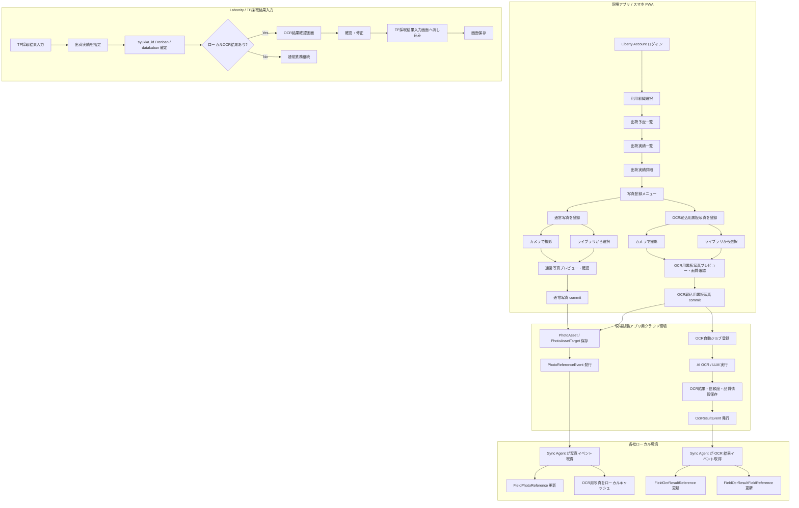

### 2.2 Sync Agent を含む構成

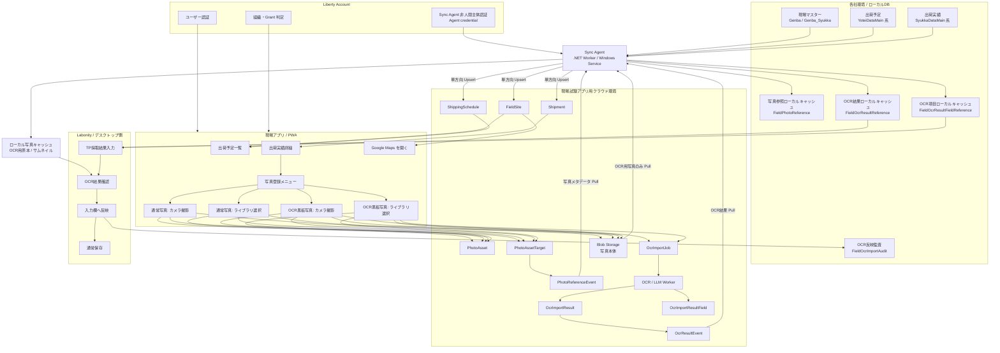

### 2.3 TP採取結果入力との連携

TP採取結果入力画面との連携は、出荷実績と画面コンテキストで行う。

| 領域 | クラウド | ローカル / Labonity |
|---|---|---|
| 出荷実績 | `Shipment.shipment_id` と `source_local_id = syukka_id` を保持する。 | `SyukkaDataMain.syukka_id` を持つ。 |
| 写真 | `PhotoAsset` / `PhotoAssetTarget` で管理する。OCR取込用黒板写真は `capture_purpose` で識別する。 | `FieldPhotoReference` で写真有無・ローカルキャッシュ状態を参照する。 |
| OCR結果 | `OcrImportJob` / `OcrImportResult` / `OcrImportResultField` で管理する。 | `FieldOcrResultReference` / `FieldOcrResultFieldReference` で `syukka_id` から参照する。 |
| フレッシュ試験行 | 永続キーとしては扱わない。 | `testpiecesaisyu_main_id + renban + datakubun` で保存する。 |
| OCR 反映先 | OCR 結果は `syukka_id` に紐づく。`renban` と `datakubun` は持たせない。 | 現在行の `renban` と現在表示中の `datakubun` に反映する。 |
| DB 保存 | OCR結果はクラウドDBとローカル参照DBに保存するが、Labonity の TP DB へは直接保存しない。 | TP採取結果入力画面の保存操作で保存する。 |

---

## 3. 認証・認可・マルチテナント設計

### 3.1 基本方針

現場試験 Web アプリ、クラウド API、Sync Agent は Liberty Account の仕組みを使用して認証・認可を行う。ただし、**人間の利用者**と**サーバー常駐の Sync Agent**は認証主体を分ける。

Labonity デスクトップアプリは Liberty Account によるクラウド認証を行わない。Labonity デスクトップアプリは、Sync Agent がローカルへ同期済みのデータと、Sync Agent がローカル指定フォルダへ自動保存した写真ファイルを参照する。

| 項目 | 方針 |
|---|---|
| 認証基盤 | Liberty Account。 |
| 現場試験 Web アプリ | OAuth2 Authorization Code + PKCE を使用する。個人の `accountId` を認証主体とする。 |
| Sync Agent | 個人ではなく、`orgId + plantId + agentId` に紐づく非人間主体として認証する。設計上の credential 名は **Agent credential** とする。 |
| Sync Agent token | Agent credential で短命 access token を取得する。個人 refresh token は使用しない。 |
| Labonity デスクトップ | クラウド認証しない。クラウドAPIを呼び出さない。Sync Agent への OCR 実行依頼もしない。 |
| テナント ID | Liberty Account の `orgId` を本システムの `tenant_id` として扱う。 |
| 利用可否 | Web アプリは `serviceCode = LABONITY_FIELD_TEST` の Grant とサービスメンバー状態で判定する。Sync Agent は org / plant に対して登録済みの active agent であることを判定する。 |
| API 境界 | `/api/core/v1/orgs/{orgId}/...`、`/api/sync/v1/orgs/{orgId}/...` のように orgId を URL に含める。 |
| データ分離 | URL の orgId、トークンの orgId、DB の `tenant_id` が一致する場合だけアクセスを許可する。 |

### 3.1.1 人間認証と Agent 認証の分離

本設計では、認証主体を次のように分ける。

| 種別 | 認証主体 | 主な用途 | 監査主体 |
|---|---|---|---|
| 人間 | `accountId` | 現場試験 Web アプリのログイン、予定・出荷・写真・OCR状態の閲覧、写真撮影、管理操作。 | `actor_type = user`, `account_id` |
| Sync Agent | `agentId` | Labonity サーバー常駐サービスによる参照データ同期、写真・OCRイベント取得、ACK、写真ダウンロード URL 取得。 | `actor_type = agent`, `agent_id` |
| Labonity デスクトップ | なし | ローカルDBとローカル写真ファイル参照のみ。クラウド認証しない。 | Labonity 側の既存ローカルユーザーまたはローカル監査。 |

「組織としての認証」という表現は使用しない。組織はログイン主体ではなく、Agent credential の認可スコープである。Sync Agent の主体はあくまで `agentId` とし、その agent に `orgId`、`plantId`、許可 scope を紐づける。

```text
人間利用者
  -> accountId で認証
  -> orgId / Grant / Role / permission で認可

Sync Agent
  -> agentId で認証
  -> orgId / plantId / scope で認可
```

### 3.2 現場試験 Web アプリのログイン

ログインフローは次の通りである。

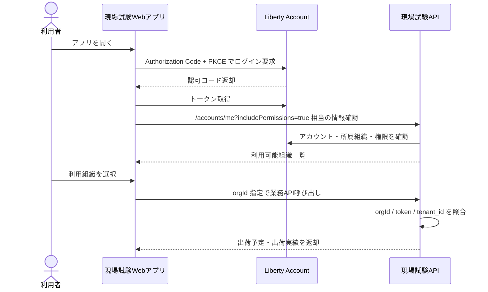

ログイン後、アプリは次を行う。

1. 呼び出し元アカウントの `accountId`、メール、表示名を取得する。
2. `includePermissions=true` により、所属組織ごとの権限を取得する。
3. `LABONITY_FIELD_TEST` の Grant が利用可能な組織だけを候補にする。
4. 複数組織に所属する場合は、利用組織選択画面を表示する。
5. 選択した `orgId` をアプリの現在テナントとして保持する。

### 3.3 組織選択

複数組織に所属するユーザーは、ログイン後に利用組織を選択する。

```text
+----------------------------------+
| 利用組織を選択                   |
|----------------------------------|
| ログインユーザー: yamada@example |
|                                  |
| [ ABC生コン株式会社 ]            |
|   現場試験アプリ 利用可          |
|                                  |
| [ XYZ工業株式会社 ]              |
|   現場試験アプリ 利用可          |
|                                  |
+----------------------------------+
```

選択後は、全 API 呼び出しに orgId を含める。

```http
GET /api/core/v1/orgs/{orgId}/shipping-schedules?date=2026-06-10
```

### 3.4 サービス Grant 判定

現場試験アプリのサービスコードは次とする。

```text
LABONITY_FIELD_TEST
```

Grant 判定では次を確認する。

| 判定項目 | 内容 |
|---|---|
| 組織所属 | ユーザーが対象 orgId に所属している。 |
| 組織メンバー状態 | `ACTIVE` のメンバーである。 |
| サービス Grant | `LABONITY_FIELD_TEST` が対象 orgId で利用可能である。 |
| サービスメンバー | 対象ユーザーがサービス利用可能メンバーである。 |
| 有効期間 | Grant の有効期間内である。 |
| ロール権限 | 操作に必要な権限コードを持つ。 |

Sync Agent は人間のサービスメンバーとしては扱わない。Sync Agent は、対象 orgId / plantId に対して登録された Agent registration と credential により利用可否を判定する。

### 3.5 権限コード

現場試験アプリでは、次の権限コードを使用する。

| 権限コード | 用途 |
|---|---|
| `FieldTest:Schedule:Read` | 出荷予定一覧、出荷予定詳細の参照。 |
| `FieldTest:Shipment:Read` | 出荷実績一覧、出荷実績詳細の参照。 |
| `FieldTest:Photo:Read` | 写真一覧、サムネイル、写真状態の取得。 |
| `FieldTest:Photo:Write` | 通常写真アップロード、写真 commit、代表写真設定。 |
| `FieldTest:Photo:Delete` | 写真の論理削除。 |
| `FieldTest:OcrBlackboard:Capture` | OCR取込用黒板写真の撮影・保存・差し替え。 |
| `FieldTest:OcrBlackboard:Read` | 現場アプリ上で OCR 処理状態・結果概要を参照する。 |
| `FieldTest:Sync:Import` | Sync Agent による基幹参照データ import。 |
| `FieldTest:Sync:Read` | Sync Agent による写真・OCR結果イベント取得。 |
| `FieldTest:Sync:Ack` | Sync Agent によるイベント ACK。 |
| `FieldTest:Sync:PhotoCache` | Sync Agent による OCR取込用写真および通常写真のローカル保存用ダウンロード URL 取得。 |
| `FieldTest:Sync:Heartbeat` | Sync Agent の稼働状態、二重稼働検知、診断情報送信。 |
| `FieldTest:Agent:Manage` | 管理者による Sync Agent 登録、失効、credential 再発行、ローテーション。 |
| `FieldTest:Admin:Manage` | 管理設定、手動再同期、同期状況、OCR失敗状況の確認。 |

### 3.6 ロール例

| ロール | 代表権限 |
|---|---|
| 現場担当者 | `Schedule:Read`, `Shipment:Read`, `Photo:Read`, `Photo:Write`, `OcrBlackboard:Capture`, `OcrBlackboard:Read` |
| 品質管理担当 | `Schedule:Read`, `Shipment:Read`, `Photo:Read`, `OcrBlackboard:Read` |
| 事務所担当 | `Schedule:Read`, `Shipment:Read`, `Photo:Read`, `OcrBlackboard:Read` |
| 管理者 | 上記に加え `Photo:Delete`, `Agent:Manage`, `Admin:Manage` |
| Sync Agent | `Sync:Import`, `Sync:Read`, `Sync:Ack`, `Sync:PhotoCache`, `Sync:Heartbeat` |

Sync Agent はロール名としては表示してもよいが、人間ユーザーのロール割当とは分ける。Agent registration に許可 scope を持たせる。

### 3.7 Sync Agent 認証

Sync Agent は対話ログインを行わない。テナント・工場・エージェント単位に発行された Agent credential を使用して、Liberty Account または認証基盤の token endpoint から短命 access token を取得し、クラウド API へ接続する。

| 項目 | 内容 |
|---|---|
| 認証主体 | `agentId`。人間の `accountId` ではない。 |
| 認証方式 | Client Credentials 相当の非対話認証。認証基盤の実装上は confidential client、service application、POST credential のいずれかでもよいが、本設計では総称して Agent credential と呼ぶ。 |
| スコープ | `orgId + plantId + agentId` で固定する。 |
| token の有効期限 | 短命 access token とする。期限切れ時は Agent credential で再取得する。 |
| refresh token | 使用しない。Sync Agent に個人 refresh token を保存しない。 |
| 利用可能 API | `/api/sync/v1/...` のみ。 |
| 現場アプリ API | Sync Agent credential では使用不可。 |
| 管理 API | Agent 自身による credential 発行・権限拡張は不可。管理者の個人ログインで実行する。 |
| OCR 実行 | Sync Agent は OCR 実行依頼を送らない。クラウド側で完了した OCR 結果を取得する。 |
| 監査 | import、event pull、ack、photo download-url、photo materialize status、ocr result sync、heartbeat をすべて `actor_type = agent` で AuditLog に記録する。 |

### 3.7.1 Agent credential の token claim

Sync Agent 用 access token には、少なくとも次に相当する情報を含める。

```json
{
  "sub": "agent:AGENT-001",
  "actor_type": "agent",
  "orgId": "ORG-001",
  "plantId": "KOZYO-001",
  "agentId": "AGENT-001",
  "scope": [
    "FieldTest.Sync.Import",
    "FieldTest.Sync.Read",
    "FieldTest.Sync.Ack",
    "FieldTest.Sync.PhotoCache",
    "FieldTest.Sync.Heartbeat"
  ],
  "aud": "labonity-field-test-sync-api",
  "exp": 1780000000
}
```

API 側では、各リクエストで次を検証する。

```text
URL の orgId と token の orgId が一致する。
request body または query の plantId と token の plantId が一致する。
agentId が active である。
agent credential が失効・期限切れ・ローテーション無効状態ではない。
要求 API に必要な scope を持つ。
/api/sync/v1 以外を呼び出していない。
```

### 3.7.2 Agent 登録フロー

Agent 登録は、TenantAdmin または `FieldTest:Agent:Manage` を持つ管理者が個人ログインして行う。

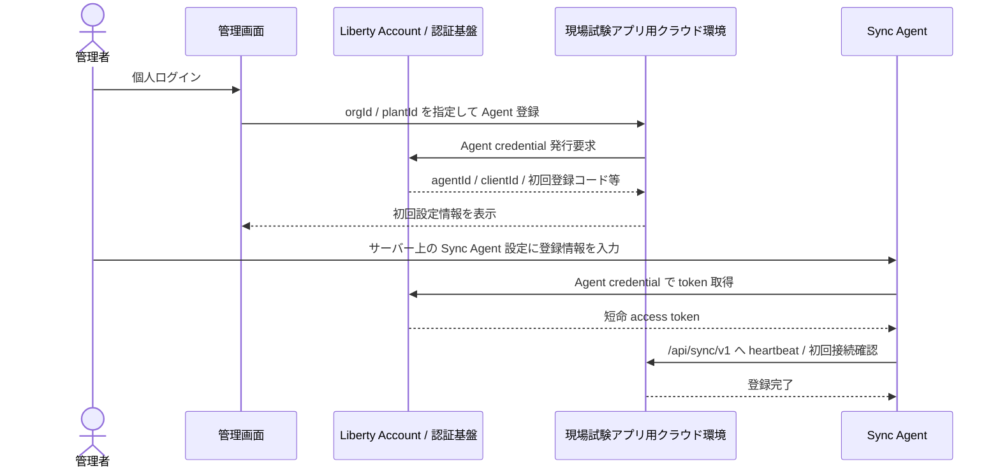

初回登録コードを使用する場合は次を必須とする。

| 項目 | 方針 |
|---|---|
| 有効期限 | 短時間。初期値 24 時間以内を推奨する。 |
| 使用回数 | 1 回限り。登録完了後は無効化する。 |
| 用途 | 初回 credential 引換または初回登録確認だけに使用する。通常の同期 API には使わない。 |
| 表示 | 管理者に一度だけ表示する。再表示しない。紛失時は再発行する。 |

### 3.7.3 credential 保護・失効・ローテーション

| 項目 | 方針 |
|---|---|
| 保存場所 | Windows DPAPI、Windows Credential Manager、または同等の OS 保護領域を使用する。平文 JSON / XML への secret 保存は避ける。 |
| ログ | client secret、登録コード、access token、SQL パスワードはログに出さない。出す場合はマスクする。 |
| 失効 | 管理者が Agent credential を即時失効できる。失効後の access token も可能な限り短時間で無効化する。 |
| 再発行 | サーバー移行、漏えい疑い、担当者変更時に credential を再発行できる。 |
| ローテーション | 新旧 credential の一時併用期間を設け、無停止または短時間停止で切り替えられるようにする。 |
| machine binding | 初期実装では必須にしないが、将来は machine name、証明書、mTLS 等により agent credential をサーバーへ紐づけられる余地を残す。 |

### 3.7.4 POST 用キー案の扱い

認証基盤側に「POST 用キー発行」の概念を設ける場合でも、本設計では次のように扱う。

```text
避ける:
  固定 API key を各同期 API に直接付与し、長期間そのまま使う。

採用する:
  POST 用キー相当の値を Agent credential または初回登録コードとして発行する。
  Agent credential は token endpoint で短命 access token に交換して使う。
  発行、失効、再発行、ローテーション、監査ができるようにする。
```

これにより、常駐サービスの運用安定性を確保しつつ、漏えい時の影響範囲と対処方法を明確にできる。


### 3.7.5 Agent credential 追加制御

初期実装で `client_id + client_secret` 方式を採用する場合でも、漏えい時の影響範囲を限定するため次を必須とする。

| 項目 | 方針 |
|---|---|
| audience | Sync Agent 用 access token の `aud` は `labonity-field-test-sync-api` に固定し、core API、admin API では拒否する。 |
| scope | `FieldTest.Sync.Import`、`FieldTest.Sync.Read`、`FieldTest.Sync.Ack`、`FieldTest.Sync.PhotoCache`、`FieldTest.Sync.Heartbeat` の最小 scope のみ付与する。 |
| download-url 制限 | `/photos/{photoAssetId}/download-url` は token の `orgId`、`plantId`、対象 photo の `tenant_id`、`plant_id`、イベント対象の整合を検証する。 |
| token 期限 | access token は短命とし、長期保存しない。 |
| secret 保存 | DPAPI / Credential Manager 等の OS 保護領域に保存し、設定ファイル・ログ・診断画面に表示しない。 |
| ローテーション | 新旧 credential の併用期間を設け、切替後に旧 credential を失効する。 |
| 漏えい時対応 | credential 失効、active token の短時間失効待ちまたは token revoke、credential 再発行、agent heartbeat 確認、必要に応じて agent 無効化を行う。 |

credential 漏えい時の標準手順は次の通りとする。

```text
1. 管理者が対象 agent を disabled または credential revoked にする。
2. Sync Agent は次回 token 取得または API 呼び出しで credential_error となり同期を停止する。
3. 管理者が新 credential を発行する。
4. Labonity サーバー上で OS 保護領域へ新 credential を保存する。
5. Sync Agent を再起動または credential 再読込する。
6. heartbeat と初回同期を確認する。
7. 旧 credential が使われていないことを AuditLog で確認する。
```

### 3.8 テナント分離

全テーブルに `tenant_id` を保持し、すべての検索・更新条件に含める。

| 対象 | 分離方法 |
|---|---|
| DB | `tenant_id` 必須。主な UNIQUE / INDEX に `tenant_id` と `plant_id` を含める。 |
| Blob | `orgId/plantId/...` をパスに含める。 |
| IndexedDB | ログイン orgId ごとにストアまたはキー空間を分離する。 |
| API | URL の orgId とトークン所属 org の一致を検証する。Sync Agent では URL の orgId、token の orgId、request の plantId、token の plantId、agentId を検証する。 |
| Sync Agent | Agent credential に許可 orgId / plantId / agentId / scope を紐づける。 |
| ローカルDB | `tenant_id + plant_id` を保持し、Labonity 側の検索条件に含める。 |
| ローカル写真キャッシュ | `orgId/plantId/syukkaId/photoAssetId` を含むパスで分離する。 |
| ログ | すべての監査ログに `tenant_id`、`actor_type`、`account_id` または `agent_id` を保持する。 |

---

## 4. データ同期設計

### 4.1 同期方向

| 領域 | 同期方向 | 用途 |
|---|---|---|
| 現場関連データ | ローカルDB → クラウド | 現場名、住所、地図、出荷詳細表示に使用する。 |
| 出荷予定関連データ | ローカルDB → クラウド | 現場アプリの出荷予定一覧に使用する。 |
| 出荷実績関連データ | ローカルDB → クラウド | 出荷実績一覧・詳細、写真紐づけ、OCR結果の出荷キーに使用する。 |
| 写真本体 | 現場アプリ → Blob Storage | 現場で発生する写真本体を保存する。 |
| 写真メタデータ | クラウド → ローカル参照テーブル | Labonity 側で写真有無、読取元写真、写真状態を判定する。 |
| OCR結果 | クラウド → ローカル OCR 参照テーブル | Labonity 側で `syukka_id` から OCR 結果を取得する。 |
| OCR取込用写真キャッシュ | クラウド Blob Storage → ローカルファイル | Labonity 側で OCR結果確認時に読取元画像を表示する。 |
| ローカル写真自動保存 | クラウド Blob Storage → ローカル指定フォルダ | 通常写真と OCR取込用黒板写真を出荷別に JPEG 保存し、Labonity 側でローカルファイルとして参照する。 |
| ローカル写真ファイル管理状態 | Sync Agent → ローカル参照テーブル | JPEG 生成状態、出力先パス、ハッシュ、サイズ、エラー、削除状態を保存する。 |

### 4.2 Sync Agent の配置

| 項目 | 内容 |
|---|---|
| 実行形態 | .NET Worker Service / Windows Service。 |
| 配置場所 | 本番運用では Labonity サーバー。SQL Server、Labonity サーバーフォルダ、写真出力先へ常時安定してアクセスできるサーバー側に配置する。クライアント PC ごとの配置は行わない。 |
| 通信方向 | Sync Agent からクラウドAPIへのアウトバウンド HTTPS。 |
| 認証 | Liberty Account / 認証基盤の Agent credential。個人ではなく `orgId + plantId + agentId` の非人間主体として発行する。短命 access token を取得し、個人 refresh token は使用しない。 |
| 認可スコープ | `tenant_id + plant_id` を基本にする。予定Noや出荷Noの混線を防ぐ。 |
| 冪等性 | `source_system` / `source_table` / `source_local_id` / `source_hash` / `idempotency_key` で担保する。 |
| ローカルDB接続 | ローカルDBの読み取りを基本とする。写真参照・OCR結果の反映先は連携用ローカルキャッシュとする。DB 接続情報は Sync Agent 設定に直接入力せず、Labonity の `Settings\LibLocal.xml` から解決する。 |
| DB設定起点 | Sync Agent 設定で `LabonityLocalSettingFilePath` を指定する。`LibLocal.xml` から `p_サーバーフォルダパス` を読み、配下の `LibertyDatabaseSetting.xml` から DB 接続情報を取得する。 |
| 設定不足時 | `LibLocal.xml`、サーバーフォルダ、`LibertyDatabaseSetting.xml`、DB 接続、権限確認のいずれかに失敗した場合は同期を開始しない。既定値へのフォールバックは禁止する。 |
| 写真キャッシュ | OCR取込用黒板写真とサムネイルをローカルファイルに保存する。通常写真の原本は原則キャッシュしない。 |
| ローカル写真エクスポート | 通常写真を含む commit 済み写真を、設定された出力先へ出荷別フォルダで JPEG 保存する。OCR取込用黒板写真は最優先、通常写真は次優先で処理する。 |
| Labonity 連携方式 | Labonity デスクトップアプリとは API / Named Pipe / IPC 連携しない。ローカルDBとファイルパスだけで連携する。 |

### 4.3 現場関連データ

| クラウドテーブル | 元データ例 | 主な用途 |
|---|---|---|
| `FieldSite` | `Genba`, `Genba_Syukka` | 現場名、住所、地図、出荷表示。 |
| `FieldSiteContact` | `Genba_Renrakusaki` 等 | 連絡先表示が必要な場合。 |
| `FieldSiteConcreteSpec` | `Genba_Haigo` 等 | 配合・現場別表示補助が必要な場合。 |

`FieldSite` の最低限必要な項目は次の通り。

| 項目 | 説明 |
|---|---|
| `field_site_id` | クラウド側ID。 |
| `tenant_id` | Liberty Account の orgId。 |
| `plant_id` | 工場ID。 |
| `source_local_id` | ローカル `Genba.id` 等。 |
| `site_name1` / `site_name2` | 現場名。 |
| `shipping_site_name1` / `shipping_site_name2` | `Genba_Syukka` の出荷用現場名。 |
| `site_short_name` | 略称。 |
| `address1` / `address2` | Google Maps 起動に使う住所。 |
| `latitude` / `longitude` | `Genba_Syukka.ido` / `Genba_Syukka.keido` を正規化して保持する。 |
| `map_query_text` | 住所と現場名から生成した検索文字列。 |
| `updated_source_at` | ローカル側最終更新日時。 |
| `source_hash` | 差分判定用ハッシュ。 |

### 4.4 出荷予定関連データ

| クラウドテーブル | 元データ例 | 主な用途 |
|---|---|---|
| `ShippingSchedule` | `YoteiDataMain` | 出荷予定一覧。 |
| `ShippingScheduleNote` | `YoteiData_Biko` | 必要に応じて備考表示。 |
| `ShippingScheduleTpFlag` | `YoteiData_TpSaisyu`, `YoteiData_Okinawa` 等 | TP 対象参考表示。 |

`ShippingSchedule` の最低限必要な項目は次の通り。

| 項目 | 説明 |
|---|---|
| `shipping_schedule_id` | クラウド側ID。 |
| `tenant_id` | テナント ID。 |
| `plant_id` | `YoteiDataMain.kozyo_id` 相当。 |
| `source_local_id` | ローカル `yotei_id`。 |
| `shipping_date` | `syukka_yoteibi`。 |
| `schedule_no` | `yotei_no`。予定No単独では一意にしない。 |
| `field_site_id` | 現場ID。 |
| `field_site_source_local_id` | ローカル `genba_id`。 |
| `mix_id` / `mix_name` | 配合。 |
| `scheduled_time` | 予定時刻。 |
| `planned_vehicle_count` | 出荷予定台数。 |
| `planned_quantity` | 出荷予定数量。 |
| `source_hash` | 差分判定用ハッシュ。 |

推奨自然キーは次の通り。

```text
tenant_id + plant_id + source_system + source_table + source_local_id
```

予定Noを表示・検索に使う場合も、内部処理では `plant_id` を必ず併用する。

### 4.5 出荷実績関連データ

| クラウドテーブル | 元データ例 | 主な用途 |
|---|---|---|
| `Shipment` | `SyukkaDataMain` | 出荷実績一覧・詳細、写真紐づけ、OCR結果の出荷キー。 |
| `ShipmentTpTarget` | `SyukkaData_TpSaisyu` | TP 対象情報の参考表示。 |
| `ShipmentSlip` | `SyukkaData_Denpyo` | 伝票系情報が必要な場合。 |

`Shipment` の最低限必要な項目は次の通り。

| 項目 | 説明 |
|---|---|
| `shipment_id` | クラウド側ID。写真紐づけの `PhotoAssetTarget.target_id`。 |
| `tenant_id` | テナント ID。 |
| `plant_id` | `SyukkaDataMain.kozyo_id` 相当。 |
| `source_local_id` | ローカル `SyukkaDataMain.syukka_id`。 |
| `shipping_schedule_id` | クラウド出荷予定ID。 |
| `shipping_schedule_source_local_id` | ローカル `YoteiDataMain.yotei_id`。 |
| `seq_no` | 出荷実績の Seq No。 |
| `shipping_date` | 出荷日。 |
| `shipping_time` | 出荷時刻。 |
| `vehicle_no` | 車番。 |
| `quantity` | 出荷数量。 |
| `manufactured_quantity` | 製造量。 |
| `field_site_id` | 現場ID。 |
| `mix_id` / `mix_name` | 配合。 |
| `tp_target_flag` | TP 採取対象参考フラグ。 |
| `source_hash` | 差分判定用ハッシュ。 |

### 4.6 差分同期方式

| 項目 | 内容 |
|---|---|
| 差分検出 | `rowversion`、最終更新日時、または対象項目の `source_hash` を使用する。 |
| Upsert | `tenant_id + plant_id + source_system + source_table + source_local_id` を自然キーにする。 |
| 削除 | 物理削除ではなく `deleted_at` / `is_deleted` を同期する。 |
| 再送 | 同一 `idempotency_key` は重複登録しない。 |
| チェックポイント | テーブルごと・テナントごと・工場ごとに `SyncCheckpoint` を保持する。 |
| フル同期 | 夜間または手動で再同期できるようにする。 |

### 4.7 同期周期

| データ | 推奨周期 |
|---|---|
| 当日・翌日の出荷予定 / 出荷実績 | 1〜5分。 |
| 現場マスター | 5〜30分、または変更検知時。 |
| 過去データ補正 | 夜間バッチまたは手動再同期。 |
| 写真メタデータイベント | 1〜5分。 |
| OCR結果イベント | 1〜5分。OCR結果確認前に Sync Agent が最新状態へ追従できることを目標にする。 |
| OCR取込用写真キャッシュ | OCR結果イベント取得後、優先的に取得する。 |


### 4.8 ローカル連携テーブル配置と Sync Agent 管理テーブル

本機能で追加するローカル連携テーブルは、すべて既存の出荷管理DB内の `FieldTest` スキーマに作成する。

| テーブル | DB | 用途 |
|---|---|---|
| `FieldPhotoReference` | `NaDat` | 出荷実績に紐づく写真参照メタデータ。 |
| `FieldPhotoLocalFile` | `NaDat` | Sync Agent が生成したローカル JPEG / サムネイル / manifest のパスと状態。 |
| `FieldPhotoMaterializeJob` | `NaDat` | 写真ダウンロード、JPEG 正規化、削除、検証のジョブ管理。 |
| `FieldPhotoExportConfig` | `NaDat` | 写真出力先、ファイル名、保持、JPEG 品質、パス長などの設定。 |
| `FieldOcrResultReference` | `NaDat` | 出荷実績単位の OCR 結果ヘッダー参照。 |
| `FieldOcrResultFieldReference` | `NaDat` | OCR 項目別結果参照。 |
| `FieldOcrImportAudit` | `NaDat` | Labonity 画面への OCR 反映監査。 |
| `FieldOcrValidationRule` | `NaDat` | OCR 値の項目別妥当範囲、桁数、反映可否設定。 |
| `FieldSyncCheckpoint` | `NaDat` | テーブル別・イベント別の同期チェックポイント。 |
| `FieldSyncLog` | `NaDat` | 同期処理、リトライ、失敗、構成エラーのログ。 |
| `FieldSyncAgentHealth` | `NaDat` | heartbeat、最終同期、未処理数、失敗数、最古滞留時刻、容量状態。 |
| `FieldSyncAgentLease` | `NaDat` | 同一 `tenant_id + plant_id` の二重稼働防止 lease。 |

#### 4.8.1 FieldSyncCheckpoint

| 項目 | 型 | 説明 |
|---|---|---|
| `checkpoint_id` | uniqueidentifier | チェックポイント ID。 |
| `tenant_id` | nvarchar(64) | Liberty Account orgId。 |
| `plant_id` | uniqueidentifier | Labonity `kozyo_id`。 |
| `sync_kind` | nvarchar(50) | `field_site_import` / `shipment_import` / `photo_event_pull` / `ocr_event_pull` など。 |
| `source_table` | nvarchar(100) null | 元テーブル名。 |
| `last_source_version` | nvarchar(200) null | rowversion、更新日時、hash 等。 |
| `last_event_sequence` | bigint null | 最終反映イベント sequence。 |
| `last_success_at` | datetimeoffset null | 最終成功日時。 |
| `last_error_at` | datetimeoffset null | 最終エラー日時。 |
| `last_error_code` | nvarchar(100) null | 最終エラーコード。 |
| `last_error_message` | nvarchar(1000) null | 最終エラー内容。 |
| `updated_at` | datetimeoffset | 更新日時。 |

#### 4.8.2 FieldSyncAgentHealth

| 項目 | 型 | 説明 |
|---|---|---|
| `health_id` | uniqueidentifier | Health 行 ID。通常は agent ごとに 1 行。 |
| `tenant_id` | nvarchar(64) | orgId。 |
| `plant_id` | uniqueidentifier | kozyo_id。 |
| `agent_id` | nvarchar(100) | Agent ID。 |
| `agent_status` | nvarchar(30) | `running` / `configuration_error` / `credential_error` / `degraded_retrying` / `stopped`。 |
| `last_heartbeat_at` | datetimeoffset | 最終 heartbeat。 |
| `last_token_success_at` | datetimeoffset null | 最終 token 取得成功日時。 |
| `last_import_success_at` | datetimeoffset null | 基幹参照データ import 最終成功日時。 |
| `last_event_pull_success_at` | datetimeoffset null | イベント pull 最終成功日時。 |
| `last_photo_materialize_success_at` | datetimeoffset null | 写真 JPEG 生成最終成功日時。 |
| `pending_photo_event_count` | int | 未 ACK 写真イベント数。 |
| `pending_ocr_event_count` | int | 未 ACK OCR イベント数。 |
| `queued_materialize_count` | int | 未処理 MaterializeJob 数。 |
| `failed_materialize_count` | int | 失敗 MaterializeJob 数。 |
| `oldest_materialize_queued_at` | datetimeoffset null | 最古未処理ジョブ日時。 |
| `photo_local_file_failed_count` | int | `FieldPhotoLocalFile.failed` 件数。 |
| `disk_free_bytes` | bigint null | 出力先ドライブ残容量。 |
| `disk_warning` | bit | 残容量警告。 |
| `last_error_code` | nvarchar(100) null | 代表エラーコード。 |
| `last_error_message` | nvarchar(1000) null | 代表エラー内容。 |
| `updated_at` | datetimeoffset | 更新日時。 |

#### 4.8.3 Health 閾値

初期値は次を推奨する。運用後に設定変更可能にする。

| 監視項目 | 注意 | 警告 | 異常 |
|---|---:|---:|---:|
| heartbeat 未更新 | 5 分 | 15 分 | 60 分 |
| 当日出荷 import 未成功 | 10 分 | 30 分 | 60 分 |
| OCR イベント未取得 | 10 分 | 30 分 | 60 分 |
| OCR黒板写真 JPEG 未生成 | 5 分 | 15 分 | 30 分 |
| 通常写真 JPEG 未生成 | 15 分 | 60 分 | 180 分 |
| MaterializeJob 失敗件数 | 1 件 | 5 件 | 20 件 |
| 出力先残容量 | 20GB 未満 | 10GB 未満 | 5GB 未満 |

Sync Agent はクラウド heartbeat API にも同等の要約を送信する。クラウド側の管理画面では、`agentId`、`plantId`、最終 heartbeat、最終同期、未処理件数、未生成写真件数、失敗件数を確認できるようにする。

#### 4.8.4 起動時構成エラーと運用中一時障害の区別

| 種別 | 例 | Sync Agent 状態 | 処理 |
|---|---|---|---|
| 起動時構成エラー | `LibLocal.xml` 不在、`LibertyDatabaseSetting.xml` 不在、DB 名未解決、必要テーブル不在、初回権限不足、credential 未設定 | `configuration_error` または `credential_error` | 同期処理を開始しない。Windows Service プロセスは診断表示のため起動してよい。 |
| 運用中一時障害 | SQL Server 再起動、共有フォルダ一時切断、クラウド API 一時失敗、ネットワーク断 | `degraded_retrying` | checkpoint を保持し、指数バックオフで再試行する。 |
| 認可・scope エラー | token の orgId / plantId 不一致、scope 不足、credential 失効 | `credential_error` | DB import、event pull、ACK、download-url 取得を停止する。 |
| 二重 agent 検知 | 同一 `tenant_id + plant_id` の active lease 競合 | `stopped_duplicate` | 片方だけ同期を継続し、もう一方は停止状態にする。 |

#### 4.8.5 手動フェイルオーバー

初期リリースでは active agent は同一 `tenant_id + plant_id` に 1 つだけとする。サーバー故障時は、管理者が旧 agent を無効化または lease 解除し、新サーバーで agent credential を再設定して起動する。自動 HA は初期対象外だが、heartbeat と lease により停止検知と手動切替を可能にする。

---

## 5. 出荷実績未同期時の扱い

### 5.1 基本方針

現場アプリでは、写真は同期済みの出荷実績を選択して登録する。対象の出荷実績がクラウドにまだ同期されておらず、出荷実績一覧または出荷実績詳細に表示されていない場合、予定・車番・時刻などを使って写真だけを先にクラウド保存する機能は実装しない。

ただし、現場担当者が写真証跡を逃さないための運用として、スマホ標準カメラで先に写真を撮影して端末内に保存しておくことを認める。電波が良い場所、または Sync Agent により出荷実績がクラウドへ同期された後、現場アプリで対象出荷を開き、端末ライブラリから通常写真または OCR取込用黒板写真として登録する。

```text
出荷実績未同期
  -> 現場アプリ内で写真登録は開始しない
  -> 必要な写真はスマホ標準カメラで撮影して端末に残す
  -> 出荷実績同期後、対象出荷を選択
  -> 端末ライブラリから通常写真または OCR取込用黒板写真として登録
```

この方針により、クラウド DB に未紐づけ写真を作らず、後追い紐づけ機能の複雑さを避けながら、現場の写真証跡は端末カメラ運用で確保する。

### 5.2 画面表示

出荷予定詳細画面で対象の出荷実績がまだ表示されていない場合、写真登録メニューは表示しない、または非活性にする。

表示例:

```text
出荷実績がまだ同期されていません。
しばらく待ってから更新してください。

写真が必要な場合は、スマホ標準カメラで撮影しておき、
出荷実績が表示された後にライブラリから登録してください。

[出荷実績を更新]
```

| 状態 | 処理 |
|---|---|
| 出荷予定は表示されているが出荷実績がない | 現場アプリ内では写真登録を開始しない。標準カメラで先に撮影する運用を案内する。 |
| 出荷実績一覧に対象出荷が表示された | 通常の出荷実績詳細から、通常写真のカメラ撮影、通常写真のライブラリ選択、OCR黒板写真のカメラ撮影、OCR黒板写真のライブラリ選択を許可する。 |
| 更新しても長時間表示されない | Sync Agent の稼働状況、ローカルDB接続、出荷実績同期ログ、最終同期時刻を確認する。 |
| 通信断 | 出荷実績の再取得は行えない。標準カメラで写真を撮影して端末に残し、通信復旧後に再取得する。 |

### 5.3 データ保存ルール

出荷実績が表示されていない状態では、クラウド DB に写真メタデータを作成しない。Blob Storage への写真アップロードセッションも発行しない。

写真アップロードセッション発行と写真 commit は、必ず同期済みの `Shipment.shipment_id` を指定して行う。

端末ライブラリから登録する場合も、commit 時には必ず次を指定する。

| 登録種別 | `source_type` | `capture_purpose` | OCR 対象 |
|---|---|---|---|
| 通常写真としてライブラリ選択 | `library` | `general` | 対象外 |
| OCR取込用黒板写真としてライブラリ選択 | `library` | `fresh_test_ocr_blackboard` | 対象 |
| カメラで通常写真撮影 | `camera` | `general` | 対象外 |
| OCR取込用黒板写真をカメラで撮影 | `camera` | `fresh_test_ocr_blackboard` | 対象 |

端末ライブラリから OCR取込用黒板写真として選択する場合も、専用確認画面で「保存後に OCR 予約されること」「既存 OCR黒板写真があれば差し替えになること」「対象出荷の出荷時刻・車番」を表示する。

### 5.4 実装対象外

初回リリースでは、次の機能は実装しない。

- 予定のみを対象に写真をクラウドへ保存する機能。
- 車番・時刻・予定情報から出荷実績へ写真を自動紐づけする機能。
- 出荷実績同期後に未紐づけクラウド写真の対象を自動変更する機能。
- 未紐づけ写真を管理者が手動で出荷実績へ紐づけ直す管理機能。
- 現場アプリ内の独自未送信キューに、出荷実績未確定の写真メタデータを保持する機能。

ただし、スマホ標準カメラで撮影済みの端末内写真を、同期後にライブラリから登録する機能は実装対象とする。

### 5.5 誤登録防止

後からライブラリ登録する場合、撮影時刻と登録時刻がずれるため、対象出荷を間違える可能性がある。登録画面では次を大きく表示する。

- 現場名。
- 出荷日。
- 出荷時刻。
- 車番。
- 出荷数量。
- Seq No。
- 予定 No。

登録前確認では、「この写真を上記の出荷実績に登録します」と表示し、ユーザーが確定するまで commit しない。

---

## 6. 写真保存設計

### 6.1 基本方針

写真本体は Blob Storage に保存し、DB には写真メタデータと対象データとの関連のみ保存する。Base64 で DB に写真本体を保存しない。

写真は出荷実績単位で扱う。クラウドでは `Shipment.shipment_id` を関連の主キーとして使用し、Labonity 側の参照用に `SyukkaDataMain.syukka_id` 相当の source local ID も保持する。

OCR取込用黒板写真は、通常写真と同じ写真保存基盤を使用する。ただし、`capture_purpose = fresh_test_ocr_blackboard` として保存し、commit 後に自動 OCR 対象にする。

クラウド保存後の写真は、Sync Agent がローカルの指定フォルダへ自動保存する。これにより、Labonity デスクトップアプリは HTTP や Named Pipe を使わず、ローカルDBに保存されたパスから JPEG ファイルを直接参照できる。Blob Storage は引き続きクラウド側の保管先であり、ローカル JPEG は Labonity 参照・証跡・台帳連携用の自動出力コピーである。

### 6.2 PhotoAsset

| 項目 | 型 | 説明 |
|---|---|---|
| `photo_asset_id` | uuid | 写真 ID。 |
| `tenant_id` | nvarchar(64) | テナント ID。 |
| `plant_id` | uniqueidentifier | 工場 ID。 |
| `blob_path` | nvarchar | 原本写真の Blob パス。 |
| `thumbnail_path` | nvarchar | サムネイル Blob パス。 |
| `taken_at` | datetimeoffset | 撮影日時。端末写真の場合は取得可能な日時を使用する。 |
| `source_type` | nvarchar | `camera` / `library`。撮影か端末写真選択かを表す。 |
| `capture_purpose` | nvarchar | `general` / `fresh_test_ocr_blackboard`。通常写真か OCR取込用黒板写真かを表す。 |
| `mime_type` | nvarchar | `image/jpeg` など。 |
| `size_bytes` | bigint | ファイルサイズ。 |
| `width` / `height` | int | 画像サイズ。 |
| `orientation` | int null | EXIF orientation。 |
| `file_hash` | nvarchar | 重複検知・冪等保存用のハッシュ。 |
| `quality_warnings_json` | json | ぼけ、暗さ、傾き、黒板検出不能などの警告。任意。 |
| `upload_status` | nvarchar | `uploading` / `uploaded` / `committed` / `failed`。 |
| `created_by` | uuid | 登録者。 |
| `created_at` | datetimeoffset | 登録日時。 |
| `updated_at` | datetimeoffset | 更新日時。 |
| `deleted_at` | datetimeoffset null | 論理削除日時。 |

### 6.3 PhotoAssetTarget

| 項目 | 型 | 説明 |
|---|---|---|
| `photo_asset_target_id` | uuid | 関連 ID。 |
| `tenant_id` | nvarchar(64) | テナント ID。 |
| `plant_id` | uniqueidentifier | 工場 ID。 |
| `photo_asset_id` | uuid | 写真 ID。 |
| `target_type` | nvarchar | 原則 `shipment`。 |
| `target_id` | uuid | クラウド `Shipment.shipment_id`。 |
| `target_source_local_id` | uniqueidentifier | ローカル `SyukkaDataMain.syukka_id`。 |
| `display_order` | int | 同一出荷内の表示順。 |
| `is_primary` | bit | 代表写真フラグ。一覧・初期表示用。 |
| `ocr_usage` | nvarchar null | OCR用途。通常写真は null。OCR取込用黒板写真は `fresh_test_blackboard`。 |
| `is_ocr_primary` | bit | 同一出荷実績における現在有効な OCR取込用黒板写真であることを表す。 |
| `ocr_requested_at` | datetimeoffset null | 自動 OCR ジョブ登録日時。 |
| `created_at` | datetimeoffset | 作成日時。 |
| `deleted_at` | datetimeoffset null | 論理削除日時。 |

### 6.4 制約とインデックス

同一写真を同一対象に重複登録しない。

```sql
CREATE UNIQUE INDEX UX_PhotoAssetTarget_TargetAsset
ON PhotoAssetTarget (
    tenant_id,
    plant_id,
    photo_asset_id,
    target_type,
    target_id
)
WHERE deleted_at IS NULL;
```

対象ごとの写真一覧を効率よく取得する。

```sql
CREATE INDEX IX_PhotoAssetTarget_Target
ON PhotoAssetTarget (
    tenant_id,
    plant_id,
    target_type,
    target_id,
    is_primary DESC,
    display_order ASC,
    photo_asset_id ASC
)
WHERE deleted_at IS NULL;
```

同一対象の代表写真は 1 件のみとする。

```sql
CREATE UNIQUE INDEX UX_PhotoAssetTarget_Primary
ON PhotoAssetTarget (
    tenant_id,
    plant_id,
    target_type,
    target_id
)
WHERE is_primary = 1
  AND deleted_at IS NULL;
```

同一出荷実績における現在有効な OCR取込用黒板写真は、OCR用途ごとに 1 件のみとする。

```sql
CREATE UNIQUE INDEX UX_PhotoAssetTarget_OcrPrimary
ON PhotoAssetTarget (
    tenant_id,
    plant_id,
    target_type,
    target_id,
    ocr_usage
)
WHERE is_ocr_primary = 1
  AND ocr_usage IS NOT NULL
  AND deleted_at IS NULL;
```

### 6.5 写真分類の扱い

通常写真の分類は設計対象外とする。

| 項目 | 扱い |
|---|---|
| `photo_category` | 使用しない。 |
| 黒板 / その他の分類 UI | 表示しない。 |
| 写真種別による絞込 | 行わない。 |
| 固定写真列 | `photo1_blob_path` / `photo2_blob_path` のような固定列は作らない。 |
| OCR取込用黒板写真登録 | 任意分類ではなく、OCR処理を起動する専用登録用途として扱う。 |

### 6.6 画像形式と前処理

| 項目 | 内容 |
|---|---|
| 受入形式 | JPEG / PNG / HEIC 等。サーバー側またはクライアント側で JPEG 正規化できる構成にする。 |
| EXIF orientation | サムネイル生成時と OCR 前処理時に補正する。 |
| OCR 用画像 | 長辺縮小、傾き補正、コントラスト補正、黒板領域推定、文字視認性確認を行う。 |
| 原本保持 | OCR 前処理後画像とは別に、原本を保持する。 |
| ローカルJPEG正規化 | Sync Agent がローカル保存する場合は、EXIF orientation 補正、sRGB 化、JPEG quality 初期値 90、拡張子 `.jpg` を標準にする。 |
| サイズ制限 | upload-session で `maxSizeBytes` と `acceptedContentTypes` を返す。 |
| 品質警告 | ぼけ、暗さ、反射、傾き、黒板欠け、文字小さすぎなどを記録する。 |

### 6.7 写真 commit 後の自動 OCR 起動

`capture_purpose = fresh_test_ocr_blackboard` の写真が commit された場合、クラウド側で自動 OCR ジョブを登録する。

```text
写真 commit
  -> PhotoAsset / PhotoAssetTarget 保存
  -> PhotoReferenceEvent 発行
  -> OcrImportJob 作成
  -> OCR / LLM Worker 実行
  -> OcrImportResult / OcrImportResultField 保存
  -> OcrResultEvent 発行
```

通常写真の場合、OCR ジョブは作成しない。

### 6.8 OCR取込用黒板写真の差し替え

OCR取込用黒板写真を差し替えた場合、新しい写真を `is_ocr_primary = 1` とし、同一出荷実績・同一 `ocr_usage` の古い写真は `is_ocr_primary = 0` にする。

古い OCR 結果は削除せず、`is_current = 0`、`status = superseded` として保持する。監査・トラブル調査のため、いつ、誰が、どの写真で差し替えたかを残す。

---

## 7. 写真メタデータのローカル参照設計

### 7.1 採用方式

写真本体はクラウド Blob Storage に保存し、ローカル側には写真の存在確認・一覧表示に必要なメタデータを保存する。

OCR結果確認画面で使用する OCR取込用黒板写真については、Sync Agent がローカルファイルキャッシュへ保存する。Labonity デスクトップアプリはクラウド API から閲覧 URL を取得しない。

基幹テーブルには写真列を設けず、独立した参照用テーブルを使用する。

### 7.2 ローカル参照用テーブル

テーブル名: `[NaDat].[FieldTest].[FieldPhotoReference]`

| 項目 | 型 | 説明 |
|---|---|---|
| `photo_reference_id` | uniqueidentifier | ローカル参照行ID。 |
| `tenant_id` | nvarchar(64) | テナントID。 |
| `plant_id` | uniqueidentifier | 工場ID。 |
| `photo_asset_id` | uniqueidentifier | クラウド PhotoAsset ID。 |
| `photo_asset_target_id` | uniqueidentifier | クラウド PhotoAssetTarget ID。 |
| `target_type` | nvarchar | 原則 `shipment`。 |
| `target_local_id` | uniqueidentifier | ローカル `SyukkaDataMain.syukka_id`。 |
| `target_cloud_id` | uniqueidentifier | クラウド `Shipment.shipment_id`。 |
| `taken_at` | datetimeoffset | 撮影日時。 |
| `source_type` | nvarchar | `camera` / `library`。 |
| `capture_purpose` | nvarchar | `general` / `fresh_test_ocr_blackboard`。 |
| `thumbnail_blob_path` | nvarchar | サムネイル Blob パス。直接アクセスには使わない。 |
| `original_blob_path` | nvarchar | 原本 Blob パス。直接アクセスには使わない。 |
| `local_thumbnail_path` | nvarchar(500) null | ローカルサムネイルパス。 |
| `local_original_path` | nvarchar(500) null | OCR取込用黒板写真のローカル原本パス。 |
| `cache_status` | nvarchar(20) | `not_cached` / `downloading` / `ready` / `failed` / `deleted`。 |
| `cache_updated_at` | datetimeoffset null | ローカルキャッシュ更新日時。 |
| `cache_error` | nvarchar(1000) null | ローカルキャッシュ失敗理由。 |
| `is_primary` | bit | 代表写真。 |
| `display_order` | int | 表示順。 |
| `ocr_usage` | nvarchar null | OCR用途。通常写真は null。 |
| `is_ocr_primary` | bit | 現在有効な OCR取込用黒板写真。 |
| `file_hash` | nvarchar | 重複確認用。 |
| `quality_warnings_json` | nvarchar(max) | 画質警告。 |
| `deleted_at` | datetimeoffset null | 取消・削除扱い。 |
| `event_sequence` | bigint | 最終反映イベントシーケンス。 |
| `synced_at` | datetimeoffset | ローカル反映日時。 |

### 7.3 写真有無判定

```sql
SELECT TOP (1) 1
FROM [NaDat].[FieldTest].[FieldPhotoReference]
WHERE tenant_id = @tenant_id
  AND plant_id = @plant_id
  AND target_type = 'shipment'
  AND target_local_id = @syukka_id
  AND deleted_at IS NULL;
```

### 7.4 写真一覧取得

```sql
SELECT *
FROM [NaDat].[FieldTest].[FieldPhotoReference]
WHERE tenant_id = @tenant_id
  AND plant_id = @plant_id
  AND target_type = 'shipment'
  AND target_local_id = @syukka_id
  AND deleted_at IS NULL
ORDER BY
  is_primary DESC,
  display_order ASC,
  taken_at ASC,
  photo_asset_id ASC;
```

### 7.5 OCR取込用黒板写真取得

Labonity の OCR結果確認画面で読取元画像を表示する場合、現在有効な OCR取込用黒板写真を取得する。

```sql
SELECT TOP (1) *
FROM [NaDat].[FieldTest].[FieldPhotoReference]
WHERE tenant_id = @tenant_id
  AND plant_id = @plant_id
  AND target_type = 'shipment'
  AND target_local_id = @syukka_id
  AND capture_purpose = 'fresh_test_ocr_blackboard'
  AND ocr_usage = 'fresh_test_blackboard'
  AND is_ocr_primary = 1
  AND cache_status = 'ready'
  AND deleted_at IS NULL
ORDER BY
  taken_at DESC,
  photo_asset_id DESC;
```

### 7.6 ローカル写真キャッシュ

Sync Agent は OCR結果イベントを取得した後、OCR取込用黒板写真の原本とサムネイルをローカルへ保存する。

推奨パス例:

```text
C:\ProgramData\Liberty\LabonityFieldPhotoCache\
  {orgId}\
    {plantId}\
      {syukkaId}\
        {photoAssetId}\
          original.jpg
          thumbnail.jpg
```

| 項目 | 方針 |
|---|---|
| 対象 | OCR取込用黒板写真を優先してキャッシュする。 |
| 通常写真 | 原則としてサムネイルのみ、または必要に応じてキャッシュする。 |
| 保存先 | ProgramData 等、一般ユーザーが直接編集しにくい場所。 |
| ファイル名 | `photoAssetId` を含め、推測しにくく衝突しない名前にする。 |
| 削除 | クラウド側で写真が削除・差し替えされた場合、論理削除状態にし、保持期間後にローカルキャッシュも削除する。 |


### 7.7 ローカル写真自動保存の位置づけ

7.6 のローカル写真キャッシュは、OCR結果確認画面で読取元画像を表示するための内部キャッシュである。これに加えて、Labonity デスクトップアプリや写真確認業務で直接扱うための **ローカル写真エクスポート**を用意する。

| 種類 | 主用途 | 保存場所 | 対象写真 | Labonity からの参照 |
|---|---|---|---|---|
| 内部キャッシュ | Sync Agent の再処理、OCR確認画像表示、ダウンロード重複抑制。 | `C:\ProgramData\Liberty\LabonityFieldPhotoCache\...` | OCR取込用黒板写真を優先。通常写真は設定次第。 | 原則直接参照しない。 |
| 業務用エクスポート | Labonity 画面表示、台帳連携、現場写真確認、バックアップ対象。 | 管理者が指定する `FieldPhotoExportRoot`。例: `D:\Labonity\FieldPhotos` または `\\fileserver\Labonity\FieldPhotos` | 通常写真、OCR取込用黒板写真、サムネイル、メタデータ。 | ローカルDBのパスを取得し、通常ファイルとして開く。 |

ローカル写真エクスポートでは、通常写真も対象にする。OCR取込用黒板写真だけに限定しない。これにより、現場アプリで撮影した写真がクラウド側にしか存在しない状態を避けられる。

### 7.8 FieldPhotoLocalFile

テーブル名: `[NaDat].[FieldTest].[FieldPhotoLocalFile]`

| 項目 | 型 | 説明 |
|---|---|---|
| `local_file_id` | uniqueidentifier | ローカルファイル管理ID。 |
| `tenant_id` | nvarchar(64) | テナントID。 |
| `plant_id` | uniqueidentifier | 工場ID。 |
| `photo_reference_id` | uniqueidentifier | `FieldPhotoReference.photo_reference_id`。 |
| `photo_asset_id` | uniqueidentifier | クラウド PhotoAsset ID。 |
| `photo_asset_target_id` | uniqueidentifier | クラウド PhotoAssetTarget ID。 |
| `target_type` | nvarchar | 原則 `shipment`。 |
| `target_local_id` | uniqueidentifier | `SyukkaDataMain.syukka_id`。 |
| `variant` | nvarchar(30) | `original_jpeg` / `thumbnail_jpeg` / `ocr_source_jpeg` / `metadata_json` / `manifest_json`。 |
| `local_root_key` | nvarchar(50) | 出力ルート識別子。例: `default`。 |
| `relative_path` | nvarchar(1000) | 出力ルートからの相対パス。 |
| `local_file_path` | nvarchar(1500) | 絶対パス。Labonity が参照する。 |
| `file_name` | nvarchar(255) | ファイル名。 |
| `mime_type` | nvarchar(100) | `image/jpeg` / `application/json`。 |
| `size_bytes` | bigint null | ローカルファイルサイズ。 |
| `width` / `height` | int null | JPEG の画像サイズ。 |
| `sha256_hash` | nvarchar(100) null | ローカルファイルのハッシュ。 |
| `jpeg_quality` | int null | JPEG 品質。初期値 90。 |
| `materialize_status` | nvarchar(30) | `queued` / `downloading` / `converting` / `ready` / `failed` / `deleted`。 |
| `materialize_priority` | int | OCR黒板=10、通常写真=50、再同期=80 など。 |
| `attempt_count` | int | 試行回数。 |
| `last_error_code` | nvarchar(100) null | 最終エラーコード。 |
| `last_error_message` | nvarchar(1000) null | 最終エラー内容。 |
| `source_event_sequence` | bigint | 反映元イベントシーケンス。 |
| `materialized_at` | datetimeoffset null | ファイル生成完了日時。 |
| `verified_at` | datetimeoffset null | ファイル存在・ハッシュ検証日時。 |
| `deleted_at` | datetimeoffset null | 論理削除日時。 |
| `synced_at` | datetimeoffset | ローカルDB反映日時。 |

推奨インデックス:

```sql
CREATE INDEX IX_FieldPhotoLocalFile_Target
ON FieldPhotoLocalFile (
    tenant_id,
    plant_id,
    target_type,
    target_local_id,
    variant,
    materialize_status,
    materialized_at DESC
);

CREATE UNIQUE INDEX UX_FieldPhotoLocalFile_PhotoVariant
ON FieldPhotoLocalFile (
    tenant_id,
    plant_id,
    photo_asset_id,
    photo_asset_target_id,
    variant,
    local_root_key
)
WHERE deleted_at IS NULL;
```

### 7.9 FieldPhotoMaterializeJob

テーブル名: `[NaDat].[FieldTest].[FieldPhotoMaterializeJob]`

| 項目 | 型 | 説明 |
|---|---|---|
| `materialize_job_id` | uniqueidentifier | ジョブID。 |
| `tenant_id` | nvarchar(64) | テナントID。 |
| `plant_id` | uniqueidentifier | 工場ID。 |
| `photo_reference_id` | uniqueidentifier | 対象写真参照。 |
| `photo_asset_id` | uniqueidentifier | 写真ID。 |
| `target_local_id` | uniqueidentifier | `syukka_id`。 |
| `job_type` | nvarchar(30) | `download_original` / `create_thumbnail` / `write_manifest` / `delete_local_file` / `verify_file`。 |
| `priority` | int | 優先度。小さいほど優先。 |
| `status` | nvarchar(30) | `queued` / `running` / `succeeded` / `retry_wait` / `failed` / `cancelled`。 |
| `not_before` | datetimeoffset | 再試行開始可能日時。 |
| `attempt_count` | int | 試行回数。 |
| `last_error_code` | nvarchar(100) null | エラーコード。 |
| `last_error_message` | nvarchar(1000) null | エラー内容。 |
| `created_at` | datetimeoffset | 作成日時。 |
| `updated_at` | datetimeoffset | 更新日時。 |
| `finished_at` | datetimeoffset null | 完了日時。 |

MaterializeJob は PhotoReferenceEvent の ACK と分離する。Sync Agent は写真メタデータをローカルDBへ反映し、MaterializeJob を登録できた時点でイベント ACK できる。JPEG ファイル生成に失敗した場合は `FieldPhotoLocalFile.materialize_status = failed` として再試行し、Labonity 画面では「写真ファイル未取得」または「保存待ち」と表示できる。

### 7.10 FieldPhotoExportConfig

テーブル名: `[NaDat].[FieldTest].[FieldPhotoExportConfig]`

| 項目 | 型 | 説明 |
|---|---|---|
| `config_id` | uniqueidentifier | 設定ID。 |
| `tenant_id` | nvarchar(64) | テナントID。 |
| `plant_id` | uniqueidentifier null | 工場別設定。null の場合はテナント共通。 |
| `local_root_key` | nvarchar(50) | `default` など。 |
| `root_path` | nvarchar(1000) | 出力先ルート。例: `D:\Labonity\FieldPhotos`。 |
| `enabled` | bit | 有効/無効。 |
| `folder_template` | nvarchar(1000) | フォルダ階層テンプレート。 |
| `file_name_template` | nvarchar(500) | ファイル名テンプレート。 |
| `include_general_original` | bit | 通常写真の原本JPEGを出力するか。初期値 1。 |
| `include_ocr_original` | bit | OCR黒板写真の原本JPEGを出力するか。初期値 1。 |
| `include_thumbnail` | bit | サムネイルを出力するか。初期値 1。 |
| `include_metadata_json` | bit | メタデータJSONを出力するか。初期値 1。 |
| `jpeg_quality` | int | JPEG 品質。初期値 90。 |
| `thumbnail_long_side` | int | サムネイル長辺。初期値 640。 |
| `max_original_long_side` | int null | 原本JPEG長辺上限。null は縮小しない。 |
| `delete_policy` | nvarchar(30) | `keep_with_deleted_marker` / `move_to_deleted` / `delete_after_retention`。 |
| `retention_days` | int null | 保持日数。 |
| `created_at` | datetimeoffset | 作成日時。 |
| `updated_at` | datetimeoffset | 更新日時。 |

初期テンプレート:

```text
folder_template = {plantId}\{shippingDate:yyyyMMdd}\{siteNameSafe}_{fieldSiteId8}\Y{scheduleNo}_{yoteiId8}\S{seqNo}_{shippingTimeHHmm}_{vehicleNoSafe}_{syukkaId8}
file_name_template = {takenAt:yyyyMMdd_HHmmss}_{purpose}_{photoAssetId8}.jpg
```

出力例:

```text
D:\Labonity\FieldPhotos\
  KOZYO-001\
    20260610\
      ○○マンション新築工事_3F8A92BC\
        Y120_18C0B711\
          S001_1030_12_9A73B2E1\
            01_通常写真\
              20260610_103112_general_PHOTO001A.jpg
            02_OCR黒板\
              20260610_103145_ocr_blackboard_PHOTO002B.jpg
            90_サムネイル\
              20260610_103112_general_PHOTO001A_thumb.jpg
              20260610_103145_ocr_blackboard_PHOTO002B_thumb.jpg
            99_メタデータ\
              shipment_manifest.json
              photos_manifest.csv
```

### 7.11 Labonity 側の写真ファイル取得 SQL

Labonity デスクトップアプリは HTTP / Named Pipe / Sync Agent 呼び出しを行わず、ローカルDBだけで対象出荷の写真パスを取得する。

```sql
SELECT
    r.photo_reference_id,
    r.photo_asset_id,
    r.capture_purpose,
    r.taken_at,
    r.is_primary,
    r.display_order,
    f.variant,
    f.local_file_path,
    f.materialize_status,
    f.size_bytes,
    f.sha256_hash
FROM [NaDat].[FieldTest].[FieldPhotoReference] r
LEFT JOIN [NaDat].[FieldTest].[FieldPhotoLocalFile] f
  ON f.tenant_id = r.tenant_id
 AND f.plant_id = r.plant_id
 AND f.photo_reference_id = r.photo_reference_id
 AND f.variant = 'original_jpeg'
 AND f.deleted_at IS NULL
WHERE r.tenant_id = @tenant_id
  AND r.plant_id = @plant_id
  AND r.target_type = 'shipment'
  AND r.target_local_id = @syukka_id
  AND r.deleted_at IS NULL
ORDER BY
    r.is_primary DESC,
    r.display_order ASC,
    r.taken_at ASC,
    r.photo_asset_id ASC;
```

`materialize_status = 'ready'` かつ `local_file_path` のファイルが存在する場合だけ画像を表示する。未生成または失敗の場合、Labonity は Sync Agent に直接要求せず、ローカルDB上の状態を表示する。

### 7.12 ローカル写真エクスポートの削除・差し替え

| 操作 | 処理 |
|---|---|
| 通常写真の論理削除 | `FieldPhotoReference.deleted_at` を反映し、`FieldPhotoLocalFile.materialize_status = deleted` にする。ファイルは保持期間内は残し、`99_メタデータ\deleted_manifest.json` に記録する。 |
| OCR黒板写真の差し替え | 新写真を `is_ocr_primary = 1` として出力する。旧写真は消さず、`superseded` として manifest に残す。 |
| 表示順変更 | 原則ファイル名は変更しない。表示順は DB と manifest で管理する。リネームによる外部参照切れを避ける。 |
| 代表写真変更 | ファイルは変更せず、DB と manifest の `is_primary` を更新する。 |
| ローカルファイル欠損 | Sync Agent の検証ジョブが再生成する。Labonity は欠損時に「ローカル写真ファイル未取得」と表示する。 |

### 7.13 ローカル写真エクスポートの運用注意

- エクスポートフォルダは Sync Agent サービスアカウントが書き込み、Labonity 利用者は読み取りを基本とする。
- ユーザーが直接編集したファイルは、ハッシュ検証で検知し、設定に応じて再生成または別名退避する。
- Windows のパス長制限を避けるため、現場名は最大 40 文字程度で切り詰め、末尾に ID 短縮値を付与する。
- `\ / : * ? " < > |` などファイル名に使えない文字は `_` に置換する。
- 同じ車番・同じ時刻・同じ予定Noがあっても、`syukka_id8` と `photo_asset_id8` により衝突を避ける。
- ネットワーク共有に保存する場合、Sync Agent は書込一時ファイルを作成後、同一ディレクトリ内で atomic rename する。

---


### 7.14 パス長上限制御

Sync Agent は、パス長超過をエラーとして後から検知するだけでなく、ファイル名生成時に `MaxFullPathLength` 以内へ収める。初期値は legacy Windows / 古い .NET Framework / WinForms 互換を考慮して 240 文字以内を推奨する。

| 項目 | 初期値 | 内容 |
|---|---:|---|
| `MaxFullPathLength` | 240 | `LabonityVisibleRootPath + relative_path + file_name` の最大長。 |
| `MaxSiteNameLength` | 32 | 現場名部分の最大長。 |
| `MaxScheduleNameLength` | 20 | 予定名・予定 No 部分の最大長。 |
| `MaxVehicleNoLength` | 12 | 車番表示部分の最大長。 |
| `AlwaysAppendId8` | true | 現場、予定、出荷、写真に短縮 ID を付けて衝突を防ぐ。 |

短縮順序は次とする。

```text
1. 禁止文字を _ に置換する。
2. 連続空白・連続 _ を 1 文字にまとめる。
3. 現場名を MaxSiteNameLength まで短縮する。
4. 予定名・車番・補助文字列を短縮する。
5. それでも MaxFullPathLength を超える場合は、人間可読部分をさらに短縮し、ID8 中心のパスへ切り替える。
6. 最終的にも収まらない場合は materialize_status = failed とし、last_error_code = PATH_TOO_LONG を記録する。
```

Labonity へ保存する `FieldPhotoLocalFile.local_file_path` は、必ず `MaxFullPathLength` 検証後のパスとする。

---

## 8. 写真・OCRイベント設計

### 8.1 PhotoReferenceEvent 基本方針

クラウド側で写真の作成、削除、代表写真変更、表示順変更、OCR取込用黒板写真の差し替えが発生した場合、`PhotoReferenceEvent` を発行する。Sync Agent はイベントを取得し、`FieldPhotoReference` とローカル写真キャッシュへ反映する。

### 8.2 PhotoReferenceEvent 項目

| 項目 | 説明 |
|---|---|
| `event_id` | イベントID。 |
| `tenant_id` | テナントID。 |
| `plant_id` | 工場ID。 |
| `event_sequence` | 単調増加シーケンス。 |
| `event_type` | `created` / `updated` / `deleted` / `primary_changed` / `display_order_changed` / `ocr_primary_changed`。 |
| `photo_asset_id` | 写真ID。 |
| `photo_asset_target_id` | 対象関連ID。 |
| `target_type` | `shipment`。 |
| `target_cloud_id` | `Shipment.shipment_id`。 |
| `target_local_id` | `SyukkaDataMain.syukka_id`。 |
| `capture_purpose` | `general` / `fresh_test_ocr_blackboard`。 |
| `ocr_usage` | `fresh_test_blackboard` または null。 |
| `is_ocr_primary` | 現在有効な OCR取込用黒板写真か。 |
| `is_primary` | 代表写真。 |
| `display_order` | 表示順。 |
| `deleted_at` | 削除日時。 |
| `payload_version` | ペイロードバージョン。 |
| `created_at` | イベント発行日時。 |

### 8.3 OcrResultEvent 基本方針

クラウド側で OCR ジョブが完了、失敗、差し替えにより無効化された場合、`OcrResultEvent` を発行する。Sync Agent はイベントを取得し、ローカル OCR 参照テーブルへ反映する。

### 8.4 OcrResultEvent 項目

| 項目 | 説明 |
|---|---|
| `event_id` | イベントID。 |
| `tenant_id` | テナントID。 |
| `plant_id` | 工場ID。 |
| `event_sequence` | 単調増加シーケンス。 |
| `event_type` | `ocr_completed` / `ocr_failed` / `ocr_superseded` / `ocr_deleted`。 |
| `ocr_import_job_id` | OCR ジョブID。 |
| `ocr_import_result_id` | OCR 結果ID。 |
| `shipment_id` | クラウド出荷実績ID。 |
| `shipment_source_local_id` | `SyukkaDataMain.syukka_id`。 |
| `photo_asset_id` | OCR取込用黒板写真ID。 |
| `photo_asset_target_id` | 対象関連ID。 |
| `ocr_usage` | `fresh_test_blackboard`。 |
| `schema_version` | `labonity.blackboardFreshTest.v1`。 |
| `status` | `completed` / `needs_review` / `failed` / `superseded`。 |
| `is_current` | 現在有効な OCR 結果か。 |
| `overall_confidence` | 全体信頼度。 |
| `quality_score` | 画像品質スコア。 |
| `low_confidence_count` | 低信頼度項目数。 |
| `needs_review_count` | 要確認項目数。 |
| `processed_at` | OCR処理完了日時。 |
| `payload_version` | ペイロードバージョン。 |
| `created_at` | イベント発行日時。 |

### 8.5 ACK

Sync Agent はイベントをローカルに反映した後、ACK を送信する。

```http
POST /api/sync/v1/orgs/{orgId}/photo-reference-events/{eventId}/ack
POST /api/sync/v1/orgs/{orgId}/ocr-result-events/{eventId}/ack
```

ACK には `agentId`、`plantId`、`appliedAt`、`status`、`errorCode`、`errorMessage` を含める。

### 8.6 再送・順序制御

| 項目 | 内容 |
|---|---|
| 再送 | ACK がないイベント、または `retryable` として失敗したイベントは再取得対象にする。 |
| 順序制御 | `event_sequence` より古いイベントではローカルの新しい状態を上書きしない。 |
| 冪等性 | `event_id` と `event_sequence` により同一イベントの重複反映を防ぐ。 |
| バッチサイズ | 初期値 100 件。設定で変更可能にする。 |
| 手動再同期 | 指定期間または指定 `syukka_id` で写真参照・OCR結果を再構築できるようにする。 |

---

## 9. Google Maps 現場住所連携

### 9.1 基本方針

出荷実績詳細画面には、現場住所から Google Maps を開く導線を配置する。

アプリ内に地図を埋め込まず、Google Maps の外部起動を使用する。これにより、地図表示コンポーネントや API キー管理をシンプルにしつつ、現場担当者が地図確認・ナビ開始を行える。

### 9.2 同期する現場位置情報

`FieldSite` には、Google Maps 起動に必要な項目を保持する。

| 項目 | 説明 |
|---|---|
| `site_name1` / `site_name2` | 現場名。 |
| `shipping_site_name1` / `shipping_site_name2` | 出荷用現場名。 |
| `site_short_name` | 一覧表示用。 |
| `address1` / `address2` | `Genba.zyusyo1` / `Genba.zyusyo2`。 |
| `latitude` / `longitude` | `Genba_Syukka.ido` / `Genba_Syukka.keido` を正規化した値。 |
| `map_query_text` | 住所と現場名から生成した検索文字列。 |
| `map_source` | `latlng` / `address` / `manual` など。 |

### 9.3 表示ルール

| 状態 | UI |
|---|---|
| 緯度経度あり | [地図を開く] [ナビ開始] を表示。緯度経度を優先して起動する。 |
| 緯度経度なし・住所あり | 住所文字列で Google Maps を開く。 |
| 住所なし | ボタンを非活性にし、「住所未設定」と表示する。 |
| オフライン | 外部起動を試行し、失敗時は住所コピーを可能にする。 |

### 9.4 Google Maps URL 生成

#### 地図を開く

緯度経度がある場合:

```text
https://www.google.com/maps/search/?api=1&query={latitude},{longitude}
```

住所だけの場合:

```text
https://www.google.com/maps/search/?api=1&query={urlEncodedAddress}
```

#### ナビ開始

緯度経度がある場合:

```text
https://www.google.com/maps/dir/?api=1&destination={latitude},{longitude}&travelmode=driving&dir_action=navigate
```

住所だけの場合:

```text
https://www.google.com/maps/dir/?api=1&destination={urlEncodedAddress}&travelmode=driving&dir_action=navigate
```

### 9.5 注意事項

- 住所や緯度経度は現場アプリで編集しない。
- 住所が間違っている場合は、Labonity 側の現場マスターを修正し、Sync Agent により再同期する。
- `ido` / `keido` は文字列として保持されているため、空文字、0、不正値を正規化時に除外する。
- 地図で開いた位置が現場入口とずれる場合に備え、将来的に現場入口メモや手動ピン座標を保持できる余地を残す。
- アプリ内での経路計算、到着予定時刻計算、地図履歴保存は行わない。

---

## 10. TP採取結果入力からの OCR 結果取込フロー

### 10.1 画面起点

Labonity の **TP採取結果入力** 画面における出荷実績指定を起点とする。

ユーザーが対象の出荷実績を指定したタイミングで、対象の `syukka_id`、反映先 `testpiecesaisyu_main_id`、反映先 `renban`、反映先 `datakubun` が特定される。

- 通常取りの場合: 指定された行の `syukka_id` が特定される。
- 縦割りの場合: 指定された行の `syukka_id` と反映先 `TestPieceSaisyu_FreshSiken.renban` が同時に確定する。
- データ No.2 表示中の場合: `datakubun = 1` の入力欄に反映する。
- 新規未保存 TP の場合: 画面メモリ上の出荷指定コンテキストを正とし、保存時に通常の Labonity 保存処理で `ExDat` の関係を確定する。

### 10.2 OCR 反映先の安全検証

OCR 結果は `syukka_id` に紐づく値として保存するが、反映時には `syukka_id` だけで自動反映しない。Labonity 画面の現在コンテキストと出荷指定の一致を必ず検証する。

#### 10.2.1 保存済み TP の検証

保存済み TP、または `testpiecesaisyu_main_id` が確定しており `[ExDat].[dbo].[TestPieceSaisyu_SyukkaData]` に出荷関係が保存済みの場合は、次の一致を必須とする。

```sql
SELECT TOP (1) 1
FROM ExDat.dbo.TestPieceSaisyu_SyukkaData
WHERE testpiecesaisyu_main_id = @testpiecesaisyu_main_id
  AND renban = @renban
  AND syukka_id = @syukka_id;
```

一致しない場合は、OCR結果確認画面を表示してもよいが、`[入力欄に反映]` は無効化する。表示メッセージは次とする。

```text
現在行の出荷実績と OCR 結果の出荷実績が一致しません。
反映先の連番または出荷指定を確認してください。
```

#### 10.2.2 新規未保存 TP の検証

新規未保存 TP では、`[ExDat].[dbo].[TestPieceSaisyu_SyukkaData]` の行がまだ存在しない場合がある。この場合は、画面メモリ上でユーザーが現在行に指定した `syukka_id` と OCR 結果の `syukka_id` が一致することを検証する。

```text
画面現在行.syukka_id == FieldOcrResultReference.syukka_id
画面現在行.renban == 反映先 renban
画面現在表示.datakubun == 反映先 datakubun
```

保存時は既存 Labonity の通常保存処理により、TP 本体、フレッシュ試験、TP と出荷の関係が `ExDat` に保存される。OCR 反映監査は、保存前は `testpiecesaisyu_main_id` が null または仮値でもよい。保存後に `saved` へ更新する場合、確定した `testpiecesaisyu_main_id` を記録する。

### 10.3 OCR結果の有無確認

出荷実績が指定された後、Labonity 側は `[NaDat].[FieldTest].[FieldOcrResultReference]` を参照し、対象 `syukka_id` の OCR 結果を確認する。

- OCR結果がある場合: `[OCR結果を確認して反映]` を表示する。
- OCR結果が処理中の場合: `OCR読取中` と表示し、手入力を継続できるようにする。
- OCR結果がない場合: OCR取込導線は表示せず、通常の出荷実績指定のみとして完了する。
- OCR結果が失敗の場合: `OCR失敗` と表示し、手入力を継続できるようにする。

Labonity 側はクラウドへ最新確認を行わない。同期状態は Sync Agent による `NaDat` 反映を正とする。

### 10.4 OCR結果取得 SQL

```sql
SELECT TOP (1) *
FROM [NaDat].[FieldTest].[FieldOcrResultReference]
WHERE tenant_id = @tenant_id
  AND plant_id = @plant_id
  AND syukka_id = @syukka_id
  AND ocr_usage = 'fresh_test_blackboard'
  AND is_current = 1
  AND status IN ('completed', 'needs_review')
ORDER BY
  processed_at DESC,
  ocr_import_result_id DESC;
```

項目別結果は次で取得する。

```sql
SELECT *
FROM [NaDat].[FieldTest].[FieldOcrResultFieldReference]
WHERE ocr_result_reference_id = @ocr_result_reference_id
ORDER BY display_order ASC, canonical_key ASC;
```

### 10.5 自動起動ルール

OCR結果確認画面の起動は次のルールとする。

| 状態 | UI |
|---|---|
| OCR結果なし | 何も表示しない、または「OCR結果なし」と表示する。 |
| OCR結果あり・反映先欄が空 | [OCR結果を確認して反映] を強調表示し、OCR結果確認画面を開く。値の自動反映は行わない。 |
| OCR結果あり・反映先欄に値あり | [OCR結果から再取込] を表示する。確認画面では現在値との差分を強調し、人間確認なしの上書きは行わない。 |
| OCR処理中 | `OCR読取中` と表示する。手入力は継続可能。 |
| OCR失敗 | `OCR失敗` と表示する。手入力は継続可能。 |
| 検証不一致 | OCR状態は表示するが、反映ボタンは無効化する。 |
| 縦割り | 現在行の `renban` に対応する `syukka_id` の OCR結果だけを取得する。 |
| datakubun=1 | データ2画面の入力欄へ反映する。 |

### 10.6 OCR結果確認 UI 表示項目

| 表示項目 | 内容 |
|---|---|
| 反映先 TP | `testpiecesaisyu_main_id`、採取日、現場名、配合。 |
| 反映先行 | `renban`、`datakubun`。 |
| 出荷実績 | 出荷日、出荷時刻、車番、出荷数量、Seq No。 |
| 読取元写真 | ローカル保存済みの OCR取込用黒板写真。未生成の場合は「読取元写真未取得」と表示する。 |
| 撮影日時 | `taken_at`。 |
| OCR処理日時 | `processed_at`。 |
| OCR状態 | `completed` / `needs_review` / `failed` / `superseded`。 |
| 全体信頼度 | `overall_confidence`。 |
| 画像品質 | `quality_score` と `image_quality_json`。 |
| 項目別信頼度 | 各項目の `confidence`。 |
| 現在値 | TP採取結果入力画面の現在値。 |
| OCR値 | OCR抽出値。 |
| 反映値 | ユーザーが確定する値。 |
| 警告 | 低信頼度、車番不一致、桁数超過、型変換警告、範囲外、反映先不一致など。 |
| モデル情報 | 必要に応じてモデル名、スキーマバージョン、プロンプトバージョンを詳細表示する。 |

### 10.7 反映ルール

| 状態 | 処理 |
|---|---|
| 反映先検証 OK | ユーザー確認後、画面入力欄へ反映できる。 |
| 反映先検証 NG | 反映不可。手入力は継続できる。 |
| 反映先欄が空 | OCR値を反映値の初期値にする。 |
| 反映先欄に値あり・OCR値と同じ | OK 表示。 |
| 反映先欄に値あり・OCR値と異なる | 差分確認を必須にする。自動上書きしない。 |
| OCR値が低信頼度 | 要確認として表示する。 |
| OCR値が型変換不可 | 反映候補にしない。手入力を促す。 |
| OCR値がDB桁数超過 | 切り詰め候補と警告を表示する。 |
| OCR値が業務妥当範囲外 | 要確認または反映不可にする。閾値は 11.5.1 に従う。 |
| datakubun=1 | データ2画面の入力欄へ反映する。 |
| 縦割り | 現在行の `renban` と `syukka_id` の組み合わせを守る。 |

### 10.8 縦割り対応

縦割りでは、`renban` ごとに出荷実績が対応する。

```text
renban 0 -> 1台目の syukka_id -> 1台目の OCR結果 -> FreshSiken renban 0
renban 1 -> 2台目の syukka_id -> 2台目の OCR結果 -> FreshSiken renban 1
renban 2 -> 3台目の syukka_id -> 3台目の OCR結果 -> FreshSiken renban 2
```

OCR結果の反映先は次で決まる。

```text
反映先 = TP採取結果入力画面の現在行 renban + 現在表示中 datakubun
```

OCR結果側では `renban` と `datakubun` を固定しない。`renban` と `datakubun` は Labonity 画面側の現在コンテキストを正とする。

### 10.9 反映済み重複チェック

同じ OCR 結果を同じ TP 行へ再反映する場合は、誤操作防止のため確認を出す。

```sql
SELECT TOP (1) *
FROM [NaDat].[FieldTest].[FieldOcrImportAudit]
WHERE tenant_id = @tenant_id
  AND plant_id = @plant_id
  AND ocr_import_result_id = @ocr_import_result_id
  AND testpiecesaisyu_main_id = @testpiecesaisyu_main_id
  AND renban = @renban
  AND datakubun = @datakubun
  AND status IN ('applied_to_screen', 'saved')
ORDER BY created_at DESC;
```

再反映を許可する場合でも、前回反映値、今回反映値、既存画面値の差分を表示する。

---

## 11. AI OCR / LLM 事前取込設計

### 11.1 事前 OCR フロー

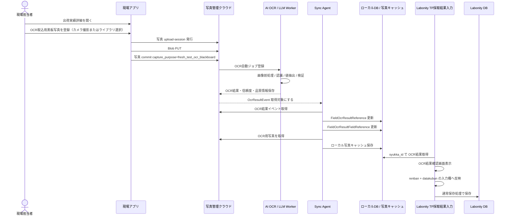

### 11.2 OCR ジョブの考え方

OCR ジョブは、OCR取込用黒板写真の commit をトリガーとしてクラウド側で自動作成する。

| 項目 | 内容 |
|---|---|
| トリガー | `capture_purpose = fresh_test_ocr_blackboard` の写真 commit。 |
| 出荷実績 | `shipment_id` と `shipment_source_local_id = syukka_id`。 |
| 写真 | 原則 1 枚。`photo_asset_id` で指定する。 |
| スキーマ | `labonity.blackboardFreshTest.v1`。 |
| 画面コンテキスト | OCR実行時には持たせない。`renban` と `datakubun` は Labonity 反映時に決まる。 |
| 保存 | OCR結果、信頼度、品質情報、警告、モデル情報をクラウドDBへ保存する。 |
| 同期 | Sync Agent がローカル OCR 参照テーブルへ同期する。 |
| TP DB反映 | OCR API は Labonity DB へ直接保存しない。 |

### 11.3 OCR レスポンス / 保存形式

OCR Worker は、抽出値だけでなく、品質情報と信頼度情報を含めた JSON を生成し、クラウドDBに保存する。

```json
{
  "schemaVersion": "labonity.blackboardFreshTest.v1",
  "source": {
    "shipmentId": "SHIPMENT-CLOUD-ID",
    "shipmentSourceLocalId": "SYUKKA-LOCAL-ID",
    "photoAssetId": "PHOTO-001",
    "ocrUsage": "fresh_test_blackboard",
    "model": "vision-llm",
    "modelVersion": "2026-06",
    "promptVersion": "blackboard-fresh-test-2026-06-10",
    "processedAt": "2026-06-10T10:30:00+09:00",
    "processingDurationMs": 2340
  },
  "quality": {
    "overallConfidence": 0.89,
    "qualityScore": 0.82,
    "imageSharpnessScore": 0.78,
    "brightnessScore": 0.86,
    "skewAngleDegrees": 2.3,
    "blackboardDetected": true,
    "blackboardCoverageRatio": 0.64,
    "needsReview": true,
    "warnings": [
      "黒板右下が一部ぼけています。低信頼度の項目は確認してください。"
    ]
  },
  "validation": {
    "vehicleNoMatch": true,
    "numericRangeValid": true,
    "dbTypeValid": true,
    "lowConfidenceCount": 2,
    "needsReviewCount": 2
  },
  "fields": [
    {
      "key": "slump",
      "labelText": "スランプ",
      "rawText": "18.0",
      "value": 18.0,
      "normalizedValue": "18.0",
      "valueType": "number",
      "unit": "cm",
      "confidence": 0.88,
      "needsReview": true,
      "reviewReasons": ["low_confidence"],
      "warnings": ["18.0 と 13.0 の判別がやや不確実"],
      "candidates": [18.0, 13.0]
    },
    {
      "key": "air",
      "labelText": "空気量",
      "rawText": "4.5",
      "value": 4.5,
      "normalizedValue": "4.5",
      "valueType": "number",
      "unit": "%",
      "confidence": 0.91,
      "needsReview": false,
      "reviewReasons": [],
      "warnings": [],
      "candidates": []
    }
  ]
}
```

### 11.4 OCR 対象項目

| canonical key | 日本語名 | 型 | 単位 | 反映先候補 | 読取・反映ルール |
|---|---|---|---|---|---|
| `vehicle_no` | 車番 | string | なし | `TestPieceSaisyu_FreshSiken.syaban` | TP 側は nchar(6)。出荷実績 `syaban` と突合し、不一致の場合は要確認。 |
| `outside_temperature` | 外気温 | string / number | ℃ | `TestPieceSaisyu_FreshSiken.gaikion` | nchar(6) へ整形する。 |
| `test_time` | 試験時間 | string | 時刻 | `TestPieceSaisyu_FreshSiken.sikenzikan` | HH:mm 等へ整形する。 |
| `slump` | スランプ | number | cm | `TestPieceSaisyu_FreshSiken.slump` | スランプ値。 |
| `flow1` | フロー1 | number | mm | `TestPieceSaisyu_FreshSiken.flow1` | 高流動の場合に抽出。 |
| `flow2` | フロー2 | number | mm | `TestPieceSaisyu_FreshSiken.flow2` | 高流動の場合に抽出。 |
| `air` | 空気量 | number | % | `TestPieceSaisyu_FreshSiken.air` | 空気量。 |
| `concrete_temperature` | コンクリート温度 | number | ℃ | `TestPieceSaisyu_FreshSiken.concrete_ondo` | 生コン温度。 |
| `unit_volume_mass` | 単位容積質量 | number | kg/m3 等 | `TestPieceSaisyu_FreshSiken.taniyosekisituryo` | 表記揺れを吸収する。 |
| `chloride1` | 塩化物量1 | number | kg/m3 | `TestPieceSaisyu_FreshSiken.enkabuturyo1` | 代表値 1 つを抽出。 |
| `chloride2` | 塩化物量2 | number | kg/m3 | `TestPieceSaisyu_FreshSiken.enkabuturyo2` | 2回目がある場合。 |
| `chloride3` | 塩化物量3 | number | kg/m3 | `TestPieceSaisyu_FreshSiken.enkabuturyo3` | 3回目がある場合。 |
| `unit_water` | 単位水量 | number | kg/m3 | `TestPieceSaisyu_FreshSiken.tanisuiryo` | 単位水量を抽出。 |
| `material_separation_check` | 材料分離目視確認 | integer/string | なし | `TestPieceSaisyu_FreshSiken.zairyobunrimokusikakunin` | 0:空白、1:有、2:無 などへマッピングする。 |
| `remarks` | 備考 | string | なし | `TestPieceSaisyu_FreshSiken.biko` | 10 文字超は切り詰め警告。 |

### 11.5 値整形ルール

| 項目 | 整形 |
|---|---|
| 数値 | 全角数字、小数点、カンマ、単位文字を正規化する。 |
| money 型項目 | decimal へ変換できる値だけ反映候補にする。桁あふれ、異常値は要確認にする。 |
| 温度 | `℃`、`度` を除去し数値化する。外気温は文字列欄への反映も考慮する。 |
| 車番 | 出荷実績の `syaban` と突合し、OCR 値が不一致の場合は要確認にする。 |
| nchar(6) 系 | 6 文字を超える場合は警告し、切り詰め候補を表示する。全角半角を正規化する。 |
| 備考 | DB 桁数を超える場合は警告し、反映値を切り詰め候補として表示する。 |
| 材料分離目視確認 | OCR文字列を `0/1/2` へマッピングし、不明な場合は空欄候補か要確認にする。 |
| datakubun | 画面表示中のデータ区分へ反映する。OCR が勝手に切り替えない。 |


### 11.5.1 業務妥当性・DB格納検証

OCR 値は、信頼度だけでなく、DB 型、桁数、単位、業務上の妥当範囲、既存値との差分を検証する。初期値は次を採用し、必要に応じて工場別・配合別に設定化できるようにする。

| canonical key | DB 反映先 | 初期妥当範囲・検証 | 範囲外時の扱い |
|---|---|---|---|
| `vehicle_no` | `syaban nchar(6)` | 出荷実績 `SyukkaDataMain.syaban` と正規化後比較。6文字超は警告。 | 不一致は要確認。反映は可能だが強調表示。 |
| `outside_temperature` | `gaikion nchar(6)` | -20.0〜50.0 ℃、または 6文字以内の温度表記。 | 範囲外は要確認。6文字超は切り詰め候補。 |
| `test_time` | `sikenzikan nchar(6)` | `HH:mm`、`H:mm`、`HHmm` を正規化。00:00〜23:59。 | 不正時刻は反映不可。 |
| `slump` | `slump money` | 0.0〜30.0 cm。高流動配合では flow と併せて確認。 | 範囲外は要確認、型変換不可は反映不可。 |
| `flow1` / `flow2` | `flow1` / `flow2 money` | 0〜1000 mm。高流動以外で値がある場合は注意。 | 範囲外は要確認。 |
| `air` | `air money` | 0.0〜15.0 %。 | 範囲外は要確認。 |
| `concrete_temperature` | `concrete_ondo money` | 0.0〜50.0 ℃。 | 範囲外は要確認。 |
| `unit_volume_mass` | `taniyosekisituryo money` | 1500〜2800 kg/m3 を初期目安。 | 範囲外は要確認。 |
| `chloride1` / `chloride2` / `chloride3` | `enkabuturyo1` 等 | 0.000〜1.000 kg/m3 を初期目安。小数桁は DB・画面仕様に合わせる。 | 範囲外は要確認。 |
| `unit_water` | `tanisuiryo money` | 100〜250 kg/m3 を初期目安。 | 範囲外は要確認。 |
| `material_separation_check` | `zairyobunrimokusikakunin tinyint` | `有`、`無`、`なし`、`異常なし` などを 0/1/2 にマッピング。 | 不明は空欄候補または要確認。 |
| `remarks` | `biko nvarchar(10)` | 10文字以内。 | 10文字超は切り詰め候補と警告。 |

#### 11.5.1.1 反映可否判定

| 判定 | 条件 | 処理 |
|---|---|---|
| 反映可 | 型変換成功、DB桁数内、業務範囲内、反映先検証 OK。 | 初期反映値に設定できる。 |
| 要確認 | 低信頼度、既存値差分、車番不一致、業務範囲外、画像品質警告。 | 反映候補にはするが、ユーザー確認を必須にする。 |
| 反映不可 | 型変換不可、DB格納不可、時刻不正、反映先検証 NG。 | 反映候補にしない。手入力を促す。 |

#### 11.5.1.2 丸め・表示

- money 型へ反映する数値は decimal として扱い、画面の既存丸め設定に合わせる。
- 小数桁を持つ項目は、OCR 原文、正規化値、DB 反映値を分けて表示する。
- 単位文字、全角数字、全角小数点、カンマは正規化する。
- OCR Worker は canonical value を保存するが、最終反映値は Labonity 確認画面でユーザーが確定する。


### 11.6 信頼度・精度・品質情報の保存方針

OCR の「精度」は、認識時点では真の正解がないため、単一の数値だけで判断しない。以下を組み合わせて保存する。

| 種類 | 保存内容 | 用途 |
|---|---|---|
| 項目別信頼度 | `confidence`。各項目ごとの OCR / LLM の確からしさ。 | 低信頼度項目の要確認表示。 |
| 全体信頼度 | `overall_confidence`。項目別信頼度やモデル評価から算出。 | 結果全体の目安。 |
| 画像品質 | `quality_score`、ぼけ、明るさ、傾き、黒板検出状態。 | 再登録判断。 |
| ルール検証 | 車番一致、数値範囲、DB型、桁数、単位変換。 | OCR値の業務妥当性確認。 |
| 低信頼度数 | `low_confidence_count`。 | 確認画面での警告。 |
| 要確認数 | `needs_review_count`。 | 取込前の確認必須判定。 |
| 候補値 | `candidates_json`。複数候補がある場合。 | ユーザー選択。 |
| ユーザー修正履歴 | 反映監査に `before_values_json`、`ocr_values_json`、`applied_values_json` を保存。 | 実運用上の精度評価・改善。 |
| モデル情報 | `ocr_engine`、`ocr_model`、`model_version`、`prompt_version`、`schema_version`。 | モデル更新時の追跡。 |

閾値の初期値は次を推奨する。

| 条件 | 扱い |
|---|---|
| `confidence >= 0.90` | OK。ただし確認画面には表示する。 |
| `0.80 <= confidence < 0.90` | 注意。ユーザー確認を推奨する。 |
| `confidence < 0.80` | 要確認。自動反映候補にはするが、確認状態を強調する。 |
| 既存値との差分あり | 信頼度に関係なく要確認。 |
| 車番不一致 | 要確認。 |
| DB型変換不可 | 反映候補にしない。手入力を促す。 |
| 画像品質警告あり | 結果全体を要確認にする。 |

#### 11.6.1 OCR 結果の信憑性表示・色分けルール

Labonity の OCR結果確認画面では、AI OCR 結果の信憑性を人間が瞬時に判断できるよう、項目行、信頼度セル、反映値セル、状態バッジの色を変える。色だけに依存せず、必ず `OK`、`注意`、`要確認`、`反映不可` などの文字ラベルとアイコンも併用する。

| 判定 | 条件例 | 表示色の目安 | 表示ラベル | 反映可否 |
|---|---|---|---|---|
| 高信頼 | `confidence >= 0.90`、型・桁数・範囲・車番一致がすべて OK | 緑系 | OK | 人間確認後に反映可。 |
| 注意 | `0.80 <= confidence < 0.90`、または軽微な丸め・単位補正あり | 黄系 / 橙系 | 注意 | 人間確認後に反映可。 |
| 要確認 | `confidence < 0.80`、画像品質警告、候補複数、既存値差分あり | 赤系 / 濃い橙系 | 要確認 | 人間確認と必要な修正後に反映可。 |
| 反映不可 | 型変換不可、DB桁数超過、業務範囲外、必須情報不足 | 灰系 + 赤系警告 | 反映不可 | 自動反映候補にしない。手入力または修正必須。 |
| 未読取 | OCR値なし、黒板上で項目検出不可 | 灰系 | 未読取 | 空欄候補。必要に応じて手入力。 |

色分けは項目単位で行う。全体信頼度が高い場合でも、1 項目でも `要確認` または `反映不可` があれば、画面上部にも要確認件数を表示する。ユーザーが [入力欄に反映] を押す前に、要確認項目が残っている場合は確認ダイアログを表示する。

### 11.7 OcrImportJob

テーブル名: `OcrImportJob`

| 項目 | 型 | 説明 |
|---|---|---|
| `ocr_import_job_id` | uuid | OCR取込ジョブID。 |
| `tenant_id` | nvarchar(64) | テナントID。 |
| `plant_id` | uniqueidentifier | 工場ID。 |
| `shipment_id` | uuid | クラウド出荷実績ID。 |
| `shipment_source_local_id` | uniqueidentifier | `SyukkaDataMain.syukka_id`。 |
| `photo_asset_id` | uuid | OCR取込用黒板写真ID。 |
| `photo_asset_target_id` | uuid | 対象関連ID。 |
| `ocr_usage` | nvarchar | `fresh_test_blackboard`。 |
| `trigger_type` | nvarchar | `photo_committed`。 |
| `schema_version` | nvarchar | `labonity.blackboardFreshTest.v1`。 |
| `ocr_engine` | nvarchar | OCR / LLM エンジン識別子。 |
| `ocr_model` | nvarchar | モデル識別子。 |
| `model_version` | nvarchar | モデルバージョン。 |
| `prompt_version` | nvarchar | プロンプトバージョン。 |
| `prompt_hash` | nvarchar | プロンプト・設定追跡用ハッシュ。 |
| `status` | nvarchar | `queued` / `processing` / `completed` / `needs_review` / `failed` / `superseded`。 |
| `retry_count` | int | 再試行回数。 |
| `error_code` | nvarchar null | 失敗コード。 |
| `error_message` | nvarchar null | 失敗内容。 |
| `queued_at` | datetimeoffset | キュー登録日時。 |
| `started_at` | datetimeoffset null | 処理開始日時。 |
| `finished_at` | datetimeoffset null | 処理終了日時。 |
| `processing_duration_ms` | int null | 処理時間。 |
| `created_at` | datetimeoffset | 作成日時。 |
| `updated_at` | datetimeoffset | 更新日時。 |

### 11.8 OcrImportResult

テーブル名: `OcrImportResult`

| 項目 | 型 | 説明 |
|---|---|---|
| `ocr_import_result_id` | uuid | OCR結果ID。 |
| `ocr_import_job_id` | uuid | OCRジョブID。 |
| `tenant_id` | nvarchar(64) | テナントID。 |
| `plant_id` | uniqueidentifier | 工場ID。 |
| `shipment_id` | uuid | クラウド出荷実績ID。 |
| `shipment_source_local_id` | uniqueidentifier | `SyukkaDataMain.syukka_id`。 |
| `photo_asset_id` | uuid | OCR取込用黒板写真ID。 |
| `ocr_usage` | nvarchar | `fresh_test_blackboard`。 |
| `schema_version` | nvarchar | スキーマバージョン。 |
| `status` | nvarchar | `completed` / `needs_review` / `failed` / `superseded`。 |
| `is_current` | bit | 現在有効な OCR結果。 |
| `overall_confidence` | decimal(5,4) null | 全体信頼度。 |
| `min_field_confidence` | decimal(5,4) null | 項目別信頼度の最小値。 |
| `quality_score` | decimal(5,4) null | 画像品質スコア。 |
| `validation_score` | decimal(5,4) null | ルール検証スコア。 |
| `field_count` | int | 抽出項目数。 |
| `low_confidence_count` | int | 低信頼度項目数。 |
| `needs_review_count` | int | 要確認項目数。 |
| `image_quality_json` | json | ぼけ、明るさ、傾き、黒板検出など。 |
| `validation_results_json` | json | 車番一致、範囲、型変換、桁数など。 |
| `extracted_values_json` | json | 正規化済み抽出値。 |
| `confidence_json` | json | 項目別信頼度。 |
| `warnings_json` | json | 警告一覧。 |
| `raw_ocr_json` | json | OCR / LLM の生結果。保持期間を管理する。 |
| `processed_at` | datetimeoffset | OCR処理完了日時。 |
| `created_at` | datetimeoffset | 作成日時。 |

現在有効な OCR結果は、同一出荷実績・同一用途で 1 件のみとする。

```sql
CREATE UNIQUE INDEX UX_OcrImportResult_Current
ON OcrImportResult (
    tenant_id,
    plant_id,
    shipment_source_local_id,
    ocr_usage
)
WHERE is_current = 1
  AND status IN ('completed', 'needs_review') ;
```

### 11.9 OcrImportResultField

テーブル名: `OcrImportResultField`

| 項目 | 型 | 説明 |
|---|---|---|
| `ocr_import_result_field_id` | uuid | OCR結果項目ID。 |
| `ocr_import_result_id` | uuid | OCR結果ID。 |
| `tenant_id` | nvarchar(64) | テナントID。 |
| `plant_id` | uniqueidentifier | 工場ID。 |
| `canonical_key` | nvarchar | `slump`, `air` などの標準キー。 |
| `display_order` | int | 表示順。 |
| `label_text` | nvarchar | OCRしたラベル文字列。 |
| `raw_text` | nvarchar | OCRした生文字列。 |
| `normalized_value` | nvarchar | 正規化後文字列。 |
| `numeric_value` | decimal(18,5) null | 数値の場合の正規化値。 |
| `value_type` | nvarchar | `number` / `string` / `time` / `integer`。 |
| `unit` | nvarchar null | 単位。 |
| `confidence` | decimal(5,4) null | 項目別信頼度。 |
| `needs_review` | bit | 要確認フラグ。 |
| `review_reason_codes` | nvarchar(max) | `low_confidence`, `vehicle_mismatch`, `type_error` など。 |
| `warnings_json` | json | 項目別警告。 |
| `candidates_json` | json | 候補値。 |
| `bounding_polygon_json` | json null | 画像上の位置。取得できる場合のみ。 |
| `created_at` | datetimeoffset | 作成日時。 |

### 11.10 ローカル OCR 結果参照テーブル

テーブル名: `[NaDat].[FieldTest].[FieldOcrResultReference]`

| 項目 | 型 | 説明 |
|---|---|---|
| `ocr_result_reference_id` | uniqueidentifier | ローカル OCR 結果参照ID。 |
| `tenant_id` | nvarchar(64) | テナントID。 |
| `plant_id` | uniqueidentifier | 工場ID。 |
| `ocr_import_job_id` | uniqueidentifier | クラウド OCR ジョブID。 |
| `ocr_import_result_id` | uniqueidentifier | クラウド OCR 結果ID。 |
| `syukka_id` | uniqueidentifier | `SyukkaDataMain.syukka_id`。 |
| `shipment_id` | uniqueidentifier | クラウド `Shipment.shipment_id`。 |
| `photo_asset_id` | uniqueidentifier | 読取元写真ID。 |
| `photo_asset_target_id` | uniqueidentifier | 読取元写真関連ID。 |
| `ocr_usage` | nvarchar | `fresh_test_blackboard`。 |
| `schema_version` | nvarchar | スキーマバージョン。 |
| `status` | nvarchar | `completed` / `needs_review` / `failed` / `superseded`。 |
| `is_current` | bit | 現在有効な結果。 |
| `overall_confidence` | decimal(5,4) null | 全体信頼度。 |
| `min_field_confidence` | decimal(5,4) null | 項目別信頼度最小値。 |
| `quality_score` | decimal(5,4) null | 画像品質スコア。 |
| `validation_score` | decimal(5,4) null | 検証スコア。 |
| `field_count` | int | 項目数。 |
| `low_confidence_count` | int | 低信頼度項目数。 |
| `needs_review_count` | int | 要確認項目数。 |
| `image_quality_json` | nvarchar(max) | 画像品質。 |
| `validation_results_json` | nvarchar(max) | 検証結果。 |
| `extracted_values_json` | nvarchar(max) | 抽出値。 |
| `confidence_json` | nvarchar(max) | 信頼度。 |
| `warnings_json` | nvarchar(max) | 警告。 |
| `local_photo_path` | nvarchar(500) null | 読取元写真のローカルパス。 |
| `local_thumbnail_path` | nvarchar(500) null | サムネイルのローカルパス。 |
| `processed_at` | datetimeoffset null | OCR処理完了日時。 |
| `event_sequence` | bigint | 最終反映イベントシーケンス。 |
| `synced_at` | datetimeoffset | ローカル同期日時。 |

テーブル名: `[NaDat].[FieldTest].[FieldOcrResultFieldReference]`

| 項目 | 型 | 説明 |
|---|---|---|
| `ocr_result_field_reference_id` | uniqueidentifier | ローカル OCR 項目参照ID。 |
| `ocr_result_reference_id` | uniqueidentifier | `FieldOcrResultReference` のID。 |
| `tenant_id` | nvarchar(64) | テナントID。 |
| `plant_id` | uniqueidentifier | 工場ID。 |
| `syukka_id` | uniqueidentifier | 出荷ID。 |
| `canonical_key` | nvarchar | 標準キー。 |
| `display_order` | int | 表示順。 |
| `label_text` | nvarchar | ラベル文字列。 |
| `raw_text` | nvarchar | 生文字列。 |
| `normalized_value` | nvarchar | 正規化値。 |
| `numeric_value` | decimal(18,5) null | 数値。 |
| `value_type` | nvarchar | 型。 |
| `unit` | nvarchar null | 単位。 |
| `confidence` | decimal(5,4) null | 項目別信頼度。 |
| `needs_review` | bit | 要確認。 |
| `review_reason_codes` | nvarchar(max) | 要確認理由。 |
| `warnings_json` | nvarchar(max) | 警告。 |
| `candidates_json` | nvarchar(max) | 候補。 |
| `synced_at` | datetimeoffset | ローカル同期日時。 |

### 11.11 OCR 反映監査

Labonity 側で OCR 反映結果を追跡するため、独立した監査テーブル `[NaDat].[FieldTest].[FieldOcrImportAudit]` を使用する。

| 項目 | 説明 |
|---|---|
| `ocr_import_audit_id` | 監査ID。 |
| `tenant_id` | テナントID。 |
| `plant_id` | 工場ID。 |
| `ocr_import_result_id` | クラウド OCR 結果ID。 |
| `ocr_result_reference_id` | ローカル OCR 結果参照ID。 |
| `syukka_id` | 出荷ID。 |
| `testpiecesaisyu_main_id` | 保存済み TP の場合に記録する。未保存中は null 可。 |
| `renban` | 反映先 renban。 |
| `datakubun` | 反映先 datakubun。 |
| `photo_asset_id` | 取込元写真。 |
| `ocr_values_json` | OCR値。 |
| `ocr_confidence_json` | 信頼度。 |
| `ocr_warnings_json` | 警告。 |
| `before_values_json` | 反映前画面値。 |
| `applied_values_json` | 反映値。ユーザー修正後の値を含む。 |
| `corrected_fields_json` | OCR値から修正された項目。 |
| `saved_values_json` | 保存後値。必要に応じて記録する。 |
| `status` | `applied_to_screen` / `saved` / `save_failed` / `discarded`。 |
| `created_by` | 操作者。 |
| `created_at` | 記録日時。 |

---

## 12. API 設計

### 12.1 共通 API ルール

| 項目 | 内容 |
|---|---|
| URL | `/api/core/v1/orgs/{orgId}/...` または `/api/sync/v1/orgs/{orgId}/...`。 |
| 認証 | 現場試験 Web アプリは Liberty Account の個人 access token を Bearer で送信する。Sync Agent は Agent credential で取得した短命 access token を Bearer で送信する。Labonity デスクトップアプリはクラウド API を呼ばない。 |
| 認可 | Web アプリでは orgId、Grant、権限コード、plantId を検証する。Sync Agent では orgId、plantId、agentId、scope、有効な Agent registration を検証する。 |
| Idempotency | POST 系は `Idempotency-Key` または `clientRequestId` を使用する。 |
| エラー | `traceId`, `code`, `message`, `details` を返す。 |

### 12.2 Sync Agent API


#### Sync Agent token 取得

Sync Agent は個人ログインを行わず、Agent credential により短命 access token を取得する。実際の token endpoint の URL やパラメータ名は認証基盤仕様に合わせるが、概念上は Client Credentials 相当とする。

```http
POST {LibertyAccountTokenEndpoint}
Content-Type: application/x-www-form-urlencoded
```

リクエスト例:

```text
grant_type=client_credentials
client_id={agentClientId}
client_secret={agentClientSecret}
scope=FieldTest.Sync.Import FieldTest.Sync.Read FieldTest.Sync.Ack FieldTest.Sync.PhotoCache FieldTest.Sync.Heartbeat
```

レスポンス例:

```json
{
  "access_token": "...",
  "token_type": "Bearer",
  "expires_in": 3600,
  "scope": "FieldTest.Sync.Import FieldTest.Sync.Read FieldTest.Sync.Ack FieldTest.Sync.PhotoCache FieldTest.Sync.Heartbeat"
}
```

| 項目 | 方針 |
|---|---|
| refresh token | 返さない、保存しない。 |
| access token | 短命。期限切れ前または 401 応答時に再取得する。 |
| client secret | DPAPI / Credential Manager 等で保護する。ログには出さない。 |
| 失効 | 管理者が Agent credential を失効すると、以後 token 取得できない。 |

#### ローカルDB → クラウド

```http
POST /api/sync/v1/orgs/{orgId}/field-sites/import
POST /api/sync/v1/orgs/{orgId}/shipping-schedules/import
POST /api/sync/v1/orgs/{orgId}/shipments/import
POST /api/sync/v1/orgs/{orgId}/shipment-tp-targets/import
```

共通リクエスト例:

```json
{
  "plantId": "KOZYO-001",
  "sourceSystem": "ExDat",
  "sourceTable": "SyukkaDataMain",
  "items": [
    {
      "sourceLocalId": "SYUKKA-LOCAL-GUID",
      "sourceHash": "sha256:...",
      "deleted": false,
      "values": {
        "shippingDate": "2026-06-10",
        "shippingTime": "10:30",
        "vehicleNo": "12",
        "quantity": 4.0,
        "fieldSiteSourceLocalId": "GENBA-LOCAL-GUID"
      }
    }
  ]
}
```

#### 写真メタデータイベント取得

```http
GET /api/sync/v1/orgs/{orgId}/photo-reference-events?plantId={plantId}&sinceSequence={sequence}
POST /api/sync/v1/orgs/{orgId}/photo-reference-events/{eventId}/ack
```

#### OCR結果イベント取得

```http
GET /api/sync/v1/orgs/{orgId}/ocr-result-events?plantId={plantId}&sinceSequence={sequence}
GET /api/sync/v1/orgs/{orgId}/ocr-results/{ocrImportResultId}
GET /api/sync/v1/orgs/{orgId}/ocr-results/{ocrImportResultId}/fields
POST /api/sync/v1/orgs/{orgId}/ocr-result-events/{eventId}/ack
```

#### OCR取込用写真キャッシュ取得

```http
POST /api/sync/v1/orgs/{orgId}/photos/{photoAssetId}/download-url
```

Sync Agent credential で使用できるのは、同期・OCR結果取得・写真ダウンロード URL 取得・ローカル写真保存状態通知・heartbeat に必要な API のみに限定する。現場アプリ API、管理 UI API、他テナント参照 API は使用できない。

### 12.3 現場アプリ API

#### 出荷予定一覧

```http
GET /api/core/v1/orgs/{orgId}/shipping-schedules?date=2026-06-10&plantId={plantId}
```

#### 出荷実績一覧

```http
GET /api/core/v1/orgs/{orgId}/shipments?shippingScheduleId={shippingScheduleId}
```

#### 出荷実績詳細

```http
GET /api/core/v1/orgs/{orgId}/shipments/{shipmentId}
```

#### 写真アップロードセッション発行

```http
POST /api/core/v1/orgs/{orgId}/photos/upload-sessions
```

リクエスト例:

```json
{
  "plantId": "KOZYO-001",
  "shipmentId": "SHIPMENT-CLOUD-ID",
  "fileCount": 1,
  "capturePurpose": "fresh_test_ocr_blackboard",
  "clientRequestId": "device-001:20260610:001"
}
```

レスポンス例:

```json
{
  "uploadSessionId": "UPLOAD-001",
  "items": [
    {
      "photoAssetId": "PHOTO-001",
      "uploadUrl": "https://...",
      "blobPath": "orgs/ORG-001/plants/KOZYO-001/photos/PHOTO-001/original.jpg",
      "requiredHeaders": {
        "x-ms-blob-type": "BlockBlob"
      }
    }
  ],
  "maxSizeBytes": 10485760,
  "acceptedContentTypes": ["image/jpeg", "image/png", "image/heic"],
  "expiresAt": "2026-06-10T10:45:00+09:00"
}
```

#### 写真 commit

```http
POST /api/core/v1/orgs/{orgId}/photos/{photoAssetId}/commit
```

通常写真のリクエスト例:

```json
{
  "target": {
    "targetType": "shipment",
    "targetId": "SHIPMENT-CLOUD-ID",
    "targetSourceLocalId": "SYUKKA-LOCAL-GUID",
    "displayOrder": 1,
    "isPrimary": true
  },
  "capturePurpose": "general",
  "takenAt": "2026-06-10T10:31:00+09:00",
  "sourceType": "camera",
  "qualityWarnings": []
}
```

OCR取込用黒板写真のリクエスト例:

```json
{
  "target": {
    "targetType": "shipment",
    "targetId": "SHIPMENT-CLOUD-ID",
    "targetSourceLocalId": "SYUKKA-LOCAL-GUID",
    "displayOrder": 1,
    "isPrimary": false,
    "ocrUsage": "fresh_test_blackboard",
    "isOcrPrimary": true
  },
  "capturePurpose": "fresh_test_ocr_blackboard",
  "takenAt": "2026-06-10T10:31:00+09:00",
  "sourceType": "camera",
  "qualityWarnings": []
}
```

OCR取込用黒板写真の場合、commit 成功後に自動 OCR ジョブが作成される。

レスポンス例:

```json
{
  "photoAssetId": "PHOTO-001",
  "photoAssetTargetId": "TARGET-001",
  "capturePurpose": "fresh_test_ocr_blackboard",
  "ocrJob": {
    "ocrImportJobId": "OCR-JOB-001",
    "status": "queued"
  }
}
```

#### 出荷実績に紐づく写真取得

```http
GET /api/core/v1/orgs/{orgId}/shipments/{shipmentId}/photos
GET /api/core/v1/orgs/{orgId}/shipments/by-source/{syukkaId}/photos?plantId={plantId}
```

#### 出荷実績に紐づく OCR 状態取得

現場アプリで OCR 状態を表示するための API として使用する。Labonity デスクトップアプリは使用しない。

```http
GET /api/core/v1/orgs/{orgId}/shipments/{shipmentId}/ocr-status
GET /api/core/v1/orgs/{orgId}/shipments/by-source/{syukkaId}/ocr-status?plantId={plantId}
```

レスポンス例:

```json
{
  "shipmentId": "SHIPMENT-CLOUD-ID",
  "shipmentSourceLocalId": "SYUKKA-LOCAL-GUID",
  "ocrUsage": "fresh_test_blackboard",
  "status": "needs_review",
  "ocrImportJobId": "OCR-JOB-001",
  "ocrImportResultId": "OCR-RESULT-001",
  "overallConfidence": 0.89,
  "qualityScore": 0.82,
  "needsReviewCount": 2,
  "processedAt": "2026-06-10T10:35:00+09:00"
}
```

### 12.4 Labonity デスクトップ API

Labonity デスクトップアプリ向けのクラウド API は用意しない。

Labonity デスクトップアプリは、次のローカルデータだけを参照する。

- `FieldPhotoReference`
- `FieldOcrResultReference`
- `FieldOcrResultFieldReference`
- `FieldOcrImportAudit`
- ローカル写真キャッシュ
- 既存 Labonity DB テーブル

---

## 13. 画面仕様 / 現場アプリ

### 13.1 ログイン画面

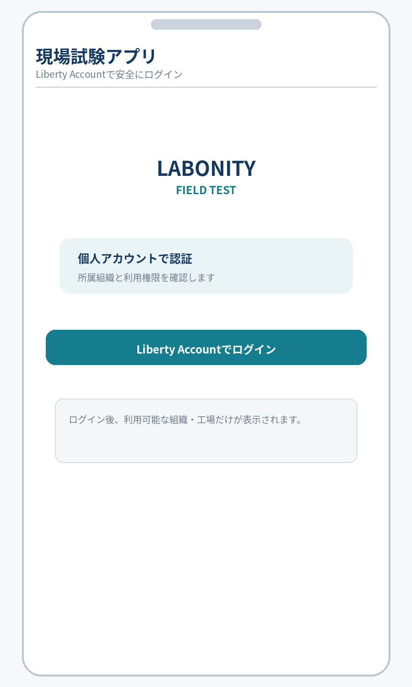

### 13.2 出荷予定一覧画面

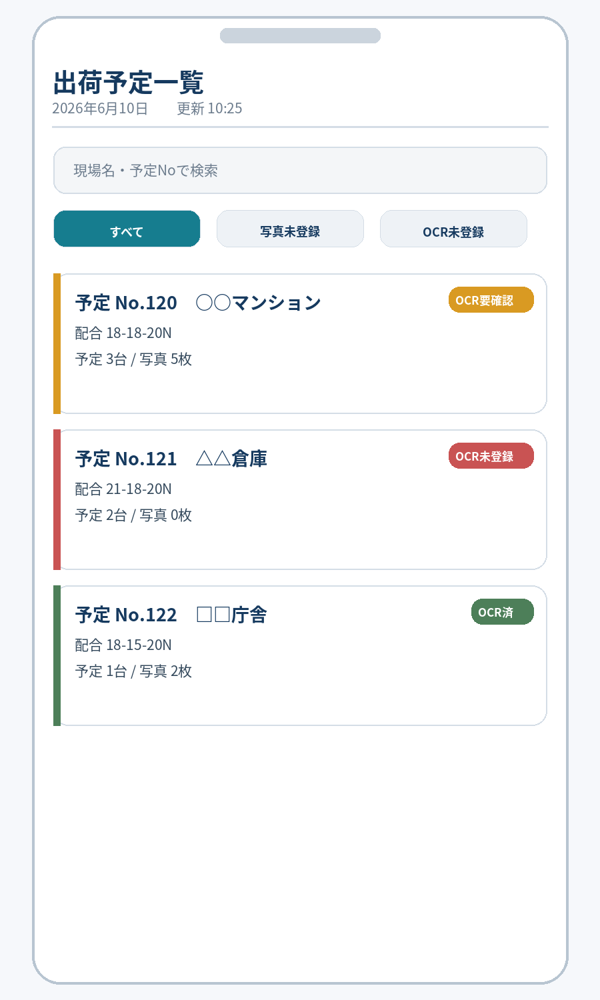

- ヘッダーに「出荷予定一覧」タイトルと更新ボタンを配置する。
- 日付ピッカーと検索バー（現場名・予定Noで検索）を上部に表示する。
- 「すべて」「写真未登録」「OCR用黒板未登録」の絞込タブを配置する。
- 各予定カードには、予定No、現場名、配合、出荷台数、写真枚数、OCR用黒板登録状態を表示する。
- 予定カードには、配下の出荷実績に OCR取込用黒板写真があるか、OCR予約済みか、読取済みかを補助バッジで表示する。
- OCR状態の補助バッジは、`OCR未登録 / OCR予約済 / OCR読取中 / OCR済 / 要確認 / 失敗` を区別できる表示にする。
- カード下部に「開く」ボタンを配置し、出荷予定詳細へ遷移する。

### 13.3 出荷予定詳細 / 出荷実績一覧画面

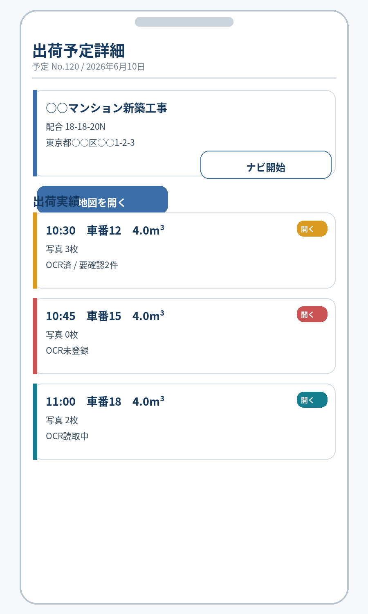

- 上部に予定詳細（現場名、予定No、配合、出荷予定日）をカード形式で表示する。
- 現場住所セクションに住所テキスト、「地図を開く」「ナビ開始」ボタンを配置する。
- 「出荷実績」セクションに各実績行を表示する。
- 実績行には、出荷時刻、車番、数量、写真枚数、OCR用黒板状態を表示する。
- 実績行には、OCR取込用黒板写真の有無、OCR予約済み、OCR済み、要確認などの状態を補助バッジで表示する。
- OCR用黒板状態は `未登録 / 予約済 / 読取中 / 読取済 / 要確認 / 失敗 / 対象外` を表示する。
- OCR済みの場合は、必要に応じて全体信頼度または要確認件数を併記する。
- 各行の「開く」ボタンから出荷実績詳細へ遷移する。

### 13.4 出荷実績詳細画面

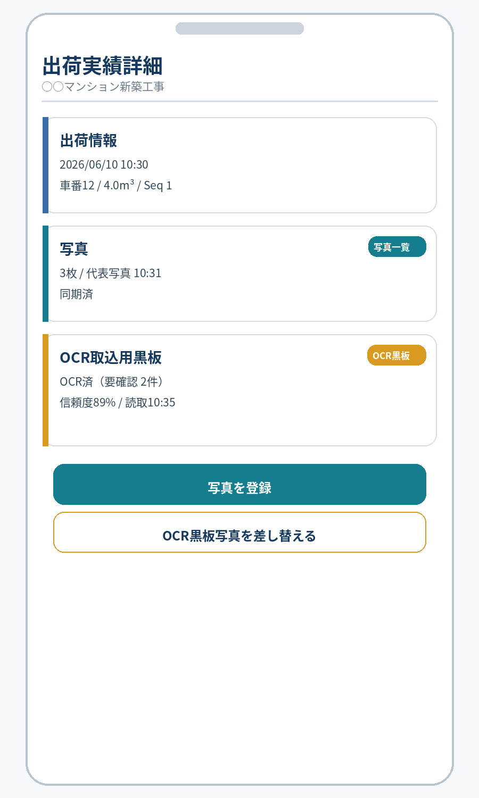

- 現場名をヘッダー下に大きく表示する。
- 「出荷情報」カードに出荷時刻、車番、数量、配合を表示する。
- 「写真」カードに状態、枚数、代表写真の撮影時刻、同期状態を表示する。
- 「OCR取込用黒板」カードに、登録状態、OCR状態、OCR予約状態、読取日時、全体信頼度、要確認件数、同期状態を表示する。
- OCR取込用黒板写真が保存済みの場合は「OCR黒板」バッジを表示し、通常写真と区別する。
- 写真サムネイルを横並びで表示する。
- 画面下部に「写真を登録」を配置する。押下後、用途（通常写真 / OCR取込用黒板写真）と取込方法（カメラ撮影 / ライブラリ選択）を選択する。

表示例:

```text
OCR取込用黒板
状態: OCR済（要確認 2件）
OCR予約: 予約済
同期状態: 同期済
全体信頼度: 89%
読取日時: 10:35

[OCR取込用黒板写真を差し替える]
```

### 13.5 写真登録メニュー

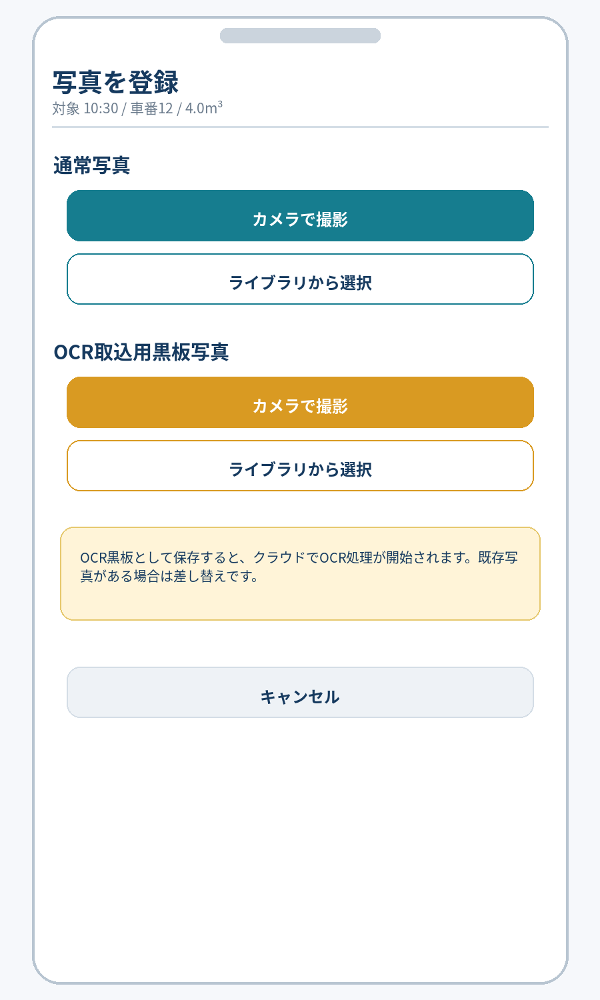

- ボトムシート形式で「写真を登録」メニューを表示する。
- 対象出荷（出荷日 / 出荷時刻 / 車番 / 数量 / 現場名）を上部に大きく表示する。
- 操作は「写真用途」と「取込方法」の 2 軸を明確に分け、4 つの操作として表示する。

| 写真用途 | 取込方法 | 表示ボタン | `source_type` | `capture_purpose` | OCR 対象 |
|---|---|---|---|---|---|
| 通常写真 | カメラ撮影 | 通常写真をカメラで撮影 | `camera` | `general` | 対象外 |
| 通常写真 | ライブラリ選択 | 通常写真をライブラリから選択 | `library` | `general` | 対象外 |
| OCR取込用黒板写真 | カメラ撮影 | OCR黒板写真をカメラで撮影 | `camera` | `fresh_test_ocr_blackboard` | 対象 |
| OCR取込用黒板写真 | ライブラリ選択 | OCR黒板写真をライブラリから選択 | `library` | `fresh_test_ocr_blackboard` | 対象 |

表示例:

```text
写真を登録
対象: 2026/06/10 10:30 / 車番12 / 4.0m3

通常写真
  [カメラで撮影]
  [ライブラリから選択]

OCR取込用黒板写真
  [カメラで撮影]
  [ライブラリから選択]

[キャンセル]
```

OCR取込用黒板写真は通常写真の任意分類ではなく、保存後に OCR ジョブ予約へ進む専用用途として扱う。カメラ撮影でもライブラリ選択でも、OCR取込用黒板写真として登録した場合だけ `capture_purpose = fresh_test_ocr_blackboard` とする。

既に OCR取込用黒板写真がある場合、OCR黒板写真のカメラ撮影またはライブラリ選択を実行すると差し替えになることを確認画面で表示する。

### 13.6 OCR黒板写真確認画面

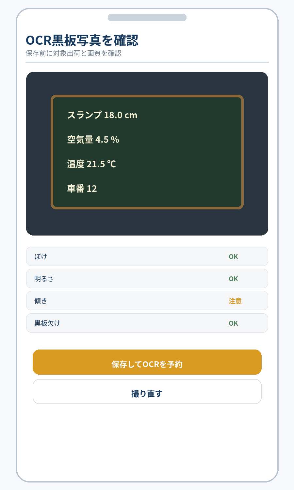

OCR取込用黒板写真は、カメラ撮影または端末ライブラリ選択後に専用画面で確認し、通常写真の確認画面とは保存後の扱いを明確に分ける。


確認時の表示:

- 黒板全体を写す。
- 反射を避ける。
- 斜めから撮りすぎない。
- 文字が読める距離で撮る。
- ぼけ、暗さ、傾き、黒板欠けのチェック結果を表示する。
- 保存後に OCR予約済みとなり、クラウド側で自動 OCR されることを表示する。
- 既に OCR取込用黒板写真がある場合は、保存すると差し替えになることを表示する。

### 13.7 写真一覧画面

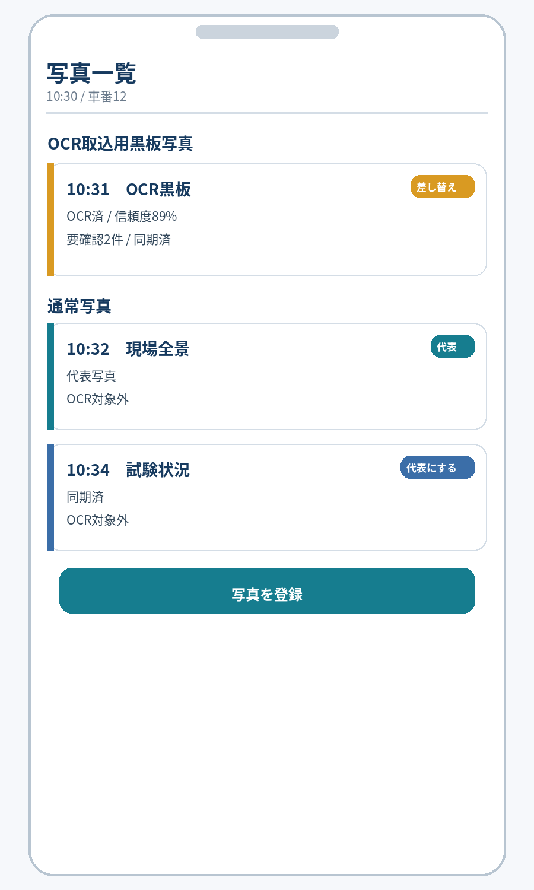

- 対象出荷（出荷時刻 / 車番）を上部に表示する。
- 通常写真カードを縦並びで表示し、各カードにサムネイル、撮影日時、「代表にする」「削除」ボタンを配置する。
- 代表写真には「代表写真」バッジを表示する。
- OCR取込用黒板写真は、通常写真とは別セクションに表示する。
- OCR取込用黒板写真には「OCR黒板」バッジを表示する。
- 写真カードには OCR状態を `OCR済 / 予約済 / 対象外 / 要確認 / 失敗` として表示する。
- OCR済みまたは要確認の場合は、全体信頼度を表示する。
- 通常写真には `OCR対象外` を表示し、自動 OCR 対象ではないことを明確にする。
- 画面下部に「写真を登録」を配置する。押下後、用途（通常写真 / OCR取込用黒板写真）と取込方法（カメラ撮影 / ライブラリ選択）を選択する。

### 13.8 保存完了画面

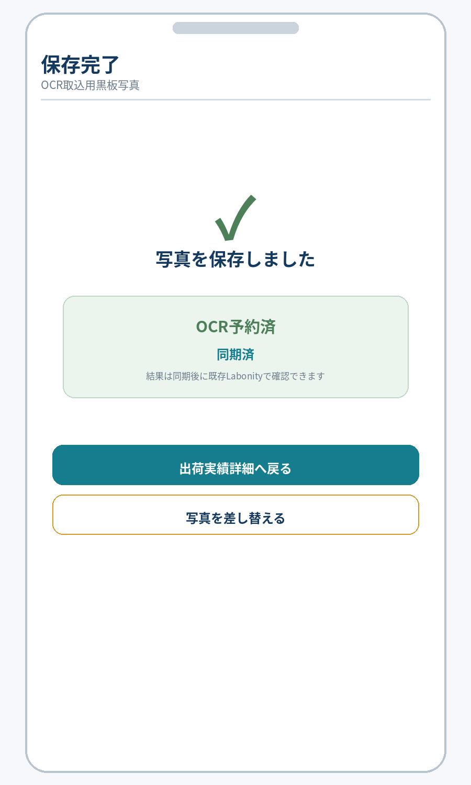

通常写真の場合:

- 保存成功を示すチェックマークアイコンとメッセージを表示する。
- 対象の出荷実績（出荷時刻、車番）を表示する。
- 保存内容のサマリー（写真枚数、代表写真、同期状態）を表示する。
- 「出荷実績詳細へ戻る」と「続けて写真を登録」を配置する。

OCR取込用黒板写真の場合:

- 保存成功を表示する。
- 「OCR予約済」と表示し、クラウド側で OCR 読取が行われることを示す。
- 写真メタデータとアップロードが完了した場合は「同期済」を表示する。
- OCR結果は Labonity 側で同期後に確認できることを表示する。
- 「出荷実績詳細へ戻る」と「差し替える」を配置する。

---

## 14. 画面仕様 / Labonity 側

### 14.1 TP採取結果入力画面

```text
TP採取結果入力 (一部)

対象TP: TP-20260610-001
現場: ○○現場
配合: 18-18-20N

【出荷情報】
[連番] [出荷時刻] [車番] [数量] [OCR状態]     [アクション]
  0    10:30     12    4.0m3  読取済       [OCR結果を確認]
  1    10:45     15    4.0m3  未登録       [出荷指定]
  2    11:00     18    4.0m3  読取中       [出荷指定]
```

`[OCR取込]` や `[OCR実行]` は表示しない。出荷指定後のローカル OCR 結果有無に応じて `[OCR結果を確認して反映]` を表示する。

### 14.2 OCR結果確認画面

OCR結果確認画面は、読取元写真と AI OCR 結果を常に同じ画面上に並べて表示する。人間が黒板写真を見ながら OCR値を確認・修正することがこの画面の目的であるため、写真を隠した状態や別画面参照を前提にした反映操作は行わない。

```text
+--------------------------------------------------------------------------------+
| OCR結果確認                                                                     |
|--------------------------------------------------------------------------------|
| 出荷実績: 10:30 / 車番12                                                       |
| 現場    : ○○マンション新築工事                                                 |
| 反映先  : renban 0 / datakubun 0                                               |
| 読取元  : OCR取込用黒板写真                                                    |
| 読取日時: 2026/06/10 10:35                                                     |
| 全体信頼度: 89%    画像品質: 82%    要確認: 2件                                |
|--------------------------------------------------------------------------------|
| 左: 読取元写真                                                                  |
| 右: 抽出結果                                                                    |
|                                                                                |
| 項目              現在値    OCR値      信頼度   反映値   状態                 |
| スランプ                    18.0       88%      18.0     要確認               |
| 空気量                      4.5        91%      4.5      OK                   |
| コンクリート温度            21.5       77%      21.5     要確認               |
| 外気温                      未読取     -        空欄     要入力               |
| 塩化物量                    0.03       90%      0.03     OK                   |
|                                                                                |
| [入力欄に反映] [保留] [手入力を続ける]                                         |
+--------------------------------------------------------------------------------+
```

#### 14.2.1 信頼度・検証結果による色分け

| 状態 | 表示 |
|---|---|
| OK | 行または信頼度セルを緑系で表示し、`OK` バッジを表示する。 |
| 注意 | 黄系または橙系で表示し、丸め、単位補正、軽微な信頼度低下を明示する。 |
| 要確認 | 赤系または濃い橙系で表示し、ユーザー確認を必須にする。 |
| 反映不可 | 灰系表示に赤系警告を併記し、反映値欄を空欄または編集必須にする。 |
| 現在値との差分あり | 差分セルを強調表示し、上書き確認を必須にする。 |

色分けは視認性を高めるための補助であり、色覚差や印刷確認を考慮して、文字ラベル、警告アイコン、ツールチップ、要確認件数も併用する。

#### 14.2.2 写真表示操作

| 操作 | 内容 |
|---|---|
| フィット表示 | 写真全体を左側ペイン内に収める。 |
| 拡大 / 縮小 | 黒板の文字確認用に倍率を変更できる。 |
| 回転 | EXIF 補正後でも見づらい場合に一時回転できる。 |
| 原寸表示 | 文字の細部確認用に 100% 表示する。 |
| 項目位置表示 | `bounding_polygon_json` がある場合、選択中の OCR 項目に対応する写真上の位置を枠表示できる。 |

### 14.3 反映ルール

OCR 値は、AI の信頼度が高い場合でも自動で入力欄へ流し込まない。必ず OCR結果確認画面で読取元写真と項目別結果を人間が確認し、必要に応じて反映値を修正したうえで [入力欄に反映] を押す。

| 状態 | 処理 |
|---|---|
| 反映先欄が空 | OCR値を反映値の初期値にする。 |
| 反映先欄に値あり・OCR値と同じ | OK 表示。 |
| 反映先欄に値あり・OCR値と異なる | 差分確認を必須にする。自動上書きしない。 |
| OCR値が低信頼度 | 要確認として表示する。 |
| OCR値が型変換不可 | 反映候補にしない。手入力を促す。 |
| OCR値がDB桁数超過 | 切り詰め候補と警告を表示する。 |
| datakubun=1 | データ2画面の入力欄へ反映する。 |
| 縦割り | 現在行の `renban` と `syukka_id` の組み合わせを守る。 |

### 14.4 画面反映表示

反映後は、保存前であることを明示する。

```text
OCR結果の値を入力欄へ反映しました。
保存すると Labonity DB へ反映されます。
```

### 14.5 OCR結果がない場合

対象 `syukka_id` の OCR 結果がローカルDBに存在しない場合、OCR結果確認画面は表示しない。

```text
この出荷実績には OCR結果がありません。
現場アプリで OCR取込用黒板写真が撮影されていない、または同期前の可能性があります。
手入力で業務を継続できます。
```

Labonity 側から OCR 実行を開始するボタンは表示しない。

---

## 15. セキュリティ・監査

### 15.1 Blob アクセス

- 写真本体への直接公開 URL は発行しない。
- アップロード時は短時間 SAS または同等の一時アップロード URL を使用する。
- Sync Agent が OCR取込用写真を取得する場合も短時間閲覧 URL を使用する。
- Labonity デスクトップアプリは閲覧 URL を取得しない。
- URL の有効期限は短く設定する。
- 写真削除は DB の論理削除と Blob 削除ポリシーを分離する。
- OCR や監査に使った写真は、保持期間内は参照可能にする。画面上の削除は論理削除扱いにする。

### 15.2 Labonity デスクトップのセキュリティ境界

Labonity デスクトップアプリは、クラウド認証情報、アクセストークン、Sync Agent credential を保持しない。

| 項目 | 方針 |
|---|---|
| クラウドAPI呼び出し | 行わない。 |
| Sync Agent ローカルAPI呼び出し | 行わない。 |
| OCR実行依頼 | 行わない。 |
| 写真表示 | Sync Agent が保存したローカル写真キャッシュを参照する。 |
| OCR結果 | Sync Agent が同期したローカルDBを参照する。 |
| 保存 | 既存 Labonity DB 保存処理を使用する。 |


### 15.2.1 Sync Agent credential のセキュリティ境界

Sync Agent はサーバー常駐サービスであるため、個人認証情報ではなく Agent credential を保持する。credential は Labonity サーバー上で保護し、Labonity デスクトップアプリやクライアント PC へ配布しない。

| 項目 | 方針 |
|---|---|
| 個人 token | 保存しない。 |
| refresh token | 使用しない。 |
| Agent credential | DPAPI / Credential Manager / 同等の OS 保護領域で保存する。 |
| access token | 短命。メモリ上で扱い、ログや設定ファイルに保存しない。 |
| credential 失効 | 管理者が即時失効できる。 |
| credential ローテーション | 新旧 credential の一時併用期間を持てるようにする。 |
| API 制限 | `/api/sync/v1/...` のみ許可する。 |
| 漏えい時対応 | credential 失効、再発行、agent heartbeat 停止、同期停止状態表示を行う。 |

```
Sync Agent に保存してよいもの:
  agentId
  clientId
  暗号化・保護された client secret または同等 credential
  orgId / plantId

Sync Agent に保存してはいけないもの:
  個人 accountId のパスワード
  個人 access token の長期保存
  個人 refresh token
  MFA セッション情報
  管理者用 token
```

### 15.3 監査ログ

以下の操作を AuditLog またはローカル監査テーブルに記録する。人間操作は `actor_type = user`、Sync Agent 操作は `actor_type = agent` として分離する。

| 操作 | 主な記録項目 |
|---|---|
| ログイン成功 / 失敗 | accountId, orgId, result, reason, ip, userAgent。 |
| 組織選択 | accountId, orgId。 |
| 認可拒否 | accountId, orgId, permission, resource, reason。 |
| 通常写真アップロード | accountId, orgId, plantId, shipmentId, photoAssetId。 |
| OCR取込用黒板写真アップロード | accountId, orgId, plantId, shipmentId, photoAssetId, ocrUsage。 |
| OCR自動ジョブ登録 | orgId, plantId, shipmentId, photoAssetId, jobId。 |
| OCR 実行結果 | orgId, plantId, jobId, resultId, status, confidence, qualityScore, needsReviewCount, model, schemaVersion。 |
| OCR 失敗 | orgId, plantId, jobId, errorCode, errorMessage。 |
| OCR結果同期 | actor_type=agent, agentId, orgId, plantId, resultId, sequence, result。 |
| 写真キャッシュ同期 / 写真ローカル保存 | actor_type=agent, agentId, orgId, plantId, photoAssetId, localFileId, result。 |
| OCR 画面反映 | localUser, syukka_id, renban, datakubun, resultId, appliedFields, correctedFields。 |
| Agent 登録 | actor_type=user, accountId, orgId, plantId, agentId, result。 |
| Agent credential 発行・失効・再発行 | actor_type=user, accountId, orgId, plantId, agentId, credentialId, result。secret は記録しない。 |
| Agent token 取得失敗 | actor_type=agent, agentId, orgId, plantId, errorCode, result。secret は記録しない。 |
| Sync import | actor_type=agent, agentId, orgId, plantId, sourceTable, count, result。 |
| イベント ACK | actor_type=agent, agentId, orgId, eventId, sequence, result。 |

### 15.4 OCR データ保持

| データ | 推奨保持 |
|---|---|
| 原本写真 | 業務要件に応じて保持。削除は論理削除を先行。 |
| サムネイル | 原本と同じ保持期間。 |
| OCR取込用写真ローカルキャッシュ | OCR結果確認に必要な期間保持。保持期間後または削除イベント後に削除する。 |
| OCR raw JSON | 監査が必要な期間のみ。長期保持しすぎない。 |
| OCR 抽出値 | 監査要件に応じて保持。 |
| OCR 信頼度・品質情報 | モデル改善、障害調査、ユーザー修正分析に必要な期間保持する。 |
| ユーザー修正履歴 | 業務監査と精度改善に必要な範囲で保持する。 |

### 15.5 OCR 精度改善のための記録

OCR結果の正しさは、ユーザーが確認・修正した結果から評価する。

| 記録 | 用途 |
|---|---|
| OCR値 | モデルが出した値。 |
| 反映値 | ユーザーが確定した値。 |
| 修正項目 | OCR値から変更された項目。 |
| 項目別信頼度 | 低信頼度と修正発生率の関係分析。 |
| 画像品質 | 画質と修正発生率の関係分析。 |
| モデル・プロンプトバージョン | モデル更新前後の比較。 |


### 15.6 OCR 修正値の二次利用制御

OCR 値、ユーザー修正値、反映値、画像品質、信頼度は、監査、障害調査、精度評価に有用である。ただし、初期リリースではモデル改善用の外部二次利用は無効とし、次の範囲に限定する。

| 用途 | 初期リリース扱い |
|---|---|
| 業務監査 | 有効。`[NaDat].[FieldTest].[FieldOcrImportAudit]` に記録する。 |
| 障害調査 | 有効。必要最小限の権限で参照する。 |
| OCR 精度評価 | 社内管理者向けの集計として利用可。個別写真の外部提供はしない。 |
| モデル改善用データセット化 | 初期リリースでは無効。別途管理設定、運用承認、保持期間、削除手段を定義してから有効化する。 |

モデル改善に使う場合は、`model_training_allowed` のような明示設定を追加し、対象テナント、対象期間、対象データ、匿名化方法、削除方法を管理画面で確認できるようにしてから運用する。


---

## 16. オフライン・エラー処理

### 16.1 現場アプリ

| 状態 | 処理 |
|---|---|
| 通信断で写真アップロード不可 | IndexedDB 等に未送信写真とメタデータを保持し、通信復旧後に再送する。 |
| upload-session 発行失敗 | エラー表示し、再試行可能にする。 |
| Blob PUT 成功 / commit 失敗 | 未 commit 状態として保持し、再 commit する。 |
| 写真重複 | `file_hash` と `clientRequestId` で重複登録を抑制する。 |
| 出荷実績が端末にない | 出荷実績一覧を更新し、対象出荷が表示されるまで写真登録を開始しない。 |
| OCR取込用黒板写真の画質警告 | 再登録を推奨する。ユーザーが保存を続行する場合は警告付きで保存する。 |
| OCR読取中 | 状態を表示し、通常の画面操作は継続可能にする。 |
| OCR失敗 | 失敗状態を表示し、再登録または手入力を促す。 |
| トークン期限切れ | 再認証を促す。未送信写真は保持する。 |

### 16.2 クラウド OCR

| 状態 | 処理 |
|---|---|
| OCR Worker 障害 | ジョブを retryable failed とし、バックオフ付きで再試行する。 |
| 画像取得不可 | `failed` とし、エラーコードを保存する。 |
| 黒板検出不可 | `needs_review` または `failed` とし、再登録推奨の警告を保存する。 |
| 低画質 | OCRは実行するが、`quality_score` と警告を保存する。 |
| モデル応答不正 | raw response とエラーを保存し、再試行または failed にする。 |
| 同一出荷で OCR取込用黒板写真を差し替え | 旧結果を `superseded` にし、新結果を `is_current = 1` にする。 |

### 16.3 Sync Agent

Sync Agent のエラー処理は、起動時構成エラーと運用中一時障害を分ける。

| 状態 | 処理 |
|---|---|
| 起動時に `LibLocal.xml` 不在 | `configuration_error` とし、同期処理を開始しない。 |
| 起動時に `LibertyDatabaseSetting.xml` 不在 | `configuration_error` とし、既定 DB へフォールバックしない。 |
| 起動時に必要 DB / テーブル / 権限不足 | `configuration_error` とし、同期処理を開始しない。 |
| 起動時に Agent credential 未設定 | `credential_error` とし、クラウド同期を開始しない。 |
| 運用中のクラウド API 一時失敗 | `degraded_retrying` としてリトライし、失敗回数・最終エラーを `[NaDat].[FieldTest].[FieldSyncLog]` に記録する。 |
| 運用中のローカル DB 一時接続失敗 | `degraded_retrying` としてサービスプロセスは維持し、次周期で再試行する。 |
| 運用中の写真出力先一時切断 | `degraded_retrying` とし、MaterializeJob を `retry_wait` にする。 |
| 同期途中停止 | checkpoint から再開する。 |
| 重複送信 | idempotency_key により重複登録しない。 |
| 写真メタデータ ACK 失敗 | ACK が完了するまで再取得対象にする。 |
| OCR結果 ACK 失敗 | ACK が完了するまで再取得対象にする。 |
| 写真キャッシュ失敗 | `cache_status = failed` とし、次周期で再試行する。 |
| out-of-order イベント | `event_sequence` により順序制御し、古いイベントで新しい状態を上書きしない。 |
| 認可エラー | credential の orgId / plantId / scope を確認し、同期を停止して管理ログに出す。 |
| 二重 agent lease 競合 | 片方を `stopped_duplicate` とし、二重同期・二重エクスポートを防止する。 |

Windows Service のプロセスは、構成エラー時も診断情報を残すため起動状態を保ってよい。ただし、同期ジョブ、import、event pull、ACK、download-url 取得は開始しない。

### 16.4 Labonity OCR 取込

| 状態 | 処理 |
|---|---|
| OCR結果なし | OCR結果確認画面を表示しない。通常業務を継続する。 |
| OCR結果処理中 | `OCR読取中` と表示する。手入力は継続できる。 |
| OCR結果同期前 | ローカルDBに結果がないため、通常業務を継続する。 |
| ローカル写真キャッシュなし | 画像なしで OCR結果を表示するか、読取元写真未取得と表示する。OCR値の確認・反映は可能にする。 |
| OCR失敗 | エラー内容を表示し、手入力継続を選択できる。 |
| 低信頼度 | 要確認として表示する。 |
| 現在値と差分あり | 自動上書きせず、差分確認画面を表示する。 |
| 複数候補あり | 候補選択または手入力にする。 |
| 保存前に画面を閉じる | DBへは反映されない。必要に応じて破棄確認を出す。 |
| 保存失敗 | 通常保存エラーを表示し、OCR反映監査は `save_failed` にする。 |


### 16.5 ローカル写真自動保存のエラー処理

| 状態 | 処理 |
|---|---|
| 写真メタデータは同期済みだが JPEG 未生成 | `FieldPhotoLocalFile.materialize_status = queued` または `downloading` とし、Labonity では「ローカル保存待ち」と表示する。 |
| クラウドから写真取得失敗 | MaterializeJob をバックオフ付きで再試行する。イベント ACK はメタデータ反映済みなら完了扱いにし、ファイル生成はジョブで追跡する。失敗回数、最古滞留時刻、未生成件数を `FieldSyncAgentHealth` と heartbeat に反映する。 |
| HEIC / PNG から JPEG 変換失敗 | `failed` とし、元 MIME type、エラーコードを記録する。可能であれば内部キャッシュに原本を保持し、夜間再試行する。 |
| 出力先フォルダ権限不足 | SyncLog と Windows EventLog に記録し、管理画面またはログで検知できるようにする。 |
| ディスク容量不足 | 低容量警告、ジョブ停止、管理者通知対象にする。既存ファイルを勝手に削除しない。 |
| パス長超過 | 生成時に `MaxFullPathLength` 以内へ収まるまで、現場名、予定名、車番、階層名を段階的に短縮し、ID 短縮値を付けた安全名で再生成する。初期値は 240 文字以内を推奨する。 |
| ユーザーによるファイル削除 | 検証ジョブで検知し、クラウド側写真が削除されていなければ再生成する。 |
| ユーザーによるファイル改変 | ハッシュ不一致として検知し、設定により上書き再生成または `_modified_by_user` へ退避する。 |
| ネットワーク共有一時切断 | ジョブを `retry_wait` にし、次周期で再試行する。Labonity は最後に成功した既存ファイルがあれば表示継続できる。 |

---

## 17. 受入条件

| No | 受入条件 |
|---|---|
| A-01 | 現場試験 Web アプリは Liberty Account でログインできる。 |
| A-02 | ログイン後、利用可能な組織だけを選択できる。 |
| A-03 | `LABONITY_FIELD_TEST` の Grant がない組織では利用できない。 |
| A-04 | 全 API で URL の orgId、トークン所属 org、DB の tenant_id が一致することを検証する。 |
| A-05 | Sync Agent は専用 credential で同期 API を利用できる。 |
| A-06 | Sync Agent の credential では現場アプリ API を利用できない。 |
| A-07 | Labonity デスクトップアプリはクラウド認証を行わない。 |
| A-08 | Labonity デスクトップアプリはクラウドAPIを直接呼び出さない。 |
| A-09 | Labonity デスクトップアプリは Sync Agent に OCR 実行依頼を行わない。 |
| A-10 | 現場アプリで、出荷予定一覧を表示できる。 |
| A-11 | 現場アプリで、出荷予定に紐づく出荷実績一覧を表示できる。 |
| A-12 | 現場アプリで、出荷実績詳細に現場住所を表示できる。 |
| A-13 | 出荷実績詳細から Google Maps を開ける。 |
| A-14 | 緯度経度または住所がない場合、地図ボタンは非活性または住所未設定として表示される。 |
| A-15 | 現場アプリで、出荷実績に対して通常写真をカメラ撮影またはライブラリ選択で保存できる。 |
| A-16 | 現場アプリで、出荷実績に対して OCR取込用黒板写真をカメラ撮影またはライブラリ選択で保存できる。 |
| A-17 | `capture_purpose = fresh_test_ocr_blackboard` として保存した写真だけが自動 OCR 対象になる。 |
| A-18 | 通常写真は自動 OCR 対象にならない。 |
| A-19 | 1 つの出荷実績に対し、現在有効な OCR取込用黒板写真は 1 件に制御される。 |
| A-20 | OCR取込用黒板写真を差し替えた場合、旧OCR結果は `superseded` になり、新OCR結果が現在有効になる。 |
| A-21 | PhotoAssetTarget に `target_type = shipment` / `target_id = shipment_id` が保存される。 |
| A-22 | `SyukkaDataMain.syukka_id` は `target_source_local_id` として保持され、クラウドの `shipment_id` と混同されない。 |
| A-23 | 1 つの出荷実績に複数枚の通常写真を紐づけられる。 |
| A-24 | 代表写真は自動設定され、同一出荷に代表写真が複数できない。 |
| A-25 | Sync Agent により、現場関連データをローカルDBからクラウドへ単方向同期できる。 |
| A-26 | Sync Agent により、出荷予定関連データをローカルDBからクラウドへ単方向同期できる。 |
| A-27 | Sync Agent により、出荷実績関連データをローカルDBからクラウドへ単方向同期できる。 |
| A-28 | 現場アプリから、現場・出荷予定・出荷実績の参照データを編集できない。 |
| A-29 | 写真 commit 後、PhotoAsset / PhotoAssetTarget の参照メタデータがローカル参照用テーブルへ同期される。 |
| A-30 | OCR取込用黒板写真 commit 後、クラウド側で自動 OCR ジョブが作成される。 |
| A-31 | OCR結果はクラウドDBに保存される。 |
| A-32 | OCR結果には、抽出値、項目別信頼度、全体信頼度、画像品質、検証結果、警告、モデル情報、プロンプト情報が保存される。 |
| A-33 | OCR項目別結果は、canonical key、raw text、normalized value、confidence、needsReview、warnings を保持する。 |
| A-34 | OCR結果イベントが発行され、Sync Agent がローカル OCR 参照テーブルへ同期できる。 |
| A-35 | Sync Agent は OCR取込用黒板写真とサムネイルをローカル写真キャッシュへ保存できる。 |
| A-36 | ローカル側は FieldPhotoReference により、出荷実績に写真があるかを判定できる。 |
| A-37 | ローカル側は FieldOcrResultReference により、出荷実績に OCR結果があるかを判定できる。 |
| A-38 | Labonity 側で出荷実績を指定した際、その出荷に紐づく OCR結果があれば確認画面を表示できる。 |
| A-39 | Labonity 側の OCR結果確認画面に、OCR値、信頼度、警告、現在値、反映値、読取元写真を表示できる。 |
| A-40 | 低信頼度項目、現在値との差分、候補複数項目、型変換不可項目は確認必須になる。 |
| A-41 | ユーザー確定後、値は TP採取結果入力画面のフレッシュ試験入力欄へ流し込まれる。 |
| A-42 | データベースへの直接保存は行わず、TP採取結果入力画面の通常保存処理で反映される。 |
| A-43 | 新規未保存 TP でも、出荷指定後に同期済み OCR結果を確認・反映できる。 |
| A-44 | 縦割り TP で renban 0/1/2 の各行に対し、対応する syukka_id の OCR結果だけを候補表示できる。 |
| A-45 | OCR反映先は Labonity 画面の現在 renban と datakubun の両方で特定される。 |
| A-46 | datakubun=1 の画面でOCR結果を反映した場合、datakubun=1 の入力欄へ反映される。 |
| A-47 | 予定No が同じでも工場が異なる場合、予定・出荷・写真・OCR結果が混線しない。 |
| A-48 | 対象出荷が現場アプリに表示されない場合、写真登録メニューは開始できず、出荷実績の更新案内と標準カメラ撮影後のライブラリ登録案内を表示できる。 |
| A-49 | 写真削除・代表写真変更・表示順変更・OCR取込用黒板写真差し替えが FieldPhotoReference に反映される。 |
| A-50 | OCRで反映した値について、OCR値・信頼度・現在値・最終反映値・修正項目を監査できる。 |
| A-51 | 出荷予定一覧・出荷実績一覧で、OCR未登録、OCR予約済、OCR読取中、OCR済、要確認、失敗の状態を補助バッジで確認できる。 |
| A-52 | 出荷実績詳細と写真一覧で、OCR取込用黒板写真には「OCR黒板」バッジ、OCR状態、信頼度、同期状態を表示できる。 |
| A-53 | 保存完了画面で、OCR取込用黒板写真の保存時に「OCR予約済」と「同期済」を確認できる。 |
| A-54 | Sync Agent は commit 済みの通常写真をローカル指定フォルダへ JPEG として自動保存できる。 |
| A-55 | Sync Agent は OCR取込用黒板写真を通常写真より高い優先度でローカル指定フォルダへ JPEG として自動保存できる。 |
| A-56 | ローカル写真は `tenant_id + plant_id + syukka_id` を基準に出荷別フォルダへ分類される。 |
| A-57 | ローカル写真ファイル名には `photo_asset_id` またはその短縮値が含まれ、同名衝突しない。 |
| A-58 | HEIC / PNG 等でアップロードされた写真も、ローカル保存時は EXIF orientation 補正済み JPEG として出力される。 |
| A-59 | `FieldPhotoLocalFile` に、ローカルファイルパス、variant、ハッシュ、サイズ、生成状態、エラーが保存される。 |
| A-60 | Labonity デスクトップアプリは、ローカルDBから写真ファイルパスを取得し、通常のファイルアクセスで画像を表示できる。 |
| A-61 | Labonity デスクトップアプリは、写真表示・OCR結果確認のために HTTP、localhost API、Named Pipe、gRPC、TCP ソケット、Sync Agent ローカル API を使用しない。 |
| A-62 | 写真ファイルが未生成・失敗・削除済みの場合、Labonity は Sync Agent を呼び出さず、ローカルDBの状態に基づき「ローカル保存待ち」「取得失敗」「削除済み」を表示できる。 |
| A-63 | 写真削除・OCR黒板差し替え・代表写真変更・表示順変更は、ローカル写真ファイル管理状態と manifest に反映される。 |
| A-64 | Sync Agent はローカル写真出力先の権限不足、容量不足、パス長超過、変換失敗をログに残し、再試行または管理者確認対象にできる。 |
| A-65 | 写真メタデータ同期とローカルJPEG生成は冪等であり、同じ PhotoReferenceEvent を複数回処理しても重複ファイルや重複DB行が作成されない。 |
| A-66 | 出力フォルダを管理者が変更した場合、手動再同期により指定期間または指定 `syukka_id` の写真を再エクスポートできる。 |
| A-67 | Sync Agent は本番運用では Labonity サーバーにインストールされ、クライアント PC ごとのインストールを前提にしない。 |
| A-68 | Sync Agent 設定で `LabonityLocalSettingFilePath` として Labonity の `Settings\LibLocal.xml` を指定できる。 |
| A-69 | Sync Agent は `LibLocal.xml` の `BasicServerFolder/p_サーバーフォルダパス` を読み取り、Labonity サーバーフォルダを解決できる。 |
| A-70 | Sync Agent は解決したサーバーフォルダ配下の `LibertyDatabaseSetting.xml` を読み取り、SQL Server 接続情報と DB 名を解決できる。 |
| A-71 | Sync Agent は `LibLocal.xml` または `LibertyDatabaseSetting.xml` が存在しない場合、既定 DB 接続へフォールバックせず同期停止状態にできる。 |
| A-72 | Sync Agent は起動時にマスターDB、出荷管理DB、品質管理DB、共通設定DBへの接続と必要テーブルの参照権限を検証できる。 |
| A-73 | Sync Agent は同一 `tenant_id + plant_id` に対する二重稼働を検知し、二重同期・二重エクスポートを防止できる。 |
| A-74 | 写真出力先は `WriterRootPath` として設定でき、ローカルディスクまたは UNC 共有パスを指定できる。 |
| A-75 | 複数 Labonity クライアントで写真を参照する場合、`LabonityVisibleRootPath` として UNC 共有パスを設定し、Labonity にはその参照パスを保存できる。 |
| A-76 | Sync Agent サービスアカウントは、`LibLocal.xml`、Labonity サーバーフォルダ、`LibertyDatabaseSetting.xml`、SQL Server、写真出力先フォルダに必要な権限を持つ。 |
| A-77 | Sync Agent のログ、診断画面、エラー表示では SQL パスワードや接続文字列のパスワード部分を出力しない。 |
| A-78 | 写真出力先の権限不足、共有パス未到達、容量不足、パス長超過は起動時または同期時に検知し、管理者確認対象として記録できる。 |
| A-79 | `LibLocal.xml` や DB 設定が変更された場合、Sync Agent の再起動または手動再読込により新設定を検証し直せる。 |
| A-80 | DB 接続解決、写真出力先、クラウド credential、最終同期時刻、未処理ジョブ数、失敗ジョブ数を管理者が確認できる。 |
| A-81 | 現場試験 Web アプリは個人 `accountId` を認証主体とし、Sync Agent は `agentId` を認証主体として扱える。 |
| A-82 | Sync Agent は個人ユーザーのパスワード、access token の長期保存、refresh token、MFA セッションを保持しない。 |
| A-83 | Sync Agent は `orgId + plantId + agentId` に紐づく Agent credential により短命 access token を取得できる。 |
| A-84 | Sync Agent 用 access token には `agentId`、`orgId`、`plantId`、必要 scope が含まれ、API 側で検証される。 |
| A-85 | Sync Agent credential では `/api/sync/v1/...` のみ利用でき、現場アプリ API、管理 UI API、他テナント API は利用できない。 |
| A-86 | TenantAdmin または `FieldTest:Agent:Manage` 権限を持つ管理者が、Sync Agent の登録、失効、credential 再発行を実行できる。 |
| A-87 | 初回登録コードを使用する場合、短時間有効・一回限りであり、通常の同期 API 呼び出しには使用されない。 |
| A-88 | Agent credential はサーバー上で DPAPI、Credential Manager、または同等の保護領域に保存され、平文ログに出力されない。 |
| A-89 | Agent credential の失効後、Sync Agent は新しい access token を取得できず、同期停止状態として管理者に表示される。 |
| A-90 | Agent credential のローテーション時、新旧 credential の移行期間を設けて安全に切り替えられる。 |
| A-91 | 人間操作は `actor_type = user` と `account_id`、Sync Agent 操作は `actor_type = agent` と `agent_id` で監査ログに記録される。 |
| A-92 | POST 用キー相当の仕組みを使う場合でも、固定 API key を同期 API へ直接投げ続ける方式ではなく、Agent credential または初回登録コードとして発行・失効・ローテーション・監査できる。 |
| A-93 | Sync Agent が token 取得に失敗した場合、DB 同期・写真取得・ACK を実行せず、最終エラー、agentId、orgId、plantId を管理ログに記録できる。 |
| A-94 | Sync Agent の診断画面では agentId、orgId、plantId、credential 状態、token 最終取得時刻を確認できるが、secret、access token、SQL パスワードは表示しない。 |
| A-95 | ローカル連携テーブルは、新しい物理DBではなく、`p_出荷管理データベース名` で解決した既存出荷管理DB内の `[FieldTest]` スキーマに作成される。 |
| A-96 | `tenant_id`、`plant_id`、`syukka_id`、`yotei_id`、`genba_id`、`testpiecesaisyu_main_id` の SQL 型と API 表現が固定されている。 |
| A-97 | 端末ライブラリから選択した写真を、通常写真または OCR取込用黒板写真として明示的に登録できる。 |
| A-98 | 出荷実績未同期時はアプリ内で未紐づけ写真を作らず、スマホ標準カメラで撮影後、同期後にライブラリ登録する案内を表示できる。 |
| A-99 | 保存済み TP では、OCR 反映前に `[ExDat].[dbo].[TestPieceSaisyu_SyukkaData]` の `testpiecesaisyu_main_id + renban + syukka_id` 一致を検証できる。 |
| A-100 | OCR 結果の `syukka_id` と現在行の出荷指定が不一致の場合、反映ボタンを無効化できる。 |
| A-101 | OCR結果確認画面に、反映先 TP、renban、datakubun、出荷日、出荷時刻、車番、数量、現場名を表示できる。 |
| A-102 | 同じ OCR 結果を同じ `testpiecesaisyu_main_id + renban + datakubun` へ再反映する場合、前回反映履歴を検出し確認できる。 |
| A-103 | Sync Agent は起動時構成エラーと運用中一時障害を区別し、前者は同期開始禁止、後者は `degraded_retrying` で再試行できる。 |
| A-104 | Sync Agent は heartbeat に最終同期時刻、未処理イベント数、未生成写真数、失敗ジョブ数、最古滞留時刻、容量状態を含められる。 |
| A-105 | heartbeat 未更新、出荷同期停止、OCRイベント滞留、JPEG未生成、容量不足を閾値で管理者確認対象にできる。 |
| A-106 | PhotoReferenceEvent はメタデータ反映と MaterializeJob 登録後に ACK でき、JPEG 生成失敗は MaterializeJob と `FieldSyncAgentHealth` で追跡できる。 |
| A-107 | Sync Agent 用 access token の audience は sync API 専用であり、download-url API は orgId、plantId、photoAssetId、scope を検証できる。 |
| A-108 | Agent credential 漏えい疑い時に、失効、再発行、ローテーション、heartbeat 停止確認を実行できる。 |
| A-109 | ローカル写真パスは生成時に `MaxFullPathLength` 以内へ短縮され、Labonity で開けない長さのパスを保存しない。 |
| A-110 | OCR 値は DB 型、桁数、単位、業務妥当範囲、車番一致、既存値差分で検証できる。 |
| A-111 | OCR 修正値のモデル改善用二次利用は初期リリースでは無効であり、利用する場合は別途管理設定と運用承認が必要になる。 |
| A-112 | 出荷管理DBの `[FieldTest]` スキーマに連携テーブルを作成・更新するスクリプトを用意し、起動時に存在と権限を検証できる。 |
| A-113 | Labonity 側は `[ExDat].[dbo]` の TP コンテキストと `[出荷管理DB].[FieldTest]` の OCR・写真参照を、cross database query またはアプリ側2段階参照で取得できる。 |
| A-114 | 同一 `tenant_id + plant_id` の active agent は 1 つに制御され、サーバー故障時は管理者が旧 agent 無効化または lease 解除後に手動フェイルオーバーできる。 |
| A-115 | OCR取込用黒板写真をライブラリから選択した場合も、既存 OCR黒板写真との差し替え、`is_ocr_primary` 制御、OCR 自動ジョブ登録が正しく動作する。 |
| A-116 | 写真登録メニューでは、写真用途（通常写真 / OCR取込用黒板写真）と取込方法（カメラ撮影 / ライブラリ選択）を混同しない 4 操作として表示できる。 |
| A-117 | カメラ撮影かライブラリ選択かは `source_type` に保存され、OCR対象可否は `capture_purpose` によって判定される。 |
| A-118 | OCR結果確認画面では、読取元写真と AI OCR 結果を常に同一画面で隣接表示できる。 |
| A-119 | OCR結果確認画面では、信頼度・画像品質・型変換・桁数・範囲・差分に応じて項目行を色分けし、文字ラベルと警告アイコンも併用できる。 |
| A-120 | OCR値は AI の信頼度が高い場合でも人間確認なしに自動反映されず、ユーザーが確認後に [入力欄に反映] を押した場合だけ画面入力欄へ流し込まれる。 |
| A-121 | 新しい物理データベースを作成せず、既存の出荷管理データベースを使用し、既存の `dbo` テーブルを変更しない。 |
| A-122 | `LibertyDatabaseSetting.xml` の既存 `p_出荷管理データベース名` を使用して接続先を解決し、新しいDB名項目を追加しない。連携スキーマ名は `LocalIntegrationSchemaName = FieldTest` で明示する。 |
| A-123 | Sync Agent は起動時に出荷管理データベース、`FieldTest` スキーマ、必要12テーブル、サービスアカウント権限を検証し、不足時は同期を開始しない。 |

---

## 18. 実装メモ

### 18.1 必須実装

- Liberty Account ログインを現場試験 Web アプリに組み込む。
- ログイン後に `/accounts/me?includePermissions=true` 相当の情報を取得し、組織と権限を解決する。
- `LABONITY_FIELD_TEST` の Grant 判定を API 側で行う。
- API は orgId を URL に含め、トークン所属 org と DB tenant_id を照合する。
- Sync Agent を .NET Worker Service / Windows Service として実装する。
- Sync Agent は本番運用では Labonity サーバーにインストールする前提でインストーラーと運用手順を作成する。
- Sync Agent 設定で Labonity の `Settings\LibLocal.xml` のパスを指定できるようにする。
- Sync Agent は `LibLocal.xml` から Labonity サーバーフォルダを解決し、`LibertyDatabaseSetting.xml` から DB 接続情報を取得する。
- Sync Agent は DB 設定不足時に既定値へフォールバックせず、同期停止状態として管理ログに出す。
- Sync Agent は `p_出荷管理データベース名` で解決したDBの `[FieldTest]` スキーマに、ローカル連携テーブルと管理テーブルが存在すること、参照・更新権限があることを起動時に検証する。
- Sync Agent は写真出力先の `WriterRootPath` と Labonity 参照用の `LabonityVisibleRootPath` を設定できるようにする。
- 複数クライアント運用では `LabonityVisibleRootPath` を UNC 共有パスにする。
- Sync Agent credential を orgId + plantId + agentId 単位で管理する。
- Sync Agent credential は個人アカウントとは分離し、Agent credential として登録・失効・再発行・ローテーションできるようにする。
- Sync Agent は Agent credential で短命 access token を取得し、個人 refresh token は使用しない。
- Sync Agent credential では `/api/sync/v1/...` のみ呼び出せるように API 側で制限する。
- Agent credential は DPAPI / Credential Manager 等で保護し、ログ・診断画面に secret や token を表示しない。
- 現場関連、出荷予定関連、出荷実績関連の import API を実装する。
- Sync Agent はローカルDBからクラウドへ基幹参照データを単方向 Upsert する。
- 写真本体は Blob Storage に保存する。
- PhotoAsset / PhotoAssetTarget を保存する。
- `capture_purpose = general` の通常写真を保存できるようにする。
- `capture_purpose = fresh_test_ocr_blackboard` の OCR取込用黒板写真を保存できるようにする。
- OCR取込用黒板写真 commit 後に自動 OCR ジョブを登録する。
- OCR / LLM Worker は抽出値、項目別信頼度、全体信頼度、画像品質、検証結果、警告、モデル情報を保存する。
- OcrImportJob / OcrImportResult / OcrImportResultField を保存する。
- OcrResultEvent を発行する。
- Sync Agent は PhotoReferenceEvent を pull し、FieldPhotoReference へ反映する。
- Sync Agent は OcrResultEvent を pull し、FieldOcrResultReference / FieldOcrResultFieldReference へ反映する。
- Sync Agent は OCR取込用黒板写真とサムネイルをローカル写真キャッシュへ保存する。
- Sync Agent は通常写真を含む commit 済み写真をローカル指定フォルダへ出荷別に JPEG 保存する。
- `[NaDat].[FieldTest].[FieldPhotoLocalFile]` / `[NaDat].[FieldTest].[FieldPhotoMaterializeJob]` / `[NaDat].[FieldTest].[FieldPhotoExportConfig]` を実装する。
- `[NaDat].[FieldTest].[FieldSyncCheckpoint]` / `[NaDat].[FieldTest].[FieldSyncLog]` / `[NaDat].[FieldTest].[FieldSyncAgentHealth]` / `[NaDat].[FieldTest].[FieldSyncAgentLease]` を実装する。
- Labonity 側は FieldPhotoReference と FieldPhotoLocalFile のパスを参照し、ローカルファイルとして写真を表示する。
- Labonity 側と Sync Agent 間の HTTP / Named Pipe / IPC 連携は実装しない。
- 対象出荷が表示されない場合、写真登録メニューを開始せず、出荷実績の更新案内を表示する。
- 出荷実績詳細画面に [写真を登録] を配置する。
- 写真登録メニューに、通常写真のカメラ撮影、通常写真のライブラリ選択、OCR取込用黒板写真のカメラ撮影、OCR取込用黒板写真のライブラリ選択を配置する。
- カメラ撮影かライブラリ選択かは `source_type`、通常写真か OCR取込用黒板写真かは `capture_purpose` で保存する。
- 出荷実績詳細画面に [地図を開く] [ナビ開始] を配置する。
- Google Maps 起動 URL は緯度経度を優先し、なければ住所文字列で生成する。
- Labonity 側の TP採取結果入力で、出荷指定時にローカル OCR 結果有無を確認する。
- OCR結果がある場合、OCR結果確認画面を表示する。
- OCR結果を `renban + datakubun` の画面入力欄へ反映する前に、保存済み TP では `[ExDat].[dbo].[TestPieceSaisyu_SyukkaData]` の `testpiecesaisyu_main_id + renban + syukka_id` 一致を検証する。
- OCR結果を `renban + datakubun` の画面入力欄へ反映する。
- OCR反映監査として、OCR値・信頼度・現在値・反映値・修正項目を記録する。
- Labonity デスクトップアプリはクラウド API と Sync Agent ローカル API を呼び出さない。

### 18.2 対象外

- 現場アプリでのフレッシュ試験値入力。
- 現場アプリでの電子黒板合成。
- 現場アプリでの黒板レイアウト編集。
- 現場アプリでの通常写真分類入力。
- 出荷実績が表示されていない状態でのアプリ内写真先行登録。ただし、スマホ標準カメラで撮影済みの写真を、出荷実績同期後にライブラリから登録する運用は対象とする。
- 予定・車番・時刻から出荷実績へ写真を自動紐づけする機能。
- Labonity デスクトップアプリでの Liberty Account 認証。
- Sync Agent での個人ユーザー refresh token 保存。
- Sync Agent を特定ユーザーの代理ログインとして扱うこと。
- 固定 API key を同期 API に直接付けて恒久利用する方式。
- Labonity デスクトップアプリからのクラウド API 呼び出し。
- Labonity デスクトップアプリから Sync Agent への OCR 実行依頼。
- Labonity デスクトップアプリでの写真選択 OCR 実行。
- 現場アプリからの出荷予定・出荷実績・現場マスター編集。
- 写真本体のローカルDB保存。
- クラウドからローカルDBへの直接接続。
- アプリ内地図埋め込み。
- 距離・所要時間計算。
- OCR API による Labonity DB への直接保存。

### 18.3 最終ルール

```text
写真は出荷実績に紐づける。
クラウドでは shipment_id を写真関連の主キーとして扱う。
Labonity 側では syukka_id を写真・OCR結果の検索キーとして扱う。
ローカル連携テーブルは、既存の出荷管理DB内の FieldTest スキーマに配置する。
TP 採取結果、FreshSiken、TP と出荷の関係は ExDat を正とする。
`capture_purpose = fresh_test_ocr_blackboard` として保存された写真だけをクラウド側で自動OCRする。
OCR結果は抽出値、信頼度、品質情報、検証結果、警告、モデル情報とともにDBへ保存する。
Sync Agent は OCR結果とOCR取込用写真をローカルへ同期する。
Sync Agent は通常写真を含む commit 済み写真をローカル指定フォルダへ出荷別JPEGとして自動保存する。
Sync Agent は本番運用では Labonity サーバーに配置し、同一工場に対する二重稼働を防ぐ。
Sync Agent は Labonity の Settings\LibLocal.xml を起点に DB 接続情報を解決し、DB接続情報を二重管理しない。
Sync Agent は個人認証ではなく、orgId + plantId + agentId に紐づく Agent credential で認証する。
Sync Agent は個人の refresh token を保持せず、Agent credential で短命 access token を取得する。
Sync Agent credential では同期 API のみを呼び出せる。
写真保存先は Sync Agent 設定で指定し、複数クライアント運用では Labonity が参照できる UNC 共有パスを保存する。
Labonity デスクトップアプリはローカルDBとローカル写真ファイルだけを参照する。
Labonity デスクトップアプリはクラウド認証、クラウドAPI呼び出し、Sync Agent へのOCR依頼、HTTP、Named Pipe、gRPC、TCP ソケット等の IPC を行わない。
OCR結果は TP採取結果入力画面上の現在 renban + datakubun の入力欄へ反映する。
保存済み TP では、ExDat.dbo.TestPieceSaisyu_SyukkaData により testpiecesaisyu_main_id + renban + syukka_id の一致を検証してから反映する。
DB 保存は TP採取結果入力画面の通常保存で行う。
```

---

## 19. ローカル写真自動保存・出荷別JPEGエクスポート詳細設計

### 19.1 結論

現場アプリで撮影された写真は、クラウド Blob Storage への保存を完了した後、Sync Agent がローカル環境へ自動保存する。Labonity デスクトップアプリは、Sync Agent と通信せず、ローカルDBに保存されたパスを使って JPEG ファイルを直接参照する。

```text
現場アプリ
  -> 写真 upload-session
  -> Blob PUT
  -> 写真 commit
  -> PhotoReferenceEvent
  -> Sync Agent がイベント取得
  -> FieldPhotoReference 更新
  -> FieldPhotoMaterializeJob 登録
  -> Blob から写真取得
  -> JPEG 正規化
  -> 出荷別フォルダへ atomic write
  -> FieldPhotoLocalFile 更新
  -> Labonity はローカルDB + ローカルファイルだけを参照
```

この方式では、Labonity デスクトップアプリにクラウド通信機能やローカルエージェント呼び出し機能を追加しない。既存のデスクトップアプリに近い実装感として、DB検索とファイルパス参照だけで写真を扱える。

### 19.2 採用方式

採用する方式は **Sync Agent によるローカル写真マテリアライズ方式**である。

| 方式 | 採否 | 理由 |
|---|---:|---|
| Labonity がクラウド API から写真URLを取得 | 不採用 | Labonity デスクトップアプリにクラウド認証・API 呼び出しを持たせない方針に反する。 |
| Labonity が Sync Agent の localhost HTTP API を呼ぶ | 不採用 | HTTP 依存が残り、エージェント停止時の画面待ちやセキュリティ境界が複雑になる。 |
| Labonity が Named Pipe で Sync Agent に依頼 | 不採用 | 実装・権限・障害調査が複雑になる。ユーザー要望の「ローカルDB/ファイル操作」に合わない。 |
| Labonity がクラウド Blob を直接開く | 不採用 | SAS URL 管理が Labonity 側に必要になる。 |
| Sync Agent が事前にローカルDBと指定フォルダへ保存 | 採用 | Labonity はローカルDBとファイルだけを参照できる。画面表示が単純で、オフライン・台帳・バックアップにも使いやすい。 |

### 19.3 保存対象

| 写真種別 | ローカル保存 | 優先度 | 備考 |
|---|---|---:|---|
| OCR取込用黒板写真 | 必須 | 高 | OCR確認画面で使うため、最優先で保存する。 |
| OCR取込用黒板サムネイル | 必須 | 高 | 一覧や確認画面で使う。 |
| 通常写真 | 必須 | 中 | 現場状況、測定状況、補足写真を出荷別に保存する。 |
| 通常写真サムネイル | 推奨 | 中 | 一覧表示を高速化する。 |
| メタデータ JSON / CSV | 推奨 | 低 | 人手確認、障害調査、バックアップ復旧に利用する。 |
| OCR結果 JSON | 任意 | 低 | OCR確認画面はDBを正とする。ファイル出力は調査用。 |

### 19.4 ローカル保存タイミング

| タイミング | 処理 |
|---|---|
| PhotoReferenceEvent 取得直後 | `FieldPhotoReference` を更新し、`FieldPhotoMaterializeJob` を登録する。 |
| OCR取込用黒板写真 commit 後 | 優先度を高くして即時取得対象にする。OCR結果確認時に画像がない状況を減らす。 |
| 通常写真 commit 後 | 1〜5分周期で順次取得する。大量写真時はバックグラウンドで平準化する。 |
| OcrResultEvent 取得後 | OCR結果と同時に OCR黒板写真が未保存であれば最優先で再キューする。 |
| 夜間 | 当日・前日分の未取得、失敗、ハッシュ不一致を再検証する。 |
| 手動再同期 | 指定日付、指定 `syukka_id`、指定 `photo_asset_id` で再エクスポートできるようにする。 |

### 19.5 ファイル書き込み手順

ファイル破損や途中読み込みを避けるため、Sync Agent は次の順序で書き込む。

```text
1. 出力先フォルダを作成する。
2. .tmp 拡張子で一時ファイルを書き込む。
3. 書き込み後にサイズと sha256 を確認する。
4. 同一ディレクトリ内で .jpg へ atomic rename する。
5. FieldPhotoLocalFile を ready に更新する。
6. manifest を最後に更新する。
```

Labonity は `materialize_status = ready` の行だけを表示対象にする。`.tmp` ファイルは表示しない。

### 19.6 フォルダ分類設計

分類の正本キーは `syukka_id` である。フォルダ名は人が見ても分かりやすくするが、内部判定ではフォルダ名に依存しない。

推奨階層:

```text
{Root}
  {plantId}
    {shippingDate:yyyyMMdd}
      {siteNameSafe}_{fieldSiteId8}
        Y{scheduleNo}_{yoteiId8}
          S{seqNo}_{shippingTimeHHmm}_{vehicleNoSafe}_{syukkaId8}
            01_通常写真
            02_OCR黒板
            90_サムネイル
            99_メタデータ
```

分類キー:

| 階層 | 目的 | 注意 |
|---|---|---|
| `plantId` | 工場混線防止。 | 予定Noが同一でも工場が違えば分離する。 |
| `shippingDate` | 日付単位の検索・バックアップ。 | 出荷日を使用する。 |
| `siteNameSafe_fieldSiteId8` | 現場名で探しやすくする。 | 現場名は切り詰め、IDを付ける。 |
| `Y{scheduleNo}_{yoteiId8}` | 予定単位でまとめる。 | 予定Noだけに依存しない。 |
| `S{seqNo}_{time}_{vehicleNo}_{syukkaId8}` | 出荷実績単位で写真をまとめる。 | 最終的な識別子は syukka_id。 |

### 19.7 ファイル命名設計

ファイル名は変更に強くするため、表示順や代表写真変更だけではリネームしない。

```text
{takenAt:yyyyMMdd_HHmmss}_{purpose}_{photoAssetId8}.jpg
{takenAt:yyyyMMdd_HHmmss}_{purpose}_{photoAssetId8}_thumb.jpg
```

`purpose` の例:

| capture_purpose | purpose 文字列 | 保存先 |
|---|---|---|
| `general` | `general` | `01_通常写真` |
| `fresh_test_ocr_blackboard` | `ocr_blackboard` | `02_OCR黒板` |

同一秒に複数枚撮影しても、`photoAssetId8` により衝突を防ぐ。

### 19.8 JPEG 正規化仕様

| 項目 | 方針 |
|---|---|
| 拡張子 | `.jpg`。 |
| MIME | `image/jpeg`。 |
| 色空間 | sRGB に正規化する。 |
| EXIF orientation | 画像ピクセルへ反映し、表示時に回転不要な状態にする。 |
| JPEG quality | 初期値 90。設定変更可能。 |
| 原本サイズ | 初期設定では原寸維持。容量制約がある場合のみ `max_original_long_side` で縮小可能。 |
| サムネイル | 長辺 640px を初期値とする。 |
| メタデータ | 個人情報や不要な端末EXIFは削除または最小化する。撮影日時等の業務上必要な情報は DB / sidecar に保持する。 |

### 19.9 manifest 出力

出荷フォルダの `99_メタデータ` に manifest を出力する。

`shipment_manifest.json` 例:

```json
{
  "schemaVersion": "labonity.fieldPhotoExport.v1",
  "tenantId": "ORG-001",
  "plantId": "KOZYO-001",
  "syukkaId": "SYUKKA-LOCAL-GUID",
  "shipmentId": "SHIPMENT-CLOUD-ID",
  "shippingDate": "2026-06-10",
  "shippingTime": "10:30",
  "vehicleNo": "12",
  "scheduleNo": 120,
  "siteName": "○○マンション新築工事",
  "exportedAt": "2026-06-10T10:36:00+09:00",
  "photos": [
    {
      "photoAssetId": "PHOTO-001",
      "capturePurpose": "general",
      "takenAt": "2026-06-10T10:31:12+09:00",
      "file": "01_通常写真\\20260610_103112_general_PHOTO001A.jpg",
      "thumbnail": "90_サムネイル\\20260610_103112_general_PHOTO001A_thumb.jpg",
      "sha256": "sha256:...",
      "isPrimary": true,
      "deleted": false
    }
  ]
}
```

manifest は補助情報であり、Labonity の通常画面は DB を正とする。DB障害時の調査や写真フォルダ単体での確認に使用する。

### 19.10 Labonity 実装ルール

Labonity デスクトップアプリ側の実装ルールは次の通りである。

```text
1. syukka_id をキーに FieldPhotoReference を検索する。
2. FieldPhotoLocalFile から original_jpeg / thumbnail_jpeg の ready 行を取得する。
3. local_file_path が存在するか確認する。
4. 存在する場合は通常ファイルとして画像を開く。
5. 存在しない場合は、ローカルDBの status を表示する。
6. Sync Agent に対する HTTP / Named Pipe / IPC 呼び出しは行わない。
```

画面表示例:

```text
写真: 3枚
  1. 通常写真 2026/06/10 10:31 保存済
  2. OCR黒板  2026/06/10 10:32 保存済 / OCR済
  3. 通常写真 2026/06/10 10:34 ローカル保存待ち
```

### 19.11 Sync Agent の設定例

`appsettings.json` 例:

```json
{
  "Labonity": {
    "InstallMode": "Server",
    "LocalSettingFilePath": "C:\\Labonity\\Settings\\LibLocal.xml",
    "DatabaseSettingFileName": "LibertyDatabaseSetting.xml",
    "ShippingDatabaseSettingKey": "p_出荷管理データベース名",
    "LocalIntegrationSchemaName": "FieldTest",
    "FailIfSettingMissing": true,
    "FailIfDatabaseConnectionFailed": true,
    "ReloadOnSettingChanged": false
  },
  "FieldPhotoExport": {
    "Enabled": true,
    "WriterRootPath": "D:\\LabonityFieldPhotos",
    "LabonityVisibleRootPath": "\\\\labonity-server\\LabonityFieldPhotos",
    "RequireUncVisiblePathForMultiClient": true,
    "FolderTemplate": "{plantId}\\{shippingDate:yyyyMMdd}\\{siteNameSafe}_{fieldSiteId8}\\Y{scheduleNo}_{yoteiId8}\\S{seqNo}_{shippingTimeHHmm}_{vehicleNoSafe}_{syukkaId8}",
    "FileNameTemplate": "{takenAt:yyyyMMdd_HHmmss}_{purpose}_{photoAssetId8}.jpg",
    "IncludeGeneralOriginal": true,
    "IncludeOcrOriginal": true,
    "IncludeThumbnail": true,
    "IncludeMetadataJson": true,
    "JpegQuality": 90,
    "ThumbnailLongSide": 640,
    "MaxOriginalLongSide": null,
    "MaxFullPathLength": 240,
    "MaxParallelDownloads": 2,
    "Retry": {
      "MaxAttempts": 10,
      "InitialDelaySeconds": 30,
      "MaxDelayMinutes": 30
    },
    "DeletePolicy": "keep_with_deleted_marker",
    "RetentionDays": 3650
  }
}
```

`WriterRootPath` は Sync Agent が実際に書き込むパスである。`LabonityVisibleRootPath` は Labonity クライアントが画像を開くために `FieldPhotoLocalFile.local_file_path` へ保存するパスである。複数クライアント構成では `LabonityVisibleRootPath` を UNC 共有パスにする。単一サーバー・単一端末構成では両者を同一パスにしてもよい。

### 19.12 セキュリティ

| 項目 | 方針 |
|---|---|
| 認証情報 | Labonity デスクトップアプリはクラウドトークン、Sync Agent credential、SAS URL を保持しない。 |
| 出力先権限 | Sync Agent サービスアカウントは書込可、Labonity ユーザーは読取可を基本にする。 |
| URL | ローカルDBには Blob の直接閲覧URLや SAS URL を保存しない。 |
| 改ざん検知 | `sha256_hash` と `verified_at` を保持し、定期検証できるようにする。 |
| 共有フォルダ | SMB 共有等を使う場合も、Labonity はファイル共有上の JPEG を読むだけにする。 |
| 削除 | 業務監査のため論理削除とし、保持期間後の物理削除を Sync Agent が行う。 |

### 19.13 非機能目標

| 項目 | 初期目標 |
|---|---|
| OCR黒板写真のローカル保存 | commit 後 1 分以内を目標。通信状況により遅延可。 |
| 通常写真のローカル保存 | commit 後 5 分以内を目標。大量写真時は順次処理。 |
| JPEG 変換失敗再試行 | 最大 10 回、指数バックオフ。 |
| 出力先フォルダ容量監視 | 残容量 10GB 未満または 10% 未満で警告。 |
| ファイル検証 | 当日分は 5〜30分周期、過去分は夜間にサンプリングまたは差分検証。 |
| 手動再エクスポート | 指定日、指定 `syukka_id`、指定 `photo_asset_id` に対応。 |

### 19.14 実装順序

| フェーズ | 内容 | 完了条件 |
|---|---|---|
| P1 | FieldPhotoLocalFile / FieldPhotoMaterializeJob / FieldPhotoExportConfig 追加。 | テーブル作成、基本 CRUD、設定読込ができる。 |
| P2 | Sync Agent で PhotoReferenceEvent から MaterializeJob を作成。 | 写真メタデータ同期後、ジョブが登録される。 |
| P3 | Blob ダウンロード、JPEG 正規化、atomic write。 | 指定フォルダへ JPEG とサムネイルが生成される。 |
| P4 | Labonity 側でローカルDBのパスから写真表示。 | HTTP / Named Pipe なしで画像表示できる。 |
| P5 | 削除、差し替え、代表変更、表示順変更、manifest 更新。 | 状態変更がローカルDBと manifest に反映される。 |
| P6 | 再試行、容量不足、権限不足、パス長超過、改ざん検知。 | エラー復旧と運用ログが確認できる。 |

### 19.15 ローカル写真自動保存のルール

```text
写真本体はクラウドでは Blob Storage に保存し、DB に Base64 保存しない。
Sync Agent は commit 済み写真をローカル指定フォルダへ出荷別 JPEG として自動保存する。
通常写真もローカル写真自動保存の対象にする。
OCR取込用黒板写真は最優先でローカル保存する。
Labonity デスクトップアプリはローカルDBから写真ファイルパスを取得する。
Labonity デスクトップアプリはローカルファイルシステムから JPEG を直接開く。
Labonity デスクトップアプリはクラウド API、Sync Agent ローカル API、HTTP、Named Pipe、gRPC、TCP ソケット等を使用しない。
ファイルの生成状態、パス、ハッシュ、エラーは FieldPhotoLocalFile に保存する。
出荷別フォルダは syukka_id を正本キーとして生成し、フォルダ名だけで業務判定しない。
削除・差し替え・代表変更・表示順変更は DB と manifest に反映し、ファイル名変更は最小限にする。
```


---

## 20. Sync Agent サーバー配置・LibLocal.xml 起点DB接続・写真保存パス指定詳細設計

### 20.1 結論

Labonity はクライアントサーバーシステムであるため、Sync Agent は本番運用では **Labonity サーバーにインストールする**ことを標準ルールとする。クライアント PC ごとに Sync Agent をインストールすると、同期の二重実行、写真ファイルの分散、DB 接続設定のばらつき、サービス停止検知の難しさが発生するため、初期リリースではサーバー配置を前提にする。

また、Sync Agent は DB 接続情報を独自に二重管理しない。管理者は Sync Agent 設定で Labonity の `Settings\LibLocal.xml` のパスを指定する。Sync Agent はこのファイルから Labonity サーバーフォルダを読み取り、サーバーフォルダ配下の `LibertyDatabaseSetting.xml` から SQL Server 接続情報と DB 名を取得する。

写真保存先は DB 接続設定とは分離し、Sync Agent 設定で指定できるようにする。複数の Labonity クライアントから写真を参照する場合は、Labonity 側に保存する写真パスを UNC 共有パスにする。

```text
Sync Agent 設定
  -> LabonityLocalSettingFilePath = C:\Labonity\Settings\LibLocal.xml
  -> LibLocal.xml を読む
  -> p_サーバーフォルダパス を取得
  -> {p_サーバーフォルダパス}\LibertyDatabaseSetting.xml を読む
  -> SQL Server / DB 名を解決
  -> 必要 DB へ接続
  -> 写真は WriterRootPath へ出力
  -> Labonity 参照用パスは LabonityVisibleRootPath として DB に保存
```

### 20.2 Sync Agent の配置ルール

| 項目 | 方針 |
|---|---|
| 本番配置 | Labonity サーバーにインストールする。 |
| クライアント PC 配置 | 原則禁止。Labonity クライアント PC ごとに Sync Agent を入れない。 |
| サーバーの意味 | SQL Server、Labonity サーバーフォルダ、写真出力先フォルダへ安定してアクセスできるサーバー。 |
| DBサーバーとファイルサーバーが別の場合 | 両方へ安定アクセスできるサーバー側端末に配置する。DBサーバーそのものに限定しない。 |
| 単一PC構成 | Labonity サーバーとクライアントが同一 PC の小規模構成では同一 PC へ配置してよい。ただし運用分類はサーバー配置として扱う。 |
| インストール単位 | `tenant_id + plant_id` を基本単位とする。複数工場を 1 台のサーバーで扱う場合は、工場ごとの設定と checkpoint を分離する。 |
| 二重稼働 | 同一 `tenant_id + plant_id` に対して有効な Sync Agent は 1 つとする。二重起動検知を実装する。 |
| 起動方式 | Windows Service として自動起動する。障害時の自動再起動を設定する。 |
| 権限 | 専用サービスアカウントを推奨する。ローカル管理者で常用しない。 |

### 20.3 サーバー配置を標準にする理由

| 観点 | サーバー配置の利点 |
|---|---|
| 常時稼働 | クライアント PC の電源 OFF、ログオフ、スリープに影響されにくい。 |
| DB 接続安定性 | SQL Server と同じネットワーク内で安定した接続を確保しやすい。 |
| 写真ファイル一元化 | 写真 JPEG が端末ごとに分散せず、共有フォルダまたはサーバーディスクへ集約できる。 |
| 二重同期防止 | クライアントごとのエージェントが同じデータを同期する事故を避けられる。 |
| 設定管理 | `LibLocal.xml` とサーバーフォルダを 1 箇所で参照できる。 |
| 監視 | Sync Agent の稼働状況、エラー、未処理ジョブ、容量不足をサーバー側で監視しやすい。 |
| セキュリティ | SQL 接続情報やクラウド credential をクライアント PC に配布しなくて済む。 |

### 20.4 Labonity 設定ファイルの解決方式

Sync Agent 設定では、Labonity の `Settings\LibLocal.xml` を指定する。

例:

```xml
<?xml version="1.0"?>
<BasicServerFolder xmlns:xsi="http://www.w3.org/2001/XMLSchema-instance" xmlns:xsd="http://www.w3.org/2001/XMLSchema">
  <p_サーバーフォルダパス>\\100.83.34.90\LabonityDat</p_サーバーフォルダパス>
</BasicServerFolder>
```

この `p_サーバーフォルダパス` が Labonity のサーバーフォルダである。Sync Agent はこのフォルダ配下から `LibertyDatabaseSetting.xml` を読む。

```text
C:\Labonity\Settings\LibLocal.xml
  -> p_サーバーフォルダパス = \\100.83.34.90\LabonityDat
  -> \\100.83.34.90\LabonityDat\LibertyDatabaseSetting.xml
```

### 20.5 LibertyDatabaseSetting.xml から取得する DB 設定

`LibertyDatabaseSetting.xml` から取得する項目は次の通りである。

| 項目 | 用途 |
|---|---|
| `p_SQLプロバイダー名` | Labonity 側の DB プロバイダー識別。Sync Agent では SQL Server 接続の参考情報として扱う。 |
| `p_SQLサーバー名` | SQL Server 名。 |
| `p_SQLユーザーID` | SQL Server ログインユーザー。 |
| `p_SQLパスワード` | SQL Server パスワード。ログ出力禁止。 |
| `p_マスターデータベース名` | 現場マスター等の参照元。通常 `MSDAT`。 |
| `p_出荷管理データベース名` | 予定・出荷実績の参照元。通常 `NADAT`。 |
| `p_品質管理データベース名` | TP採取結果の参照元。通常 `EXDAT`。写真・OCRのローカル連携テーブルは配置しない。 |
| `p_販売管理データベース名` | 必要な場合のみ使用。 |
| `p_動荷重データベース名` | 必要な場合のみ使用。 |
| `p_共通設定データベース名` | 工場、共通設定、管理情報の参照元。通常 `LIBERTYSETTINGS`。 |

Sync Agent は、DB 接続文字列を生成した後、少なくとも次を検証する。

| DB | 検証対象例 |
|---|---|
| マスターDB | `Genba`, `Genba_Syukka` 等の参照可否。 |
| 出荷管理DB | `[dbo].[YoteiDataMain]`, `[dbo].[SyukkaDataMain]` の参照可否、および `[FieldTest]` スキーマの連携テーブルの参照・更新可否。 |
| 品質管理DB | `[dbo].[TestPieceSaisyu_*]` の参照可否。連携テーブルは出荷管理DBの `[FieldTest]` スキーマに置く。 |
| 共通設定DB | 工場・設定情報の参照可否。 |

### 20.5.1 既存データベース設定 XML への追加要否

本方式では新しい物理データベースを作成しないため、`LibertyDatabaseSetting.xml` に新しいデータベース名項目を追加しない。Sync Agent は既存の `p_出荷管理データベース名` を読み取り、そのデータベースへ接続した後に `FieldTest` スキーマを参照する。

| 設定 | 取得元 | 初期値・扱い |
|---|---|---|
| 出荷管理DB名 | `LibertyDatabaseSetting.xml` の `p_出荷管理データベース名` | 実環境の値を使用する。通常 `NaDat`。固定値にはしない。 |
| 連携用スキーマ名 | Sync Agent 設定 `LocalIntegrationSchemaName` | 既定値 `FieldTest`。DB設定XMLへは追加しない。 |
| 連携テーブル | 出荷管理DB内の `[FieldTest]` スキーマ | インストール時のマイグレーションで作成する。 |

起動時は `DB_ID`、`SCHEMA_ID(N'FieldTest')`、必要12テーブル、SELECT / INSERT / UPDATE / DELETE 権限を確認し、不足時は `configuration_error` として同期を開始しない。

### 20.6 DB 接続解決シーケンス

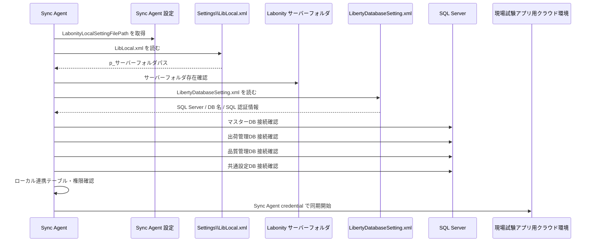

### 20.7 フォールバック禁止

Labonity 既存実装では、設定ファイルが見つからない場合に既定値を使う箇所がある。しかし Sync Agent では、誤った DB へ同期するリスクを避けるため、既定値へのフォールバックを禁止する。

| 状態 | Sync Agent の処理 |
|---|---|
| `LabonityLocalSettingFilePath` 未設定 | 起動エラー。同期しない。 |
| `LibLocal.xml` が存在しない | 起動エラー。同期しない。 |
| `p_サーバーフォルダパス` が空 | 起動エラー。同期しない。 |
| サーバーフォルダへアクセスできない | 起動エラーまたは同期停止。 |
| `LibertyDatabaseSetting.xml` が存在しない | 起動エラー。同期しない。 |
| SQLサーバー名またはDB名が空 | 起動エラー。同期しない。 |
| DB接続失敗 | 同期停止。管理ログに記録する。 |
| 必要テーブルなし | マイグレーション対象または起動エラー。 |
| 権限不足 | 同期停止。管理者確認対象。 |

### 20.8 写真保存フォルダのパス指定

写真保存先は Sync Agent 設定で指定する。固定パスにはしない。

| 設定項目 | 内容 |
|---|---|
| `WriterRootPath` | Sync Agent が実際に JPEG を書き込むルートパス。ローカルディスクまたは UNC パス。 |
| `LabonityVisibleRootPath` | Labonity クライアントが画像を開くためのルートパス。複数端末運用では UNC 共有パス。 |
| `FolderTemplate` | 出荷別フォルダの命名規則。 |
| `FileNameTemplate` | JPEG ファイル名の命名規則。 |
| `RequireUncVisiblePathForMultiClient` | 複数クライアント運用時に UNC 共有パスを必須にするか。 |

推奨設定:

```json
{
  "FieldPhotoExport": {
    "WriterRootPath": "D:\\LabonityFieldPhotos",
    "LabonityVisibleRootPath": "\\\\labonity-server\\LabonityFieldPhotos",
    "RequireUncVisiblePathForMultiClient": true
  }
}
```

この場合、Sync Agent は `D:\LabonityFieldPhotos` に書き込み、DB には Labonity クライアントが読める `\\labonity-server\LabonityFieldPhotos\...` を保存する。

単一 PC 構成では次のように同一パスでもよい。

```json
{
  "FieldPhotoExport": {
    "WriterRootPath": "D:\\LabonityFieldPhotos",
    "LabonityVisibleRootPath": "D:\\LabonityFieldPhotos",
    "RequireUncVisiblePathForMultiClient": false
  }
}
```

### 20.9 FieldPhotoLocalFile のパス項目

`FieldPhotoLocalFile` には、Sync Agent 用の書込パスと Labonity 用の参照パスを分けて保存できるようにする。

| 項目 | 説明 |
|---|---|
| `writer_file_path` | Sync Agent が実際に書き込んだファイルパス。サーバーローカルパスでもよい。 |
| `local_file_path` | Labonity が参照するファイルパス。複数クライアント運用では UNC パス。 |
| `writer_root_path` | 出力時点の `WriterRootPath`。 |
| `visible_root_path` | 出力時点の `LabonityVisibleRootPath`。 |
| `relative_path` | ルートからの相対パス。ルート変更時の再マッピングに使う。 |
| `path_kind` | `local_disk` / `unc`。 |
| `path_status` | `ready` / `missing` / `inaccessible` / `moved`。 |

Labonity は `local_file_path` を使用する。`writer_file_path` は Sync Agent の再検証、再エクスポート、削除処理に使用する。

### 20.10 Sync Agent 起動時ヘルスチェック

Sync Agent 起動時に、同期開始前のヘルスチェックを行う。

| No | チェック | 失敗時 |
|---|---|---|
| 1 | `LabonityLocalSettingFilePath` が設定されている。 | 起動エラー。 |
| 2 | `LibLocal.xml` が存在し、XML として読める。 | 起動エラー。 |
| 3 | `p_サーバーフォルダパス` が取得できる。 | 起動エラー。 |
| 4 | サーバーフォルダへアクセスできる。 | 起動エラー。 |
| 5 | `LibertyDatabaseSetting.xml` が存在し、XML として読める。 | 起動エラー。 |
| 6 | SQL Server 接続情報と DB 名が揃っている。 | 起動エラー。 |
| 7 | 各 DB へ接続できる。 | 同期停止。 |
| 8 | 必要テーブルが存在する、またはマイグレーション可能。 | 同期停止。 |
| 9 | 写真 `WriterRootPath` へ書き込める。 | 写真エクスポート停止。 |
| 10 | `LabonityVisibleRootPath` が複数クライアント向けに妥当である。 | 警告または写真エクスポート停止。 |
| 11 | 空き容量がしきい値以上である。 | 警告または写真エクスポート停止。 |
| 12 | 同一 `tenant_id + plant_id` の他 Sync Agent が active でない。 | 同期停止。 |
| 13 | クラウド Sync Agent credential が有効である。 | クラウド同期停止。 |

### 20.11 二重起動防止

サーバー配置を標準にしても、誤って別サーバーまたはクライアント PC に Sync Agent がインストールされる可能性がある。そのため、二重起動防止を実装する。

| 方式 | 内容 |
|---|---|
| ローカル DB リース | `FieldSyncAgentLease` に `tenant_id + plant_id + agent_id + machine_name + heartbeat_at` を保存する。 |
| クラウド heartbeat | クラウド側にも agent heartbeat を送り、同一スコープの複数 active を検知する。 |
| 起動時判定 | 他 agent の heartbeat が有効期限内なら起動を拒否する。 |
| 手動解除 | 管理者が停止済み agent の lease を解除できる。 |
| 強制起動 | 障害時のみ管理者権限で強制起動できる。強制起動は監査ログに残す。 |

### 20.12 サービスアカウントと権限

Sync Agent は専用サービスアカウントで実行することを推奨する。

| 対象 | 必要権限 |
|---|---|
| `Settings\LibLocal.xml` | 読み取り。 |
| Labonity サーバーフォルダ | 読み取り。 |
| `LibertyDatabaseSetting.xml` | 読み取り。 |
| SQL Server | 参照データ読み取り、連携テーブルの作成・更新・参照。可能なら同期専用 SQL ユーザーを用意する。 |
| 写真 `WriterRootPath` | 作成、書き込み、リネーム、削除または論理削除マーカー作成。 |
| 写真 `LabonityVisibleRootPath` | Labonity クライアント利用者が読み取り可能。Sync Agent も到達確認できることが望ましい。 |
| ログフォルダ | 書き込み。 |

SQL パスワードやクラウド credential は Labonity クライアント PC に配布しない。

### 20.13 セキュリティルール

```text
LibertyDatabaseSetting.xml の内容をログへ出力しない。
接続文字列をログへ出す場合、Password は必ずマスクする。
Sync Agent 管理画面でも SQL パスワードは表示しない。
LibLocal.xml のパスとサーバーフォルダパスは表示してよいが、共有権限に注意する。
Sync Agent credential はサーバー上で保護し、Labonity デスクトップアプリには渡さない。
写真出力先は改ざん防止のため、Sync Agent は書込、Labonity 利用者は読取を基本にする。
```

### 20.14 管理画面・診断表示

Sync Agent 管理画面または診断ログでは、次を確認できるようにする。

| 表示項目 | 内容 |
|---|---|
| Agent 状態 | running / stopped / degraded / error。 |
| インストール先 | machine name、service account、install mode。 |
| LibLocal.xml | 指定パス、存在確認、最終読込日時。 |
| サーバーフォルダ | 解決された `p_サーバーフォルダパス`、到達可否。 |
| DB 設定 | SQL Server 名、DB 名。パスワードは表示しない。 |
| DB 接続 | マスターDB、出荷管理DB、品質管理DB、共通設定DBの接続結果。 |
| 写真出力 | `WriterRootPath`、`LabonityVisibleRootPath`、書込可否、空き容量。 |
| 同期状況 | 最終同期時刻、checkpoint、未処理イベント数、失敗数。 |
| 写真ジョブ | 未処理、処理中、失敗、再試行待ち、最終エラー。 |
| 二重起動 | lease 状態、heartbeat、他 agent 検知状況。 |
| クラウド接続 | credential 有効性、最終 API 成功時刻。 |

### 20.15 運用手順

初期設定の標準手順は次の通りである。

```text
1. Labonity サーバーを確認する。
2. Sync Agent を Labonity サーバーへインストールする。
3. Sync Agent 専用サービスアカウントを設定する。
4. Sync Agent 設定で LabonityLocalSettingFilePath を指定する。
5. Sync Agent が LibLocal.xml からサーバーフォルダを読めることを確認する。
6. LibertyDatabaseSetting.xml から DB 接続情報を解決できることを確認する。
7. 写真保存先 WriterRootPath を指定する。
8. 複数クライアント運用の場合、LabonityVisibleRootPath に UNC 共有パスを指定する。
9. クラウド同期用 credential を設定する。
10. 起動時ヘルスチェックを実行する。
11. 当日・翌日分の予定・出荷実績同期を確認する。
12. テスト写真を撮影し、出荷別 JPEG が生成され、Labonity から開けることを確認する。
```

### 20.16 障害時の扱い

| 障害 | 処理 |
|---|---|
| サーバー再起動 | Windows Service 自動起動。checkpoint から再開する。 |
| `LibLocal.xml` 参照不可 | 同期停止。管理者に設定確認を促す。 |
| サーバーフォルダ参照不可 | 同期停止。共有権限またはネットワーク確認。 |
| DB接続不可 | 同期停止。一定間隔で再試行し、管理ログに出す。 |
| 写真出力先書込不可 | 写真エクスポート停止。メタデータ同期と OCR結果同期は継続可能にするか設定で選択する。 |
| `LabonityVisibleRootPath` 到達不可 | 警告。複数クライアント運用では写真表示不可になるため管理者確認対象。 |
| 容量不足 | 写真エクスポート停止または古いキャッシュ整理。クラウド Blob を正本として保持する。 |
| 二重 agent 検知 | 後から起動した agent を停止する。 |
| DB 設定変更 | Sync Agent 再起動または手動再読込後、全ヘルスチェックを再実行する。 |

### 20.17 Sync Agent 配置・DB 接続解決のルール

```text
Sync Agent は本番運用では Labonity サーバーにインストールする。
Labonity クライアント PC ごとの Sync Agent インストールは行わない。
Sync Agent は Labonity の Settings\LibLocal.xml を起点に DB 接続情報を解決する。
Sync Agent は LibLocal.xml から p_サーバーフォルダパスを読み、サーバーフォルダ配下の LibertyDatabaseSetting.xml を読む。
Sync Agent は設定ファイル不足や DB 接続失敗時に既定値へフォールバックしない。
写真保存先は Sync Agent 設定で指定する。
複数 Labonity クライアントで写真を見る場合、Labonity が参照する local_file_path は UNC 共有パスを標準にする。
Sync Agent は writer_file_path と Labonity 用 local_file_path を分離して管理できる。
同一 tenant_id + plant_id に対して有効な Sync Agent は 1 つに制御する。
本設計の Blob Storage、OCR事前実行、ローカルDB参照、HTTP / Named Pipe 非使用、出荷別 JPEG 自動保存の方針は維持する。
```

---

## 21. Sync Agent 非人間主体認証・Agent credential 詳細設計

### 21.1 結論

現場試験 Web アプリは Liberty Account の個人認証を使用する。一方、Labonity サーバーに常駐する Sync Agent は、個人アカウントではなく **Agent credential** によって認証する。

```text
React Web アプリ
  -> 個人ログイン
  -> accountId / orgId / Grant / Role / permission
  -> /api/core/v1/... を利用

Sync Agent
  -> 非対話認証
  -> orgId / plantId / agentId / scope
  -> /api/sync/v1/... のみ利用

Labonity デスクトップ
  -> クラウド認証なし
  -> ローカルDB + ローカル写真ファイルのみ参照
```

この分離により、常駐サービスが個人 refresh token に依存して停止するリスク、退職・異動・パスワード変更・MFA によって同期が止まるリスク、誰の操作か分からない監査リスクを避ける。

### 21.2 認証主体の定義

| 認証主体 | 例 | 用途 | 禁止事項 |
|---|---|---|---|
| `accountId` | `account:USER-001` | Web アプリ利用者。予定・出荷・写真の閲覧、写真登録、管理操作。 | サーバー常駐 Sync Agent の認証には使用しない。 |
| `agentId` | `agent:AGENT-001` | Labonity サーバー上の Sync Agent。DB同期、イベント取得、写真取得、ACK。 | 現場アプリ画面 API や管理 API を任意に呼び出させない。 |
| `orgId` | `ORG-001` | テナント・組織スコープ。 | 組織そのものをログイン主体にしない。 |
| `plantId` | `KOZYO-001` | 工場スコープ。予定No・出荷No混線を防ぐ。 | agent に許可されていない plantId の同期をさせない。 |

### 21.3 Agent credential の構成

認証基盤の実装に合わせ、Agent credential は次のいずれかの形で実装できる。

| 方式 | 内容 | 初期リリース適性 |
|---|---|---|
| client_id + client_secret | Client Credentials 相当。実装しやすい。secret 保護とローテーションが必要。 | 高い。標準候補。 |
| 初回登録コード + credential 引換 | 管理者が短時間・一回限りの登録コードを発行し、Sync Agent が正式 credential に引き換える。 | 高い。初期設定を簡単にできる。 |
| クライアント証明書 / mTLS | agent と証明書を紐づける。セキュリティは高いが証明書管理が必要。 | 将来拡張。 |
| 固定 API key 直接送信 | 各同期 API に API key を直接付ける。 | 標準採用しない。例外的な暫定運用も避ける。 |

本設計では、実装方式にかかわらず次を満たすものを Agent credential と呼ぶ。

```text
agentId に紐づく。
orgId + plantId に紐づく。
許可 scope を持つ。
発行、失効、再発行、ローテーションできる。
監査できる。
同期 API へ直接恒久利用するのではなく、短命 access token を取得するために使う。
```

### 21.4 Agent registration

クラウド側には Agent registration を持たせる。

テーブル名例: `SyncAgentRegistration`

| 項目 | 説明 |
|---|---|
| `agent_id` | Agent ID。 |
| `tenant_id` | orgId。 |
| `plant_id` | 工場 ID。 |
| `agent_name` | 管理画面表示名。例: `ABC本社 Labonity Server Sync Agent`。 |
| `install_machine_name` | インストール先サーバー名。初期登録時または heartbeat で記録。 |
| `install_mode` | `labonity_server` / `single_pc` / `migration` 等。 |
| `allowed_scopes` | `FieldTest.Sync.Import` 等。 |
| `status` | `active` / `disabled` / `revoked` / `pending_setup`。 |
| `registered_by` | 登録した管理者 accountId。 |
| `registered_at` | 登録日時。 |
| `last_heartbeat_at` | 最終 heartbeat。 |
| `last_token_issued_at` | 最終 token 発行日時。 |
| `credential_version` | credential ローテーション管理用。 |
| `created_at` / `updated_at` | 作成・更新日時。 |

### 21.5 Agent credential 管理

テーブル名例: `SyncAgentCredential`

| 項目 | 説明 |
|---|---|
| `credential_id` | credential ID。 |
| `agent_id` | 紐づく Agent。 |
| `credential_type` | `client_secret` / `registration_code` / `certificate`。 |
| `secret_hash` | secret のハッシュ。平文 secret は保存しない。 |
| `status` | `active` / `pending` / `expired` / `revoked`。 |
| `valid_from` / `valid_to` | 有効期間。 |
| `last_used_at` | 最終使用日時。 |
| `rotated_from_credential_id` | ローテーション元。 |
| `created_by` | 発行した管理者 accountId。 |
| `created_at` | 発行日時。 |
| `revoked_by` / `revoked_at` | 失効操作。 |

初回登録コードを credential と同じテーブルで扱う場合、`credential_type = registration_code` とし、`valid_to` を短く、使用回数を 1 回に制限する。

### 21.6 Sync Agent token 取得と API 呼び出し

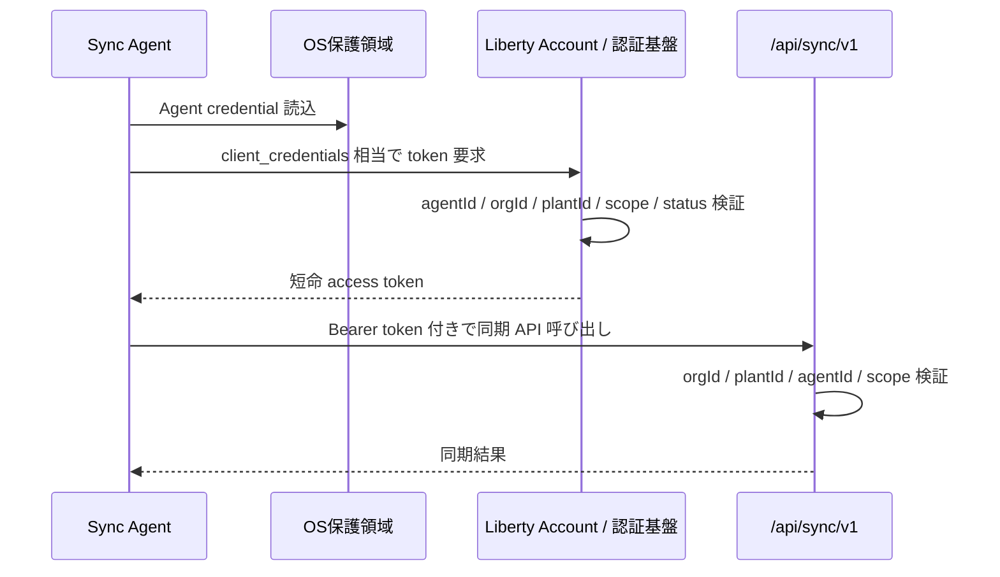

access token の期限が切れた場合、Sync Agent は Agent credential で再取得する。refresh token は使用しない。

### 21.7 API 認可ルール

| API | Web 個人 token | Sync Agent token |
|---|---:|---:|
| `/api/core/v1/orgs/{orgId}/shipping-schedules` | 許可 | 禁止 |
| `/api/core/v1/orgs/{orgId}/shipments` | 許可 | 禁止 |
| `/api/core/v1/orgs/{orgId}/photos/upload-sessions` | 許可 | 禁止 |
| `/api/core/v1/orgs/{orgId}/photos/{photoAssetId}/commit` | 許可 | 禁止 |
| `/api/sync/v1/orgs/{orgId}/field-sites/import` | 禁止 | 許可 |
| `/api/sync/v1/orgs/{orgId}/shipping-schedules/import` | 禁止 | 許可 |
| `/api/sync/v1/orgs/{orgId}/shipments/import` | 禁止 | 許可 |
| `/api/sync/v1/orgs/{orgId}/photo-reference-events` | 禁止 | 許可 |
| `/api/sync/v1/orgs/{orgId}/ocr-result-events` | 禁止 | 許可 |
| `/api/sync/v1/orgs/{orgId}/photos/{photoAssetId}/download-url` | 禁止 | 許可 |
| `/api/admin/v1/.../agents` | 管理者のみ許可 | 禁止 |

原則として、Web 個人 token と Sync Agent token で利用できる API を分離する。例外を作る場合は、個別の認可理由と監査要件を明記する。

### 21.8 管理画面に必要な Agent 操作

| 操作 | 権限 | 監査 |
|---|---|---|
| Agent 登録 | `FieldTest:Agent:Manage` | `accountId`, `orgId`, `plantId`, `agentId`。 |
| 初回登録コード発行 | `FieldTest:Agent:Manage` | secret 本体は記録しない。 |
| credential 再発行 | `FieldTest:Agent:Manage` | 再発行理由、旧 credential ID、新 credential ID。 |
| credential 失効 | `FieldTest:Agent:Manage` | 失効理由、失効日時。 |
| Agent 無効化 | `FieldTest:Agent:Manage` | 以後 token 発行不可。 |
| Agent heartbeat 確認 | `FieldTest:Admin:Manage` | 参照操作として記録。 |
| 二重 agent lease 解除 | `FieldTest:Admin:Manage` | 強制操作として記録。 |

### 21.9 Sync Agent 設定例

```json
{
  "Labonity": {
    "DatabaseConfigMode": "LibLocal",
    "LabonityLocalSettingFilePath": "C:\\Labonity\\Settings\\LibLocal.xml"
  },
  "FieldPhotoExport": {
    "WriterRootPath": "D:\\LabonityFieldPhotos",
    "LabonityVisibleRootPath": "\\\\labonity-server\\LabonityFieldPhotos",
    "RequireUncVisiblePathForMultiClient": true
  },
  "CloudSync": {
    "OrgId": "ORG-001",
    "PlantId": "KOZYO-001",
    "AgentId": "AGENT-001",
    "TokenEndpoint": "{LibertyAccountTokenEndpoint}",
    "SyncApiBaseUrl": "https://.../api/sync/v1",
    "CredentialStore": "WindowsCredentialManager",
    "TokenRefreshBeforeExpirySeconds": 300
  }
}
```

設定ファイルには client secret を平文保存しない。client secret または同等 credential は OS 保護領域へ保存し、設定ファイルには参照キーだけを持たせる。

### 21.10 エラー時の扱い

| 状態 | 処理 |
|---|---|
| Agent credential 未設定 | クラウド同期を開始しない。管理画面に未設定として表示する。 |
| token 取得失敗 | DB import、event pull、ACK、写真 download-url 取得を行わない。再試行し、最終エラーを記録する。 |
| credential 失効 | 同期停止。管理者に credential 再発行を促す。 |
| scope 不足 | 該当 API を呼ばない。設定ミスとして記録する。 |
| orgId / plantId 不一致 | API 側で拒否する。重大な設定不整合として監査ログに残す。 |
| access token 期限切れ | Agent credential で再取得する。refresh token は使用しない。 |
| secret 漏えい疑い | credential 失効、再発行、Agent heartbeat 確認、必要に応じて同期停止。 |

### 21.11 監査ログの actor 分離

人間の操作例:

```json
{
  "actorType": "user",
  "accountId": "USER-001",
  "orgId": "ORG-001",
  "plantId": "KOZYO-001",
  "operation": "photo_commit",
  "photoAssetId": "PHOTO-001"
}
```

Sync Agent の操作例:

```json
{
  "actorType": "agent",
  "agentId": "AGENT-001",
  "orgId": "ORG-001",
  "plantId": "KOZYO-001",
  "operation": "shipment_import",
  "sourceTable": "SyukkaDataMain",
  "count": 120
}
```

### 21.12 Agent credential 認証のルール

```text
現場試験 Web アプリは個人認証で利用する。
Sync Agent は個人認証ではなく、agentId を認証主体とする。
Sync Agent は orgId + plantId + agentId に紐づく Agent credential で短命 access token を取得する。
Sync Agent は個人の refresh token、個人パスワード、MFA セッションを保持しない。
Sync Agent credential で利用できる API は /api/sync/v1/... のみに限定する。
POST 用キー相当の仕組みを使う場合も、Agent credential または初回登録コードとして発行・失効・ローテーション・監査できる形にする。
Agent 登録、credential 発行・失効・再発行は管理者の個人ログインで行う。
人間操作は accountId、Sync Agent 操作は agentId で監査する。
本設計の写真 Blob 保存、OCR事前実行、ローカルDB参照、HTTP / Named Pipe 非使用、出荷別 JPEG 自動保存、Sync Agent サーバー配置、LibLocal.xml 起点 DB 接続、写真フォルダ指定の方針は維持する。
```

---

## 22. 出荷管理DB FieldTestスキーマ追加テーブル DDL 方針

### 22.1 配置

本機能で追加するローカル連携テーブルは、すべて既存の出荷管理DB内の `FieldTest` スキーマに作成する。既存の `NaDat` 出荷管理テーブル、`MsDat` 現場マスター、`ExDat` TP採取結果入力テーブルは変更しない。

### 22.2 マイグレーション方針

| 項目 | 方針 |
|---|---|
| 実行 DB | `p_出荷管理データベース名` で解決した既存出荷管理DB（通常 `NaDat`）。 |
| 実行タイミング | Sync Agent インストール時、または Labonity 更新モジュール適用時。 |
| 権限 | 初回作成時は DDL 権限が必要。運用時の Sync Agent は対象テーブルの SELECT / INSERT / UPDATE 権限を持つ。 |
| 冪等性 | `OBJECT_ID` と `sys.indexes` を確認し、既存テーブル・既存インデックスがあれば再作成しない。 |
| 既存 DB 変更 | 既存 Labonity テーブルには列追加しない。 |
| バックアップ | 既存出荷管理DBの通常バックアップに含める。 |

### 22.3 参考 SQL

DDL 参考スクリプトは別ファイル `09_現場試験アプリ_ローカル連携テーブル定義_第2.2版.sql` として出力する。設計上のテーブル定義は本文の各テーブルレイアウトを正とし、実装時は実環境の SQL Server バージョン、照合順序、既存命名規則に合わせて調整する。

対象テーブルは次の通りである。

- `[FieldTest].[FieldPhotoReference]`
- `[FieldTest].[FieldPhotoLocalFile]`
- `[FieldTest].[FieldPhotoMaterializeJob]`
- `[FieldTest].[FieldPhotoExportConfig]`
- `[FieldTest].[FieldOcrResultReference]`
- `[FieldTest].[FieldOcrResultFieldReference]`
- `[FieldTest].[FieldOcrImportAudit]`
- `[FieldTest].[FieldOcrValidationRule]`
- `[FieldTest].[FieldSyncCheckpoint]`
- `[FieldTest].[FieldSyncLog]`
- `[FieldTest].[FieldSyncAgentHealth]`
- `[FieldTest].[FieldSyncAgentLease]`

### 22.4 DB設定XMLとの関係

- `LibertyDatabaseSetting.xml` の形式は変更しない。
- 出荷管理DB名は既存の `p_出荷管理データベース名` を使用する。
- 連携用スキーマ名は Sync Agent 設定 `LocalIntegrationSchemaName`（既定値 `FieldTest`）で管理する。
- 実装・導入時に `CREATE SCHEMA [FieldTest] AUTHORIZATION [dbo]` と12テーブルのマイグレーションを適用する。
- スキーマ・テーブル・権限が不足している場合、Sync Agent は同期を開始しない。
