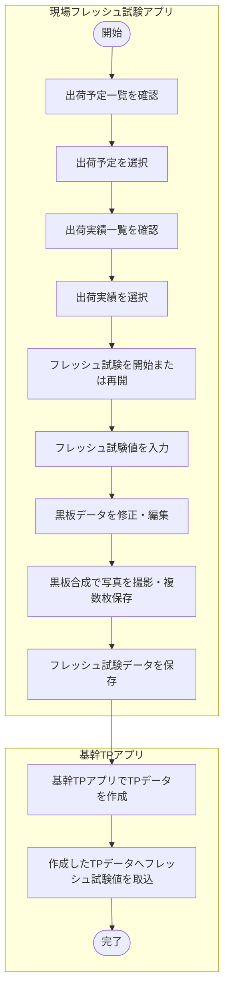
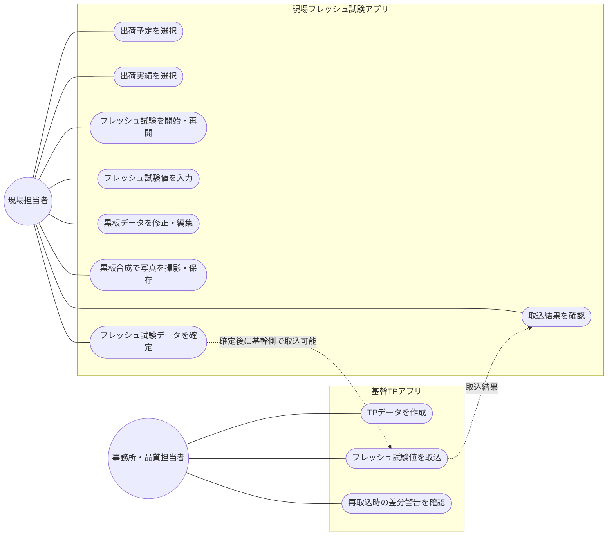
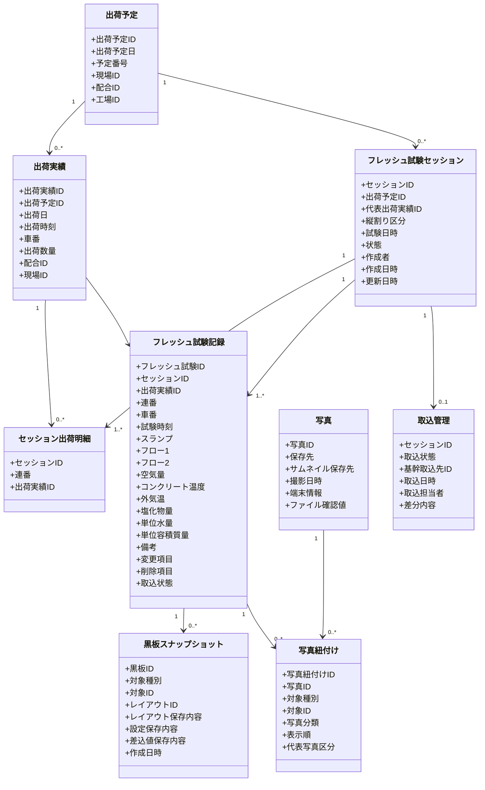
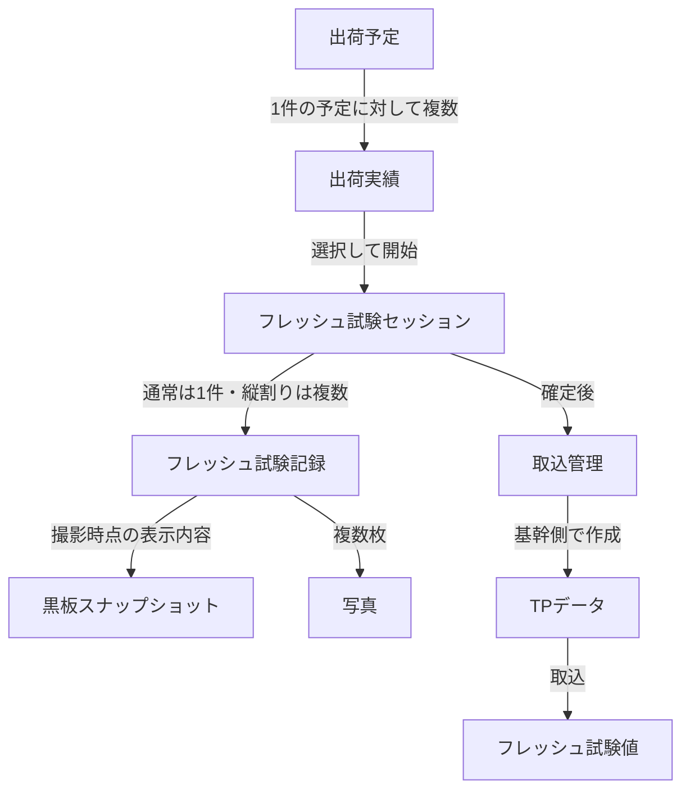
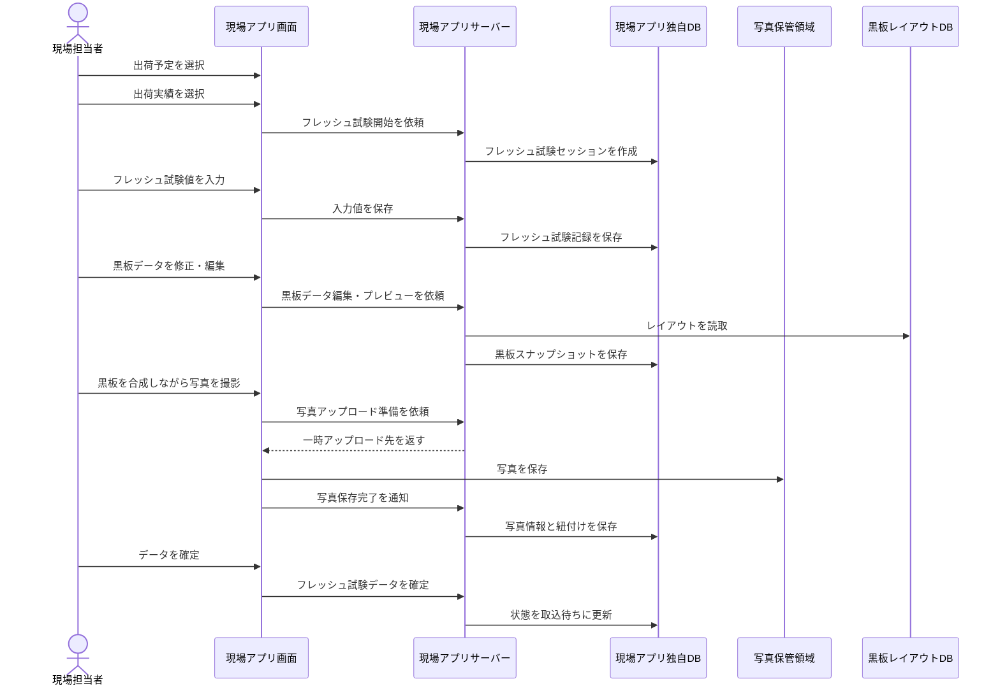
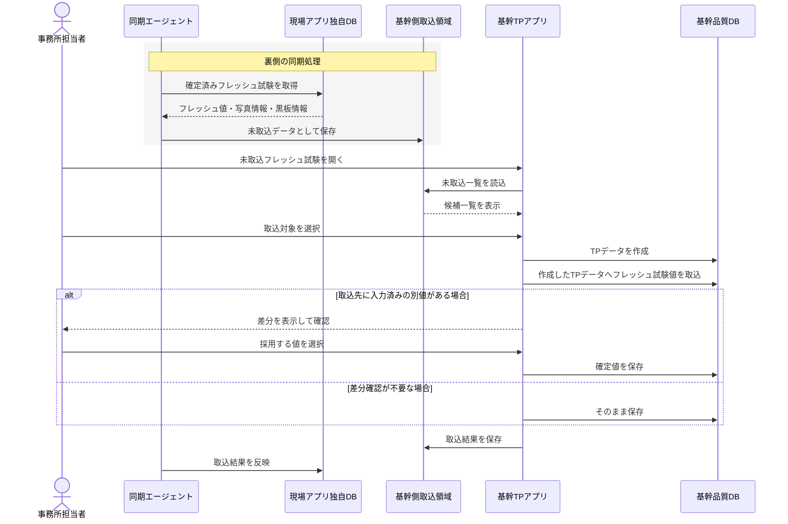
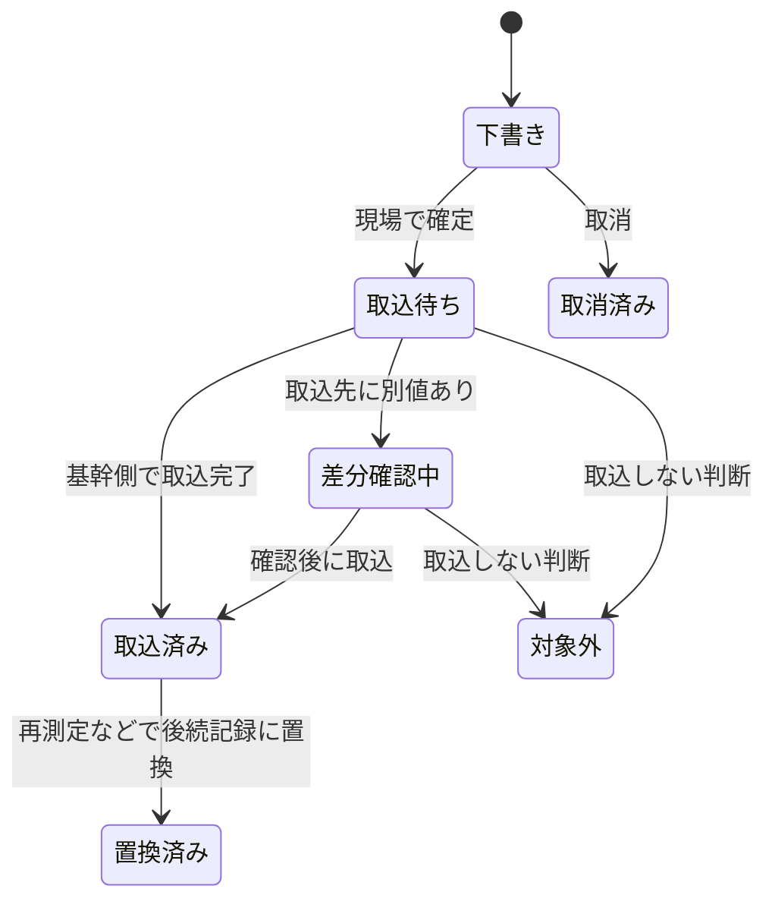
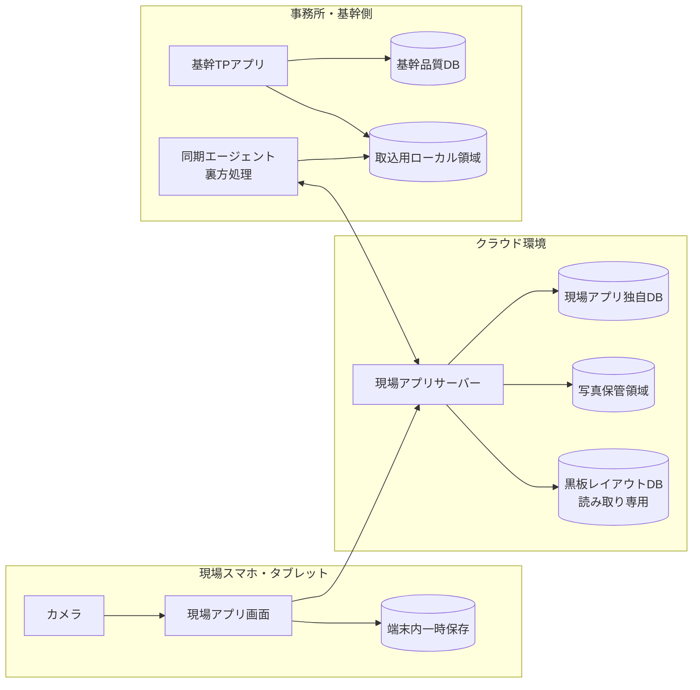
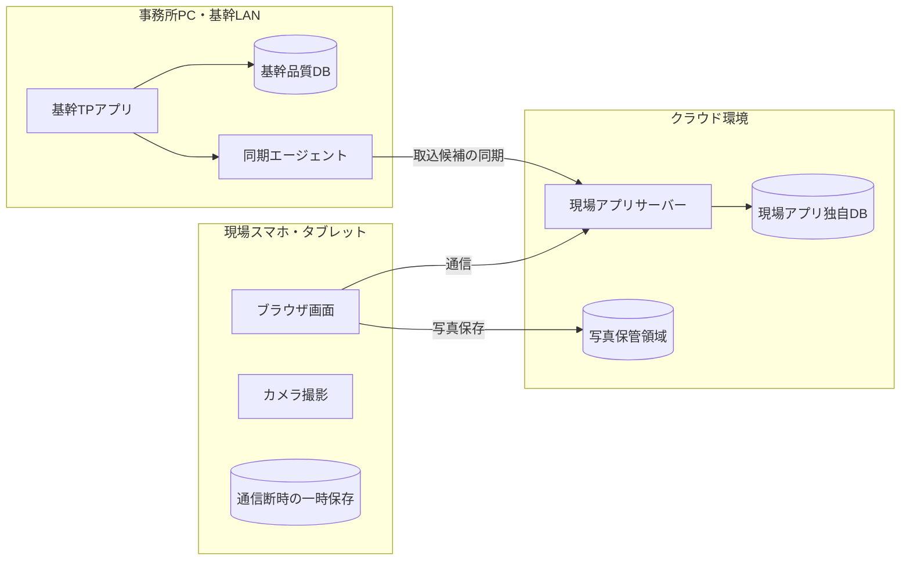
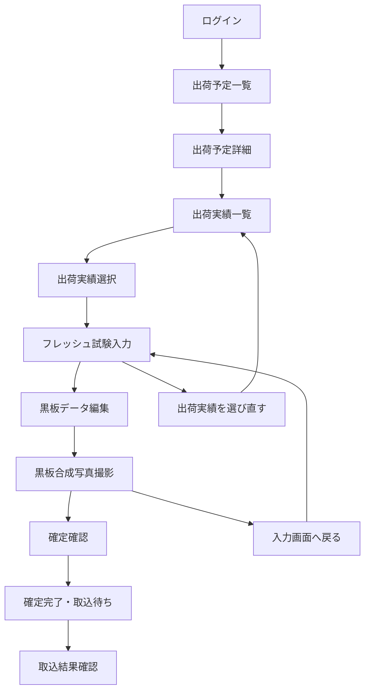

# 現場フレッシュ試験アプリ

現場アプリ側では、TP データの有無を前提条件にせず、**出荷予定 → 出荷実績 → フレッシュ試験登録 → 黒板・写真 → 確定**の流れで整理しています。  
TP データは、最後に基幹 TP アプリ側で作成し、その作成した TP データへフレッシュ試験値を取り込む位置づけです。

---

## 1. 業務フロー図：現場から基幹取込まで

---

## 2. ユースケース図

同期エージェントは業務担当者が操作する機能ではないため、このユースケース図では actor として出していません。  
未取込データの受け渡しは、後続のシーケンス図・構成図で裏側の仕組みとして表現します。

---

## 3. クラス図：現場アプリ側の主要データ

この図では、現場アプリが直接扱う独自データを中心にしています。  
TP データ本体の構造は基幹 TP アプリ側の責務なので、ここでは詳細化していません。

---

## 4. データ関連図：出荷実績に紐づくフレッシュ試験

---

## 5. シーケンス図：現場でフレッシュ試験を登録する流れ

---

## 6. シーケンス図：基幹TPアプリで取り込む流れ

同期エージェントは、基幹 TP アプリの画面操作ではなく、クラウド側のフレッシュ試験を基幹側へ渡す裏方として扱います。  
基幹 TP アプリの利用者は、同期済みの未取込フレッシュ試験を確認し、TP データを作成してから値を取り込みます。

---

## 7. 状態遷移図：フレッシュ試験セッション

---

## 8. 構成図：アプリとデータの配置

---

## 9. 配置図：利用環境

---

## 10. 画面遷移図

---

## 補足：差分確認の扱い

「差分確認」は、通常の流れでは目立たせない例外処理です。  
基幹 TP アプリ側で TP データを新しく作成して、そのままフレッシュ試験値を取り込む運用であれば、ほとんど発生しません。  
ただし、次のような場合に備えて最低限の確認導線を残す想定です。

- 基幹側で先にスランプ・空気量・温度などが入力されており、現場アプリの値と異なる場合
- 同じフレッシュ試験を再送または二重取込しそうになった場合
- 現場側で「削除した項目」として送った値を、基幹側の既存値から消してよいか確認する場合

初期リリースで運用を単純にする場合は、差分確認画面を詳細機能にせず、取込時の確認メッセージまたは管理者向け機能として扱えば十分です。
